# Jetpack 教程

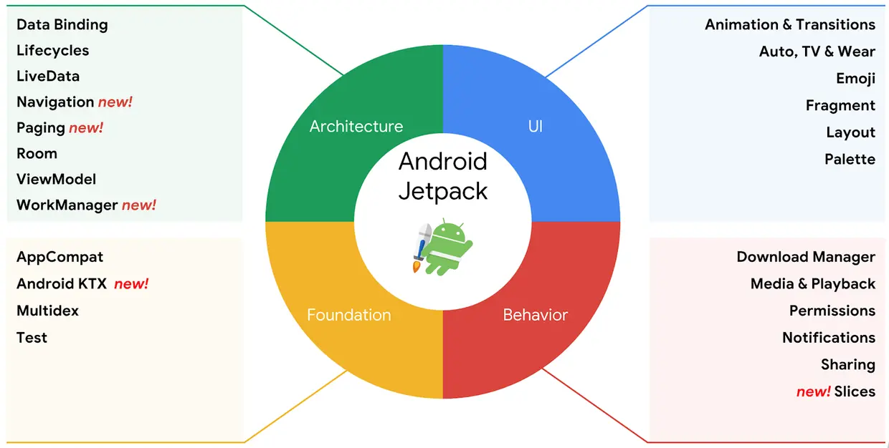

### 1. Architecture Components（架构组件）

| 组件             | 核心功能                                                    |
| ---------------- | ----------------------------------------------------------- |
| **Data Binding** | 声明式UI绑定，将数据自动同步到界面元素，减少模板代码。      |
| **Lifecycles**   | 管理Activity/Fragment生命周期，避免内存泄漏和复杂回调。     |
| **LiveData**     | 具有生命周期感知的数据持有者，数据变化时自动更新UI。        |
| **Navigation**   | 统一应用内导航逻辑，支持可视化路由和深层链接。              |
| **Paging**       | 分页加载数据，优化大数据集处理（如RecyclerView）。          |
| **Room**         | SQLite抽象层，提供编译时SQL校验和ORM支持。                  |
| **ViewModel**    | 管理UI相关数据， survives配置变更（如屏幕旋转），支持MVVM。 |
| **WorkManager**  | 可靠的后台任务调度，支持延迟执行和约束条件（如网络状态）。  |

------

### 2. Foundation（基础组件）

| 组件             | 核心功能                                        |
| ---------------- | ----------------------------------------------- |
| **Android KTX**  | Kotlin扩展库，简化API调用（如协程、扩展函数）。 |
| **AppCompat**    | 向后兼容新特性（如Material Design组件）。       |
| **Auto/TV/Wear** | 分别支持车载、电视和智能手表应用的开发。        |
| **Benchmark**    | 性能测试工具，检测代码执行效率。                |
| **Multidex**     | 解决64K方法数限制，支持多DEX文件。              |
| **Security**     | 加密文件和SharedPreferences的安全存储。         |
| **Test**         | 提供单元测试和UI测试框架（如Espresso）。        |

------

### 3. Behavior Components（行为组件）

| 组件                 | 核心功能                                         |
| -------------------- | ------------------------------------------------ |
| **CameraX**          | 简化相机开发，兼容旧设备，支持人像、HDR等模式。  |
| **DownloadManager**  | 系统级后台下载服务，支持断点续传和状态监听。     |
| **Media & Playback** | 统一媒体播放API（支持音频/视频/Google Cast）。   |
| **Notifications**    | 兼容通知功能，支持穿戴设备和车载系统。           |
| **Permissions**      | 简化运行时权限请求和检查。                       |
| **Preferences**      | 快速构建用户设置界面，支持数据持久化。           |
| **Sharing**          | 集成系统分享功能（如分享到社交平台）。           |
| **Slices**           | 动态UI模板，可在搜索栏等系统级位置显示应用内容。 |

------

### 4. UI Components（界面组件）

| 组件                | 核心功能                                                 |
| ------------------- | -------------------------------------------------------- |
| **Animation**       | 视图动画和过渡效果（如共享元素过渡）。                   |
| **Emoji**           | 提供最新表情符号支持，无需系统更新。                     |
| **Fragment**        | 模块化UI组件，简化Activity复杂界面的管理。               |
| **Layout**          | 通过XML或代码声明界面结构（如ConstraintLayout）。        |
| **Palette**         | 从图像提取主题色，动态适配UI风格。                       |
| **Jetpack Compose** | *（补充）* 声明式UI框架，替代传统XML布局，提高开发效率。 |

------

### **关键优势**

- **标准化**：Google官方推荐，减少兼容性问题。
- **生产力**：减少模板代码（如LiveData+ViewModel替代Handler/AsyncTask）。
- **健壮性**：内置生命周期管理，降低崩溃风险。
- **模块化**：按需引入，避免APK膨胀。

# 一 Jetpack Compose

>随着 Android 开发技术的不断演进，用户界面的构建方式也经历了从传统的 XML 布局到 Jetpack Compose 的变革性转变。Jetpack Compose 是谷歌推出的一套全新的声明式 UI 框架，逐渐成为 Android 开发的主流趋势。那么，它与传统的 XML 布局究竟有哪些区别？让我们从多个角度进行全面解析。
>

------

## 1.1 介绍

### Jetpack Compose vs. 传统 XML 布局对比

| **对比维度**   | **Jetpack Compose**                                          | **传统 XML 布局**                                            |
| -------------- | ------------------------------------------------------------ | ------------------------------------------------------------ |
| **编程模型**   | **声明式**：描述 UI 最终状态，自动响应状态变化。             | **命令式**：手动操作视图树，显式更新 UI。                    |
| **开发方式**   | 纯 Kotlin 代码，逻辑与 UI 无缝结合。                         | XML 定义布局 + Java/Kotlin 处理逻辑，需手动绑定。            |
| **性能**       | 更优： - 直接 Canvas 渲染，减少层级嵌套。 - 动画和状态高效更新。 | 依赖优化： - 深层次 View 树可能影响性能。 - 动画需额外处理。 |
| **可维护性**   | 高： - 组件化复用。 - 状态驱动减少冗余代码。                 | 低： - XML 易臃肿。 - 修改需同步逻辑和布局。                 |
| **动画支持**   | 原生支持，简洁 API（如 `AnimatedVisibility`）。              | 依赖 `ViewPropertyAnimator` 或第三方库。                     |
| **生态与工具** | 现代化： - 支持跨平台（Desktop、Multiplatform）。 - 官方持续更新。 | 成熟但停滞： - 社区资源多，但新特性有限。                    |
| **适用场景**   | ✅ 新项目、动态界面、复杂交互、高频迭代。                     | ✅ 旧项目维护、简单静态页面、团队传统开发流程。               |

------

### 核心差异总结

1. **思维模式**
   - Compose 通过状态驱动 UI，开发者关注 **“是什么”**（Declarative）。
   - XML 布局需手动控制 **“如何做”**（Imperative），如 `findViewById` 和 `setText`。
2. **开发效率**
   - Compose 减少模板代码（如不再需要 XML 文件），Kotlin 特性（如 Lambda）提升代码简洁性。
   - XML 布局需维护多文件，修改时需跨文件同步。
3. **未来趋势**
   - Compose 是谷歌主推的现代框架，尤其适合动态化、跨平台需求。
   - XML 布局仍适用于兼容旧项目，但新功能开发逐渐转向 Compose。

------

### 代码对比

- jetpack Compose

```kotlin
@Composable
fun NetworkStatusScreen(isConnected: Boolean) {
    Box(
        modifier = Modifier.fillMaxSize(),
        contentAlignment = Alignment.Center
    ) {
        Text(
            text = if (isConnected) "当前网络已连接" else "当前网络未连接",
            style = MaterialTheme.typography.headlineMedium,
        )
    }
}
```

- xml

```xml
  <TextView
            android:id="@+id/tv_title"
            android:layout_width="match_parent"
            android:layout_height="wrap_content"
            android:layout_margin="10dp"
            android:gravity="center"
            android:text="@string/app_title"
            android:textColor="#333"
            android:textSize="16sp" />
```

## 1.2 开发准备工作

- AndroidStudio下载地址：https://developer.android.google.cn/studio?hl=zh-cn
- 无脑安装下一步

### 先建项目

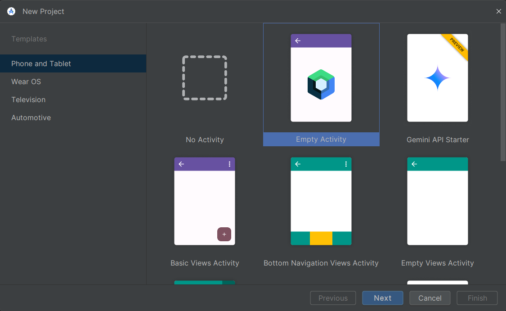

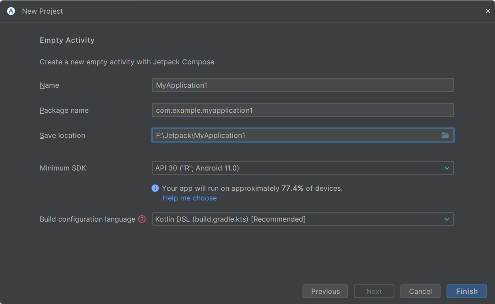

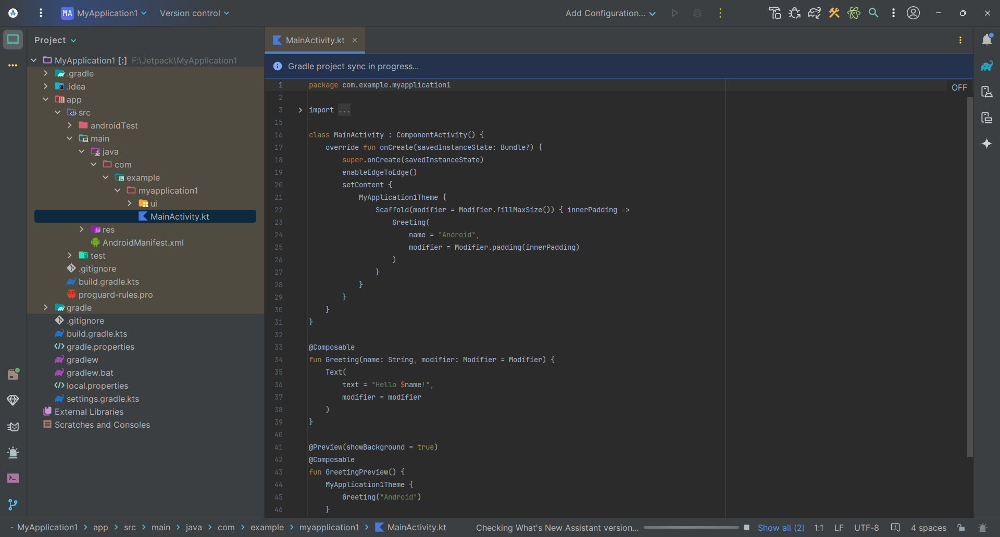

### 构建配置

- gradle-wrapper.properties 配置
- https://mirrors.cloud.tencent.com/gradle/

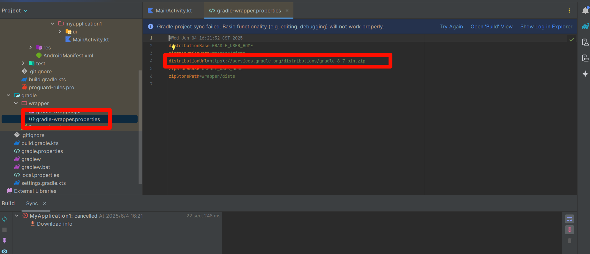

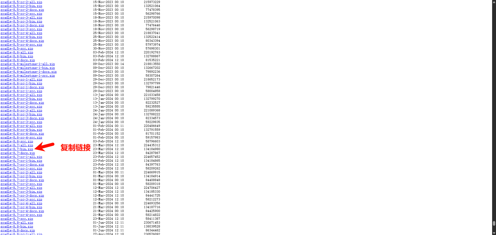

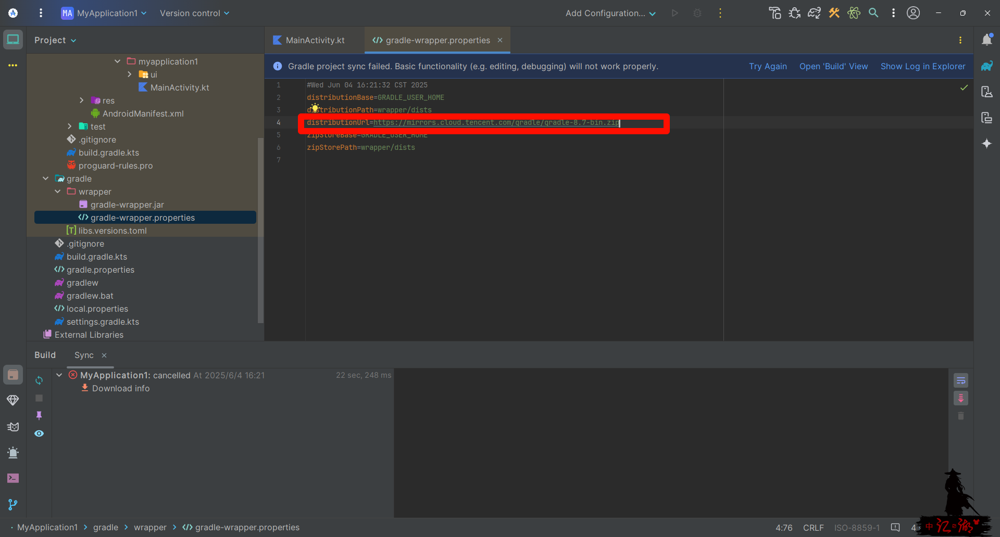

- settings.gradle.kts 配置

```kotlin
maven { url=uri("https://maven.aliyun.com/repository/gradle-plugin") }
maven { url=uri("https://maven.aliyun.com/repository/spring-plugin") }
maven { url=uri("https://maven.aliyun.com/repository/public") }
maven { url=uri("https://maven.aliyun.com/repository/google") }
maven { url=uri("https://jitpack.io")}
```

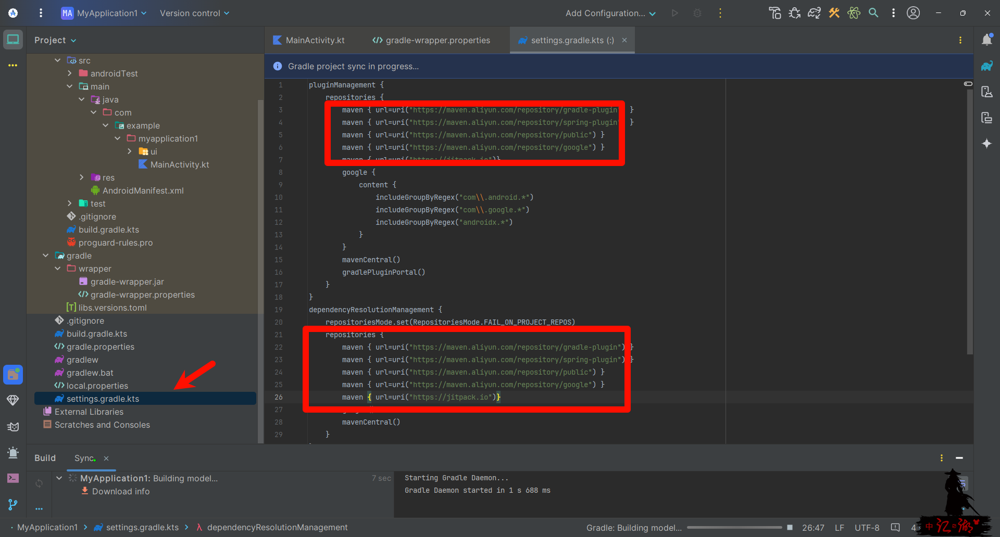

下载依赖

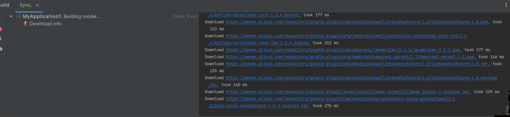

配置本地的环境，将这个依赖下载到本地

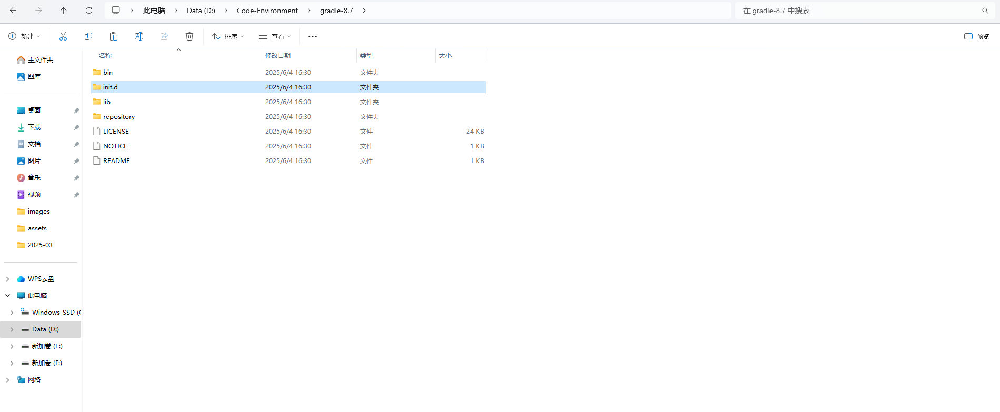

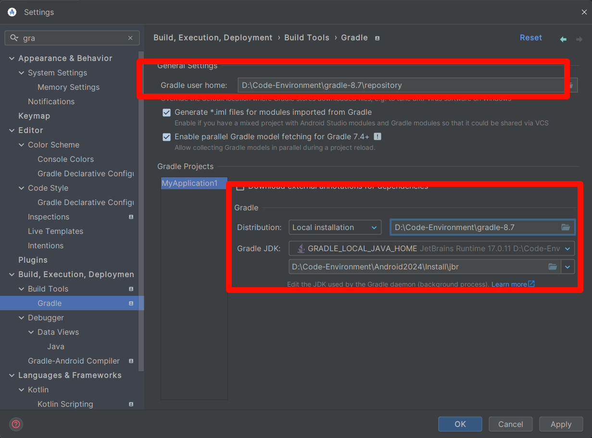

### 目录结构

Android 项目的构建系统基于 **Gradle**，采用模块化设计，包含多个关键文件和目录。以下是主要组成部分及其作用：

##### 📁 项目根目录结构

| **文件/目录**                 | **用途**                                                     |
| ----------------------------- | ------------------------------------------------------------ |
| **`.gradle/`**                | Gradle 缓存目录（自动生成，不应手动修改）                    |
| **`.idea/`**                  | Android Studio 项目元数据（自动生成，不应手动修改）          |
| **`build.gradle(.kts)`**      | **根构建脚本**，仅用于声明全局插件和依赖（如 `com.android.application` 或 `com.android.library`） |
| **`gradle.properties`**       | 配置 Gradle 构建环境（如 JVM 堆大小、缓存策略）              |
| **`gradlew` / `gradlew.bat`** | Gradle 封装器脚本（允许项目使用指定版本的 Gradle）           |
| **`local.properties`**        | 本地机器配置（如 Android SDK 路径，**不应提交到版本控制**）  |
| **`settings.gradle(.kts)`**   | **项目初始化脚本**，定义： - 包含的子项目（模块） - 依赖仓库（如 Maven、Google） - 版本目录（如 `libs.versions.toml`） |
| **`gradle/`**                 | 存放 Gradle 封装器和版本目录： - `wrapper/`（Gradle 封装器配置） - `libs.versions.toml`（依赖版本管理） |

##### 📦 模块（子项目）结构

每个模块（如 `app/`）包含以下关键文件：

| **文件/目录**            | **用途**                                                     |
| ------------------------ | ------------------------------------------------------------ |
| **`build.gradle(.kts)`** | **模块级构建脚本**，定义： - 插件（如 `com.android.application`） - Android 配置（`compileSdk`、`minSdk`） - 依赖项（`implementation`、`testImplementation`） |
| **`src/`**               | 源代码和资源： - `main/`（主代码） - `androidTest/`（设备测试） - `test/`（单元测试） |
| **`src/main/`**          | **主源代码集**（所有变体共享）： - `java/` 或 `kotlin/`（Kotlin/Java 代码） - `res/`（XML 布局、字符串、图片等） - `AndroidManifest.xml`（应用元数据） |
| **`src/androidTest/`**   | **设备测试**（运行在模拟器/真机）                            |
| **`src/test/`**          | **单元测试**（运行在本地 JVM）                               |
| **`proguard-rules.pro`** | R8/ProGuard 混淆规则（优化和缩减代码）                       |

##### 🔑 关键概念

1. **Gradle 封装器（Wrapper）**

   - 确保项目使用指定版本的 Gradle（避免环境差异）。
   - 配置文件：`gradle/wrapper/gradle-wrapper.properties`。

2. **版本目录（`libs.versions.toml`）**

   - 集中管理依赖版本（如 `compose-bom`、`kotlin`）。

   - 示例：

     ```
     [versions]
     compose = "1.6.0"
     
     [libraries]
     compose-ui = { group = "androidx.compose.ui", name = "ui", version.ref = "compose" }
     ```

3. **构建逻辑分离**

   - **`build.gradle` 应只声明配置**，不包含复杂逻辑（如 `if-else`）。
   - 自定义逻辑应封装在 **Gradle 插件** 中。

4. **源代码集（Source Sets）**

   - `main/`：基础代码（所有变体共享）。
   - `debug/`、`release/`：变体专属代码（覆盖 `main/` 中的文件）。

5. **R8/ProGuard**

   - 优化 APK：移除未使用的代码、混淆类名（`proguard-rules.pro`）。

##### 🚀 最佳实践

-  ✅ **使用 `libs.versions.toml` 统一管理依赖版本**（避免冲突）。
-  ✅ ​**​避免在 `build.gradle` 中写复杂逻辑​**​（改用自定义插件）。
-  ✅ ​**​模块化开发​**​（将功能拆分为独立模块，如 `:feature:auth`）。
-  ✅ ​**​区分 `test`（单元测试）和 `androidTest`（设备测试）​**​。
-  ✅ ​**​`.gitignore` 排除 `local.properties` 和 `.gradle/`​**​（避免环境差异）。

以下是 **Android 项目构建文件的详细解析**，涵盖每个核心文件的作用、配置示例及最佳实践：

#####  根目录文件

###### 📄 `settings.gradle(.kts)`

**作用**：定义项目的全局配置，包括模块列表和依赖仓库。
 ​**​关键内容​**​：

```
// settings.gradle.kts
dependencyResolutionManagement {
    repositories {
        google()
        mavenCentral()
    }
}
include(":app", ":feature:auth") // 包含的模块
```

**最佳实践**：

- 使用 `dependencyResolutionManagement` 统一管理仓库。
- 模块路径用 `:` 分隔（如 `:feature:auth`）。

##### 📄 `build.gradle(.kts)`（根目录）

**作用**：配置全局插件和依赖，**不包含模块逻辑**。
 ​**​示例​**​：

```
// build.gradle.kts
plugins {
    id("com.android.application") version "8.1.0" apply false // 仅声明，不应用
    id("org.jetbrains.kotlin.android") version "1.9.0" apply false
}
```

**注意**：

- `apply false` 表示插件在子模块中按需应用。

##### 📄 `gradle.properties`

**作用**：配置 Gradle 和 Android 构建环境。
 ​**​常用配置​**​：

```
# 提升构建性能
org.gradle.jvmargs=-Xmx4096m -Dfile.encoding=UTF-8
# 启用并行构建
org.gradle.parallel=true
# Android 专属配置
android.useAndroidX=true
android.enableJetifier=true
```

##### 📄 `libs.versions.toml`（版本目录）

**路径**: `gradle/libs.versions.toml`
 ​**​作用​**​：集中管理依赖版本，避免冲突。
 ​**​示例​**​：

```
[versions]
kotlin = "1.9.0"
compose = "1.6.0"

[libraries]
androidx-core-ktx = { group = "androidx.core", name = "core-ktx", version.ref = "kotlin" }
compose-ui = { group = "androidx.compose.ui", name = "ui", version.ref = "compose" }

[plugins]
android-application = { id = "com.android.application", version = "8.1.0" }
```

**模块中引用**：

```
// build.gradle.kts
dependencies {
    implementation(libs.androidx.core.ktx)
    implementation(libs.compose.ui)
}
```

##### 模块目录（如 `app/`）

###### 📄 `build.gradle(.kts)`（模块级）

**作用**：定义模块的构建配置和依赖。
 ​**​完整示例​**​：

```
plugins {
    id("com.android.application")
    id("org.jetbrains.kotlin.android")
}

android {
    namespace = "com.example.app"
    compileSdk = 34

    defaultConfig {
        applicationId = "com.example.app"
        minSdk = 24
        targetSdk = 34
    }

    buildTypes {
        release {
            isMinifyEnabled = true
            proguardFiles(getDefaultProguardFile("proguard-android.txt"), "proguard-rules.pro")
        }
    }
}

dependencies {
    implementation(libs.androidx.core.ktx)
    implementation(libs.compose.ui)
    testImplementation(libs.junit)
    androidTestImplementation(libs.androidx.test.ext.junit)
}
```

##### 📁 `src/` 目录结构

| **子目录**     | **用途**                                  |
| -------------- | ----------------------------------------- |
| `main/`        | 主代码和资源（所有构建变体共享）          |
| `debug/`       | 仅 `debug` 变体使用的代码（覆盖 `main/`） |
| `release/`     | 仅 `release` 变体使用的代码               |
| `androidTest/` | 设备测试（运行在模拟器/真机）             |
| `test/`        | 单元测试（运行在本地 JVM）                |

##### 📄 `AndroidManifest.xml`

**路径**: `src/main/AndroidManifest.xml`
 ​**​作用​**​：声明应用组件、权限和元数据。
 ​**​示例​**​：

```
<manifest xmlns:android="http://schemas.android.com/apk/res/android"
    package="com.example.app">
    <application
        android:label="@string/app_name"
        android:theme="@style/Theme.App">
        <activity android:name=".MainActivity">
            <intent-filter>
                <action android:name="android.intent.action.MAIN" />
                <category android:name="android.intent.category.LAUNCHER" />
            </intent-filter>
        </activity>
    </application>
</manifest>
```

##### 📁 `res/` 资源目录

| **子目录**  | **用途**                       | 示例文件                    |
| ----------- | ------------------------------ | --------------------------- |
| `values/`   | 字符串、颜色、尺寸等           | `strings.xml`, `colors.xml` |
| `layout/`   | XML 布局文件（传统 View 系统） | `activity_main.xml`         |
| `drawable/` | 图片和矢量图                   | `ic_launcher.xml`           |
| `mipmap/`   | 应用图标（不同分辨率）         | `ic_launcher_round.png`     |

------

##### 📄 `proguard-rules.pro`

**作用**：配置代码优化和混淆规则。
 ​**​常用规则​**​：

```
# 保留所有 View 的 setter/getter 方法（避免 ButterKnife 等问题）
-keepclassmembers class * extends android.view.View {
    public <init>(android.content.Context);
    public <init>(android.content.Context, android.util.AttributeSet);
    public <init>(android.content.Context, android.util.AttributeSet, int);
    public void set*(***);
}
# 保留数据类（避免 Gson 反序列化失败）
-keep class com.example.model.** { *; }
```

##### 测试文件

###### 📁 `test/`（单元测试）

**示例**：

```
// src/test/java/com/example/ExampleUnitTest.kt
class ExampleUnitTest {
    @Test
    fun addition_isCorrect() {
        assertEquals(4, 2 + 2)
    }
}
```

###### 📁 `androidTest/`（设备测试）

**示例**：

```
// src/androidTest/java/com/example/ExampleInstrumentedTest.kt
@RunWith(AndroidJUnit4::class)
class ExampleInstrumentedTest {
    @Test
    fun useAppContext() {
        val appContext = InstrumentationRegistry.getInstrumentation().targetContext
        assertEquals("com.example.app", appContext.packageName)
    }
}
```

## 1.3 UI 组件

- 练习参考项目：https://github.com/vitaviva/Bloom

### 主题

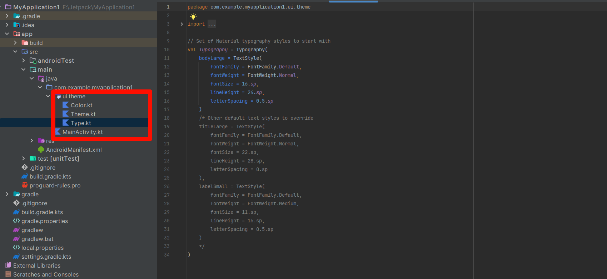

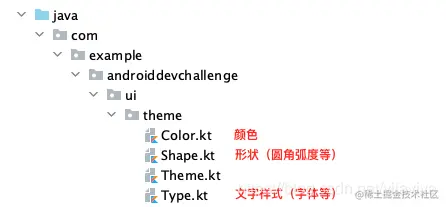

**Color.kt**、**Shape.kt**、**Type.kt**中通过Kotlin的常量分别定义各种样式， **Theme.kt**中将这些样式应用到全局主题：

```kotlin
//Thmem.kt
private val DarkColorPalette = darkColors(
        primary = purple200,
        primaryVariant = purple700,
        secondary = teal200
)

private val LightColorPalette = lightColors(
        primary = purple500,
        primaryVariant = purple700,
        secondary = teal200
)

@Composable
fun MyAppTheme(darkTheme: Boolean = isSystemInDarkTheme(), content: @Composable() () -> Unit) {
    //根据theme的不同设置不同颜色
    val colors = if (darkTheme) {
        DarkColorPalette
    } else {
        LightColorPalette
    }

    MaterialTheme(
            colors = colors,
            typography = typography,
            shapes = shapes,
            content = content
    )
}
```

如上，使用Kotlin定义和切换theme都是如此简单，在`Composable`中基于`if`语句选择配置，然后静等下次`composition`生效就好了。

### 布局

|      **组件**      |                   **作用**                   |                        **示例**                         |
| :----------------: | :------------------------------------------: | :-----------------------------------------------------: |
|      `Column`      | 垂直排列子项（类似 `LinearLayout` 垂直方向） |        `kotlin Column { Text("A"); Text("B") }`         |
|       `Row`        | 水平排列子项（类似 `LinearLayout` 水平方向） |          `kotlin Row { Text("A"); Text("B") }`          |
|       `Box`        |      子项堆叠显示（类似 `FrameLayout`）      |          `kotlin Box { Text("A"); Text("B") }`          |
| `ConstraintLayout` |        通过约束定位子项（需额外依赖）        |                                                         |
|    `LazyColumn`    |     垂直滚动列表（类似 `RecyclerView`）      | `kotlin LazyColumn { items(100) { Text("Item $it") } }` |
|     `LazyRow`      |                 水平滚动列表                 |  `kotlin LazyRow { items(100) { Text("Item $it") } }`   |

```kotlin
package com.shu

import android.content.Context
import android.content.Intent
import android.os.Bundle
import android.provider.Settings
import android.util.Log
import android.widget.Toast
import androidx.activity.ComponentActivity
import androidx.activity.compose.setContent
import androidx.compose.foundation.Image
import androidx.compose.foundation.background
import androidx.compose.foundation.clickable
import androidx.compose.foundation.layout.Arrangement
import androidx.compose.foundation.layout.Column
import androidx.compose.foundation.layout.Row
import androidx.compose.foundation.layout.Spacer
import androidx.compose.foundation.layout.fillMaxSize
import androidx.compose.foundation.layout.fillMaxWidth
import androidx.compose.foundation.layout.height
import androidx.compose.foundation.layout.padding
import androidx.compose.foundation.layout.size
import androidx.compose.foundation.shape.CircleShape
import androidx.compose.foundation.shape.RoundedCornerShape
import androidx.compose.foundation.text.KeyboardOptions
import androidx.compose.material.icons.Icons
import androidx.compose.material.icons.filled.Clear
import androidx.compose.material.icons.filled.Delete
import androidx.compose.material.icons.filled.Lock
import androidx.compose.material.icons.filled.Person
import androidx.compose.material3.Button
import androidx.compose.material3.ButtonDefaults
import androidx.compose.material3.Checkbox
import androidx.compose.material3.CircularProgressIndicator
import androidx.compose.material3.ExperimentalMaterial3Api
import androidx.compose.material3.Icon
import androidx.compose.material3.IconButton
import androidx.compose.material3.MaterialTheme
import androidx.compose.material3.Surface
import androidx.compose.material3.Text
import androidx.compose.material3.TextButton
import androidx.compose.material3.TextField
import androidx.compose.material3.TextFieldDefaults
import androidx.compose.runtime.Composable
import androidx.compose.runtime.getValue
import androidx.compose.runtime.mutableStateOf
import androidx.compose.runtime.remember
import androidx.compose.runtime.setValue
import androidx.compose.ui.Alignment
import androidx.compose.ui.Modifier
import androidx.compose.ui.draw.clip
import androidx.compose.ui.draw.shadow
import androidx.compose.ui.graphics.Color
import androidx.compose.ui.layout.ContentScale
import androidx.compose.ui.platform.LocalContext
import androidx.compose.ui.res.painterResource
import androidx.compose.ui.text.SpanStyle
import androidx.compose.ui.text.buildAnnotatedString
import androidx.compose.ui.text.font.FontWeight
import androidx.compose.ui.text.input.ImeAction
import androidx.compose.ui.text.input.KeyboardType
import androidx.compose.ui.text.input.PasswordVisualTransformation
import androidx.compose.ui.text.style.TextAlign
import androidx.compose.ui.text.style.TextDecoration
import androidx.compose.ui.text.withStyle
import androidx.compose.ui.tooling.preview.Preview
import androidx.compose.ui.unit.dp
import androidx.compose.ui.unit.sp
import com.shu.component.model.UiViewModelManager
import com.shu.component.model.UiViewModelManager.showSuccessToast
import com.shu.component.ui.AppColor
import java.util.Calendar


/**
 * 登录界面
 */
class LoginActivity : ComponentActivity() {
    override fun onCreate(savedInstanceState: Bundle?) {
        super.onCreate(savedInstanceState)
        setContent {
            MaterialTheme(
                colorScheme = AppColor.toColorScheme()
            ) {
                Surface(
                    modifier = Modifier.fillMaxSize(),
                    color = Color(0xFFF8FBFF)
                ) {
                    // 登录界面
                    LoginScreen()
                    // 初始化 UI 管理器
                    UiViewModelManager.Init()
                }
            }
        }
    }
}

@Composable
fun LoginScreen() {
    var username by remember { mutableStateOf("") }
    var password by remember { mutableStateOf("") }
    var rememberMe by remember { mutableStateOf(true) }
    var isLoading by remember { mutableStateOf(false) }
    val context = LocalContext.current
    val versionName = getVersionName(LocalContext.current)
    val currentYear = Calendar.getInstance().get(Calendar.YEAR).toString()
    Column(
        modifier = Modifier
            .fillMaxSize()
            .padding(horizontal = 24.dp),
        horizontalAlignment = Alignment.CenterHorizontally
    ) {
        Spacer(modifier = Modifier.height(48.dp))

        // 应用Logo
        Image(
            painter = painterResource(id = R.drawable.logo),
            contentDescription = "App Logo",
            modifier = Modifier
                .size(120.dp)
                .clip(CircleShape)
                .background(Color.White)
                .padding(12.dp),
            contentScale = ContentScale.Fit
        )

        Spacer(modifier = Modifier.height(24.dp))

        // 欢迎文本
        Text(
            text = "欢迎回来",
            fontSize = 28.sp,
            fontWeight = FontWeight.Bold,
            color = Color(0xFF2D3748)
        )

        Text(
            text = "请登录您的账户",
            fontSize = 16.sp,
            color = Color(0xFF718096),
            modifier = Modifier.padding(top = 8.dp)
        )

        Spacer(modifier = Modifier.height(36.dp))

        // 用户名输入框
        UsernameTextField(
            value = username,
            onValueChange = { username = it },
            modifier = Modifier.fillMaxWidth()
        )

        Spacer(modifier = Modifier.height(16.dp))

        // 密码输入框
        PasswordTextField(
            value = password,
            onValueChange = { password = it },
            modifier = Modifier.fillMaxWidth()
        )

        Spacer(modifier = Modifier.height(8.dp))

        // 记住我和忘记密码
        Row(
            modifier = Modifier.fillMaxWidth(),
            verticalAlignment = Alignment.CenterVertically,
            horizontalArrangement = Arrangement.SpaceBetween
        ) {
            Row(verticalAlignment = Alignment.CenterVertically) {
                Checkbox(
                    checked = rememberMe,
                    onCheckedChange = { rememberMe = it },
                    colors = androidx.compose.material3.CheckboxDefaults.colors(
                        checkedColor = Color(0xFF4299E1)
                    )
                )
                Text(
                    text = "记住我",
                    color = Color(0xFF4A5568),
                    fontSize = 14.sp
                )
            }

            Text(
                text = "忘记密码?",
                color = Color(0xFF4299E1),
                fontSize = 14.sp,
                fontWeight = FontWeight.Medium,
                modifier = Modifier.clickable {
                    Toast.makeText(context, "忘记密码功能", Toast.LENGTH_SHORT).show()
                }
            )
        }

        Spacer(modifier = Modifier.height(24.dp))

        // 登录按钮
        Button(
            onClick = {
                isLoading = true
                // 模拟登录过程
                android.os.Handler().postDelayed({
                    isLoading = false
                    showSuccessToast("登录成功！", duration = 3000)
                    val intent = Intent(context, MainActivity::class.java)
                    context.startActivity(intent)
                }, 1500)

            },
            modifier = Modifier
                .fillMaxWidth()
                .height(50.dp),
            shape = RoundedCornerShape(12.dp),
            colors = ButtonDefaults.buttonColors(
                containerColor = Color(0xFF4299E1),
                contentColor = Color.White
            )
        ) {
            if (isLoading) {
                CircularProgressIndicator(
                    color = Color.White,
                    strokeWidth = 2.dp,
                    modifier = Modifier.size(24.dp)
                )
            } else {
                Text(
                    text = "登 录",
                    fontSize = 16.sp,
                    fontWeight = FontWeight.Bold
                )
            }
        }

        Spacer(modifier = Modifier.height(16.dp))


        SystemSetting {

        }

        // 用户协议
        UserAgreementSection()

        Spacer(modifier = Modifier.height(16.dp))

        // 唯一设备号
        Text(
            text = "唯一设备号：${getDeviceId()}",
            color = Color(0xFFA0AEC0),
            fontSize = 12.sp,
        )
        Spacer(modifier = Modifier.height(1.dp))
        // 版本信息
        Text(
            text = "v$versionName © $currentYear 傻瓜一号",
            color = Color(0xFFA0AEC0),
            fontSize = 12.sp,
            modifier = Modifier.padding(bottom = 24.dp)
        )
    }
}

@OptIn(ExperimentalMaterial3Api::class)
@Composable
fun UsernameTextField(
    value: String,
    onValueChange: (String) -> Unit,
    modifier: Modifier = Modifier
) {
    TextField(
        value = value,
        onValueChange = onValueChange,
        modifier = modifier.shadow(
            elevation = 2.dp,
            shape = RoundedCornerShape(12.dp)
        ),
        colors = TextFieldDefaults.colors(
            focusedContainerColor = Color.White,
            unfocusedContainerColor = Color.White,
            disabledContainerColor = Color.White,
            focusedIndicatorColor = Color.Transparent,  // 移除聚焦状态下的下划线
            unfocusedIndicatorColor = Color.Transparent, // 移除非聚焦状态下的下划线
            disabledIndicatorColor = Color.Transparent,  // 移除禁用状态下的下划线
            cursorColor = Color(0xFF4A90E2),            // 光标颜色
            focusedTextColor = Color(0xFF2C3E50),        // 文本颜色
            unfocusedTextColor = Color(0xFF2C3E50)       // 文本颜色
        ),
        placeholder = {
            Text(
                "请输入用户名",
                color = Color(0xFF828FA2)
            )
        },
        keyboardOptions = KeyboardOptions(
            keyboardType = KeyboardType.Text,
            imeAction = ImeAction.Next
        ),
        leadingIcon = {
            Icon(
                imageVector = Icons.Filled.Person,
                contentDescription = "用户名字段",
                tint = Color(0xFF828FA2)
            )
        },
        trailingIcon = {
            if (value.isNotEmpty()) {
                IconButton(
                    onClick = { onValueChange("") }
                ) {
                    Icon(
                        imageVector = Icons.Filled.Delete,
                        contentDescription = "清除用户名",
                        tint = Color(0xFF718096)
                    )
                }
            }
        },
        singleLine = true,
    )
}

@OptIn(ExperimentalMaterial3Api::class)
@Composable
fun PasswordTextField(
    value: String,
    onValueChange: (String) -> Unit,
    modifier: Modifier = Modifier
) {
    TextField(
        value = value,
        onValueChange = onValueChange,
        modifier = modifier.shadow(
            elevation = 2.dp,
            shape = RoundedCornerShape(12.dp)
        ),
        shape = RoundedCornerShape(12.dp),
        colors = TextFieldDefaults.colors(
            focusedContainerColor = Color.White,
            unfocusedContainerColor = Color.White,
            disabledContainerColor = Color.White,
            focusedIndicatorColor = Color.Transparent,  // 移除聚焦状态下的下划线
            unfocusedIndicatorColor = Color.Transparent, // 移除非聚焦状态下的下划线
            disabledIndicatorColor = Color.Transparent,  // 移除禁用状态下的下划线
            cursorColor = Color(0xFF4A90E2),            // 光标颜色
            focusedTextColor = Color(0xFF2C3E50),        // 文本颜色
            unfocusedTextColor = Color(0xFF2C3E50)       // 文本颜色
        ),
        placeholder = {
            Text(
                "请输入密码",
                color = Color(0xFF828FA2)
            )
        },
        visualTransformation = PasswordVisualTransformation(),
        keyboardOptions = KeyboardOptions(
            keyboardType = KeyboardType.Password,
            imeAction = ImeAction.Done
        ),
        leadingIcon = {
            Icon(
                imageVector = Icons.Filled.Lock,
                contentDescription = "密码字段",
                tint = Color(0xFF718096)
            )
        },
        trailingIcon = {
            if (value.isNotEmpty()) {
                IconButton(
                    onClick = { onValueChange("") }
                ) {
                    Icon(
                        imageVector = Icons.Filled.Clear,
                        contentDescription = "清除密码",
                        tint = Color(0xFF718096)
                    )
                }
            }
        },
        singleLine = true
    )
}

@Composable
fun UserAgreementSection() {
    val context = LocalContext.current
    val annotatedString = buildAnnotatedString {
        append("登录即表示您同意我们的")
        // 用户协议链接
        pushStringAnnotation(tag = "terms", annotation = "https://example.com/terms")
        withStyle(
            style = SpanStyle(
                color = Color(0xFF4299E1),
                fontWeight = FontWeight.Medium,
                textDecoration = TextDecoration.Underline
            )
        ) {
            append("用户协议")
        }
        pop()
        append("和")
        // 隐私政策链接
        pushStringAnnotation(tag = "privacy", annotation = "https://example.com/privacy")
        withStyle(
            style = SpanStyle(
                color = Color(0xFF4299E1),
                fontWeight = FontWeight.Medium,
                textDecoration = TextDecoration.Underline
            )
        ) {
            append("隐私政策")
        }
        pop()
    }

    Text(
        text = annotatedString,
        fontSize = 12.sp,
        textAlign = TextAlign.Center,
        modifier = Modifier
            .fillMaxWidth()
            .clickable {
                // 这里可以处理点击事件
                Toast.makeText(context, "查看用户协议", Toast.LENGTH_SHORT).show()
            }
    )
}


@Composable
fun SystemSetting(
    onClick: () -> Unit
) {
    TextButton(
        onClick = onClick,
        modifier = Modifier
            .fillMaxWidth()
    ) {
        Text(
            text = "系统设置",
            fontSize = 12.sp,
            color = Color(0xFF2C3E50),
            textAlign = TextAlign.Center
        )
    }
}


@Preview(showBackground = true)
@Composable
fun PreviewLoginScreen() {
    MaterialTheme(
        colorScheme = AppColor.toColorScheme()
    ) {
        LoginScreen()
    }
}


@Composable
fun getVersionName(context: Context): String? {
    return try {
        val pInfo = context.packageManager.getPackageInfo(context.packageName, 0)
        pInfo.versionName
    } catch (e: Exception) {
        Log.e("getVersionName", "Error: ${e.message}")
        "1.0.0" // 默认值
    }
}

@Composable
fun getDeviceId(): String {
    var deviceId="q23sd02839103701983";
     deviceId = Settings.System.getString(LocalContext.current.contentResolver, Settings.System.ANDROID_ID)
    return deviceId
}

```


####  `Column` 

#####  verticalArrangement

控制子项在垂直方向上的排列方式（类似于传统视图的 gravity 或 LinearLayout 的权重）：

```kotlin
verticalArrangement = Arrangement.Top    // 默认值，顶部对齐
verticalArrangement = Arrangement.Center // 垂直居中
verticalArrangement = Arrangement.Bottom // 底部对齐
verticalArrangement = Arrangement.SpaceEvenly // 均匀分布（包括首尾）
verticalArrangement = Arrangement.SpaceBetween // 首尾不留空，中间均匀分布
verticalArrangement = Arrangement.SpaceAround  // 首尾留空，中间均匀分布
```

#####  content

定义子组件的 Lambda 块（通过 `ColumnScope` 内的 DSL 添加子项）：

```kotlin
content = {
    Text("Item 1")
    Spacer(modifier = Modifier.height(8.dp))
    Button(onClick = {}) { Text("Button") }
}
```

##### 其他对齐相关属性

```kotlin
horizontalAlignment = Alignment.Start   // 左对齐（LTR 布局下）
horizontalAlignment = Alignment.End     // 右对齐（LTR 布局下）
horizontalAlignment = Alignment.CenterHorizontally // 水平居中（默认值）
```

####  `Row` 

##### `modifier`

控制布局大小、内边距、背景等（与 `Column` 相同）：

```kotlin
modifier = Modifier
    .fillMaxWidth()  // 填充最大宽度
    .padding(16.dp)  // 内边距
    .background(Color.LightGray) // 背景色
```

##### `horizontalArrangement`

控制子项在**水平方向**的排列方式（核心属性）：

```kotlin
horizontalArrangement = Arrangement.Start      // 左对齐（默认）
horizontalArrangement = Arrangement.Center    // 水平居中
horizontalArrangement = Arrangement.End       // 右对齐
horizontalArrangement = Arrangement.SpaceEvenly  // 均匀分布（包括首尾）
horizontalArrangement = Arrangement.SpaceBetween // 首尾不留空，中间均匀分布
horizontalArrangement = Arrangement.SpaceAround  // 首尾留空，中间均匀分布
```

#### `verticalAlignment`

控制子项在**垂直方向**的对齐方式：

```kotlin
verticalAlignment = Alignment.Top      // 顶部对齐
verticalAlignment = Alignment.CenterVertically // 垂直居中（默认）
verticalAlignment = Alignment.Bottom   // 底部对齐
```

##### `content`

通过 Lambda 定义子组件：

```kotlin
content = {
    Text("Item 1")
    Spacer(modifier = Modifier.width(8.dp))
    Button(onClick = {}) { Text("Button") }
}
```

##### `RowScope` 特有修饰符

在 `content` 中，子组件可使用 `RowScope` 的专属修饰符：

```kotlin
Row(modifier = Modifier.fillMaxWidth()) {
    Text("Left", modifier = Modifier.weight(1f))
    Text("Right")
}
```

- **`Modifier.align(Alignment.CenterVertically)`**：覆盖父容器的垂直对齐方式。

# 二 Room 

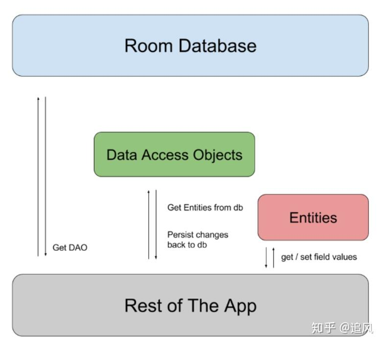

## 2.1 Room 基本使用

以下是 Android Room 的主要特点：

- 对象关系映射 (ORM)：Room 允许您将 Java 或 Kotlin 对象映射到数据库表中。您可以定义数据模型并使用注解来定义关系和约束。
- 事务管理：Room 提供了事务管理的功能，可以确保数据的完整性和一致性。它还支持自动提交和回滚机制，类似于 JDBC 中的事务管理。
- 数据库抽象：Room 提供了一个抽象层，使得您可以使用简单的 API 来执行 SQL 查询和操作数据库。您不需要编写手动的 SQL 语句，而是使用 Java 或 Kotlin 的查询 API。
- 同步和异步操作：Room 支持同步和异步操作，使得您可以轻松地在后台线程中执行数据库操作，以避免阻塞主线程。
- 数据库迁移：当您的应用程序更新时，可能需要更改数据库模式。Room 可以自动处理迁移过程，确保数据的一致性和完整性。
- 并发支持：Room 支持多线程并发操作，可以有效地处理多个并发请求。
- 嵌入式数据库：Room 支持嵌入式数据库，这意味着您可以将数据库文件嵌入到您的应用程序中，而不需要单独安装和管理 SQLite 数据库。
- 支持跨平台：除了 Android 平台，Room 还支持 iOS 和桌面应用程序。

> 依赖

```groovy
    // Room
    implementation "androidx.room:room-runtime:2.5.0"
    annotationProcessor "androidx.room:room-compiler:2.5.0"
```

> 实体类

```java
package com.shu.model;

import androidx.room.ColumnInfo;
import androidx.room.Entity;
import androidx.room.PrimaryKey;

/**
 * @Author : EasonShu
 * @Date : 2025-06-08 09:35.
 * @Description :
 */
@Entity(tableName = "people")
public class User {
    //主键 自动生成
    @PrimaryKey(autoGenerate = true)
    private int id;

    //列的名称
    @ColumnInfo(name = "user_name")
    private String name;

    //不写默认列的名称为age，sex
    private int age;
    private String sex;

    public User(String name, int age, String sex) {
        this.name = name;
        this.age = age;
        this.sex = sex;
    }

    public void setId(int id) {
        this.id = id;
    }

    public int getId() {
        return id;
    }

    public String getName() {
        return name;
    }

    public void setName(String name) {
        this.name = name;
    }

    public int getAge() {
        return age;
    }

    public void setAge(int age) {
        this.age = age;
    }

    public String getSex() {
        return sex;
    }

    public void setSex(String sex) {
        this.sex = sex;
    }
}
```

> 操作接口

```java
package com.shu.dao;

import androidx.room.Dao;
import androidx.room.Delete;
import androidx.room.Insert;
import androidx.room.Query;
import androidx.room.Update;

import com.shu.model.User;

import java.util.List;

/**
 * @Author : EasonShu
 * @Date : 2025-06-08 09:36.
 * @Description :
 */
@Dao
public interface UserDao {

    //添加  传递一个参数 对象
    @Insert
    void insertDataOne(User people);

    //添加  可以传递多个参数 对象
    @Insert
    void insertDataS(User... people);

    //删除
    @Delete
    int deleteDataS(User... people);

    //修改 传入对象 设置 id 进行修改某一个
    @Update
    int updateData(User... people);

    //查询 根据id倒序
    @Query("select * from User order by id desc")
    List<User> getPeoples();

    //根据id查询
    @Query("select * from User where id =:numb")
    User getPeople(Integer numb);

    //删除表数据
    @Query("delete from User")
    void deleteTableData();

}
```

> 抽象类

```java
package com.shu;

import android.content.Context;


import androidx.room.Database;
import androidx.room.Room;
import androidx.room.RoomDatabase;

import com.shu.dao.UserDao;
import com.shu.model.User;

/**
 * @Author : EasonShu
 * @Date : 2025-06-08 09:37.
 * @Description : 数据库类
 */
// 标注此类为数据库类，包含的表为 User，版本号为 1
@Database(entities = {User.class}, version = 1,  exportSchema = false)
public abstract class UserDataBase extends RoomDatabase {
    // 定义一个抽象方法，返回 DAO（数据访问对象）实例，用于操作 User 表数据
    public abstract UserDao userDao();

    // 用于存储单例实例的静态变量，确保全局只有一个数据库实例
    private static volatile UserDataBase INSTANCE;

    // 获取数据库实例的静态方法，采用单例模式。
    public static UserDataBase getINSTANCE(Context context) {
        if (INSTANCE == null) {
            synchronized (UserDataBase.class) {
                if (INSTANCE == null) {
                    // 使用 Room 的 databaseBuilder 构建数据库实例
                    // 数据库类,数据库文件名
                    INSTANCE = Room.databaseBuilder(context.getApplicationContext(), UserDataBase.class, "users").allowMainThreadQueries().build();
                }
            }
        }
        return INSTANCE;
    }
}

```

- 在数据库对应的DataBase中使用.allowMainThreadQueries()来声明可以再主线程操作。

> 实现

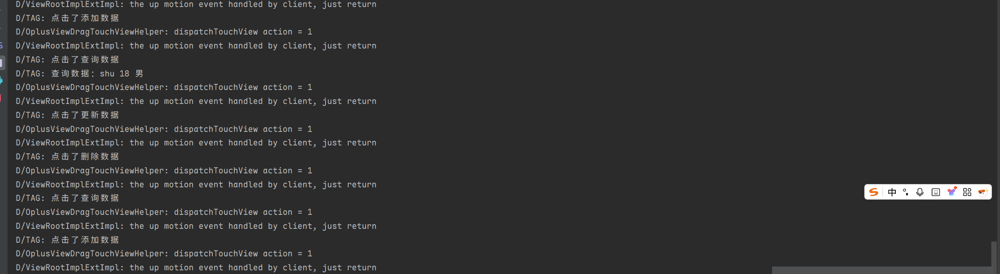

```java

/**
     * 点击事件
     * @param view
     */
    @Override
    public void onClick(View view) {
        switch (view.getId()) {
            case R.id.add_data:
                UserDataBase.getINSTANCE(this).userDao().insertDataOne(new User("shu", 18, "男"));
                break;
            case R.id.query_data:
                List<User> peoples = UserDataBase.getINSTANCE(this).userDao().getPeoples();
                for (User people : peoples) {
                    System.out.println(people.getName() + " " + people.getAge() + " " + people.getSex());
                }
                break;
            case R.id.delete_data:
                UserDataBase.getINSTANCE(this).userDao().deleteTableData();
                break;
            case R.id.update_data:
                UserDataBase.getINSTANCE(this).userDao().updateData(new User("shu", 18, "男"));
                break;
            default:
                break;
        }
    }
```

| 注解          | 作用                                   | 参数说明                                                     |
| ------------- | -------------------------------------- | ------------------------------------------------------------ |
| `@Entity`     | 声明一个类对应数据库中的表。           | - `tableName`：自定义表名（默认类名） - `foreignKeys`：定义外键约束 - `indices`：定义索引（加速查询） |
| `@PrimaryKey` | 标记字段为主键。                       | - `autoGenerate`：是否自增（如SQLite的`AUTOINCREMENT`）      |
| `@ColumnInfo` | 自定义字段在数据库中的列名或配置。     | - `name`：修改列名（默认与字段名相同） - 其他：如`collate`（排序规则） |
| `@Ignore`     | 忽略字段，不存储到数据库。             | 常用于临时计算字段或非持久化数据。                           |
| `@Embedded`   | 嵌套对象，将其内部字段平铺到当前表中。 | 适合组合复用（如`Address`嵌入`User`表）。                    |

```java
@Entity(
    tableName = "users",
    foreignKeys = [ForeignKey(
        entity = Department::class,
        parentColumns = ["dept_id"],
        childColumns = ["department_id"],
        onDelete = ForeignKey.CASCADE // 级联删除
    )],
    indices = [Index(value = ["department_id"], unique = false)]
)
data class User(
    @PrimaryKey(autoGenerate = true) val id: Long,
    @ColumnInfo(name = "user_name") val name: String,
    val department_id: Long,
    @Embedded val address: Address, // 嵌套字段（如street/city）
    @Ignore val tempToken: String   // 不存储
)
```

## 2.2 数据库升级

### 2.2.1 自动升级

- 数据库的升级分为手动和自动增量式升级，注意：Room版本在2.4.0以下的版本仅支持手动升级

- Room，当字段有变化，按照前面的使用方法添加删除某字段，即可完成自升级，当然改了字段得加版本。
- 如果两个版本之间自动迁移，需要在 `@Database` 注解中的 `autoMigrations` 参数中添加一个 `@AutoMigration` 注解即可。

```kotlin
// 迁移前数据库定义
@Database(entities = [AppData::class], version = 1, exportSchema = false)  
abstract class AppDatabase: RoomDatabase() {
    abstract fun appDao(): IAppDao
}
// 迁移时数据库定义
@Database(entities = [AppData::class], version = 1, autoMigrations = [AutoMigration(from = 1, to = 2)], exportSchema = false)
abstract class AppDatabase: RoomDatabase() {
    abstract fun appDao(): IAppDao
}
```

- `@Database` 注解表明这是一个 Room 数据库类
- `entities = {User.class}` 指定数据库包含的表（这里只有 User 表）
- `version = 1` 设置数据库版本号为 1
- `exportSchema = false` 不导出数据库架构信息（通常用于版本控制）
- `autoMigrations = {@AutoMigration(from = 1, to = 2)}` 配置从版本1到版本2的自动迁移

### 2.2.2 手动升级

- 如果只想升级**特定表**（例如修改 `User` 表结构但保留其他表不变），可以使用 `Migration` 类：

```java
// 定义 Migration(1 → 2)
static final Migration MIGRATION_1_2 = new Migration(1, 2) {
    @Override
    public void migrate(SupportSQLiteDatabase database) {
        // 只修改 User 表，其他表保持不变
        database.execSQL("ALTER TABLE User ADD COLUMN age INTEGER DEFAULT 0");
    }
};

// 应用迁移
Room.databaseBuilder(context, AppDatabase.class, "database.db")
    .addMigrations(MIGRATION_1_2)  // 添加自定义迁移
    .build();
```

**适用情况**：

- 修改表结构（如新增列、删除列）
- 仅升级部分表，其他表保持不变
- 复杂的数据迁移（如数据转换）

> 完整案例

假设我们有一个 `User` 表和一个 `Order` 表：

```java
// User 表（初始版本）
@Entity
public class User {
    @PrimaryKey
    public int id;
    public String name;
}

// Order 表（保持不变）
@Entity
public class Order {
    @PrimaryKey
    public int orderId;
    public String product;
}

// 数据库（版本 1）
@Database(entities = {User.class, Order.class}, version = 1)
public abstract class AppDatabase extends RoomDatabase {
    public abstract UserDao userDao();
    public abstract OrderDao orderDao();
}
```

**2. 升级需求（版本 2）**

- **修改 `User` 表**：新增 `age` 列
- **保持 `Order` 表不变**

**(1) 定义 Migration 类**

```java
static final Migration MIGRATION_1_2 = new Migration(1, 2) {
    @Override
    public void migrate(SupportSQLiteDatabase database) {
        // 仅修改 User 表，Order 表不受影响
        database.execSQL("ALTER TABLE User ADD COLUMN age INTEGER DEFAULT 0");
    }
};
```

**(2) 更新数据库版本和实体类**

```java
// 更新后的 User 类
@Entity
public class User {
    @PrimaryKey
    public int id;
    public String name;
    public int age;  // 新增字段
}

// 数据库版本升级到 2
@Database(entities = {User.class, Order.class}, version = 2)
public abstract class AppDatabase extends RoomDatabase {
    // ...
}
```

**(3) 应用迁移**

```java
AppDatabase db = Room.databaseBuilder(context, AppDatabase.class, "my-db")
    .addMigrations(MIGRATION_1_2)  // 添加自定义迁移
    .build();
```


# 三 Lifecycle 

# 四 LiceData

# 五 ViewModel

# 六 Data Binding

# 七 Kotlin Flow

# 八 WorkManger

