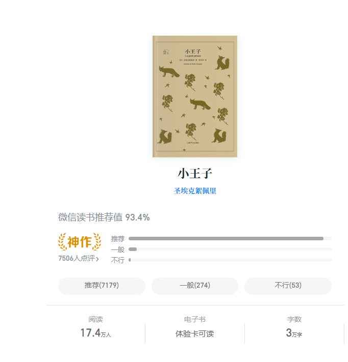

### 1. 小王子

- **象征意义**：纯真、童心、对爱与责任的探索。
- **角色特点**：来自B612小行星，与一朵玫瑰产生矛盾后开始星际旅行。他不懂成人世界的复杂，用孩童视角质疑权力、虚荣、贪婪等成人价值观。
- **关键关系**：
  - **玫瑰**：象征爱情与责任，两者的矛盾代表亲密关系中的依赖与成长。
  - **狐狸**：教会他“驯养”（建立联系）的意义，象征友谊与信任。
  - **蛇**：隐喻死亡与灵魂的引导者，暗示回归本质的可能。

### 2. 成人世界的象征角色

- **国王**（小行星325号）：
  - 象征​**​权力欲望与专制​**​，自诩统治一切却无人臣服，荒谬地命令小王子审判“老鼠死刑”。
- **爱慕虚荣者**（小行星326号）：
  - 象征​**​虚荣与自我中心​**​，只听得见赞美，认为所有人都是他的崇拜者。
- **酒鬼**（小行星327号）：
  - 象征​**​逃避现实与麻木​**​，借酗酒麻痹因“喝酒羞愧”的痛苦，陷入恶性循环。
- **商人**（小行星328号）：
  - 象征​**​物质主义与算计​**​，声称拥有所有星星却从未享受它们，用“省时间”掩盖空虚。
- **点灯人**（小行星329号）：
  - 象征​**​盲目遵循规则​**​，机械地开关路灯，不知为何而忙碌，反映体制对个体的异化。
- **地理学家**（小行星330号）：
  - 象征​**​脱离实践的“知识权威”​**​，只记录却不探索，让小王子质疑“纸上谈兵”的价值。

### 3. 经典语录摘抄

>[!TIP]
>
>- 你为你的玫瑰花费的时间，使你的玫瑰变得独一无二。
>- 我要对我的玫瑰负责……她是我的玫瑰。
>- 所有大人最初都是孩子，可惜很少有人记得。
>- 大人们热爱数字……如果你对他们说你认识了新朋友，他们从来不会问你重要的事情。
>- 重要的东西用眼睛是看不见的，要用心去寻找。
>- 驯服对我来说是件好事……现在你对我来说就是全世界独一无二的了。（狐狸对小王子说）
>- 沙漠之所以美丽，是因为在某个角落藏着一口井。
>- 如果有个人爱上一朵花儿，好几百万好几百万颗星星中间，只有一颗上面长着这朵花儿，那他只要望着许许多多星星，就会感到很幸福。
>- 我当时什么也不懂！看她这个人，应该看她做什么，而不是听她说什么。她给了我芳香，给了我光彩。我真不该逃走！我本该猜到她那小小花招背后的一片柔情。花儿总是这么表里不一！可惜当时我太年轻，还不懂得怎么去爱她。”

### 4. 主题

#### 1. **纯真与成长的矛盾**

- **孩童视角的珍贵**：小王子代表未被世俗污染的纯真心灵，他对世界的提问（如“为什么大人只关心数字？”）直指成人世界的功利与麻木。
- **成长的代价**：故事暗示成长过程中可能丢失想象力、对美的感知和情感联结的能力。飞行员（叙述者）与小王子相遇，象征成人重新唤醒内心被遗忘的童真。

#### 2. **爱与责任**

- **玫瑰与驯服**：小王子与玫瑰的关系探讨爱的本质——爱不仅是浪漫，更是彼此“驯服”（建立羁绊）后的责任与包容。玫瑰的骄傲与脆弱象征爱情中的矛盾与成长。
- **狐狸的启示**：狐狸提出“驯服”理论，强调爱需要时间、耐心和承担流泪的风险，揭示人际关系中“用心去看”的重要性。

#### 3. **孤独与联结**

- **星际漫游的隐喻**：小王子拜访的星球（国王、虚荣者、酒鬼、商人等）象征人类孤独的生存状态——沉迷权力、虚荣、逃避或占有，却失去真正的情感联结。
- **沙漠中的相遇**：飞行员与小王子在沙漠（象征精神荒原）中的友谊，展现人类对理解与陪伴的渴望。

