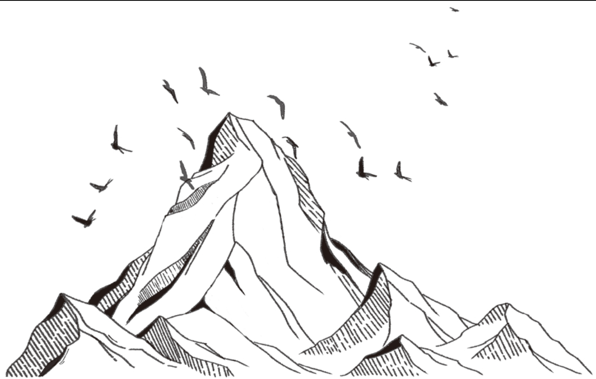

# 《我的外婆，从不内耗》

## **一、关于“内耗”的更深层解读**

### **1. 内耗的本质：自我攻击 vs. 自我接纳**

- 书中提到，许多人内耗的根源是**“不允许自己犯错”**，甚至把“不完美”等同于“失败”。
- 外婆的态度是：“**错了就错了，下次改就行，别折磨自己。**”
- **思考**：现代社会强调“高效”“完美”，导致许多人陷入“自我PUA”——用高标准苛责自己，反而降低行动力。

### **2. 内耗的两种类型**

（1）情绪内耗

：反复纠结“如果当初……”，陷入后悔、焦虑。

- 外婆的解法：“**过去的事，要么接受，要么改变，别一直想。**”

（2）关系内耗

：因他人评价、期待而自我怀疑。

- 外婆的解法：“**别人怎么想是别人的事，你怎么活是你的事。**”

------

## **二、关于“原生家庭”的更多视角**

### **1. 父母的“情感无能”并非故意，而是代际传递**

- 书中提到，许多父母并非“不爱孩子”，而是**他们自己从未被真正爱过**，所以无法给予健康的爱。
- 例如：
  - 父母用“打击式教育”，因为他们从小也被这样对待。
  - 父母要求“听话”，因为他们害怕失控，而非真正为孩子考虑。
- **启示**：理解≠原谅，但可以减少怨恨，专注于自我成长。

### **2. “孝道”与“自我”的冲突**

- 在东亚文化中，“孝顺”常被等同于“服从”，导致许多人压抑自我需求。
- 外婆的态度：“**孝顺不是当奴隶，而是让自己过得好，让父母放心。**”
- **思考**：真正的孝顺，应该是**双向的情感流动**，而非单方面的牺牲。

------

## **三、关于“社会规训”的批判**

### **1. “优秀”的陷阱**

- 社会常定义“优秀”为：高学历、高收入、符合主流价值观。
- 外婆的态度：“**优秀是你自己定义的，不是别人定的。**”
- **案例**：书中提到一位读者，因“不想考公务员”被家人指责“没出息”，但后来创业成功，反而被夸“有眼光”。
- **启示**：社会标准会变，唯一不变的是**你的自我认同**。

### **2. “合群”的代价**

- 许多人因害怕被孤立，强迫自己“合群”，结果活得很累。
- 外婆的解法：“**独处不可怕，可怕的是为了合群而失去自己。**”
- **思考**：真正的“社交自由”，是**能融入群体，也能享受孤独**。

------

## **四、关于“爱情与婚姻”的清醒认知**

### **1. 爱情不是“拯救”，而是“共同成长”**

- 许多人期待爱情“填补内心空缺”，结果往往失望。
- 外婆的观点：“**你自己不完整，爱情也救不了你。**”
- **启示**：先成为“完整的自己”，再寻找“锦上添花”的关系。

### **2. 婚姻的真相：合作而非依赖**

- 传统观念认为“婚姻是女人的归宿”，但外婆认为：“**婚姻是两个人一起走一段路，走不下去就换条路。**”
- **思考**：婚姻应该是**动态平衡**，而非“绑定一生”的枷锁。

------

## **五、关于“死亡与遗憾”的哲学思考**

### **1. “死亡”不是终点，而是生命的提醒**

- 外婆晚年时，对死亡的态度很平静：“**活够了，该走就走，别拖累别人。**”
- **启示**：思考死亡，反而能让人更珍惜当下，减少无谓的纠结。

### **2. “遗憾”是人生的必然，但不必成为负担**

- 书中提到，许多人因“未完成的事”而痛苦，但外婆说：“**遗憾就像伤疤，时间久了就不疼了。**”
- **解法**：把遗憾转化为“未来的行动力”，而非自我惩罚的理由。

------

## **总结：外婆的“不内耗”哲学体系**

| **核心原则**     | **具体表现**                   | **现实应用**           |
| ---------------- | ------------------------------ | ---------------------- |
| **自我接纳**     | “错了就改，别折磨自己”         | 减少自责，提高行动力   |
| **边界感**       | “别人怎么想是别人的事”         | 不被他人评价绑架       |
| **行动导向**     | “想做就做，别等完美”           | 减少拖延，降低焦虑     |
| **情感独立**     | “你自己不完整，爱情也救不了你” | 先爱自己，再爱他人     |
| **动态看待关系** | “婚姻是合作，不是绑定”         | 不恐惧结束不健康的关系 |

