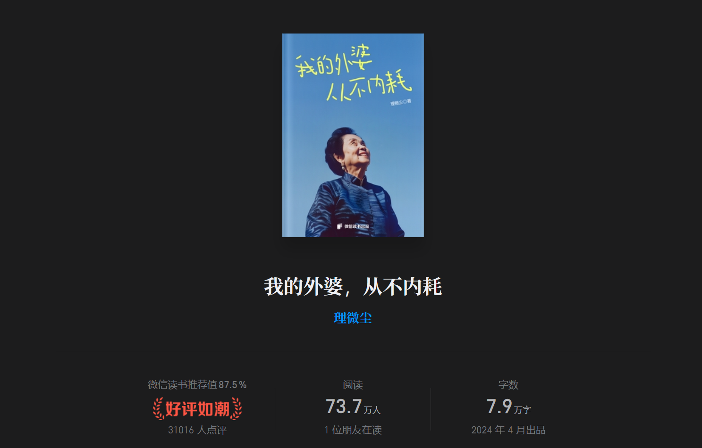

# 《我的外婆，从不内耗》

> [!TIP]
>
> - 为什么要有遗憾呢？想做就去做嘛
>
> - 你不必是一朵花。好好爱自己，做自己的光。
> - 那如果结果不好呢？至少我知道结果了嘛。至少我这一辈子，都会很精彩。

>[!DANGER]
>
>她蹲下来，站在孩子的位置，用孩子的眼光去看世界，照顾着我们的情绪感受。她从不讲什么大道理，而是将那些只可在至亲之间教授的知识诀窍糅合在日常生活中，身体力行地示范给我们看。

>[!WARNING]
>
>我们在心平气和的时候，往往知道怎样做，能说出来很多道理，但是一旦遇到事情，就什么都忘了，被情绪裹挟，做出让自己后悔的事情，主要原因就是没有“在事上磨”。在一件事情发生时，如果我们身处其中，看着长辈是怎么做的，自己才会真正有所体会，才能把其中的道理琢磨明白, 以后自己遇到同样的情况时，自然就知道如何应对。

>[!WARNING]
>
>欺负你的人因你的软弱而来，欣赏你的人因你的自信而来，不在乎你的人因你的自卑而来，爱你的人因你的自爱而来。”怯懦是没有家长支持的小孩所散发出的特殊气息，会引来各种不好的事情，就像秃鹫总能发觉死亡的气息。

>[!WARNING]
>
>“别人的伤害是你的垫脚石，你的成长才是对恶意最狠的回击。”
>
>“善良不是软弱，而是有能力保护自己时，依然选择温暖。”

>[!DANGER]
>
>- 你看，森林里住着好多动物，如果有一天兔子踩了老虎的尾巴，老虎可以以德报怨，因为兔子无法对老虎构成任何威胁，老虎却有一万种方法伤害兔子甚至要兔子的命，老虎当然可以非常大度地说没关系。
>- 反过来，如果是兔子被大老虎踩一脚，就可能会死。不让兔子学会躲避，而让兔子以德报怨，被踩了要忍着，要坚强、大度、原谅，实质是一种邪恶。
>- 任何知识都要结合自己的情况来运用，小朋友首先要学习自我保护和应对他人欺负的方法，才能保证自己健康成长，当你变成狮子时，才有资格对老虎说没关系。

>[!DANGER]
>
>有些家长把家当作自己的王国，他是唯一的皇帝，要用最小的投入收获最大的回报，还要在大家面前扮伟大。哦，闹这么大，不过就是想让大家都来看看他这个父亲多‘称职’，获得别人的关注和安慰，自我感动罢了。”

>[!DANGER]
>
>很多读者留言提到，自己成年后希望能跟父母讨论这些创伤，可惜得到的回应绝大多数都是：“不记得了，你怎么就记得这些？我养大你的恩情呢？”有的甚至开始进行新一轮“你是个白眼狼”的指责。原因有以下几点：
>
>- 父母大多认知有限，他们所拥有的知识和经验已经不足以解决你的问题，他们只觉得你在控诉和讨债，他们认为无论什么创伤，都应该在生养的恩情下消失
>- 在竭力应对生存挑战。理解、爱和金钱一样，也是能量，且是非常奢侈的能量。一般的家庭中，如果孩子了解父母的经济状况，大多不会提出非分要求，因为他知道那是不可能的。同样，如果他们精神贫瘠，无论你如何提要求，你需要的精神支持他们都给不了。
>- 就像溺水的人会拼命抓住能够到的任何东西，精神贫瘠的人往往会更迫切地需要把自己对人生的失望和痛苦、社会或周围人给他的压力转移出去，于是便落到孩子身上，以获取更多精神养分。父母无暇顾及你的幸福，因为他们自己获得的幸福都很少，甚至都不知道幸福到底是什么样的，更不要提如何去获得了。不要期待一个没见过西瓜的人告诉你如何种出好西瓜，那对对方来说也是不公平的。

>[!DANGER]
>
>- 请尽力去经营自己，努力逃离，尽量成长，好好读书，学一门手艺。抓住一切机会，从低能量的沼泽中逃离。只有跳出来，你才会发现，原来习以为常的东西是有问题的。不要沉浸在过去那些无力的回忆中，更不要被仇恨侵蚀，那会毒害你的成长。
>- 把握当下和未来，这才是你可以改变的部分。当你远离能量黑洞，成为经济精神都独立的人时，你才有实力和父母发展新的相处模式，才会被重视、被听见。