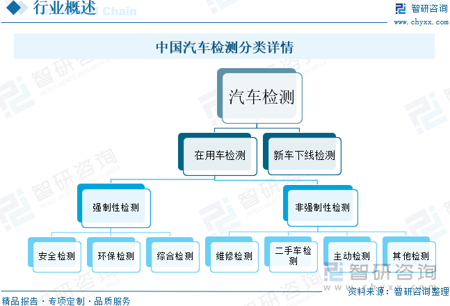
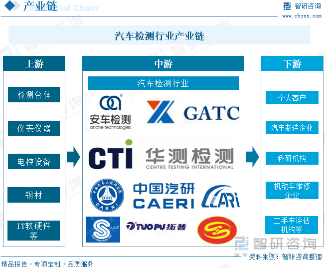

<confetti />

# 汽车检测行业概述

- 参考资料：https://www.chyxx.com/industry/1202855.html

- 汽车检测是伴随着汽车保有量的增长而迅速发展的。机动车数量的不断增长带来了交通安全、环境污染等一系列问题。
- 汽车检测系统能够全面地检验机动车性能，在安全监测、尾气排放等方面承担着重要作用。
- 为了保障交通安全和保护环境，近年来公安部、环保部等监管部门持续加强汽车检测力度，拉动中国汽车检测市场快速发展。
- 数据显示，2023年中国汽车检测行业市场规模约为453亿元，同比增长6.39%。

- 汽车检测，是为确定汽车技术状况或工作能力的一项检查工作。汽车在使用过程中，随着使用时间的延长，其零件逐渐磨损、腐蚀、变形、老化，以及润滑油变质等，致使配合副间隙变大，引起运动松旷、振动、发响和漏气、漏水、漏油等，造成汽车技术性能下降。
- 目前，我国汽车检测分为`在用车检测`与`新车下线检测`，其中在用车检测又分为强制性检测与非强制性检测。其中强制性检测又称定期检测，是由政府通过法律法规规定必须定期参加的检测，主要受监管驱动。
- 而非强制性检测多为机动车生产及服务企业因业务活动而开展的主动检测，包括`二手车检测`、`维修检测`等，主要受市场驱动。

# 汽车检测行业产业链

汽车检测行业产业链

- 上游主要为设备供应环节，主要包括检测台体、仪表仪器、电控设备、钢材、IT软硬件等
- 中游为汽车检测机构
- 下游为车检客户，包括消费者、汽车制造厂、科研机构、机动车维修企业、二手车评估机构以及检测行业主管部门等

