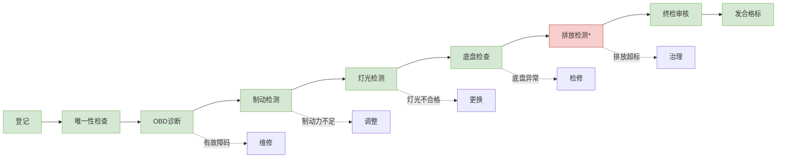
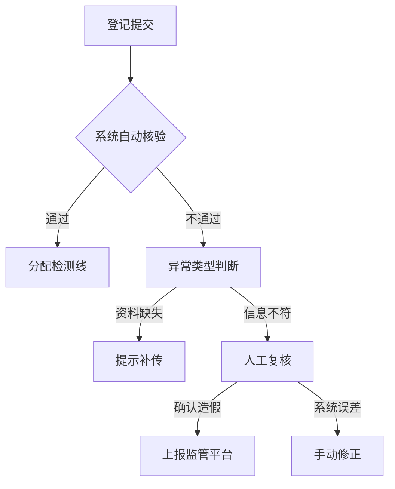
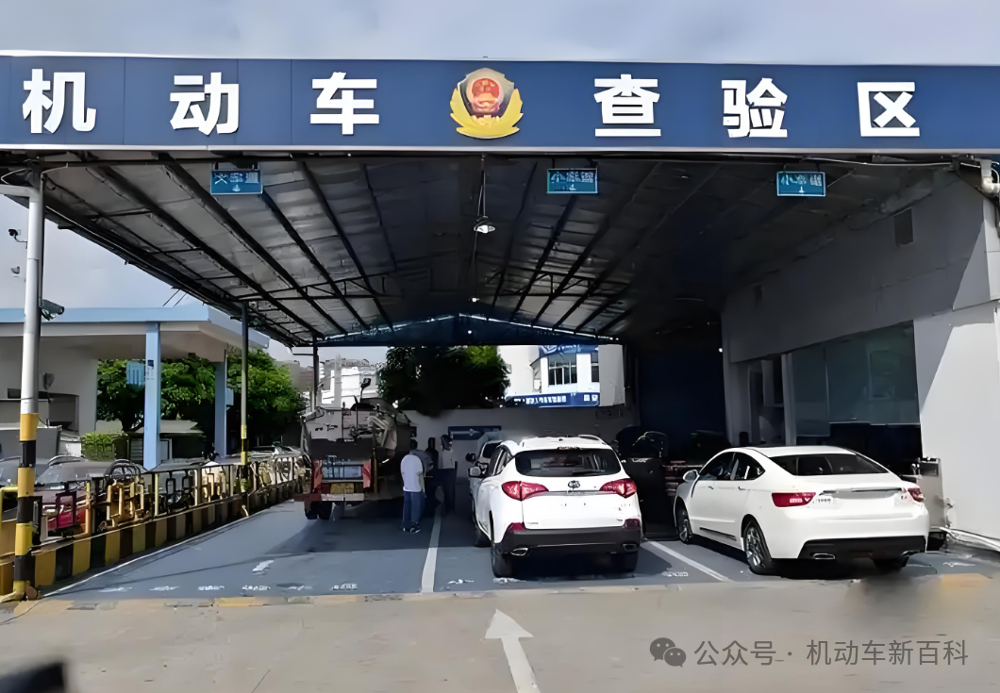
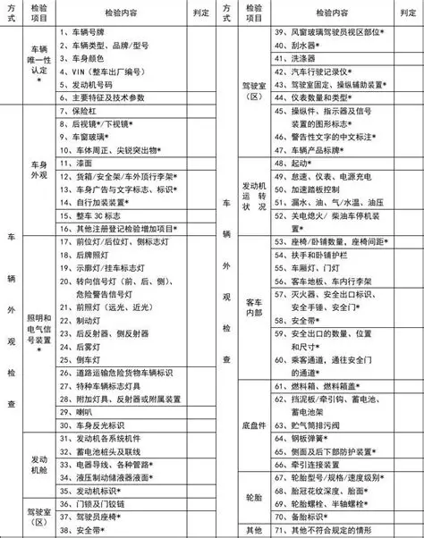
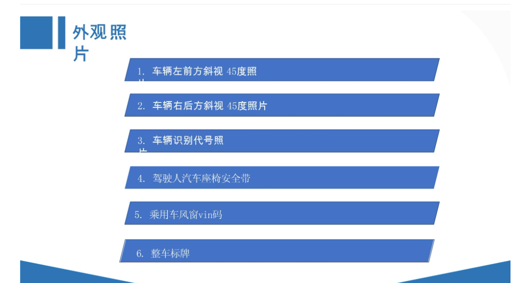

# 机动车安全技术梳理

> [!TIP]
>
> 日前，国家市场监督管理总局（国家标准化管理委员会）批准发布了新的强制性国家标准——GB 38900—2020《机动车安全技术检验项目和方法》，新标准将于2021年1月1日实施。新标准相比于现款标准，有一定变动。
>
> 本标准规定了机动车安全技术检验的检验项目、检验方法、检验要求，以及检验结果判定、处置和资料存档。适用于具备检验检测资质的机构对机动车进行安全技术检验，以及从事进口机动车检验检测的机构对入境机动车进行安全技术检验。

------

# 一 业务登记

### **一、业务登记主要信息**

#### **1. 基础信息采集**

| **信息类别**     | **具体内容**                                                 |
| ---------------- | ------------------------------------------------------------ |
| **车辆信息**     | 车牌号、车辆类型（私家/营运）、VIN码、发动机号、注册日期、里程数 |
| **车主信息**     | 车主姓名/单位、身份证号/统一信用代码、联系方式               |
| **保险信息**     | 交强险保单号及有效期（需联网核验）                           |
| **历史检验记录** | 上次检验日期、不合格项（如有）                               |

#### **2. 特殊情形登记**

- **改装车辆**：记录备案的改装项目（如车身颜色变更、发动机更换）
- **事故车**：标注事故维修记录（需提供维修清单）
- **新能源车**：电池类型（三元锂/磷酸铁锂）、充电接口标准（GB/T 20234）

### **二、业务登记要点与要求**

#### **1. 核心要点**

- 真实性核验：
  - 通过「全国机动车数据库」实时比对VIN码、发动机号是否篡改
  - 使用高拍仪采集行驶证、身份证原件影像（防止复印件伪造）
- 完整性检查：
  - 必填字段强制校验（如VIN码17位、发动机号字符规则）
  - 缺失资料时系统自动阻断并提示补充（如缺交强险保单）

#### **2. 合规性要求**

- 法规依据：
  - 符合《机动车登记规定》（公安部令第164号）第49条
  - 交强险需在有效期内（剩余≥1个月）
- 数据安全：
  - 个人信息脱敏处理（如身份证号部分字段掩码显示）
  - 检测数据保存≥2年备查

### **三、先进技术应用**

#### **1. 智能化技术**

| **技术**       | **应用场景**                                           | **优势**         |
| -------------- | ------------------------------------------------------ | ---------------- |
| **OCR识别**    | 自动读取行驶证、身份证关键字段（减少人工输入错误）     | 识别准确率≥99%   |
| **区块链存证** | 将车辆检验数据上链（如VIN码、检测时间戳）              | 防篡改、可追溯   |
| **AI预审系统** | 通过历史数据预测高风险车辆（如里程异常、频繁维修记录） | 提前预警作弊行为 |

#### **2. 物联网集成**

- RFID标签：
  - 在检测线安装RFID读写器，自动关联车辆与检测设备（避免人工调度错误）
- 电子标识：
  - 新能源车绑定电子车牌（双频RFID），实时读取电池健康状态

#### **3. 无感化服务**

- 预约平台对接：
  - 车主通过小程序预约时自动预填登记信息（减少现场等待时间）
- 电子证照调取：
  - 直接调用政务云平台的电子行驶证、电子保单（无需纸质材料）

### **四、异常处理流程**

------

### **五、未来发展趋势**

1. 数字孪生：
   - 建立车辆三维数字模型，登记时同步生成虚拟档案
2. 跨部门数据互通：
   - 公安、保险、环保数据实时共享（自动核验违法未处理记录）
3. AR辅助登记：
   - 工作人员佩戴AR眼镜自动识别车辆部件并标注异常（如改装痕迹）

### 六 外检工位与注意点

>传统的外检区

> - 外检员，利用联网商或者第三方APP做人工外检报告，拍摄外检图片
> - 在进行人工外检时，两人配合完成，一人按照“车前→车左→车后→车右→车内”的顺序依次进行检验，另一人负责依据检测结果填写人工检验单，并在车前左45°拍照、车后右侧45°拍照和车内安全带拍照，这样的外检顺序和配合方式能够有效率地完成人工外检

