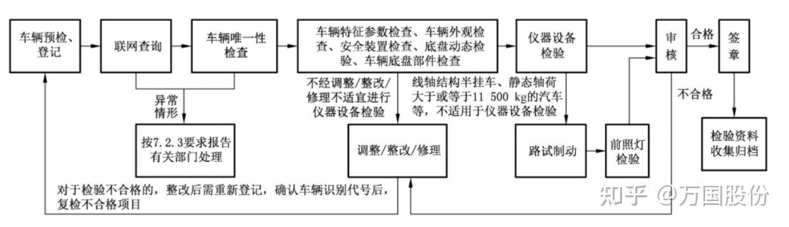
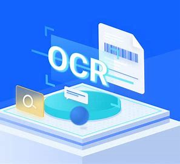
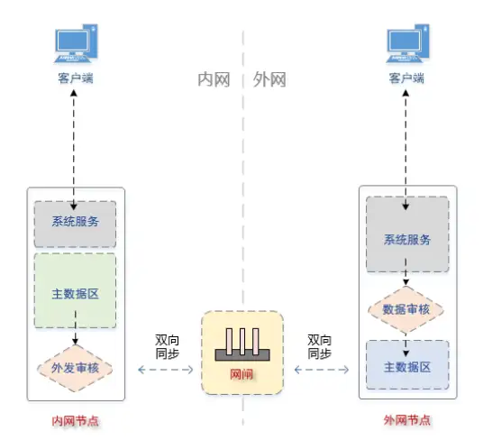

# 汽车安全检测

> [!TIP]
>
> 《机动车安全技术检验项目和方法》（GB 38900-2020）是2021年1月1日实施的一项中华人民共和国国家标准，归口于中华人民共和国公安部。

**从大体上分为新车注册与在用车两个大方面**

**流程**

## 1.1 车辆预检和登记

#### 模式对比

1. **传统人工模式**（当前主流）
   - 优势：低技术门槛，适应用户老龄化群体
   - 痛点：40%的重复录入错误率，高峰期排队超30分钟
2. **互联网预约模式**（新兴方式）
   - 核心瓶颈：检测站日均处理量＜50单时，系统维护成本占比超营收15%
   - 突破方案：开发区域化SaaS平台（如检测站联盟共享系统）
3. **自助办理模式**（未来方向）

#### 关键技术

1. **智能证件核验系统**

   - 低成本，离线部署，高扩展，精确度

   

2. **安全数据交换体系**

   - 低成本，数据安全，高传输

   

#### 其他思考 

- 现在车辆检测市场竞争十分的激烈，应该注重宣传，结合现在当下火的自媒体工具运营，抓住潜在用户

1. **本地生活赛道卡位**
   - 开通抖音/美团组合
   - 设计「周边3公里检测站比价」互动H5
2. **私域流量矩阵搭建**
   - 企业微信+社群+视频号铁三角架构
   - 设计「老带新裂变」机制：推荐返现+保养券组合激励