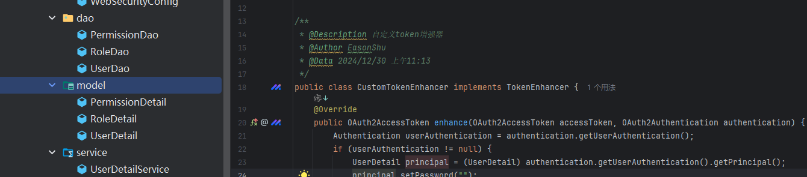

* https://zq99299.github.io/note-book/oath2/02/05.html

* https://www.cnblogs.com/fp2952/p/8973613.html

# 一 认证服务环境搭建

## 1.1 版本选择


* 查询地址：[https://start.spring.io/actuator/info](https://start.spring.io/actuator/info?spm=a2c6h.12873639.article-detail.5.cfff520cbFD2Yr)

```javascript
{
  "git": {
    "branch": "main",
    "commit": {
      "id": "ad32238",
      "time": "2024-12-24T14:01:06Z"
    }
  },
  "build": {
    "version": "0.0.1-SNAPSHOT",
    "artifact": "start-site",
    "versions": {
      "spring-boot": "3.4.1",
      "initializr": "0.22.0-SNAPSHOT"
    },
    "name": "start.spring.io website",
    "time": "2024-12-24T14:02:02.362Z",
    "group": "io.spring.start"
  },
  "bom-ranges": {
    "codecentric-spring-boot-admin": {
      "3.3.6": "Spring Boot \u003E=3.3.0 and \u003C3.4.0-M1",
      "3.4.1": "Spring Boot \u003E=3.4.0 and \u003C3.5.0-M1"
    },
    "netflix-dgs": {
      "9.2.2": "Spring Boot \u003E=3.3.0 and \u003C3.5.0-M1"
    },
    "sentry": {
      "7.14.0": "Spring Boot \u003E=3.3.0 and \u003C3.3.0-M1"
    },
    "solace-spring-boot": {
      "2.2.0": "Spring Boot \u003E=3.3.0 and \u003C3.4.0-M1"
    },
    "solace-spring-cloud": {
      "4.6.0": "Spring Boot \u003E=3.3.0 and \u003C3.4.0-M1"
    },
    "spring-ai": {
      "1.0.0-M4": "Spring Boot \u003E=3.3.0 and \u003C3.5.0-M1"
    },
    "spring-cloud": {
      "2023.0.4": "Spring Boot \u003E=3.3.0 and \u003C3.4.0-M1",
      "2024.0.0": "Spring Boot \u003E=3.4.0 and \u003C3.5.0-M1"
    },
    "spring-cloud-azure": {
      "5.19.0": "Spring Boot \u003E=3.3.0 and \u003C3.5.0-M1"
    },
    "spring-cloud-gcp": {
      "5.9.0": "Spring Boot \u003E=3.3.0 and \u003C3.4.0-M1"
    },
    "spring-cloud-services": {
      "4.2.0": "Spring Boot \u003E=3.3.0 and \u003C3.5.0-M1"
    },
    "spring-grpc": {
      "0.3.0-SNAPSHOT": "Spring Boot \u003E=3.4.0 and \u003C3.5.0-M1"
    },
    "spring-modulith": {
      "1.2.7": "Spring Boot \u003E=3.3.0 and \u003C3.4.0-M1",
      "1.3.1": "Spring Boot \u003E=3.4.0 and \u003C3.5.0-M1"
    },
    "spring-shell": {
      "3.4.0": "Spring Boot \u003E=3.3.0 and \u003C3.5.0-M1"
    },
    "timefold-solver": {
      "1.17.0": "Spring Boot \u003E=3.3.0 and \u003C3.5.0-M1"
    },
    "vaadin": {
      "24.5.9": "Spring Boot \u003E=3.3.0 and \u003C3.4.0-M1",
      "24.6.0": "Spring Boot \u003E=3.4.0 and \u003C3.5.0-M1"
    }
  },
  "dependency-ranges": {
    "htmx": {
      "4.0.1": "Spring Boot \u003E=3.4.0 and \u003C3.5.0-M1"
    },
    "okta": {
      "3.0.7": "Spring Boot \u003E=3.3.0 and \u003C3.4.0-M1"
    },
    "mybatis": {
      "3.0.4": "Spring Boot \u003E=3.3.0 and \u003C3.5.0-M1"
    },
    "camel": {
      "4.8.1": "Spring Boot \u003E=3.3.0 and \u003C3.4.0-M1",
      "4.9.0": "Spring Boot \u003E=3.4.0 and \u003C3.5.0-M1"
    }
  }
}

```

## 1.2 Maven 依赖

* 注意参考上面的版本，不然会有启动错误

```xml
<parent>
    <groupId>org.springframework.boot</groupId>
    <artifactId>spring-boot-starter-parent</artifactId>
    <version>2.3.12.RELEASE</version>
    <relativePath/>
</parent>


<properties>
    <maven.compiler.source>8</maven.compiler.source>
    <maven.compiler.target>8</maven.compiler.target>
    <project.build.sourceEncoding>UTF-8</project.build.sourceEncoding>
    <spring-cloud.version>Hoxton.SR12</spring-cloud.version>
</properties>


<dependencies>

    <!--oauth2依赖-->
    <dependency>
        <groupId>org.springframework.cloud</groupId>
        <artifactId>spring-cloud-starter-oauth2</artifactId>
    </dependency>

    <!--security依赖-->
    <dependency>
        <groupId>org.springframework.cloud</groupId>
        <artifactId>spring-cloud-starter-security</artifactId>
    </dependency>

    <!--boot依赖-->
    <dependency>
        <groupId>org.springframework.boot</groupId>
        <artifactId>spring-boot-starter</artifactId>
    </dependency>

    <!--test依赖-->
    <dependency>
        <groupId>org.springframework.boot</groupId>
        <artifactId>spring-boot-starter-test</artifactId>
        <scope>test</scope>
    </dependency>

    <dependency>
        <groupId>org.springframework.boot</groupId>
        <artifactId>spring-boot-starter-data-jdbc</artifactId>
    </dependency>

    <!-- Database dependencies -->
    <dependency>
        <groupId>mysql</groupId>
        <artifactId>mysql-connector-java</artifactId>
        <scope>runtime</scope>
    </dependency>

    <!-- Utility dependencies -->
    <dependency>
        <groupId>org.projectlombok</groupId>
        <artifactId>lombok</artifactId>
        <optional>true</optional>
    </dependency>
    <!--  WEB      -->
    <dependency>
        <groupId>org.springframework.boot</groupId>
        <artifactId>spring-boot-starter-web</artifactId>
    </dependency>

</dependencies>

<dependencyManagement>
    <dependencies>
        <dependency>
            <groupId>org.springframework.cloud</groupId>
            <artifactId>spring-cloud-dependencies</artifactId>
            <version>${spring-cloud.version}</version>
            <type>pom</type>
            <scope>import</scope>
        </dependency>
    </dependencies>
</dependencyManagement>
```

## 1.3 秘钥生成

* 使用 keytool 工具生成密钥对，把密钥文件 jks 保存到资源目录下，并要导出一个公钥留作以后使用。

* 参考文章：https://www.cnblogs.com/asker009/p/13354656.html

```shell
# 运行下面的命令生成私钥，姓名国家啥的可以不填
$ keytool -genkey -alias oath2-jwt -keyalg RSA -keysize 1024 -keystore jwt.jks -validity 365 -keypass 123456 -storepass 123456
# -alias 选项为别名，-keypass 和 -storepass 为密码选项，-validity 为配置 jks 文件的过期时间（单位：天）。
# 完成之后，要求转移到新的标准
$ keytool -importkeystore -srckeystore jwt.jks -destkeystore jwt-auth.jks -deststoretype pkcs12
# 获取的 jks 文件作为私钥，是如何解密JWT的呢？这时就需要使用 jks 文件的公钥。获取jks文件的公钥命令如下：
$ keytool -list -rfc --keystore jwt.jks | openssl x509 -inform pem -pubkey
# 输入密码后：123456 ，将生产下面的
-----BEGIN PUBLIC KEY-----
MIGfMA0GCSqGSIb3DQEBAQUAA4GNADCBiQKBgQCM0iHtBw+Kbmynd34MS1g8DvcQ
hhDNacxRepPKmzMs524UX1bLeMlM6A4TE1Gp106nz5xRGPB4AVHq7BFe25H/xdT3
SpoSvfnkb9SgfPX7Y+PuNLxhGxUt8qNgzHEjsJomxEiYGsYIaxScFuGK6uXhPi4d
c4csrdiaAelTIAASRQIDAQAB
-----END PUBLIC KEY-----
-----BEGIN CERTIFICATE-----
MIICcjCCAdugAwIBAgIEG0oUDzANBgkqhkiG9w0BAQsFADBsMRAwDgYDVQQGEwdV
bmtub3duMRAwDgYDVQQIEwdVbmtub3duMRAwDgYDVQQHEwdVbmtub3duMRAwDgYD
VQQKEwdVbmtub3duMRAwDgYDVQQLEwdVbmtub3duMRAwDgYDVQQDEwdVbmtub3du
MB4XDTIwMTIxODA2MjIwMloXDTIxMTIxODA2MjIwMlowbDEQMA4GA1UEBhMHVW5r
bm93bjEQMA4GA1UECBMHVW5rbm93bjEQMA4GA1UEBxMHVW5rbm93bjEQMA4GA1UE
ChMHVW5rbm93bjEQMA4GA1UECxMHVW5rbm93bjEQMA4GA1UEAxMHVW5rbm93bjCB
nzANBgkqhkiG9w0BAQEFAAOBjQAwgYkCgYEAjNIh7QcPim5sp3d+DEtYPA73EIYQ
zWnMUXqTypszLOduFF9Wy3jJTOgOExNRqddOp8+cURjweAFR6uwRXtuR/8XU90qa
355G/UoHz1+2Pj7jS8YRsVLfKjYMxxI7CaJsRImBrGCGsUnBbhiurl4T4uHXOH
LK3YmgHpUyAAEkUCAwEAAaMhMB8wHQYDVR0OBBYEFLB6k0kr0YK9fgG2qJ7fK+MQ
+984MA0GCSqGSIb3DQEBCwUAA4GBAEdv2UMAzqVDXvnIbBnP+kUafemA2rxxT+jg
9d/sVMcqrLgvGXv555U1OWGoSMKe1t3exiXvoYSaOzQUeTjyqxAXycb12N07CqB8
+XV1a+AA6vnksdB8HqfsUUAMWUnYPZPmI3FEEs2g2/PhHt1ItkH6LUAknSMqqe/t
58VPFwUO
-----END CERTIFICATE-----
```

* 问题一： 'openssl' 不是内部或外部命令，也不是可运行的程序

参考：https://blog.csdn.net/zyhse/article/details/108186278

## 1.4 自带JDBC数据库使用

### 1.4.1  AuthorizationServerConfigurerAdapter 配置

AuthorizationServerConfigurerAdapter中:

* ClientDetailsServiceConfigurer：用来配置客户端详情服务（ClientDetailsService），客户端详情信息在这里进行初始化，你能够把客户端详情信息写死在这里或者是通过数据库来存储调取详情信息。

* AuthorizationServerSecurityConfigurer：用来配置令牌端点(Token Endpoint)的安全约束.

* AuthorizationServerEndpointsConfigurer：用来配置授权（authorization）以及令牌（token）的访问端点和令牌服务(token services)。

> 客户端属性：ClientDetailsServiceConfigurer

* 这里使用Jdbc实现客户端详情服务，数据源dataSource不做叙述，使用框架默认的表，schema链接：
  <https://github.com/spring-projects/spring-security-oauth/blob/master/spring-security-oauth2/src/test/resources/schema.sql>

* 我们从单点登录的客户端属性来看，可以分为内存式与数据库，获取客户端的属性

```sql
create table oauth_client_details (
  client_id VARCHAR(256) PRIMARY KEY,
  resource_ids VARCHAR(256),
  client_secret VARCHAR(256),
  scope VARCHAR(256),
  authorized_grant_types VARCHAR(256),
  web_server_redirect_uri VARCHAR(256),
  authorities VARCHAR(256),
  access_token_validity INTEGER,
  refresh_token_validity INTEGER,
  additional_information VARCHAR(4096),
  autoapprove VARCHAR(256)
);
```

```java
public interface ClientDetailsService {
    ClientDetails loadClientByClientId(String var1) throws ClientRegistrationException;
}
```


```java
/**
 * 配置客户端信息： 在数据库中配置
 * @param clients
 * @throws Exception
 */
@Override
public void configure(ClientDetailsServiceConfigurer clients) throws Exception {
    clients.withClientDetails(new JdbcClientDetailsService(dataSource));
}
```

```java
   /**
         *
         * 配置从哪里获取ClientDetails信息。
         * 在client_credentials授权方式下，只要这个ClientDetails信息。
         * @param clientsDetails
         * @throws Exception
         */
        @Override
        public void configure(ClientDetailsServiceConfigurer clientsDetails) throws Exception {
                //认证信息从数据库获取
                clientsDetails.withClientDetails(clientDetailsService);
                // 测试用，将客户端信息存储在内存中
                clientsDetails.inMemory()
                                .withClient("client")   // client_id
                                .secret("secret")       // client_secret
                                .authorizedGrantTypes("authorization_code")     // 该client允许的授权类型
                                .scopes("app")     // 允许的授权范围
                                .autoApprove(true); //登录后绕过批准询问(/oauth/confirm_access)
                        
        }

```


> 令牌端点(Token Endpoint）

* AuthorizationServerSecurityConfigurer继承SecurityConfigurerAdapter，也就是一个 Spring Security安全配置提供给AuthorizationServer去配置AuthorizationServer的端点（/oauth/\*\*\*\*）的安全访问规则、过滤器Filter。


* ClientDetail加密方式

* allowFormAuthenticationForClients 允许表单认证。针对/oauth/token端点。

* 添加开发配置tokenEndpointAuthenticationFilters

* tokenKeyAccess、checkTokenAccess访问权限。

```java
/**
         *  配置：安全检查流程,用来配置令牌端点（Token Endpoint）的安全与权限访问
         *  默认过滤器：BasicAuthenticationFilter
         *  1、oauth_client_details表中clientSecret字段加密【ClientDetails属性secret】
         *  2、CheckEndpoint类的接口 oauth/check_token 无需经过过滤器过滤，默认值：denyAll()
         * 对以下的几个端点进行权限配置：
         * /oauth/authorize：授权端点
         * /oauth/token：令牌端点
         * /oauth/confirm_access：用户确认授权提交端点
         * /oauth/error：授权服务错误信息端点
         * /oauth/check_token：用于资源服务访问的令牌解析端点
         * /oauth/token_key：提供公有密匙的端点，如果使用JWT令牌的话
         **/
        @Override
        public void configure(AuthorizationServerSecurityConfigurer security) throws Exception {
                security.allowFormAuthenticationForClients()//允许客户表单认证
                                .passwordEncoder(new BCryptPasswordEncoder())//设置oauth_client_details中的密码编码器
                                .tokenKeyAccess("permitAll()")
                                .checkTokenAccess("isAuthenticated()")
                                .passwordEncoder(oauthClientPasswordEncoder);// 客户端密码不加密
        }

```

> AuthorizationServerEndpointsConfigurer

* AuthorizationServerEndpointsConfigurer其实是一个装载类，装载Endpoints所有相关的类配置（AuthorizationServer、TokenServices、TokenStore、ClientDetailsService、UserDetailsService）。

* 也就是说进行密码验证的一些工具类或服务类，均在这个地方进行注入，例如UserDetailsService，我们知道UserDetailsService是负责从数据库读取用户数据的，用户数据包含密码信息，这样，框架就可以判断前端传入的用户名和密码是否正确。

* 如果启用token校验的话，就需要注入TokenServices，TokenStore是对token的额外补充，用来确定token存储的。因此，不是所有的参数都是必须的，需要根据实际场景来确定使用的参数。

```java
/**
 * <pre>
 * 干了以下4件事儿：
 * 1. 配置我们的令牌存放方式为 JWT方式，而不是内存、数据库或 Redis方式。
 *      JWT 是 Json Web Token 的缩写，也就是使用 JSON 数据格式包装的令牌，由 .号把整个 JWT分隔为头、数据体、签名三部分。
 *      JWT保存 Token 虽然易于使用但是不是那么安全，一般用于内部，且需要走 HTTPS 并配置比较短的失效时间。
 * 2. 配置 JWT Token 的非对称加密来进行签名
 * 3. 配置一个自定义的 Token 增强器，把更多信息放入 Token 中
 * 4. 配置使用 JDBC 数据库方式来保存用户的授权批准记录
 * </pre>
 *
 * @param endpoints
 * @throws Exception
 */
@Override
public void configure(AuthorizationServerEndpointsConfigurer endpoints) {
    TokenEnhancerChain tokenEnhancerChain = new TokenEnhancerChain();
    tokenEnhancerChain.setTokenEnhancers(
            Arrays.asList(tokenEnhancer(), jwtTokenEnhancer()));
    endpoints.approvalStore(approvalStore())
            .authorizationCodeServices(authorizationCodeServices())
            .tokenStore(tokenStore())
            .tokenEnhancer(tokenEnhancerChain)
            .authenticationManager(authenticationManager);
}

/**
 * 使用 JDBC 数据库方式来保存授权码
 *
 * @return
 */
@Bean
public AuthorizationCodeServices authorizationCodeServices() {
    return new JdbcAuthorizationCodeServices(dataSource);
}

/**
 * 使用 JWT 存储
 *
 * @return
 */
@Bean
public TokenStore tokenStore() {
    return new JwtTokenStore(jwtTokenEnhancer());
}

/**
 * 使用 JDBC 数据库方式来保存用户的授权批准记录
 *
 * @return
 */
@Bean
public JdbcApprovalStore approvalStore() {
    return new JdbcApprovalStore(dataSource);
}

/**
 * 自定义的Token增强器，把更多信息放入Token中
 *
 * @return
 */
@Bean
public TokenEnhancer tokenEnhancer() {
    return new CustomTokenEnhancer();
}

/**
 * 配置 JWT 使用非对称加密方式来验证
 *
 * @return
 */
@Bean
protected JwtAccessTokenConverter jwtTokenEnhancer() {
    // 生成的 jks 文件 和 密码
    KeyStoreKeyFactory keyStoreKeyFactory = new KeyStoreKeyFactory(new ClassPathResource("jwt.jks"), "123456".toCharArray());
    JwtAccessTokenConverter converter = new JwtAccessTokenConverter();
    converter.setKeyPair(keyStoreKeyFactory.getKeyPair("jwt")); // 生成时候的别名
    return converter;
}
```

### 1.4.2 *自定义的Token增强器*

```java
package com.pafx.config;

import org.springframework.security.core.Authentication;
import org.springframework.security.oauth2.common.DefaultOAuth2AccessToken;
import org.springframework.security.oauth2.common.OAuth2AccessToken;
import org.springframework.security.oauth2.provider.OAuth2Authentication;
import org.springframework.security.oauth2.provider.token.TokenEnhancer;

import java.util.HashMap;
import java.util.Map

/**
 * @Description 自定义token增强器
 * @Author EasonShu
 * @Data 2024/12/30 上午11:13
 */
public class CustomTokenEnhancer implements TokenEnhancer {
    @Override
    public OAuth2AccessToken enhance(OAuth2AccessToken accessToken, OAuth2Authentication authentication) {
        Authentication userAuthentication = authentication.getUserAuthentication();
        if (userAuthentication != null) {
            Object principal = authentication.getUserAuthentication().getPrincipal();
            //把用户标识嵌入 JWT Token 中去(Key 是 userDetails)
            Map<String, Object> additionalInfo = new HashMap<>();
            additionalInfo.put("userDetails", principal);
            ((DefaultOAuth2AccessToken) accessToken).setAdditionalInformation(additionalInfo);
        }
        return accessToken;
    }
}
```

### 1.4.3 **Security 配置**

* 需要配置 DaoAuthenticationProvider、UserDetailService 等, 这里采用自带的数据库实现JdbcUserDetailsManager


```java
package com.pafx.config;

import org.springframework.beans.factory.annotation.Autowired;
import org.springframework.context.annotation.Bean;
import org.springframework.context.annotation.Configuration;
import org.springframework.security.authentication.AuthenticationManager;
import org.springframework.security.config.annotation.authentication.builders.AuthenticationManagerBuilder;
import org.springframework.security.config.annotation.web.builders.HttpSecurity;
import org.springframework.security.config.annotation.web.configuration.WebSecurityConfigurerAdapter;
import org.springframework.security.crypto.bcrypt.BCryptPasswordEncoder;
import javax.sql.DataSource;

/**
 * @Description WebSecurityConfig
 * @Author EasonShu
 * @Data 2024/12/30 上午11:14
 */
@Configuration
public class WebSecurityConfig extends WebSecurityConfigurerAdapter {
    @Autowired
    private DataSource dataSource;

    @Override
    @Bean
    public AuthenticationManager authenticationManagerBean() throws Exception {
        return super.authenticationManagerBean();
    }

    /**
     * 配置用户账户的认证方式。
     * <pre>
     * 显然，我们把用户存在了数据库中希望配置 JDBC 的方式。
     * 此外，我们还配置了使用 BCryptPasswordEncoder 哈希来保存用户的密码（生产环境中，用户密码肯定不能是明文保存的）
     * </pre>
     *
     * @param auth
     * @throws Exception
     */
    @Override
    protected void configure(AuthenticationManagerBuilder auth) throws Exception {
        auth.jdbcAuthentication().dataSource(dataSource).passwordEncoder(new BCryptPasswordEncoder());
    }

    /**
     * <pre>
     * 开放 /login 和 /oauth/authorize 两个路径的匿名访问。
     * 前者用于登录，后者用于换授权码，这两个端点访问的时机都在登录之前。
     * 设置 /login 使用表单验证进行登录。
     *
     * </pre>
     *
     * @param http
     * @throws Exception
     */
    @Override
    protected void configure(HttpSecurity http) throws Exception {
        http.authorizeRequests()
                .antMatchers("/login", "/oauth/authorize")
                .permitAll()
                .anyRequest().authenticated()
                .and()
                .formLogin().loginPage("/login");
    }
}
```

### 1.4.4 启动测试

> 资源拥有者凭据许可

```java
http://localhost:8081/oauth/token?grant_type=password&client_id=userservice1&client_secret=1234&username=writer&password=writer 
```


> 客户端授权许可类型

```java
http://localhost:8081/oauth/token?grant_type=client_credentials&client_id=userservice2&client_secret=1234
```


> 授权码许可类型(第三方登录)

```java
http://localhost:8081/oauth/authorize?response_type=code&client_id=userservice3&redirect_uri=https://baidu.com
```

* 详细参考：https://blog.csdn.net/HSJ0170/article/details/118015457

## 1.5 自定义逻辑

### 1.5.1 新增表结构

* 用户表

```sql
-- ----------------------------
-- Table structure for tb_user
-- ----------------------------
DROP TABLE IF EXISTS `tb_user`;
CREATE TABLE `tb_user`  (
  `id` int(0) NOT NULL AUTO_INCREMENT COMMENT '用户ID,主键',
  `username` varchar(90) CHARACTER SET utf8mb4 COLLATE utf8mb4_0900_ai_ci NOT NULL COMMENT '用户名',
  `password` varchar(100) CHARACTER SET utf8mb4 COLLATE utf8mb4_0900_ai_ci NOT NULL COMMENT '密码',
  `user_type` int(0) NOT NULL DEFAULT 1 COMMENT '用户类型（1：普通用户，2：系统用户）',
  `nickname` varchar(90) CHARACTER SET utf8mb4 COLLATE utf8mb4_0900_ai_ci NOT NULL COMMENT '用户昵称',
  `phone` varchar(11) CHARACTER SET utf8mb4 COLLATE utf8mb4_0900_ai_ci NULL DEFAULT NULL COMMENT '手机',
  `email` varchar(50) CHARACTER SET utf8mb4 COLLATE utf8mb4_0900_ai_ci NULL DEFAULT NULL COMMENT '电子邮件',
  `avatar` varchar(255) CHARACTER SET utf8mb4 COLLATE utf8mb4_0900_ai_ci NULL DEFAULT NULL COMMENT '头像',
  `status` int(0) NOT NULL DEFAULT 1 COMMENT '状态:1=正常,0=停用',
  `login_ip` varchar(255) CHARACTER SET utf8mb4 COLLATE utf8mb4_0900_ai_ci NOT NULL DEFAULT '127.0.0.1' COMMENT '最后登陆IP',
  `login_time` datetime(0) NOT NULL DEFAULT CURRENT_TIMESTAMP(0) COMMENT '最后登录时间',
  `remark` varchar(255) CHARACTER SET utf8mb4 COLLATE utf8mb4_0900_ai_ci NULL DEFAULT NULL COMMENT '备注',
  `system_ids` varchar(90) CHARACTER SET utf8mb4 COLLATE utf8mb4_0900_ai_ci NULL DEFAULT NULL COMMENT '拥有系统的ids,逗号分割',
  `create_time` datetime(0) NOT NULL DEFAULT CURRENT_TIMESTAMP(0) COMMENT '创建时间',
  PRIMARY KEY (`id`) USING BTREE
) ENGINE = InnoDB CHARACTER SET = utf8mb4 COLLATE = utf8mb4_0900_ai_ci COMMENT = '用户信息表' ROW_FORMAT = Dynamic;

-- ----------------------------
-- Records of tb_user： 密码123456
-- ----------------------------
INSERT INTO `tb_user` VALUES (1, 'admin', '$2a$10$E9sly72TyM.9r80Bid82MO9XNg6cVk1iKZZn5O0TqMGMbQXsPvMN.', 1, '超级管理员', NULL, NULL, NULL, 1, '127.0.0.1', '2024-12-30 14:22:19', NULL, '1', '2024-12-28 14:21:49');

SET FOREIGN_KEY_CHECKS = 1;
```

* 角色表

```sql
-- ----------------------------
-- Table structure for tb_role
-- ----------------------------
DROP TABLE IF EXISTS `tb_role`;
CREATE TABLE `tb_role`  (
  `id` int(0) NOT NULL AUTO_INCREMENT COMMENT '自增id',
  `name` varchar(90) CHARACTER SET utf8mb4 COLLATE utf8mb4_0900_ai_ci NOT NULL COMMENT '角色名称',
  `code` varchar(90) CHARACTER SET utf8mb4 COLLATE utf8mb4_0900_ai_ci NOT NULL COMMENT '角色代码',
  `status` int(0) NOT NULL DEFAULT 1 COMMENT '状态:1=正常,2=停用',
  `sort` int(0) NOT NULL COMMENT '排序',
  `remark` varchar(900) CHARACTER SET utf8mb4 COLLATE utf8mb4_0900_ai_ci NULL DEFAULT NULL COMMENT '备注',
  `cerate_time` datetime(0) NOT NULL COMMENT '创建时间',
  PRIMARY KEY (`id`) USING BTREE
) ENGINE = InnoDB CHARACTER SET = utf8mb4 COLLATE = utf8mb4_0900_ai_ci COMMENT = '角色信息表' ROW_FORMAT = Dynamic;

-- ----------------------------
-- Records of tb_role
-- ----------------------------
INSERT INTO `tb_role` VALUES (1, '超级管理员', 'ADMIN', 1, 1, '超级管理员', '2024-12-30 14:32:25');

SET FOREIGN_KEY_CHECKS = 1;
```

* 权限表

```sql
-- ----------------------------
-- Table structure for tb_permission
-- ----------------------------
DROP TABLE IF EXISTS `tb_permission`;
CREATE TABLE `tb_permission`  (
  `id` int(0) NOT NULL AUTO_INCREMENT COMMENT '权限ID,主键',
  `permission_code` varchar(50) CHARACTER SET utf8mb4 COLLATE utf8mb4_0900_ai_ci NOT NULL COMMENT '权限代码，例如 CAN_CREATE_USER, CAN_EDIT_POST 等',
  `permission_name` varchar(100) CHARACTER SET utf8mb4 COLLATE utf8mb4_0900_ai_ci NOT NULL COMMENT '权限名称',
  `description` varchar(255) CHARACTER SET utf8mb4 COLLATE utf8mb4_0900_ai_ci NULL DEFAULT NULL COMMENT '描述',
  PRIMARY KEY (`id`) USING BTREE,
  UNIQUE INDEX `permission_code`(`permission_code`) USING BTREE
) ENGINE = InnoDB CHARACTER SET = utf8mb4 COLLATE = utf8mb4_0900_ai_ci COMMENT = '权限信息表' ROW_FORMAT = Dynamic;

-- ----------------------------
-- Records of tb_permission
-- ----------------------------
INSERT INTO `tb_permission` VALUES (1, 'USER_ADD', '用户增加', '用户增加权限');
INSERT INTO `tb_permission` VALUES (2, 'USER_RPC', '远程调用', '用户远程调用');

SET FOREIGN_KEY_CHECKS = 1;
```

* 用户角色表

```sql
-- ----------------------------
-- Table structure for tb_user_role
-- ----------------------------
DROP TABLE IF EXISTS `tb_user_role`;
CREATE TABLE `tb_user_role`  (
  `user_id` int(0) NOT NULL COMMENT '用户Id',
  `role_id` int(0) NOT NULL COMMENT '角色Id',
  PRIMARY KEY (`role_id`) USING BTREE
) ENGINE = InnoDB CHARACTER SET = utf8mb4 COLLATE = utf8mb4_0900_ai_ci COMMENT = '用户角色表' ROW_FORMAT = Dynamic;

-- ----------------------------
-- Records of tb_user_role
-- ----------------------------

SET FOREIGN_KEY_CHECKS = 1;
```

* 角色权限表

```sql
-- ----------------------------
-- Table structure for tb_role_permission
-- ----------------------------
DROP TABLE IF EXISTS `tb_role_permission`;
CREATE TABLE `tb_role_permission`  (
  `role_id` int(0) NOT NULL,
  `permission_id` int(0) NOT NULL,
  PRIMARY KEY (`role_id`, `permission_id`) USING BTREE,
  INDEX `permission_id`(`permission_id`) USING BTREE,
  CONSTRAINT `tb_role_permission_ibfk_1` FOREIGN KEY (`role_id`) REFERENCES `tb_role` (`id`) ON DELETE RESTRICT ON UPDATE RESTRICT,
  CONSTRAINT `tb_role_permission_ibfk_2` FOREIGN KEY (`permission_id`) REFERENCES `tb_permission` (`id`) ON DELETE RESTRICT ON UPDATE RESTRICT
) ENGINE = InnoDB CHARACTER SET = utf8mb4 COLLATE = utf8mb4_0900_ai_ci COMMENT = '角色权限关联表' ROW_FORMAT = Dynamic;

-- ----------------------------
-- Records of tb_role_permission
-- ----------------------------
INSERT INTO `tb_role_permission` VALUES (1, 1);
INSERT INTO `tb_role_permission` VALUES (1, 2);

SET FOREIGN_KEY_CHECKS = 1;
```

### 1.5.2 编写关键代码



* 实体类

```java
package com.pafx.model;

import lombok.Data;
import org.springframework.security.core.GrantedAuthority;
import org.springframework.security.core.authority.SimpleGrantedAuthority;
import org.springframework.security.core.userdetails.UserDetails;

import java.util.Collection;
import java.util.Collections;
import java.util.Date;
import java.util.List;
import java.util.stream.Collectors;


/**
 * @Description  用户信息
 * @Author EasonShu
 * @Data 2024/12/30 上午11:14
 */
@Data
public class UserDetail implements UserDetails {
    private Long id; // 用户id
    private String username; // 用户名
    private String password; // 密码
    private int status; // 0:正常，1:禁用
    private String nickname; // 昵称
    private Date createTime; // 创建时间
    private Long deptId;// 部门id
    private List<String> roles;// 角色列表
    private List<String> permissions;// 权限列表


    @Override
    public Collection<? extends GrantedAuthority> getAuthorities() {
        if (permissions == null || permissions.isEmpty()) {
            return Collections.emptyList();
        } else {
            return permissions.stream().map(SimpleGrantedAuthority::new).collect(Collectors.toList());
        }
    }

    @Override
    public boolean isAccountNonExpired() {
        return true;
    }

    @Override
    public boolean isAccountNonLocked() {
        return this.status == 1;
    }

    @Override
    public boolean isCredentialsNonExpired() {
        return true;
    }

    @Override
    public boolean isEnabled() {
        return this.status == 1;
    }
}
```

* 用户实现类

```java
package com.pafx.service;

import com.pafx.dao.PermissionDao;
import com.pafx.dao.RoleDao;
import com.pafx.dao.UserDao;
import com.pafx.model.PermissionDetail;
import com.pafx.model.RoleDetail;
import com.pafx.model.UserDetail;
import lombok.extern.slf4j.Slf4j;
import org.springframework.beans.factory.annotation.Autowired;
import org.springframework.security.core.userdetails.UserDetails;
import org.springframework.security.core.userdetails.UserDetailsService;
import org.springframework.security.core.userdetails.UsernameNotFoundException;
import org.springframework.stereotype.Component;

import java.util.List;
import java.util.stream.Collectors;

/**
 * @Description : 自定义用户信息实现类
 * @Author EasonShu
 * @Data 2024/12/30 下午1:47
 */
@Component
@Slf4j
public class UserDetailService implements UserDetailsService {
    @Autowired
    UserDao userDao;
    @Autowired
    RoleDao roleDao;
    @Autowired
    PermissionDao permissionDao;
    @Override
    public UserDetails loadUserByUsername(String s) throws UsernameNotFoundException {
        // TODO: 用户信息
        UserDetail userDetail = userDao.findByUsername(s);
        if (userDetail == null) {
            throw new UsernameNotFoundException("用户不存在");
        }
        // TODO: 角色信息
        List<RoleDetail> roleDetails = roleDao.findByUserId(userDetail.getId());
        userDetail.setRoles(roleDetails.stream().map(RoleDetail::getRoleCode).collect(Collectors.toList()));
        // TODO: 权限信息
        List<PermissionDetail> permissionDetails = permissionDao.findByUserId(userDetail.getId());
        userDetail.setPermissions(permissionDetails.stream().map(PermissionDetail::getPermissionCode).collect(Collectors.toList()));
        return  userDetail;
    }
}
```

* 修改**Security 配置**

```java
package com.pafx.config;

import com.pafx.service.UserDetailService;
import org.springframework.beans.factory.annotation.Autowired;
import org.springframework.context.annotation.Bean;
import org.springframework.context.annotation.Configuration;
import org.springframework.security.authentication.AuthenticationManager;
import org.springframework.security.authentication.dao.DaoAuthenticationProvider;
import org.springframework.security.config.annotation.authentication.builders.AuthenticationManagerBuilder;
import org.springframework.security.config.annotation.web.builders.HttpSecurity;
import org.springframework.security.config.annotation.web.configuration.WebSecurityConfigurerAdapter;
import org.springframework.security.crypto.bcrypt.BCryptPasswordEncoder;

/**
 * @Description WebSecurityConfig
 * @Author EasonShu
 * @Data 2024/12/30 上午11:14
 */
@Configuration
public class WebSecurityConfig extends WebSecurityConfigurerAdapter {

    @Autowired
    private UserDetailService userDetailService;

    @Override
    @Bean
    public AuthenticationManager authenticationManagerBean() throws Exception {
        return super.authenticationManagerBean();
    }

    /**
     * 配置用户账户的认证方式。
     * <pre>
     * 显然，我们把用户存在了数据库中希望配置 JDBC 的方式。
     * 此外，我们还配置了使用 BCryptPasswordEncoder 哈希来保存用户的密码（生产环境中，用户密码肯定不能是明文保存的）
     * </pre>
     *
     * @param auth
     * @throws Exception
     */
    @Override
    protected void configure(AuthenticationManagerBuilder auth) throws Exception {
        auth.authenticationProvider(daoAuthenticationProvider());
    }

    /**
     * <pre>
     * 开放 /login 和 /oauth/authorize 两个路径的匿名访问。
     * 前者用于登录，后者用于换授权码，这两个端点访问的时机都在登录之前。
     * 设置 /login 使用表单验证进行登录。
     *
     * </pre>
     *
     * @param http
     * @throws Exception
     */
    @Override
    protected void configure(HttpSecurity http) throws Exception {
        http.authorizeRequests()
                .antMatchers("/login", "/oauth/authorize")
                .permitAll()
                .anyRequest().authenticated()
                .and()
                .formLogin().loginPage("/login");
    }


    /**
     *    配置用户账户的认证方式。
     * @return
     */
    @Bean
    public DaoAuthenticationProvider daoAuthenticationProvider(){
        DaoAuthenticationProvider provider = new DaoAuthenticationProvider();
        provider.setUserDetailsService(userDetailService);
        provider.setHideUserNotFoundExceptions(false);
        provider.setPasswordEncoder(new BCryptPasswordEncoder());
        return provider;
    }
}
```

### 1.5.3 测试代码

```java
http://localhost:8081/oauth/token?grant_type=password&client_id=userservice1&client_secret=1234&username=admin&password=123456
```


到此自定义实现完成，下面我们要完成，自定义错误日志信息返回，加密，日志记录等等

## 1.6 自定义返回结构

### 1.6.1 客户端错误返回

* spring oauth2 oauthServer 在client\_id或client\_secret不正确时，返回的信息不是我们需要返回的统一的json格式，spring oauth2返回的信息如下

```json
{
    "error": "invalid_client",
    "error_description": "Bad client credentials"
}
```

* 首先，需要自定义一个CustomClientCredentialsTokenEndpointFilter来继承ClientCredentialsTokenEndpointFilter

```java
public class CustomClientCredentialsTokenEndpointFilter extends ClientCredentialsTokenEndpointFilter {
    private final AuthorizationServerSecurityConfigurer configurer;
    private AuthenticationEntryPoint authenticationEntryPoint;
 
    public CustomClientCredentialsTokenEndpointFilter(AuthorizationServerSecurityConfigurer configurer) {
        this.configurer = configurer;
    }
 
    @Override
    public void setAuthenticationEntryPoint(AuthenticationEntryPoint authenticationEntryPoint) {
        this.authenticationEntryPoint = authenticationEntryPoint;
    }
 
    @Override
    protected AuthenticationManager getAuthenticationManager() {
        return configurer.and().getSharedObject(AuthenticationManager.class);
    }
 
    @Override
    public void afterPropertiesSet() {
        setAuthenticationFailureHandler((request, response, exception) -> authenticationEntryPoint.commence(request, response, exception));
        setAuthenticationSuccessHandler((request, response, authentication) -> {
            // no-op - just allow filter chain to continue to token endpoint
        });
    }
}
```

* 定义CustomAuthenticationEntryPoint

```java
@Component("customAuthenticationEntryPoint")
public class CustomAuthenticationEntryPoint implements AuthenticationEntryPoint {
    private final ObjectMapper objectMapper = new ObjectMapper();
 
    @Override
    public void commence(HttpServletRequest request, HttpServletResponse response, AuthenticationException authException) throws IOException {
        response.setStatus(HttpStatus.OK.value());
        R r = R.error(HttpStatus.UNAUTHORIZED.value(), "client_id或client_secret错误");
        response.setHeader("Content-Type", "application/json;charset=utf-8");
        response.getWriter().print(JSON.toJSONString(r));
        response.getWriter().flush();
    }
}
```

* 修改配置文件（在configure中，不再需要配置allowFormAuthenticationForClients()）

```java
    @Override
    public void configure(AuthorizationServerSecurityConfigurer oauthServerSecurity) {
        CustomClientCredentialsTokenEndpointFilter endpointFilter = new CustomClientCredentialsTokenEndpointFilter(oauthServerSecurity);
        endpointFilter.afterPropertiesSet();
        endpointFilter.setAuthenticationEntryPoint(customAuthenticationEntryPoint);
        oauthServerSecurity.addTokenEndpointAuthenticationFilter(endpointFilter);
    }
```


### 1.6.2 认证错误返回

* Spring Security [OAuth2](https://so.csdn.net/so/search?q=OAuth2\&spm=1001.2101.3001.7020) 认证失败的格式，这个返回是很不友好的，特别是在前后端分离的时候，前端一般是根据我们的返回码进行处理，所以我们还得自定义我们的异常处理

```java
{
    "error": "unsupported_grant_type",
    "error_description": "Unsupported grant type: refresh_token1"
}

```

> WebResponseExceptionTranslator

* 在 AuthorizationServerEndpointsConfigurer端点配置类有一个 WebResponseExceptionTranslator异常转换器。

* WebesponseExceptionTranslator只有一个translate方法，很明显，这个方法就是用来转换异常的。

```java
public interface WebResponseExceptionTranslator<T> {
        ResponseEntity<T> translate(Exception e) throws Exception;
}
```

> 自定义响应实体类

```java
/**
 * 统一的返回实体
 */
@Data
@NoArgsConstructor
public class MyResponseResult<T>  {

    /**
     * 响应码
     */
    private String code;

    /**
     * 响应结果消息
     */
    private String msg;

    /**
     * 响应数据
     */
    private T data;

    protected MyResponseResult(String code, String msg, T data) {
        this.code = code;
        this.msg = msg;
        this.data = data;
    }

    public static <T> MyResponseResult<T> failed(String resultCode, String resultMsg) {
        return new MyResponseResult<T>(resultCode, resultMsg, null);
    }

    public static <T> MyResponseResult<T> failed(String message) {
        return new MyResponseResult<T>(ResultCode.FAILED.getCode(), message, null);
    }

    public static <T> MyResponseResult<T> failed(T data) {
        return new MyResponseResult<T>(ResultCode.SUCCESS.getCode(), ResultCode.SUCCESS.getMsg(), data);
    }

}

```

> 响应结果枚举类

```java
/**
 * 响应结果枚举
 */
@Getter
@AllArgsConstructor
public enum ResultCode {

    SUCCESS("200", "操作成功"),
    FAILED("500", "操作失败"),
    AUTH_FAIL("10001", "认证失败"),
    INVALID_TOKEN("10002", "token无效"),
    NONSUPPORT_GRANT_TYPE("10003", "授权类型不支持"),
    ;

    private final String code;

    private final String msg;

}

```

> 自定义异常转换类

```java
/**
 * 自定义异常转换
 */
@Slf4j
public class MyExtendOAuth2ResponseExceptionTranslator implements WebResponseExceptionTranslator {
    public static final int FAIL_CODE = 500;
    @Override
    public ResponseEntity translate(Exception e) throws Exception {
        log.error("认证服务器认证异常：{}", e.getMessage());
        //对异常进行转换
        if (e instanceof UnsupportedGrantTypeException){
            return ResponseEntity.status(FAIL_CODE).contentType(MediaType.APPLICATION_JSON)
                    .body(MyResponseResult.failed(ResultCode.NONSUPPORT_GRANT_TYPE.getCode(), ResultCode.NONSUPPORT_GRANT_TYPE.getMsg()));
        }
        if (e instanceof InvalidTokenException) {
            return ResponseEntity.status(FAIL_CODE).contentType(MediaType.APPLICATION_JSON)
                    .body(MyResponseResult.failed(ResultCode.INVALID_TOKEN.getCode(),ResultCode.INVALID_TOKEN.getMsg()));
        }
        return ResponseEntity.status(FAIL_CODE).contentType(MediaType.APPLICATION_JSON)
                .body(MyResponseResult.failed(ResultCode.AUTH_FAIL.getCode(),ResultCode.AUTH_FAIL.getMsg()));
    }

}

```

> 配置自定义异常转换器

在AuthorizationServerConfig配置文件的configure(AuthorizationServerEndpointsConfigurer endpoints)方法加下下面这行配置即可

```java
//指定异常转换器
        endpoints.exceptionTranslator(new MyExtendOAuth2ResponseExceptionTranslator());

```

* 测试


当然还有资源端的错误信息返回，到我们封装资源服务器的时候再说

## 1.7 敏感信息加密

* 一般项目会进行漏扫，不能将敏感信息暴露，所以我们需要对密码进行加密

> 加密工具类

```java
package com.pafx.utils;

import org.springframework.util.StringUtils;
import sun.misc.BASE64Decoder;
import sun.misc.BASE64Encoder;

import javax.crypto.Cipher;
import javax.crypto.spec.IvParameterSpec;
import javax.crypto.spec.SecretKeySpec;
import java.nio.charset.StandardCharsets;

/**
 * @Description AES加解密工具类
 * @Author EasonShu
 * @Data 2024/12/31 上午9:43
 */
public class AESEncryptUtil {
    // 密钥 (需要前端和后端保持一致)十六位作为密钥
    private static final String KEY = "FaceSunAweSome_K";
    // 密钥偏移量 (需要前端和后端保持一致)十六位作为密钥偏移量
    private static final String IV = "FaceSunAweSomeIV";
    // 算法
    private static final String ALGORITHMSTR = "AES/CBC/PKCS5Padding";
    /**
     * base 64 decode
     * @param base64Code 待解码的base 64 code
     * @return 解码后的byte[]
     * @throws Exception
     */
    public static byte[] base64Decode(String base64Code) throws Exception{
        return StringUtils.isEmpty(base64Code) ? null : new BASE64Decoder().decodeBuffer(base64Code);
    }

    /**
     * AES===========解密
     * @param encryptStr 待解密的
     * @return 解密后的String
     * @throws Exception Exception
     */
    public static String aesDecrypt(String encryptStr) throws Exception {
        if (!StringUtils.isEmpty(encryptStr)){
            Cipher cipher = Cipher.getInstance(ALGORITHMSTR);
            byte[] temp = IV.getBytes(StandardCharsets.UTF_8);
            IvParameterSpec iv = new IvParameterSpec(temp);
            cipher.init(Cipher.DECRYPT_MODE, new SecretKeySpec(KEY.getBytes(), "AES"), iv);
            byte[] decryptBytes = cipher.doFinal(base64Decode(encryptStr));
            return new String(decryptBytes);
        }
        return null;
    }

    /**
     * ==============================================AES加密
     * @param password 待加密的
     * @return 加密后的String
     * @throws Exception Exception
     */
    public static String aesEncrypt(String password) throws Exception {
        if (!StringUtils.isEmpty(password)){
            Cipher cipher = Cipher.getInstance(ALGORITHMSTR);
            byte[] temp = IV.getBytes(StandardCharsets.UTF_8);
            IvParameterSpec iv = new IvParameterSpec(temp);
            cipher.init(Cipher.ENCRYPT_MODE, new SecretKeySpec(KEY.getBytes(), "AES"), iv);
            byte[] encryptBytes = cipher.doFinal(password.getBytes());
            return base64Encoder(encryptBytes);
        }
        return null;
    }

    /**
     * base 64 加码
     */
    public static String base64Encoder(byte[] base64Code){
        return new BASE64Encoder().encodeBuffer(base64Code);
    }

//    public static void main(String[] args) {
//        try {
//            String password = "123456";
//            String encrypt = aesEncrypt(password);
//            System.out.println("加密后：" + encrypt);
//        } catch (Exception e) {
//            throw new RuntimeException(e);
//        }
//    }
}
```

### 1.7.1 客户端加密

* 修改CustomClientCredentialsTokenEndpointFilter文件，增加自定义逻辑

```java
package com.pafx.exception;

import com.pafx.utils.AESEncryptUtil;
import org.springframework.security.authentication.AuthenticationManager;
import org.springframework.security.authentication.BadCredentialsException;
import org.springframework.security.authentication.UsernamePasswordAuthenticationToken;
import org.springframework.security.core.Authentication;
import org.springframework.security.core.context.SecurityContextHolder;
import org.springframework.security.oauth2.config.annotation.web.configurers.AuthorizationServerSecurityConfigurer;
import org.springframework.security.oauth2.provider.client.ClientCredentialsTokenEndpointFilter;
import org.springframework.security.web.AuthenticationEntryPoint;
import org.springframework.web.HttpRequestMethodNotSupportedException;

import javax.servlet.ServletException;
import javax.servlet.http.HttpServletRequest;
import javax.servlet.http.HttpServletResponse;
import java.io.IOException;
import java.util.HashMap;
import java.util.Map;

/**
 * @Description 自定义客户端认证过滤器
 * @Author EasonShu
 * @Data 2024/12/30 下午5:24
 */
public class CustomClientCredentialsTokenEndpointFilter extends ClientCredentialsTokenEndpointFilter {

    private final AuthorizationServerSecurityConfigurer configurer;

    private AuthenticationEntryPoint authenticationEntryPoint;

    private boolean allowOnlyPost;


    public CustomClientCredentialsTokenEndpointFilter(AuthorizationServerSecurityConfigurer configurer) {
        this.configurer = configurer;
    }

    @Override
    public void setAuthenticationEntryPoint(AuthenticationEntryPoint authenticationEntryPoint) {
        super.setAuthenticationEntryPoint(null);
        this.authenticationEntryPoint = authenticationEntryPoint;
    }

    @Override
    protected AuthenticationManager getAuthenticationManager() {
        return configurer.and().getSharedObject(AuthenticationManager.class);
    }

    @Override
    public void afterPropertiesSet() {
        setAuthenticationFailureHandler((request, response, e) -> authenticationEntryPoint.commence(request, response, e));
        setAuthenticationSuccessHandler((request, response, authentication) -> {
        });
    }

    @Override
    public Authentication attemptAuthentication(HttpServletRequest request, HttpServletResponse response) throws IOException, ServletException {
        if (this.allowOnlyPost && !"POST".equalsIgnoreCase(request.getMethod())) {
            throw new HttpRequestMethodNotSupportedException(request.getMethod(), new String[]{"POST"});
        } else {
            String clientId = request.getParameter("client_id");
            String clientSecret = request.getParameter("client_secret");
            try {
                clientSecret = AESEncryptUtil.aesDecrypt(clientSecret.trim());
            }
            catch (Exception e){
                throw new BadCredentialsException("客户端信息秘钥解析异常");
            }
            logger.info("clientId: " + clientId + " clientSecret: " + clientSecret);
            Authentication authentication = SecurityContextHolder.getContext().getAuthentication();
            if (authentication != null && authentication.isAuthenticated()) {
                return authentication;
            } else if (clientId == null) {
                throw new BadCredentialsException("No client credentials presented");
            } else {
                if (clientSecret == null) {
                    clientSecret = "";
                }
                clientId = clientId.trim();
                UsernamePasswordAuthenticationToken authRequest = new UsernamePasswordAuthenticationToken(clientId, clientSecret);
                Map<String,String> details = new HashMap<>();
                details.put("key",request.getParameter("key"));
                authRequest.setDetails(details);
                return this.getAuthenticationManager().authenticate(authRequest);
            }
        }
    }

}
```

* 测试


### 1.7.2 认证加密

* CustomUserAuthenticationProvider

```java
package com.pafx.config;

import com.pafx.utils.AESEncryptUtil;
import lombok.extern.slf4j.Slf4j;
import org.springframework.beans.factory.annotation.Autowired;
import org.springframework.security.authentication.AuthenticationProvider;
import org.springframework.security.authentication.CredentialsExpiredException;
import org.springframework.security.authentication.UsernamePasswordAuthenticationToken;
import org.springframework.security.core.Authentication;
import org.springframework.security.core.AuthenticationException;
import org.springframework.security.core.GrantedAuthority;
import org.springframework.security.core.userdetails.UserDetails;
import org.springframework.security.core.userdetails.UserDetailsService;
import org.springframework.security.crypto.bcrypt.BCryptPasswordEncoder;
import org.springframework.stereotype.Component;

import java.util.Collection;

/**
 * @Description 自定义认证器
 * @Author EasonShu
 * @Data 2024/12/31 下午1:49
 */
@Component
@Slf4j
public class CustomUserAuthenticationProvider implements AuthenticationProvider {
    @Autowired
    private UserDetailsService userDetailsService;
    /**
     * 认证处理，返回一个Authentication的实现类则代表认证成功，抛出CredentialsExpiredException则失败
     *
     * @param authentication 认证信息
     */
    @Override
    public Authentication authenticate(Authentication authentication) throws AuthenticationException {
        String username = authentication.getName();
        String password = (String) authentication.getCredentials();
        UserDetails user = userDetailsService.loadUserByUsername(username);
        String plainText = "";
        try {
            plainText = AESEncryptUtil.aesDecrypt(password);
        } catch (Exception e) {
            throw new CredentialsExpiredException("秘钥解析失败");
        }
        if (!new BCryptPasswordEncoder().matches(plainText,user.getPassword())) {
            throw new CredentialsExpiredException("密码不一致");
        }
        log.info("用户{}登录成功", username);
        Collection<? extends GrantedAuthority> authorities = user.getAuthorities();
        return new UsernamePasswordAuthenticationToken(user, password, authorities);
    }

    /**
     * 如果该AuthenticationProvider支持传入的Authentication对象，则返回true
     */
    @Override
    public boolean supports(Class<?> clazz) {
        return clazz.equals(UsernamePasswordAuthenticationToken.class);
    }

}
```

* 这里尝试自定义AuthenticationProvider 与AuthenticationToken发现会有问题

```java
No AuthenticationProvider found for com.pafx.model.ClientAuthenticationToken
```

* 有兴趣可以参考博客：https://blog.csdn.net/u012760435/article/details/126558412

* 后面有机会再尝试一下，比较支持后面也许支持多扩展方式

* 修改WebSecurityConfig配置

```java
package com.pafx.config;

import com.pafx.service.UserDetailService;
import org.springframework.beans.factory.annotation.Autowired;
import org.springframework.context.annotation.Bean;
import org.springframework.context.annotation.Configuration;
import org.springframework.security.authentication.AuthenticationManager;
import org.springframework.security.authentication.AuthenticationProvider;
import org.springframework.security.config.annotation.authentication.builders.AuthenticationManagerBuilder;
import org.springframework.security.config.annotation.web.builders.HttpSecurity;
import org.springframework.security.config.annotation.web.configuration.EnableWebSecurity;
import org.springframework.security.config.annotation.web.configuration.WebSecurityConfigurerAdapter;

/**
 * @Description WebSecurityConfig
 * @Author EasonShu
 * @Data 2024/12/30 上午11:14
 */
@Configuration
@EnableWebSecurity
public class WebSecurityConfig extends WebSecurityConfigurerAdapter {

    @Autowired
    private UserDetailService userDetailService;

    @Override
    @Bean
    public AuthenticationManager authenticationManagerBean() throws Exception {
        return  super.authenticationManagerBean();
    }


    /**
     * <pre>
     * 开放 /login 和 /oauth/authorize 两个路径的匿名访问。
     * 前者用于登录，后者用于换授权码，这两个端点访问的时机都在登录之前。
     * 设置 /login 使用表单验证进行登录。
     *
     * </pre>
     *
     * @param http
     * @throws Exception
     */
    @Override
    protected void configure(HttpSecurity http) throws Exception {
        http
                .authorizeRequests()
                .antMatchers("/login", "/oauth/authorize","/oauth/token")
                .permitAll()
                .anyRequest().authenticated()
                .and()
                .formLogin().loginPage("/login");
    }


    @Override
    protected void configure(AuthenticationManagerBuilder authenticationManagerBuilder) throws Exception {
        authenticationManagerBuilder
                .authenticationProvider(userAuthenticationProvider())
                .eraseCredentials(false);
    }


    /**
     * 自定义认证操作
     * @return 认证操作
     */
    @Bean
    public AuthenticationProvider userAuthenticationProvider() {
        return new CustomUserAuthenticationProvider();
    }


}
```

* 测试


## 1.8 日志记录

* 注意，当我们验证密码失败的时候不触发，我们需要改造CustomUserAuthenticationProvider

```java
package com.pafx.config;

import com.pafx.utils.AESEncryptUtil;
import lombok.extern.slf4j.Slf4j;
import org.springframework.beans.factory.annotation.Autowired;
import org.springframework.context.ApplicationEventPublisher;
import org.springframework.security.authentication.AuthenticationProvider;
import org.springframework.security.authentication.CredentialsExpiredException;
import org.springframework.security.authentication.UsernamePasswordAuthenticationToken;
import org.springframework.security.authentication.event.AuthenticationFailureBadCredentialsEvent;
import org.springframework.security.core.Authentication;
import org.springframework.security.core.AuthenticationException;
import org.springframework.security.core.GrantedAuthority;
import org.springframework.security.core.userdetails.UserDetails;
import org.springframework.security.core.userdetails.UserDetailsService;
import org.springframework.security.crypto.bcrypt.BCryptPasswordEncoder;
import org.springframework.stereotype.Component;

import java.util.Collection;

/**
 * @Description 自定义认证器
 * @Author EasonShu
 * @Data 2024/12/31 下午1:49
 */
@Component
@Slf4j
public class CustomUserAuthenticationProvider implements AuthenticationProvider {
    @Autowired
    private UserDetailsService userDetailsService;
    @Autowired
    ApplicationEventPublisher eventPublisher;

    /**
     * 认证处理，返回一个Authentication的实现类则代表认证成功，抛出CredentialsExpiredException则失败
     *
     * @param authentication 认证信息
     */
    @Override
    public Authentication authenticate(Authentication authentication) throws AuthenticationException {
        String username = authentication.getName();
        String password = (String) authentication.getCredentials();
        UserDetails user = userDetailsService.loadUserByUsername(username);
        String plainText = "";
        try {
            plainText = AESEncryptUtil.aesDecrypt(password);
        } catch (Exception e) {
            publishAuthenticationFailureEvent(authentication, new CredentialsExpiredException("秘钥解析失败"));
            throw new CredentialsExpiredException("秘钥解析失败");
        }
        if (!new BCryptPasswordEncoder().matches(plainText,user.getPassword())) {
            publishAuthenticationFailureEvent(authentication, new CredentialsExpiredException("密码不一致"));
            throw new CredentialsExpiredException("密码不一致");
        }
        Collection<? extends GrantedAuthority> authorities = user.getAuthorities();
        return new UsernamePasswordAuthenticationToken(user, password, authorities);
    }

    /**
     * 如果该AuthenticationProvider支持传入的Authentication对象，则返回true
     */
    @Override
    public boolean supports(Class<?> clazz) {
        return clazz.equals(UsernamePasswordAuthenticationToken.class);
    }

    /**
     * 发布认证失败事件
     * @param authentication
     * @param exception
     */
    private void publishAuthenticationFailureEvent(Authentication authentication, AuthenticationException exception) {
        eventPublisher.publishEvent(new AuthenticationFailureBadCredentialsEvent(authentication, exception));
    }

}
```

* 编写监听器

```java
package com.pafx.config;

import com.pafx.model.UserDetail;
import lombok.extern.slf4j.Slf4j;
import org.springframework.context.event.EventListener;
import org.springframework.security.authentication.event.AuthenticationFailureBadCredentialsEvent;
import org.springframework.security.authentication.event.AuthenticationSuccessEvent;
import org.springframework.stereotype.Component;
import org.springframework.web.context.request.RequestContextHolder;
import org.springframework.web.context.request.ServletRequestAttributes;

import javax.servlet.http.HttpServletRequest;
import java.util.Date;

/**
 * @Description 认证监听器
 * @Author EasonShu
 * @Date 2024/12/31 下午3:29
 */
@Component
@Slf4j
public class AuthenticationEventListener {

    // 获取当前请求的HttpServletRequest对象
    private HttpServletRequest getRequest() {
        ServletRequestAttributes attributes = (ServletRequestAttributes) RequestContextHolder.getRequestAttributes();
        if (attributes == null) {
            return null;
        }
        return attributes.getRequest();
    }

    // 登录鉴权成功
    @EventListener
    public void successEvent(AuthenticationSuccessEvent event) {
        HttpServletRequest request = getRequest();
        String ip = request != null ? request.getRemoteAddr() : "未知";
        Object principal = event.getAuthentication().getPrincipal();
        if (principal instanceof UserDetail) {
            UserDetail userDetails = (UserDetail) principal;
            log.info("用户认证成功 - 时间: {}, 用户名: {}, IP: {}", new Date(), userDetails.getUsername(), ip);
        } else {
            log.info("客户端认证成功 - 时间: {}, IP: {}", new Date(), ip);
        }
    }

    // 登录失败
    @EventListener
    public void failureBadCredentialsEvent(AuthenticationFailureBadCredentialsEvent event) {
        HttpServletRequest request = getRequest();
        String ip = request != null ? request.getRemoteAddr() : "未知";
        String username = event.getAuthentication().getName();
        Object principal = event.getAuthentication().getPrincipal();
        if (principal instanceof UserDetail) {
            log.warn("用户登陆鉴权失败 - 时间: {}, 用户名: {}, IP: {}, 错误信息: {}",
                    new Date(), username, ip, event.getException().getMessage());
        } else {
            log.warn("客户端登陆鉴权失败 - 时间: {}, IP: {}, 错误信息: {}",
                    new Date(), ip, event.getException().getMessage());
        }

    }
}
```

* 查看效果

> 客户端认证


> 用户认证


* 后面就是自己要做的事情了，日志的记录，数据库还是ES看自己的选择

## 1.9 Redis 集成Token

## 1.10 Mysql存储Token


