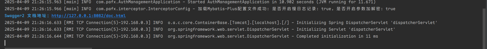
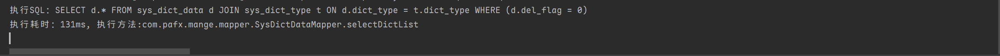
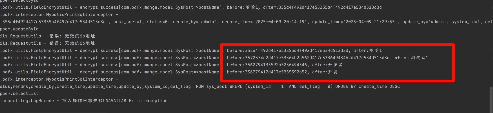
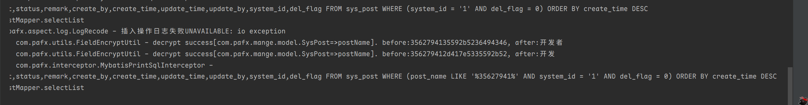

# Mybatisplus实现敏感数据自动加解密

> [!note]
> 需求：今天，公司新要求对数据库的敏感数据进行加密，对手机号、身份证号、姓名等一些敏感数据进行加密处理？
>
> - 通过程序实现数据加密解密 (快速便捷，尽量减少对原先代码的修改)
> - 可以通过`sql`查询对数据进行解密（通过密钥直接对数据库加密参数进行解密）
> - 数据库：`mysql`
>
> **思路**
>
> 1. 查询操作，需要对查询的关键字进行加密，同时也要对从库中查到的数据进行解密
> 2. 插入和更新操作，需要对插入或者更新的数据进行加密，然后保存到数据库。

## 1.1 自定义注解

**加密类注解**

```java
package com.pafx.annotation;

import java.lang.annotation.*;

/**
 * @Description 加解密注解
 * @Author EasonShu
 * @Data 2025/4/9 下午2:23
 */
@Inherited
@Target(ElementType.TYPE)
@Retention(RetentionPolicy.RUNTIME)
public @interface EncryptData {
}
```

**加密字段注解**

```java
package com.pafx.annotation;

import java.lang.annotation.*;

/**
 * @Description 字段加密注解
 * @Author EasonShu
 * @Data 2025/4/9 下午2:24
 */
@Inherited
@Target(ElementType.FIELD)
@Retention(RetentionPolicy.RUNTIME)
public @interface EncryptField {
}
```

**加密请求注解**

```java
package com.pafx.annotation;

import java.lang.annotation.*;

/**
 * @author : 瀚海
 * @date : 2025/4/9 18:58
 * @Desc : 加密请求
 */
@Target(ElementType.PARAMETER)
@Retention(RetentionPolicy.RUNTIME)
@Inherited
public @interface EncryptRequest {
}
```

## 1.2 加解密方法实现

- 定义加解密接口

```java
package com.pafx.sensitive;

/**
 * @Description
 * @Author EasonShu
 * @Data 2025/4/9 下午2:54
 */
public interface FieldEncryptService {

    /**对数据进行加密*/
    String encrypt(String value);

    /**对数据进行解密*/
    String decrypt(String value);

    /**判断数据是否加密*/
    default boolean isEncrypt(String value) {
        return false;
    }
}
```

- 基础实现类

```java
package com.pafx.sensitive;


import cn.hutool.core.util.ClassUtil;
import cn.hutool.core.util.StrUtil;
import com.baomidou.mybatisplus.core.exceptions.MybatisPlusException;
import lombok.extern.slf4j.Slf4j;
import org.apache.commons.codec.binary.Hex;
import org.springframework.stereotype.Component;

import javax.crypto.IllegalBlockSizeException;
import java.nio.charset.StandardCharsets;
import java.util.Base64;


/**
 * @Description 使用Base64加密解密
 * @Author EasonShu
 * @Data 2025/4/9 下午2:54
 */

@Component
@Slf4j
public class DefaultFieldEncryptService implements FieldEncryptService {

    private static final String DELIMITER = "-A~S";
    private static final Base64.Encoder ENCODER = Base64.getEncoder();
    private static final Base64.Decoder DECODER = Base64.getDecoder();

    @Override
    public String encrypt(String value) {
        if (StrUtil.isBlank(value)) {
            return value;
        }
        try {
            StringBuilder base64Parts = new StringBuilder();
            for (char c : value.toCharArray()) {
                // 将字符转换为字节数组（UTF-8）
                byte[] charBytes = String.valueOf(c).getBytes(StandardCharsets.UTF_8);
                // 对字节数组进行Base64编码
                String base64Encoded = ENCODER.encodeToString(charBytes);
                // 使用分隔符连接
                base64Parts.append(base64Encoded).append(DELIMITER);
            }
            // 移除最后一个分隔符
            String result = base64Parts.length() > 0
                    ? base64Parts.substring(0, base64Parts.length() - DELIMITER.length())
                    : "";
            // 将拼接后的Base64字符串转换为十六进制
            return Hex.encodeHexString(result.getBytes(StandardCharsets.UTF_8));
        } catch (Exception e) {
            log.error("DefaultFieldEncryptService encrypt error: {}", e.getMessage(), e);
        }
        return value;
    }

    @Override
    public String decrypt(String value) {
        if (StrUtil.isBlank(value)) {
            return value;
        }
        try {
            // 将十六进制字符串转换回字节数组
            byte[] hexDecodedBytes = Hex.decodeHex(value.toCharArray());
            // 将字节数组转换为Base64拼接的字符串
            String base64Concatenated = new String(hexDecodedBytes, StandardCharsets.UTF_8);
            // 分割Base64字符串
            String[] base64Parts = base64Concatenated.split("\\" + DELIMITER);
            StringBuilder decrypted = new StringBuilder();
            for (String part : base64Parts) {
                try {
                    // 对每个Base64部分进行解码
                    byte[] decodedBytes = DECODER.decode(part);
                    // 将字节数组转换为字符
                    decrypted.append(new String(decodedBytes, StandardCharsets.UTF_8));
                } catch (IllegalArgumentException e) {
                    // 如果解码失败（可能是由于分隔符导致的空字符串或其他原因），跳过该部分
                    log.warn("Decrypt part failed: {}", part);
                }
            }
            return decrypted.toString();
        } catch (Exception e) {
            log.error("DefaultFieldEncryptService decrypt error: {}", e.getMessage(), e);
        }
        return value;
    }

    @Override
    public boolean isEncrypt(String value) {
        // 简单判断是否为十六进制字符串
        return value.matches("^[0-9a-fA-F]+$");
    }
}
```

**加解密方法**

```java
package com.pafx.utils;

import cn.hutool.core.util.ClassUtil;
import cn.hutool.core.util.ReflectUtil;
import com.baomidou.mybatisplus.core.toolkit.CollectionUtils;
import com.pafx.annotation.EncryptField;
import com.pafx.sensitive.FieldEncryptService;
import lombok.Setter;
import lombok.extern.slf4j.Slf4j;
import org.apache.commons.lang3.reflect.FieldUtils;
import org.springframework.beans.factory.annotation.Autowired;
import org.springframework.core.annotation.AnnotationUtils;
import org.springframework.stereotype.Component;

import java.lang.reflect.Field;
import java.util.Collection;
import java.util.List;
import java.util.Objects;

/**
 * @Description
 * @Author EasonShu
 * @Data 2025/4/9 下午2:52
 */
@Slf4j
@Component
public class FieldEncryptUtil {


    @Setter(onMethod_ = {@Autowired})
    private FieldEncryptService fieldEncryptService;

    /**对EncryptField注解进行加密处理*/
    public void encrypt(Object obj) {
        if(ClassUtil.isPrimitiveWrapper(obj.getClass())) {
            return;
        }
        encryptOrDecrypt(obj, true);
    }

    /**对EncryptField注解进行解密处理*/
    public void decrypt(Object obj) {
        encryptOrDecrypt(obj, false);
    }

    /**对EncryptField注解进行解密处理*/
    public void decrypt(Collection list) {
        if(CollectionUtils.isEmpty(list)) {
            return;
        }
        list.forEach(this::decrypt);
    }

    /**对EncryptField注解进行加解密处理*/
    private void encryptOrDecrypt(Object obj, boolean encrypt) {
        if(Objects.isNull(obj)) {
            return;
        }
        List<Field> encryptFields = null;
        EncryptField encryptField = AnnotationUtils.findAnnotation(obj.getClass(), EncryptField.class);
        if(Objects.nonNull(encryptField)) {
            encryptFields = FieldUtils.getAllFieldsList(obj.getClass());
        } else {
            encryptFields = FieldUtils.getFieldsListWithAnnotation(obj.getClass(), EncryptField.class);
        }
        if(CollectionUtils.isEmpty(encryptFields)) {
            return;
        }
        encryptFields.forEach(f->{
            if(!ClassUtil.isAssignable(String.class, f.getType())) {
                return;
            }
            String oldValue = (String) ReflectUtil.getFieldValue(obj, f);
            if(StringUtils.isBlank(oldValue)) {
                return;
            }
            String logText = null, newValue = null;
            if(encrypt) {
                logText = "encrypt";
                newValue = fieldEncryptService.encrypt(oldValue);
            } else {
                logText = "decrypt";
                newValue = fieldEncryptService.decrypt(oldValue);
            }
//            log.info("{} success[{}=>{}]. before:{}, after:{}", logText, f.getDeclaringClass().getName(), f.getName(), oldValue, newValue);
            ReflectUtil.setFieldValue(obj, f, newValue);
        });
    }
}
```

## 1.3 拦截器

**更新或插入拦截器**

```java
package com.pafx.interceptor;

import com.baomidou.mybatisplus.core.MybatisParameterHandler;
import com.baomidou.mybatisplus.core.conditions.query.QueryWrapper;
import com.baomidou.mybatisplus.extension.plugins.pagination.Page;
import com.pafx.utils.FieldEncryptUtil;
import lombok.Setter;
import lombok.extern.slf4j.Slf4j;
import org.apache.ibatis.binding.MapperMethod;
import org.apache.ibatis.executor.parameter.ParameterHandler;
import org.apache.ibatis.plugin.Interceptor;
import org.apache.ibatis.plugin.Intercepts;
import org.apache.ibatis.plugin.Invocation;
import org.apache.ibatis.plugin.Signature;
import org.springframework.beans.factory.annotation.Autowired;
import org.springframework.stereotype.Component;

import java.sql.PreparedStatement;
import java.util.HashSet;
import java.util.Objects;

import static com.pafx.interceptor.InterceptorConfig.isEncrypt;

/**
 * @Description 更新或插入拦截器
 * @Author EasonShu
 * @Data 2025/4/9 下午2:41
 */
@Slf4j
@Intercepts({
        @Signature(type = ParameterHandler.class, method = "setParameters", args = PreparedStatement.class)
})
@Component
public class MybatisEncryptInterceptor implements Interceptor {

    @Setter(onMethod_ = {@Autowired})
    private FieldEncryptUtil fieldEncryptUtil;


    @Override
    public Object intercept(Invocation invocation) throws Throwable {
        boolean encrypt = isEncrypt();
        if (!encrypt) {
            return invocation.proceed();
        }
        if (invocation.getTarget() instanceof ParameterHandler) {
            MybatisParameterHandler parameterHandler = (MybatisParameterHandler) invocation.getTarget();
            Object parameterObject = parameterHandler.getParameterObject();
            if (Objects.nonNull(parameterObject)) {
                if (parameterObject instanceof MapperMethod.ParamMap) {
                    MapperMethod.ParamMap paramMap = (MapperMethod.ParamMap) parameterObject;
                    HashSet<Integer> stackSet = new HashSet<>();
                    for (Object key : paramMap.keySet()) {
                        if (stackSet.add(System.identityHashCode(paramMap.get(key)))) {
                            if (paramMap.get(key) instanceof QueryWrapper) {
                                // 跳过
                                continue;
                            }
                            if (paramMap.get(key) instanceof Page) {
                                // 跳过
                                continue;
                            }
//                            log.info("EncryptInterceptor intercept ParameterHandler paramMap value:{}", paramMap.get(key).toString());
                            fieldEncryptUtil.encrypt(paramMap.get(key));
                        }
                    }
                }
                // 单个参数情况
                else {
//                    log.info("EncryptInterceptor add value:{}", parameterObject);
                    fieldEncryptUtil.encrypt(parameterObject);
                }
            }
        }
        return invocation.proceed();
    }
}

```

**结果响应拦截器**

```java
package com.pafx.interceptor;

import com.baomidou.mybatisplus.core.toolkit.CollectionUtils;
import com.pafx.annotation.EncryptData;
import com.pafx.utils.FieldEncryptUtil;
import lombok.Setter;
import lombok.extern.slf4j.Slf4j;
import org.apache.ibatis.executor.resultset.ResultSetHandler;
import org.apache.ibatis.plugin.Interceptor;
import org.apache.ibatis.plugin.Intercepts;
import org.apache.ibatis.plugin.Invocation;
import org.apache.ibatis.plugin.Signature;
import org.springframework.beans.factory.annotation.Autowired;
import org.springframework.core.annotation.AnnotationUtils;
import org.springframework.stereotype.Component;

import java.sql.Statement;
import java.util.ArrayList;
import java.util.Objects;

import static com.pafx.interceptor.InterceptorConfig.isEncrypt;

/**
 * @Description mybatis拦截器，用于解密
 * @Author EasonShu
 * @Data 2025/4/9 下午3:21
 */
@Intercepts({
        @Signature(type = ResultSetHandler.class, method = "handleResultSets", args = Statement.class)
})
@Component
@Slf4j
public class MybatisResultSetIntercept implements Interceptor {


    @Setter(onMethod_ = {@Autowired})
    private FieldEncryptUtil fieldEncryptUtil;

    @Override
    public Object intercept(Invocation invocation) throws Throwable {
        boolean encrypt = isEncrypt();
        if (!encrypt) {
            return invocation.proceed();
        }
        Object result = invocation.proceed();
        if (Objects.isNull(result)) {
            return null;
        }
        if (result instanceof ArrayList) {
            ArrayList resultList = (ArrayList) result;
            if (CollectionUtils.isNotEmpty(resultList) && needToDecrypt(resultList.get(0))) {
                for (int i = 0; i < resultList.size(); i++) {
                    fieldEncryptUtil.decrypt(resultList.get(i));
                }
            }
        } else {
            if (needToDecrypt(result)) {
                fieldEncryptUtil.decrypt(result);
            }
        }
        return result;
    }


    /**
     * 判断是否需要解密
     *
     * @param object
     * @return
     */
    private boolean needToDecrypt(Object object) {
        Class<?> objectClass = object.getClass();
        EncryptData encryptDecryptClass = AnnotationUtils.findAnnotation(objectClass, EncryptData.class);
        if (Objects.nonNull(encryptDecryptClass)) {
            return true;
        }
        return false;
    }
}
```

**Sql打印拦截器**

```java
package com.pafx.interceptor;

import com.baomidou.mybatisplus.core.toolkit.CollectionUtils;
import com.pafx.utils.TimeUtil;
import lombok.extern.slf4j.Slf4j;
import org.apache.ibatis.cache.CacheKey;
import org.apache.ibatis.executor.Executor;
import org.apache.ibatis.mapping.BoundSql;
import org.apache.ibatis.mapping.MappedStatement;
import org.apache.ibatis.mapping.ParameterMapping;
import org.apache.ibatis.plugin.*;
import org.apache.ibatis.reflection.MetaObject;
import org.apache.ibatis.session.Configuration;
import org.apache.ibatis.session.ResultHandler;
import org.apache.ibatis.session.RowBounds;
import org.apache.ibatis.type.TypeHandlerRegistry;

import java.time.LocalDate;
import java.time.LocalDateTime;
import java.time.ZoneId;
import java.util.Date;
import java.util.List;
import java.util.Objects;

import static com.pafx.interceptor.InterceptorConfig.isSlowLog;

/**
 * @Description Mybatis打印SQL拦截器
 * @Author EasonShu
 * @Data 2025/4/9 下午1:26
 */
@Intercepts({
        @Signature(type = Executor.class, method = "update", args = {MappedStatement.class, Object.class}),
        @Signature(type = Executor.class, method = "query", args = {MappedStatement.class, Object.class, RowBounds.class, ResultHandler.class}),
        @Signature(type = Executor.class, method = "query", args = {MappedStatement.class, Object.class, RowBounds.class, ResultHandler.class, CacheKey.class, BoundSql.class}),
})
@Slf4j
public class MybatisPrintSqlInterceptor implements Interceptor {

    /**
     * 拦截器方法
     *
     * @param invocation
     * @return
     * @throws Throwable
     */
    @Override
    public Object intercept(Invocation invocation) throws Throwable {
        boolean slowLog = isSlowLog();
        if (!slowLog) {
            return invocation.proceed();
        }
        // 获取语句映射对象
        Object[] invocationArgs = invocation.getArgs();
        MappedStatement mappedStatement = (MappedStatement) invocationArgs[0];
        // 获取参数（条件）
        Object paramObject = null;
        // 2个以上的入参，也就是有额外的查询或更新条件
        if (invocationArgs.length > 1) {
            paramObject = invocationArgs[1];
        }
        BoundSql boundSql = mappedStatement.getBoundSql(paramObject);
        Configuration configuration = mappedStatement.getConfiguration();
        String mappedStatementId = mappedStatement.getId();
        // 开始执行时间
        long start = System.currentTimeMillis();
        // 执行方法
        Object returnValue = invocation.proceed();
        // 执行耗时
        long executeTime = System.currentTimeMillis() - start;
        // 拼接sql，参数注入
        String sql = concatSql(configuration, boundSql);
        // 打印sql
        logs(executeTime, sql, mappedStatementId);
        return returnValue;
    }


    /**
     * 拼接sql，参数注入
     *
     * @param configuration
     * @param boundSql
     * @return
     */
    private String concatSql(Configuration configuration, BoundSql boundSql) {
        Object parameterObject = boundSql.getParameterObject();
        List<ParameterMapping> parameterMappings = boundSql.getParameterMappings();
        String sql = boundSql.getSql().replaceAll("[\\s]+", " ");
        if (!CollectionUtils.isEmpty(parameterMappings) && Objects.nonNull(parameterObject)) {
            TypeHandlerRegistry typeHandlerRegistry = configuration.getTypeHandlerRegistry();
            if (typeHandlerRegistry.hasTypeHandler(parameterObject.getClass())) {
                sql = sql.replaceFirst("\\?", getParameterValue(parameterObject));
            } else {
                MetaObject metaObject = configuration.newMetaObject(parameterObject);
                for (ParameterMapping parameterMapping : parameterMappings) {
                    String propertyName = parameterMapping.getProperty();
                    if (metaObject.hasGetter(propertyName)) {
                        Object obj = metaObject.getValue(propertyName);
                        sql = sql.replaceFirst("\\?", getParameterValue(obj));
                    } else if (boundSql.hasAdditionalParameter(propertyName)) {
                        Object obj = boundSql.getAdditionalParameter(propertyName);
                        sql = sql.replaceFirst("\\?", getParameterValue(obj));
                    }
                }
            }
        }
        return sql;
    }

    /**
     * 获取参数
     *
     * @param obj
     * @return
     */

    private String getParameterValue(Object obj) {
        String value;
        if (obj instanceof String) {
            value = "'" + obj + "'";
        } else if (obj instanceof Date) {
            // 将 Date 转换为 LocalDateTime 再格式化
            value = "'" + TimeUtil.defaultFormat(((Date) obj).toInstant().atZone(ZoneId.systemDefault()).toLocalDateTime()) + "'";
        } else if (obj instanceof LocalDateTime) {
            value = "'" + TimeUtil.defaultFormat((LocalDateTime) obj) + "'";
        } else if (obj instanceof LocalDate) {
            value = "'" + TimeUtil.defaultFormat((LocalDate) obj) + "'";
        } else {
            if (obj != null) {
                value = obj.toString();
            } else {
                value = "";
            }
        }
        return value.replace("$", "\\$");
    }

    private void logs(long time, String sql, String sqlId) {
        log.info("\r\n执行SQL：{} \r\n执行耗时：{}ms, 执行方法:{}", sql, time, sqlId);
    }

    @Override
    public Object plugin(Object target) {
        // 如果是Executor（执行增删改查操作），则拦截下来
        if (target instanceof Executor) {
            return Plugin.wrap(target, this);
        }
        return target;
    }
}
```

## 1.4 AOP

```java
package com.pafx.aspect;

import com.pafx.annotation.EncryptData;
import com.pafx.annotation.EncryptField;
import com.pafx.annotation.EncryptRequest;
import com.pafx.sensitive.DefaultFieldEncryptService;
import lombok.RequiredArgsConstructor;
import lombok.extern.slf4j.Slf4j;
import org.aspectj.lang.ProceedingJoinPoint;
import org.aspectj.lang.annotation.Around;
import org.aspectj.lang.annotation.Aspect;
import org.aspectj.lang.annotation.Pointcut;
import org.springframework.stereotype.Component;

import java.lang.reflect.Field;
import java.util.Collection;
import java.util.Date;
import java.util.Map;

import static com.pafx.interceptor.InterceptorConfig.isEncrypt;

@Slf4j
@Aspect
@Component
@RequiredArgsConstructor
public class EncryptRequestAspect {

    private final DefaultFieldEncryptService encryptService;

    /**
     * 定义切入点：拦截所有带有@EncryptRequest注解的方法
     */
    @Pointcut("execution(* *(..,@com.pafx.annotation.EncryptRequest (*),..))")
    public void encryptRequestPointcut() {
        log.info("Request encryption pointcut...");
    }

    /**
     * 请求参数加密处理
     *
     * @param joinPoint 切点信息
     * @return 处理后的结果
     * @throws Throwable 异常
     */
    @Around("encryptRequestPointcut()")
    public Object around(ProceedingJoinPoint joinPoint) throws Throwable {
        boolean encrypt = isEncrypt();
        if (!encrypt) {
            return joinPoint.proceed();
        }
        // 获取请求参数
        Object[] args = joinPoint.getArgs();
        if (args == null || args.length == 0) {
            return joinPoint.proceed();
        }
        // 处理所有参数
        for (int i = 0; i < args.length; i++) {
            Object arg = args[i];
            if (shouldEncrypt(arg)) {
                args[i] = processRequestObject(arg);
            }
        }
        return joinPoint.proceed(args);
    }

    /**
     * 判断是否需要加密处理
     *
     * @param arg 参数对象
     * @return 是否需要加密
     */
    private boolean shouldEncrypt(Object arg) {
        return arg != null &&
                (arg.getClass().isAnnotationPresent(EncryptData.class) ||
                        arg.getClass().isAnnotationPresent(EncryptRequest.class));
    }

    /**
     * 处理请求对象
     *
     * @param requestObj 请求对象
     * @return 处理后的对象
     */
    private Object processRequestObject(Object requestObj) {
        try {
            // 处理基本类型直接加密
            if (isPrimitiveOrWrapper(requestObj.getClass())) {
                return encryptService.encrypt(requestObj.toString());
            }
            // 处理集合类型
            if (requestObj instanceof Collection) {
                ((Collection<?>) requestObj).forEach(item -> processItem(item));
            }
            // 处理Map类型
            else if (requestObj instanceof Map) {
                ((Map<?, ?>) requestObj).values().forEach(value -> processItem(value));
            }
            // 处理普通对象
            else {
                processFields(requestObj);
            }
            return requestObj;
        } catch (Exception e) {
            log.error("Request encryption failed", e);
            return requestObj;
        }
    }

    /**
     * 处理集合/Map中的每个元素
     *
     * @param item 元素
     */
    private void processItem(Object item) {
        if (item != null) {
            try {
                if (isPrimitiveOrWrapper(item.getClass())) {
                    // 基本类型直接加密
                    String encrypted = encryptService.encrypt(item.toString());
                    // 注意：这里无法直接修改集合中的元素，需要在上层处理
                } else {
                    processFields(item);
                }
            } catch (Exception e) {
                log.error("Item encryption failed", e);
            }
        }
    }

    /**
     * 递归处理对象字段
     *
     * @param obj 目标对象
     */
    private void processFields(Object obj) {
        Class<?> clazz = obj.getClass();
        while (clazz != null) {
            for (Field field : clazz.getDeclaredFields()) {
                if (field.isAnnotationPresent(EncryptField.class)) {
                    processField(obj, field);
                }
            }
            clazz = clazz.getSuperclass();
        }
    }

    /**
     * 处理单个字段加密
     *
     * @param object 对象实例
     * @param field  目标字段
     */
    private void processField(Object object, Field field) {
        try {
            field.setAccessible(true);
            Object originalValue = field.get(object);
            if (originalValue != null) {
                String processedValue;
                // 处理特殊类型
                if (originalValue instanceof Date) {
                    processedValue = encryptService.encrypt(originalValue.toString());
                } else {
                    processedValue = encryptService.encrypt(originalValue.toString());
                }
                // 设置加密后的值
                field.set(object, processedValue);
            }
        } catch (IllegalAccessException e) {
            log.error("Field encryption failed", e);
        }
    }

    /**
     * 判断是否是基础类型或其包装类
     *
     * @param clazz 类型
     * @return 是否基础类型
     */
    private boolean isPrimitiveOrWrapper(Class<?> clazz) {
        return clazz.isPrimitive() ||
                clazz == Boolean.class ||
                clazz == Character.class ||
                clazz == Byte.class ||
                clazz == Short.class ||
                clazz == Integer.class ||
                clazz == Long.class ||
                clazz == Float.class ||
                clazz == Double.class ||
                clazz == Void.class;
    }
}
```

## 1.5 配置类

```yaml
# Interceptor properties
mybatis.slowLog=true
mybatis.encrypt=true
```

```java
package com.pafx.interceptor;

import lombok.extern.slf4j.Slf4j;
import org.springframework.boot.ApplicationArguments;
import org.springframework.boot.ApplicationRunner;
import org.springframework.stereotype.Component;

import java.util.Properties;

/**
 * @author : 瀚海
 * @date : 2025/4/9 19:59
 * @Desc : Mybatis拦截器配置
 */
@Slf4j
@Component
public class InterceptorConfig implements ApplicationRunner {

    private static final Properties props = new Properties();

    static {
        try {
            props.load(InterceptorConfig.class.getClassLoader().getResourceAsStream("interceptor.properties"));
        } catch (Exception e) {
            throw new RuntimeException("加载配置文件失败", e);
        }
    }

    /**
     * 获取是否开启慢日志记录
     */
    public static boolean isSlowLog() {
        return Boolean.parseBoolean(props.getProperty("mybatis.slowLog", "false"));
    }

    /**
     * 是否开启参数加解密
     */
    public static boolean isEncrypt() {
        return Boolean.parseBoolean(props.getProperty("mybatis.encrypt", "false"));
    }

    @Override
    public void run(ApplicationArguments args) throws Exception {
        log.info("加载Mybatis-Plus配置文件成功: 是否开启慢日志记录: {}，是否开启参数加解密: {}", props.getProperty("mybatis.slowLog", "false"), props.getProperty("mybatis.encrypt", "false"));
    }
}
```


```java
package com.pafx.config;

import com.baomidou.mybatisplus.autoconfigure.ConfigurationCustomizer;
import com.baomidou.mybatisplus.extension.plugins.MybatisPlusInterceptor;
import com.pafx.interceptor.MybatisPrintSqlInterceptor;
import lombok.extern.slf4j.Slf4j;
import org.springframework.context.annotation.Bean;
import org.springframework.context.annotation.Configuration;

import javax.annotation.PostConstruct;

/**
 * @Description MybatisPlus配置
 * @Author EasonShu
 * @Data 2025/1/14 上午10:04
 */
@Configuration
@Slf4j
public class MybatisPlusConfig {

    /**
     * 分页插件
     */
    @Bean
    public MybatisPlusInterceptor paginationInterceptor() {
        return new MybatisPlusInterceptor();
    }


    /**
     * 打印sql
     *
     * @return
     */
    @Bean
    public ConfigurationCustomizer configurationCustomizer() {
        return configuration -> {
            configuration.addInterceptor(new MybatisPrintSqlInterceptor());
        };
    }


    @PostConstruct
    private void init() {
        log.info("Mybatis-Plus插件之拦截器的自动配置类 init");
    }

}
```

## 1.6 测试

- 启动



- Sql打印



- 加解密



- 查询

