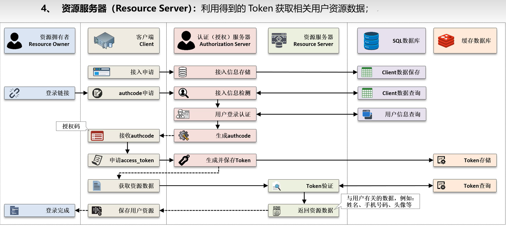
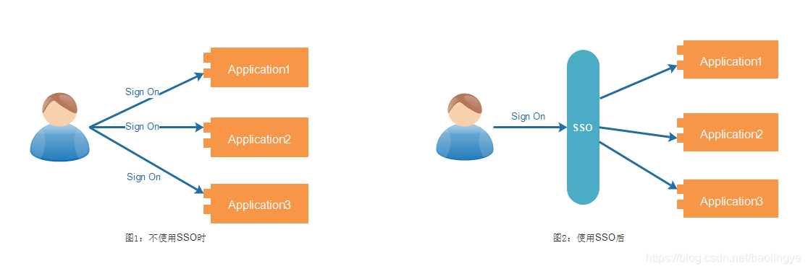
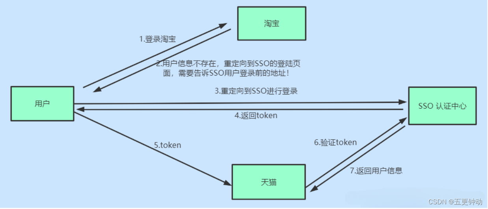
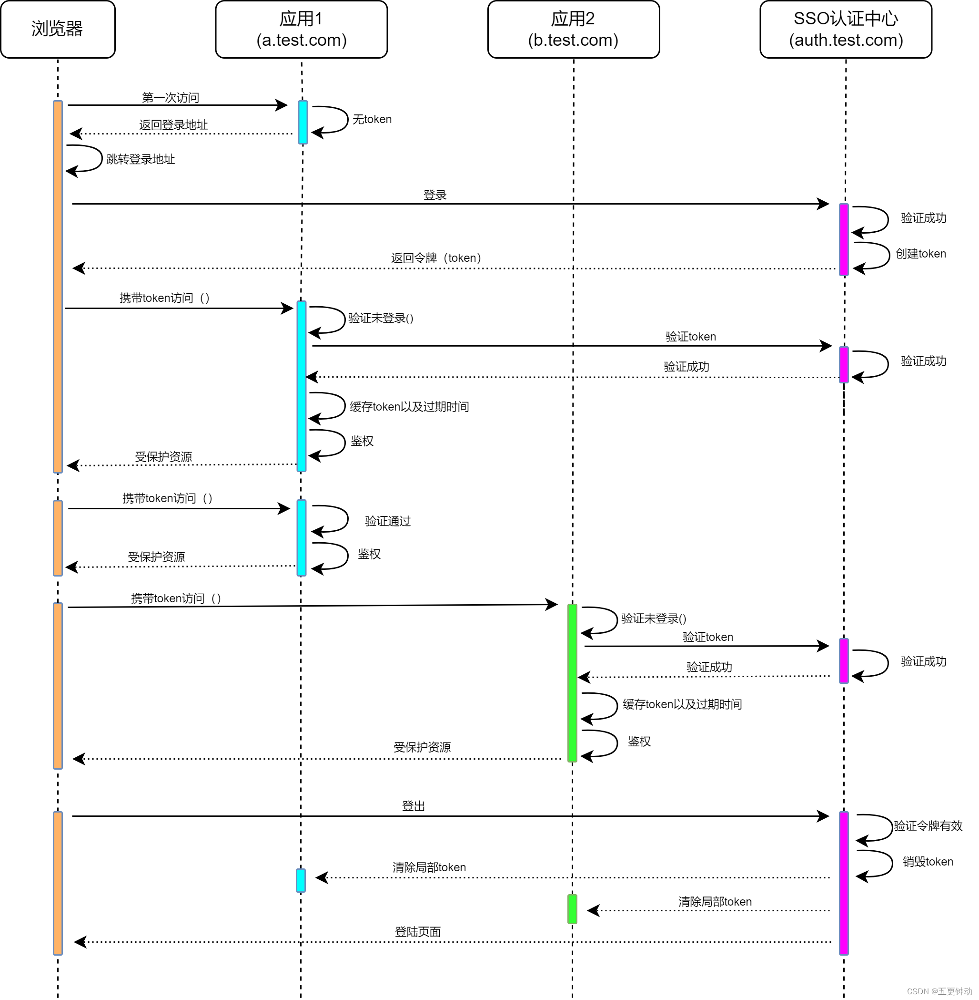

* https://www.cnblogs.com/Wddpct/p/8976480.html

## 1.1 背景

* 在企业发展初期，企业使用的系统很少，通常一个或者两个，每个系统都有自己的登录模块，用户用不同的账号即可登录，很方便。

* 但随着企业的发展，用到的系统随之增多，用户在操作不同的系统时，需要多次登录，而且每个系统的账号都不一样，这对于用户来说，很不方便。

* 于是，就想到是不是可以在一个系统登录，其他系统就不用登录了呢？这就是单点登录要解决的问题。

> 角色类型

* 资源拥有者（Resource Owner）‌：资源的合法拥有者。

* 客户端（Client）‌：请求访问资源的第三方应用程序。

* 资源服务器（Resource Server）‌：存储用户资源并响应带有有效令牌的请求。

* 授权服务器（Authorization Server）‌：负责发放和管理访问令牌。

> 授权类型

* 授权码模式（Authorization Code）‌：这是最常见的授权模式。**用户首先在授权服务器上认证，然后同意授权给客户端。授权服务器生成授权码，客户端使用这个授权码向授权服务器请求访问令牌。这**种方式下，用户的原始凭据不会传递给客户端应用。

* 简化模式（Implicit）‌：这种模式下，客户端直接从授权服务器获取令牌，而不是先获取授权码。这种方式适用于那些不支持复杂流程的客户端，如某些JavaScript应用。

* 密码模式（Resource Owner Password Credentials）‌：在这种模式下，客户端直接使用用户的用户名和密码来获取访问令牌。这种方式适用于信任客户端且用户直接提供凭据的场景。

* 客户端凭证模式（Client Credentials）‌：这种模式适用于那些不需要用户参与的场景，例如客户端以自己的名义请求访问令牌。

> 使用场景

* 不同应用系统可以根据具体需求选择合适的授权类型。例如，对于需要用户参与的Web应用，授权码模式可能更合适；而对于某些不需要用户直接参与的后台服务，客户端凭证模式可能更简单高效。

## 1.2 概念

单点登录英文全称Single Sign On，简称就是SSO。

* 它的解释是：在多个应用系统中，只需要登录一次，就可以访问其他相互信任的应用系统。例如，网页登录了淘宝账号，天猫，钉钉等阿里系应用都不用再二次登录了。

* &#x20;SSO核心意义就一句话：**一处登录，处处登录；一处注销，处处注销**。就是在多个应用系统中，用户只需要登录一次就可以访问所有相互信任的应用系统，即用户只需要记住一组用户名和密码就可以登录所有有权限的系统。

## 1.3 案例

* 在身边，淘宝和天猫是两个典型的电商平台，它们采用了单点登录（SSO）机制，让用户能够方便快捷地在这两个平台间切换而无需重新登录。用户首次登录淘宝，完成登录后，可以在不再输入账号和密码的情况下访问天猫。这种SSO机制使用户在淘宝和天猫之间实现无缝切换，提升了用户体验。

* 首次登录： 用户首次访问淘宝网站。在登录页面，用户输入阿里巴巴的统一账户（例如阿里巴巴账号和密码）。

* SSO认证： 阿里巴巴的SSO系统对用户进行身份验证，验证通过后生成一个令牌（Token）。

* 令牌颁发： 身份验证成功后，SSO系统颁发一个令牌给用户。

* 令牌使用： 用户使用该令牌访问淘宝网站。这个令牌包含有关用户身份的信息。

* 无需重新登录访问天猫： 用户在淘宝登录后，无需重新输入账号和密码，即可直接访问天猫网站。令牌的有效性使用户能够在淘宝和天猫之间实现无缝切换。

## 1.4 两种实现方式

### 1.4.1 **基于Cookie实现单点登录**

* Cookie-Based SSO是指使用Cookie来实现单点登录功能的一种方式。其原理是，在用户第一次登录系统时，系统会为用户颁发一个令牌（Token）。这个令牌包含了用户身份信息和过期时间等元数据，并在服务器端保存副本。然后，系统将这个令牌放入响应的Cookie中返回给客户端浏览器，并在后续的每个请求中都携带这个Cookie。当用户访问其他应用系统时，这些系统会验证Cookie中的令牌信息，如果令牌有效，则允许用户访问系统资源。

> 优点

* 实现简单：Cookie-Based SSO实现起来比较简单，不需要大量的代码。仅需要在用户登录时颁发令牌，并在每个请求中验证Cookie即可。

* 可扩展性好：可以很容易地添加新的应用系统，只需要验证Cookie中的令牌即可。

> 缺点

* 安全性低：Cookie-Based SSO是基于Cookie实现的，Cookie可能会被盗用或者伪造。如果攻击者获取了有效的Cookie，则可以冒充用户身份，并访问被授权的系统资源。

* 用户体验差：用户第一次登录时需要输入用户名和密码，并为每个系统都颁发一个Cookie。这样会增加用户的操作量，并且在使用多个浏览器或清理Cookie时可能会造成登录状态失效的问题。

* 难以处理跨域问题：Cookie-Based SSO只适用于同一域名下的应用程序，对于不同域名之间的系统无法实现单点登录。

### 1.4.2 **基于token实现单点登录**

* Token-Based SSO是指使用Token来实现单点登录功能的一种方式。其原理是，用户首先在认证服务器上进行身份验证，如果验证成功，则认证服务器会颁发一个Token。然后，这个Token会被发送到客户端浏览器，并通过HTTP请求携带在请求头中或者以参数的形式传递给其他应用系统。当用户访问其他应用系统时，这些系统会向认证服务器验证Token，如果Token有效，则允许用户访问系统资源。

> 优点

* 安全性高：Token-Based SSO使用Token来实现用户身份认证，Token本身是无法被伪造的，并且可以通过加密和签名等手段进一步加强安全性，可以有效防止Cookie劫持和伪造攻击。

* 用户体验好：用户只需要进行一次身份验证，并获得一个Token即可访问所有被授权的系统资源，不需要多次输入用户名和密码。同时，用户可以在任何时间清除应用系统保存的Token，以保护自身安全。

* 易于处理跨域问题：Token-Based SSO不依赖Cookie，因此可以很容易地处理跨域问题。

> 缺点

* 实现复杂：Token-Based SSO需要在认证服务器上实现用户身份验证、令牌颁发和Token验证等逻辑。这些逻辑可能比较复杂，需要一定的技术能力。

* 维护成本高：认证服务器需要长期维护和管理，才能保证系统的正常运行。另外，如果有多个应用系统需要接入SSO，还需要在每个系统中添加相应的Token验证逻辑，增加了维护成本。

## 1.5 原理

* 相比于单系统登录，**SSO需要一个独立的认证中心**，只有认证中心能接受用户的用户名密码等安全信息，其他系统不提供登录入口，只接受认证中心的间接授权。

* 间接授权通过令牌实现，SSO认证中心验证用户的用户名密码没问题，创建授权令牌，在接下来的跳转过程中，授权令牌作为参数发送给各个子系统，子系统拿到令牌，即得到了授权，可以借此创建局部会话，局部会话登录方式与单系统的登录方式相同。

这个过程，也就是单点登录的原理，用下图说明。

