# 前端开发文档

## 1.1 运行

> 注意node版本需要20以上

```bash
 npm install # 安装依赖
```

```bash
npm run dev   # 运行
```

## 1.2 目录结构

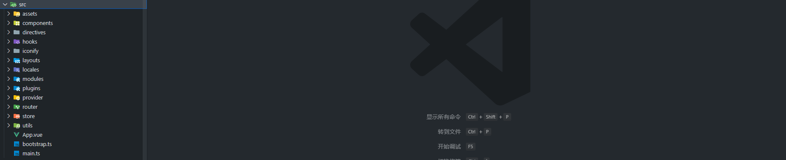

- `asset`: 静态资源目录
- `components`: 封装的公共组件库
- `directives`：封装的公共指令库
- `hook`: 内置函数
- `iconify`: 扩展图标库
- `layouts`: 项目布局
- `locales`: 国际化
- `model`: 我们需要开发的模块
- `plugin`: 开发的插件
- `provider`: 自定义服务开发
- `router`: 路由配置
- `srore`: 状态管理
- `utils`: 工具类
- `mian.ts`：入口文件

## 1.3 加解密原理

> 加解密采用：AES+RSA算法进行加解密，注意对于资源类请求我们没有加解密，比如附件的上传，等等资源类二进制流数据

> [!TIP]
>
> 大概流程：
>
> - 加密：
>
>   1：数据传输时，对参数进行AES加密处理
>
>   2：数据传输时，对AES解密KEY进行RSA加密处理
>
>   3：后端利用私钥对KEY进行解密，解密完成，利用解密的KEY对参数进行解密
>
>   4：后端解密完成，继续交给`SpringBoot`进行处理，向平常参数处理一样
>
> - 解密：
>
>   1：当后台逻辑处理完成，参数此时是加密返回的，加密的方式是也是才有RSA加密处理
>
>   2：我们将前端加密请求传递的解密KEY，返回在响应头中，拦截器进行解密处理

- get请求

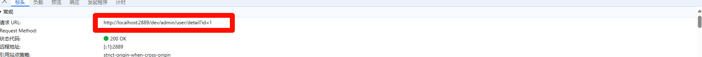

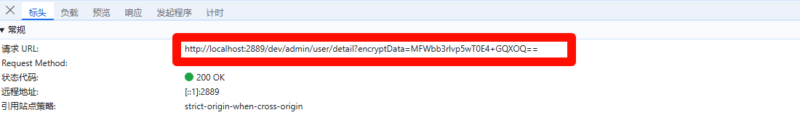

- post请求

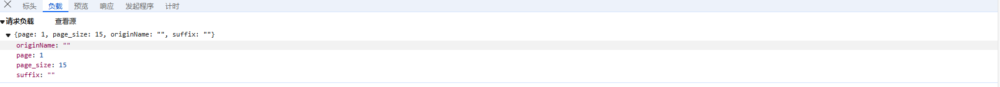

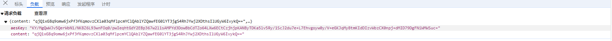

- 加解密开启，配置中开启

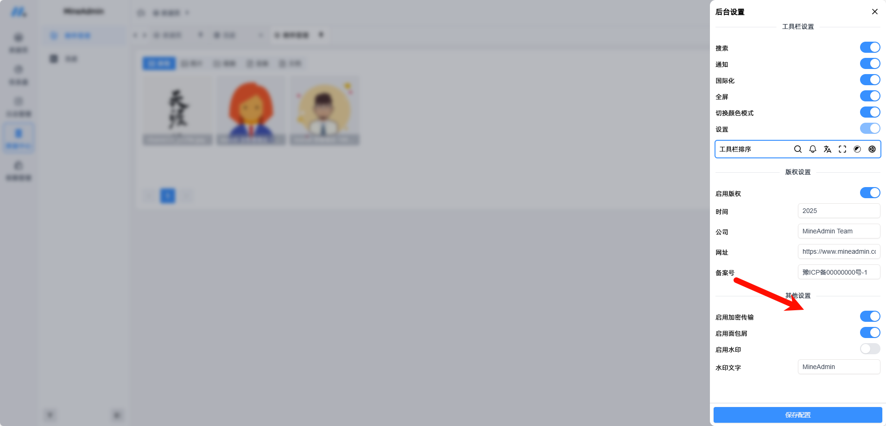

## 1.4 请求方式

> 我们在原来的基础上封装了两种加解密请求，Get与Post，如果是资源类请求请使用原始的Get与Post方法，且后缀以/upload结尾

- 使用：导入 `get, post`方法，进行处理
- 注意：url 必须以`/admin`开头
- 案例1

```ts
import { get, post } from '@/utils/request.ts'

// 查询用户列表
export function page(data: UserSearchVo): Promise<ResponseStruct<PageList<UserVo>>> {
  return post('/admin/user/list', data)
}
```

- 案例2

```ts
import { get } from '@/utils/request'

// 附件上传
export function upload(file: File): Promise<ResponseStruct<AttachmentVo>> {
  const formData = new FormData()
  formData.append('file', file)
  return useHttp().post('/admin/attachment/upload', formData)
}
```

## 1.5 页面开发

> model目录下我们进行页面的逻辑开发，下面是三大模块，需要遵循下面的原则

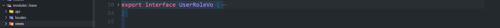

- `api`: 与后台交互的请求，定义实体类类型，请求URL
- `locales`: 国际化,不同语言之间的切换
- `views`: 业务组件，注意组件需要拆分处理，不要写在一起

> [!TIP]
>
> 具体开发参数配置参考网站：https://doc.mineadmin.com/zh/front/base/concept.html

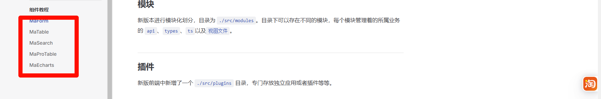

- 主要是封装组件的一些参数配置，比如默认值，请求处理等等， 注意对于一般的逻辑，利用封装好的组件可以快速进行开发，我们以用户管理为列


> 分层处理案例

- `Index.vue`：主界面逻辑处理
- `getTableColumns.tsx`: 表格列配置，https://doc.mineadmin.com/zh/front/component/ma-pro-table.html
- `getSearchItems.tsx`: 查询列配置，https://doc.mineadmin.com/zh/front/component/ma-search.html
- `getFormItems.txs`: 表单配置，新增，编辑： https://doc.mineadmin.com/zh/front/component/ma-form.html
- `from.vue`: 具体的表单组件逻辑处理

> [!TIP]
>
> 开发步骤

- 首先我们需要再菜单管理中新增自己的菜单，并对相应的角色进行授权，并添加用户


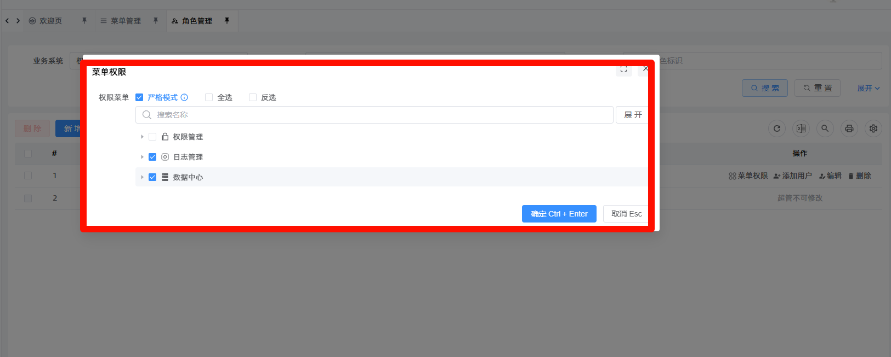

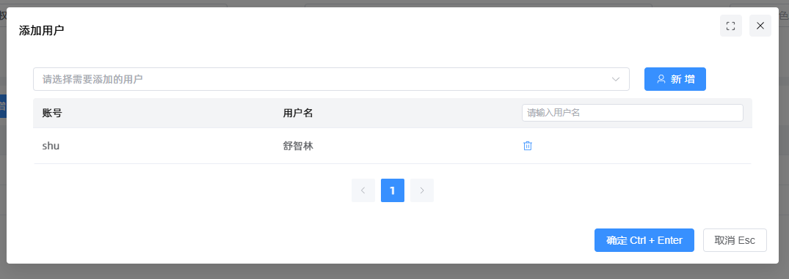

- 新增组件的文件夹，注意组件的路径需要与开发路径相对应

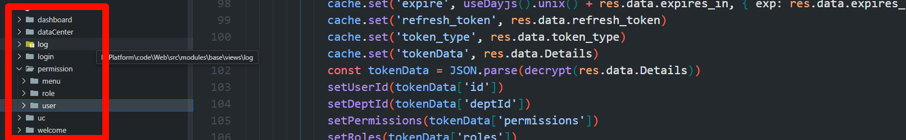

- 编写页面逻辑，后台交互

> 关键点讲解

- defineOptions：组件的定义

```vue
defineOptions({ name: "permission:menu", descName: "菜单管理" });
```

- defineProps： 父子通信

```vue
withDefaults(
  defineProps<{
    text?: string | (() => string)
    enable?: boolean
  }>(),
  {
    text: '',
    enable: true,
  },
)
```

- defineEmits: 子组件与父组件通信

```vue
const emit = defineEmits<{
  (event: 'add-btn', value: MenuVo): void
}>()
```

- defineModel: `defineModel`是一个宏，所以不需要从vue中`import`导入，直接使用就可以了。这个宏可以用来声明一个双向绑定 prop，通过父组件的 `v-model` 来使用。

```vue
const model = defineModel<ModelType>({ province: undefined, city: undefined, area: undefined})
```

- provide和inject依赖注入: `provide`和`inject`方法就是Vue 3实现这种依赖注入的工具。父组件通过`provide`提供数据，后代组件通过`inject`获取数据。这种模式特别适用于需要跨组件传递状态或配置的情况。

```vue
// 父组件向子组件传递数据
provide("newMenu", newMenu);
provide("setNodeExpand", setNodeExpand);

const newMenu = inject("newMenu") as Ref<MenuVo>;
const setNodeExpand = inject("setNodeExpand") as (
  id: number,
  state: boolean
) => void;
```

- defineExpose: 暴露子组件的方法与属性

```vue
defineExpose({
  treeRef: maTreeRef,
});

```

- vue 组件的ref: 在 Vue3 中，`ref` 可以用来获取对 DOM 元素或子组件实例的引用。当应用于子组件时，它允许你直接访问子组件的属性和方法，实现父子组件之间的通信和交互。

```vue
  <MenuForm ref="menuFormRef" />
  
   <MenuTree
        ref="menuTreeRef"
        :data="menuList"
        @menu-select="(menu: MenuVo) => {
          currentMenu = menu
          menuFormRef?.setData?.(menu)
        }"
        @system-id-select="(id: number) => {
          systemId= id
        }"
      />
```

## 1.6 自己开发组件

> 自己开发，不使用他封装的组件，利用element-plus自己完成页面开发

1： 组件的定义

```vue
defineOptions({name: "UserAddRole", description: "角色新增用户"});
```

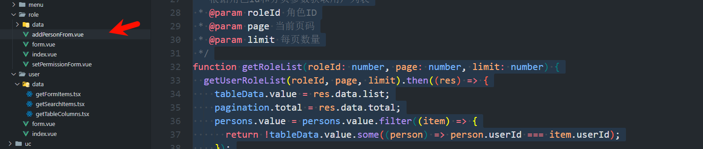

2: 页面逻辑开发

```vue
<!-- 角色新增用户 -->
<script setup lang="ts">
import type { TableInstance } from "element-plus";
import type { RoleVo } from "~/base/api/role.ts";
import { ref } from "vue";
import { useMessage } from "@/hooks/useMessage.ts";
import { Delete, User } from "@element-plus/icons-vue";
import { getAllUserDetail, getUserRoleList } from "~/base/api/user";
import { addUserRole, deleteUserRole } from "~/base/api/role";
import { UserVo, UserRoleVo } from "~/base/api/user";
defineOptions({name: "UserAddRole"});
const { data = null } = defineProps<{ data?: RoleVo | null }>();
const tableLayout = ref<TableInstance["tableLayout"]>("fixed");
const tableData = ref<UserRoleVo[]>([]);
const search = ref("");
const selectedPersons = ref<number[]>([]);
const persons = ref<UserVo[]>([]);
const t = useTrans().globalTrans;
const msg = useMessage();
const pagination = reactive({
  page: 1,
  limit: 10,
  total: 0,
});

/**
 * 根据角色id和分页参数获取用户列表
 * @param roleId 角色ID
 * @param page 当前页码
 * @param limit 每页数量
 */
function getRoleList(roleId: number, page: number, limit: number) {
  getUserRoleList(roleId, page, limit).then((res) => {
    tableData.value = res.data.list;
    pagination.total = res.data.total;
    persons.value = persons.value.filter((item) => {
      return !tableData.value.some((person) => person.userId === item.userId);
    });
  });
}

/**
 * 当页码改变时调用
 * @param page
 */
function handlePageChange(page: number) {
  pagination.page = page;
  getRoleList(data?.roleId ?? 0, pagination.page, pagination.limit);
}

/**
 * 当每页数量改变时调用
 * @param limit
 */
function handleSizeChange(limit: number) {
  pagination.limit = limit;
  getRoleList(data?.roleId ?? 0, pagination.page, pagination.limit);
}

/**
 * 添加用户到角色关系
 */
function addUserToRole() {
  if (selectedPersons.value.length > 0) {
    const roleId = data?.roleId ?? 0;
    const userIdList = selectedPersons.value;
    addUserRole({ roleId, userIds: userIdList }).then((res) => {
      res.code === 200
        ? msg.success(t("crud.createSuccess"))
        : msg.error(res.message);
      getRoleList(data?.roleId ?? 0, pagination.page, pagination.limit);
    });
  }
}

/**
 * 删除用户从角色关系
 * @param userId
 */
function deleteUserFromRole(userId: number) {
  const roleId = data?.roleId ?? 0;
  deleteUserRole({ roleId, userIds: [userId] }).then((res) => {
    res.code === 200
      ? msg.success(t("crud.delSuccess"))
      : msg.error(res.message);
    getRoleList(data?.roleId ?? 0, pagination.page, pagination.limit);
  });
}

// 自定义过滤函数
function filterUsers() {
  tableData.value = tableData.value.filter(
    (item) =>
      item?.nickname?.toLowerCase()?.includes(search.value.toLowerCase()) ||
      item?.username?.toLowerCase()?.includes(search.value.toLowerCase())
  );
  if (search.value === "") {
    getRoleList(data?.roleId ?? 0, pagination.page, pagination.limit);
  }
}

// 确认删除操作
function confirmDelete(userId: number) {
  msg
    .confirm(t("crud.delDataMessage"), t("crud.tip"))
    .then(() => {
      deleteUserFromRole(userId);
    })
    .catch(() => {});
}

// 监听 tableData 的变化
watch(
  () => tableData.value,
  () => {
    persons.value = persons.value.filter((item) => {
      return !tableData.value.some((person) => person.userId === item.userId);
    });
  },
  { deep: true }
);

// 挂载
onMounted(() => {
  getAllUserDetail().then((res) => {
    persons.value = res.data as UserVo[];
  });
  getRoleList(data?.roleId ?? 0, pagination.page, pagination.limit);
});
</script>
```

## 1.7 全局字典的使用

- 注册

