# 后端开发文档

## 1.1 架构

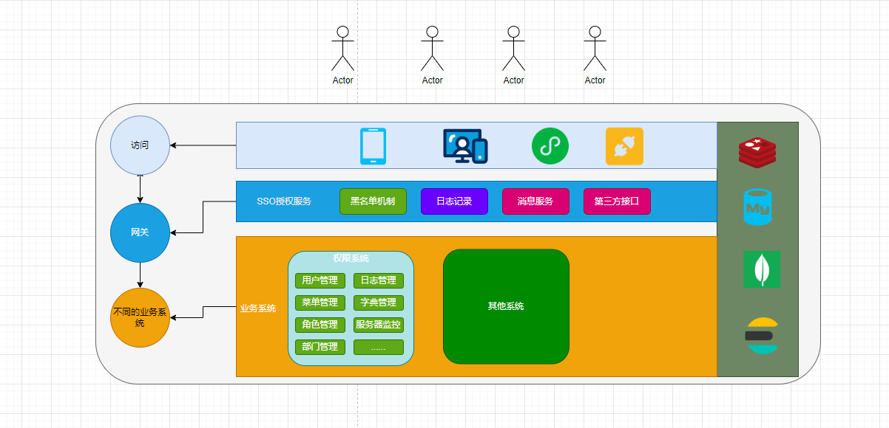

- 资源服务器授权逻辑


## 1.2 Maven管理

> [!TIP]
>
> Maven 管理采用`dependencyManagement` 统一版本管理

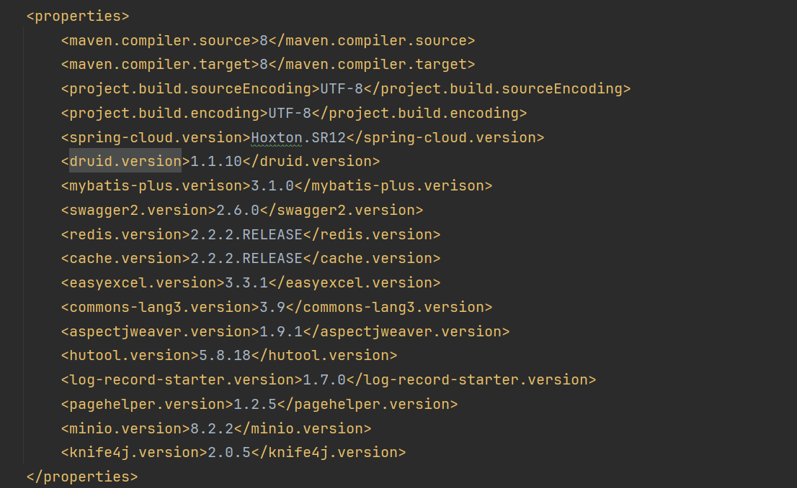

- 如果需要新增依赖，请统一版本管理，按需引入

## 1.3 目录结构

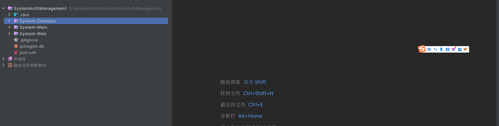

- `System-Common`: 公共功能模块，通用注解，配置，工具类等

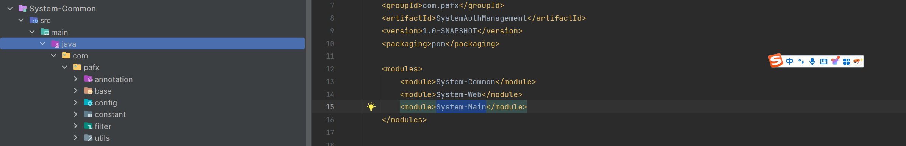

- `System-Web`: 逻辑开发模块，数据库操作，服务层，也有只针对于该模块有效的配置，工具类等等

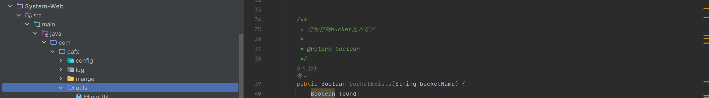

- `System-Main`: 主入口模块，控制器模块

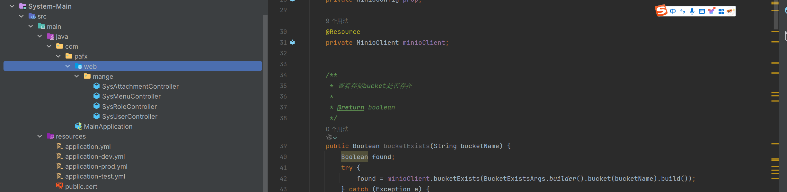

- 开发环境切换

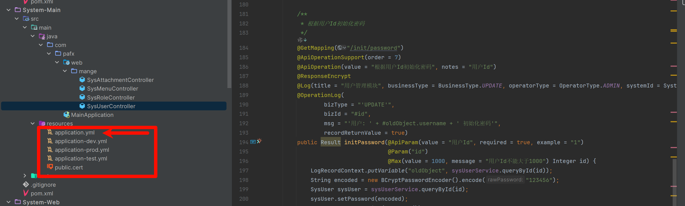

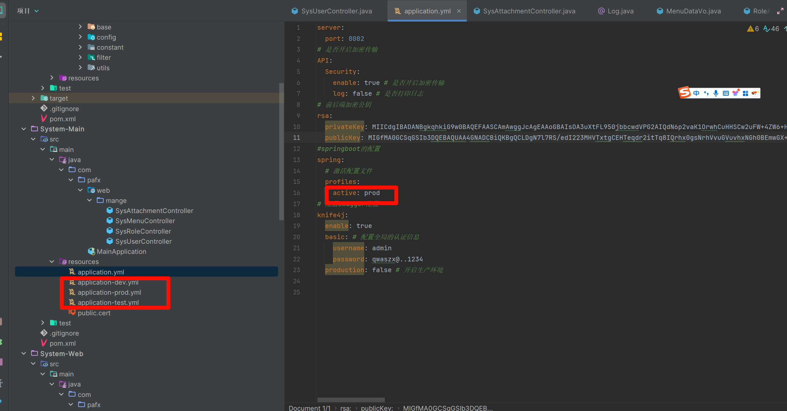

## 1.4 Mapper开发

> [!TIP]
>
> Mapper采用`MybatisPlus`开发

- 第一步定义实体类，为了快捷开发使用数据库设计工具的代码生成器更加快速开发，节约时间，直接复制

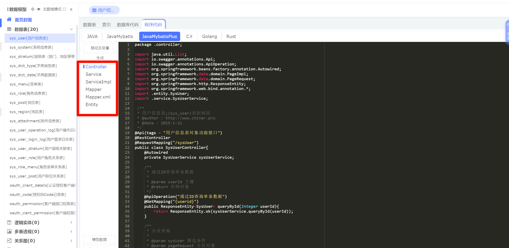

```java
package com.pafx.mange.model;

import com.baomidou.mybatisplus.annotation.TableId;
import com.baomidou.mybatisplus.annotation.TableName;
import io.swagger.annotations.ApiModel;
import io.swagger.annotations.ApiModelProperty;
import lombok.AllArgsConstructor;
import lombok.Data;
import lombok.NoArgsConstructor;

import java.io.Serializable;
import java.util.Date;

/**
 * @Description 附件信息表
 * @Author EasonShu
 * @Data 2025/1/15 上午9:49
 */
@ApiModel(value = "附件信息表",description = "")
@TableName("sys_attachment")
@Data
@AllArgsConstructor
@NoArgsConstructor
public class SysAttachment  implements Serializable,Cloneable {
    /**
     * 自增Id
     */
    @ApiModelProperty(name = "自增Id", notes = "",example = "1")
    @TableId
    private Integer attachmentId;
    /**
     * 存储模式:local=本地,oss=阿里云,qiniu=七牛云,cos=腾讯云
     */
    @ApiModelProperty(name = "存储模式:local=本地,oss=阿里云,qiniu=七牛云,cos=腾讯云", notes = "")
    private String storageMode;
    /**
     * 原文件名
     */
    @ApiModelProperty(name = "原文件名", notes = "")
    private String originName;
    /**
     * 新文件名
     */
    @ApiModelProperty(name = "新文件名", notes = "")
    private String objectName;
    /**
     * 文件hash
     */
    @ApiModelProperty(name = "文件hash", notes = "")
    private String hash;
    /**
     * 资源类型
     */
    @ApiModelProperty(name = "资源类型", notes = "")
    private String mimeType;
    /**
     * 存储目录
     */
    @ApiModelProperty(name = "存储目录", notes = "")
    private String storagePath;
    /**
     * 文件后缀
     */
    @ApiModelProperty(name = "文件后缀", notes = "")
    private String suffix;
    /**
     * 字节数
     */
    @ApiModelProperty(name = "字节数", notes = "")
    private String sizeByte;
    /**
     * 文件大小
     */
    @ApiModelProperty(name = "文件大小", notes = "")
    private String sizeInfo;
    /**
     * url地址
     */
    @ApiModelProperty(name = "url地址", notes = "")
    private String url;
    /**
     * 备注
     */
    @ApiModelProperty(name = "备注", notes = "")
    private String remark;
    /**
     * 创建时间
     */
    @ApiModelProperty(name = "创建时间", notes = "")
    private Date createTime;
    /**
     * 系统id
     */
    @ApiModelProperty(name = "系统id", notes = "",example = "1")
    private Integer systemId;
}
```

- 第二步Mapper开发，`MybatisPlus`的开发如下，需要继承`BaseMapper`

```java
package com.pafx.mange.mapper;

import com.baomidou.mybatisplus.core.mapper.BaseMapper;
import com.pafx.mange.model.SysAttachment;
import org.apache.ibatis.annotations.Mapper;

/**
 * @Description 系统附件表Mapper
 * @Author EasonShu
 * @Data 2025/1/15 上午9:58
 */
@Mapper
public interface SysAttachmentMapper  extends BaseMapper<SysAttachment> {
}

```

- 定义`Mapper`文件，`MybatisPlus`可以简化开发，但是对于复杂查询推荐自己写`Sql`语句

```xml
<?xml version="1.0" encoding="UTF-8"?>
<!DOCTYPE mapper PUBLIC "-//mybatis.org//DTD Mapper 3.0//EN" "http://mybatis.org/dtd/mybatis-3-mapper.dtd">
<mapper namespace="com.pafx.mange.mapper.SysAttachmentMapper">
</mapper>
```

```xml

    <!--  通过用户id获取拥有的菜单信息  -->
    <select id="getMenuByUserIdAndSystemId" resultType="com.pafx.mange.model.SysMenu">
        select distinct s1.*
        from sys_menu s1
                 inner join sys_role_menu s2 on s1.menu_id = s2.menu_id
                 inner join sys_role s3 on s3.role_id = s2.role_id
                 inner join sys_user_role s4 on s4.role_id = s3.role_id
        where s4.user_id = #{userId}
          and s3.status = '0'
          and s1.status = '1'
          and s1.del_flag = '0'
          and s3.system_id = #{systemId}
        order by s1.sort
    </select>

```

- SQL日志开启

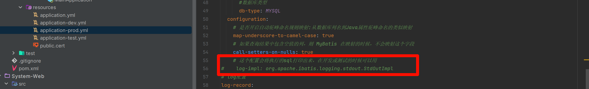

- 注意自定义的Sql开发参数传递最好加上`@Param`注解,避免错误

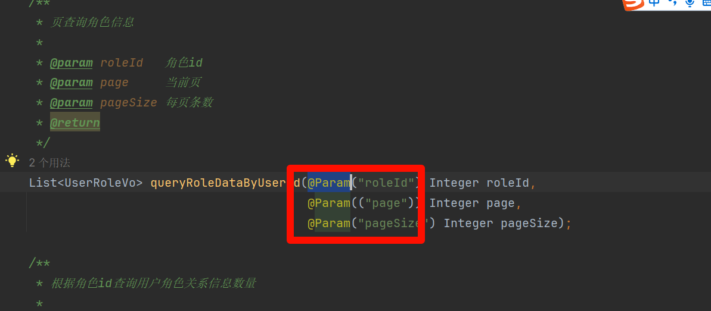

## 1.5 Service开发

> `Service` 分为接口与实现类，切Service需要继承`ServiceImpl`，如上面一样可以简化开发

- 接口

```java
package com.pafx.mange.service;

import com.baomidou.mybatisplus.core.metadata.IPage;
import com.baomidou.mybatisplus.extension.service.IService;
import com.pafx.mange.model.SysAttachment;
import com.pafx.mange.vo.AttachmentSearchVo;

/**
 * @Description
 * @Author EasonShu
 * @Data 2025/1/15 上午9:59
 */
public interface SysAttachmentService extends IService<SysAttachment> {

    /**
     * 根据条件查询文件信息
     * @param sysAttachment
     * @return
     */
    IPage<SysAttachment> queryFieleData(AttachmentSearchVo sysAttachment);
}

```

- 实现类，`QueryWrapper` 参数构造器相对于动态拼接Sql

```java
package com.pafx.mange.service.impl;

import com.baomidou.mybatisplus.core.conditions.query.QueryWrapper;
import com.baomidou.mybatisplus.core.metadata.IPage;
import com.baomidou.mybatisplus.extension.plugins.pagination.Page;
import com.baomidou.mybatisplus.extension.service.impl.ServiceImpl;
import com.pafx.mange.mapper.SysAttachmentMapper;
import com.pafx.mange.model.SysAttachment;
import com.pafx.mange.service.SysAttachmentService;
import com.pafx.mange.vo.AttachmentSearchVo;
import com.pafx.utils.StringUtils;
import org.springframework.beans.factory.annotation.Autowired;
import org.springframework.stereotype.Service;

/**
 * @Description 系统附件表服务实现类
 * @Author EasonShu
 * @Data 2025/1/15 上午10:05
 */
@Service
public class SysAttachmentServiceImpl extends ServiceImpl<SysAttachmentMapper, SysAttachment> implements SysAttachmentService {

    @Autowired
    private SysAttachmentMapper sysUserMapper;

    /**
     * 查询附件数据
     *
     * @param sysAttachment
     * @return
     */
    @Override
    public IPage<SysAttachment> queryFieleData(AttachmentSearchVo sysAttachment) {
        // 构造查询
        QueryWrapper<SysAttachment> queryWrapper = new QueryWrapper<>();
        // 文件名称
        if (StringUtils.isNotBlank(sysAttachment.getOriginName())) {
            queryWrapper.like("origin_name", sysAttachment.getOriginName());
        }
        // 后缀
        if (StringUtils.isNotBlank(sysAttachment.getSuffix())) {
            if (sysAttachment.getSuffix().contains(",")) {
                String[] suffix = sysAttachment.getSuffix().split(",");
                queryWrapper.in("suffix", suffix);
            }
        }
        // 排序
        queryWrapper.orderByDesc("create_time");
        return sysUserMapper.selectPage(new Page<SysAttachment>(sysAttachment.getPage(), sysAttachment.getPage_size()), queryWrapper);
    }
}

```

- 分页案例, 接口的返回如下

```java
  /**
     * 分页查询用户信息
     */
    IPage<SysUser> queryByUserSearchVo(UserSearchVo userSearchVo);
```

- 实现类: 利用`MybatisPlus`进行自动分页开发,当然也可以实现自己在`Sql`的分页

```java
    /**
     * 分页查询用户信息
     *
     * @param userSearchVo
     * @return
     */
    @Override
    public IPage<SysUser> queryByUserSearchVo(UserSearchVo userSearchVo) {
        QueryWrapper<SysUser> queryWrapper = new QueryWrapper<>();
        if (userSearchVo.getUsername() != null) {
            queryWrapper.like("username", userSearchVo.getUsername());
        }
        if (userSearchVo.getNickname() != null) {
            queryWrapper.like("nickname", userSearchVo.getNickname());
        }
        if (userSearchVo.getStatus() != null) {
            queryWrapper.eq("status", userSearchVo.getStatus());
        }
        if (userSearchVo.getDeptId() != null) {
            queryWrapper.eq("dept_id", userSearchVo.getDeptId());
        }
        if (userSearchVo.getSystemId() != null) {
            queryWrapper.eq("system_id", userSearchVo.getSystemId());
        }
        queryWrapper.eq("del_flag", 0);
        queryWrapper.orderByDesc("create_time");
        return sysUserMapper.selectPage(new Page<SysUser>(userSearchVo.getPage(), userSearchVo.getPage_size()), queryWrapper);
    }
```

```java
  /**
     * 根据角色id查询用户角色关系信息
     *
     * @param roleId   角色id
     * @param page     当前页
     * @param pageSize 每页条数
     * @return
     */
    @Override
    public IPage<UserRoleVo> queryRoleDataByUserId(Integer roleId, Integer page, Integer pageSize) {
        // 计算起始位置
        int start = (page - 1) * pageSize;
        // 查询用户角色关系信息
        List<UserRoleVo> userRoleList = sysRoleMapper.queryRoleDataByUserId(roleId, start, pageSize);
        // 查询用户角色关系总数
        int total = sysRoleMapper.queryRoleDataByUserIdCount(roleId);
        // 构造分页结果
        IPage<UserRoleVo> pageResult = new Page<>();
        pageResult.setRecords(userRoleList);
        pageResult.setTotal(total);
        pageResult.setCurrent(page);
        pageResult.setSize(pageSize);
        return pageResult;
    }
```

## 1.6 Controller开发

> - Controller 接口层, 需要继承`BaseController`,`BaseController` 中封装了一些公共的方法
> - 同一接口返回类为`Result`
> - 接口开头必须以`/admin`开头
> - 列表返回需要用`successList`, 普通返回用`success`

```java
package com.pafx.base;

import com.pafx.base.result.Result;
import org.slf4j.Logger;
import org.slf4j.LoggerFactory;
import org.springframework.security.core.context.SecurityContextHolder;
import org.springframework.security.core.userdetails.UserDetails;

import java.util.List;

/**
 * @Description web层通用数据处理
 * @Author EasonShu
 * @Data 2025/1/7 下午4:29
 */
public class BaseController {


    /**
     * 日志记录
     */
    private static Logger logger = LoggerFactory.getLogger(BaseController.class);

    /**
     * 成功，带消息返回
     *
     * @param data
     * @return
     */
    public Result success(Object data) {
        return Result.success(data);
    }

    /**
     * 成功，带消息返回
     *
     * @param data
     * @return
     */
    public Result successList(List data, int total) {
        return Result.successList(data, total);
    }


    /**
     * 错误 带消息返回
     *
     * @param message
     * @return
     */
    public Result error(String message) {
        return Result.fail(message);
    }


    public String getCurrentUsername() {
        Object principal = SecurityContextHolder.getContext().getAuthentication().getPrincipal();
        if (principal instanceof UserDetails) {
            return ((UserDetails) principal).getUsername();
        } else {
            return principal.toString();
        }
    }


}

```

- 案例：列表返回需要用`successList`, 普通返回用`success`

```java
  /**
     * 根据条件查询附件信息
     */
    @PostMapping("/query")
    @ApiOperation(value = "根据条件查询附件信息")
    @ApiOperationSupport(order = 2)
    @PreAuthorize("hasAuthority('dataCenter:attachment:list')")
    @Cacheable(value = "attachmentCache", key = "#attachmentSearchVo.originName+#attachmentSearchVo.suffix")
    @Log(title = "附件管理", businessType = BusinessType.QUERY, operatorType = OperatorType.ADMIN, systemId = SystemType.AUTH)
    public Result queryFileInfo(@ApiParam(value = "附件信息查询条件", required = true) @RequestBody AttachmentSearchVo attachmentSearchVo) {
        IPage<SysAttachment> page = sysAttachmentService.queryFieleData(attachmentSearchVo);
        return successList(page.getRecords(), (int) page.getTotal());
    }


    /**
     * 根据附件id删除附件信息
     */
    @GetMapping("/delete")
    @ApiOperation(value = "根据附件id删除附件信息")
    @ApiOperationSupport(order = 3)
    @PreAuthorize("hasAuthority('dataCenter:attachment:delete')")
    @Log(title = "附件管理", businessType = BusinessType.DELETE, operatorType = OperatorType.ADMIN, systemId = SystemType.AUTH, isRecordDetail = true)
    @OperationLog(
            bizType = "'DELETE'",
            bizId = "#id",
            msg = "'用户: ' + #username + ' 删除附件名称：' + #oldObject.originName",
            recordReturnValue = true
    )
    public Result deleteFileInfo(@ApiParam(value = "附件id", required = true) @RequestParam("id") Integer id) {
        SysAttachment sysAttachment = sysAttachmentService.getById(id);
        LogRecordContext.putVariable("username", getCurrentUsername());
        LogRecordContext.putVariable("oldObject", sysAttachment);
        if (sysAttachment != null) {
            String fileName = sysAttachment.getObjectName();
            boolean deleted = minioUtil.remove(fileName);
            if (!deleted) {
                return Result.fail("删除失败");
            }
        }
        boolean deleted = sysAttachmentService.removeById(id);
        if (!deleted) {
            return Result.fail("删除失败");
        }
        return Result.success("删除成功");
    }

```

## 1.7  Swagger文档

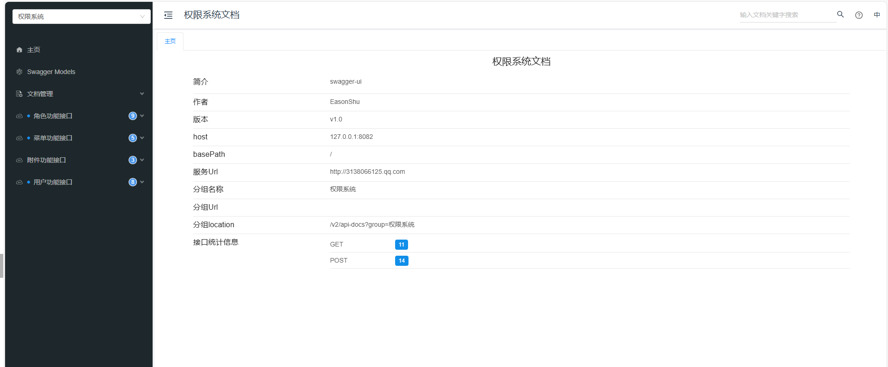

> `Swagger` 为了形成接口开发文档
>
> - http://127.0.0.1:8082/doc.html

> [!TIP]
>
> 实体类注解

- `@ApiModel`：为**实体类**添加注释
- `@ApiModelProperty`：为**实体类属性**添加注释

```java
package com.pafx.mange.vo;

import cn.monitor4all.logRecord.annotation.LogRecordDiffField;
import io.swagger.annotations.ApiModel;
import io.swagger.annotations.ApiModelProperty;
import lombok.AllArgsConstructor;
import lombok.Data;
import lombok.NoArgsConstructor;

import java.util.List;

/**
 * @Description 角色添加对象
 * @Author EasonShu
 * @Data 2025/1/19 上午10:07
 */
@ApiModel(value = "角色添加对象")
@Data
@AllArgsConstructor
@NoArgsConstructor
public class RoleAddVo {
    @ApiModelProperty(value = "角色id", required = true,example = "1")
    @LogRecordDiffField(alias = "角色id")
    private Integer roleId;
    @ApiModelProperty(value = "用户ids", required = true)
    @LogRecordDiffField(alias = "用户ids")
    private List<Integer> userIds;
}
```

> [!TIP]
>
> 接口层注解

- `@ApiOperation`：为**接口**添加注释
- `@ApiParam`：为**接口参数列表**添加注释
- `ApiOperationSupport`: 接口排序

```java
  /**
     * 根据条件查询附件信息
     */
    @PostMapping("/query")
    @ApiOperation(value = "根据条件查询附件信息")
    @ApiOperationSupport(order = 2)
    @PreAuthorize("hasAuthority('dataCenter:attachment:list')")
    @Cacheable(value = "attachmentCache", key = "#attachmentSearchVo.originName+#attachmentSearchVo.suffix")
    @Log(title = "附件管理", businessType = BusinessType.QUERY, operatorType = OperatorType.ADMIN, systemId = SystemType.AUTH)
    public Result queryFileInfo(@ApiParam(value = "附件信息查询条件", required = true) @RequestBody AttachmentSearchVo attachmentSearchVo) {
        IPage<SysAttachment> page = sysAttachmentService.queryFieleData(attachmentSearchVo);
        return successList(page.getRecords(), (int) page.getTotal());
    }
```

## 1.8 加解密注意

>[!TIP]
>
>- get请求用的是表单提交
>
>- post 用的是`json`提交
>
>- 且接口上需要加上`@ResponseEncrypt` 注解，当前端要求加密传输是，对返回结构进行加密处理
>
>  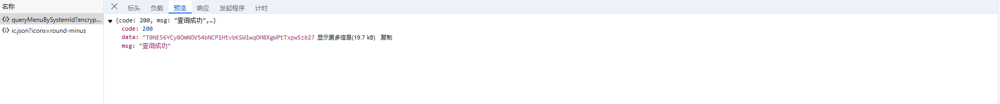

- Get案例, 注意参数的获取需要用 `@Param`注解，且前端接口文档需要保持字段一致，否则无法获取

前端

```ts
// 通过系统id查询菜单
export function queryMenuBySystemId(systemId: number): Promise<ResponseStruct<MenuVo[]>> {
  return get('/admin/menus/permission/queryMenuBySystemId', { systemId: systemId })
}
```

后端

```java
   /** 
     * 通过用户Id查询菜单列表
     */
    @GetMapping("/permission/queryMenuByUserId")
    @ResponseEncrypt
    @ApiOperationSupport(order = 1)
    @ApiOperation(value = "根据用户id查询菜单列表", notes = "用户id")
    @Log(title = "菜单功能模块", businessType = BusinessType.QUERY, operatorType = OperatorType.ADMIN, systemId = SystemType.AUTH)
    public Result queryMenuByUserId(@ApiParam(value = "用户id", required = true)
                                    @Param("id") @Min(value = 1, message = "用户id不能小于1") int id,
                                    @Param("systemId") @Min(value = 1, message = "系统id不能小于1") int systemId) {
        return success(sysMenuService.getMenuByUserIdAndSystemId(id, systemId));
    }

```

## 1.9 日志记录

>[!TIP]
>
>- 针对日志记录：我们有两种方式，不记录具体的操作信息与记录具体的操作信息
>- `@Log`与`@OperationLog`
>- 建议对于查询操作，直接使用`@Log`注解，对于更新，删除操作使用`@Log`与`@OperationLog`结合

> 普通查询请求

- @Log注解实现, 我们需要注意最后两个参数`操作系统id`与`是否记录详细信息`

```java
package com.pafx.annotation;

/**
 * @Description 日志记录
 * @Author EasonShu
 * @Data 2025/1/21 上午9:51
 */

import com.pafx.constant.BusinessType;
import com.pafx.constant.OperatorType;
import com.pafx.constant.SystemType;

import java.lang.annotation.*;

@Target({ElementType.PARAMETER, ElementType.METHOD})
@Retention(RetentionPolicy.RUNTIME)
@Documented
public @interface Log {
    /**
     * 模块
     */
    String title() default "";

    /**
     * 功能
     */
    BusinessType businessType() default BusinessType.OTHER;

    /**
     * 操作人类别
     */
    OperatorType operatorType() default OperatorType.ADMIN;

    /**
     * 是否保存请求的参数
     */
    boolean isSaveRequestData() default true;

    /**
     * 操作系统id: 1: 权限系统 2: 订单系统
     */
    SystemType systemId() default SystemType.AUTH;

    /**
     * 是否记录详细信息，默认为否
     */
    boolean isRecordDetail() default false;
}
```

- 普通查询请求案例，注意`isRecordDetail`默认值为`false`,所以我们不需要填写

```java
  /**
     * 3：根据用户查询条件获取用户列表
     *
     * @param userSearchVo
     * @return
     */
    @PostMapping("/list")
    @ApiOperationSupport(order = 3)
    @ApiOperation(value = "根据用户查询条件获取用户列表", notes = "用户查询条件")
    @ResponseEncrypt
    @Log(title = "用户管理模块", businessType = BusinessType.QUERY, operatorType = OperatorType.ADMIN, systemId = SystemType.AUTH)
    public Result getUserList(@ApiParam(value = "用户查询条件", required = true)
                              @RequestBody UserSearchVo userSearchVo) {
        IPage<SysUser> page = sysUserService.queryByUserSearchVo(userSearchVo);
        return successList(page.getRecords(), (int) page.getTotal());
    }

```

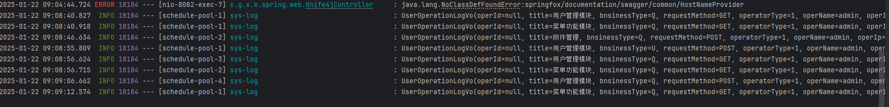

> 更新，删除请求

- 对于更新与删除请求就比较麻烦一点
- 第一步，我们需要再实体中利用`@LogRecordDiffField`注解标识这个字段代表啥字段

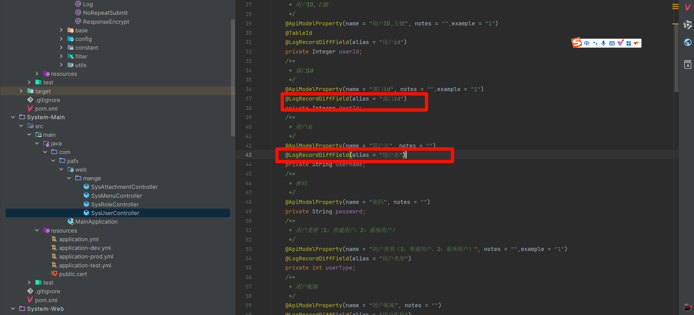

- 第二步，利用`@OperationLog`注解定义我们需要实现的内容，且需要加上`@Log`注解，注意需要将`isRecordDetail = true`

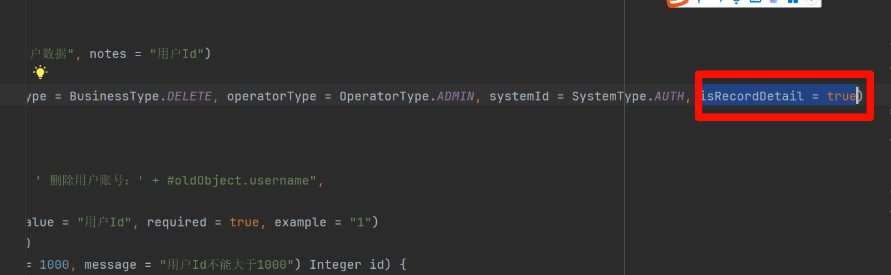

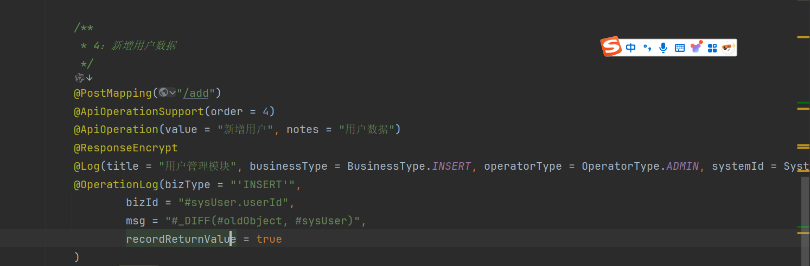

- 我们来具体讲解一下参数，
- bizType：业务类型，更新，删除，插入
- bizId：绑定的业务ID
- msg: 定义的消息，这个利用`spEL表达式`进行处理，可以使用默认的比较处理`#_DIFF(#oldObject, #sysUser)`,也可以自定义消息处理
- recordReturnValue：是否记录返回值

主要是msg的定义，简单来说我们就是对比两个对象，`oldObject`与`newObject`的值的变化，所以我们需要再线程上下文传递这个两个值，而`_DIFF`进行一个对比函数

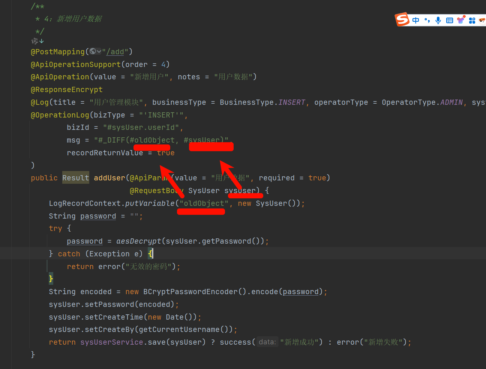

```java
  /**
     * 4：新增用户数据
     */
    @PostMapping("/add")
    @ApiOperationSupport(order = 4)
    @ApiOperation(value = "新增用户", notes = "用户数据")
    @ResponseEncrypt
    @Log(title = "用户管理模块", businessType = BusinessType.INSERT, operatorType = OperatorType.ADMIN, systemId = SystemType.AUTH, isRecordDetail = true)
    @OperationLog(bizType = "'INSERT'",
            bizId = "#sysUser.userId",
            msg = "#_DIFF(#oldObject, #sysUser)",
            recordReturnValue = true
    )
    public Result addUser(@ApiParam(value = "用户数据", required = true)
                          @RequestBody SysUser sysUser) {
        LogRecordContext.putVariable("oldObject", new SysUser());
        String password = "";
        try {
            password = aesDecrypt(sysUser.getPassword());
        } catch (Exception e) {
            return error("无效的密码");
        }
        String encoded = new BCryptPasswordEncoder().encode(password);
        sysUser.setPassword(encoded);
        sysUser.setCreateTime(new Date());
        sysUser.setCreateBy(getCurrentUsername());
        return sysUserService.save(sysUser) ? success("新增成功") : error("新增失败");
    }
```

上面的只是粗力度的控制，如果需要更加精细的控制，我们需要自定义msg,案例如下

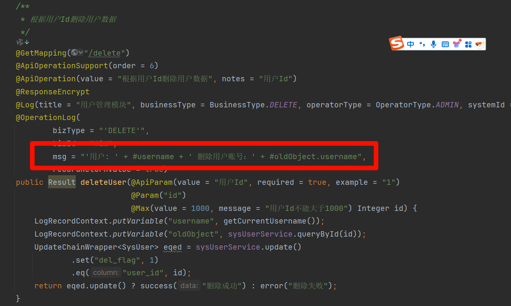

- 注意点，需要保持两个实体类的结构的一致性

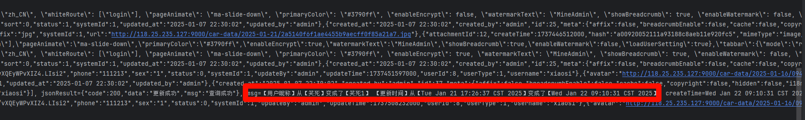

## 1.10 缓存处理

> - 缓存处理：Cache+Redis
> - 对于查询请求我们可以利用`@Cacheable`注解
> - `cacheNames/value` ：用来指定缓存组件的名字
> - `key` ：缓存数据时使用的 key，可以用它来指定。默认是使用方法参数的值。（这个 key 你可以使用 spEL 表达式来编写）
> - `keyGenerator` ：key 的生成器。 key 和 keyGenerator 二选一使用
> - `cacheManager` ：可以用来指定缓存管理器。从哪个缓存管理器里面获取缓存。
> - `condition` ：可以用来指定符合条件的情况下才缓存
> - `unless` ：否定缓存。当 unless 指定的条件为 true ，方法的返回值就不会被缓存。当然你也可以获取到结果进行判断。（通过 `#result` 获取方法结果）
> - `sync` ：是否使用异步模式。

```java

    /**
     * 根据条件查询附件信息
     */
    @PostMapping("/query")
    @ApiOperation(value = "根据条件查询附件信息")
    @ApiOperationSupport(order = 2)
    @PreAuthorize("hasAuthority('dataCenter:attachment:list')")
    @Cacheable(value = "attachmentCache", key = "#attachmentSearchVo.originName+#attachmentSearchVo.suffix")
    @Log(title = "附件管理", businessType = BusinessType.QUERY, operatorType = OperatorType.ADMIN, systemId = SystemType.AUTH)
    public Result queryFileInfo(@ApiParam(value = "附件信息查询条件", required = true) @RequestBody AttachmentSearchVo attachmentSearchVo) {
        IPage<SysAttachment> page = sysAttachmentService.queryFieleData(attachmentSearchVo);
        return successList(page.getRecords(), (int) page.getTotal());
    }

```

- 当第一次请求时，发现缓存中没有，直接走数据库，查询完毕，会将数据缓存到redias中，当我们指定的key发生变化时，才继续重复上面的逻辑，如果缓存命中，直接从redis中取出数据，默认缓存失效时间3分钟

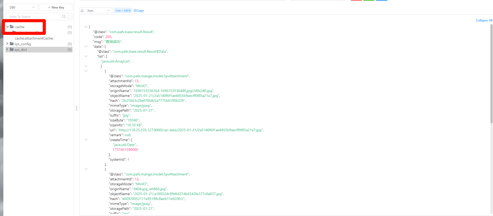

## 1.11 权限处理

> 为了防止恶意请求，与接口安全，我们需要做接口权限处理，这里我们介绍的是后端的处理，使用`@PreAuthorize`注解

- 我们首先需要找到我们定义的接口标识，菜单管理中的菜单标识

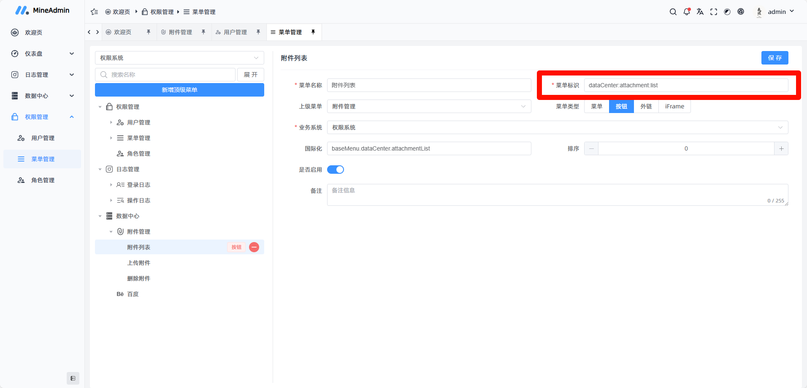

- 接口中定义相同的标识

```java

    /**
     * 根据条件查询附件信息
     */
    @PostMapping("/query")
    @ApiOperation(value = "根据条件查询附件信息")
    @ApiOperationSupport(order = 2)
    @PreAuthorize("hasAuthority('dataCenter:attachment:list')")
    @Cacheable(value = "attachmentCache", key = "#attachmentSearchVo.originName+#attachmentSearchVo.suffix")
    @Log(title = "附件管理", businessType = BusinessType.QUERY, operatorType = OperatorType.ADMIN, systemId = SystemType.AUTH)
    public Result queryFileInfo(@ApiParam(value = "附件信息查询条件", required = true) @RequestBody AttachmentSearchVo attachmentSearchVo) {
        IPage<SysAttachment> page = sysAttachmentService.queryFieleData(attachmentSearchVo);
        return successList(page.getRecords(), (int) page.getTotal());
    }

```

- 如果填写错误，会直接返回权限不足

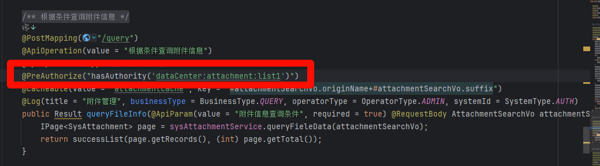

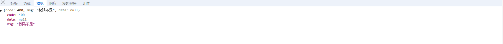
