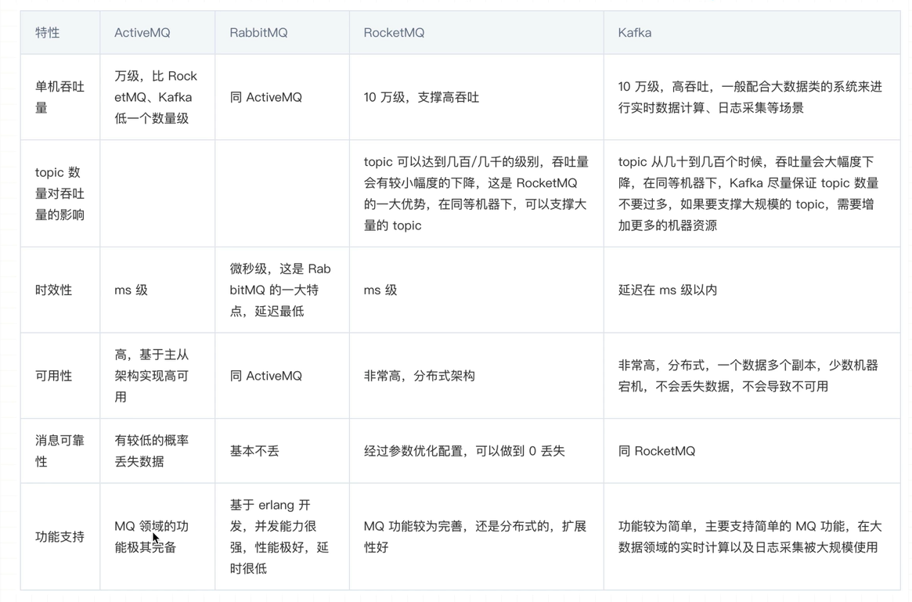
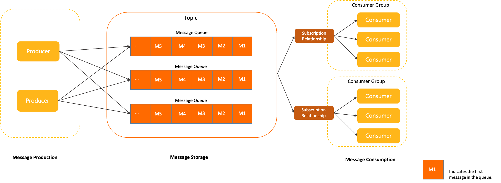

# RocketMQ应用指南

- 官网：https://rocketmq.apache.org
- 中文文档：https://rocketmq.apache.org/zh/docs

​																																																							

- 是一个队列模型的消息中间件，具有高性能、高可靠、高实时、分布式特点
- Apache RocketMQ 是一款典型的分布式架构下的中间件产品，使用异步通信方式和发布订阅的消息传输模型。通信方式和传输模型的具体说明，请参见下文**通信方式介绍**和**消息传输模型**介绍。 Apache RocketMQ 产品具备异步通信的优势，系统拓扑简单、上下游耦合较弱，主要应用于异步解耦，流量削峰填谷等场景。

## 1.1 概念

> （Message Model）

RocketMQ 主要由 Producer、Broker、Consumer 三部分组成，其中 Producer 负责生产消息，Consumer 负责消费消息，Broker 负责存储消息。Broker 在实际部署过程中对应一台服务器，每个 Broker 可以存储多个 Topic 的消息，每个 Topic 的消息也可以分片存储于不同的 Broker。MessageQueue 用于存储消息的物理地址，每个 Topic 中的消息地址存储于多个 MessageQueue 中。ConsumerGroup 由多个 Consumer 实例构成。

> 消息生产者（Producer）

负责生产消息，一般由业务系统负责生产消息。一个消息生产者会把业务应用系统里产生的消息发送到 broker 服务器。RocketMQ 提供多种发送方式，同步发送、异步发送、顺序发送、单向发送。同步和异步方式均需要 Broker 返回确认信息，单向发送不需要。

> 消息消费者（Consumer）

负责消费消息，一般是后台系统负责异步消费。一个消息消费者会从 Broker 服务器拉取消息、并将其提供给应用程序。从用户应用的角度而言提供了两种消费形式：拉取式消费、推动式消费。

> 主题（Topic）

表示一类消息的集合，每个主题包含若干条消息，每条消息只能属于一个主题，是 RocketMQ 进行消息订阅的基本单位。

> 代理服务器（Broker Server）

消息中转角色，负责存储消息、转发消息。代理服务器在 RocketMQ 系统中负责接收从生产者发送来的消息并存储、同时为消费者的拉取请求作准备。代理服务器也存储消息相关的元数据，包括消费者组、消费进度偏移和主题和队列消息等。

>名字服务（Name Server）

名称服务充当路由消息的提供者。生产者或消费者能够通过名字服务查找各主题相应的 BrokerIP 列表。多个 Namesrv 实例组成集群，但相互独立，没有信息交换。

> 拉取式消费（Pull Consumer）

Consumer 消费的一种类型，应用通常主动调用 Consumer 的拉消息方法从 Broker 服务器拉消息、主动权由应用控制。一旦获取了批量消息，应用就会启动消费过程。

> 推动式消费（Push Consumer）

Consumer 消费的一种类型，该模式下 Broker 收到数据后会主动推送给消费端，该消费模式一般实时性较高。

> 生产者组（Producer Group）

同一类 Producer 的集合，这类 Producer 发送同一类消息且发送逻辑一致。如果发送的是事务消息且原始生产者在发送之后崩溃，则 Broker 服务器会联系同一生产者组的其他生产者实例以提交或回溯消费。

> 消费者组（Consumer Group）

同一类 Consumer 的集合，这类 Consumer 通常消费同一类消息且消费逻辑一致。消费者组使得在消息消费方面，实现负载均衡和容错的目标变得非常容易。要注意的是，消费者组的消费者实例必须订阅完全相同的 Topic。RocketMQ 支持两种消息模式：集群消费（Clustering）和广播消费（Broadcasting）。

> 集群消费（Clustering）

集群消费模式下,相同 Consumer Group 的每个 Consumer 实例平均分摊消息。

> 广播消费（Broadcasting）

广播消费模式下，相同 Consumer Group 的每个 Consumer 实例都接收全量的消息。

> 消息（Message）

消息系统所传输信息的物理载体，生产和消费数据的最小单位，每条消息必须属于一个主题。RocketMQ 中每个消息拥有唯一的 Message ID，且可以携带具有业务标识的 Key。系统提供了通过 Message ID 和 Key 查询消息的功能。

> 标签（Tag）

为消息设置的标志，用于同一主题下区分不同类型的消息。来自同一业务单元的消息，可以根据不同业务目的在同一主题下设置不同标签。标签能够有效地保持代码的清晰度和连贯性，并优化 RocketMQ 提供的查询系统。消费者可以根据 Tag 实现对不同子主题的不同消费逻辑，实现更好的扩展性。

## 1.2 优缺点

## 1.3 架构概念

## 1.4 领域模型

- Apache RocketMQ 中消息的生命周期主要分为`消息生产`、`消息存储`、`消息消费`这三部分。
- 生产者生产消息并发送至 Apache RocketMQ 服务端，消息被存储在服务端的主题中，消费者通过订阅主题消费消息。

### 1.4.1 消息生产者

- Apache RocketMQ 中用于产生消息的运行实体，一般集成于业务调用链路的上游。生产者是轻量级匿名无身份的。

### 1.4.2 消息存储

- [主题（Topic）](https://rocketmq.apache.org/zh/docs/domainModel/02topic)：

  Apache RocketMQ 消息传输和存储的分组容器，主题内部由多个队列组成，消息的存储和水平扩展实际是通过主题内的队列实现的。

- [队列（MessageQueue）](https://rocketmq.apache.org/zh/docs/domainModel/03messagequeue)：

  Apache RocketMQ 消息传输和存储的实际单元容器，类比于其他消息队列中的分区。 Apache RocketMQ 通过流式特性的无限队列结构来存储消息，消息在队列内具备顺序性存储特征。

- [消息（Message）](https://rocketmq.apache.org/zh/docs/domainModel/04message)：

  Apache RocketMQ 的最小传输单元。消息具备不可变性，在初始化发送和完成存储后即不可变。

### 1.4.3 消息消费者

- [消费者分组（ConsumerGroup）](https://rocketmq.apache.org/zh/docs/domainModel/07consumergroup)：

  Apache RocketMQ 发布订阅模型中定义的独立的消费身份分组，用于统一管理底层运行的多个消费者（Consumer）。同一个消费组的多个消费者必须保持消费逻辑和配置一致，共同分担该消费组订阅的消息，实现消费能力的水平扩展。

- [消费者（Consumer）](https://rocketmq.apache.org/zh/docs/domainModel/08consumer)：

  Apache RocketMQ 消费消息的运行实体，一般集成在业务调用链路的下游。消费者必须被指定到某一个消费组中。

- [订阅关系（Subscription）](https://rocketmq.apache.org/zh/docs/domainModel/09subscription)：

  Apache RocketMQ 发布订阅模型中消息过滤、重试、消费进度的规则配置。订阅关系以消费组粒度进行管理，消费组通过定义订阅关系控制指定消费组下的消费者如何实现消息过滤、消费重试及消费进度恢复等。

## 1.5 消息传输模型

- 主流的消息中间件的传输模型主要为点对点模型和发布订阅模型。

### 1.5.1 点对点模型

点对点模型也叫队列模型，具有如下特点：

- 消费匿名：消息上下游沟通的唯一的身份就是队列，下游消费者从队列获取消息无法申明独立身份。
- 一对一通信：基于消费匿名特点，下游消费者即使有多个，但都没有自己独立的身份，因此共享队列中的消息，每一条消息都只会被唯一一个消费者处理。因此点对点模型只能实现一对一通信。

### 1.5.2 发布订阅模型

发布订阅模型具有如下特点：

- 消费独立：相比队列模型的匿名消费方式，发布订阅模型中消费方都会具备的身份，一般叫做订阅组（订阅关系），不同订阅组之间相互独立不会相互影响。
- 一对多通信：基于独立身份的设计，同一个主题内的消息可以被多个订阅组处理，每个订阅组都可以拿到全量消息。因此发布订阅模型可以实现一对多通信。

### 1.5.3 对比

- 点对点模型和发布订阅模型各有优势，点对点模型更为简单，而发布订阅模型的扩展性更高。
- Apache RocketMQ 使用的传输模型为发布订阅模型，因此也具有发布订阅模型的特点。