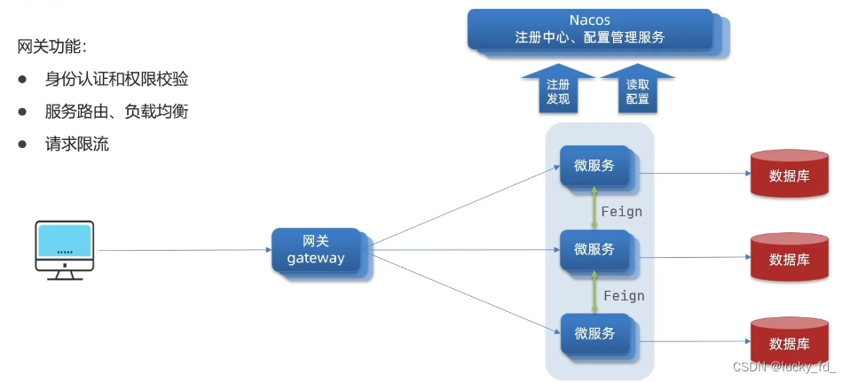

# 分布式课程之网关（GateWay）

- 官网：https://springdoc.cn/spring-cloud-gateway

- 单体应用拆分成多个服务后，对外需要一个统一入口，解耦[客户端](https://so.csdn.net/so/search?q=客户端&spm=1001.2101.3001.7020)与内部服务


- 微服务背景下，一个系统被拆分为多个服务，但是像安全认证，流量控制，日志，监控等功能是每个服务都需要的，没有网关的话，我们就需要在每个服务中单独实现，这使得我们做了很多重复的事情并且没有一个全局的视图来统一管理这些功能



## 1.1 介绍

- Spring Cloud Gateway 是Spring Cloud官方推出的第二代网关框架，定位于取代 Netflix Zuul。相比 Zuul 来说，Spring Cloud Gateway 提供更优秀的性能，更强大的有功能。

- Spring Cloud Gateway 是由 `WebFlux + Netty + Reactor` 实现的响应式的 API 网关。

- 它不能在传统的 servlet 容器中工作，也不能构建成 war 包。

- Spring Cloud Gateway 旨在为微服务架构提供一种简单且有效的 API 路由的管理方式，并基于 Filter 的方式提供网关的基本功能，例如说安全认证、监控、限流等等。

------

> 其他方案

- `Zuul 1.0` : Netflix开源的网关，使用Java开发，基于Servlet架构构建，本质就是 web 组件 web 三大组件（监听器 过滤器 servlet）便于二次开发。因为基于Servlet内部延迟严重，并发场景不友好，一个线程只能处理一次连接请求。 性能：使用的是 BIO（Blocking IO） tomcat7.0 以前都是 BIO 性能一般。
- `Zuul 2.0` : 采用Netty实现异步非阻塞编程模型，一个CPU一个线程，能够处理所有的请求和响应，请求响应的生命周期通过事件和回调进行处理，减少线程数量，开销较小。性能：性能好采用的是NIO，AIO 异步非阻塞，基于 spring5.x，springboot2.x 和 ProjectReactor 等技术。
- `GateWay` : 是Spring Cloud的一个全新的API网关项目，替换Zuul开发的网关服务，基于Spring5.0 + SpringBoot2.0 + WebFlux（基于⾼性能的Reactor模式响应式通信框架Netty，异步⾮阻塞模型）等技术开发，性能高于Zuul
- `Nginx+lua` : 性能要比上面的强很多，使用Nginx的反向代码和负载均衡实现对API服务器的负载均衡以及高可用，lua作为一款脚本语言，可以编写一些简单的逻辑，但是无法嵌入到微服务架构中。
- `Kong` : 基于OpenResty（Nginx + Lua模块）编写的高可用、易扩展的，性能高效且稳定，支持多个可用插件（限流、鉴权）等，开箱即可用，只支持HTTP协议，且二次开发扩展难，缺乏更易用的管理和配置方式

------

## 1.2 三大核心

三个核心：`路由、断言、过滤器`

- `路由（Route）`：能够与注册中心来结合作动态路由：是GateWay中最基本的组件之一，表示一个具体的路由信息载体，主要有一个ID、一个目标URI、一组断言和一组过滤器来定义，具体如下：

  - id：路由唯一标识，区别于其他的route。
  - url： 路由指向的目的地URL，客户端请求最终被转发到的微服务。
  - order： 用于多个Route之间的排序，数值越小越靠前，匹配优先级越高。
  - predicate：断言的作用是进行条件判断，只有断言为true，才执行路由。
  - filter: 过滤器用于修改请求和响应信息。

- `断言（Predicate）`：返回一个bool类型，用于表示在不同状态情况下，该请求是否符合要求。输入的类型是一个ServerWebExchange，可以使用其来匹配HTTP请求的任何内容，例如headers、cookie等等。

- `过滤器（filter）`：在gateway中分为两种类型filter：①Gateway filter。②Global filter。

  - 效果：能够对请求和响应进行修改处理。

  - 两种路由各自用途：

    ①：一个是针对某一个路由(路径)的 filter，例如对某一个接口做限流。

    ②：一个是针对全局的 filter token ip 黑名单。

## 1.3 工作流程


- Zuul 是基于Servlet的实现，在1.x版本属于阻塞式编程，在2.x后是基于netty，是非阻塞的。
- SpringCloudGateway则是基于Spring5中提供的WebFlux，属于响应式编程的实现，具备更好的性能。
- 目前一般都选用SpringCloudGateway，毕竟都是Spring家族一员，支持性更好。

## 1.4 基本使用

- 依赖

```xml
<?xml version="1.0" encoding="UTF-8"?>
<project xmlns="http://maven.apache.org/POM/4.0.0"
         xmlns:xsi="http://www.w3.org/2001/XMLSchema-instance"
         xsi:schemaLocation="http://maven.apache.org/POM/4.0.0 http://maven.apache.org/xsd/maven-4.0.0.xsd">
    <modelVersion>4.0.0</modelVersion>

    <groupId>com.shu</groupId>
    <artifactId>SpringCloudGateway</artifactId>
    <version>1.0-SNAPSHOT</version>
    <packaging>pom</packaging>

    <modules>
        <module>GatewayService</module>
    </modules>


    <properties>
        <maven.compiler.source>8</maven.compiler.source>
        <maven.compiler.target>8</maven.compiler.target>
        <project.build.sourceEncoding>UTF-8</project.build.sourceEncoding>
        <spring.boot.version>2.2.4.RELEASE</spring.boot.version>
        <spring.cloud.version>Hoxton.SR1</spring.cloud.version>
        <spring.cloud.alibaba.version>2.2.0.RELEASE</spring.cloud.alibaba.version>
    </properties>


    <!--   版本管理  -->
    <dependencyManagement>
        <dependencies>
            <dependency>
                <groupId>org.springframework.boot</groupId>
                <artifactId>spring-boot-starter-parent</artifactId>
                <version>${spring.boot.version}</version>
                <type>pom</type>
                <scope>import</scope>
            </dependency>
            <dependency>
                <groupId>org.springframework.cloud</groupId>
                <artifactId>spring-cloud-dependencies</artifactId>
                <version>${spring.cloud.version}</version>
                <type>pom</type>
                <scope>import</scope>
            </dependency>
            <dependency>
                <groupId>com.alibaba.cloud</groupId>
                <artifactId>spring-cloud-alibaba-dependencies</artifactId>
                <version>${spring.cloud.alibaba.version}</version>
                <type>pom</type>
                <scope>import</scope>
            </dependency>
        </dependencies>
    </dependencyManagement>


    <dependencies>
        <dependency>
            <groupId>org.springframework.cloud</groupId>
            <artifactId>spring-cloud-starter-gateway</artifactId>
        </dependency>
    </dependencies>

</project>
```

- 网关路由可以配置的内容包括：

- 路由id:路由唯一标示
- uri: 路由目的地，支持lb和http两种
- predicates: 路由断言，判断请求是否符合要求，符合则转发到路由目的地
- filters:路由过滤器，处理请求或响应

```yaml
server:
  port: 8888
spring:
  cloud:
    # Spring Cloud Gateway 配置项，对应 GatewayProperties 类
    gateway:
      # 路由配置项，对应 RouteDefinition 数组
      routes:
        - id: test1 # 路由的编号
          uri: https://www.lottecoffee.cn # 路由到的目标地址
          predicates: # 断言，作为路由的匹配条件，对应 RouteDefinition 数组
            - Path=/blog # 匹配 /blog 路径
          filters:
            - StripPrefix=1 # 删除前缀
        - id: test2 # 路由的编号
          uri: https://www.oschina.net # 路由的目标地址
          predicates: # 断言，作为路由的匹配条件，对应 RouteDefinition 数组
            - Path=/oschina # 匹配 /oschina 路径
          filters: # 过滤器，对请求进行拦截，实现自定义的功能，对应 FilterDefinition 数组
            - StripPrefix=1 # 删除前缀
```

- 配置类

```java
package com.shu;

import org.springframework.boot.SpringApplication;
import org.springframework.boot.autoconfigure.SpringBootApplication;

/**
 * @author : 瀚海
 * @date : 2025/4/4 11:36
 * @Desc : 网关服务
 */
@SpringBootApplication
public class GatewayApplication {
    public static void main(String[] args) {
       SpringApplication.run(GatewayApplication.class, args);
    }
}

```

- 测试

  

  - 访问127.0.0.1:8888/blog->https://www.lottecoffee.cn 
  - 访问127.0.0.1:8888/oschina->https://www.oschina.net 

我们可以看到一个简单的案例完成，对于同一个请求地址，我们完成了请求的分发

## 1.5 谓词

### 1.5.1 路由配置的两种形式

> 常用配置

- 路由到指定URL：访问 `GATEWAY_URL/**` 会转发到 `http://localhost:8001/**`，上面路由的配置必须和下面谓词（Predicate）配合使用才行

```yaml
spring:
  cloud:
    gateway:
      routes:
      - id: {唯一标识}
        uri: http://localhost:8001
```

- 精确匹配： 表示访问 `GATEWAY_URL/order/*`会转发到 `http://localhost:8001/order/*`

```yaml
spring:
  cloud:
    gateway:
      routes:
      - id: {唯一标识}
        uri: http://localhost:8001/
        predicates:
            - Path=/order/*

```

> 微服务配置

- 通配：表示访问 `GATEWAY_URL/**` 会转发到 `msb-order` 微服务的 `/**`,上面路由的配置必须和下面谓词（Predicate）配合使用才行

```yaml
spring:
  cloud:
    gateway:
      routes:
      - id: {唯一标识}
        uri: lb://msb-order
```

- 精确匹配: 表示访问 `GATEWAY_URL/order/` 会转发到 `msb-order` 微服务的 `/order/`

```yaml
spring:
  cloud:
    gateway:
      routes:
      - id: {唯一标识}
        uri: lb://msb-order/
        predicates:
            - Path=/order/*
```

### 1.5.2  谓词工厂分类

------


#### **1. 时间相关**

| 工厂类名称                     | 作用描述                                                     |
| ------------------------------ | ------------------------------------------------------------ |
| `AfterRoutePredicateFactory`   | 判断请求时间是否在指定时间之后（支持 `yyyy-MM-dd'T'HH:mm:ss` 格式）。 |
| `BeforeRoutePredicateFactory`  | 判断请求时间是否在指定时间之前。                             |
| `BetweenRoutePredicateFactory` | 判断请求时间是否在两个时间点之间。                           |

**YAML 配置示例**：

```yaml
predicates:
  - After=2023-10-01T00:00:00
  - Before=2023-12-31T23:59:59
  - Between=2023-10-01T00:00:00,2023-12-31T23:59:59
```

------

#### **2. Cookie 相关**

| 工厂类名称                    | 作用描述                                             |
| ----------------------------- | ---------------------------------------------------- |
| `CookieRoutePredicateFactory` | 根据请求中的 Cookie 键值对匹配（需同时指定键和值）。 |

**YAML 配置示例**：

```yaml
predicates:
  - Cookie=myCookie, myValue  # 匹配 Cookie 中键为 myCookie 且值为 myValue 的请求
```

------

#### **3. Header 相关**

| 工厂类名称                    | 作用描述                                                     |
| ----------------------------- | ------------------------------------------------------------ |
| `HeaderRoutePredicateFactory` | 根据请求头（Header）的键值对匹配（支持正则表达式）。         |
| `HostRoutePredicateFactory`   | 根据请求的 `Host` 头部匹配（支持通配符，如 `*.example.com`）。 |

**YAML 配置示例**：

```yaml
predicates:
  - Header=X-Request-Id, \d+  # 匹配请求头 X-Request-Id 且值为数字
  - Host=*.example.com        # 匹配所有子域名（如 a.example.com）
```

------

#### **4. 请求相关**

| 工厂类名称                                  | 作用描述                                                     |
| ------------------------------------------- | ------------------------------------------------------------ |
| `MethodRoutePredicateFactory`               | 根据 HTTP 方法（GET/POST/PUT 等）匹配。                      |
| `PathRoutePredicateFactory`                 | 根据请求路径匹配（支持通配符和正则表达式）。                 |
| `QueryRoutePredicateFactory`                | 根据请求参数（Query String）匹配（支持正则）。               |
| `RemoteAddrRoutePredicateFactory`           | 根据客户端 IP 地址匹配（支持 CIDR 表示法，如 `192.168.1.1/24`）。 |
| `WeightRoutePredicateFactory`               | 权重路由（用于灰度发布或流量分配）。                         |
| `XForwardedRemoteAddrRoutePredicateFactory` | 匹配经过代理后的客户端真实 IP（需依赖 `X-Forwarded-For` 头）。 |

**YAML 配置示例**：

```yaml
predicates:
  - Method=GET  # 仅匹配 GET 请求
  - Path=/user/{id:[0-9]+}/details  # 路径参数校验（id 必须为数字）
  - Query=userId, \d+  # 匹配参数 userId=数字
  - RemoteAddr=192.168.1.1/24  # 匹配指定 IP 段
  - Weight=group1, 80  # 权重配置（需配合组策略）
```

1. **权重路由（WeightRoutePredicateFactory）**：

   - 需配合 

     ```yaml
     spring:
       cloud:
         gateway:
           routes:
             - id: service_v1
               uri: lb://service-v1
               predicates:
                 - Path=/api/**
                 - Weight=group1, 80  # 80% 流量
             - id: service_v2
               uri: lb://service-v2
               predicates:
                 - Path=/api/**
                 - Weight=group1, 20  # 20% 流量
     ```
   
2. **X-Forwarded-For 相关**：

   - `XForwardedRemoteAddrRoutePredicateFactory` 用于获取客户端真实 IP（需网关配置信任代理）。

注意自定义谓词，详情请自己搜索

------

## 1.6 过滤器

### 1.6.1、核心过滤器分类

| **分类**       | **工厂类名称**         | **作用描述**                                       |
| -------------- | ---------------------- | -------------------------------------------------- |
| **请求头处理** | `AddRequestHeader`     | 添加请求头                                         |
|                | `RemoveRequestHeader`  | 移除请求头                                         |
| **响应头处理** | `AddResponseHeader`    | 添加响应头                                         |
|                | `RemoveResponseHeader` | 移除响应头                                         |
| **路径重写**   | `SetPath`              | 重写请求路径                                       |
|                | `RewritePath`          | 按正则表达式重写路径（更灵活）                     |
| **状态码控制** | `SetStatus`            | 强制修改响应状态码                                 |
| **重试机制**   | `Retry`                | 请求失败时自动重试                                 |
| **限流**       | `RequestRateLimiter`   | 基于令牌桶算法限流（需集成 Redis）                 |
| **转发与路由** | `StripPrefix`          | 去除路径前缀（例如 `/api/user/123` → `/user/123`） |
|                | `ForwardRoutingFilter` | 转发到指定 URL（不经过服务发现）                   |
| **参数处理**   | `Query`                | 添加/修改查询参数                                  |
| **跨域处理**   | `Cors`                 | 统一配置跨域规则                                   |

------

### 1.6.2、配置详情参考官网

#### **1. 请求头处理**

```yaml
spring:
  cloud:
    gateway:
      routes:
        - id: header-demo
          uri: http://httpbin.org
          predicates:
            - Path=/demo/**
          filters:
            - AddRequestHeader=X-Request-Id, 12345  # 添加请求头
            - RemoveRequestHeader=User-Agent        # 移除 User-Agent 头
```

#### **2. 响应头处理**

```yaml
filters:
  - AddResponseHeader=X-Response-Time, 2023     # 添加响应头
  - RemoveResponseHeader=Set-Cookie             # 移除 Set-Cookie 头
```

#### **3. 路径重写**

```yaml
filters:
  - SetPath=/api/{segment}                      # 将路径重写为 /api/{segment}
  - RewritePath=/user/(?<userId>[^/]+), /users/$\{userId}  # 正则重写（路径参数提取）
```

#### **4. 限流（Redis + RequestRateLimiter）**

```yaml
filters:
  - name: RequestRateLimiter
    args:
      key-resolver: "#{@userKeyResolver}"       # 使用 SpEL 引用 Key 解析器
      redis-rate-limiter.replenishRate: 10      # 每秒生成 10 个令牌
      redis-rate-limiter.burstCapacity: 20      # 最大令牌数 20
```

#### **5. 跨域配置（Cors）**

```yaml
filters:
  - Cors=
    allowedOrigins: "https://example.com"
    allowedMethods: "GET,POST"
    allowedHeaders: "*"
    allowCredentials: true
```

- 注意自定义过滤器，详情请自己搜索

## 1.7  全局过滤器

- 全局过滤器的作用也是处理一切进入网关的请求和微服务响应，与GatewayFilter的作用一样。区别在于GatewayFilter通过配置定义，处理逻辑是固定的。而GlobalFilter的逻辑需要自己写代码实现。我们可以通过GlobalFilter实现日志记录、权限校验、流量监控等功能
- 自定义全局过滤器实现网关鉴权

```java
@Component
public class AuthFilter implements GlobalFilter, Ordered {
    private static final Logger log = LoggerFactory.getLogger(AuthFilter.class);

    // 白名单，排除过滤的 uri 地址
    @Autowired
    private IgnoreWhiteProperties ignoreWhite;

    @Autowired
    private RedisService redisService;


    @Override
    public Mono<Void> filter(ServerWebExchange exchange, GatewayFilterChain chain) {
        ServerHttpRequest request = exchange.getRequest();
        ServerHttpResponse response = exchange.getResponse();
        ServerHttpRequest.Builder mutate = request.mutate();

        String url = request.getURI().getPath();
        // 跳过不需要验证的路径
        if (StringUtils.matches(url, ignoreWhite.getWhites())) {
            return chain.filter(exchange);
        }
        String token = getToken(request);
        if (StringUtils.isEmpty(token)) {
            token=getWebsocketToken(request,response);
            if (StringUtils.isEmpty(token)){
                return unauthorizedResponse(exchange, "令牌不能为空");
            }
        }
        Claims claims = JwtUtils.parseToken(token);
        if (claims == null) {
            return unauthorizedResponse(exchange, "令牌已过期或验证不正确！");
        }
        String userkey = JwtUtils.getUserKey(claims);
        boolean islogin = redisService.hasKey(getTokenKey(userkey));
        if (!islogin) {
            return unauthorizedResponse(exchange, "登录状态已过期");
        }
        String userid = JwtUtils.getUserId(claims);
        String username = JwtUtils.getUserName(claims);
        if (StringUtils.isEmpty(userid) || StringUtils.isEmpty(username)) {
            return unauthorizedResponse(exchange, "令牌验证失败");
        }
        String nickName = JwtUtils.getNickName(claims);


        // 设置用户信息到请求
        addHeader(mutate, SecurityConstants.USER_KEY, userkey);
        addHeader(mutate, SecurityConstants.DETAILS_USER_ID, userid);
        addHeader(mutate, SecurityConstants.DETAILS_USERNAME, username);
       
        // 内部请求来源参数清除
        removeHeader(mutate, SecurityConstants.FROM_SOURCE);
        return chain.filter(exchange.mutate().request(mutate.build()).build());
    }

    private void addHeader(ServerHttpRequest.Builder mutate, String name, Object value) {
        if (value == null) {
            return;
        }
        String valueStr = value.toString();
        String valueEncode = ServletUtils.urlEncode(valueStr);
        mutate.header(name, valueEncode);
    }

    private void removeHeader(ServerHttpRequest.Builder mutate, String name) {
        mutate.headers(httpHeaders -> httpHeaders.remove(name)).build();
    }

    private Mono<Void> unauthorizedResponse(ServerWebExchange exchange, String msg) {
        log.error("[鉴权异常处理]请求路径:{}", exchange.getRequest().getPath());
        return ServletUtils.webFluxResponseWriter(exchange.getResponse(), msg, HttpStatus.UNAUTHORIZED);
    }

    /**
     * 获取缓存key
     */
    private String getTokenKey(String token) {
        return CacheConstants.LOGIN_TOKEN_KEY + token;
    }

    /**
     * 获取请求token
     */
    private String getToken(ServerHttpRequest request) {
        String token = request.getHeaders().getFirst(TokenConstants.AUTHENTICATION);
        // 如果前端设置了令牌前缀，则裁剪掉前缀
        if (StringUtils.isNotEmpty(token) && token.startsWith(TokenConstants.PREFIX)) {
            token = token.replaceFirst(TokenConstants.PREFIX, StringUtils.EMPTY);
        }
        return token;
    }
    private String getWebsocketToken(ServerHttpRequest request,ServerHttpResponse response){
        String token = request.getHeaders().getFirst(TokenConstants.WEBSOCKET_AUTHENTICATION);
        ServerHttpRequest.Builder mutate = request.mutate();
        // 如果前端设置了令牌前缀，则裁剪掉前缀
        if (StringUtils.isNotEmpty(token) ) {
            response.getHeaders().set(TokenConstants.WEBSOCKET_AUTHENTICATION, token);
            removeHeader(mutate, TokenConstants.WEBSOCKET_AUTHENTICATION);
        }
        return token;
    }

    @Override
    public int getOrder() {
        return -200;
    }
}

```

## 1.8 过滤器的执行顺序

- 请求进入网关会碰到三类过滤器: 当前路由的过滤器、DefaultFilter、GlobalFilter。
- 请求路由后，会将当前路由过滤器和DefaultFilter、GlobalFilter，合并到一个过滤器链(集合)中，排序后依次执行每个过滤器。


- 每一个过滤器都必须指定一个int类型的order值，order值越小，优先级越高，执行顺序越靠前
- GlobalFilter通过实现Ordered接口，或者添加@Order注解来指定order值，由我们自己指定
- 路由过滤器和defaultFilter的order由Spring指定，默认是按照声明顺序从1递增
- 当过滤器的order值一样时，会按照 defaultFilter > 路由过滤器>GlobalFilter的顺序执行
  
