# 微服务注册中心
# 一 基础知识
## 1.1 概念
注册中心主要有三种角色：
- **服务提供者（RPC Server）**：在启动时，向 Registry 注册自身服务，并向 Registry 定期发送心跳汇报存活状态。
- **服务消费者（RPC Client）**：在启动时，向 Registry 订阅服务，把 Registry 返回的服务节点列表缓存在本地内存中，并与 RPC Sever 建立连接。
- [**服务注册中心**](https://cloud.tencent.com/product/rcc?from_column=20065&from=20065)**（Registry）**：用于保存 RPC Server 的注册信息，当 RPC Server 节点发生变更时，Registry 会同步变更，RPC Client 感知后会刷新本地 内存中缓存的服务节点列表。

最后，RPC Client 从本地缓存的服务节点列表中，基于负载均衡算法选择一台 RPC Sever 发起调用。


## 1.2 CAP理论

CAP定理是分布式系统设计中的核心理论，它指出在分布式系统中，一致性（Consistency）、可用性（Availability）和分区容忍性（Partition Tolerance）三个特性不可兼得，最多只能满足其中两项。

> CAP三要素详解

1. **一致性（Consistency）**
   - 所有节点在同一时间访问的数据完全一致。
   - 写操作后，任何后续读操作必须返回最新写入的值。
   - 实现方式：强一致性协议（如两阶段提交、Paxos/Raft），但可能牺牲性能和可用性。
2. **可用性（Availability）**
   - 每个请求都能得到响应（成功或失败），但不保证数据是最新的。
   - 系统始终可读写，即使部分节点故障。
   - 实现方式：异步复制、去中心化架构，但可能导致数据不一致。
3. **分区容忍性（Partition Tolerance）**
   - 系统在网络分区（节点间通信中断）时仍能继续运行。
   - 现实中网络分区难以避免，因此大多数系统必须选择支持分区容忍性。

> CAP的权衡选择

由于网络分区难以避免，实际系统通常在 **CP（一致且分区容忍）** 或 **AP（可用且分区容忍）** 之间选择：

- **CP系统（一致性优先）**
  - 分区发生时，牺牲可用性以保证数据一致。
  - 示例：ZooKeeper、Redis（集群模式）、关系型数据库（如PostgreSQL）。
  - 适用场景：金融交易、支付系统等强一致性要求的场景。
- **AP系统（可用性优先）**
  - 分区发生时，允许暂时不一致，但保证系统可用。
  - 示例：Cassandra、DynamoDB、MongoDB（最终一致性）。
  - 适用场景：社交媒体、电商购物车等对实时性要求高但可容忍短暂不一致的场景。
- **CA系统（一致且可用）**
  - 仅在不发生分区时成立，实际系统中几乎不可行，因此极少选择。

> CAP的误解与澄清

1. **CAP并非非黑即白**
   - 多数系统在分区恢复后通过异步复制实现最终一致性（如AP系统），或在特定场景下部分满足一致性（如“最终一致性”）。
2. **BASE理论补充**
   - BASE（Basically Available, Soft state, Eventually consistent）是AP的扩展，强调基本可用、软状态和最终一致性，适用于大规模分布式系统。
3. **现代系统的灵活设计**
   - 许多系统（如NewSQL、NewSQL数据库）通过多区域复制、CRDTs（冲突解决数据类型）等机制，在CAP三者间动态平衡，而非固定选择两项。

------

## 1.3 一致性算法

### Paxos 协议

#### **核心思想**

- 解决分布式系统中的**共识问题**，即在网络分区、节点故障等异常情况下，如何保证多个节点对某一值达成一致。
- 基于**两阶段提交（Prepare-Promise 和 Accept-Accepted）**，通过多轮投票确保多数派（Majority）同意。

#### **关键特性**

- **容错性**：容忍少数节点故障（只要多数节点存活即可达成共识）。
- **正确性**：数学上严格证明其安全性（唯一确定的共识值）。
- **复杂性**：协议流程复杂，实现难度高，调试困难。

#### **流程简图**

```markdown
提议者 (Proposer)  
  → 发送 Prepare 请求 → 接受者 (Acceptor)  
  → 返回 Promise（承诺不再接受更小编号的提议）  
  → 提议者收到多数 Promise → 发送 Accept 请求  
  → 接受者根据规则接受或拒绝 → 达成共识
```

#### **应用场景**

- **Google Chubby 锁服务**：用于分布式锁和元数据管理。
- **Apache ZooKeeper（早期版本）**：ZAB 协议灵感来源于 Paxos。
- **金融交易系统**：对强一致性要求极高的场景。

------

### Raft 协议

#### **核心思想**

- 为解决 Paxos 的**复杂性问题**而设计，强调**可理解性**和**易实现性**。
- 将共识过程分为**领导选举（Leader Election）**和**日志复制（Log Replication）**两个阶段，逻辑更清晰。

#### **关键特性**

- **强领导模式**：通过选举一个 Leader 节点处理所有客户端请求，简化日志同步。
- **线性化读写**：Leader 直接处理读写，避免多节点并发冲突。
- **故障恢复**：Leader 失效时触发新一轮选举，容忍脑裂问题。

#### **流程简图**

```markdown
1. 选举阶段  
   - 节点发起投票，得票过半的节点成为 Leader。  
2. 日志复制阶段  
   - Client 请求发送给 Leader → Leader 写入本地日志 → 同步到 Follower → 多数确认后提交。
```

#### **应用场景**

- **分布式存储系统**：如 etcd、Consul、TiKV。
- **云原生领域**：Kubernetes 的 etcd 使用 Raft。
- **需要高可维护性的系统**：开发与运维成本较低。

------

###  ZAB 协议

#### **核心思想**

- 专为 **ZooKeeper** 设计的一致性协议，结合了 Paxos 和原子广播（Atomic Broadcast）思想。
- 强调**全局顺序一致性**，所有事务按全局顺序执行。

#### **关键特性**

- **崩溃恢复模式**：分为恢复阶段（选主）和广播阶段（同步数据）。
- **顺序一致性**：所有写入操作按全局顺序广播到所有节点。
- **高效同步**：利用 FIFO 队列优化 Follower 的数据同步。

#### **流程简图**

```markdown
1. 恢复阶段  
   - 选举 Leader，同步最新事务 ID。  
2. 广播阶段  
   - Leader 接收事务请求 → 分配全局事务 ID → 广播到 Follower → 多数确认后提交。
```

#### **应用场景**

- **ZooKeeper 自身**：用于分布式协调（如配置管理、服务发现）。
- **分布式锁与选主**：依赖强一致性的协调任务。

------

### 对比总结

| 特性           | Paxos                  | Raft                     | ZAB                              |
| -------------- | ---------------------- | ------------------------ | -------------------------------- |
| **目标**       | 解决通用共识问题       | 简化 Paxos，易实现       | 支持 ZooKeeper 的原子广播        |
| **领导者角色** | 无明确 Leader          | 强 Leader，简化日志复制  | 强 Leader，全局顺序广播          |
| **复杂度**     | 高（需处理多轮交互）   | 中（逻辑清晰，易于实现） | 中（针对 ZooKeeper 优化）        |
| **容错性**     | 容忍少数节点故障       | 容忍少数节点故障         | 容忍少数节点故障                 |
| **典型应用**   | Chubby、金融系统       | etcd、Kubernetes、TiKV   | ZooKeeper                        |
| **优势**       | 理论严谨，适用广泛场景 | 开发维护成本低           | 高效顺序广播，适合协调服务       |
| **劣势**       | 实现复杂，调试困难     | 性能略低于 Paxos         | 仅适用于特定场景（如 ZooKeeper） |

# 二 注册中心

这里主要介绍5种常用的注册中心，分别为**Zookeeper、Eureka、Nacos、Consul和ETCD**


## 2.1 Consul

- 官网：https://developer.hashicorp.com/consul


### 2.1.1 Window环境搭建

- 下载地址：https://developer.hashicorp.com/consul/install#windows
- 历史版本：https://releases.hashicorp.com/consul/1.16.1/

> 安装

下载完成后解压，根据自己实际情况选择路径，解压完成后


- `server-config.hcl`配置


```bash
# 节点名称
node_name = "my-consul-sever"

# 启用当前节点作为 Consul 服务器
server = true

# 设置预期的服务器节点数量，当达到这个数量时，集群将自动启动
bootstrap_expect = 1

# 指定 Consul 数据的存储目录
data_dir = "Data"

# 设置当前节点的绑定地址（用于集群内的通信）
bind_addr = "127.0.0.1"

# 设置允许的客户端连接地址
client_addr = "0.0.0.0"

# 启用 Consul Web UI
ui_config {
  enabled = true
}

# 配置端口
ports {
  serf_lan = 8301   # 默认 Serf LAN 端口
  serf_wan = 8302   # 默认 Serf WAN 端口
  server = 8300     # Consul 服务器端口
  http = 8500       # HTTP API 端口（UI 端口）
  dns = 8600        # DNS 端口
}

# 设置日志级别（可选，默认为 "INFO"）
log_level = "INFO"
```

- 启动：在解压路径下的地址栏输入`cmd`，打开命令行窗口。并键入`consul agent -config-file=server-config.hcl`

```bash
consul agent -config-file=server-config.hcl
```

- 访问页面：http://127.0.0.1:8500/ui


- 编写脚本：start.bat

```bash
@echo off
title consul-server
set ENV_HOME="D:\environment\Consul"
color 07
cd %ENV_HOME%
consul.exe agent -config-file=server-config.hcl
echo [%DATE% %TIME%] Consul started successfully".
```


### 2.1.2 配置界面认识

 Spring Cloud Consul 项目是针对 Consul 的服务治理实现。Consul 是一个分布式高可用的系统，它包含多个组件，但是作为一个整体，在微服务架构中，为我们的基础设施提供服务发现和服务配置的工具。

- Web 界面


### 2.1.3 服务注册

- 父项目依赖管理：

```xml
<?xml version="1.0" encoding="UTF-8"?>
<project xmlns="http://maven.apache.org/POM/4.0.0"
         xmlns:xsi="http://www.w3.org/2001/XMLSchema-instance"
         xsi:schemaLocation="http://maven.apache.org/POM/4.0.0 http://maven.apache.org/xsd/maven-4.0.0.xsd">
    <modelVersion>4.0.0</modelVersion>

    <groupId>com.shu</groupId>
    <artifactId>SpringCloudGateway</artifactId>
    <version>1.0-SNAPSHOT</version>
    <packaging>pom</packaging>

    <modules>
        <module>GatewayService</module>
        <module>ConSulService</module>
    </modules>


    <properties>
        <maven.compiler.source>8</maven.compiler.source>
        <maven.compiler.target>8</maven.compiler.target>
        <project.build.sourceEncoding>UTF-8</project.build.sourceEncoding>
        <spring.boot.version>2.2.4.RELEASE</spring.boot.version>
        <spring.cloud.version>Hoxton.SR1</spring.cloud.version>
        <spring.cloud.alibaba.version>2.2.0.RELEASE</spring.cloud.alibaba.version>

    </properties>


    <!--   版本管理-->
    <dependencyManagement>
        <dependencies>
            <dependency>
                <groupId>org.springframework.boot</groupId>
                <artifactId>spring-boot-starter-parent</artifactId>
                <version>${spring.boot.version}</version>
                <type>pom</type>
                <scope>import</scope>
            </dependency>
            <dependency>
                <groupId>org.springframework.cloud</groupId>
                <artifactId>spring-cloud-dependencies</artifactId>
                <version>${spring.cloud.version}</version>
                <type>pom</type>
                <scope>import</scope>
            </dependency>
            <dependency>
                <groupId>com.alibaba.cloud</groupId>
                <artifactId>spring-cloud-alibaba-dependencies</artifactId>
                <version>${spring.cloud.alibaba.version}</version>
                <type>pom</type>
                <scope>import</scope>
            </dependency>


        </dependencies>
    </dependencyManagement>


</project>
```

- 子项目依赖

```xml
<?xml version="1.0" encoding="UTF-8"?>
<project xmlns="http://maven.apache.org/POM/4.0.0"
         xmlns:xsi="http://www.w3.org/2001/XMLSchema-instance"
         xsi:schemaLocation="http://maven.apache.org/POM/4.0.0 http://maven.apache.org/xsd/maven-4.0.0.xsd">
    <modelVersion>4.0.0</modelVersion>
    <parent>
        <groupId>com.shu</groupId>
        <artifactId>SpringCloudGateway</artifactId>
        <version>1.0-SNAPSHOT</version>
    </parent>

    <artifactId>ConSulService</artifactId>

    <properties>
        <maven.compiler.source>8</maven.compiler.source>
        <maven.compiler.target>8</maven.compiler.target>
        <project.build.sourceEncoding>UTF-8</project.build.sourceEncoding>
    </properties>

    <dependencies>
        <dependency>
            <groupId>org.springframework.boot</groupId>
            <artifactId>spring-boot-starter-actuator</artifactId>
        </dependency>

        <dependency>
            <groupId>org.springframework.boot</groupId>
            <artifactId>spring-boot-starter</artifactId>
        </dependency>

        <dependency>
            <groupId>org.springframework.cloud</groupId>
            <artifactId>spring-cloud-starter-consul-discovery</artifactId>
        </dependency>


        <dependency>
            <groupId>org.springframework.boot</groupId>
            <artifactId>spring-boot-starter-web</artifactId>
        </dependency>


    </dependencies>

</project>
```

- 配置文件

```yaml
spring:
  application:
    name: consul-dev #定义此服务名称
  cloud:
    consul:
      host: 127.0.0.1 #consul注册地址
      port: 8500 #consul注册地址的端口，8500是默认端口
      discovery:
        enabled: true #启用服务发现
        instance-id: ${spring.application.name}-01 # 注册实例id(必须唯一)
        service-name: ${spring.application.name} # 引用上面的服务名称
        port: ${server.port} # 服务端口
        prefer-ip-address: true #是否使用ip地址注册
        ip-address: ${spring.cloud.client.ip-address} # 服务请求ip
        register: true #启用自动注册
        deregister: true #停服务自动取消注册
server:
  port: 8082 #我们服务的端口地址
```

- 启动类

```java
package com.shu;

import org.springframework.boot.SpringApplication;
import org.springframework.boot.autoconfigure.SpringBootApplication;
import org.springframework.cloud.client.discovery.EnableDiscoveryClient;

/**
 * @author : 瀚海
 * @date : 2025/4/5 14:40
 * @Desc :
 */
@SpringBootApplication
@EnableDiscoveryClient
public class DevConsulApplication {
    public static void main(String[] args) {
        SpringApplication.run(DevConsulApplication.class,args);
    }
}
```

- 启动成功，我们可以发现Web中多了一个服务


### 2.1.4 健康检查

Consul支持多种健康检查类型，用于检测服务的运行状态：

- HTTP 检查：Consul会定期发送HTTP请求到指定的URL，若返回200 OK则认为服务健康。
- TCP 检查：通过TCP端口连接判断服务是否正常。
- Script 检查：执行指定的脚本或命令，依据返回值判断健康状态（0为健康，其他为不健康）。
- GRPC 检查：通过gRPC协议检测服务健康状态。

Spring Cloud Consul默认使用HTTP检查，通过调用`/actuator/health`端点获取健康状态。可以通过`application.yml`配置文件定制健康检查

- `health-check-path`：指定健康检查URL路径。
- `health-check-interval`：指定健康检查的时间间隔。
- `health-check-timeout`：指定健康检查的超时时间。

```yaml
spring:
  application:
    name: consul-dev #定义此服务名称
  cloud:
    consul:
      host: 127.0.0.1 #consul注册地址
      port: 8500 #consul注册地址的端口，8500是默认端口
      discovery:
        enabled: true #启用服务发现
        instance-id: ${spring.application.name}-01 # 注册实例id(必须唯一)
        service-name: ${spring.application.name} # 引用上面的服务名称
        port: ${server.port} # 服务端口
        prefer-ip-address: true #是否使用ip地址注册
        ip-address: ${spring.cloud.client.ip-address} # 服务请求ip
        register: true #启用自动注册
        deregister: true #停服务自动取消注册
        health-check-interval: 10s #健康检查间隔
        health-check-critical-timeout: 30s #健康检查超时时间
        health-check-path: /actuator/health # 健康检查路径
server:
  port: 8082 #我们服务的端口地址
```

> 自定义健康检查

- 1: 通过创建一个独立的 HTTP 端点，专门用于 Consul 的健康检查。这种方法允许完全自定义健康检查逻辑，而不影响 Actuator 的默认健康端点。

```java
package com.shu;

import org.springframework.http.HttpStatus;
import org.springframework.http.ResponseEntity;
import org.springframework.web.bind.annotation.GetMapping;
import org.springframework.web.bind.annotation.RestController;

/**
 * @author : 瀚海
 * @date : 2025/4/5 14:41
 * @Desc : 测试
 */
@RestController
public class TestControler {

    @GetMapping("/")
    public String home() {
        return "Hello World";
    }


    @GetMapping("/custom-health")
    public ResponseEntity<String> customHealthCheck() {
        System.out.println("custom-health");
        boolean isHealthy = performCustomHealthCheck();
        if (isHealthy) {
            return ResponseEntity.ok("Service is healthy");
        } else {
            return ResponseEntity.status(HttpStatus.SERVICE_UNAVAILABLE).body("Service is down");
        }
    }

    private boolean performCustomHealthCheck() {
        // 实现具体的健康检查逻辑
        return true; // 示例返回值
    }
}
```

- 更改配置文件

```yaml
spring:
  application:
    name: consul-dev #定义此服务名称
  cloud:
    consul:
      host: 127.0.0.1 #consul注册地址
      port: 8500 #consul注册地址的端口，8500是默认端口
      discovery:
        enabled: true #启用服务发现
        instance-id: ${spring.application.name}-01 # 注册实例id(必须唯一)
        service-name: ${spring.application.name} # 引用上面的服务名称
        port: ${server.port} # 服务端口
        prefer-ip-address: true #是否使用ip地址注册
        ip-address: ${spring.cloud.client.ip-address} # 服务请求ip
        register: true #启用自动注册
        deregister: true #停服务自动取消注册
        health-check-interval: 10s #健康检查间隔
        health-check-critical-timeout: 30s #健康检查超时时间
        health-check-path: /custom-health # 健康检查路径
server:
  port: 8082 #我们服务的端口地址
```


- 2: 可以通过实现Spring Boot的`HealthIndicator`接口来定制健康检查逻辑。例如，检查数据库连接的健康状态

```java
package com.shu;

/**
 * @author : 瀚海
 * @date : 2025/4/5 15:27
 * @Desc :
 */
import org.springframework.boot.actuate.health.Health;
import org.springframework.boot.actuate.health.HealthIndicator;
import org.springframework.stereotype.Component;

@Component
public class DatabaseHealthIndicator implements HealthIndicator {

    @Override
    public Health health() {
        System.out.println("DatabaseHealthIndicator.health()");
        // 自定义健康检查逻辑
        boolean databaseIsUp = checkDatabaseConnection();
        if (databaseIsUp) {
            return Health.up().withDetail("Database", "Running").build();
        } else {
            return Health.down().withDetail("Database", "Not reachable").build();
        }
    }

    private boolean checkDatabaseConnection() {
        // 模拟数据库连接检查
        return true; // 假设数据库连接正常
    }
}


```


### 2.1.5 配置中心

`Consul` 提供了 `Key/Value` 存储用于存储配置数据，在 `Spring Cloud Consul` 中配置默认存储于 `/config` 文件夹下，根据应用程序名和模拟 `Spring Cloud Config` 顺序解析属性的规则来配置文件。

**在本例中操作 Consul 管控台建立以下路径配置：**

- `config`：为配置基本文件，这里默认为 `config`。
- `consul-service`：为 `application.yml` 中配置的 `spring.application.name` 值。
- `dev`：为 `application.yml` 中配置的 `spring.profiles.active` 值，也是本程序设置环境变量意为开发环境。
- `user.yml`：为配置的文件名，格式为 `yml` 格式。

- Web 新增配置文件：`config/consul-service.dev/user.yml`


- 子项目增加依赖

```xml
<dependency>
    <groupId>org.springframework.cloud</groupId>
    <artifactId>spring-cloud-starter-consul-config</artifactId>
</dependency>
```

- 新增`bootstrap.yml`配置文件,不能写在一起，他不生效

```properties
spring:
  application:
    name: consul-Demo #定义此服务名称
  cloud:
    consul:
      config:
        enabled: true #启用服务配置
        prefix: config #配置前缀
        default-context: consul-service #配置文件名
        format: yaml #配置文件格式
        profile-separator: "-"
        data-key: user # 配置文件内容
        watch:
          enabled: true # 启用配置文件监听
          delay: 1000 # 监听间隔
      host: 127.0.0.1
      port: 8500

```

配置项 `spring.cloud.consul.config.default-context` 和 `spring.cloud.consul.config.profile-separator` 指定了应用名和环境分隔符，例如应用 `testApp` 有环境 `default`、`dev`、`prod`，只需在 `config` 目录下创建 `consul-service`、`consul-service-dev`、`consul-service-prod` 三个文件夹即可：

- 编写配置类

```java
package com.shu;

import org.springframework.boot.context.properties.ConfigurationProperties;
import org.springframework.stereotype.Component;

/**
 * @author : 瀚海
 * @date : 2025/4/5 15:50
 * @Desc :
 */
@ConfigurationProperties(prefix = "user")
public class UserConfig {
    private String name;
    private Integer age;
    private String sex;

    public String getName() {
        return name;
    }

    public void setName(String name) {
        this.name = name;
    }

    public Integer getAge() {
        return age;
    }

    public void setAge(Integer age) {
        this.age = age;
    }

    public String getSex() {
        return sex;
    }

    public void setSex(String sex) {
        this.sex = sex;
    }

    @Override
    public String toString() {
        return "UserConfig{" +
                "name='" + name + '\'' +
                ", age=" + age +
                ", sex='" + sex + '\'' +
                '}';
    }
}
```

- 编写测试类

```java
package com.shu;

import org.springframework.beans.factory.annotation.Autowired;
import org.springframework.http.HttpStatus;
import org.springframework.http.ResponseEntity;
import org.springframework.web.bind.annotation.GetMapping;
import org.springframework.web.bind.annotation.RestController;

/**
 * @author : 瀚海
 * @date : 2025/4/5 14:41
 * @Desc : 测试
 */
@RestController
public class TestControler {


    @Autowired
    private UserConfig userConfig;

    @GetMapping("/")
    public String home() {
        return "Hello World";
    }


    @GetMapping("/custom-health")
    public ResponseEntity<String> customHealthCheck() {
        System.out.println("custom-health");
        boolean isHealthy = performCustomHealthCheck();
        if (isHealthy) {
            return ResponseEntity.ok("Service is healthy");
        } else {
            return ResponseEntity.status(HttpStatus.SERVICE_UNAVAILABLE).body("Service is down");
        }
    }

    private boolean performCustomHealthCheck() {
        // 实现具体的健康检查逻辑
        return true; // 示例返回值
    }


    @GetMapping("/test")
    public UserConfig test() {
        return userConfig;
    }
}
```

- 测试


- 更改配置测试


- 到这我们可以发现Consul作为注册中心，服务的发现，健康检查，配置中心的功能，需要进阶需要查看Consul的底层逻辑

## 2.2 Zookeeper

- 官网：https://zookeeper.apache.org
- 中文：https://zookeeper.net.cn

- ZooKeeper 是一种分布式、开源协调服务，适用于分布式应用程序。它公开了一组简单的`基元`，分布式应用程序可以在其基础上构建用于`同步、配置维护`、组和命名的更高级别服务。
- 它设计为易于编程，并使用类似于文件系统熟悉的目录树结构的数据模型。它在 Java 中运行，并具有 Java 和 C 的绑定。

### 2.2.1 概念

- `Zookeeper是什么？`

  是一个基于观察者设计模式的分布式服务管理框架，它负责和管理需要关心的数据，然后接受观察者的注册，一旦这些数据的状态发生变化，Zookeeper就将负责通知已经在Zookeeper上注册的那些观察者做出相应的反应。

- `Zookeeper特点？`

  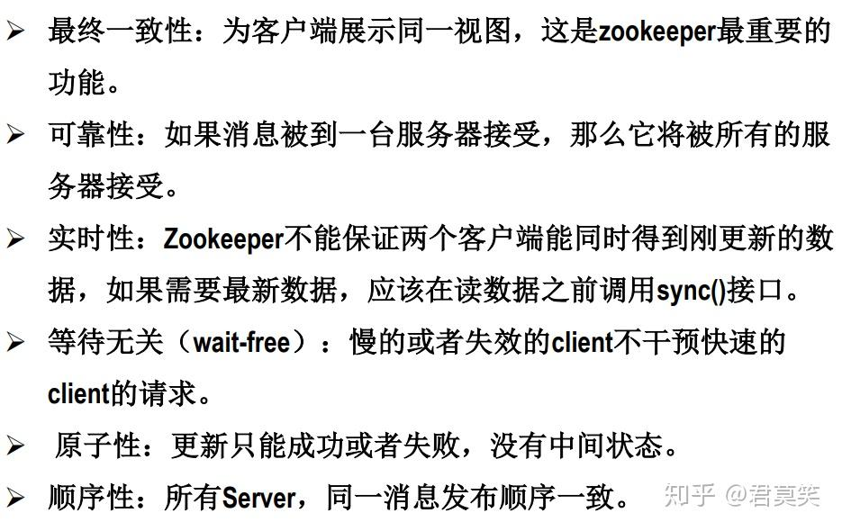

- `哪些系统用到了Zookeeper?`

​	HDFS,YARN,Storm,HBase,Flume,Dubbo（阿里巴巴）

### 2.2.2 架构

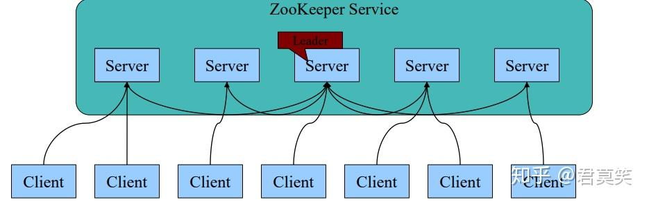


1. 一个领导者（`Leader`）和多个跟随者（Follower）组成的集群，在启动时根据[Paxos协议](https://zhida.zhihu.com/search?content_id=112300894&content_type=Article&match_order=1&q=Paxos协议&zhida_source=entity)选举一个Leader。
2. 集群中只要有半数以上的节点存活，Zookeeper集群就能正常服务。
3. 全局一致性：每个Server保存一份相同的数据副本，Client无论链接到哪个Server，数据都是一致的。
4. Leader根据[Zab协议](https://zhida.zhihu.com/search?content_id=112300894&content_type=Article&match_order=1&q=Zab协议&zhida_source=entity)负责处理数据的更新等操作。
5. 更新请求顺序进行，来自同一个Client的更新请求按其发送顺序依次执行。
6. 原子性：一次更新操作（可以是多个），当且仅当大多数Server在内存中成功修改数据，要么成功，要么失败。
7. 实时性：在一定时间范围内，Client能读到最新数据。

### 2.2.3 角色

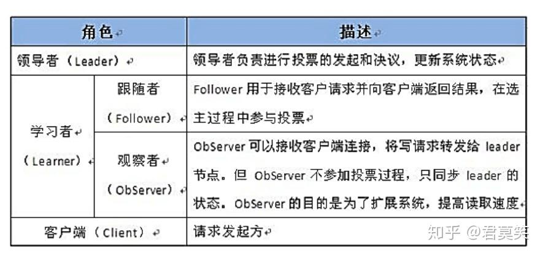

- Leader选举算法采用了Paxos协议;

- Paxos核心思想：当多数Server写成功，则任务数据写成功。

- - 如果有3个Server，则需要2个写成功即可。
  - 如果有5个Server，则需要3个写成功即可。

- Zookeeper Server数目一般为奇数

- - 如果有3个Server，则最多允许1个Server挂掉。
  - 如果有4个Server，则最多允许1个Server挂掉。
  - 所以3台和4台效果一样，那么为什么选4台呢。

### 2.2.4 数据结构

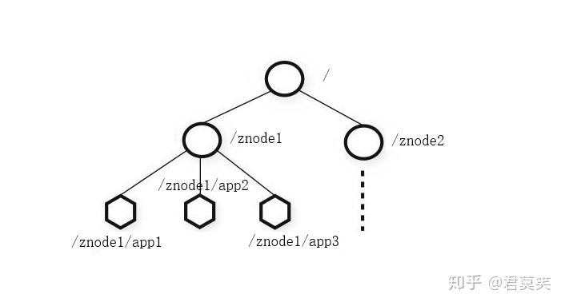

- Zookeeper数据模型结构与Unix文件系统很像，整体可以看做是树，每个节点为一个[Znode](https://zhida.zhihu.com/search?content_id=112300894&content_type=Article&match_order=1&q=Znode&zhida_source=entity)，每一个Znode默认能存储`1MB`数据，每个Znode都可以通过其路径唯一标识。
- 和Unix不同的是，`Znode`可以存数据，又可有子节点。（不同于文件和文件夹的概念）

### 2.2.5 数据写流程

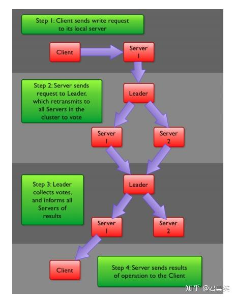

### 2.2.6 应用场景

> 统一命名服务

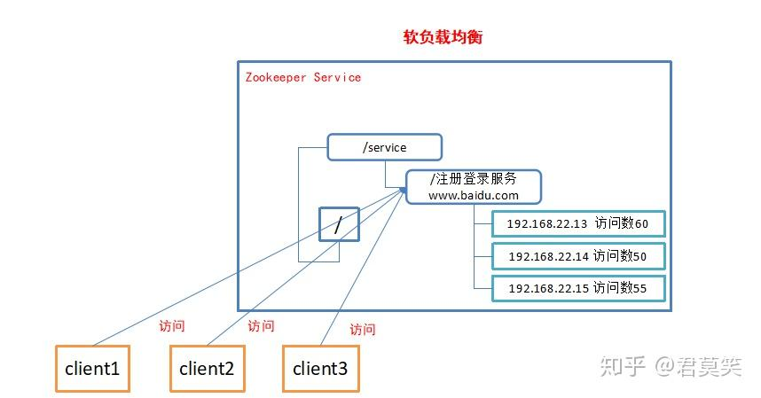

- 在分布式环境下，经常需要对应用/服务进行统一命名，便于识别。例如：IP不容易记住，而域名容易记住。

>配置管理

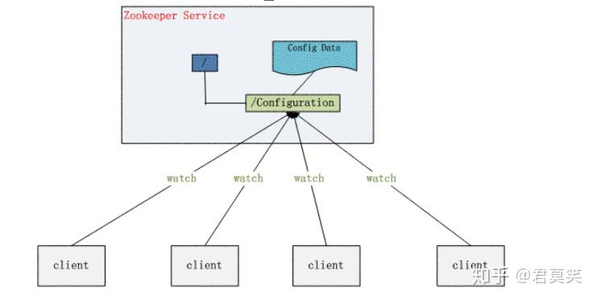

- 一个集群中，搜游节点的配置信息是一致的，对配置文件修改后，希望能够快速同步到各个节点上。例如Hadoop。

>集群管理

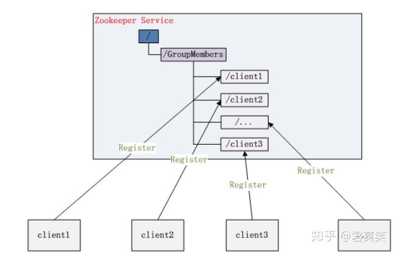

- 分布式环境中，实时掌握每个节点的状态是必要的。例如集群中的Master的监控和选举。

> 分布式通知/协调

分布式环境中，经常存在一个服务需要知道它所管理的子服务状态。例如NameNode需要知道DataNode状态。

>分布式锁

多个客户端同时在Zookeeper上创建相同的znode，只有一个创建成功。创建成功的客户端得到锁，其他客户端等待。

> 分布式队列

- 当一个列队的成员都聚齐时，这个列队才可用，否则一直等待所有成员到达，这种事同步列队。
- 列队按照FIFO方式进行入队和出队操作，例如实现生产者和消费者模型。
- 同步列队中一个Job由多个task组成，只有所有任务完成后，Job才运行完成。
- 如：可以为Job创建一个/job的节点，在其下每完成一个task创建一个临时的znode，一旦临时节点数达到task总数，则Job运行完成。

### 2.2.7 Window安装

- 下载地址：https://zookeeper.apache.org/releases.html

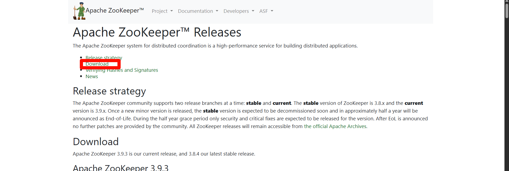


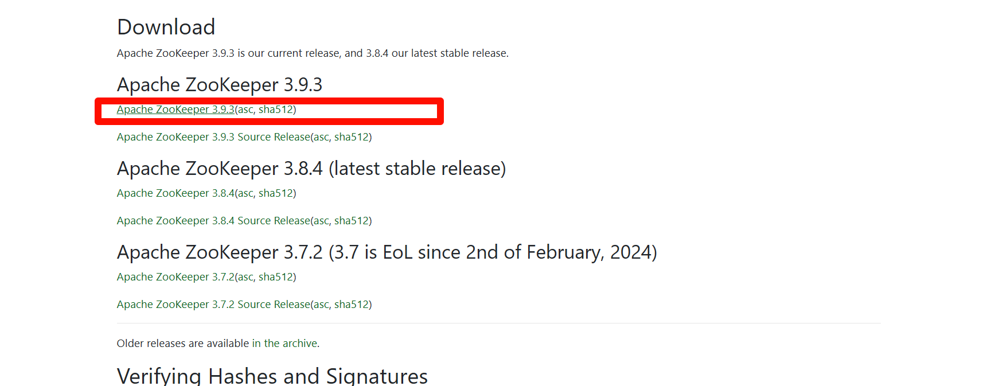

- 解压，放在自己的目录中

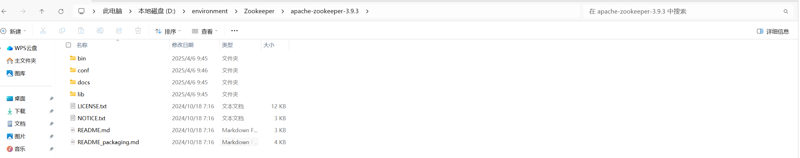

- 将conf目录下的zoo_sample.cfg文件，复制一份，重命名为zoo.cfg

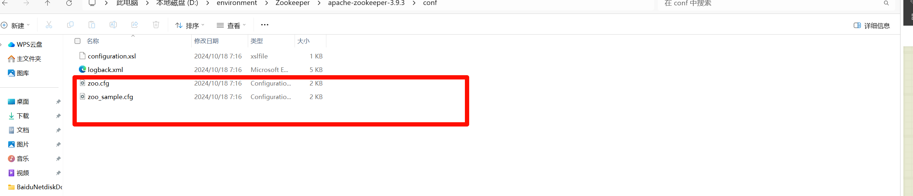

- 改`zoo.cfg`配置文件，将`dataDir=/tmp/zookeeper`修改成zookeeper安装目录所在的data文件夹（需要在安装目录下面新建一个空的data文件夹和log文件夹），再添加一条添加数据日志的配置

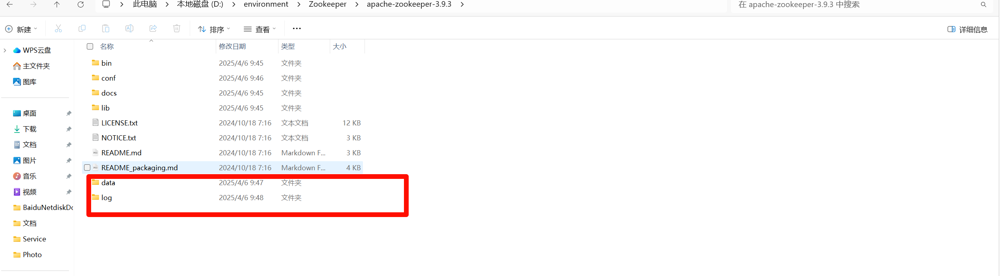

- 修改配置文件

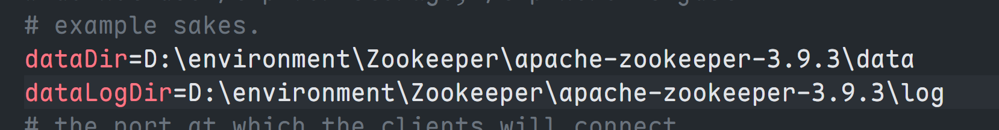

- 参数说明
  - tickTime：这个时间是作为 Zookeeper 服务器之间或客户端与服务器之间维持心跳的时间间隔，也就是每个 tickTime 时间就会发送一个心跳。
  - initLimit：这个配置项是用来配置 Zookeeper 接受客户端（这里所说的客户端不是用户连接 Zookeeper 服务器的客户端，而是 Zookeeper 服务器集群中连接到 Leader 的 Follower 服务器）初始化连接时最长能忍受多少个心跳时间间隔数。当已经超过 10 个心跳的时间（也就是 tickTime）长度后 Zookeeper 服务器还没有收到客户端的返回信息，那么表明这个客户端连接失败。总的时间长度就是 5*2000=10 秒*
  - syncLimit：这个配置项标识 Leader 与 Follower 之间发送消息，请求和应答时间长度，最长不能超过多少个 tickTime 的时间长度，总的时间长度就是 2*2000=4 秒
  - dataDir：顾名思义就是 Zookeeper 保存数据的目录，默认情况下，Zookeeper 将写数据的日志文件也保存在这个目录里。
  - clientPort：这个端口就是客户端连接 Zookeeper 服务器的端口，Zookeeper 会监听这个端口，接受客户端的访问请求。
- 启动程序：点击Bat程序

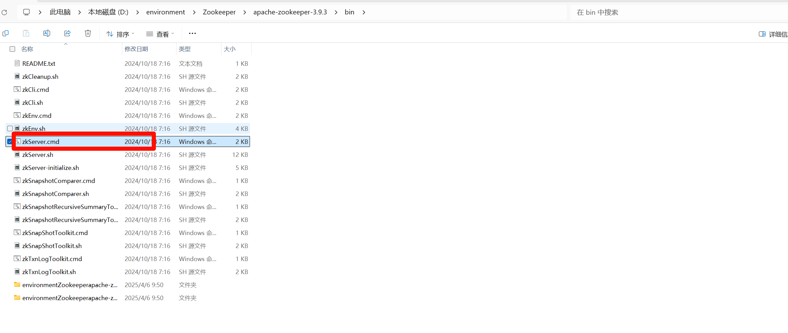

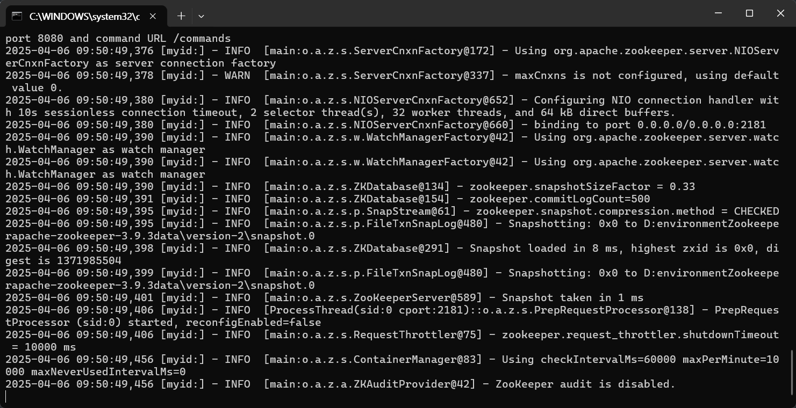

- 监控程序：https://link.zhihu.com/?target=https%3A//files.cnblogs.com/files/ttzzyy/ZooInspector.zip

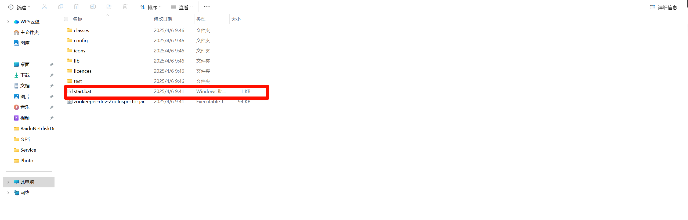

- 连接到监控页面，发现Node节点

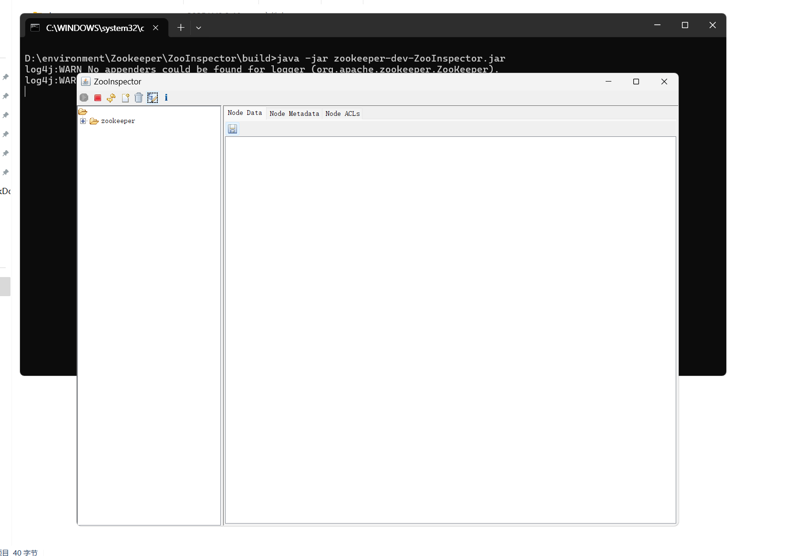

### 2.2.8 基础操作

- 运行客户端，进行cmd命令操作，后期我们通过程序控制，运行 zkCli.sh 脚本进入命令行工具

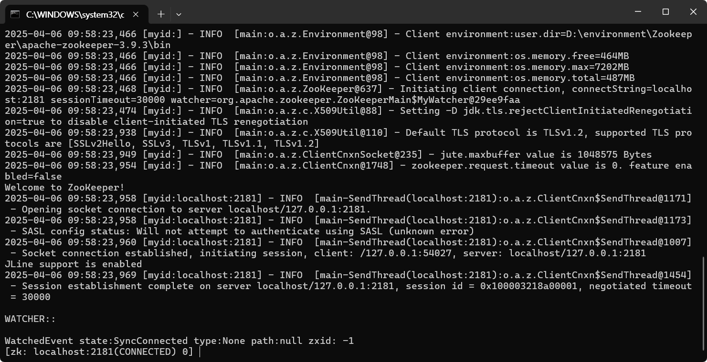

> hlep命令

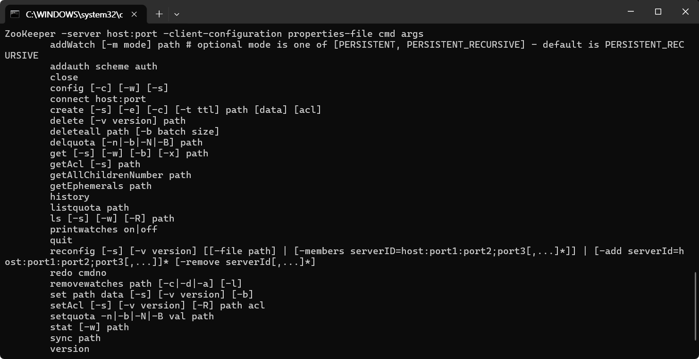

> 查询节点信息：ls /路径

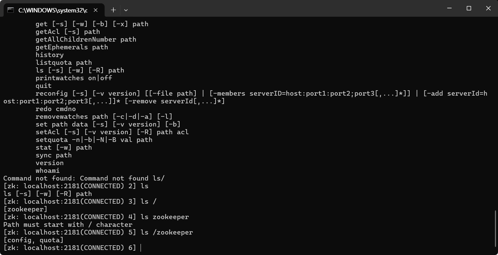

> 创建节点： create [-s] [-e] path data acl 创建命令
>
> - 创建命令
> - -s 带序号的节点，把原节点的名字加一个全局增加的序号拼接在一起。
> - -e 临时节点，未带此参数的节点全部为永久节点。
> - -s -e 同时带上，创建有序的临时节点。

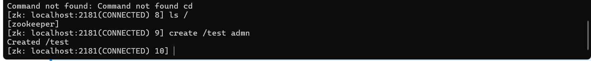

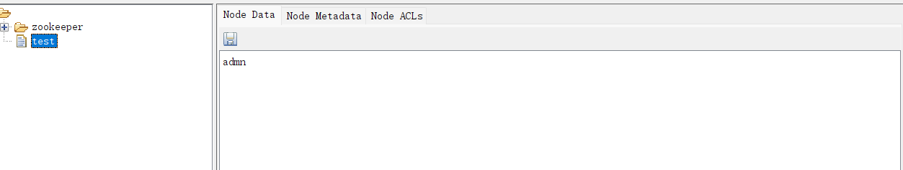

- 带序号创建 -s 

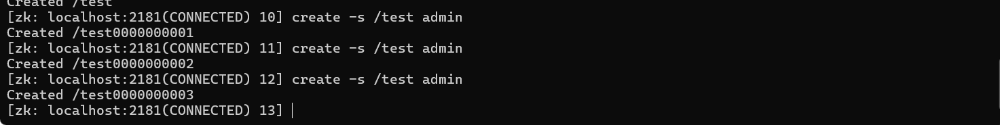

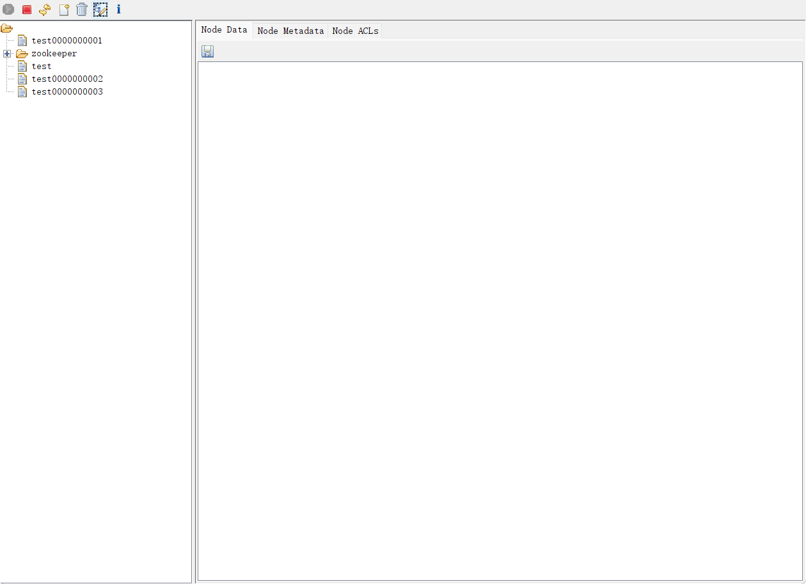

- 临时节点添加(当前会话退出就消失)

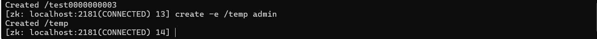

> - 总结，zk共有4种节点
>
> - - PERSISTENT 无序永久节点
>   - PERSISTENT_SEQUENTIAL 有序永久节点
>   - EPHEMERAL 无序临时节点
>   - EPHEMERAL_SEQUENTIAL 有序临时节点

> 获取路径： get path [watch] 获取命令

- 查看znode内容
- watch为观察的意思，观察此路径下的节点变化

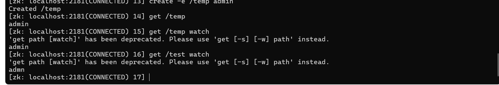

> stat path [watch] 查看节点状态

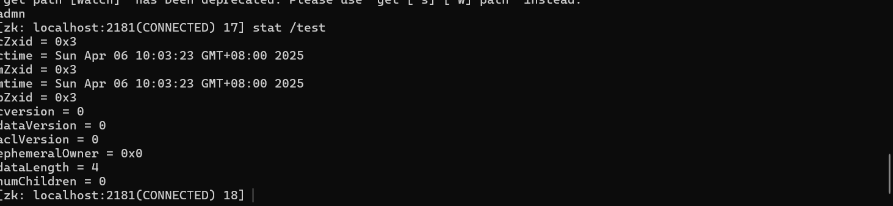

> 创建节点的事务zxid cZxid = 0xa00000117

- zk就是靠事务ID保证每批次操作的顺序执行。
- ZXID是一个64位的数字，低32代表一个单调递增的计数器，高32位代表Leader周期
- 高32位：a0000 ----Leader的周期编号+myid的组合
- 低32位：0117 ----事务的自增序列（单调递增的序列）只要客户端有请求，就+1
- 每次修改Zookeeper状态都会受到一个zxid形式的时间戳，也就是zk的事务ID，事务ID是zk中所有修改的总的次序。
- 每个修改都有唯一的zxid，如果zxid1小于zxid2，那么zxid1发生在zxid2之前。

> 删除命令

- delete path [version] 普通删除
- rmr path 递归删除


> 总结

|            **分类**            |             **命令**             |                           **说明**                           |
| :----------------------------: | :------------------------------: | :----------------------------------------------------------: |
|       **连接与基本操作**       | `zkCli.sh -server <host>:<port>` |                 连接到指定 ZooKeeper 服务器                  |
|     **节点（ZNode）操作**      |      `create /path "data"`       |                   创建持久节点（默认类型）                   |
|                                |     `create -e /temp "data"`     |               创建临时节点（会话结束自动删除）               |
|                                |     `create -s /seq "data"`      |                 创建顺序节点（自增唯一编号）                 |
|                                |           `get /path`            |            获取节点数据和元信息（版本、时间戳等）            |
|                                |          `get -w /path`          |              监听节点数据变化（需处理事件回调）              |
|                                |      `set /path "new_data"`      |                         更新节点数据                         |
|                                | `set -v <version> /path "data"`  |                  指定版本更新（乐观锁机制）                  |
|                                |          `delete /path`          |                    删除节点（需无子节点）                    |
|                                |        `deleteall /path`         |                    递归删除节点及其子节点                    |
|                                |            `ls /path`            |                     列出节点的直接子节点                     |
|                                |          `ls -R /path`           |                  递归列出节点的所有后代节点                  |
|       **节点属性与状态**       |           `stat /path`           |           查看节点详细信息（版本、ACL、时间戳等）            |
|                                |          `getAcl /path`          |                获取节点的访问控制列表（ACL）                 |
|                                |  `setAcl /path scheme:id:perm`   |           设置节点 ACL（如 `world:anyone:cdrwa`）            |
|          **高级操作**          |           `sync /path`           |                 同步节点数据到集群其他服务器                 |
|                                |            `history`             |                    查看当前会话的历史命令                    |
| **四字命令（通过 nc/telnet）** |            `echo stat            |                      nc localhost 2181`                      |
|                                |            `echo ruok            |                      nc localhost 2181`                      |
|                                |            `echo conf            |                      nc localhost 2181`                      |
|                                |            `echo mntr            |                      nc localhost 2181`                      |
|          **注意事项**          |                -                 | 1. 临时节点不能有子节点 2. `set` 需匹配版本避免冲突 3. ACL 权限需继承 |

### 2.2.9 Java客户端操作

- 依赖

```xml
 <dependency>
            <groupId>org.apache.zookeeper</groupId>
            <artifactId>zookeeper</artifactId>
            <version>3.7.0</version>
        </dependency>
```

- 测试类

```java
package com.shu;

import org.apache.zookeeper.*;
import org.apache.zookeeper.data.Stat;

import java.util.ArrayList;
import java.util.List;

public class ZKClient {
    private static final String CONNECT_STRING = "127.0.0.1:2181";
    private static final int SESSION_TIMEOUT = 3000; // 3秒
    private ZooKeeper zooKeeper;

    // 连接 ZooKeeper 服务器
    public void connect() throws Exception {
        zooKeeper = new ZooKeeper(CONNECT_STRING, SESSION_TIMEOUT, event -> {
            // 监听会话事件（连接成功、断开、重连等）
            System.out.println("Event: " + event.getType());
        });
        // 等待连接建立（同步阻塞）
        while (zooKeeper.getState() != ZooKeeper.States.CONNECTED) {
            Thread.sleep(100);
        }
    }

    // 关闭连接
    public void close() throws InterruptedException {
        zooKeeper.close();
    }

    // 创建持久节点
    public void createNode() throws Exception {
        String path = zooKeeper.create("/shu", "Hello ZooKeeper".getBytes(),
                ZooDefs.Ids.OPEN_ACL_UNSAFE, CreateMode.PERSISTENT);
        System.out.println("Created node: " + path);
    }

    // 读取节点数据（带监听）
    public void readNodeWithWatcher(String path) throws Exception {
        Stat stat = new Stat();
        byte[] data = zooKeeper.getData(path, true, stat); // 注册监听
        System.out.println("Node data: " + new String(data));
        System.out.println("Version: " + stat.getVersion());
    }

    // 更新节点数据（需指定版本号）
    public void updateNode(String path, String newData) throws Exception {
        Stat stat = new Stat();
        byte[] oldData = zooKeeper.getData(path, false, stat);
        zooKeeper.setData(path, newData.getBytes(), stat.getVersion());
        System.out.println("Updated node data. New version: " + stat.getVersion());
    }

    // 删除节点（需无子节点）
    public void deleteNode(String path) throws Exception {
        Stat stat = new Stat();
        zooKeeper.exists(path, false);
        if (stat.getNumChildren() == 0) {
            zooKeeper.delete(path, stat.getVersion());
            System.out.println("Deleted node: " + path);
        } else {
            System.out.println("Cannot delete non-empty node: " + path);
        }
    }

    // 递归删除节点及其子节点
    public void deleteAllNodes(String path) throws Exception {
        Stat stat = new Stat();
        zooKeeper.exists(path, false);
        if (stat.getNumChildren() > 0) {
            // 递归删除子节点
            for (String child : zooKeeper.getChildren(path, false)) {
                deleteAllNodes(path + "/" + child);
            }
        }
        zooKeeper.delete(path, stat.getVersion());
        System.out.println("Deleted all nodes under: " + path);
    }

    // 异步创建节点（回调处理结果）
    public void asyncCreateNode(String path, String data) throws Exception {
        zooKeeper.create(path, data.getBytes(), ZooDefs.Ids.OPEN_ACL_UNSAFE,
                CreateMode.PERSISTENT,
                new AsyncCallback.StringCallback() {
                    @Override
                    public void processResult(int rc, String path, Object ctx, String name) {
                        System.out.println("Async create result: ");
                        System.out.println("rc: " + rc + ", path: " + path + ", name: " + name);
                    }
                },
                "context-data"); // 自定义上下文对象
    }

    // 事务操作（原子性多步操作）
    public void transactionOperation() throws Exception {
        List<Op> ops = new ArrayList<>();
        ops.add(Op.create("/tx_node1", "tx_data1".getBytes(),
                ZooDefs.Ids.OPEN_ACL_UNSAFE, CreateMode.PERSISTENT));
        ops.add(Op.create("/tx_node2", "tx_data2".getBytes(),
                ZooDefs.Ids.OPEN_ACL_UNSAFE, CreateMode.PERSISTENT));

        zooKeeper.multi(ops, new AsyncCallback.MultiCallback() {
            @Override
            public void processResult(int rc, String path, Object ctx, List<OpResult> opResults) {
                System.out.println("Transaction completed with rc: " + rc);
                for (OpResult result : opResults) {
                    System.out.println(result.toString());
                }
            }
        }, null);
    }

    public static void main(String[] args) throws Exception {
        ZKClient client = new ZKClient();
        try {
            client.connect();

            // 创建节点
            client.createNode();

            // 读取节点数据（带监听）
            client.readNodeWithWatcher("/shu");

//            // 更新节点数据
//            client.updateNode("/shu", "Updated Data");
//
//            // 删除节点（需确保节点为空）
//            // client.deleteNode("/shu");
//
//            // 递归删除节点
//            // client.deleteAllNodes("/parent_path");
//
//            // 异步创建节点
//            client.asyncCreateNode("/async_node", "Async Data");
//
//            // 事务操作（示例）
//            // client.transactionOperation();
//
//            Thread.sleep(5000); // 等待异步操作完成
        } finally {
            client.close();
        }
    }
}
```

**一、连接管理**

|  **方法**   |       **功能**        |           **关键参数/说明**            |     **注意事项**     |
| :---------: | :-------------------: | :------------------------------------: | :------------------: |
| `connect()` | 连接 ZooKeeper 服务器 | `CONNECT_STRING`（地址端口）、超时时间 |   阻塞等待连接成功   |
|  `close()`  |       关闭连接        |                   无                   | 需显式调用，释放资源 |

**二、节点操作**

|      **方法**       |          **功能**          |               **参数说明**                |      **注意事项**      |
| :-----------------: | :------------------------: | :---------------------------------------: | :--------------------: |
|   `createNode()`    |        创建持久节点        | `path`（路径）、`data`（数据）、ACL、模式 |     节点路径需唯一     |
|   `deleteNode()`    |   删除节点（需无子节点）   |    `path`（路径）、`version`（版本号）    |  非空节点需先递归删除  |
| `deleteAllNodes()`  | 递归删除节点及其所有子节点 |             `path`（根路径）              | 慎用，可能导致数据丢失 |
| `asyncCreateNode()` |        异步创建节点        |   `path`、`data`、回调函数、上下文对象    |    通过回调处理结果    |

**三、数据操作**

|        **方法**         |         **功能**         |              **参数说明**              |              **注意事项**              |
| :---------------------: | :----------------------: | :------------------------------------: | :------------------------------------: |
| `readNodeWithWatcher()` |   读取数据并注册监听器   |             `path`（路径）             |      监听器一次性触发，需重复注册      |
|     `updateNode()`      | 更新节点数据（版本控制） | `path`、`newData`、`version`（版本号） | 版本不匹配时抛出 `BadVersionException` |

**四、高级操作**

|         **方法**         |           **功能**           |        **参数说明**         |          **注意事项**          |
| :----------------------: | :--------------------------: | :-------------------------: | :----------------------------: |
| `transactionOperation()` |  原子性事务操作（多步执行）  | `ops`（操作列表）、回调函数 | 所有操作要么全成功，要么全失败 |
|         `sync()`         | 同步节点数据到集群其他服务器 |       `path`（路径）        |    确保集群环境下数据一致性    |

**五、关键参数说明**

1. **ACL（访问控制列表）**
   - 示例：`ZooDefs.Ids.OPEN_ACL_UNSAFE`（允许所有客户端读写）
   - 支持方案：`world`（IP）、`auth`（认证用户）、`digest`（用户名密码加密）。
2. **CreateMode（节点类型）**
   - `PERSISTENT`：持久节点（默认）。
   - `EPHEMERAL`：临时节点（会话结束自动删除）。
   - `SEQUENCE`：顺序节点（名称自增编号）。
3. **Watcher 监听机制**
   - 监听节点数据变化或子节点变更。
   - 需在 `getData()` 或 `exists()` 中启用（第二个参数设为 `true`）。
   - **一次性触发**：事件发生后需重新注册监听。


### 2.2.10 注册中心

- **服务注册**：将该服务实例的元数据（如IP地址、端口号、健康状态等）注册到注册中心，这样其他服务或客户端可以发现和使用该服务。
- **服务发现**：当一个服务需要调用别的服务时，使用静态配置是不可行的，这个时候可以去注册中心获取可用的服务实例并调用。

> 模拟服务端

```java
package com.shu;

import org.apache.zookeeper.*;

import java.util.concurrent.CountDownLatch;

public class ServiceProvider {
    private ZooKeeper zk;
    private static final String CONNECT_STRING = "127.0.0.1:2181";
    private static final int SESSION_TIMEOUT = 3000;

    public void start() {
        try {
            connectToZooKeeper();
            registerService("order-service", "192.168.1.100:8080");
            registerService("payment-service", "192.168.1.101:8081");
            registerService("inventory-service", "192.168.1.102:8082");
            registerService("shipping-service", "192.168.1.103:8083");
        } catch (Exception e) {
            System.err.println("Service provider failed: " + e.getMessage());
            e.printStackTrace();
        }
    }

    private void connectToZooKeeper() throws Exception {
        final CountDownLatch connectedSignal = new CountDownLatch(1);
        zk = new ZooKeeper(CONNECT_STRING, SESSION_TIMEOUT, event -> {
            if (event.getState() == Watcher.Event.KeeperState.SyncConnected) {
                connectedSignal.countDown();
                System.out.println("Connected to ZooKeeper successfully!");
            } else {
                System.out.println("Event: " + event.getType());
            }
        });

        // 等待连接成功
        connectedSignal.await();
    }

    private void registerService(String serviceName, String address) {
        try {
            // 构造服务路径
            String servicePath = "/services/" + serviceName;
            String instancePath = servicePath + "/instance";
            // 检查并创建父节点（如果不存在）
            createParentNodes(servicePath);
            // 检查并创建服务节点（如果不存在）
            if (zk.exists(instancePath, false) == null) {
                // 创建服务节点
                String createdPath = zk.create(instancePath, address.getBytes(), ZooDefs.Ids.OPEN_ACL_UNSAFE, CreateMode.PERSISTENT);
                System.out.println("Service registered successfully at: " + createdPath);
            } else {
                System.out.println("Service already registered at: " + instancePath);
            }
        } catch (KeeperException | InterruptedException e) {
            System.err.println("Failed to register service: " + e.getMessage());
            e.printStackTrace();
        }
    }

    private void createParentNodes(String path) throws KeeperException, InterruptedException {
        // 分割路径为层级
        String[] parts = path.split("/");
        StringBuilder currentPath = new StringBuilder("/");

        for (String part : parts) {
            if (part.isEmpty()) continue; // 跳过空字符串（如开头的 "/"）

            currentPath.append(part);
            if (zk.exists(currentPath.toString(), false) == null) {
                // 创建当前层级的持久节点
                zk.create(currentPath.toString(), new byte[0],
                        ZooDefs.Ids.OPEN_ACL_UNSAFE, CreateMode.PERSISTENT);
                System.out.println("Created parent node: " + currentPath);
            }
            currentPath.append("/");
        }
    }

    public static void main(String[] args) {
        ServiceProvider provider = new ServiceProvider();
        provider.start();
    }
}
```

> 模拟消费端

```java
package com.shu;

import org.apache.zookeeper.Watcher;
import org.apache.zookeeper.ZooKeeper;
import org.apache.zookeeper.KeeperException;

import java.util.List;
import java.util.concurrent.CountDownLatch;
import java.util.stream.Collectors;

/**
 * @author : 瀚海
 * @date : 2025/4/6 12:42
 * @Desc : 服务消费者
 */
public class ServiceConsumer {
    private ZooKeeper zk;
    private static final String CONNECT_STRING = "127.0.0.1:2181";
    private static final int SESSION_TIMEOUT = 3000;

    public void start() throws Exception {
        connectToZooKeeper();
        List<String> addresses = discoverServices("order-service");
        // 使用地址列表调用服务
        for (String address : addresses) {
            System.out.println("Using service at: " + address);
        }
    }

    private void connectToZooKeeper() throws Exception {
        final CountDownLatch connectedSignal = new CountDownLatch(1);
        zk = new ZooKeeper(CONNECT_STRING, SESSION_TIMEOUT, event -> {
            if (event.getState() == Watcher.Event.KeeperState.SyncConnected) {
                connectedSignal.countDown();
                System.out.println("Connected to ZooKeeper successfully!");
            } else {
                System.out.println("Event: " + event.getType());
            }
        });

        // 等待连接成功
        connectedSignal.await();
    }

    private List<String> discoverServices(String serviceName) throws Exception {
        String path = "/services/" + serviceName;
        // 检查父节点是否存在
        if (zk.exists(path, false) == null) {
            throw new RuntimeException("Service path not found: " + path);
        }

        // 获取子节点并注册监听器
        return getChildrenWithWatcher(path);
    }

    private List<String> getChildrenWithWatcher(String path) throws Exception {
        final List<String>[] children = new List[1]; // 用于闭包捕获
        final Watcher[] watcher = new Watcher[1]; // 用于闭包捕获

        // 初始化 Watcher
        watcher[0] = event -> {
            if (event.getType() == Watcher.Event.EventType.NodeChildrenChanged) {
                System.out.println("Service list changed, re-fetching...");
                try {
                    children[0] = getChildrenWithWatcher(path); // 重新获取子节点
                } catch (Exception e) {
                    System.err.println("Failed to re-fetch service list: " + e.getMessage());
                }
            }
        };

        // 获取子节点
        children[0] = zk.getChildren(path, watcher[0]);

        // 获取每个子节点的数据
        return children[0].stream()
                .map(child -> {
                    String childPath = path + "/" + child;
                    try {
                        byte[] data = zk.getData(childPath, false, null);
                        return new String(data);
                    } catch (KeeperException.NoNodeException e) {
                        System.err.println("Node not found: " + childPath);
                        return null; // 忽略不存在的节点
                    } catch (Exception e) {
                        System.err.println("Failed to get data for node: " + childPath);
                        e.printStackTrace();
                        return null; // 忽略异常节点
                    }
                })
                .filter(data -> data != null) // 过滤掉无效数据
                .collect(Collectors.toList());
    }

    public static void main(String[] args) {
        try {
            ServiceConsumer consumer = new ServiceConsumer();
            consumer.start();
        } catch (Exception e) {
            e.printStackTrace();
        }
    }
}
```

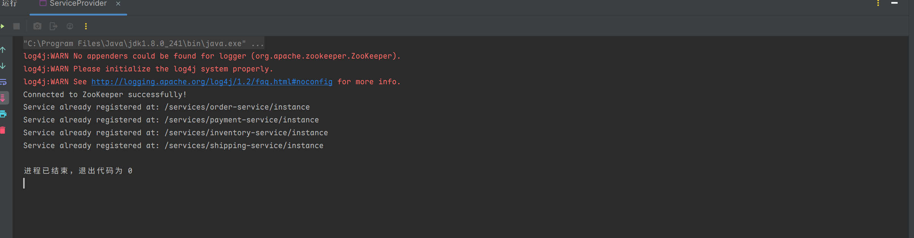

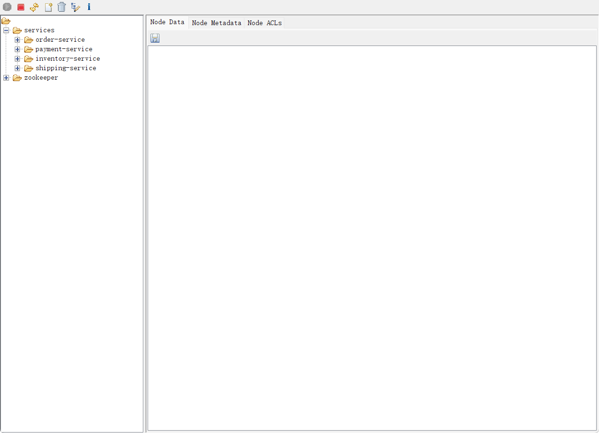

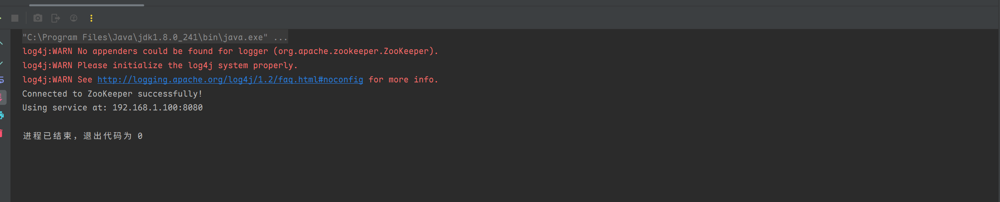

### 2.2.11 发布与订阅

- 数据发布/订阅的一个常见的场景是配置中心，发布者把数据发布到 ZooKeeper 的一个或一系列的节点上，供订阅者进行数据订阅，达到**动态获取数据**的目的。

ZooKeeper 采用的是**推拉结合**的方式。

1. 推: 服务端会推给注册了监控节点的客户端 Wathcer 事件通知
2. 拉: 客户端获得通知后，然后主动到服务端拉取最新的数据

> 发布者

```java
package com.shu;


import org.apache.zookeeper.*;

import java.util.concurrent.CountDownLatch;

/**
 * @author : 瀚海
 * @date : 2025/4/6 13:28
 * @Desc :
 */


public class Publisher {
    private ZooKeeper zk;
    private static final String CONNECT_STRING = "127.0.0.1:2181";
    private static final int SESSION_TIMEOUT = 3000;
    private static final String TOPIC_PATH = "/pubsub/topic1";

    public void start() {
        try {
            connectToZooKeeper();
            publishMessage("Hello Pub/Sub!11");
            publishMessage("Second message232");
            Thread.sleep(10000); // 等待消息被消费
            close();
        } catch (Exception e) {
            e.printStackTrace();
        }
    }

    private void connectToZooKeeper() throws Exception {
        final CountDownLatch connectedSignal = new CountDownLatch(1);
        zk = new ZooKeeper(CONNECT_STRING, SESSION_TIMEOUT, event -> {
            if (event.getState() == Watcher.Event.KeeperState.SyncConnected) {
                connectedSignal.countDown();
            }
        });
        connectedSignal.await();
    }

    private void publishMessage(String message) throws Exception {
        // 检查父节点是否存在
        if (zk.exists(TOPIC_PATH, false) == null) {
            createParentNodes(TOPIC_PATH);
        }
        // 创建临时顺序节点存储消息
        String messagePath = zk.create(
                TOPIC_PATH + "/msg-",
                message.getBytes(),
                ZooDefs.Ids.OPEN_ACL_UNSAFE,
                CreateMode.EPHEMERAL_SEQUENTIAL
        );
        System.out.println("Published message: " + message + " at " + messagePath);
    }


    private void createParentNodes(String path) throws KeeperException, InterruptedException {
        // 分割路径为层级
        String[] parts = path.split("/");
        StringBuilder currentPath = new StringBuilder("/");
        for (String part : parts) {
            if (part.isEmpty()) continue; // 跳过空字符串（如开头的 "/"）
            currentPath.append(part);
            if (zk.exists(currentPath.toString(), false) == null) {
                // 创建当前层级的持久节点
                zk.create(currentPath.toString(), new byte[0],
                        ZooDefs.Ids.OPEN_ACL_UNSAFE, CreateMode.PERSISTENT);
                System.out.println("Created parent node: " + currentPath);
            }
            currentPath.append("/");
        }
    }

    private void close() throws InterruptedException {
        zk.close();
    }

    public static void main(String[] args) {
        new Publisher().start();
    }
}
```

> 订阅者

```java
package com.shu;

import org.apache.zookeeper.*;
import org.apache.zookeeper.Watcher.Event.EventType;
import org.apache.zookeeper.data.Stat;

import java.util.List;
import java.util.concurrent.CountDownLatch;

public class Subscriber {
    private ZooKeeper zk;
    private static final String CONNECT_STRING = "127.0.0.1:2181";
    private static final int SESSION_TIMEOUT = 3000;
    private static final String TOPIC_PATH = "/pubsub/topic1";

    public void start() {
        try {
            connectToZooKeeper();
            subscribe();
            Thread.sleep(Long.MAX_VALUE); // 持续监听
        } catch (Exception e) {
            System.err.println("Subscriber failed: " + e.getMessage());
            e.printStackTrace();
        }
    }

    private void connectToZooKeeper() throws Exception {
        final CountDownLatch connectedSignal = new CountDownLatch(1);
        zk = new ZooKeeper(CONNECT_STRING, SESSION_TIMEOUT, event -> {
            if (event.getState() == Watcher.Event.KeeperState.SyncConnected) {
                connectedSignal.countDown();
            }
        });
        connectedSignal.await();
    }

    private void subscribe() throws Exception {
        // 确保 Topic 路径存在
        Stat stat = zk.exists(TOPIC_PATH, false);
        if (stat == null) {
            createParentNodes(TOPIC_PATH);
        }

        // 监听子节点变化
        zk.getChildren(TOPIC_PATH, event -> {
            if (event.getType() == EventType.NodeChildrenChanged) {
                try {
                    readMessages();
                } catch (Exception e) {
                    System.err.println("Failed to read messages: " + e.getMessage());
                    e.printStackTrace();
                }
            }
        });

        // 初始读取已有消息
        readMessages();
    }

    private void readMessages() throws Exception {
        List<String> messages = zk.getChildren(TOPIC_PATH, false);
        System.out.println("Reading messages...");
        for (String messageNode : messages) {
            String fullPath = TOPIC_PATH + "/" + messageNode;
            byte[] data = zk.getData(fullPath, false, null);
            System.out.println("Received message: " + new String(data));
        }
    }

    private void createParentNodes(String path) throws KeeperException, InterruptedException {
        // 分割路径为层级
        String[] parts = path.split("/");
        StringBuilder currentPath = new StringBuilder("/");
        for (String part : parts) {
            if (part.isEmpty()) continue; // 跳过空字符串（如开头的 "/"）
            currentPath.append(part);
            if (zk.exists(currentPath.toString(), false) == null) {
                // 创建当前层级的持久节点
                zk.create(currentPath.toString(), new byte[0],
                        ZooDefs.Ids.OPEN_ACL_UNSAFE, CreateMode.PERSISTENT);
                System.out.println("Created parent node: " + currentPath);
            }
            currentPath.append("/");
        }
    }

    public static void main(String[] args) {
        new Subscriber().start();
    }
}
```

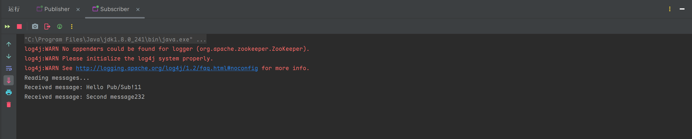

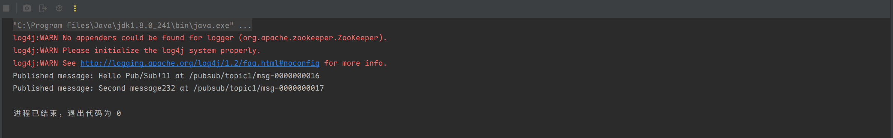

- 更多内容参考：https://www.cnblogs.com/ibigboy/p/15877781.html

## 2.3 Nacos

## 2.4 Eureka

## 2.5 Etcd 

