# 微服务注册中心
# 一 基础知识
## 1.1 概念
注册中心主要有三种角色：
- **服务提供者（RPC Server）**：在启动时，向 Registry 注册自身服务，并向 Registry 定期发送心跳汇报存活状态。
- **服务消费者（RPC Client）**：在启动时，向 Registry 订阅服务，把 Registry 返回的服务节点列表缓存在本地内存中，并与 RPC Sever 建立连接。
- [**服务注册中心**](https://cloud.tencent.com/product/rcc?from_column=20065&from=20065)**（Registry）**：用于保存 RPC Server 的注册信息，当 RPC Server 节点发生变更时，Registry 会同步变更，RPC Client 感知后会刷新本地 内存中缓存的服务节点列表。

最后，RPC Client 从本地缓存的服务节点列表中，基于负载均衡算法选择一台 RPC Sever 发起调用。

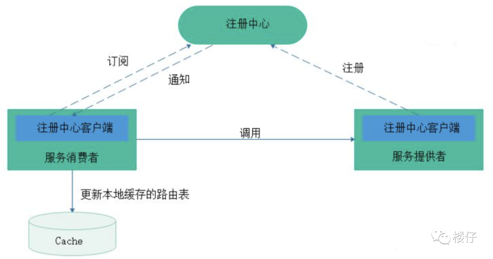

## 1.2 CAP理论

CAP定理是分布式系统设计中的核心理论，它指出在分布式系统中，一致性（Consistency）、可用性（Availability）和分区容忍性（Partition Tolerance）三个特性不可兼得，最多只能满足其中两项。

> CAP三要素详解

1. **一致性（Consistency）**
   - 所有节点在同一时间访问的数据完全一致。
   - 写操作后，任何后续读操作必须返回最新写入的值。
   - 实现方式：强一致性协议（如两阶段提交、Paxos/Raft），但可能牺牲性能和可用性。
2. **可用性（Availability）**
   - 每个请求都能得到响应（成功或失败），但不保证数据是最新的。
   - 系统始终可读写，即使部分节点故障。
   - 实现方式：异步复制、去中心化架构，但可能导致数据不一致。
3. **分区容忍性（Partition Tolerance）**
   - 系统在网络分区（节点间通信中断）时仍能继续运行。
   - 现实中网络分区难以避免，因此大多数系统必须选择支持分区容忍性。

> CAP的权衡选择

由于网络分区难以避免，实际系统通常在 **CP（一致且分区容忍）** 或 **AP（可用且分区容忍）** 之间选择：

- **CP系统（一致性优先）**
  - 分区发生时，牺牲可用性以保证数据一致。
  - 示例：ZooKeeper、Redis（集群模式）、关系型数据库（如PostgreSQL）。
  - 适用场景：金融交易、支付系统等强一致性要求的场景。
- **AP系统（可用性优先）**
  - 分区发生时，允许暂时不一致，但保证系统可用。
  - 示例：Cassandra、DynamoDB、MongoDB（最终一致性）。
  - 适用场景：社交媒体、电商购物车等对实时性要求高但可容忍短暂不一致的场景。
- **CA系统（一致且可用）**
  - 仅在不发生分区时成立，实际系统中几乎不可行，因此极少选择。

> CAP的误解与澄清

1. **CAP并非非黑即白**
   - 多数系统在分区恢复后通过异步复制实现最终一致性（如AP系统），或在特定场景下部分满足一致性（如“最终一致性”）。
2. **BASE理论补充**
   - BASE（Basically Available, Soft state, Eventually consistent）是AP的扩展，强调基本可用、软状态和最终一致性，适用于大规模分布式系统。
3. **现代系统的灵活设计**
   - 许多系统（如NewSQL、NewSQL数据库）通过多区域复制、CRDTs（冲突解决数据类型）等机制，在CAP三者间动态平衡，而非固定选择两项。

------

## 1.3 一致性算法

### Paxos 协议

#### **核心思想**

- 解决分布式系统中的**共识问题**，即在网络分区、节点故障等异常情况下，如何保证多个节点对某一值达成一致。
- 基于**两阶段提交（Prepare-Promise 和 Accept-Accepted）**，通过多轮投票确保多数派（Majority）同意。

#### **关键特性**

- **容错性**：容忍少数节点故障（只要多数节点存活即可达成共识）。
- **正确性**：数学上严格证明其安全性（唯一确定的共识值）。
- **复杂性**：协议流程复杂，实现难度高，调试困难。

#### **流程简图**

```markdown
提议者 (Proposer)  
  → 发送 Prepare 请求 → 接受者 (Acceptor)  
  → 返回 Promise（承诺不再接受更小编号的提议）  
  → 提议者收到多数 Promise → 发送 Accept 请求  
  → 接受者根据规则接受或拒绝 → 达成共识
```

#### **应用场景**

- **Google Chubby 锁服务**：用于分布式锁和元数据管理。
- **Apache ZooKeeper（早期版本）**：ZAB 协议灵感来源于 Paxos。
- **金融交易系统**：对强一致性要求极高的场景。

------

### Raft 协议

#### **核心思想**

- 为解决 Paxos 的**复杂性问题**而设计，强调**可理解性**和**易实现性**。
- 将共识过程分为**领导选举（Leader Election）**和**日志复制（Log Replication）**两个阶段，逻辑更清晰。

#### **关键特性**

- **强领导模式**：通过选举一个 Leader 节点处理所有客户端请求，简化日志同步。
- **线性化读写**：Leader 直接处理读写，避免多节点并发冲突。
- **故障恢复**：Leader 失效时触发新一轮选举，容忍脑裂问题。

#### **流程简图**

```markdown
1. 选举阶段  
   - 节点发起投票，得票过半的节点成为 Leader。  
2. 日志复制阶段  
   - Client 请求发送给 Leader → Leader 写入本地日志 → 同步到 Follower → 多数确认后提交。
```

#### **应用场景**

- **分布式存储系统**：如 etcd、Consul、TiKV。
- **云原生领域**：Kubernetes 的 etcd 使用 Raft。
- **需要高可维护性的系统**：开发与运维成本较低。

------

###  ZAB 协议

#### **核心思想**

- 专为 **ZooKeeper** 设计的一致性协议，结合了 Paxos 和原子广播（Atomic Broadcast）思想。
- 强调**全局顺序一致性**，所有事务按全局顺序执行。

#### **关键特性**

- **崩溃恢复模式**：分为恢复阶段（选主）和广播阶段（同步数据）。
- **顺序一致性**：所有写入操作按全局顺序广播到所有节点。
- **高效同步**：利用 FIFO 队列优化 Follower 的数据同步。

#### **流程简图**

```markdown
1. 恢复阶段  
   - 选举 Leader，同步最新事务 ID。  
2. 广播阶段  
   - Leader 接收事务请求 → 分配全局事务 ID → 广播到 Follower → 多数确认后提交。
```

#### **应用场景**

- **ZooKeeper 自身**：用于分布式协调（如配置管理、服务发现）。
- **分布式锁与选主**：依赖强一致性的协调任务。

------

### 对比总结

| 特性           | Paxos                  | Raft                     | ZAB                              |
| -------------- | ---------------------- | ------------------------ | -------------------------------- |
| **目标**       | 解决通用共识问题       | 简化 Paxos，易实现       | 支持 ZooKeeper 的原子广播        |
| **领导者角色** | 无明确 Leader          | 强 Leader，简化日志复制  | 强 Leader，全局顺序广播          |
| **复杂度**     | 高（需处理多轮交互）   | 中（逻辑清晰，易于实现） | 中（针对 ZooKeeper 优化）        |
| **容错性**     | 容忍少数节点故障       | 容忍少数节点故障         | 容忍少数节点故障                 |
| **典型应用**   | Chubby、金融系统       | etcd、Kubernetes、TiKV   | ZooKeeper                        |
| **优势**       | 理论严谨，适用广泛场景 | 开发维护成本低           | 高效顺序广播，适合协调服务       |
| **劣势**       | 实现复杂，调试困难     | 性能略低于 Paxos         | 仅适用于特定场景（如 ZooKeeper） |

# 二 注册中心

这里主要介绍5种常用的注册中心，分别为**Zookeeper、Eureka、Nacos、Consul和ETCD**

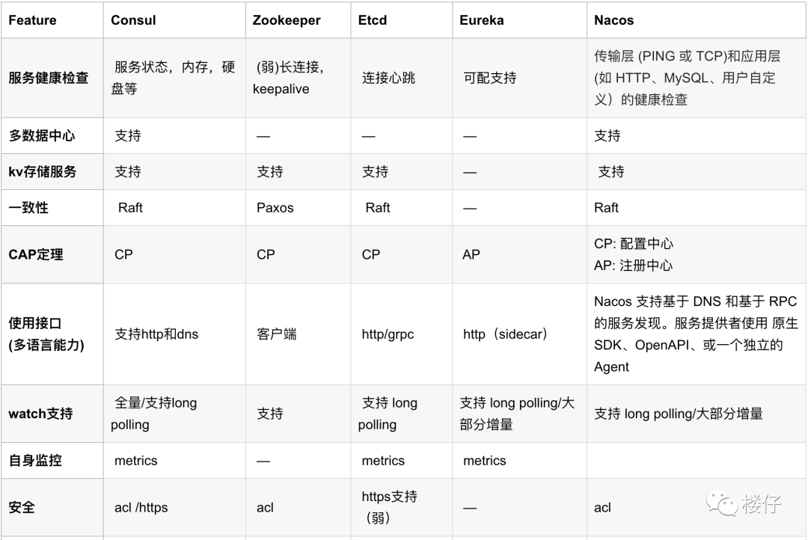

## 2.1 Consul

- 官网：https://developer.hashicorp.com/consul


### 2.1.1 Window环境搭建

- 下载地址：https://developer.hashicorp.com/consul/install#windows
- 历史版本：https://releases.hashicorp.com/consul/1.16.1/

> 安装

下载完成后解压，根据自己实际情况选择路径，解压完成后


- `server-config.hcl`配置

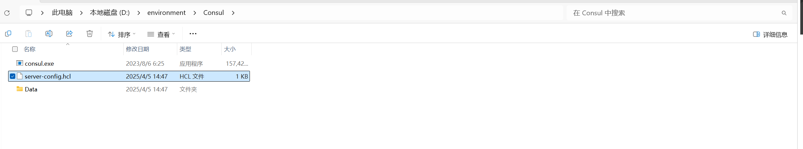

```bash
# 节点名称
node_name = "my-consul-sever"

# 启用当前节点作为 Consul 服务器
server = true

# 设置预期的服务器节点数量，当达到这个数量时，集群将自动启动
bootstrap_expect = 1

# 指定 Consul 数据的存储目录
data_dir = "Data"

# 设置当前节点的绑定地址（用于集群内的通信）
bind_addr = "127.0.0.1"

# 设置允许的客户端连接地址
client_addr = "0.0.0.0"

# 启用 Consul Web UI
ui_config {
  enabled = true
}

# 配置端口
ports {
  serf_lan = 8301   # 默认 Serf LAN 端口
  serf_wan = 8302   # 默认 Serf WAN 端口
  server = 8300     # Consul 服务器端口
  http = 8500       # HTTP API 端口（UI 端口）
  dns = 8600        # DNS 端口
}

# 设置日志级别（可选，默认为 "INFO"）
log_level = "INFO"
```

- 启动：在解压路径下的地址栏输入`cmd`，打开命令行窗口。并键入`consul agent -config-file=server-config.hcl`

```bash
consul agent -config-file=server-config.hcl
```

- 访问页面：http://127.0.0.1:8500/ui

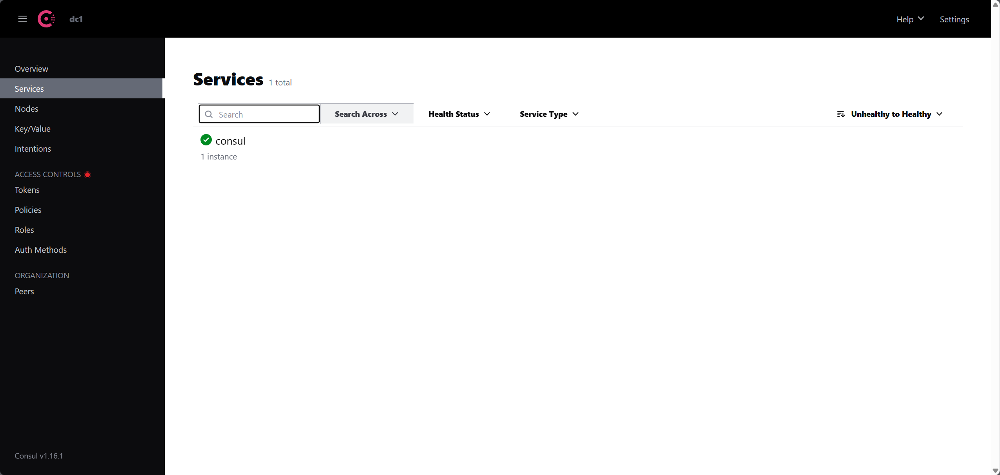

- 编写脚本：start.bat

```bash
@echo off
title consul-server
set ENV_HOME="D:\environment\Consul"
color 07
cd %ENV_HOME%
consul.exe agent -config-file=server-config.hcl
echo [%DATE% %TIME%] Consul started successfully".
```

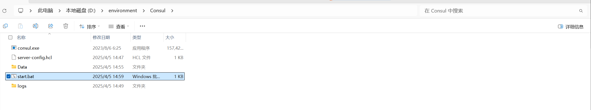

### 2.1.2 配置界面认识

 Spring Cloud Consul 项目是针对 Consul 的服务治理实现。Consul 是一个分布式高可用的系统，它包含多个组件，但是作为一个整体，在微服务架构中，为我们的基础设施提供服务发现和服务配置的工具。

- Web 界面

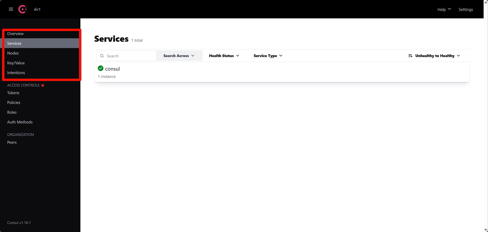

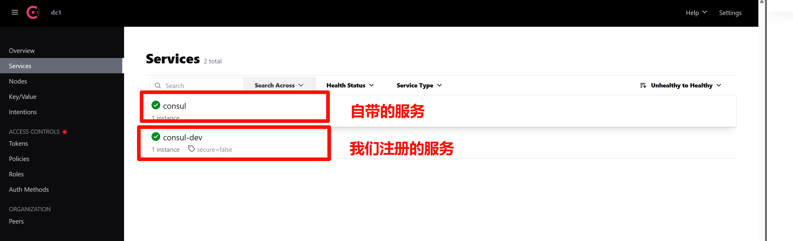

### 2.1.3 服务注册

- 父项目依赖管理：

```xml
<?xml version="1.0" encoding="UTF-8"?>
<project xmlns="http://maven.apache.org/POM/4.0.0"
         xmlns:xsi="http://www.w3.org/2001/XMLSchema-instance"
         xsi:schemaLocation="http://maven.apache.org/POM/4.0.0 http://maven.apache.org/xsd/maven-4.0.0.xsd">
    <modelVersion>4.0.0</modelVersion>

    <groupId>com.shu</groupId>
    <artifactId>SpringCloudGateway</artifactId>
    <version>1.0-SNAPSHOT</version>
    <packaging>pom</packaging>

    <modules>
        <module>GatewayService</module>
        <module>ConSulService</module>
    </modules>


    <properties>
        <maven.compiler.source>8</maven.compiler.source>
        <maven.compiler.target>8</maven.compiler.target>
        <project.build.sourceEncoding>UTF-8</project.build.sourceEncoding>
        <spring.boot.version>2.2.4.RELEASE</spring.boot.version>
        <spring.cloud.version>Hoxton.SR1</spring.cloud.version>
        <spring.cloud.alibaba.version>2.2.0.RELEASE</spring.cloud.alibaba.version>

    </properties>


    <!--   版本管理-->
    <dependencyManagement>
        <dependencies>
            <dependency>
                <groupId>org.springframework.boot</groupId>
                <artifactId>spring-boot-starter-parent</artifactId>
                <version>${spring.boot.version}</version>
                <type>pom</type>
                <scope>import</scope>
            </dependency>
            <dependency>
                <groupId>org.springframework.cloud</groupId>
                <artifactId>spring-cloud-dependencies</artifactId>
                <version>${spring.cloud.version}</version>
                <type>pom</type>
                <scope>import</scope>
            </dependency>
            <dependency>
                <groupId>com.alibaba.cloud</groupId>
                <artifactId>spring-cloud-alibaba-dependencies</artifactId>
                <version>${spring.cloud.alibaba.version}</version>
                <type>pom</type>
                <scope>import</scope>
            </dependency>


        </dependencies>
    </dependencyManagement>


</project>
```

- 子项目依赖

```xml
<?xml version="1.0" encoding="UTF-8"?>
<project xmlns="http://maven.apache.org/POM/4.0.0"
         xmlns:xsi="http://www.w3.org/2001/XMLSchema-instance"
         xsi:schemaLocation="http://maven.apache.org/POM/4.0.0 http://maven.apache.org/xsd/maven-4.0.0.xsd">
    <modelVersion>4.0.0</modelVersion>
    <parent>
        <groupId>com.shu</groupId>
        <artifactId>SpringCloudGateway</artifactId>
        <version>1.0-SNAPSHOT</version>
    </parent>

    <artifactId>ConSulService</artifactId>

    <properties>
        <maven.compiler.source>8</maven.compiler.source>
        <maven.compiler.target>8</maven.compiler.target>
        <project.build.sourceEncoding>UTF-8</project.build.sourceEncoding>
    </properties>

    <dependencies>
        <dependency>
            <groupId>org.springframework.boot</groupId>
            <artifactId>spring-boot-starter-actuator</artifactId>
        </dependency>

        <dependency>
            <groupId>org.springframework.boot</groupId>
            <artifactId>spring-boot-starter</artifactId>
        </dependency>

        <dependency>
            <groupId>org.springframework.cloud</groupId>
            <artifactId>spring-cloud-starter-consul-discovery</artifactId>
        </dependency>


        <dependency>
            <groupId>org.springframework.boot</groupId>
            <artifactId>spring-boot-starter-web</artifactId>
        </dependency>


    </dependencies>

</project>
```

- 配置文件

```yaml
spring:
  application:
    name: consul-dev #定义此服务名称
  cloud:
    consul:
      host: 127.0.0.1 #consul注册地址
      port: 8500 #consul注册地址的端口，8500是默认端口
      discovery:
        enabled: true #启用服务发现
        instance-id: ${spring.application.name}-01 # 注册实例id(必须唯一)
        service-name: ${spring.application.name} # 引用上面的服务名称
        port: ${server.port} # 服务端口
        prefer-ip-address: true #是否使用ip地址注册
        ip-address: ${spring.cloud.client.ip-address} # 服务请求ip
        register: true #启用自动注册
        deregister: true #停服务自动取消注册
server:
  port: 8082 #我们服务的端口地址
```

- 启动类

```java
package com.shu;

import org.springframework.boot.SpringApplication;
import org.springframework.boot.autoconfigure.SpringBootApplication;
import org.springframework.cloud.client.discovery.EnableDiscoveryClient;

/**
 * @author : 瀚海
 * @date : 2025/4/5 14:40
 * @Desc :
 */
@SpringBootApplication
@EnableDiscoveryClient
public class DevConsulApplication {
    public static void main(String[] args) {
        SpringApplication.run(DevConsulApplication.class,args);
    }
}
```

- 启动成功，我们可以发现Web中多了一个服务

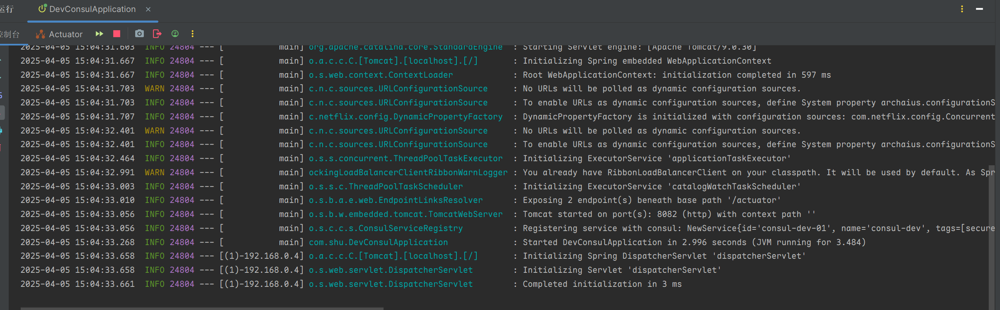

### 2.1.4 健康检查

Consul支持多种健康检查类型，用于检测服务的运行状态：

- HTTP 检查：Consul会定期发送HTTP请求到指定的URL，若返回200 OK则认为服务健康。
- TCP 检查：通过TCP端口连接判断服务是否正常。
- Script 检查：执行指定的脚本或命令，依据返回值判断健康状态（0为健康，其他为不健康）。
- GRPC 检查：通过gRPC协议检测服务健康状态。

Spring Cloud Consul默认使用HTTP检查，通过调用`/actuator/health`端点获取健康状态。可以通过`application.yml`配置文件定制健康检查

- `health-check-path`：指定健康检查URL路径。
- `health-check-interval`：指定健康检查的时间间隔。
- `health-check-timeout`：指定健康检查的超时时间。

```yaml
spring:
  application:
    name: consul-dev #定义此服务名称
  cloud:
    consul:
      host: 127.0.0.1 #consul注册地址
      port: 8500 #consul注册地址的端口，8500是默认端口
      discovery:
        enabled: true #启用服务发现
        instance-id: ${spring.application.name}-01 # 注册实例id(必须唯一)
        service-name: ${spring.application.name} # 引用上面的服务名称
        port: ${server.port} # 服务端口
        prefer-ip-address: true #是否使用ip地址注册
        ip-address: ${spring.cloud.client.ip-address} # 服务请求ip
        register: true #启用自动注册
        deregister: true #停服务自动取消注册
        health-check-interval: 10s #健康检查间隔
        health-check-critical-timeout: 30s #健康检查超时时间
        health-check-path: /actuator/health # 健康检查路径
server:
  port: 8082 #我们服务的端口地址
```

> 自定义健康检查

- 1: 通过创建一个独立的 HTTP 端点，专门用于 Consul 的健康检查。这种方法允许完全自定义健康检查逻辑，而不影响 Actuator 的默认健康端点。

```java
package com.shu;

import org.springframework.http.HttpStatus;
import org.springframework.http.ResponseEntity;
import org.springframework.web.bind.annotation.GetMapping;
import org.springframework.web.bind.annotation.RestController;

/**
 * @author : 瀚海
 * @date : 2025/4/5 14:41
 * @Desc : 测试
 */
@RestController
public class TestControler {

    @GetMapping("/")
    public String home() {
        return "Hello World";
    }


    @GetMapping("/custom-health")
    public ResponseEntity<String> customHealthCheck() {
        System.out.println("custom-health");
        boolean isHealthy = performCustomHealthCheck();
        if (isHealthy) {
            return ResponseEntity.ok("Service is healthy");
        } else {
            return ResponseEntity.status(HttpStatus.SERVICE_UNAVAILABLE).body("Service is down");
        }
    }

    private boolean performCustomHealthCheck() {
        // 实现具体的健康检查逻辑
        return true; // 示例返回值
    }
}
```

- 更改配置文件

```yaml
spring:
  application:
    name: consul-dev #定义此服务名称
  cloud:
    consul:
      host: 127.0.0.1 #consul注册地址
      port: 8500 #consul注册地址的端口，8500是默认端口
      discovery:
        enabled: true #启用服务发现
        instance-id: ${spring.application.name}-01 # 注册实例id(必须唯一)
        service-name: ${spring.application.name} # 引用上面的服务名称
        port: ${server.port} # 服务端口
        prefer-ip-address: true #是否使用ip地址注册
        ip-address: ${spring.cloud.client.ip-address} # 服务请求ip
        register: true #启用自动注册
        deregister: true #停服务自动取消注册
        health-check-interval: 10s #健康检查间隔
        health-check-critical-timeout: 30s #健康检查超时时间
        health-check-path: /custom-health # 健康检查路径
server:
  port: 8082 #我们服务的端口地址
```

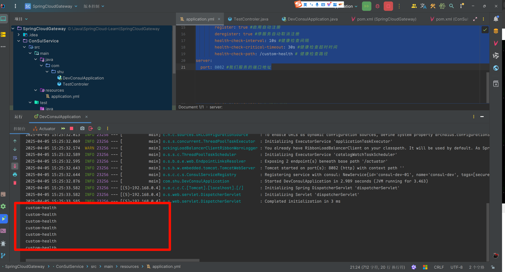

- 2: 可以通过实现Spring Boot的`HealthIndicator`接口来定制健康检查逻辑。例如，检查数据库连接的健康状态

```java
package com.shu;

/**
 * @author : 瀚海
 * @date : 2025/4/5 15:27
 * @Desc :
 */
import org.springframework.boot.actuate.health.Health;
import org.springframework.boot.actuate.health.HealthIndicator;
import org.springframework.stereotype.Component;

@Component
public class DatabaseHealthIndicator implements HealthIndicator {

    @Override
    public Health health() {
        System.out.println("DatabaseHealthIndicator.health()");
        // 自定义健康检查逻辑
        boolean databaseIsUp = checkDatabaseConnection();
        if (databaseIsUp) {
            return Health.up().withDetail("Database", "Running").build();
        } else {
            return Health.down().withDetail("Database", "Not reachable").build();
        }
    }

    private boolean checkDatabaseConnection() {
        // 模拟数据库连接检查
        return true; // 假设数据库连接正常
    }
}


```

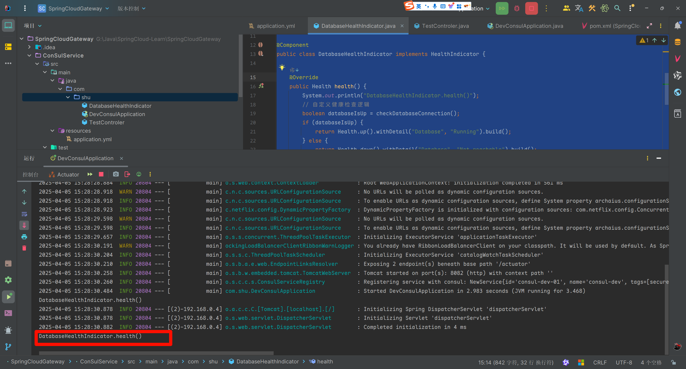

### 2.1.5 配置中心

`Consul` 提供了 `Key/Value` 存储用于存储配置数据，在 `Spring Cloud Consul` 中配置默认存储于 `/config` 文件夹下，根据应用程序名和模拟 `Spring Cloud Config` 顺序解析属性的规则来配置文件。

**在本例中操作 Consul 管控台建立以下路径配置：**

- `config`：为配置基本文件，这里默认为 `config`。
- `consul-service`：为 `application.yml` 中配置的 `spring.application.name` 值。
- `dev`：为 `application.yml` 中配置的 `spring.profiles.active` 值，也是本程序设置环境变量意为开发环境。
- `user.yml`：为配置的文件名，格式为 `yml` 格式。

- Web 新增配置文件：`config/consul-service.dev/user.yml`

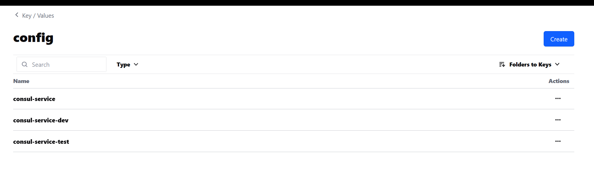

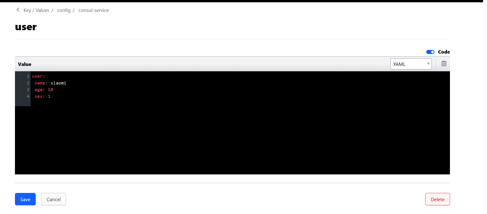

- 子项目增加依赖

```xml
<dependency>
    <groupId>org.springframework.cloud</groupId>
    <artifactId>spring-cloud-starter-consul-config</artifactId>
</dependency>
```

- 新增`bootstrap.yml`配置文件,不能写在一起，他不生效

```properties
spring:
  application:
    name: consul-Demo #定义此服务名称
  cloud:
    consul:
      config:
        enabled: true #启用服务配置
        prefix: config #配置前缀
        default-context: consul-service #配置文件名
        format: yaml #配置文件格式
        profile-separator: "-"
        data-key: user # 配置文件内容
        watch:
          enabled: true # 启用配置文件监听
          delay: 1000 # 监听间隔
      host: 127.0.0.1
      port: 8500

```

配置项 `spring.cloud.consul.config.default-context` 和 `spring.cloud.consul.config.profile-separator` 指定了应用名和环境分隔符，例如应用 `testApp` 有环境 `default`、`dev`、`prod`，只需在 `config` 目录下创建 `consul-service`、`consul-service-dev`、`consul-service-prod` 三个文件夹即可：

- 编写配置类

```java
package com.shu;

import org.springframework.boot.context.properties.ConfigurationProperties;
import org.springframework.stereotype.Component;

/**
 * @author : 瀚海
 * @date : 2025/4/5 15:50
 * @Desc :
 */
@ConfigurationProperties(prefix = "user")
public class UserConfig {
    private String name;
    private Integer age;
    private String sex;

    public String getName() {
        return name;
    }

    public void setName(String name) {
        this.name = name;
    }

    public Integer getAge() {
        return age;
    }

    public void setAge(Integer age) {
        this.age = age;
    }

    public String getSex() {
        return sex;
    }

    public void setSex(String sex) {
        this.sex = sex;
    }

    @Override
    public String toString() {
        return "UserConfig{" +
                "name='" + name + '\'' +
                ", age=" + age +
                ", sex='" + sex + '\'' +
                '}';
    }
}
```

- 编写测试类

```java
package com.shu;

import org.springframework.beans.factory.annotation.Autowired;
import org.springframework.http.HttpStatus;
import org.springframework.http.ResponseEntity;
import org.springframework.web.bind.annotation.GetMapping;
import org.springframework.web.bind.annotation.RestController;

/**
 * @author : 瀚海
 * @date : 2025/4/5 14:41
 * @Desc : 测试
 */
@RestController
public class TestControler {


    @Autowired
    private UserConfig userConfig;

    @GetMapping("/")
    public String home() {
        return "Hello World";
    }


    @GetMapping("/custom-health")
    public ResponseEntity<String> customHealthCheck() {
        System.out.println("custom-health");
        boolean isHealthy = performCustomHealthCheck();
        if (isHealthy) {
            return ResponseEntity.ok("Service is healthy");
        } else {
            return ResponseEntity.status(HttpStatus.SERVICE_UNAVAILABLE).body("Service is down");
        }
    }

    private boolean performCustomHealthCheck() {
        // 实现具体的健康检查逻辑
        return true; // 示例返回值
    }


    @GetMapping("/test")
    public UserConfig test() {
        return userConfig;
    }
}
```

- 测试

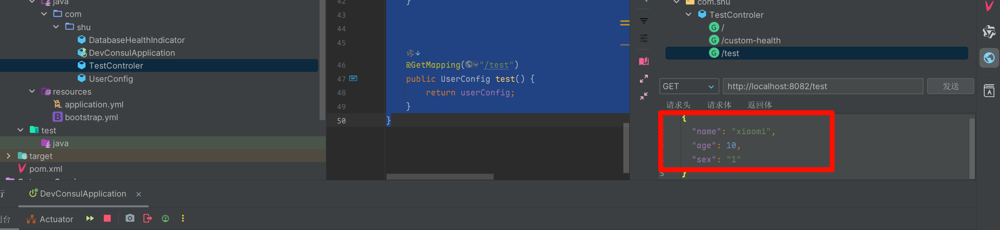

- 更改配置测试

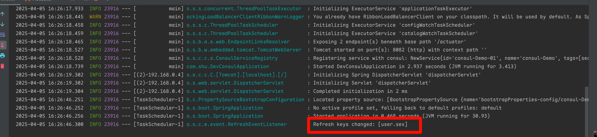

- 到这我们可以发现Consul作为注册中心，服务的发现，健康检查，配置中心的功能，需要进阶需要查看Consul的底层逻辑

## 2.2 Zookeeper

## 2.3 Nacos

## 2.4 Eureka

## 2.5 Etcd 

