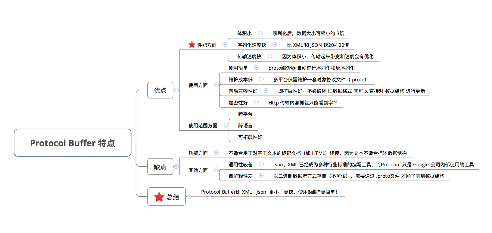
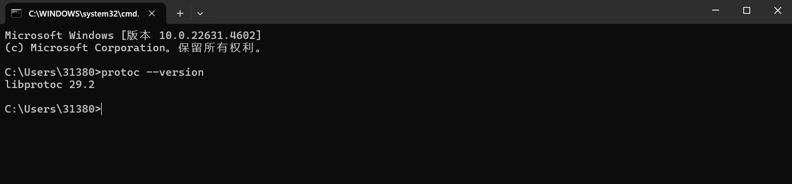
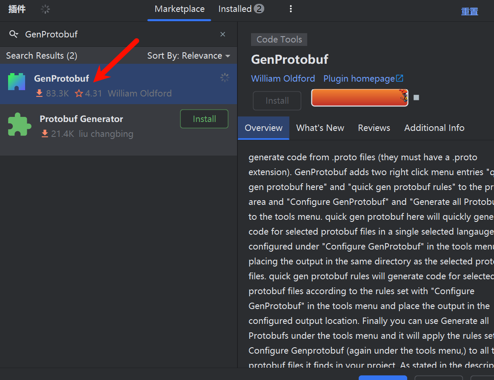
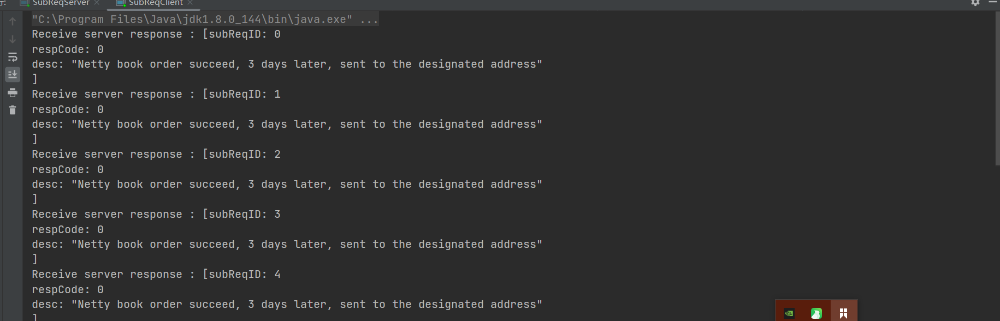
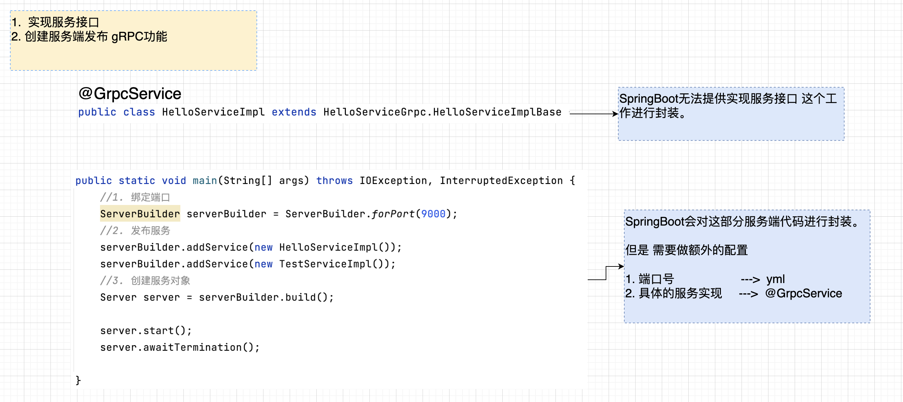

* 代码：https://github.com/Eason-shu/SunGeShuo

# 一  RPC 介绍

## 1.1 概念

RPC是远程过程调用（Remote Procedure Call）。 RPC 的主要功能目标是让构建分布式计算（应用）更容易，在提供强大的远程调用能力时不损失本地调用的语义简洁性。为实现该目标，RPC 框架需提供一种透明调用机制，让使用者不必显式的区分本地调用和远程调用。

## 1.2 优点

* 1、分布式设计

* 2、部署灵活

* 3、解构服务

* 4、扩展性强

## 1.3 RPC 框架

* Dubbo：国内最早开源的 RPC 框架，由阿里巴巴公司开发并于 2011 年末对外开源，仅支持 Java 语言。

* Motan：微博内部使用的 RPC 框架，于 2016 年对外开源，仅支持 Java 语言。

* Tars：腾讯内部使用的 RPC 框架，于 2017 年对外开源，仅支持 C++ 语言。

* SpringCloud：国外 Pivotal 公司 2014 年对外开源的 RPC 框架，提供了丰富的生态组件。

* gRPC：Google 于 2015 年对外开源的跨语言 RPC 框架，支持多种语言。

* Thrift：最初是由 Facebook 开发的内部系统跨语言的 RPC 框架，2007 年贡献给了 Apache 基金，成为Apache 开源项目之一，支持多种语言。

## 1.4 架构变化

* 单体架构：1：热点问题，2：扩展性差（水平扩展），3：耦合性高，4：技术栈受限，5：维护成本高

* 单体架构（水平扩展）：多台服务器扩展单体架构

* 垂直架构：把单体架构进行拆分子系统（有效的解决了单体单体架构的问题）

* RPC架构：跨进程（虚拟机）调用服务，如何实现？（网络）->http/tcp->协议


* 协议选择TCP/HTTP？


## 1.5 RPC 设计

参考文章：https://developer.aliyun.com/article/783611

* 要素：1：协议设计，2：序列化方式

* 自定义协议要素

```sql
/*
+---------------------------------------------------------------+
| 魔数 2byte | 协议版本号 1byte | 序列化算法 1byte | 报文类型 1byte  |
+---------------------------------------------------------------+
| 状态 1byte |        保留字段 4byte     |      数据长度 4byte     | 
+---------------------------------------------------------------+
|                   数据内容 （长度不定）          | 校验字段 2byte |
+---------------------------------------------------------------+
*/
```

* 基本序列化方式

JDK Serializable、FST、Kryo、Protobuf、Thrift、Hession和Avro


* 需要考虑：1：通信方式，2：自定义协议，3：序列化，4:动态代理&#x20;

## 1.6 RPC组成

* 一个完整的 RPC 框架包含了服务注册发现、负载、容错、序列化、协议编码和网络传输等组件。不同的 RPC 框架包含的组件可能会有所不同，但是一定都包含 RPC 协议相关的组件，RPC 协议包括序列化、协议编解码器和网络传输栈


* RPC 协议一般分为公有协议和私有协议。例如，HTTP、SMPP、WebService 等都是公有协议。如果是某个公司或者组织内部自定义、自己使用的，没有被国际标准化组织接纳和认可的协议，往往划为私有协议，例如 Thrift 协议和蚂蚁金服的 Bolt 协议。

* 分布式架构所需要的企业内部通信模块，往往采用私有协议来设计和研发。相较公有协议，私有协议虽然有很多弊端，比如在通用性上、公网传输的能力上，但是高度定制化的私有协议可以最大限度地降低成本，提升性能，提高灵活性与效率。定制私有协议，可以有效地利用协议里的各个字段，灵活满足各种通信功能需求，比如：CRC 校验、Server Fail-Fast 机制和自定义序列化器。

* 在协议设计上，你还需要考虑以下三个关键问题：

　　　　1. 协议包括的必要字段与主要业务负载字段。协议里设计的每个字段都应该被使用到，避免无效字段。

　　　　2. 通信功能特性的支持。比如，CRC 校验、安全校验、数据压缩机制等。

　　　　3. 协议的升级机制。毕竟是私有协议，没有长期的验证，字段新增或者修改，是有可能发生的，因此升级机制是必须考虑的。

# 二 RPC 框架


## 2.1 Hessian

### 2.1.1 介绍

* Hessian协议是一种基于二进制的轻量级远程调用协议，用于在分布式系统中进行跨语言的通信。它使用简单的二进制格式来序列化和反序列化数据，并支持多种编程语言，如Java、C#、Python等。Hessian协议相对于其他协议的优势在于其简单性和高效性。它使用二进制进行序列化和反序列化，相对于使用XML或JSON的协议来说，Hessian的消息体更小、传输速度更快。在Java中，可以通过Hessian协议轻松地实现跨网络的方法调用。

Hessian协议的主要特点包括：

* 高效性 ：由于它使用了二进制编码，所以传输的数据量较小，可以节省带宽和网络资源。此外，Hessian协议还支持数据压缩和断点续传，以提高传输效率和可靠性。

* 跨语言支持 ：Hessian协议使用了通用的编码规则，使得不同编程语言的应用程序可以相互通信。无论是Java、C++、Python还是其他编程语言，只要支持Hessian协议的栈，就可以进行跨语言的数据传输。

* 接口简单易用 ：Hessian协议的接口设计简单明了，易于学习和使用。

* 文件体积小：由于Hessian协议使用二进制编码，相对于使用XML或JSON的协议来说，消息体更小，传输速度更快。

* 传输速度快 ：由于消息体小，传输速度快，因此可以更快地完成远程调用。

* 跨平台性：Hessian协议可以跨平台使用，无论是在Windows、Linux还是其他操作系统上，都可以使用Hessian协议进行远程调用。


### 2.1.2 环境

* 第一步确定本地有Tomcat环境


* 搭建环境：

```xml
<dependencies>
        <dependency>
            <groupId>junit</groupId>
            <artifactId>junit</artifactId>
            <version>4.13.1</version>
            <scope>test</scope>
        </dependency>

        <dependency>
            <groupId>javax.servlet</groupId>
            <artifactId>javax.servlet-api</artifactId>
            <version>3.1.0</version>
            <scope>provided</scope>
        </dependency>

        <dependency>
            <groupId>org.slf4j</groupId>
            <artifactId>slf4j-api</artifactId>
            <version>1.7.32</version>
        </dependency>

        <dependency>
            <groupId>ch.qos.logback</groupId>
            <artifactId>logback-classic</artifactId>
            <version>1.2.9</version>
        </dependency>

        <dependency>
            <groupId>org.projectlombok</groupId>
            <artifactId>lombok</artifactId>
            <version>1.18.22</version>
        </dependency>

        <dependency>
            <groupId>com.caucho</groupId>
            <artifactId>hessian</artifactId>
            <version>4.0.38</version>
        </dependency>
</dependencies>
```

* 代理接口

```java
package com.suns.service;

public interface UserService {
    public boolean login(String name, String password);
    public void register(User user);
}
```

* 实体类：注意必须序列化

```java
package com.suns.service;

import lombok.AllArgsConstructor;
import lombok.Data;
import lombok.NoArgsConstructor;
import lombok.ToString;

import java.io.Serializable;


@Data
@ToString(callSuper = true)
@NoArgsConstructor
@AllArgsConstructor
public class User implements Serializable {
    private String name;
    private String password;
}
```

* 实现服务

```java
package com.suns.service;

import lombok.extern.slf4j.Slf4j;

@Slf4j
public class UserServiceImpl implements UserService {
    @Override
    public boolean login(String name, String password) {
        log.debug("login method invoke name {} password {}", name, password);
        return false;
    }

    @Override
    public void register(User user) {
        log.debug("register method invoke {} ", user);
    }
}
```

* 编写Web服务发布

```xml
<?xml version="1.0" encoding="UTF-8"?>
<web-app xmlns="http://xmlns.jcp.org/xml/ns/javaee"
         xmlns:xsi="http://www.w3.org/2001/XMLSchema-instance"
         xsi:schemaLocation="http://xmlns.jcp.org/xml/ns/javaee http://xmlns.jcp.org/xml/ns/javaee/web-app_4_0.xsd"
         version="4.0">

<!--    Hessian框架的一部分，用于远程过程调用(RPC)-->
    <servlet>
        <servlet-name>userServiceRPC</servlet-name>
        <servlet-class>com.caucho.hessian.server.HessianServlet</servlet-class>
        <init-param>
            <param-name>home-api</param-name>
            <param-value>com.suns.service.UserService</param-value>
        </init-param>
        <init-param>
            <param-name>home-class</param-name>
            <param-value>com.suns.service.UserServiceImpl</param-value>
        </init-param>
    </servlet>

    <!--    映射路径-->
    <servlet-mapping>
        <servlet-name>userServiceRPC</servlet-name>
        <url-pattern>/userServiceRPC</url-pattern>
    </servlet-mapping>
    
    <!--    订单服务-->

    <servlet>
        <servlet-name>orderServiceRPC</servlet-name>
        <servlet-class>com.caucho.hessian.server.HessianServlet</servlet-class>
        <init-param>
            <param-name>home-api</param-name>
            <param-value>com.suns.service.OrderService</param-value>
        </init-param>
        <init-param>
            <param-name>home-class</param-name>
            <param-value>com.suns.service.OrderServiceImpl</param-value>
        </init-param>
    </servlet>

    <!--    映射路径-->
    <servlet-mapping>
        <servlet-name>orderServiceRPC</servlet-name>
        <url-pattern>/orderServiceRPC</url-pattern>
    </servlet-mapping>

</web-app>
```

* 发布Tomcat服务


* 启动


* 编写测试类

```java
package com.suns.client;

import com.caucho.hessian.client.HessianProxyFactory;
import com.suns.service.UserService;
import lombok.extern.slf4j.Slf4j;

import java.net.MalformedURLException;

@Slf4j
public class HessianRPCClient {
    public static void main(String[] args) throws MalformedURLException {
        HessianProxyFactory hessianProxyFactory = new HessianProxyFactory();
        //创建远端RPC服务的代理对象
        String URL = "http://localhost:8080/rpc_hessian_war/userServiceRPC";
        UserService userService = (UserService) hessianProxyFactory.create(UserService.class, URL);
        boolean userServiceRet = userService.login("xiaohei", "123456");
        log.debug("userServiceRet value is {} ", userServiceRet);

        /*
        userService.register(new User("sunshuai", "88888"));
        */


      /*  OrderService orderService = (OrderService) new HessianProxyFactory().create(OrderService.class, "http://localhost:8989/rpc-hessian/orderServiceRPC");
        orderService.showOrder();*/

    }
}
```

* 测试成功


* 序列化

```java
package com.suns.serlializable;

import com.caucho.hessian.io.Hessian2Input;
import com.caucho.hessian.io.Hessian2Output;
import com.suns.service.User;
import lombok.extern.slf4j.Slf4j;

import java.io.*;

@Slf4j
public class TestHessianSerializable {
    public static void main(String[] args) throws IOException {
        //Hessian序列化的目的 就是为了传输数据  基本类型 对象（Seriazable接口）：生成文件
        OutputStream outputStream = new FileOutputStream("F:\\进阶学习\\SunGeShuo\\rpc-lession\\rpc-hessian\\test01");
        Hessian2Output out = new Hessian2Output(outputStream);
        out.writeObject(new User("sunshuai", "123456"));
        out.flush();
        outputStream.close();
        //Hessian反序列化：文件反序列化
        InputStream inputStream = new FileInputStream("F:\\进阶学习\\SunGeShuo\\rpc-lession\\rpc-hessian\\test01");
        Hessian2Input hessian2Input = new Hessian2Input(inputStream);
        User user = (User) hessian2Input.readObject();
        log.debug("{}", user);
    }
}
```

* 原理解析：HessianRPC client创建代理的方式 JDK Proxy.newProxyInstance()

```java

   public Object create(Class<?> api, URL url, ClassLoader loader){
    if (api == null)
      throw new NullPointerException("api must not be null for HessianProxyFactory.create()");
    InvocationHandler handler = null;
    handler = new HessianProxy(url, this, api);
    return Proxy.newProxyInstance(loader,
                                  new Class[] { api,
                                                HessianRemoteObject.class },
                                  handler);
  }
```

## 2.2 Thrift RPC

* 官网：<https://thrift.apache.org/>

* 参考文章：<https://zhuanlan.zhihu.com/p/45194118>、

### 2.2.1 介绍


Thrift是一种可伸缩的跨语言服务的RPC软件框架。它结合了功能强大的软件堆栈的代码生成引擎，以建设服务，高效、无缝地在多种语言间结合使用。2007年由facebook贡献到apache基金，是apache下的顶级项目，具备如下特点：

* 支持多语言：C、C++ 、C# 、D 、Delphi 、Erlang 、Go 、Haxe 、Haskell 、Java 、JavaScript、node.js 、OCaml 、Perl 、PHP 、Python 、Ruby 、SmallTalk

* 消息定义文件支持注释，数据结构与传输表现的分离，支持多种消息格式

* 包含完整的客户端/服务端堆栈，可快速实现RPC，支持同步和异步通信

### 2.2.2 使用

* 详细使用参考教程《Rpc模块的Thrift》

* Maven Thrift 插件

```xml
    <build>
        <plugins>
            <plugin>
                <groupId>org.apache.thrift.tools</groupId>
                <artifactId>maven-thrift-plugin</artifactId>
                <version>0.1.11</version>
                <configuration>
                    <!--<thriftExecutable>/usr/local/bin/thrift</thriftExecutable>-->
<!--                    <thriftSourceRoot>src/main/thrift</thriftSourceRoot>-->
                    <outputDirectory>src/main/java</outputDirectory>
                    <generator>java</generator>
                </configuration>
                <executions>
                    <execution>
                        <id>thrift-sources</id>
                        <phase>generate-sources</phase>
                        <goals>
                            <goal>compile</goal>
                        </goals>
                    </execution>
                </executions>
            </plugin>
        </plugins>
    </build>
```

* thriftExecutable，指的是thrift编译器的位置，如果我们配置了环境变量，可以不指定。验证环境变量可以使用thrift --version命令。

* thriftSourceRoot，thrift源文件的目录，默认会从src/main/thrift下读取。

* outputDirectory，生成java文件的目录。其实这个一般不需要配置，因为java文件的包名是在.thrift文件以namespace的形式定义的。

> 定义thrift文件

```thrift
namespace java com.suns
// 实体类
struct User {
    1: i32 id,
    2: string name,
    3: string email
}
// 异常
exception UserNotFoundException {
    1: i32 id,
    2: string message
}
// 服务接口
service UserService {
    // 获取用户信息
    User getUser(1: i32 id) throws  (1: UserNotFoundException ue)
    // 打招呼
    string sayHello(1: string name)
    // 获取性别
    Gender getGender(1: string name)
}
// 枚举
enum Gender {
    MALE,
    FEMALE
}
```

* 点击插件，生成代码


* 查看代码


* 编写测试类

```java
package com.suns.server;

import com.suns.Gender;
import com.suns.User;
import com.suns.UserNotFoundException;
import com.suns.UserService;
import org.apache.thrift.TException;

/**
 * @Description 
 * @Author EasonShu
 * @Data 2024/12/3 下午10:03
 */
public class UserServiceImpl implements UserService.Iface {
    @Override
    public User getUser(int id) throws UserNotFoundException, TException {
        return new User(100, "EasonShu", "22100");
    }

    @Override
    public String sayHello(String name) throws TException {
        return "Hello " + name;
    }

    @Override
    public Gender getGender(String name) throws TException {
        return Gender.valueOf(name);
    }
}
```

```java
package com.suns.server;

import com.suns.UserService;
import org.apache.thrift.TProcessorFactory;
import org.apache.thrift.protocol.TCompactProtocol;
import org.apache.thrift.server.THsHaServer;
import org.apache.thrift.server.TServer;
import org.apache.thrift.transport.TNonblockingServerSocket;
import org.apache.thrift.transport.TTransportException;
import org.apache.thrift.transport.layered.TFastFramedTransport;

/**
 * @Description
 * @Author EasonShu
 * @Data 2024/12/3 下午10:05
 */
public class UserServerApplication {
    public static void main(String[] args) throws TTransportException {
        // 建立连接
        TNonblockingServerSocket serverSocket =new TNonblockingServerSocket(8803);
        // 建立高可用server
        THsHaServer.Args arg=new THsHaServer.Args(serverSocket).maxWorkerThreads(4).minWorkerThreads(2);
        // 处理器
        UserService.Processor processor = new UserService.Processor(new UserServiceImpl());
        // 设置协议处理器
        arg.protocolFactory(new TCompactProtocol.Factory());
        // 设置传输处理器
        arg.transportFactory(new TFastFramedTransport.Factory());
        // 处理器工厂
        arg.processorFactory(new TProcessorFactory(processor));
        // 开始执行
        TServer tServer = new THsHaServer(arg);
        // 启动服务
        System.out.println("Running Simple Server");
        // 服务启动
        tServer.serve();
    }
}
```

```java
package com.suns.client;

import com.suns.UserService;
import org.apache.thrift.TException;
import org.apache.thrift.protocol.TCompactProtocol;
import org.apache.thrift.protocol.TProtocol;
import org.apache.thrift.transport.TSocket;
import org.apache.thrift.transport.TTransport;
import org.apache.thrift.transport.layered.TFramedTransport;

/**
 * @Description
 * @Author EasonShu
 * @Data 2024/12/3 下午10:08
 */
public class UserClientApplication {
    public static void main(String[] args) {
        TTransport transport =null;
        try {
            // 连接
            transport = new TFramedTransport(new TSocket("127.0.0.1",8803),600);
            // 协议,注意服务端保持一致
            TProtocol protocol = new TCompactProtocol(transport);
            // 调用方法
            UserService.Client client = new UserService.Client(protocol);
            // 打开连接
            transport.open();
            // 调用方法
            String result = client.sayHello("EasonShu");
            // 输出结果
            System.out.println("Result =: " + result);
        } catch (TException e) {
            e.printStackTrace();
        } finally {
            if (null != transport) {
                transport.close();
            }
        }
    }
}
```

* 测试


## 2.3 GPRC&#x20;

gRPC 是由google开源的一个高性能的RPC框架。Stubby Google内部的RPC,演化而来的，2015正式开源。云原生时代是一个RPC标准。

### 2.3.1 Protocol Buffers

#### 2.3.1.1 介绍

* 官网：https://protobuf.dev/

Protocol Buffers是 Google 的语言中立、平台中立、可扩展的 序列化结构化数据的机制 – 想想 XML，但更小、更快、 简单。您只需定义一次数据的结构，然后就可以 使用特殊生成的源代码轻松编写和读取结构化数据 往返各种数据流并使用多种语言。

> 作用

* 通过将 结构化的数据 进行 串行化（序列化），从而实现 数据存储 / RPC 数据交换的功能

* 序列化： 将 数据结构或对象 转换成 二进制串 的过程

* 反序列化：将在序列化过程中所生成的二进制串 转换成 数据结构或者对象 的过程

> 特点



> 安装与配置

* 下载地址：https://github.com/protocolbuffers/protobuf/releases/tag/v29.2

* 配置环境变量


* 验证

```bash
protoc --version
```



* Idea 安装插件


> 比较Json


* 总之一句话，兼容性高，传输速度快

#### 2.3.1.2 语法

> 消息体

* 一个消息对象（Message） = 一个 结构化数据

* 消息对象用 修饰符 message 修饰

* 消息对象 含有 字段：消息对象（Message）里的 字段 = 结构化数据 里的成员变量

```protobuf
message person{}
```

> 字段

* 消息对象的字段 组成主要是：字段 = 字段修饰符 + 字段类型 +字段名 +标识号

* required: 必填字段问题严重，以至于 从 proto3 中删除。必填字段的语义应在 应用层。

* optional：一个格式良好的消息可以有零个或一个这个字段（但不能超过一个）。

* repeated：该字段可以在格式良好的消息中重复任意次数（包括零次）。重复值的顺序将被保留。


```protobuf
message SearchRequest {
  optional string query = 1;
  optional int32 page_number = 2;
  optional int32 result_per_page = 3 [default = 10];
  optional Corpus corpus = 4 [default = CORPUS_UNIVERSAL];
}
```

> 数据类型


> 序号

必须为消息定义中的每个字段指定一个介于 和 之间的数字，并具有以下限制：**1536,870,911**

* 给定的数字在该消息的所有字段中**必须是唯一的**。

* 为协议缓冲区保留的字段编号 实现。如果您使用以下之一，协议缓冲区编译器将抱怨 消息中的这些保留字段编号。19,00019,999

* 您不能使用任何以前[保留](https://protobuf.dev/programming-guides/proto2/#fieldreserved)的字段编号或 已分配给[扩展的任何](https://protobuf.dev/programming-guides/proto2/#extensions)字段编号。

* 您应该将字段编号 1 到 15 用于最常设置的字段 领域，较低的字段编号值在导线格式中占用的空间较少。

> 可选字段与默认值

如果未为可选元素指定默认值，则特定于类型 而是使用默认值：

* 对于字符串，默认值为空 字符串。

* 对于字节，默认值为空字节字符串。

* 对于布尔值， 默认值为 false。

* 对于数值类型，默认值为零。

* 对于枚举， 默认值是枚举的类型定义中列出的第一个值。

```protobuf
optional int32 result_per_page = 3 [default = 10];
```

> 包名

* 防止不同 .proto 项目间命名 发生冲突

* 每个包会被看作是其父类包的内部类

```protobuf
package person;
```

> Option选项

* 作用：影响 特定环境下 的处理方式

* 在 ProtocolBuffers 中允许 自定义选项 并 使用

```protobuf
option java_package = "com.carson.proto";
// 定义：Java包名
// 作用：指定生成的类应该放在什么Java包名下
// 注：如不显式指定，默认包名为：按照应用名称倒序方式进行排序

option java_outer_classname = "Demo";
// 定义：类名
// 作用：生成对应.java 文件的类名（不能跟下面message的类名相同）
// 注：如不显式指定，则默认为把.proto文件名转换为首字母大写来生成
// 如.proto文件名="my_proto.proto"，默认情况下，将使用 "MyProto" 做为类名

option optimize_for = ***;
// 作用：影响 C++  & java 代码的生成
// ***参数如下：
// 1. SPEED (默认):：protocol buffer编译器将通过在消息类型上执行序列化、语法分析及其他通用的操作。（最优方式）
// 2. CODE_SIZE:：编译器将会产生最少量的类，通过共享或基于反射的代码来实现序列化、语法分析及各种其它操作。
  // 特点：采用该方式产生的代码将比SPEED要少很多， 但是效率较低；
  // 使用场景：常用在 包含大量.proto文件 但 不追求效率 的应用中。
//3.  LITE_RUNTIME:：编译器依赖于运行时 核心类库 来生成代码（即采用libprotobuf-lite 替代libprotobuf）。
  // 特点：这种核心类库要比全类库小得多（忽略了 一些描述符及反射 ）；编译器采用该模式产生的方法实现与SPEED模式不相上下，产生的类通过实现 MessageLite接口，但它仅仅是Messager接口的一个子集。
  // 应用场景：移动手机平台应用

option cc_generic_services = false;
option java_generic_services = false;
option py_generic_services = false;
// 作用：定义在C++、java、python中，protocol buffer编译器是否应该 基于服务定义 产生 抽象服务代码（2.3.0版本前该值默认 = true）
// 自2.3.0版本以来，官方认为通过提供 代码生成器插件 来对 RPC实现 更可取，而不是依赖于“抽象”服务

optional repeated int32 samples = 4 [packed=true];
// 如果该选项在一个整型基本类型上被设置为真，则采用更紧凑的编码方式（不会对数值造成损失）
// 在2.3.0版本前，解析器将会忽略 非期望的包装值。因此，它不可能在 不破坏现有框架的兼容性上 而 改变压缩格式。
// 在2.3.0之后，这种改变将是安全的，解析器能够接受上述两种格式。

optional int32 old_field = 6 [deprecated=true];
// 作用：判断该字段是否已经被弃用
// 作用同 在java中的注解@Deprecated

```

> 保留字段

* 如果您通过完全删除某个字段或将其注释掉来更新消息类型，未来的用户可以在对类型进行自己的更新时重用该字段编号。

* 如果他们稍后加载相同的旧版本，这可能会导致严重问题.proto，包括数据损坏、隐私错误等。

* 确保不会发生这种情况的一种方法是指定已删除字段的字段编号（和/或名称，这也可能导致 JSON 序列化问题）为reserved. 如果将来有任何用户尝试使用这些字段标识符，protocol buffer 编译器会抱怨。

```protobuf
message Foo {
  reserved 2, 15, 9 to 11;
  reserved "foo", "bar";
}

// 保留最大值
enum Foo {
  reserved 2, 15, 9 to 11, 40 to max;
  reserved "FOO", "BAR";
}
```

> 枚举类型

* 为字段指定一个 可能取值的字段集合。

* 枚举类型的定义可在一个消息对象的内部或外部。

* 都可以在 同一.proto文件 中的任何消息对象里使用。

* 当枚举类型是在一消息内部定义，希望在 另一个消息中 使用时，需要MessageType.EnumType的语法格式。

```protobuf
enum Corpus {
  CORPUS_UNSPECIFIED = 0;
  CORPUS_UNIVERSAL = 1;
  CORPUS_WEB = 2;
  CORPUS_IMAGES = 3;
  CORPUS_LOCAL = 4;
  CORPUS_NEWS = 5;
  CORPUS_PRODUCTS = 6;
  CORPUS_VIDEO = 7;
}

message SearchRequest {
  optional string query = 1;
  optional int32 page_number = 2;
  optional int32 result_per_page = 3 [default = 10];
  optional Corpus corpus = 4 [default = CORPUS_UNIVERSAL];
}
```

> 消息对象的引用

```protobuf
package person;
option java_package="com.shu.proto";
option java_outer_classname="Person";
// 编码格式
option java_string_check_utf8=true;
// 是否生成hash与equal方法
option java_generate_equals_and_hash=true;
// 基本数据类型,message:定义消息模型
message person{
   // 必须
   required int32 id=1;
   // 可选
   optional string userName=2;
   required double check=3;
   // 可复用赋值
   repeated string sex=4;
   // 性别枚举类
   enum SexType{
      man=1;
      woman=2;
   }
   // 嵌套消息模型
   message Person_Sex {
      optional SexType type = 2 [default = man];
   }
}

package person;

option java_package="com.shu.proto";
option java_outer_classname="Person";
// 编码格式
option java_string_check_utf8=true;
// 是否生成hash与equal方法
option java_generate_equals_and_hash=true;


// 基本数据类型,message:定义消息模型
message person{
   // 必须
   required int32 id=1;
   // 可选
   optional string userName=2;
   required double check=3;
   // 可复用赋值
   repeated string sex=4;
   // 性别枚举类
   enum SexType{
      man=1;
      woman=2;
   }
   // 嵌套消息模型
   message Person_Sex {
      optional SexType type = 2 [default = man];
   }
}
// 外部消息
message AddressBook {
   repeated person person = 1;
   // 直接使用了 Person消息类型作为消息字段
}
```

> 使用不同的protoc文件

```protobuf
import "myproject/other_protos.proto"
// 在A.proto 文件中添加 B.proto文件路径的导入声明
// ProtocolBuffer编译器 会在 该目录中 查找需要被导入的 .proto文件
// 如果不提供参数，编译器就在 其调用的目录下 查找
```

#### 2.3.1.3 定义服务

```protobuf
package person;

option java_package="com.shu.proto";
option java_outer_classname="Person";
// 编码格式
option java_string_check_utf8=true;
// 是否生成hash与equal方法
option java_generate_equals_and_hash=true;


// 返回参数
message person{
   required int32 id=1;
   optional string userName=2;
   repeated string sex=3;
}


// 查询参数
message SearchRequest {
   repeated int32 id = 1;
}


// 定义RPC服务
service SearchPersonService {
   rpc Search (SearchRequest) returns (person);
}
// // 生成命令 protoc -I=E:\Project\Java\src\Demo --java_out=E:\Project E:\Project\Java\src\Demo\Person.proto

```

#### 2.3.1.4 生成命令

> 普通命令生成

* Protoco Buffer提供 C++、Java、Python 三种开发语言的 API


```protobuf
// 在 终端 输入下列命令进行编译
protoc -I=$SRC_DIR --xxx_out=$DST_DIR   $SRC_DIR/addressbook.proto
// 参数说明
// 1. $SRC_DIR：指定需要编译的.proto文件目录 (如没有提供则使用当前目录)
// 2. --xxx_out：xxx根据需要生成代码的类型进行设置
// 对于 Java ，xxx =  java ，即 -- java_out
// 对于 C++ ，xxx =  cpp ，即 --cpp_out
// 对于 Python，xxx =  python，即 --python_out

// 3. $DST_DIR ：编译后代码生成的目录 (通常设置与$SRC_DIR相同)
// 4. 最后的路径参数：需要编译的.proto 文件的具体路径

// 编译通过后，Protoco Buffer会根据不同平台生成对应的代码文件
// eg:protoc -I=E:\Project\Java\src\Demo --java_out=E:\Project E:\Project\Java\src\Demo\Person.proto

```

> Idea 插件生成

* 安装插件




* Maven 依赖

```xml
<dependencies>
    <dependency>
        <groupId>com.google.protobuf</groupId>
        <artifactId>protobuf-java</artifactId>
        <version>3.5.1</version>
    </dependency>
    <!-- https://mvnrepository.com/artifact/com.google.protobuf/protobuf-java-util -->
    <dependency>
        <groupId>com.google.protobuf</groupId>
        <artifactId>protobuf-java-util</artifactId>
        <version>3.5.1</version>
    </dependency>
    <!-- https://mvnrepository.com/artifact/io.grpc/grpc-all -->
    <dependency>
        <groupId>io.grpc</groupId>
        <artifactId>grpc-all</artifactId>
        <version>1.11.0</version>
    </dependency>
    <!--protobuf相关end-->
</dependencies>
<build>
    <extensions>
        <extension>
            <groupId>kr.motd.maven</groupId>
            <artifactId>os-maven-plugin</artifactId>
            <version>1.5.0.Final</version>
        </extension>
    </extensions>
    <plugins>
        <plugin>
            <groupId>org.xolstice.maven.plugins</groupId>
            <artifactId>protobuf-maven-plugin</artifactId>
            <version>0.5.0</version>
            <configuration>
                <protocArtifact>
                    com.google.protobuf:protoc:3.1.0:exe:${os.detected.classifier}
                </protocArtifact>
                <pluginId>grpc-java</pluginId>
                <pluginArtifact>
                    io.grpc:protoc-gen-grpc-java:1.11.0:exe:${os.detected.classifier}
                </pluginArtifact>
            </configuration>
            <executions>
                <execution>
                    <goals>
                        <goal>compile</goal>
                        <goal>compile-custom</goal>
                    </goals>
                </execution>
            </executions>
        </plugin>

    </plugins>
</build>
```


* 注意默认识别的proto文件在main下，点击生成自己想要的语言的文件


* 拷贝到自己的使用地方


#### 2.3.1.5 结合Netty使用

* 定义文件

SubscribeReq.proto

```protobuf
syntax = "proto2";

package com.shu;
option java_package = "com.shu";
option java_outer_classname = "SubscribeReqModel";

message SubscribeReq {
    required int32 subReqID = 1;
    required string userName = 2;
    required string productName = 3;
    optional string phoneNumber = 4;

```

SubscribeResp.proto

```protobuf
syntax = "proto2";

package com.shu;
option java_package = "com.shu";
option java_outer_classname = "SubscribeRespModel";


message SubscribeResp {
    required int32 subReqID = 1;
    required int32 respCode = 2;
    required string desc = 3;
}
```

* 服务端

```java
package com.shu;

import io.netty.bootstrap.ServerBootstrap;
import io.netty.channel.ChannelFuture;
import io.netty.channel.ChannelInitializer;
import io.netty.channel.ChannelOption;
import io.netty.channel.EventLoopGroup;
import io.netty.channel.nio.NioEventLoopGroup;
import io.netty.channel.socket.SocketChannel;
import io.netty.channel.socket.nio.NioServerSocketChannel;
import io.netty.handler.codec.protobuf.ProtobufDecoder;
import io.netty.handler.codec.protobuf.ProtobufEncoder;
import io.netty.handler.codec.protobuf.ProtobufVarint32FrameDecoder;
import io.netty.handler.codec.protobuf.ProtobufVarint32LengthFieldPrepender;
import io.netty.handler.logging.LogLevel;
import io.netty.handler.logging.LoggingHandler;


public class SubReqServer {

    /**
     * 绑定端口
     * @param port
     * @throws Exception
     */
    public void bind(int port) throws Exception {
        EventLoopGroup bossGroup = new NioEventLoopGroup();
        EventLoopGroup workGroup = new NioEventLoopGroup();
        try {
            ServerBootstrap b = new ServerBootstrap();
            b.group(bossGroup , workGroup)
                    .channel(NioServerSocketChannel.class)
                    .option(ChannelOption.SO_BACKLOG , 100)
                    .childHandler(new LoggingHandler(LogLevel.INFO))
                    .childHandler(new ChannelInitializer<SocketChannel>() {
                        @Override
                        protected void initChannel(SocketChannel ch) throws Exception {
                            // ProtobufVarint32FrameDecoder用于半包处理
                            ch.pipeline().addLast(new ProtobufVarint32FrameDecoder());
                            // ProtobufDecoder用于解码
                            ch.pipeline().addLast(new ProtobufDecoder(SubscribeReqModel.SubscribeReq.getDefaultInstance()));
                            // ProtobufVarint32LengthFieldPrepender用于半包处理
                            ch.pipeline().addLast(new ProtobufVarint32LengthFieldPrepender());
                            // ProtobufEncoder用于编码
                            ch.pipeline().addLast(new ProtobufEncoder());
                            // 添加业务处理handler
                            ch.pipeline().addLast(new SubReqServerHandler());
                        }
                    });
            // 绑定端口，同步等待成功
            ChannelFuture future = b.bind(port).sync();
            // 等待服务端监听端口关闭
            future.channel().closeFuture().sync();
            System.out.println("SubReqServer start at port : " + port);
        } catch (Exception e) {
            e.printStackTrace();
        } finally {
            bossGroup.shutdownGracefully();
            workGroup.shutdownGracefully();
        }
    }

    public static void main(String[] args) {
        SubReqServer server = new SubReqServer();
        try {
            server.bind(8080);
        } catch (Exception e) {
            e.printStackTrace();
        }
    }
}

```

```java
package com.shu;

import io.netty.channel.ChannelHandlerAdapter;
import io.netty.channel.ChannelHandlerContext;


public class SubReqServerHandler extends ChannelHandlerAdapter {

        @Override
        public void exceptionCaught(ChannelHandlerContext ctx, Throwable cause) throws Exception {
            ctx.close();
        }

        /**
        * 读取客户端发送的SubscribeReqModel.SubscribeReq请求，调用channelRead方法
        * @param ctx
        * @param msg
        * @throws Exception
        */
        public void channelRead(ChannelHandlerContext ctx , Object msg) throws Exception {
            SubscribeReqModel.SubscribeReq req = (SubscribeReqModel.SubscribeReq) msg;
            if ("shu".equalsIgnoreCase(req.getUserName())) {
                System.out.println("Service accept client subscribe req : [" + req.toString() + "]");
                ctx.writeAndFlush(resp(req.getSubReqID()));
            }
        }

        /**
        * 构造SubscribeRespModel.SubscribeResp响应
        * @param subReqID
        * @return
        */
        private SubscribeRespModel.SubscribeResp resp(int subReqID) {
            SubscribeRespModel.SubscribeResp.Builder builder = SubscribeRespModel.SubscribeResp.newBuilder();
            builder.setSubReqID(subReqID);
            builder.setRespCode(0);
            builder.setDesc("Netty book order succeed, 3 days later, sent to the designated address");
            return builder.build();
        }

        /**
        * 读取完成后，调用channelReadComplete方法，将消息发送队列中的消息写入到SocketChannel中发送给对方
        * @param ctx
        * @throws Exception
        */
        public void channelReadComplete(ChannelHandlerContext ctx) throws Exception {
            ctx.flush();
        }
}

```

* 客户端

```java
package com.shu;

import io.netty.bootstrap.Bootstrap;
import io.netty.channel.ChannelFuture;
import io.netty.channel.ChannelInitializer;
import io.netty.channel.ChannelOption;
import io.netty.channel.EventLoopGroup;
import io.netty.channel.nio.NioEventLoopGroup;
import io.netty.channel.socket.SocketChannel;
import io.netty.channel.socket.nio.NioSocketChannel;
import io.netty.handler.codec.protobuf.ProtobufDecoder;
import io.netty.handler.codec.protobuf.ProtobufEncoder;
import io.netty.handler.codec.protobuf.ProtobufVarint32FrameDecoder;
import io.netty.handler.codec.protobuf.ProtobufVarint32LengthFieldPrepender;


public class SubReqClient {


    public void connect(int port, String host) throws Exception {
        EventLoopGroup group = new NioEventLoopGroup();
        try {
            Bootstrap b = new Bootstrap();
            b.group(group)
                    .option(ChannelOption.TCP_NODELAY, true)
                    .channel(NioSocketChannel.class)
                    .handler(new ChannelInitializer<SocketChannel>() {
                        @Override
                        protected void initChannel(SocketChannel ch) throws Exception {
                            // ProtobufVarint32FrameDecoder用于半包处理
                            ch.pipeline().addLast(new ProtobufVarint32FrameDecoder());
                            // ProtobufDecoder用于解码
                            ch.pipeline().addLast(new ProtobufDecoder(SubscribeRespModel.SubscribeResp.getDefaultInstance()));
                            // ProtobufVarint32LengthFieldPrepender用于半包处理
                            ch.pipeline().addLast(new ProtobufVarint32LengthFieldPrepender());
                            // ProtobufEncoder用于编码
                            ch.pipeline().addLast(new ProtobufEncoder());
                            // 添加业务处理handler
                            ch.pipeline().addLast(new SubReqClientHandler());
                        }
                    });
            // 发起异步连接操作
            ChannelFuture future = b.connect(host, port).sync();
            // 等待客户端链路关闭
            future.channel().closeFuture().sync();
        } catch (Exception e) {
            e.printStackTrace();
        } finally {
            group.shutdownGracefully();
        }

    }

    public static void main(String[] args) {
        int port = 8080;
        try {
            new SubReqClient().connect(port, "127.0.0.1");
        } catch (Exception e) {
            e.printStackTrace();
        }
    }
}

```

```java
package com.shu;

import io.netty.channel.ChannelHandlerAdapter;
import io.netty.channel.ChannelHandlerContext;


public class SubReqClientHandler extends ChannelHandlerAdapter {

    public SubReqClientHandler() {
    }

    @Override
    public void exceptionCaught(ChannelHandlerContext ctx, Throwable cause) throws Exception {
        ctx.close();
    }

    /**
     * 客户端和服务端TCP链路建立成功后，Netty的NIO线程会调用channelActive方法，发送查询时间的指令给服务端
     * 调用ChannelHandlerContext的writeAndFlush方法将请求消息发送给服务端
     * @param ctx
     * @throws Exception
     */
    public void channelActive(ChannelHandlerContext ctx) throws Exception {
        for (int i = 0; i < 10; i++) {
            ctx.write(subReq(i));
        }
        ctx.flush();
    }

    /**
     * 构造SubscribeReqModel.SubscribeReq请求
     * @param i
     * @return
     */
    private SubscribeReqModel.SubscribeReq subReq(int i) {
        SubscribeReqModel.SubscribeReq.Builder builder = SubscribeReqModel.SubscribeReq.newBuilder();
        builder.setSubReqID(i);
        builder.setUserName("shu");
        builder.setProductName("Netty Book For Protobuf");
        return builder.build();
    }

    /**
     * 服务端返回应答消息时，channelRead方法被调用
     * @param ctx
     * @param msg
     * @throws Exception
     */
    public void channelRead(ChannelHandlerContext ctx , Object msg) throws Exception {
        System.out.println("Receive server response : [" + msg + "]");
    }

    /**
     * 读取完成后，调用channelReadComplete方法，将消息发送队列中的消息写入到SocketChannel中发送给对方
     * @param ctx
     * @throws Exception
     */
    public void channelReadComplete(ChannelHandlerContext ctx) throws Exception {
        ctx.flush();
    }

}

```




#### 2.3.1.6 Protocol Buffers 2 与 3区别

详细文章参考：https://blog.csdn.net/ymzhu385/article/details/122307593

* 【区别1】该文件的第一行指定您正在使用proto3语法：如果您不这样做，protocol buffer编译器将假定您使用的是proto2。这必须是文件的第一个非空、非注释行。

* 【区别2】proto3取消了proto2的required，而proto3的singular就是proto2的optional。

* 【区别3】proto3 repeated标量数值类型默认packed，而proto2默认不开启。

* 【区别4】proto3增加了Kotlin，Ruby，Objective-C，C#，Dart的支持

* 【区别5】proto2可以选填default，而proto3只能使用系统默认的。（序列化后如果是默认值是不会占用空间的，对于proto2来说处理就很麻烦了）

* 【区别6】proto3必须有一个零值，以便我们可以使用 0 作为数字默认值。零值需要是第一个元素，以便与proto2语义兼容，其中第一个枚举值始终是默认值。proto2则没有这项要求。

* 【区别7】proto3在3.5版本之前会丢弃未知字段。但在 3.5 版本中，重新引入了未知字段的保留以匹配 proto2 行为。在 3.5 及更高版本中，未知字段在解析过程中保留并包含在序列化输出中。

* 【区别8】proto3移除了proto2的扩展，新增了Any（仍在开发中）和JSON映射。

### 2.3.2 GRPC&#x20;

* 文档：https://grpc.org.cn/docs/

```sql
1. gRPC 是由google开源的一个高性能的RPC框架。Stubby Google内部的RPC,演化而来的，2015正式开源。云原生时代是一个RPC标准。
2. gRPC 核心的设计思路 
         1. 网络通信 ---> gRPC自己封装网络通信的部分 提供多种语言的 网络通信的封装 （C Java[Netty] GO)
         2. 协议    ---> HTTP2 传输数据的时候 二进制数据内容。 支持双向流（双工）连接的多路复用。
         3. 序列化   ---> 基本文本 JSON  基于二进制 Java原生序列化方式 Thrift二进制的序列化 压缩二级制序列化。
                         protobuf (Protocol Buffers) google开源一种序列化方式  时间效率和空间效率是JSON的3---5倍。
                         IDL语言 
         4. 代理的创建 --->让调用者像调用本地方法那样 去调用远端的服务方法。
                          stub
3. gRPC 与 ThriftRPC 区别
   共性：支持异构语言的RPC。
   区别：
        1. 网络通信 Thrift TCP   专属协议
                   GRPC   HTTP2
        2. 性能角度 ThriftRPC 性能 高于 gRPC
        3. gRPC 大厂背书（Google),云原生时代 与其他组件合作的顺利。所以gRPC应用更广泛。
        
4. gRPC的好处 
   1. 高效的进行进程间通信。
   2. 支持多种语言 原生支持 C  Go Java实现。C语言版本上扩展 C++ C# NodeJS Python Ruby PHP..
   3. 支持多平台运行 Linux Android IOS MacOS Windows。
   4. gPRC序列化方式采用protobuf，效率高。
   5. 使用Http2协议
   6. 大厂的背书
```

> Http2.0

```sql
1. 回顾 Http1.x协议 
   Http1.0协议  请求响应的模式 短连接协议（无状态协议）  传输数据文本结构     单工 无法实现服务端推送 变相实现推动（客户端轮训的方式） 
   Http1.1协议  请求响应的模式 有限的长连接            升级的方式WebSocket 双工 实现服务器向客户端推送。
   总结Http1.x协议 共性
     1. 传输数据文本格式 可读性好的但是效率差。
     2. 本质上Http1.x协议无法实现双工通信。
     3. 资源的请求。需要发送多次请求，建立多个连接才可以完成。 
2. HTTP2.0协议 
     1. Http2.0协议是一个二进制协议，效率高于Http1.x协议，可读性差。
     2. 可以实现双工通信。
     3. 一个请求 一个连接 可以请求多个数据。【多路复用】
3. Http2.0协议的三个概念
     1. 数据流 stream
     2. 消息   message
     3. 帧    frame    参看图
4. 其他的相关概念
     1. 数据流的优先级，可以通过为不同的stream设置权重，来限制不同流的传输顺序。
     2. 流控 client发送的数据太快了，server处理不过来，通知client暂停数据的发送。
```


gRPC是一个现代的开源高性能远程过程调用（RPC）框架，可以在任何环境中运行。它可以高效地连接数据中心内和跨数据中心的的服务，并提供可插拔的支持，例如负载均衡、跟踪、健康检查和身份验证。它也适用于分布式计算的最后一英里，用于将设备、移动应用程序和浏览器连接到后端服务。

#### 2.3.3.1 四种通信方式

* 简单RPC（Simple RPC）：即客户端发送一个请求给服务端，从服务端获取一个应答，就像一次普通的函数调用。

```go
rpc SayHello(HelloRequest) returns (HelloResponse){
}
```

* 服务端流式RPC（Server-side streaming RPC）：一个请求对象，服务端可以传回多个结果对象。即客户端发送一个请求给服务端，可获取一个数据流用来读取一系列消息。客户端从返回的数据流里一直读取直到没有更多消息为止。

```go
rpc LotsOfReplies(HelloRequest) returns (stream HelloResponse){
}
```

* 客户端流式RPC（Client-side streaming RPC）：客户端传入多个请求对象，服务端返回一个响应结果。即客户端用提供的一个数据流写入并发送一系列消息给服务端。一旦客户端完成消息写入，就等待服务端读取这些消息并返回应答。

```go
rpc LotsOfGreetings(stream HelloRequest) returns (HelloResponse) {
}
```

* 双向流式RPC（Bidirectional streaming RPC）：结合客户端流式rpc和服务端流式rpc，可以传入多个对象，返回多个响应对象。即两边都可以分别通过一个读写数据流来发送一系列消息。这两个数据流操作是相互独立的，所以客户端和服务端能按其希望的任意顺序读写，例如：服务端可以在写应答前等待所有的客户端消息，或者它可以先读一个消息再写一个消息，或者是读写相结合的其他方式。每个数据流里消息的顺序会被保持。

```go
rpc BidiHello(stream HelloRequest) returns (stream HelloResponse){
}
```

#### 2.3.3.2 核心概念

* 服务定义：使用 Protocol Buffers 定义服务接口和消息类型。服务定义文件通常以 .proto 为扩展名。

* 客户端和服务器：gRPC 支持客户端和服务器之间的通信。客户端可以调用服务器上定义的远程方法，而服务器则负责处理这些调用。

* 通道（Channel）：gRPC 客户端通过通道与服务器通信。通道是一个抽象概念，它代表了客户端和服务器之间的连接。

* 存根（Stub）：客户端使用存根来调用服务器上的方法。存根可以是阻塞式的（BlockingStub），也可以是非阻塞式的（FutureStub 或 AsyncStub）。（代理）

* 序列化：gRPC 使用 Protocol Buffers 进行序列化，这是一种轻便高效的二进制格式，适用于在网络上传输数据。

* RPC 方法：服务定义中包含了一组 RPC 方法，这些方法定义了客户端可以调用的远程操作。

* 元数据（Metadata）：gRPC 允许在请求和响应中附加元数据，这些元数据可以包含关于调用的额外信息，如认证令牌、超时时间等。

* 流（Streaming）：gRPC 支持流式 RPC，允许客户端和服务器之间进行双向流式通信。

#### 2.3.3.3  一元RPC（开发常用）

> 特点

* 当client发起调用后，提交数据，并且等待 服务端响应

* 开发过程中，主要采用就是一元RPC的这种通信方式


> 语法

```protobuf
  rpc hello(HelloRequest) returns (HelloResponse){}
```

> 案例

* 定义Protocol Buffers

```protobuf
syntax = "proto3";

option java_multiple_files = false;
option java_package = "com.suns";
option java_outer_classname = "HelloProto";

/*
    IDL文件 目的 发布RPC服务，service ----> message       message<------  hello xxxx
 */

message HelloRequest{
  string name = 1;
}

message HelloResponse{
  string result = 1;
}

service HelloService{
  rpc hello(HelloRequest) returns (HelloResponse){}
}
```

* Maven 依赖

```xml
<dependencies>
        <dependency>
            <groupId>io.grpc</groupId>
            <artifactId>grpc-netty-shaded</artifactId>
            <version>1.52.1</version>
            <scope>runtime</scope>
        </dependency>
        <dependency>
            <groupId>io.grpc</groupId>
            <artifactId>grpc-protobuf</artifactId>
            <version>1.52.1</version>
        </dependency>
        <dependency>
            <groupId>io.grpc</groupId>
            <artifactId>grpc-stub</artifactId>
            <version>1.52.1</version>
        </dependency>
        <dependency> <!-- necessary for Java 9+ -->
            <groupId>org.apache.tomcat</groupId>
            <artifactId>annotations-api</artifactId>
            <version>6.0.53</version>
            <scope>provided</scope>
        </dependency>
 </dependencies>

<build>
        <extensions>
            <extension>
                <groupId>kr.motd.maven</groupId>
                <artifactId>os-maven-plugin</artifactId>
                <version>1.7.1</version>
            </extension>
        </extensions>
        <plugins>
            <plugin>
                <groupId>org.xolstice.maven.plugins</groupId>
                <artifactId>protobuf-maven-plugin</artifactId>
                <version>0.6.1</version>
                <configuration>
                    <protocArtifact>com.google.protobuf:protoc:3.21.7:exe:${os.detected.classifier}</protocArtifact>
                    <pluginId>grpc-java</pluginId>
                    <pluginArtifact>io.grpc:protoc-gen-grpc-java:1.52.1:exe:${os.detected.classifier}</pluginArtifact>
                </configuration>
                <executions>
                    <execution>
                        <goals>
                            <goal>compile</goal>
                            <goal>compile-custom</goal>
                        </goals>
                    </execution>
                </executions>
            </plugin>
        </plugins>
    </build>
```

* 使用Maven插件，生成服务


* 开发服务端

```xml
<dependencies>
    <dependency>
        <groupId>com.suns</groupId>
        <artifactId>rpc-grpc-api</artifactId>
        <version>1.0-SNAPSHOT</version>
    </dependency>
</dependencies>
```


HelloServiceImpl实现类

```java
public class HelloServiceImpl extends HelloServiceGrpc.HelloServiceImplBase {
    /*
      1. 接受client提交的参数  request.getParameter()
      2. 业务处理 service+dao 调用对应的业务功能。
      3. 提供返回值
     */
    @Override
    public void hello(HelloProto.HelloRequest request, StreamObserver<HelloProto.HelloResponse> responseObserver) {
        //1.接受client的请求参数
        String name = request.getName();
        //2.业务处理
        System.out.println("name parameter "+name);
        //3.封装响应
        //3.1 创建相应对象的构造者
        HelloProto.HelloResponse.Builder builder = HelloProto.HelloResponse.newBuilder();
        //3.2 填充数据
        builder.setResult("hello method invoke ok");
        //3.3 封装响应
        HelloProto.HelloResponse helloResponse = builder.build();
        responseObserver.onNext(helloResponse1);  //通过这个方法 把响应的消息 回传client
        responseObserver.onCompleted();           //通知client 整个服务结束。底层返回标记 
                                          // client就会监听标记 【grpc做的】
    }
}
```

创建服务端 （Netty)

```java
 public static void main(String[] args) throws IOException, InterruptedException {
        //1. 绑定端口 
        ServerBuilder serverBuilder = ServerBuilder.forPort(9000);
        //2. 发布服务
        serverBuilder.addService(new HelloServiceImpl());
        //3. 创建服务对象
        Server server = serverBuilder.build();
        server.start();
        server.awaitTermination();;
    }
```

* 创建客户端

```java
public class GprcClient1 {
    public static void main(String[] args) {
        //1 创建通信的管道
        ManagedChannel managedChannel = ManagedChannelBuilder.forAddress("localhost", 9000).usePlaintext().build();
        //2 获得代理对象 stub
        try {
            HelloServiceGrpc.HelloServiceBlockingStub helloService = HelloServiceGrpc.newBlockingStub(managedChannel);
            //3. 完成RPC调用
            //3.1 准备参数
            HelloProto.HelloRequest.Builder builder = HelloProto.HelloRequest.newBuilder();
            builder.setName("sunshuai");
            HelloProto.HelloRequest helloRequest = builder.build();
            //3.1 进行功能rpc调用，获取相应的内容
            HelloProto.HelloResponse helloResponse = helloService.hello(helloRequest);
            String result = helloResponse.getResult();
            System.out.println("result = " + result);
        } catch (Exception e) {
            throw new RuntimeException(e);
        }finally {
            managedChannel.shutdown();
        }
    }
}
```

* 测试


#### 2.3.3.4 服务端流式RPC&#x20;

* 一个请求对象，服务端可以回传多个结果对象。


> 使用场景

```plain&#x20;text
client  --------> Server
        股票标号
        <-------
         某一个时刻的 股票的行情
```

> 语法

```protobuf
rpc hello(HelloRequest) returns (stream HelloResponse){}
```

> 开发服务端

```java
public class HelloServiceImpl extends HelloServiceGrpc.HelloServiceImplBase {

@Override
public void c2ss(HelloProto.HelloRequest request, StreamObserver<HelloProto.HelloResponse> responseObserver) {
    //1 接受client的请求参数
    String name = request.getName();
    //2 做业务处理
    System.out.println("name = " + name);
    //3 根据业务处理的结果，提供响应
    for (int i = 0; i < 9; i++) {
        HelloProto.HelloResponse.Builder builder = HelloProto.HelloResponse.newBuilder();
        builder.setResult("处理的结果 " + i);
        HelloProto.HelloResponse helloResponse = builder.build();
        responseObserver.onNext(helloResponse);
        try {
            Thread.sleep(1000);
        } catch (InterruptedException e) {
            throw new RuntimeException(e);
        }
    }
    responseObserver.onCompleted();
}
}
```

> 客户端

```java

// 阻塞方式
public class GprcClient3 {
    public static void main(String[] args) {
        ManagedChannel managedChannel = ManagedChannelBuilder.forAddress("localhost", 9000).usePlaintext().build();
        try {
            HelloServiceGrpc.HelloServiceBlockingStub helloService = HelloServiceGrpc.newBlockingStub(managedChannel);

            HelloProto.HelloRequest.Builder builder = HelloProto.HelloRequest.newBuilder();
            builder.setName("sunshuai");
            HelloProto.HelloRequest helloRequest = builder.build();
            Iterator<HelloProto.HelloResponse> helloResponseIterator = helloService.c2ss(helloRequest);
            while (helloResponseIterator.hasNext()) {
                HelloProto.HelloResponse helloResponse = helloResponseIterator.next();
                System.out.println("helloResponse.getResult() = " + helloResponse.getResult());
            }
        } catch (Exception e) {
            e.printStackTrace();
        }
        finally {
            managedChannel.shutdown();
        }
    }
}
// 异步方式
 public class GrpcClient4 {
    public static void main(String[] args) {
        ManagedChannel managedChannel = ManagedChannelBuilder.forAddress("localhost", 9000).usePlaintext().build();

        try {

            HelloServiceGrpc.HelloServiceStub helloService = HelloServiceGrpc.newStub(managedChannel);

            HelloProto.HelloRequest.Builder builder = HelloProto.HelloRequest.newBuilder();
            builder.setName("xiaohei");
            HelloProto.HelloRequest helloRequest = builder.build();

            helloService.c2ss(helloRequest, new StreamObserver<HelloProto.HelloResponse>() {
                @Override
                public void onNext(HelloProto.HelloResponse value) {
                    //服务端 响应了 一个消息后，需要立即处理的话。把代码写在这个方法中。
                    System.out.println("服务端每一次响应的信息 " + value.getResult());
                }

                @Override
                public void onError(Throwable t) {

                }

                @Override
                public void onCompleted() {
                    //需要把服务端 响应的所有数据 拿到后，在进行业务处理。
                    System.out.println("服务端响应结束 后续可以根据需要 在这里统一处理服务端响应的所有内容");
                }
            });

            managedChannel.awaitTermination(12, TimeUnit.SECONDS);

        } catch (Exception e) {
            e.printStackTrace();
        } finally {
            managedChannel.shutdown();
        }
    }
}
```

同步结果：


异步结果：


#### 2.3.3.5 客户端流式RPC

* 客户端发送多个请求对象，服务端只返回一个结果


> 应用场景

IOT(物联网 【传感器】) 向服务端 发送数据

> 语法

```protobuf
rpc cs2s(stream HelloRequest) returns (HelloResponse){}
```

> 服务端

```java
 public class HelloServiceImpl extends HelloServiceGrpc.HelloServiceImplBase {
 
  public StreamObserver<HelloProto.HelloRequest> cs2s(StreamObserver<HelloProto.HelloResponse> responseObserver) {
        return new StreamObserver<HelloProto.HelloRequest>() {
            @Override
            public void onNext(HelloProto.HelloRequest value) {
                System.out.println("接受到了client发送一条消息 " + value.getName());
            }
            @Override
            public void onError(Throwable t) {

            }
            @Override
            public void onCompleted() {
                System.out.println("client的所有消息 都发送到了 服务端 ....");
                //提供响应：响应的目的：当接受了全部client提交的信息，并处理后，提供相应
                HelloProto.HelloResponse.Builder builder = HelloProto.HelloResponse.newBuilder();
                builder.setResult("this is result");
                HelloProto.HelloResponse helloResponse = builder.build();
                responseObserver.onNext(helloResponse);
                responseObserver.onCompleted();
            }
        };
    }
    }
```

> 客户端

```java
public class GrpcClient5 {
    public static void main(String[] args) {
        ManagedChannel managedChannel = ManagedChannelBuilder.forAddress("localhost", 9000).usePlaintext().build();
        try {
            HelloServiceGrpc.HelloServiceStub helloService = HelloServiceGrpc.newStub(managedChannel);

            StreamObserver<HelloProto.HelloRequest> helloRequestStreamObserver = helloService.cs2s(new StreamObserver<HelloProto.HelloResponse>() {
                @Override
                public void onNext(HelloProto.HelloResponse value) {
                    // 监控响应
                    System.out.println("服务端 响应 数据内容为 " + value.getResult());
                }

                @Override
                public void onError(Throwable t) {
                }

                @Override
                public void onCompleted() {
                    System.out.println("服务端响应结束 ... ");
                }
            });

            //客户端 发送数据 到服务端  多条数据 ，不定时...
            for (int i = 0; i < 10; i++) {
                HelloProto.HelloRequest.Builder builder = HelloProto.HelloRequest.newBuilder();
                builder.setName("sunshuai " + i);
                HelloProto.HelloRequest helloRequest = builder.build();

                helloRequestStreamObserver.onNext(helloRequest);
                Thread.sleep(1000);
            }

            helloRequestStreamObserver.onCompleted();

            managedChannel.awaitTermination(12, TimeUnit.SECONDS);

        } catch (Exception e) {
            e.printStackTrace();
        } finally {
            managedChannel.shutdown();
        }
    }
}
```


#### 2.3.3.6 双向流式RPC

* 客户端可以发送多个请求消息，服务端响应多个响应消息


> 应用场景

聊天室

> 语法

```java
rpc cs2ss(stream HelloRequest) returns (stream HelloResponse){}
```

> 服务端

```java
public StreamObserver<HelloProto.HelloRequest> cs2ss(StreamObserver<HelloProto.HelloResponse> responseObserver) {
         return new StreamObserver<HelloProto.HelloRequest>() {
             @Override
             public void onNext(HelloProto.HelloRequest value) {
                 System.out.println("接受到client 提交的消息 "+value.getName());
                 responseObserver.onNext(HelloProto.HelloResponse.newBuilder().setResult("response "+value.getName()+" result ").build());
             }

             @Override
             public void onError(Throwable t) {

             }

             @Override
             public void onCompleted() {
                 System.out.println("接受到了所有的请求消息 ... ");
                 responseObserver.onCompleted();
             }
         };
    }
```

> 客服端

```java
public class GrpcClient6 {
    public static void main(String[] args) {
        ManagedChannel managedChannel = ManagedChannelBuilder.forAddress("localhost", 9000).usePlaintext().build();
        try {
            HelloServiceGrpc.HelloServiceStub helloService = HelloServiceGrpc.newStub(managedChannel);

            StreamObserver<HelloProto.HelloRequest> helloRequestStreamObserver = helloService.cs2ss(new StreamObserver<HelloProto.HelloResponse>() {
                @Override
                public void onNext(HelloProto.HelloResponse value) {
                    System.out.println("响应的结果 "+value.getResult());
                }

                @Override
                public void onError(Throwable t) {

                }

                @Override
                public void onCompleted() {
                    System.out.println("响应全部结束...");
                }
            });


            for (int i = 0; i < 10; i++) {
                helloRequestStreamObserver.onNext(HelloProto.HelloRequest.newBuilder().setName("sunshuai " + i).build());
            }
            helloRequestStreamObserver.onCompleted();

            managedChannel.awaitTermination(12, TimeUnit.SECONDS);

        } catch (Exception e) {
            e.printStackTrace();
        } finally {
            managedChannel.shutdown();
        }
    }
}
```


#### 2.3.3.7&#x20;**&#x20;gPRC代理方式**

```java
1. BlockingStub
   阻塞 通信方式 
2. Stub
   异步 通过监听处理的
3. FutureStub
   同步 异步 NettyFuture
   1. FutureStub只能应用 一元RPC
```

```java
public class GrpcClient7 {
    public static void main(String[] args) {
        ManagedChannel managedChannel = ManagedChannelBuilder.forAddress("localhost", 9000).usePlaintext().build();
        try {
            TestServiceGrpc.TestServiceFutureStub testServiceFutureStub = TestServiceGrpc.newFutureStub(managedChannel);
            ListenableFuture<TestProto.TestResponse> responseListenableFuture = testServiceFutureStub.testSuns(TestProto.TestRequest.newBuilder().setName("xiaojren").build());
            /* 同步操作
            TestProto.TestResponse testResponse = responseListenableFuture.get();
            System.out.println(testResponse.getResult());*/

          /*  responseListenableFuture.addListener(() -> {
                System.out.println("异步的rpc响应 回来了....");
            }, Executors.newCachedThreadPool());*/
            Futures.addCallback(responseListenableFuture, new FutureCallback<TestProto.TestResponse>() {
                @Override
                public void onSuccess(TestProto.TestResponse result) {
                    System.out.println("result.getResult() = " + result.getResult());
                }

                @Override
                public void onFailure(Throwable t) {

                }
            }, Executors.newCachedThreadPool());

            System.out.println("后续的操作....");
            managedChannel.awaitTermination(12, TimeUnit.SECONDS);
        } catch (Exception e) {
            e.printStackTrace();
        } finally {
            managedChannel.shutdown();
        }
    }
}
```

#### 2.3.3.8 SpringBoot+GPRC

```java
1. grpc-server
2. grpc-client 
```




> 服务端

* 依赖

```java
<!-- gRPC springboot依赖（包含grpc-server-spring-boot-starter、grpc-client-spring-boot-starter）-->
<dependency>
    <groupId>net.devh</groupId>
    <artifactId>grpc-spring-boot-starter</artifactId>
    <version>2.13.1.RELEASE</version>
</dependency>

```

* 配置

```java
spring:
  application:
    name: grpc-sb-server
grpc:
  # grpc server相关配置
  server:
    # 启动端口
    port: 9898

```

* 服务类

```java
实现对应的gRPC服务后通过@GrpcService注解进行注册即可。
注：@GrpcService组合@Service注解
@GrpcService
public class HelloServiceImpl extends HelloServiceGrpc.HelloServiceImplBase {
    @Override
    public void hello(HelloProto.HelloRequest request, StreamObserver<HelloProto.HelloResponse> responseObserver) {
        String name = request.getName();
        System.out.println("name is " + name);

        responseObserver.onNext(HelloProto.HelloResponse.newBuilder().setResult("this is result").build());
        responseObserver.onCompleted();
    }
}
```

> 客户端

* 配置

```yaml
server:
  port: 8080
spring:
  application:
    name: grpc-sb-client

# grpc配置
grpc:
  # grpc clienT相关配置
  client:
    # 服务名（不同服务名可对应不同配置）
    grpc-sb-server:
      # 服务端地址
      address: 'static://127.0.0.1:9898'
      # 是否开启保持连接（长连接）
      enableKeepAlive: true
      # 保持连接时长（默认20s）
      keepAliveTimeout: 20s
      # 没有RPC调用时是否保持连接（默认false，可禁用避免额外消耗CPU）
      keepAliveWithoutCalls: false
      # 客户端负载均衡策略(round_robin（默认）, pick_first)
      defaultLoadBalancingPolicy: round_robin
      # 通信类型
      # plaintext | plaintext_upgrade | tls
      # 明文通信且http/2 | 明文通信且升级http/1.1为http/2 | 使用TLS（ALPN/NPN）通信
      negotiationType: plaintext

```

* Channels 的属性都是以 grpc.client.{name}. 或 grpc.client.{name}.security. 为前缀，

* 如上例配置中的grpc-sb-server即对应{name}，Channel 的名称{name}从 @GrpcClient 注解属性value中获取。

* 如果您想要配置一些其他的选项，如为所有服务端设置可信证书，并可以使用GLOBAL作为全局默认名称。

* 单个 channel 的属性配置会覆盖全局配置。

* 通过@GrpcClient即可自动注入对应的Stub，
  @GrpcClient.value即对应配置文件中的Channel名称`{name}`，
  即对应application.yaml中的`grpc.client.grpc-sb-server`下的配置。

```java
@GrpcClient("grpc-server")
private HelloServiceGrpc.HelloServiceBlockingStub stub;

@RequestMapping("/test1")
public String test1(String name) {
    System.out.println("name = " + name);
    HelloProto.HelloResponse helloResponse = stub.hello(HelloProto.HelloRequest.newBuilder().setName(name).build());
    return helloResponse.getResult();
}
```

### 2.3.3 过滤器 (Interceptor)

* GRPC中的interceptor拦截器分为客户端拦截器和服务端拦截器，分别是在客户端和服务端的请求被发送出去之前进行处理的逻辑。常见的使用场景有：（1）请求日志记录及监控；（2）添加请求头数据、以便代理转发使用；（3）请求或者结果重写。

> 介绍

* 拦截器是调用在还没有到达目的地之前进行处理的逻辑，类似于Spring框架中存在的Interceptor。

* gRPC 拦截器主要分为两种：客户端拦截器（ClientInterceptor），服务端拦截器（ServerInterceptor），顾名思义，分别于请求的两端执行相应的前拦截处理。

> 客户端源码

```java
@ThreadSafe
public interface ClientInterceptor {

  <ReqT, RespT> ClientCall<ReqT, RespT> interceptCall(
      MethodDescriptor<ReqT, RespT> method, CallOptions callOptions, Channel next);
}
```

* 它只有一个方法：interceptCall，对于注册了相应拦截器的客户端调用，都要经过这个方法。

**参数：**

* method：MethodDescriptor 类型，标示请求方法。包括方法全限定名称、请求服务名称、请求、结果、序列化工具、幂等等。

* callOptions：此次请求的附带信息。

* next：执行此次 RPC 请求的抽象链接管道（Channel）


> 服务端源码

```java
@ThreadSafe
public interface ServerInterceptor {

  <ReqT, RespT> ServerCall.Listener<ReqT> interceptCall(
      ServerCall<ReqT, RespT> call,
      Metadata headers,
      ServerCallHandler<ReqT, RespT> next);
}    
```

它只有一个方法：interceptCall，对于注册了相应拦截器的服务端调用，都要经过这个方法。

**参数：**

* call：ServerCall 对象，包含客户端请求的 MethodDescriptor

* headers：请求头信息

* next：处理链条上的下一个处理。

