> [!TIP]
> - 参考教程：孙哥说
> - 参考书籍：《Mybatis源码分析》


# Mybatis 源码分析（一）Myabtis 的基本流程实现


# 一 Mybatis 的基本使用回顾

* MyBatis 是一款优秀的持久层框架，它支持自定义 SQL、存储过程以及高级映射。

* MyBatis 免除了几乎所有的 JDBC 代码以及设置参数和获取结果集的工作。

* MyBatis 可以通过简单的 XML 或注解来配置和映射原始类型、接口和 Java POJO（Plain Old Java Objects，普通老式 Java 对象）为数据库中的记录。

* 简单来说，就是一个保存数据的工具，就像我们存钱一样，总要有个介质来帮助我们来存钱，不用过多理解。

* 最重要的一点，在于融汇贯通，你不可能就只学这一个持久层框架，当然基本且扎实的 sql 功底是企业开发的必备技能。

## 1.1 Mybatis 开发环境搭建

* sql

```sql

SET NAMES utf8mb4;
SET FOREIGN_KEY_CHECKS = 0;
-- ----------------------------
-- Table structure for aoa_user_log
-- ----------------------------
DROP TABLE IF EXISTS `aoa_user_log`;
CREATE TABLE `aoa_user_log`  (
  `log_id` bigint NOT NULL AUTO_INCREMENT,
  `ip_addr` varchar(255) CHARACTER SET utf8mb4 COLLATE utf8mb4_general_ci NULL DEFAULT NULL,
  `log_time` datetime(0) NULL DEFAULT NULL,
  `title` varchar(255) CHARACTER SET utf8mb4 COLLATE utf8mb4_general_ci NULL DEFAULT NULL,
  `url` varchar(255) CHARACTER SET utf8mb4 COLLATE utf8mb4_general_ci NULL DEFAULT NULL,
  `user_id` bigint NULL DEFAULT NULL,
  PRIMARY KEY (`log_id`) USING BTREE,
  INDEX `FKherb88q97dxbtcge09ii875qm`(`user_id`) USING BTREE,
  CONSTRAINT `FKherb88q97dxbtcge09ii875qm` FOREIGN KEY (`user_id`) REFERENCES `aoa_user` (`user_id`) ON DELETE RESTRICT ON UPDATE RESTRICT
) ENGINE = InnoDB AUTO_INCREMENT = 2563 CHARACTER SET = utf8mb4 COLLATE = utf8mb4_general_ci ROW_FORMAT = DYNAMIC;

-- ----------------------------
-- Records of aoa_user_log
-- ----------------------------
INSERT INTO `aoa_user_log` VALUES (2551, '0:0:0:0:0:0:0:1', '2022-02-24 13:41:25', '菜单信息', 'http://localhost:9091/index', 1);
INSERT INTO `aoa_user_log` VALUES (2552, '0:0:0:0:0:0:0:1', '2022-02-24 13:41:25', '首页信息', 'http://localhost:9091/home', 1);
INSERT INTO `aoa_user_log` VALUES (2553, '0:0:0:0:0:0:0:1', '2022-02-24 14:10:59', '菜单信息', 'http://localhost:9091/index', 1);
INSERT INTO `aoa_user_log` VALUES (2554, '0:0:0:0:0:0:0:1', '2022-02-24 14:11:00', '首页信息', 'http://localhost:9091/home', 1);
INSERT INTO `aoa_user_log` VALUES (2555, '0:0:0:0:0:0:0:1', '2022-02-24 17:00:20', '菜单信息', 'http://localhost:9091/index', 1);
INSERT INTO `aoa_user_log` VALUES (2556, '0:0:0:0:0:0:0:1', '2022-02-24 17:00:21', '首页信息', 'http://localhost:9091/home', 1);
INSERT INTO `aoa_user_log` VALUES (2557, '0:0:0:0:0:0:0:1', '2022-02-24 17:00:35', '首页信息', 'http://localhost:9091/home', 1);
INSERT INTO `aoa_user_log` VALUES (2558, '0:0:0:0:0:0:0:1', '2022-02-24 17:00:50', '首页信息', 'http://localhost:9091/home', 1);
INSERT INTO `aoa_user_log` VALUES (2559, '0:0:0:0:0:0:0:1', '2022-02-24 17:02:43', '菜单信息', 'http://localhost:9091/index', 1);
INSERT INTO `aoa_user_log` VALUES (2560, '0:0:0:0:0:0:0:1', '2022-02-24 17:02:43', '首页信息', 'http://localhost:9091/home', 1);
INSERT INTO `aoa_user_log` VALUES (2561, '0:0:0:0:0:0:0:1', '2022-02-24 17:07:26', '首页信息', 'http://localhost:9091/home', 1);
INSERT INTO `aoa_user_log` VALUES (2562, '0:0:0:0:0:0:0:1', '2022-02-24 17:08:19', '菜单信息', 'http://localhost:9091/index', 1);
INSERT INTO `aoa_user_log` VALUES (2563, '0:0:0:0:0:0:0:1', '2022-02-24 17:08:19', '首页信息', 'http://localhost:9091/home', 1);

SET FOREIGN_KEY_CHECKS = 1;
```

* 依赖

```xml
 <!-- MyBatis 依赖 -->
    <dependency>
      <groupId>org.mybatis</groupId>
      <artifactId>mybatis</artifactId>
      <version>3.5.4</version>
    </dependency>
    <!-- mysql 驱动 -->
    <dependency>
      <groupId>mysql</groupId>
      <artifactId>mysql-connector-java</artifactId>
      <version>8.0.18</version>
    </dependency>
    <!-- 日志依赖 -->
    <dependency>
      <groupId>ch.qos.logback</groupId>
      <artifactId>logback-classic</artifactId>
      <version>1.2.3</version>
    </dependency>
```

* 简单使用

```java
package com.shu.mybatis;

import org.apache.ibatis.datasource.pooled.PooledDataSource;
import org.apache.ibatis.mapping.Environment;
import org.apache.ibatis.session.Configuration;
import org.apache.ibatis.session.SqlSession;
import org.apache.ibatis.session.SqlSessionFactory;
import org.apache.ibatis.session.SqlSessionFactoryBuilder;
import org.apache.ibatis.transaction.jdbc.JdbcTransactionFactory;

import java.sql.PreparedStatement;
import java.sql.ResultSet;
import java.sql.SQLException;


public class MybatisTest {
    public static void main(String[] args) throws SQLException {
        // Jdbc工厂
        JdbcTransactionFactory factory = new JdbcTransactionFactory();
        /**
        * url:url地址
        * username:用户名
        * password:密码
        */
        PooledDataSource dataSource = new PooledDataSource("com.mysql.cj.jdbc.Driver", "jdbc:mysql://localhost:3306/mybatis?useSSL=false", "root", "123456");
        // 配置环境，向环境中指定环境id、事务和数据源
        Environment environment = new Environment.Builder("development").transactionFactory(factory).dataSource(dataSource).build();
        // 新建 MyBatis 配置类
        Configuration configuration = new Configuration(environment);
        // 得到 SqlSessionFactory 核心类
        SqlSessionFactory sqlSessionFactory = new SqlSessionFactoryBuilder().build(configuration);
        // 开始一个 sql 会话
        SqlSession session = sqlSessionFactory.openSession();
        // 得到 sql 连接并运行 sql 语句
        PreparedStatement preStatement = session.getConnection().prepareStatement("SELECT * FROM  aoa_user_log WHERE log_id = ?");
        preStatement.setInt(1, 1);
        // 执行结果
        ResultSet result = preStatement.executeQuery();
        // 验证结果
        while (result.next()) {
            System.out.println("ip_addr : " + result.getString("ip_addr "));
        }
        // 关闭会话
        session.close();
    }
}
```

## 1.2 Mybatis 整合 Spring

* 参考教程：[Spring 整合 MyBatis——超详细\_spring mybatis-CSDN 博客](https://blog.csdn.net/qq_42662759/article/details/116757078)

* 注意 xml 中需要加

```xml
<build>
    <resources>
        <resource>
            <directory>src/main/java</directory>
            <includes>
                <include>**/*.xml</include>
            </includes>
        </resource>
    </resources>
</build>
```

* 效果

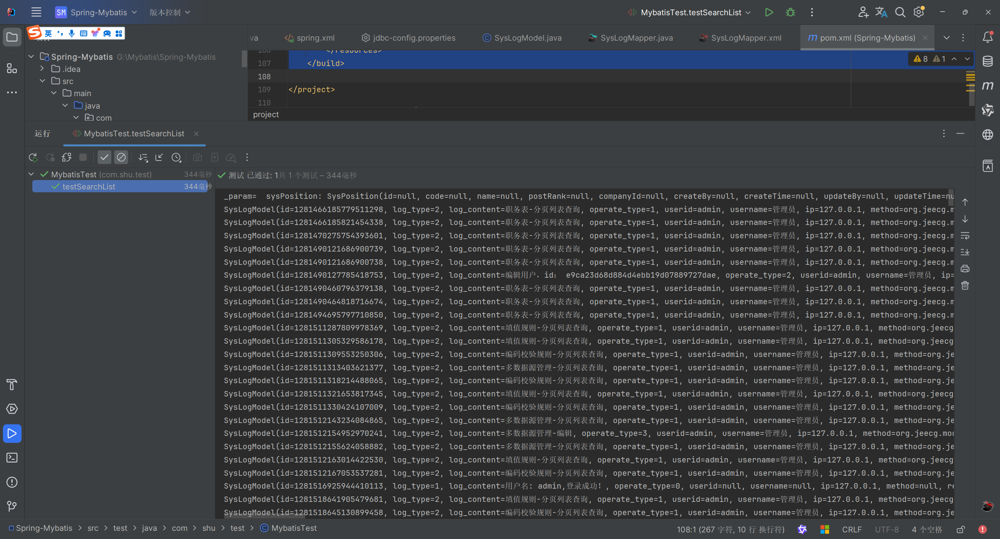

## 1.3 Mybatis 自己配置信息

* 编写 Mybatis 的测试类

```java
package com.shu.test;

import com.shu.mapper.SysLogMapper;
import org.apache.ibatis.io.Resources;
import org.apache.ibatis.session.SqlSession;
import org.apache.ibatis.session.SqlSessionFactory;
import org.apache.ibatis.session.SqlSessionFactoryBuilder;
import org.junit.Test;
import org.junit.runner.RunWith;
import org.springframework.test.context.ContextConfiguration;
import org.springframework.test.context.junit4.SpringJUnit4ClassRunner;

import java.io.IOException;
import java.io.InputStream;

/**
 * @author : EasonShu
 * @date : 2024/7/21 19:13
 * @Version: 1.0
 * @Desc :
 */
@RunWith(SpringJUnit4ClassRunner.class)
@ContextConfiguration(locations = "classpath:spring.xml")
public class MybatisTest02 {


    @Test
    public void contextLoads() {
        // Assuming you have the 'resource' variable set to the path of your MyBatis configuration file
        String resource = "Mybatis-conf.xml";

// Get the input stream for the configuration file
        InputStream inputStream = null;
        try {
            inputStream = Resources.getResourceAsStream(resource);
        } catch (IOException e) {
            e.printStackTrace();
        }

// Build the SqlSessionFactory from the configuration file
        SqlSessionFactory sqlSessionFactory = null;
        try {
            if (inputStream != null) {
                sqlSessionFactory = new SqlSessionFactoryBuilder().build(inputStream);
            }
        } catch (Exception e) {
            e.printStackTrace();
        } finally {
            if (inputStream != null) {
                try {
                    inputStream.close(); // Close the input stream to avoid resource leaks
                } catch (IOException e) {
                    e.printStackTrace();
                }
            }
        }

// Use the SqlSessionFactory to open a SqlSession
        SqlSession session = null;
        try {
            session = sqlSessionFactory.openSession();
            SysLogMapper logMapper = session.getMapper(SysLogMapper.class);
            logMapper.findLogList().forEach(System.out::println);


        } catch (Exception e) {
            e.printStackTrace();
        } finally {
            if (session != null) {
                session.close(); // Close the session to release resources
            }
        }

    }
}
```

* 配置 xml

```xml
<?xml version="1.0" encoding="UTF-8"?>
<!DOCTYPE configuration PUBLIC "-//mybatis.org//DTD Config 3.0//EN"
        "http://mybatis.org/dtd/mybatis-3-config.dtd">
<configuration>
    <environments default="development">
        <environment id="development">
            <transactionManager type="JDBC"/>
            <dataSource type="POOLED">
                <property name="driver" value="com.mysql.jdbc.Driver"/>
                <property name="url" value="jdbc:mysql://localhost:3306/jeecg-boot?useSSL=false"/>
                <property name="username" value="root"/>
                <property name="password" value="123456"/>
            </dataSource>
        </environment>
    </environments>
    
    <mappers>
        <mapper resource="mapper/SysLogMapper.xml"/>
    </mappers>
</configuration>
```

* 测试

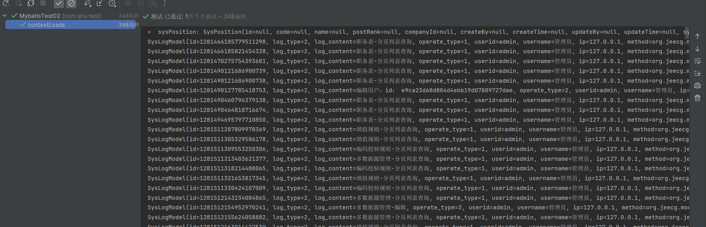

* 到这我们基本的源码分析环境就搭建完毕，下面我们具体的分析源码信息

## 1.4 总结开发流程

在使用 MyBatis 进行数据库操作时，确实可以遵循一个典型的开发流程，以确保代码的组织性和可维护性。

### 1.4.1. Entity（实体类）

这是对数据库表中数据的 Java 对象表示。实体类应该包含与数据库表中的列相对应的字段和访问器方法（getters 和 setters）。例如，如果有一个用户表，实体类可能看起来像这样：

```java
public class User {
    private int id;
    private String name;
    private String email;

    // getters and setters
}
```

### 1.4.2. 类型别名

类型别名是 MyBatis 提供的一种机制，用于简化 XML 映射文件中的类型名称。例如，你可以将`User`类定义为别名`user`：

```xml
<typeAliases>
    <typeAlias alias="user" type="com.example.model.User"/>
</typeAliases>
```

### 1.4.3. Table（表结构）

这一步实际上是在数据库设计层面完成的，但为了与实体类对应，你需要确保你的实体类和数据库表结构相匹配。

### 1.4.4. DAO 接口（数据访问对象）

DAO 接口定义了用于执行 CRUD 操作的方法。这些方法的签名应该与你在 Mapper 文件中定义的 SQL 语句相对应。例如：

```java
public interface UserMapper {
    List<User> findAllUsers();
    User findUserById(int id);
    void insertUser(User user);
    void updateUser(User user);
    void deleteUser(int id);
}
```


### 1.4.5. Mapper 文件

Mapper 文件是 XML 文件，其中包含了具体的 SQL 语句和结果映射规则。每个 Mapper 文件应该与一个 DAO 接口相对应。例如：

```xml
<mapper namespace="com.example.mapper.UserMapper">
    <select id="findAllUsers" resultType="user">
        SELECT * FROM users
    </select>
</mapper>
```


### 1.4.6. Mapper 文件的注册

Mapper 文件需要在 MyBatis 的配置文件中注册，通常是通过`mybatis-config.xml`：

```xml
<configuration>
    <mappers>
        <mapper resource="com/example/mapper/UserMapper.xml"/>
    </mappers>
</configuration>
```

### 1.4.7. API 编程

最后，你可以在服务层或控制器中注入 DAO 接口，并调用其方法来执行数据库操作。在 Spring 框架下，这通常通过@Autowired 注解完成：

```java
@Service
public class UserService {
    @Autowired
    private UserMapper userMapper;

    public List<User> getAllUsers() {
        return userMapper.findAllUsers();
    }
}
```

# 二 Mybatis 的核心对象

## 2.1 数据存储类对象

* Configuration:   1. 封装了 mybatis-config.xml，2。 封装了 mapper 文件  MappedStatement，3。 创建 Mybatis 其他相关的对象;
* MappedStatment ：对应的就是 Mapper 文件中的一个一个的 配置标签;
* BoundSql：封装 SQL 语句
```xml
  概念：在Java中（JVM)对Mybatis相关的配置信息进行封装
   mybatis-config.xml ----> Configuration
   Configuration 
      1. 封装了mybatis-config.xml
      2. 封装了mapper 文件  MappedStatement
      3. 创建Mybatis其他相关的对象 
   XXXDAOMapper.xml ----> MappedStatement(形象的认知，不准确)
  操nt对象 
      对应的就是 Mapper文件中的一个一个的 配置标签 
      <select id. -----> MappedStatement
      <insert id. -----> MappedStatement 
      注定 一个Mybatis应用中 N个MappedStament 对象 
      MappedStatment ---> Configuration 
      MappedStatment 中 封装SQL语句 ---> BoundSql
```

## 2.2 操作类对象 （SqlSession）&#x20;

* Excutor：是 Mybatis 中处理功能的核心，1。 增删改 update  查 query，2。 事务操作提交 回滚

&#x20;   3\. 缓存相关的操作

```xml
 Excutor接口 
           BatchExcutor
               JDBC中批处理的操作， BatchExcutor 
           ReuseExcutor
               目的：复用 Statement 
               insert into t_user（ID，name)values（1，‘孙帅’）；
               insert into t_user（ID，name)values（2，‘孙帅1’）；
           SimpleExcutor
               常用Excutor Mybatis推荐 默认 
               Configuration protected ExecutorType defaultExecutorType = ExecutorType.SIMPLE;
```

* StatmentHandler： StatementHandler 是 Mybatis 封装了 JDBC Statement，真正 Mybatis 进行数据库访问操作的核心

```xml
 功能：增删改差
       StatementHandler接口
                  SimpleStatementHandler
                      JDBC 操作 
                  PreparedStatementHandler
                  CallableStatementHandler 
```

* ParameterHandler：Mybatis 参数 ---》 JDBC 相关的参数 ， @Param ---> #{} --- > ？

* ResultSetHandler：对 JDBC 中查询结果集 ResultSet 进行封装&#x20;

* TypeHandler：  Java 程序操作 数据库

```xml
  Java类型   数据库类型
        String    varchar
        int       number
        int       int 
```

## 2.3 存储类源码具体分析

### 2.3.1 Configuration（配置中心）

* 介绍： 在 MyBatis 中，`Configuration`类扮演着核心的角色，它负责存储所有 MyBatis 运行时需要的信息，包括数据源信息、映射器（Mapper）配置、类型别名、类型处理器、对象工厂、插件以及属性设置等。

#### 2.3.1.1 类加载器

* 引导类加载器 （**BootstrapClassLoader**） 负责加载系统类（通常从 JAR 的 rt.jar 中进行加载），它是虚拟机不可分割的一部分，通常使用 C 语言实现，引导类加载器没有对应的 ClassLoader 对象&#x20;

* 扩展类加载器 （**ExtClassLoader**） 扩展类加载器用于从 jre/lib/txt 目标加载“标准的扩展”。可以将 jar 文件放入该目录，这样即使没有任何类路径，扩展类加载器也可以找到其中的各个类 ，

* 系统类加载器 （**AppClassLoader**） 系统类加载器用于加载应用类，它在由 ClASSPATH 环境变量或者-classpath 命令行选项设置的类路径的目录或者是 jar/ZIP 文件里查找这些类

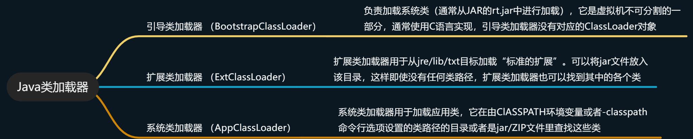

```java
    /**
     * 类加载机制
     */
    @Test
    public void ResourcesTest(){
        // 应用程序类加载器（Application ClassLoader）：用于加载用户类路径（Classpath）上的类，是Java应用程序的类加载器。
        ClassLoader systemClassLoader = ClassLoader.getSystemClassLoader();
        System.out.println("应用程序类加载器:"+systemClassLoader.toString());
        // 扩展类加载器（Extension ClassLoader）：用于加载Java的扩展类库，默认加载JAVA_HOME/jre/lib/ext目录下的类。
        ClassLoader parent = systemClassLoader.getParent();
        System.out.println("扩展类加载器:"+parent.toString());
        // 启动类加载器（Bootstrap ClassLoader）：用于加载Java运行时环境所需要的类，它加载的类是由C++编写的，并由虚拟机自身启动。
//        ClassLoader parentParent = parent.getParent();
//        System.out.println("启动类加载器:"+parentParent.toString());
    }
```

> 注意：Bootstrap ClassLoader 会报错，因为 Bootstrap ClassLoader 是虚拟机的一部分，由 C++进行编写
>
> 加载顺序

1. **BootstrapClassLoader**

2. **ExtClassLoader**

3. **AppClassLoader**

* 关于 classLoader 的详细信息请参考文章：[一看你就懂，超详细 java 中的 ClassLoader 详解](https://blog.csdn.net/briblue/article/details/54973413) 博主讲得通俗易懂

#### 2.3.1.2 获取配置文件

```java
// 第一阶段：MyBatis的初始化阶段
String resource = "mybatis-config.xml";
// 得到配置文件的输入流
InputStream inputStream = null;
try {
    inputStream = Resources.getResourceAsStream(resource);
} catch (IOException e) {
    e.printStackTrace();
}
```

* 我们可以看到调用了`Resources#getResourceAsStream(resource)`去获取配置文件的信息，调用重载`getResourceAsStream（）`方法，进入 Resources 这个类中进行方法的调用。

**Resources**

```java
public static InputStream getResourceAsStream(ClassLoader loader, String resource) throws IOException {
    // 去加载我们写的mybatis-config.xml 文件
    InputStream in = classLoaderWrapper.getResourceAsStream(resource, loader);
    // 没有找到，资源不存在
    if (in == null) {
      throw new IOException("Could not find resource " + resource);
    }
    return in;
  }
```

* 通过断点调试，我们发现`Resources`通过`ClassLoaderWrapper`来寻找文件

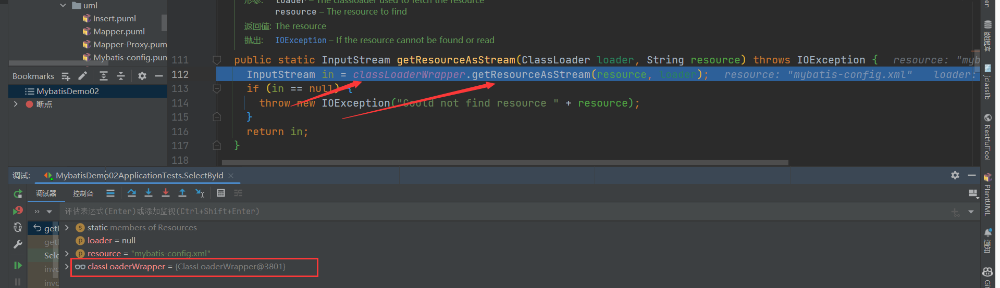

* 继续分析`ClassLoaderWrapper`，发现 ClassLoaderWrapper 类的初始化方法

```java

/**
 * 获取多个ClassLoader，这一步是必须的，因为，我们就是从这个加载器中获取资源的流的
 *五种类加载器：自己传入的、默认的类加载器、当前线程的类加载器、本类的类加载器、系统类加载器
 * @param classLoader 我们定义的自己的类加载器
 * @return 类加载器的数组
 */
ClassLoader[] getClassLoaders(ClassLoader classLoader) {
    return new ClassLoader[]{
            classLoader,
            defaultClassLoader,
            Thread.currentThread().getContextClassLoader(),
            getClass().getClassLoader(),
            systemClassLoader};
}
```

* 这五种类加载器依次是： 作为参数传入的类加载器，可能为 null； 系统默认的类加载器，如未设置则为 null；· 当前线程的线程上下文中的类加载器； 当前对象的类加载器； 系统类加载器，在 ClassLoaderWrapper 的构造方法中设置。

* 以上五种类加载器的优先级由高到低。在读取类文件时，依次到上述五种类加载器中进行寻找，只要某一次寻找成功即返回结果。

* 用一组 ClassLoader 去找到我们写的 mybatis-conf.xml 文件，一般情况下，类加载器会将名称转换为文件名，然后从文件系统中读取该名称的类文件，因此，类加载器具有读取外部资源的能力，这里要借助的正是类加载器的这种能力。

```java
/**
 * 从一个ClassLoader中获取资源的流，这就是我们的目的
 *
 * @param resource    资源的地址
 * @param classLoader 类加载器
 * @return 流
 */
InputStream getResourceAsStream(String resource, ClassLoader[] classLoader) {
    for (ClassLoader cl : classLoader) {
        if (null != cl) {
            // try to find the resource as passed
            InputStream returnValue = cl.getResourceAsStream(resource);
            // now, some class loaders want this leading "/", so we'll add it and try again if we didn't find the resource
            if (null == returnValue) {
                returnValue = cl.getResourceAsStream("/" + resource);
            }
            if (null != returnValue) {
                return returnValue;
            }
        }
    }
    return null;
}
```

* getResourceAsStream 方法会依次调用传入的每一个类加载器的 getResourceAsStream 方法来尝试获取配置文件的输入流

**ClassLoader**

```java
    public InputStream getResourceAsStream(String name) {
        // 找到文件
        URL url = getResource(name);
        try {
            if (url == null) {
                return null;
            }
            URLConnection urlc = url.openConnection();
            InputStream is = urlc.getInputStream();
            if (urlc instanceof JarURLConnection) {
                JarURLConnection juc = (JarURLConnection)urlc;
                JarFile jar = juc.getJarFile();
                synchronized (closeables) {
                    if (!closeables.containsKey(jar)) {
                        closeables.put(jar, null);
                    }
                }
            } else if (urlc instanceof sun.net.www.protocol.file.FileURLConnection) {
                synchronized (closeables) {
                    closeables.put(is, null);
                }
            }
            return is;
        } catch (IOException e) {
            return null;
        }
    }
```

* 我们来看看 getResource 方法吧，相信你刚才看了文章，接下来看你理解没有刚才的知识，这里需要了解一下 Java 虚拟机的双亲委派机制：简单来说就是先委派自己的父类来加载文件，如果父类没有，尝试子类自己加载文件。

> **双亲委派模型**
>
> Java 的类加载器体系结构遵循双亲委派模型，其中每个类加载器都有一个父类加载器。如果一个类加载器接收到加载类的请求，它首先不会尝试自己加载类，而是将请求委派给父类加载器。只有当父类加载器无法加载请求的类时，子类加载器才会尝试加载。

```java
    public URL getResource(String name) {
        URL url;
        // 父类加载器能够找到该文件，由前面我们知道AppClassLoader的父类加载器是ExtClassLoader
        if (parent != null) {
            url = parent.getResource(name);
        } else {
            // 通过双亲委派机制找到文件
            url = getBootstrapResource(name);
        }
        // 没有的话
        if (url == null) {
            url = findResource(name);
        }
        return url;
    }
```

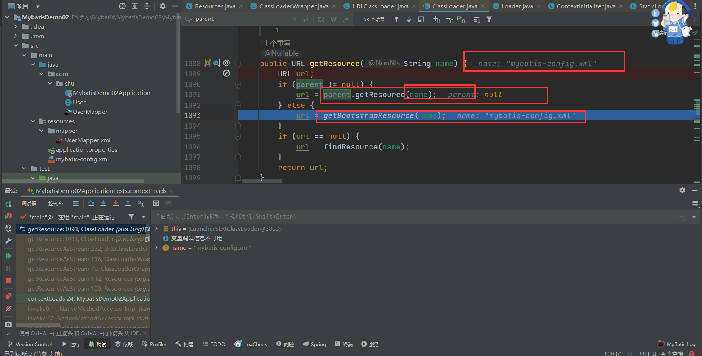

* 在 Java 中，引导类加载器负责加载构成 Java 平台核心的类库，如`rt.jar`和`resources.jar`等。由于引导类加载器是原生实现的，并不继承自`java.lang.ClassLoader`，因此我们不能直接调用其`getResource`方法。但是，我们可以使用一些间接的方式来访问它加载的资源。

```java
private static URL getBootstrapResource(String name) {
    URLClassPath ucp = getBootstrapClassPath();
    Resource res = ucp.getResource(name);
    return res != null ? res.getURL() : null;
}
```

* 接下来就是依次调用类加载去寻找文件

```java
public Resource getResource(String var1, boolean var2) {
    if (DEBUG) {
        System.err.println("URLClassPath.getResource(\"" + var1 + "\")");
    }
    // 获取或创建一个查找缓存数组，这个数组可能用于优化查找过程，存储已经检查过的加载器的索引，避免重复检查。
    int[] var4 = this.getLookupCache(var1);

    Loader var3;
    // 对于每一个Loader，调用其getResource方法来查找资源。var2参数可能是用于指示是否查找已归档的资源。
    for(int var5 = 0; (var3 = this.getNextLoader(var4, var5)) != null; ++var5) {
        Resource var6 = var3.getResource(var1, var2);
        if (var6 != null) {
            return var6;
        }
    }
    // 如果任何Loader返回一个非空的Resource实例，方法立即返回该资源。
    return null;
}
```

* 获取到了 URL 连接，返回文件流

```java
    public InputStream getResourceAsStream(String name) {
        // 找到文件
        URL url = getResource(name);
        try {
            if (url == null) {
                return null;
            }
            // 打开连接
            URLConnection urlc = url.openConnection();
            // 获取流数据
            InputStream is = urlc.getInputStream();
            // jar包连接
            if (urlc instanceof JarURLConnection) {
                JarURLConnection juc = (JarURLConnection)urlc;
                JarFile jar = juc.getJarFile();
                synchronized (closeables) {
                    if (!closeables.containsKey(jar)) {
                        closeables.put(jar, null);
                    }
                }
            }
            // 文件连接
            else if (urlc instanceof sun.net.www.protocol.file.FileURLConnection) {
                synchronized (closeables) {
                    closeables.put(is, null);
                }
            }
            return is;
        } catch (IOException e) {
            return null;
        }
    }
```

**总结**

1. Resources#getResourceAsStream（）通过名称寻找资源文件

2. Resources 交给 ClassLoaderWrapper 去寻找资源文件

3. ClassLoaderWrapper 初始化了 5 个类加载器，依次用类加载器去寻找资源文件

4. 到了类加载器，通过委派父类加载器去选择资源文件

5. URLClassLoader 找到了资源文件的 URL 转换成输入流返回给调用者

6. 如果类加载器没有找到的话，需要调用自身 URLClassPath 类的方法通过名称来寻找资源文件

7. URLClassPath 根据 URL 的协议类型创建不同的 Loader 来解析不同的资源类型返回调用者

#### 2.3.1.3 配置文件解析

* 可以解析的配置参考：[Configuration](https://mybatis.org/mybatis-3/configuration.html)

* 接下来就是解析我们编写的配置文件，然后存储在 Configuration 中为 SqlSession 做准备，这部分的重点是如何解析 Xml

##### 2.1.1.3.1 XML 解析方法

在 Java 中解析 XML 文档有多种方法，主要分为 DOM （Document Object Model）， SAX （Simple API for XML）， StAX （Streaming API for XML）， 和第三方库如 JAXB （Java Architecture for XML Binding） 和 XPath。

* DOM 将整个 XML 文档加载到内存中并构建一个树状结构，允许你遍历整个文档，查询节点，修改节点等。对于小到中等大小的文档，DOM 是一个不错的选择。

```xml
<?xml version="1.0"?>
<bookstore>
    <book category="COOKING">
        <title lang="en">Everyday Italian</title>
        <author>Giada De Laurentiis</author>
        <year>2005</year>
        <price>30.00</price>
    </book>
    <book category="CHILDREN">
        <title lang="en">Harry Potter</title>
        <author>J K. Rowling</author>
        <year>2005</year>
        <price>29.99</price>
    </book>
</bookstore>
```

```java
import javax.xml.parsers.DocumentBuilderFactory;
import javax.xml.parsers.DocumentBuilder;
import org.w3c.dom.Document;
import org.w3c.dom.NodeList;
import org.w3c.dom.Node;
import org.w3c.dom.Element;
import java.io.File;

public class DomExample {

    public static void main(String[] args) {
        try {
            // 创建 DocumentBuilderFactory 实例
            DocumentBuilderFactory dbFactory = DocumentBuilderFactory.newInstance();
            // 使用 DocumentBuilderFactory 创建 DocumentBuilder 实例
            DocumentBuilder dBuilder = dbFactory.newDocumentBuilder();
            // 使用 DocumentBuilder 加载并解析 XML 文件，得到 Document 实例
            Document doc = dBuilder.parse(new File("books.xml"));
            // 规范化文档
            doc.getDocumentElement().normalize();
            // 获取所有 book 节点的列表
            NodeList nodeList = doc.getElementsByTagName("book");
            // 打印所有 book 节点的信息
            for (int i = 0; i < nodeList.getLength(); i++) {
                Node node = nodeList.item(i);
                if (node.getNodeType() == Node.ELEMENT_NODE) {
                    Element element = (Element) node;
                    // 打印 book 节点的 category 属性
                    System.out.println("Category: " + element.getAttribute("category"));
                    // 打印 book 节点的 title、author、year 和 price 子节点
                    System.out.println("Title: " + element.getElementsByTagName("title").item(0).getTextContent());
                    System.out.println("Author: " + element.getElementsByTagName("author").item(0).getTextContent());
                    System.out.println("Year: " + element.getElementsByTagName("year").item(0).getTextContent());
                    System.out.println("Price: " + element.getElementsByTagName("price").item(0).getTextContent());
                    System.out.println("----------");
                }
            }
            // 修改 XML 文件中的某个节点
            Node nodeToModify = nodeList.item(0);
            Element bookElement = (Element) nodeToModify;
            Element titleElement = (Element) bookElement.getElementsByTagName("title").item(0);
            titleElement.setTextContent("New Title");
            // 保存修改后的 XML 文件
            // 注意：保存修改后的 XML 文件需要使用 Transformer 类，这里省略了这部分代码

        } catch (Exception e) {
            e.printStackTrace();
        }
    }
}
```

##### 2.1.1.3.2 **XMLConfigBuilder 解析 Xml**

`XMLConfigBuilder`是 MyBatis 框架内部用于解析 MyBatis 配置文件的主要类之一。当 MyBatis 启动时，它会读取一个配置文件（通常是`mybatis-config.xml`），该文件包含了数据源、事务管理器、映射器和其他 MyBatis 配置的设置。`XMLConfigBuilder`负责解析这个配置文件，并将解析出的信息转化为`Configuration`对象，以便 MyBatis 可以使用这些信息来创建`SqlSessionFactory`。

**解析过程概览**

1. 创建解析器：
   `XMLConfigBuilder`的实例化通常发生在`SqlSessionFactoryBuilder`内部，当调用`build(InputStream)`方法时。`SqlSessionFactoryBuilder`会创建一个`XMLConfigBuilder`实例，并将输入流传递给它。

2. 解析配置文件：
   `XMLConfigBuilder`使用 DOM 或 SAX 解析器读取 XML 配置文件。它会解析诸如`<environments>`、`<mappers>`等标签，并将它们转换为`Configuration`对象中的相应设置。

3. 环境配置：
   `<environments>`标签定义了多个环境，每个环境包含一个数据源和事务管理器的配置。`XMLConfigBuilder`会解析这些标签，并将数据源和事务管理器的配置信息添加到`Configuration`对象中。

4. 类型别名和类型处理器：
   `<typeAliases>`和`<typeHandlers>`标签分别用于配置类型别名和类型处理器，`XMLConfigBuilder`会解析这些标签并将信息注册到`Configuration`中。

5. 插件配置：
   `<plugins>`标签用于配置 MyBatis 的插件，这些插件可以拦截 SQL 执行的各个阶段，`XMLConfigBuilder`会解析这些配置并将插件实例化并注册到`Configuration`中。

6. 映射器注册：
   `<mappers>`标签用于指定映射器的位置，可以是类的全限定名或映射器配置文件的路径。`XMLConfigBuilder`会解析这些信息，并将映射器注册到`Configuration`中。

7. 全局设置：
   `<settings>`标签包含了各种全局配置选项，如`cacheEnabled`、`lazyLoadingEnabled`等，`XMLConfigBuilder`会解析这些设置并应用到`Configuration`对象中。

8. 构建 Configuration 对象：
   完成解析后，`XMLConfigBuilder`会返回一个填充了所有配置信息的`Configuration`对象。

```java
public SqlSessionFactory build(InputStream inputStream, String environment, Properties properties) {
  try {
    XMLConfigBuilder parser = new XMLConfigBuilder(inputStream, environment, properties);
    return build(parser.parse());
  } catch (Exception e) {
    throw ExceptionFactory.wrapException("Error building SqlSession.", e);
  } finally {
    ErrorContext.instance().reset();
    try {
      inputStream.close();
    } catch (IOException e) {
      // Intentionally ignore. Prefer previous error.
    }
  }
}
// 解析配置文件
private void parseConfiguration(XNode root) {
  try {
    //issue #117 read properties first
    propertiesElement(root.evalNode("properties"));
    Properties settings = settingsAsProperties(root.evalNode("settings"));
    loadCustomVfs(settings);
    typeAliasesElement(root.evalNode("typeAliases"));
    pluginElement(root.evalNode("plugins"));
    objectFactoryElement(root.evalNode("objectFactory"));
    objectWrapperFactoryElement(root.evalNode("objectWrapperFactory"));
    reflectorFactoryElement(root.evalNode("reflectorFactory"));
    settingsElement(settings);
    // read it after objectFactory and objectWrapperFactory issue #631
    environmentsElement(root.evalNode("environments"));
    databaseIdProviderElement(root.evalNode("databaseIdProvider"));
    typeHandlerElement(root.evalNode("typeHandlers"));
    mapperElement(root.evalNode("mappers"));// 解析Mapper文件
  } catch (Exception e) {
    throw new BuilderException("Error parsing SQL Mapper Configuration. Cause: " + e, e);
  }
}
```

1. 读取属性：

   * `propertiesElement`： 解析`<properties>`元素，用于读取外部的属性文件或直接在配置文件中定义的属性，这些属性可以在配置文件的其他部分中引用。

2. 读取设置：

   * `settingsAsProperties`： 解析`<settings>`元素，获取一系列影响 MyBatis 行为的全局设置，如缓存启用、懒加载等。

3. 加载自定义 VFS（虚拟文件系统）实现：

   * `loadCustomVfs`： 根据设置加载自定义的虚拟文件系统实现，这允许 MyBatis 在不同的文件系统或存储方案中寻找资源。

4. 类型别名：

   * `typeAliasesElement`： 解析`<typeAliases>`元素，用于定义类型别名，简化类型名称，使配置文件更简洁。

5. 插件配置：

   * `pluginElement`： 解析`<plugins>`元素，用于配置拦截器，可以拦截 SQL 执行的各个阶段。

6. 对象工厂：

   * `objectFactoryElement`： 解析`<objectFactory>`元素，定义如何创建、重用和清理对象。

7. 对象包装器工厂：

   * `objectWrapperFactoryElement`： 解析`<objectWrapperFactory>`元素，定义如何包装 Java 对象以支持属性访问。

8. 反射工厂：

   * `reflectorFactoryElement`： 解析`<reflectorFactory>`元素，定义如何反射 Java 对象的属性和方法。

9. 设置应用：

   * `settingsElement`： 应用`<settings>`元素中定义的所有设置到`Configuration`对象中。

10. 环境配置：

    * `environmentsElement`： 解析`<environments>`元素，定义多个环境配置，包括数据源和事务管理器的配置。

11. 数据库 ID 提供者：

    * `databaseIdProviderElement`： 解析`<databaseIdProvider>`元素，用于识别数据库类型，以便执行数据库特定的 SQL。

12. 类型处理器：

    * `typeHandlerElement`： 解析`<typeHandlers>`元素，定义如何处理特定类型的字段或参数。

13. Mapper 配置：（重点关注）

    * `mapperElement`： 解析`<mappers>`元素，注册 Mapper 接口或映射文件，用于定义 SQL 语句和结果映射。

* 最后我们的配置文件解析完毕，为 Sqlsession 的初始化做准备，下面我们来看下我们写的 Mapper 的解析

### 2.3.2 MappedStatement（Mapper 的封装）

> Mapper 的使用

* 在 MyBatis 中，共有四种加载映射文件或信息的方式。第一种是从文件系统中加载映射文件；第二种是通过 URL 的方式加载和解析映射文件；第三种是通过 mapper 接口加载映射信息，映射信息可以配置在注解中，也可以配置在映射文件中。最后一种是通过包扫描的方式获取到某个包下的所有类，并使用第三种方式为每个类解析映射信息。

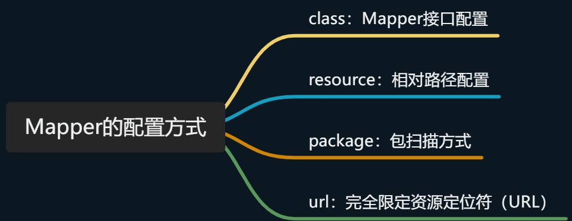

**XMLConfigBuilder**

```java
  mapperElement(root.evalNode("mappers"));
```

* 我们可以看到 mapperElement 方法来解析 Mappers 节点信息，其中就有上门的四种方法，package，url，class，resource 来解析我们的 Mappers 节点信息。

```java
/**
   * 解析mappers节点，例如：
   * <mappers>
   *    <mapper resource="com/github/yeecode/mybatisDemo/UserDao.xml"/>
   *    <package name="com.github.yeecode.mybatisDemo" />
   * </mappers>
   * @param parent mappers节点
   * @throws Exception
   */
  private void mapperElement(XNode parent) throws Exception {

    if (parent != null) {
      for (XNode child : parent.getChildren()) {
          
        // 处理mappers的子节点，即mapper节点或者package节点
        if ("package".equals(child.getName())) { // package节点
          // 取出包的路径,其实就是包路径com.shu.mapper
          String mapperPackage = child.getStringAttribute("name");
          // 全部加入Mappers中
          configuration.addMappers(mapperPackage);
            
        } else {
            
          // resource、url、class这三个属性只有一个生效
          String resource = child.getStringAttribute("resource");
          String url = child.getStringAttribute("url");
          String mapperClass = child.getStringAttribute("class");
            // resource的解析方式
          if (resource != null && url == null && mapperClass == null) {
            ErrorContext.instance().resource(resource);
            // 获取文件的输入流
            InputStream inputStream = Resources.getResourceAsStream(resource);
            // 使用XMLMapperBuilder解析Mapper文件
            XMLMapperBuilder mapperParser = new XMLMapperBuilder(inputStream, configuration, resource, configuration.getSqlFragments());
            mapperParser.parse();
          } 
           // url 解析方式   
          else if (resource == null && url != null && mapperClass == null) {
            ErrorContext.instance().resource(url);
            // 从网络获得输入流
            InputStream inputStream = Resources.getUrlAsStream(url);
            // 使用XMLMapperBuilder解析Mapper文件
            XMLMapperBuilder mapperParser = new XMLMapperBuilder(inputStream, configuration, url, configuration.getSqlFragments());
            mapperParser.parse();
          } 
           // class 解析方式   
          else if (resource == null && url == null && mapperClass != null) {
            // 配置的不是Mapper文件，而是Mapper接口
            Class<?> mapperInterface = Resources.classForName(mapperClass);
            configuration.addMapper(mapperInterface);
          } 
          // 都没有的话，扔出异常
          else {
            throw new BuilderException("A mapper element may only specify a url, resource or class, but not more than one.");
          }
        }
      }
    }
  }
```

#### 2.3.2.1 存储位置（MapperRegistry ）

**Configuration**

```java
// 全部加入Mappers中
configuration.addMappers(mapperPackage);

 public void addMappers(String packageName) {
    mapperRegistry.addMappers(packageName);
  }

```

* 我们可以看到调用了 mapperRegistry#addMappers（）方法，我们来看看 mapperRegistry 这个类

**MapperRegistry&#x20;**

```java

public class MapperRegistry {
  private final Configuration config;
    // 知道的Mapper 接口信息存储在knownMappers中
  private final Map<Class<?>, MapperProxyFactory<?>> knownMappers = new HashMap<>();

    
  public MapperRegistry(Configuration config) {
    this.config = config;
  }

// 添加方法，主要是通过ResolverUtil扫描报下的所有mapper接口信息
public void addMappers(String packageName, Class<?> superType) {
    // `ResolverUtil`是一个能够筛选出某个路径下满足指定条件的所有类的工具类
    ResolverUtil<Class<?>> resolverUtil = new ResolverUtil<>();
    // 筛选出某个包下Object的子类，其实就是包下所有类
    resolverUtil.find(new ResolverUtil.IsA(superType), packageName);
    // 拿到符合条件的类集合
    Set<Class<? extends Class<?>>> mapperSet = resolverUtil.getClasses();
    for (Class<?> mapperClass : mapperSet) {
      addMapper(mapperClass);
    }
  }


 // 获取方法 主要动态代理的时候使用
    public <T> T getMapper(Class<T> type, SqlSession sqlSession) {
    final MapperProxyFactory<T> mapperProxyFactory = (MapperProxyFactory<T>) knownMappers.get(type);
    if (mapperProxyFactory == null) {
      throw new BindingException("Type " + type + " is not known to the MapperRegistry.");
    }
    try {
      return mapperProxyFactory.newInstance(sqlSession);
    } catch (Exception e) {
      throw new BindingException("Error getting mapper instance. Cause: " + e, e);
    }
  }

}
```

* 调用 ResolverUtil#find 方法找到 Mapper 接口对象

**ResolverUtil**

```java
 /** The set of matches being accumulated. */
  private Set<Class<? extends T>> matches = new HashSet<>();


 /**
   * 筛选出指定路径下符合一定条件的类
   * @param test 测试条件
   * @param packageName 路径
   * @return ResolverUtil本身
   */
  public ResolverUtil<T> find(Test test, String packageName) {
    // 获取起始包路径
    String path = getPackagePath(packageName);
    try {
      // 找出包中的各个文件，其实就是通过 VFS（虚拟文件系统）获取指定包下的所有文件的Class，也就是所有的Mapper接口，
      List<String> children = VFS.getInstance().list(path);
      for (String child : children) {
        // 对类文件进行测试
        if (child.endsWith(".class")) { // 必须是类文件
          // 测试是否满足测试条件。如果满足，则将该类文件记录下来
          addIfMatching(test, child);
        }
      }
    } catch (IOException ioe) {
      log.error("Could not read package: " + packageName, ioe);
    }
    return this;
  }


  /**
   * 判断一个类文件是否满足条件。如果满足则记录下来
   * @param test 测试条件
   * @param fqn 类文件全名
   */
  @SuppressWarnings("unchecked")
  protected void addIfMatching(Test test, String fqn) {
    try {
      // 转化为外部名称
      String externalName = fqn.substring(0, fqn.indexOf('.')).replace('/', '.');
      // 类加载器
      ClassLoader loader = getClassLoader();
      if (log.isDebugEnabled()) {
        log.debug("Checking to see if class " + externalName + " matches criteria [" + test + "]");
      }
      // 加载类文件
      Class<?> type = loader.loadClass(externalName);
      if (test.matches(type)) { // 执行测试
        // 测试通过则记录到matches属性中
        matches.add((Class<T>) type);
      }
    } catch (Throwable t) {
      log.warn("Could not examine class '" + fqn + "'" + " due to a " +
          t.getClass().getName() + " with message: " + t.getMessage());
    }
  }
}
```

* 我们可以看到通过我们配置的接口的信息：比如 com.shu.mapper，的字符串包信息，通过 VFS 以及类加载器拿到对应的 Mapper 接口信息，添加到 matches 之中，并返回给调用者

#### 2.3.2.2 具体解析（**XMLMapperBuilder**）

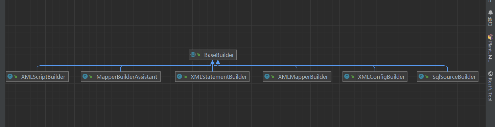

* **XMLConfigBuilder：**&#x89E3;析 mybatis 配置文件

* **XMLMapperBuilder：**&#x89E3;析 mybatis 映射文件&#x20;

* **MapperBuilderAssistant**：XMLMapperBuilder 的帮助类&#x20;

* **XMLStatementBuilder：**&#x89E3;析映射文件中的 sql 语句标签 insert|update|delete|select&#x20;

* **XMLScriptBuilder：** SQL 语句在 XML 文件中，处理动态 SQL 语句标签&#x20;

* **SQLSourceBuilder**：在 RawSqlSource 使用

> XMLMapperBuilder 的构造器

```java
 public XMLMapperBuilder(InputStream inputStream, Configuration configuration, String resource, Map<String, XNode> sqlFragments, String namespace) {
    this(inputStream, configuration, resource, sqlFragments);
     // 设置当前命名空间，不可修改
    this.builderAssistant.setCurrentNamespace(namespace);
  }

// 调用重载方法
private XMLMapperBuilder(XPathParser parser, Configuration configuration, String resource, Map<String, XNode> sqlFragments) {
    super(configuration);
    this.builderAssistant = new MapperBuilderAssistant(configuration, resource);
    this.parser = parser;
    this.sqlFragments = sqlFragments;
    this.resource = resource;
  }

/**
   * 解析Mapper文件
   */
  public void parse() {
    // 该节点是否被解析过
    if (!configuration.isResourceLoaded(resource)) {
      // 处理mapper节点
      configurationElement(parser.evalNode("/mapper"));
      // 加入到已经解析的列表，防止重复解析
      configuration.addLoadedResource(resource);
      // 将mapper注册给Configuration
      bindMapperForNamespace();
    }

    // 下面分别用来处理失败的<resultMap>、<cache-ref>、SQL语句
    parsePendingResultMaps();
    parsePendingCacheRefs();
    parsePendingStatements();
  }
```

* 接下来与前面一样解析 Xml 文件中的节点信息，填充给 configuration，方便系统后面使用

```java
  /**
   * 解析Mapper文件的下层节点
   * @param context Mapper文件的根节点
   */
  private void configurationElement(XNode context) {
    try {
      // 读取当前Mapper文件的命名空间mapper.EmployeeMapper
      String namespace = context.getStringAttribute("namespace");
      if (namespace == null || namespace.equals("")) {
        throw new BuilderException("Mapper's namespace cannot be empty");
      }
      // 绑定当前命名空间
      builderAssistant.setCurrentNamespace(namespace);
      // mapper文件中其他配置节点的解析
      // 解析cache-ref节点
      cacheRefElement(context.evalNode("cache-ref"));
      // 解析cache节点
      cacheElement(context.evalNode("cache"));
      // 解析parameterMap节点
      parameterMapElement(context.evalNodes("/mapper/parameterMap"));
      // 解析resultMap节点
      resultMapElements(context.evalNodes("/mapper/resultMap"));
      // 解析sql
      sqlElement(context.evalNodes("/mapper/sql"));
      // 处理各个数据库操作语句
      buildStatementFromContext(context.evalNodes("select|insert|update|delete"));
    } catch (Exception e) {
      throw new BuilderException("Error parsing Mapper XML. The XML location is '" + resource + "'. Cause: " + e, e);
    }
  }
```

* 接下里我们依次来看看如何解析节点信息，关于缓存的那一块，后面会文章详细介绍 Cache


* 我们来看几个重点：缓存（后面详细接受），参数处理，结果映射，Sql 语句

##### 2.3.2.2.2  解析 cache-ref 节点

* 参考官网：[mybatis – MyBatis 3 | XML 映射器](https://mybatis.org/mybatis-3/zh/sqlmap-xml.html#cache-ref)&#x20;

* 对某一命名空间的语句，只会使用该命名空间的缓存进行缓存或刷新。 但你可能会想要在多个命名空间中共享相同的缓存配置和实例。要实现这种需求，你可以使用 cache-ref 元素来引用另一个缓存。

```python
<cache-ref namespace="com.someone.application.data.SomeMapper"/>
```

**XMLMapperBuilder**

```java
  private void cacheRefElement(XNode context) {
    if (context != null) {
      // 传入当前命令空间，配置的namespace属性：eg: com.shu.UserMapper
      configuration.addCacheRef(builderAssistant.getCurrentNamespace(), context.getStringAttribute("namespace"));
      // 缓存引用解析器
      CacheRefResolver cacheRefResolver = new CacheRefResolver(builderAssistant, context.getStringAttribute("namespace"));
      try {
          //解析缓存引用
        cacheRefResolver.resolveCacheRef();
      } catch (IncompleteElementException e) {
          
        configuration.addIncompleteCacheRef(cacheRefResolver);
      }
    }
  }
```

* 创建缓存解析器，来解析缓存引用，实际上调用了 MapperBuilderAssistant#useCacheRef（）方法来达到缓存的共享

**MapperBuilderAssistant**

```java
/**
   * 使用其他namespace的缓存
   * @param namespace 其他的namespace
   * @return  其他namespace的缓存
   */
  public Cache useCacheRef(String namespace) {
    if (namespace == null) {
      throw new BuilderException("cache-ref element requires a namespace attribute.");
    }
    try {
      unresolvedCacheRef = true;
      // 获取其他namespace的缓存
      Cache cache = configuration.getCache(namespace);
      if (cache == null) {
        throw new IncompleteElementException("No cache for namespace '" + namespace + "' could be found.");
      }
      // 修改当前缓存为其他namespace的缓存，从而实现缓存共享
      currentCache = cache;
      unresolvedCacheRef = false;
      return cache;
    } catch (IllegalArgumentException e) {
      throw new IncompleteElementException("No cache for namespace '" + namespace + "' could be found.", e);
    }
  }
```

* 具体是实现细节我们后面在一级缓存，二级缓存中文字会详细介绍

##### 2.3.2.2.1 解析 Cache 节点

* 官网：[mybatis – MyBatis 3 | XML 映射器](https://mybatis.org/mybatis-3/zh/sqlmap-xml.html#%E7%BC%93%E5%AD%98)&#x20;

* MyBatis 内置了一个强大的事务性查询缓存机制，它可以非常方便地配置和定制。 为了使它更加强大而且易于配置，我们对 MyBatis 3 中的缓存实现进行了许多改进。 默认情况下，只启用了本地的会话缓存，它仅仅对一个会话中的数据进行缓存。 要启用全局的二级缓存，只需要在你的 SQL 映射文件中添加一行：

```java
<cache/>
```

这个简单语句的效果如下：

* 映射语句文件中的所有 select 语句的结果将会被缓存。

* 映射语句文件中的所有 insert、update 和 delete 语句会刷新缓存。

* 缓存会使用最近最少使用算法（LRU， Least Recently Used）算法来清除不需要的缓存。

* 缓存不会定时进行刷新（也就是说，没有刷新间隔）。

* 缓存会保存列表或对象（无论查询方法返回哪种）的 1024 个引用。

* 缓存会被视为读/写缓存，这意味着获取到的对象并不是共享的，可以安全地被调用者修改，而不干扰其他调用者或线程所做的潜在修改。

也可以使用第三方缓存

```java
<cache type="org.mybatis.caches.redis.RedisCache"/>
```

其中有一些属性可以选择

```java
<cache eviction="LRU"  flushInterval="60000"  size="512" readOnly="true"/>
```

1. 根据数据的历史访问记录来进行淘汰数据，其核心思想是“如果数据最近被访问过，那么将来被访问的几率也更高”

2. 缓存的容量为 512 个对象引用

3. 缓存每隔 60 秒刷新一次

4. 缓存返回的对象是写安全的，即在外部修改对象不会影响到缓存内部存储对象

eviction 可用的清除策略有：

* LRU – 最近最少使用：移除最长时间不被使用的对象。

* FIFO – 先进先出：按对象进入缓存的顺序来移除它们。

* SOFT – 软引用：基于垃圾回收器状态和软引用规则移除对象。

* WEAK – 弱引用：更积极地基于垃圾收集器状态和弱引用规则移除对象。

* 默认的清除策略是 LRU。&#x20;

* flushInterval（刷新间隔）属性可以被设置为任意的正整数，设置的值应该是一个以毫秒为单位的合理时间量。 默认情况是不设置，也就是没有刷新间隔，缓存仅仅会在调用语句时刷新。

* &#x20;size（引用数目）属性可以被设置为任意正整数，要注意欲缓存对象的大小和运行环境中可用的内存资源。默认值是 1024。&#x20;

* readOnly（只读）属性可以被设置为 true 或 false。只读的缓存会给所有调用者返回缓存对象的相同实例。 因此这些对象不能被修改。这就提供了可观的性能提升。而可读写的缓存会（通过序列化）返回缓存对象的拷贝。 速度上会慢一些，但是更安全，因此默认值是 false。

&#x20;**XMLMapperBuilder**

```java
 // <mapper namespace="com.example.demo.UserDao">
  //    <cache
  //            eviction="FIFO"
  //            flushInterval="60000"
  //            size="512"
  //            readOnly="true"/>
  //    <select id="selectUser" resultType="com.example.demo.UserBean">
  //    select * from `user` where id = #{id}
  //  </select>
  //</mapper>

  // 这里处理其中的<cache>节点
  private void cacheElement(XNode context) {
    if (context != null) {
      //  获取type属性，如果type没有指定就用默认的PERPETUAL(早已经注册过的别名的PerpetualCache)
      String type = context.getStringAttribute("type", "PERPETUAL");
      根据type从早已经注册的别名中获取对应的Class,PERPETUAL对应的Class是PerpetualCache.class
        // 如果我们写了type属性，如type="org.mybatis.caches.redis.RedisCache"，这里将会得到RedisCache.class
      Class<? extends Cache> typeClass = typeAliasRegistry.resolveAlias(type);
      //  //获取淘汰方式，默认为LRU(早已经注册过的别名的LruCache)，最近最少使用到的先淘汰
      String eviction = context.getStringAttribute("eviction", "LRU");
      Class<? extends Cache> evictionClass = typeAliasRegistry.resolveAlias(eviction);
      // 解析刷新间隔
      Long flushInterval = context.getLongAttribute("flushInterval");
      // 大小
      Integer size = context.getIntAttribute("size");
      // 是否只读
      boolean readWrite = !context.getBooleanAttribute("readOnly", false);
    
      boolean blocking = context.getBooleanAttribute("blocking", false);
       // 获取子节点配置
        Properties props = context.getChildrenAsProperties();
        // 构建缓存对象
        builderAssistant.useNewCache(typeClass, evictionClass, flushInterval, size, readWrite, blocking, props);
    }
  }
```

* 从上面我们需要在配置文件中读取常见缓存的必要条件，从而创建一个新的缓存对象，我们首先来看看他是如何在 typeAliasRegistry 中获取在注册的对象？

```java
 registerAlias("map", Map.class);
// 通过注册的别名来获取在typeAliasRegistry注册的对象
public <T> Class<T> resolveAlias(String string) {
    try {
      if (string == null) {
        return null;
      }
      // issue #748
      String key = string.toLowerCase(Locale.ENGLISH);
      Class<T> value;
       // 是否注册过 
      if (typeAliases.containsKey(key)) {
        value = (Class<T>) typeAliases.get(key);
      }
       // 没有的话交给Resources来查找
      else {
        value = (Class<T>) Resources.classForName(string);
      }
      return value;
    } catch (ClassNotFoundException e) {
      throw new TypeException("Could not resolve type alias '" + string + "'.  Cause: " + e, e);
    }
  }
```

* 通过 typeAliasRegistry#resolveAlias（）方法 ，我们拿到了构建先缓存的必要条件

**MapperBuilderAssistant**

```java
/**
   * 创建一个新的缓存
   * @param typeClass 缓存的实现类
   * @param evictionClass 缓存的清理类，即使用哪种包装类来清理缓存
   * @param flushInterval 缓存清理时间间隔
   * @param size 缓存大小
   * @param readWrite 缓存是否支持读写
   * @param blocking 缓存是否支持阻塞
   * @param props 缓存配置属性
   * @return 缓存
   */
  public Cache useNewCache(Class<? extends Cache> typeClass,
      Class<? extends Cache> evictionClass,
      Long flushInterval,
      Integer size,
      boolean readWrite,
      boolean blocking,
      Properties props) {
      // 当前命令空间
    Cache cache = new CacheBuilder(currentNamespace)
        .implementation(valueOrDefault(typeClass, PerpetualCache.class))
        .addDecorator(valueOrDefault(evictionClass, LruCache.class))
        .clearInterval(flushInterval)
        .size(size)
        .readWrite(readWrite)
        .blocking(blocking)
        .properties(props)
        .build();
    configuration.addCache(cache);
    currentCache = cache;
    return cache;
  }
```

* 上面使用了建造模式构建 Cache 实例？

**CacheBuilder**

```java
public class CacheBuilder {
  // Cache的编号
  private final String id;
  // Cache的实现类
  private Class<? extends Cache> implementation;
  // Cache的装饰器列表
  private final List<Class<? extends Cache>> decorators;
  // Cache的大小
  private Integer size;
  // Cache的清理间隔
  private Long clearInterval;
  // Cache是否可读写
  private boolean readWrite;
  // Cache的配置信息
  private Properties properties;
  // Cache是否阻塞
  private boolean blocking;


/**
   * 组建缓存
   * @return 缓存对象
   */
  public Cache build() {
    // 设置缓存的默认实现、默认装饰器（仅设置，并未装配）PerpetualCache
    setDefaultImplementations();
    // 创建默认的缓存
    Cache cache = newBaseCacheInstance(implementation, id);
    // 设置缓存的属性
    setCacheProperties(cache);
    if (PerpetualCache.class.equals(cache.getClass())) { // 缓存实现是PerpetualCache，即不是用户自定义的缓存实现
      // 为缓存逐级嵌套自定义的装饰器
      for (Class<? extends Cache> decorator : decorators) {
        // 生成装饰器实例，并装配。入参依次是装饰器类、被装饰的缓存
        cache = newCacheDecoratorInstance(decorator, cache);
        // 为装饰器设置属性
        setCacheProperties(cache);
      }
      // 为缓存增加标准的装饰器
      cache = setStandardDecorators(cache);
    } else if (!LoggingCache.class.isAssignableFrom(cache.getClass())) {
      // 增加日志装饰器
      cache = new LoggingCache(cache);
    }
    // 返回被包装好的缓存
    return cache;
  }


private void setDefaultImplementations() {
    if (this.implementation == null) {
        //设置默认缓存类型为PerpetualCache
        this.implementation = PerpetualCache.class;
        if (this.decorators.isEmpty()) {
            this.decorators.add(LruCache.class);
        }
    }
}


private Cache newBaseCacheInstance(Class<? extends Cache> cacheClass, String id) {
    //获取构造器
    Constructor cacheConstructor = this.getBaseCacheConstructor(cacheClass);
    try {
        //通过构造器实例化Cache
        return (Cache)cacheConstructor.newInstance(id);
    } catch (Exception var5) {
        throw new CacheException("Could not instantiate cache implementation (" + cacheClass + "). Cause: " + var5, var5);
    }
}

}

```

* 如上就创建好了一个 Cache 的实例，然后把它添加到 Configuration 中，并且设置到 currentCache 属性中，这个属性后面还要使用，也就是 Cache 实例后面还要使用，我们后面再看。

##### 2.3.2.2.3 解析 ParameterMap 节点

* ParameterMap和resultMap类似，表示将查询结果集中列值的类型一一映射到java对象属性的类型上，在开发过程中不推荐这种方式。一般使用parameterType直接将查询结果列值类型自动对应到java对象属性类型上，

* 不再配置映射关系一一对应，例如上述代码中下划线部分表示将查询结果类型自动对应到hdu.terence.bean.Message的Bean对象属性类型。（这里我们就 不解析了，我们重点来看看ResultMap）


##### 2.2.2.2.4 解析 ResultMap节点

* 参考官网：[mybatis – MyBatis 3 | XML 映射器](https://mybatis.org/mybatis-3/zh/sqlmap-xml.html#%E7%BB%93%E6%9E%9C%E6%98%A0%E5%B0%84)

* &#x20;resultMap 元素是 MyBatis 中最重要最强大的元素。它可以让你从 90% 的 JDBC ResultSets 数据提取代码中解放出来，并在一些情形下允许你进行一些 JDBC 不支持的操作。实际上，在为一些比如连接的复杂语句编写映射代码的时候，一份 resultMap 能够代替实现同等功能的数千行代码。ResultMap 的设计思想是，对简单的语句做到零配置，对于复杂一点的语句，只需要描述语句之间的关系就行了。

```java
   <resultMap type="com.sundancersystem.model.SysRole" id="SysRoleMap">
        <id column="ROLE_ID" property="roleId"/>
        <result property="roleId" column="ROLE_ID" jdbcType="TINYINT"/>
        <result property="roleName" column="ROLE_NAME" jdbcType="VARCHAR"/>
        <result property="roleValue" column="ROLE_VALUE" jdbcType="VARCHAR"/>
        <result property="roleCreatTime" column="ROLE_CREAT_TIME" jdbcType="DATE"/>
        <result property="roleDelete" column="ROLE_DELETE" jdbcType="TINYINT"/>
    </resultMap>
```

* resultMap 主要用于映射结果。通过 resultMap 和自动映射，可以让 MyBatis 帮助我们完成 ResultSet → Object 的映射。

**XMLMapperBuilder**

```java
  private void resultMapElements(List<XNode> list) throws Exception {
      // 遍历节点信息
    for (XNode resultMapNode : list) {
      try {
          // 解析resultMap元素
        resultMapElement(resultMapNode);
      } catch (IncompleteElementException e) {
        // ignore, it will be retried
      }
    }
  

private ResultMap resultMapElement(XNode resultMapNode) throws Exception {
    return resultMapElement(resultMapNode, Collections.emptyList(), null);
  }

      
  private ResultMap resultMapElement(XNode resultMapNode, List<ResultMapping> additionalResultMappings, Class<?> enclosingType) throws Exception {
    ErrorContext.instance().activity("processing " + resultMapNode.getValueBasedIdentifier());
      // 获取type属性
    String type = resultMapNode.getStringAttribute("type",
        resultMapNode.getStringAttribute("ofType",
            resultMapNode.getStringAttribute("resultType",
                resultMapNode.getStringAttribute("javaType"))));
      // 找到获取 type 属性对应的类型，就是我们的实体类对象
    Class<?> typeClass = resolveClass(type);

    if (typeClass == null) {
      typeClass = inheritEnclosingType(resultMapNode, enclosingType);
    }
    Discriminator discriminator = null;
      // 创建ResultMapping集合，对应resultMap子节点的id和result节点
    List<ResultMapping> resultMappings = new ArrayList<>();
    resultMappings.addAll(additionalResultMappings);
    List<XNode> resultChildren = resultMapNode.getChildren();
        // 获取并遍历 <resultMap> 的子节点列表
    for (XNode resultChild : resultChildren) {
        // 用于在实例化类时，注入结果到构造方法中
      if ("constructor".equals(resultChild.getName())) {
        processConstructorElement(resultChild, typeClass, resultMappings);
      } 
       // 使用结果值来决定使用哪个 resultMap
      else if ("discriminator".equals(resultChild.getName())) {
        discriminator = processDiscriminatorElement(resultChild, typeClass, resultMappings);
      } else {
        List<ResultFlag> flags = new ArrayList<>();
         if ("id".equals(resultChild.getName())) {
                // 添加 ID 到 flags 集合中
                flags.add(ResultFlag.ID);
            }
            // 解析 id 和 result 节点，将id或result节点生成相应的 ResultMapping，将ResultMapping添加到resultMappings集合中
            resultMappings.add(buildResultMappingFromContext(resultChild, typeClass, flags));
      }
    }
      // 获取id
    String id = resultMapNode.getStringAttribute("id",
            resultMapNode.getValueBasedIdentifier());
    String extend = resultMapNode.getStringAttribute("extends");
    Boolean autoMapping = resultMapNode.getBooleanAttribute("autoMapping");
      // 创建ResultMapResolver对象
    ResultMapResolver resultMapResolver = new ResultMapResolver(builderAssistant, id, typeClass, extend, discriminator, resultMappings, autoMapping);
    try {
        // 根据前面获取到的信息构建 ResultMap 对象
      return resultMapResolver.resolve();
    } catch (IncompleteElementException  e) {
      configuration.addIncompleteResultMap(resultMapResolver);
      throw e;
    }
  }

```

* 我们来看看XMLMapperBuilder#buildResultMappingFromContext（）解析过程

**XMLMapperBuilder**

```java
private ResultMapping buildResultMappingFromContext(XNode context, Class<?> resultType, List<ResultFlag> flags) throws Exception {
    String property;
    // 根据节点类型获取 name 或 property 属性
    if (flags.contains(ResultFlag.CONSTRUCTOR)) {
        // 构造方法形参的名字
        property = context.getStringAttribute("name");
    } else {
        // 映射到列结果的字段或属性
        property = context.getStringAttribute("property");
    }

    // 获取其他各种属性
    // 数据库中的列名
    String column = context.getStringAttribute("column");
    // 一个 Java 类的完全限定名，或一个类型别名（关于内置的类型别名，可以参考上面的表格）
    String javaType = context.getStringAttribute("javaType");
    // JDBC 类型，所支持的 JDBC 类型参见这个表格之前的“支持的 JDBC 类型”。
    String jdbcType = context.getStringAttribute("jdbcType");
    // 用于加载复杂类型属性的映射语句的 ID，它会从 column 属性指定的列中检索数据，作为参数传递给目标 select 语句。
    String nestedSelect = context.getStringAttribute("select");
    
    /*
     * 解析 resultMap 属性，该属性出现在 <association> 和 <collection> 节点中。
     * 若这两个节点不包含 resultMap 属性，则调用 processNestedResultMappings 方法,递归调用resultMapElement解析<association> 和 <collection>的嵌套节点，生成resultMap，并返回resultMap.getId();
     * 如果包含resultMap属性，则直接获取其属性值，这个属性值对应一个resultMap节点
     */
    String nestedResultMap = context.getStringAttribute("resultMap", processNestedResultMappings(context, Collections.<ResultMapping>emptyList()));
    // 默认情况下，在至少一个被映射到属性的列不为空时，子对象才会被创建。
    String notNullColumn = context.getStringAttribute("notNullColumn");
    // 当连接多个表时，你可能会不得不使用列别名来避免在 ResultSet 中产生重复的列名。
    String columnPrefix = context.getStringAttribute("columnPrefix");
    // 我们在前面讨论过默认的类型处理器。
    String typeHandler = context.getStringAttribute("typeHandler");
    // 指定用于加载复杂类型的结果集名字。
    String resultSet = context.getStringAttribute("resultSet");
    // 指定外键对应的列名，指定的列将与父类型中 column 的给出的列进行匹配。
    String foreignColumn = context.getStringAttribute("foreignColumn");
    // 可选的。有效值为 lazy 和 eager。 指定属性后，将在映射中忽略全局配置参数 lazyLoadingEnabled，使用属性的值。
    boolean lazy = "lazy".equals(context.getStringAttribute("fetchType", configuration.isLazyLoadingEnabled() ? "lazy" : "eager"));

    Class<?> javaTypeClass = resolveClass(javaType);
    Class<? extends TypeHandler<?>> typeHandlerClass = (Class<? extends TypeHandler<?>>) resolveClass(typeHandler);
    JdbcType jdbcTypeEnum = resolveJdbcType(jdbcType);

    // 构建 ResultMapping 对象
    return builderAssistant.buildResultMapping(resultType, property, column, javaTypeClass, jdbcTypeEnum, nestedSelect,
        nestedResultMap, notNullColumn, columnPrefix, typeHandlerClass, flags, resultSet, foreignColumn, lazy);
}
```

* 在上面的解析中我们需要重点关注一下复杂结构的嵌套过程，processNestedResultMappings（）方法

**XMLMapperBuilder**

```java
private String processNestedResultMappings(XNode context, List<ResultMapping> resultMappings) throws Exception {
    if (("association".equals(context.getName()) || "collection".equals(context.getName()) || "case".equals(context.getName())) && context.getStringAttribute("select") == null) {
        ResultMap resultMap = this.resultMapElement(context, resultMappings);
        return resultMap.getId();
    } else {
        return null;
    }
}
```

* 只要此节点是（association或者collection）并且select为空,就说明是嵌套查询，那如果select不为空呢？那说明是延迟加载此节点的信息，并不属于嵌套查询，但是有可能有多个association或者collection，有一个设置为延迟加载也就是select属性不为空，有一个没有设置延迟加载，那说明resultMap中有嵌套查询的ResultMapping，也有延迟加载的ResultMapping，这个在后面结果集映射时会用到。

**MapperBuilderAssistant**

```java
 public ResultMapping buildResultMapping(
      Class<?> resultType, // 当前隐射实例对象
      String property, // 实例字段名称
      String column, // 数据库字段名称
      Class<?> javaType, // Java 类的全限定名
      JdbcType jdbcType, // JDBC 类型，所支持的 JDBC 类型参见这个表格之后的“支持的 JDBC 类型”。
      String nestedSelect, // 复杂查询嵌套的选择
      String nestedResultMap, // 复杂查询嵌套的结果隐射
      String notNullColumn, // 非空列
      String columnPrefix,
      Class<? extends TypeHandler<?>> typeHandler, // 类型处理器，不同的类型对应着不同的类型处理器
      List<ResultFlag> flags, // 结果标识
      String resultSet, // 指定用于加载复杂类型的结果集名字。
      String foreignColumn, // 指定外键对应的列名，指定的列将与父类型中 column 的给出的列进行匹配。
      boolean lazy) { // 是否懒加载
     // 解析Java类型
    Class<?> javaTypeClass = resolveResultJavaType(resultType, property, javaType);
     // 类型处理器
    TypeHandler<?> typeHandlerInstance = resolveTypeHandler(javaTypeClass, typeHandler);
    List<ResultMapping> composites;
    if ((nestedSelect == null || nestedSelect.isEmpty()) && (foreignColumn == null || foreignColumn.isEmpty())) {
      composites = Collections.emptyList();
    } else {
      composites = parseCompositeColumnName(column);
    }
     //  通过建造模式构建 ResultMapping
    return new ResultMapping.Builder(configuration, property, column, javaTypeClass)
        .jdbcType(jdbcType)
        .nestedQueryId(applyCurrentNamespace(nestedSelect, true))
        .nestedResultMapId(applyCurrentNamespace(nestedResultMap, true))
        .resultSet(resultSet)
        .typeHandler(typeHandlerInstance)
        .flags(flags == null ? new ArrayList<>() : flags)
        .composites(composites)
        .notNullColumns(parseMultipleColumnNames(notNullColumn))
        .columnPrefix(columnPrefix)
        .foreignColumn(foreignColumn)
        .lazy(lazy)
        .build();
  }

    //略
}
```

* 通过buildResultMappingFromContext方法的解析我们已经拿到构建ResultMapping的必要条件，我们来看看resolveResultJavaType（）方法与resolveTypeHandler方法

```java
private Class<?> resolveResultJavaType(Class<?> resultType, String property, Class<?> javaType) {
    if (javaType == null && property != null) {
      try {
        MetaClass metaResultType = MetaClass.forClass(resultType, configuration.getReflectorFactory());
        javaType = metaResultType.getSetterType(property);
      } catch (Exception e) {
        //ignore, following null check statement will deal with the situation
      }
    }
    if (javaType == null) {
      javaType = Object.class;
    }
    return javaType;
  }
```

* 这个方法其实也很简单就是获取我们创建的实体类的字段的类型，如果没有的话，就返回一个Object的类型，为下面常见类型处理器提供构造参数，那我们首先来看看TypeHandler接口，采用模板模式来实现不同的类型不同的处理接口。后面会具体讲解

```java
public interface TypeHandler<T> {

    /**
     * 设置参数
     * @param ps
     * @param i
     * @param parameter
     * @param jdbcType
     * @throws SQLException
     */
    void setParameter(PreparedStatement ps, int i, T parameter, JdbcType jdbcType) throws SQLException;

    /**
     * 获取结果
     * @param rs
     * @param columnName
     * @return
     * @throws SQLException
     */
    T getResult(ResultSet rs, String columnName) throws SQLException;

    T getResult(ResultSet rs, int columnIndex) throws SQLException;

    T getResult(CallableStatement cs, int columnIndex) throws SQLException;
}

```

* 在接口中它只是定义了他的方法，而实现在他的基类中 **BaseTypeHandler**

```java
public abstract class BaseTypeHandler<T> extends TypeReference<T> implements TypeHandler<T>{

    /**
     * 设置参数
     * @param ps
     * @param i
     * @param parameter
     * @param jdbcType SQL 参数类型
     * @throws SQLException
     */
    @Override
    public void setParameter(PreparedStatement ps, int i, T parameter, JdbcType jdbcType) throws SQLException {
        if (parameter == null) {
            if (jdbcType == null) {
                throw new TypeException("JDBC requires that the JdbcType must be specified for all nullable parameters.");
            }
            try {
                ps.setNull(i, jdbcType.TYPE_CODE);
            } catch (SQLException e) {
                throw new TypeException("Error setting null for parameter #" + i + " with JdbcType " + jdbcType + " . "
                        + "Try setting a different JdbcType for this parameter or a different jdbcTypeForNull configuration property. "
                        + "Cause: " + e, e);
            }
        } else {
            try {
                setNonNullParameter(ps, i, parameter, jdbcType);
            } catch (Exception e) {
                throw new TypeException("Error setting non null for parameter #" + i + " with JdbcType " + jdbcType + " . "
                        + "Try setting a different JdbcType for this parameter or a different configuration property. "
                        + "Cause: " + e, e);
            }
        }
    }

    /**
     * 从结果集中读出一个结果
     * @param rs 结果集
     * @param columnName 要读取的结果的列名称
     * @return 结果值
     * @throws SQLException
     */
    @Override
    public T getResult(ResultSet rs, String columnName) throws SQLException {
        try {
            return getNullableResult(rs, columnName);
        } catch (Exception e) {
            throw new ResultMapException("Error attempting to get column '" + columnName + "' from result set.  Cause: " + e, e);
        }
    }

    @Override
    public T getResult(ResultSet rs, int columnIndex) throws SQLException {
        try {
            return getNullableResult(rs, columnIndex);
        } catch (Exception e) {
            throw new ResultMapException("Error attempting to get column #" + columnIndex + " from result set.  Cause: " + e, e);
        }
    }

    @Override
    public T getResult(CallableStatement cs, int columnIndex) throws SQLException {
        try {
            return getNullableResult(cs, columnIndex);
        } catch (Exception e) {
            throw new ResultMapException("Error attempting to get column #" + columnIndex + " from callable statement.  Cause: " + e, e);
        }
    }

    /**
     * 向PreparedStatement对象中的指定变量位置写入一个不为 null的值；
     * @param ps
     * @param i
     * @param parameter
     * @param jdbcType
     * @throws SQLException
     */
    public abstract void setNonNullParameter(PreparedStatement ps, int i, T parameter, JdbcType jdbcType) throws SQLException;


    /**
     * 从 ResultSet 中按照字段名读出一个可能为null的数据；
     * @param rs
     * @param columnName
     * @return
     * @throws SQLException
     */
    public abstract T getNullableResult(ResultSet rs, String columnName) throws SQLException;

    /**
     * 从 ResultSet 中按照字段编号读出一个可能为null的数据；
     * @param rs
     * @param columnIndex
     * @return
     * @throws SQLException
     */
    public abstract T getNullableResult(ResultSet rs, int columnIndex) throws SQLException;

    /**
     * 从 CallableStatement中按照字段编号读出一个可能为 null的数据。
     * @param cs
     * @param columnIndex
     * @return
     * @throws SQLException
     */
    public abstract T getNullableResult(CallableStatement cs, int columnIndex) throws SQLException;
}
```

* 这些类型处理器在对配置文件解析的时候已经注册到了TypeHandlerRegistry（）中，我们只需要通过不同的类型在TypeHandlerRegistry中拿到对应的类型处理器就可以了 **BaseBuilder**

```java
protected TypeHandler<?> resolveTypeHandler(Class<?> javaType, Class<? extends TypeHandler<?>> typeHandlerType) {
    if (typeHandlerType == null) {
      return null;
    }
    // javaType ignored for injected handlers see issue #746 for full detail
    // 注意，这一次查询的地方变了，是去typeHandlerRegistry，里面存的是  key为typeHandler.getClass()  value为typeHandler
    TypeHandler<?> handler = typeHandlerRegistry.getMappingTypeHandler(typeHandlerType);
    if (handler == null) {
      // not in registry, create a new one
      handler = typeHandlerRegistry.getInstance(javaType, typeHandlerType);
    }
    return handler;
  }
```

* 构建ResultMap对象，调用Builder（）方法

**MapperBuilderAssistant**

```java
return new ResultMapping.Builder(configuration, property, column, javaTypeClass)
        .jdbcType(jdbcType)
        .nestedQueryId(applyCurrentNamespace(nestedSelect, true))
        .nestedResultMapId(applyCurrentNamespace(nestedResultMap, true))
        .resultSet(resultSet)
        .typeHandler(typeHandlerInstance)
        .flags(flags == null ? new ArrayList<>() : flags)
        .composites(composites)
        .notNullColumns(parseMultipleColumnNames(notNullColumn))
        .columnPrefix(columnPrefix)
        .foreignColumn(foreignColumn)
        .lazy(lazy)
        .build();
```

* 构建完成返回一个ResultMapping对象，我们他看看ResultMapping的成员变量

**ResultMapping**

```java
  private Configuration configuration;
  private String property;
  private String column;
  private Class<?> javaType;
  private JdbcType jdbcType;
  private TypeHandler<?> typeHandler;
  private String nestedResultMapId;
  private String nestedQueryId;
  private Set<String> notNullColumns;
  private String columnPrefix;
  private List<ResultFlag> flags;
  private List<ResultMapping> composites;
  private String resultSet;
  private String foreignColumn;
  private boolean lazy;
```

* 解析完成后我们回到resultMapElement（）方法中

**XMLMapperBuilder**

```java
 private ResultMap resultMapElement(XNode resultMapNode, List<ResultMapping> additionalResultMappings, Class<?> enclosingType) throws Exception {
    ErrorContext.instance().activity("processing " + resultMapNode.getValueBasedIdentifier());
    String type = resultMapNode.getStringAttribute("type",
        resultMapNode.getStringAttribute("ofType",
            resultMapNode.getStringAttribute("resultType",
                resultMapNode.getStringAttribute("javaType"))));
    Class<?> typeClass = resolveClass(type);
    if (typeClass == null) {
      typeClass = inheritEnclosingType(resultMapNode, enclosingType);
    }
    Discriminator discriminator = null;
    List<ResultMapping> resultMappings = new ArrayList<>();
    resultMappings.addAll(additionalResultMappings);
    List<XNode> resultChildren = resultMapNode.getChildren();
    for (XNode resultChild : resultChildren) {
      // 用于在实例化类时，注入结果到构造方法中
      if ("constructor".equals(resultChild.getName())) {
        processConstructorElement(resultChild, typeClass, resultMappings);
      }
      else if ("discriminator".equals(resultChild.getName())) {
        discriminator = processDiscriminatorElement(resultChild, typeClass, resultMappings);
      } else {
        List<ResultFlag> flags = new ArrayList<>();
        if ("id".equals(resultChild.getName())) {
          flags.add(ResultFlag.ID);
        }
        resultMappings.add(buildResultMappingFromContext(resultChild, typeClass, flags));
      }
    }
 
    String id = resultMapNode.getStringAttribute("id",
            resultMapNode.getValueBasedIdentifier());
    String extend = resultMapNode.getStringAttribute("extends");
    Boolean autoMapping = resultMapNode.getBooleanAttribute("autoMapping");
    // 创建ResultMapResolver解析器
    ResultMapResolver resultMapResolver = new ResultMapResolver(builderAssistant, id, typeClass, extend, discriminator, resultMappings, autoMapping);
    try {
      return resultMapResolver.resolve();
    } catch (IncompleteElementException  e) {
      configuration.addIncompleteResultMap(resultMapResolver);
      throw e;
    }
  }
```

* 接着上面代码我们可以发现：调用了ResultMapResolver#resolve（） **ResultMapResolver**

```java
public class ResultMapResolver {
  // Mapper建造者辅助类
  private final MapperBuilderAssistant assistant;
  // ResultMap的id
  private final String id;
  // ResultMap的type属性，即目标对象类型
  private final Class<?> type;
  // ResultMap的extends属性，即继承属性
  private final String extend;
  // ResultMap中的Discriminator节点，即鉴别器
  private final Discriminator discriminator;
  // ResultMap中的属性映射列表
  private final List<ResultMapping> resultMappings;
  // ResultMap的autoMapping属性，即是否开启自动映射
  private final Boolean autoMapping;

  public ResultMapResolver(MapperBuilderAssistant assistant, String id, Class<?> type, String extend, Discriminator discriminator, List<ResultMapping> resultMappings, Boolean autoMapping) {
    this.assistant = assistant;
    this.id = id;
    this.type = type;
    this.extend = extend;
    this.discriminator = discriminator;
    this.resultMappings = resultMappings;
    this.autoMapping = autoMapping;
  }

  public ResultMap resolve() {
    return assistant.addResultMap(this.id, this.type, this.extend, this.discriminator, this.resultMappings, this.autoMapping);
  }

}
```

**MapperBuilderAssistant**

```java


/**
   * 创建结果映射对象
   * 入参参照ResultMap属性
   * @return ResultMap对象
   */
  public ResultMap addResultMap(
      String id,
      Class<?> type,
      String extend,
      Discriminator discriminator,
      List<ResultMapping> resultMappings,
      Boolean autoMapping) {
      // 验证当前命名空间
    id = applyCurrentNamespace(id, false);
    extend = applyCurrentNamespace(extend, true);

    // 解析ResultMap的继承关系
    if (extend != null) { // 如果存在ResultMap的继承
      if (!configuration.hasResultMap(extend)) {
        throw new IncompleteElementException("Could not find a parent resultmap with id '" + extend + "'");
      }
      // 获取父级的ResultMap
      ResultMap resultMap = configuration.getResultMap(extend);
      // 获取父级的属性映射
      List<ResultMapping> extendedResultMappings = new ArrayList<>(resultMap.getResultMappings());
      // 删除当前ResultMap中已有的父级属性映射，为当前属性映射覆盖父级属性属性创造条件
      extendedResultMappings.removeAll(resultMappings);
      // 如果当前ResultMap设置有构建器，则移除父级构建器
      boolean declaresConstructor = false;
      for (ResultMapping resultMapping : resultMappings) {
        if (resultMapping.getFlags().contains(ResultFlag.CONSTRUCTOR)) {
          declaresConstructor = true;
          break;
        }
      }
      if (declaresConstructor) {
        extendedResultMappings.removeIf(resultMapping -> resultMapping.getFlags().contains(ResultFlag.CONSTRUCTOR));
      }
      // 最终从父级继承而来的所有属性映射
      resultMappings.addAll(extendedResultMappings);
    }
    // 创建当前的ResultMap
    ResultMap resultMap = new ResultMap.Builder(configuration, id, type, resultMappings, autoMapping)
        .discriminator(discriminator)
        .build();
    // 将当期的ResultMap加入到Configuration
    configuration.addResultMap(resultMap);
    return resultMap;
  }


 /**
   * 使用当前的命名空间来确定base的命名空间
   * @param base 一个路径
   * @param isReference 是否参考当前命名空间
   * @return 在当前命名空间基础上的路径
   */
  public String applyCurrentNamespace(String base, boolean isReference) {
    if (base == null) {
      return null;
    }
    if (isReference) {
      // is it qualified with any namespace yet?
      if (base.contains(".")) {
        return base;
      }
    } else {
      // is it qualified with this namespace yet?
      if (base.startsWith(currentNamespace + ".")) {
        return base;
      }
      if (base.contains(".")) {
        throw new BuilderException("Dots are not allowed in element names, please remove it from " + base);
      }
    }
    return currentNamespace + "." + base;
  }


```

* 到了方法的后面调用了ResultMap#Builder（）方法来创建ResultMap对象，我们首先来看看ResultMap的成员方法。

```java
 // 全局配置信息
  private Configuration configuration;
  // resultMap的编号
  private String id;
  // 最终输出结果对应的Java类
  private Class<?> type;
  // XML中的<result>的列表，即ResultMapping列表
  private List<ResultMapping> resultMappings;
  // XML中的<id>的列表
  private List<ResultMapping> idResultMappings;
  // XML中的<constructor>中各个属性的列表
  private List<ResultMapping> constructorResultMappings;
  // XML中非<constructor>相关的属性列表
  private List<ResultMapping> propertyResultMappings;
  // 所有参与映射的数据库中字段的集合
  private Set<String> mappedColumns;
  // 所有参与映射的Java对象属性集合
  private Set<String> mappedProperties;
  // 鉴别器
  private Discriminator discriminator;
  // 是否存在嵌套映射
  private boolean hasNestedResultMaps;
  // 是否存在嵌套查询
  private boolean hasNestedQueries;
  // 是否启动自动映射
  private Boolean autoMapping;

```

* 最后将返回的ResultMap对象设置到Configuration中，并返回ResultMap，我们对ResultMap的解析就完成了

**MapperBuilderAssistant**

```java
 // 将当期的ResultMap加入到Configuration
    configuration.addResultMap(resultMap);
    return resultMap;
```

##### 2.2.2.2.5 解析Sql节点

* 参考官网：[mybatis – MyBatis 3 | XML 映射器](https://mybatis.org/mybatis-3/zh/sqlmap-xml.html#sql)&#x20;

* `<sql>`节点用来定义一些可重用的 SQL 语句片段，比如表名，或表的列名等。在映射文件中，我们可以通过 `<include>` 节点引用 `<sql>`节点定义的内容

```java
    <!-- 通过用户id查询具有的角色信息数据 -->
    <select id="queryByUserId" resultMap="SysRoleMap">
        select
            s1.ROLE_ID,s1.ROLE_NAME,s1.ROLE_VALUE
        from sys_role s1 inner join sys_user_role s2 on s2.ROLE_ID=s1.ROLE_ID
        where s2.USER_ID = #{userId} and s1.ROLE_DELETE=0
    </select>
```

**XMLMapperBuilder**

```java
private void sqlElement(List<XNode> list) throws Exception {
    if (configuration.getDatabaseId() != null) {
        // 调用 sqlElement 解析 <sql> 节点
        sqlElement(list, configuration.getDatabaseId());
    }

    // 再次调用 sqlElement，不同的是，这次调用，该方法的第二个参数为 null
    sqlElement(list, null);
}


private void sqlElement(List<XNode> list, String requiredDatabaseId) throws Exception {
    for (XNode context : list) {
        // 获取 id 和 databaseId 属性
        String databaseId = context.getStringAttribute("databaseId");
        String id = context.getStringAttribute("id");

        // id = currentNamespace + "." + id
        id = builderAssistant.applyCurrentNamespace(id, false);

        // 检测当前 databaseId 和 requiredDatabaseId 是否一致
        if (databaseIdMatchesCurrent(id, databaseId, requiredDatabaseId)) {
            // 将 <id, XNode> 键值对缓存到XMLMapperBuilder对象的 sqlFragments 属性中，以供后面的sql语句使用
            sqlFragments.put(id, context);
        }
    }
}
```

##### 2.2.2.2.5 解析Sql语句

* 参考官网：[mybatis – MyBatis 3 | XML 映射器](https://mybatis.org/mybatis-3/zh/sqlmap-xml.html#insert-update-%E5%92%8C-delete)

```java
<insert
  id="insertAuthor"
  parameterType="domain.blog.Author"
  flushCache="true"
  statementType="PREPARED"
  keyProperty=""
  keyColumn=""
  useGeneratedKeys=""
  timeout="20">

<update
  id="updateAuthor"
  parameterType="domain.blog.Author"
  flushCache="true"
  statementType="PREPARED"
  timeout="20">

<delete
  id="deleteAuthor"
  parameterType="domain.blog.Author"
  flushCache="true"
  statementType="PREPARED"
  timeout="20">
  
  
  <insert id="insertAuthor">
  insert into Author (id,username,password,email,bio)
  values (#{id},#{username},#{password},#{email},#{bio})
</insert>

<update id="updateAuthor">
  update Author set
    username = #{username},
    password = #{password},
    email = #{email},
    bio = #{bio}
  where id = #{id}
</update>

<delete id="deleteAuthor">
  delete from Author where id = #{id}
</delete>
```

**XMLMapperBuilder**

```java
// 处理sq语句
private void buildStatementFromContext(List<XNode> list) {
    if (configuration.getDatabaseId() != null) {
      buildStatementFromContext(list, configuration.getDatabaseId());
    }
    buildStatementFromContext(list, null);
  }

// 解析语句
 private void buildStatementFromContext(List<XNode> list, String requiredDatabaseId) {
    for (XNode context : list) {
      // 单条语句的解析器，解析类似：
      // <select id="selectUser" resultType="com.example.demo.UserBean">
      //    select * from `user` where id = #{id}
      //  </select>
      final XMLStatementBuilder statementParser = new XMLStatementBuilder(configuration, builderAssistant, context, requiredDatabaseId);
      try {
        statementParser.parseStatementNode();
      } catch (IncompleteElementException e) {
        configuration.addIncompleteStatement(statementParser);
      }
    }
  }

```

从这我们我们可以看到XMLStatementBuilder对象：来帮助解析SQL语句，我们来仔细看看XMLStatementBuilder的创建 **XMLStatementBuilder**

```java
 public XMLStatementBuilder(Configuration configuration, MapperBuilderAssistant builderAssistant, XNode context, String databaseId) {
    super(configuration);
    this.builderAssistant = builderAssistant;
    this.context = context;
    this.requiredDatabaseId = databaseId;
  }
```

* 我们可以发现他先调用父类的方法， super(configuration)，完成对TypeAliasRegistry和TypeHandlerRegistry的初始化

**BaseBuilder**

```java
public BaseBuilder(Configuration configuration) {
    this.configuration = configuration;
    this.typeAliasRegistry = this.configuration.getTypeAliasRegistry();
    this.typeHandlerRegistry = this.configuration.getTypeHandlerRegistry();
  }
```

* 对象创建完毕，接着调用XMLStatementBuilder#parseStatementNode（）方法来进行解析

```java
 /**
   * 解析select、insert、update、delete这四类节点
   */
  public void parseStatementNode() {
    // 读取当前节点的id与databaseId
    String id = context.getStringAttribute("id");
    String databaseId = context.getStringAttribute("databaseId");
    // 验证id与databaseId是否匹配。MyBatis允许多数据库配置，因此有些语句只对特定数据库生效
    if (!databaseIdMatchesCurrent(id, databaseId, this.requiredDatabaseId)) {
      return;
    }

    // 读取节点名
    String nodeName = context.getNode().getNodeName();
    // 读取和判断语句类型
    SqlCommandType sqlCommandType = SqlCommandType.valueOf(nodeName.toUpperCase(Locale.ENGLISH));
    boolean isSelect = sqlCommandType == SqlCommandType.SELECT;
    boolean flushCache = context.getBooleanAttribute("flushCache", !isSelect);
    boolean useCache = context.getBooleanAttribute("useCache", isSelect);
    boolean resultOrdered = context.getBooleanAttribute("resultOrdered", false);

    // 处理语句中的Include节点
    XMLIncludeTransformer includeParser = new XMLIncludeTransformer(configuration, builderAssistant);
    includeParser.applyIncludes(context.getNode());
    // 参数类型
    String parameterType = context.getStringAttribute("parameterType");
    Class<?> parameterTypeClass = resolveClass(parameterType);
    // 语句类型
    String lang = context.getStringAttribute("lang");
    LanguageDriver langDriver = getLanguageDriver(lang);

    // 处理SelectKey节点，在这里会将KeyGenerator加入到Configuration.keyGenerators中
    processSelectKeyNodes(id, parameterTypeClass, langDriver);

    // 此时，<selectKey> 和 <include> 节点均已被解析完毕并被删除，开始进行SQL解析
    KeyGenerator keyGenerator;
    String keyStatementId = id + SelectKeyGenerator.SELECT_KEY_SUFFIX;
    keyStatementId = builderAssistant.applyCurrentNamespace(keyStatementId, true);
    // 判断是否已经有解析好的KeyGenerator
    if (configuration.hasKeyGenerator(keyStatementId)) {
      keyGenerator = configuration.getKeyGenerator(keyStatementId);
    } else {
      // 全局或者本语句只要启用自动key生成，则使用key生成
      keyGenerator = context.getBooleanAttribute("useGeneratedKeys",
          configuration.isUseGeneratedKeys() && SqlCommandType.INSERT.equals(sqlCommandType))
          ? Jdbc3KeyGenerator.INSTANCE : NoKeyGenerator.INSTANCE;
    }

    // 读取各个配置属性
    SqlSource sqlSource = langDriver.createSqlSource(configuration, context, parameterTypeClass);
    StatementType statementType = StatementType.valueOf(context.getStringAttribute("statementType", StatementType.PREPARED.toString()));
    Integer fetchSize = context.getIntAttribute("fetchSize");
    Integer timeout = context.getIntAttribute("timeout");
    String parameterMap = context.getStringAttribute("parameterMap");
    String resultType = context.getStringAttribute("resultType");
    Class<?> resultTypeClass = resolveClass(resultType);
    String resultMap = context.getStringAttribute("resultMap");
    String resultSetType = context.getStringAttribute("resultSetType");
    ResultSetType resultSetTypeEnum = resolveResultSetType(resultSetType);
    if (resultSetTypeEnum == null) {
      resultSetTypeEnum = configuration.getDefaultResultSetType();
    }
    String keyProperty = context.getStringAttribute("keyProperty");
    String keyColumn = context.getStringAttribute("keyColumn");
    String resultSets = context.getStringAttribute("resultSets");
    // 在MapperBuilderAssistant的帮助下创建MappedStatement对象，并写入到Configuration中
    builderAssistant.addMappedStatement(id, sqlSource, statementType, sqlCommandType,
        fetchSize, timeout, parameterMap, parameterTypeClass, resultMap, resultTypeClass,
        resultSetTypeEnum, flushCache, useCache, resultOrdered,
        keyGenerator, keyProperty, keyColumn, databaseId, langDriver, resultSets);
  }
```

我们来重点关注几个方法：

1. 判断语句类型

2. 处理语句中的Include节点

3. SqlSource的创建

* 他是判断是啥语句类型?

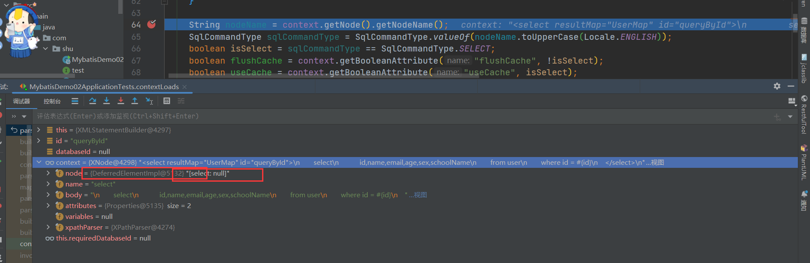

* 我们可以看到解析Node 解析的时候就获取他的语句类型，需要详细的过程需要自己去Bebug,下面我们看看他是怎样处理Include节点信息

**XMLIncludeTransformer**

```java
XMLIncludeTransformer includeParser = new XMLIncludeTransformer(configuration, builderAssistant);
includeParser.applyIncludes(context.getNode());

 /**
   * 解析数据库操作节点中的include节点
   * @param source 数据库操作节点，即select、insert、update、delete这四类节点
   */
  public void applyIncludes(Node source) {
    Properties variablesContext = new Properties();
    // 读取全局属性信息
    Properties configurationVariables = configuration.getVariables();
    Optional.ofNullable(configurationVariables).ifPresent(variablesContext::putAll);
    applyIncludes(source, variablesContext, false);
  }

  /**
   * Recursively apply includes through all SQL fragments.
   * @param source Include node in DOM tree
   * @param variablesContext Current context for static variables with values
   */
  /**
   * 解析数据库操作节点中的include节点
   * @param source 数据库操作节点或其子节点
   * @param variablesContext 全局属性信息
   * @param included 是否嵌套
   */
  private void applyIncludes(Node source, final Properties variablesContext, boolean included) {
    if (source.getNodeName().equals("include")) { // 当前节点是include节点
      // 找出被应用的节点
      Node toInclude = findSqlFragment(getStringAttribute(source, "refid"), variablesContext);
      Properties toIncludeContext = getVariablesContext(source, variablesContext);
      // 递归处理被引用节点中的include节点
      applyIncludes(toInclude, toIncludeContext, true);
      if (toInclude.getOwnerDocument() != source.getOwnerDocument()) {
        toInclude = source.getOwnerDocument().importNode(toInclude, true);
      }
      // 完成include节点的替换
      source.getParentNode().replaceChild(toInclude, source);
      while (toInclude.hasChildNodes()) {
        toInclude.getParentNode().insertBefore(toInclude.getFirstChild(), toInclude);
      }
      toInclude.getParentNode().removeChild(toInclude);
    } else if (source.getNodeType() == Node.ELEMENT_NODE) { // 元素节点
      if (included && !variablesContext.isEmpty()) {
        // 用属性值替代变量
        NamedNodeMap attributes = source.getAttributes();
        for (int i = 0; i < attributes.getLength(); i++) {
          Node attr = attributes.item(i);
          attr.setNodeValue(PropertyParser.parse(attr.getNodeValue(), variablesContext));
        }
      }
      // 循环到下层节点递归处理下层的include节点
      NodeList children = source.getChildNodes();
      for (int i = 0; i < children.getLength(); i++) {
        applyIncludes(children.item(i), variablesContext, included);
      }
    } else if (included && source.getNodeType() == Node.TEXT_NODE
        && !variablesContext.isEmpty()) { // 文本节点
      // 用属性值替代变量
      source.setNodeValue(PropertyParser.parse(source.getNodeValue(), variablesContext));
    }
  }
```

* 我们可以看到对Included的解析主要是对Sql片段的加载Configuration.getSqlFragments()

* **接下来使用语言驱动来创建sqlSource，这个是否重要，这决定了后面BoundSql的处理，我们首先来看看**LanguageDriver接口

**LanguageDriver**

```java
// 脚本语言解释器
// 在接口上注解的SQL语句，就是由它进行解析的
// @Select("select * from `user` where id = #{id}")
//User queryUserById(Integer id);
public interface LanguageDriver {


  /**
   * 创建参数处理器。参数处理器能将实参传递给JDBC statement。
   * @param mappedStatement 完整的数据库操作节点
   * @param parameterObject 参数对象
   * @param boundSql 数据库操作语句转化的BoundSql对象
   * @return 参数处理器
   */
  ParameterHandler createParameterHandler(MappedStatement mappedStatement, Object parameterObject, BoundSql boundSql);


  /**
   * 创建SqlSource对象（基于映射文件的方式）。该方法在MyBatis启动阶段，读取映射接口或映射文件时被调用
   * @param configuration 配置信息
   * @param script 映射文件中的数据库操作节点
   * @param parameterType 参数类型
   * @return SqlSource对象
   */
  SqlSource createSqlSource(Configuration configuration, XNode script, Class<?> parameterType);


  /**
   * 创建SqlSource对象（基于注解的方式）。该方法在MyBatis启动阶段，读取映射接口或映射文件时被调用
   * @param configuration 配置信息
   * @param script 注解中的SQL字符串
   * @param parameterType 参数类型
   * @return SqlSource对象，具体来说是DynamicSqlSource和RawSqlSource中的一种
   */
  SqlSource createSqlSource(Configuration configuration, String script, Class<?> parameterType);
}

```

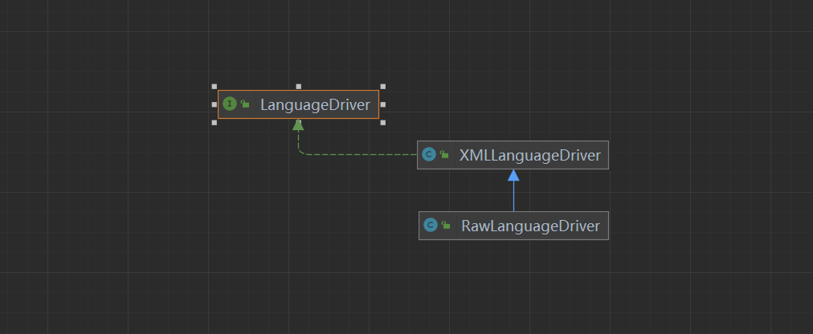

**XMLLanguageDriver**

```java
public class XMLLanguageDriver implements LanguageDriver {

  @Override
  public ParameterHandler createParameterHandler(MappedStatement mappedStatement, Object parameterObject, BoundSql boundSql) {
    return new DefaultParameterHandler(mappedStatement, parameterObject, boundSql);
  }

  /**
   * 创建SqlSource对象（基于映射文件的方式）。该方法在MyBatis启动阶段，读取映射接口或映射文件时被调用
   * @param configuration 配置信息
   * @param script 映射文件中的数据库操作节点
   * @param parameterType 参数类型
   * @return SqlSource对象
   */
  @Override
  public SqlSource createSqlSource(Configuration configuration, XNode script, Class<?> parameterType) {
    XMLScriptBuilder builder = new XMLScriptBuilder(configuration, script, parameterType);
    return builder.parseScriptNode();
  }

  // 创建SQL源码(注解方式)
  @Override
  public SqlSource createSqlSource(Configuration configuration, String script, Class<?> parameterType) {
    if (script.startsWith("<script>")) {
      // 如果注解中的内容以<script>开头
      XPathParser parser = new XPathParser(script, false, configuration.getVariables(), new XMLMapperEntityResolver());
      return createSqlSource(configuration, parser.evalNode("/script"), parameterType);
    } else {
      // 如果注解中的内容不以<script>开头
      script = PropertyParser.parse(script, configuration.getVariables());
      TextSqlNode textSqlNode = new TextSqlNode(script);
      // 是不是动态节点：就是<>
      if (textSqlNode.isDynamic()) {
        return new DynamicSqlSource(configuration, textSqlNode);
      } else {
        return new RawSqlSource(configuration, script, parameterType);
      }
    }
  }
}

```

* 我们可以看到创建XMLScriptBuilder对象，并调用了parseScriptNode（）方法 **XMLScriptBuilder**

```java
// 当前要处理的XML节点
  private final XNode context;
  // 当前节点是否为动态节点
  private boolean isDynamic;
  // 输入参数的类型
  private final Class<?> parameterType;
  // 节点类型和对应的处理器组成的Map
  private final Map<String, NodeHandler> nodeHandlerMap = new HashMap<>();

  public XMLScriptBuilder(Configuration configuration, XNode context) {
    this(configuration, context, null);
  }

  public XMLScriptBuilder(Configuration configuration, XNode context, Class<?> parameterType) {
    super(configuration);
    this.context = context;
    this.parameterType = parameterType;
    initNodeHandlerMap();
  }


  private void initNodeHandlerMap() {
    nodeHandlerMap.put("trim", new TrimHandler());
    nodeHandlerMap.put("where", new WhereHandler());
    nodeHandlerMap.put("set", new SetHandler());
    nodeHandlerMap.put("foreach", new ForEachHandler());
    nodeHandlerMap.put("if", new IfHandler());
    nodeHandlerMap.put("choose", new ChooseHandler());
    nodeHandlerMap.put("when", new IfHandler());
    nodeHandlerMap.put("otherwise", new OtherwiseHandler());
    nodeHandlerMap.put("bind", new BindHandler());
  }


 /**
   * 解析节点生成SqlSource对象
   * @return SqlSource对象
   */
  public SqlSource parseScriptNode() {
    // 解析XML节点节点，得到节点树MixedSqlNode
    MixedSqlNode rootSqlNode = parseDynamicTags(context);
    SqlSource sqlSource;
    // 根据节点树是否为动态，创建对应的SqlSource对象
    if (isDynamic) {
      sqlSource = new DynamicSqlSource(configuration, rootSqlNode);
    } else {
      sqlSource = new RawSqlSource(configuration, rootSqlNode, parameterType);
    }
    return sqlSource;
  }

```

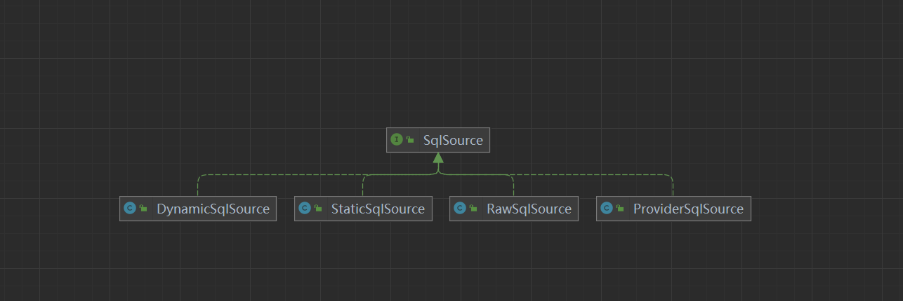

1. DynamicSqlSource：针对动态 SQL 和 ${} 占位符的 SQL

2. RawSqlSource：针对 #{}占位符的 SQL

3. ProviderSqlSource：针对 @\*Provider 注解 提供的 SQL

4. StaticSqlSource：仅包含有 ?占位符的 SQL

到这就决定了使用那种SqlSource，后面在Sqlsession的具体执行过程会有详细的介绍？

**GenericTokenParser&#x20;**

`GenericTokenParser.parse` 方法是 MyBatis 中用于解析动态 SQL 语句的方法之一。在 MyBatis 中，动态 SQL 是一种强大的功能，允许开发者根据不同的条件生成不同的 SQL 语句。`GenericTokenParser` 类通常用于处理简单的动态 SQL 场景，而更复杂的场景则可能需要使用 `<if>`、`<choose>` 等 XML 标签。

**parse 方法签名**

`GenericTokenParser.parse` 方法的基本签名如下：

```java
public String parse(String text, TokenHandler handler)
```

* `text`: 需要解析的文本。

* `handler`: 用于处理 token 的 `TokenHandler` 实现。

**方法工作流程**

1. **初始化**: 创建 `GenericTokenParser` 实例，指定开始和结束 token。

2. **解析**: 遍历输入文本，查找开始和结束 token。

3) **处理 token**: 当找到一个 token 时，调用 `TokenHandler` 的 `handleToken` 方法来处理 token 内容。

4) **替换**: 将处理后的 token 替换到原始文本中。

5. **返回**: 返回处理后的文本。

**示例**

假设我们有一个简单的动态 SQL 例子：

```java
String sql = "SELECT * FROM users WHERE username = #{username} AND password = #{password}";
GenericTokenParser parser = new GenericTokenParser("#{", "}");
String parsedSql = parser.parse(sql, new TokenHandler() {
    @Override
    public String handleToken(String content) {
        if ("username".equals(content)) {
            return "username = 'John'";
        } else if ("password".equals(content)) {
            return "password = '123456'";
        }
        return "";
    }
});
System.out.println(parsedSql);
```

输出结果将是：

```plain&#x20;text
SELECT * FROM users WHERE username = 'John' AND password = '123456'
```

* 这个时候我们就拿到了我们的Sql语句，并解析成我们编写的Sql


* 我们已经将 XML 配置解析了 SqlSource，下面我们看看MappedStatement的构建。

```java
public MappedStatement addMappedStatement(
    String id, SqlSource sqlSource, StatementType statementType, 
    SqlCommandType sqlCommandType,Integer fetchSize, Integer timeout, 
    String parameterMap, Class<?> parameterType,String resultMap, 
    Class<?> resultType, ResultSetType resultSetType, boolean flushCache,
    boolean useCache, boolean resultOrdered, KeyGenerator keyGenerator, 
    String keyProperty,String keyColumn, String databaseId, 
    LanguageDriver lang, String resultSets) {

    if (unresolvedCacheRef) {
        throw new IncompleteElementException("Cache-ref not yet resolved");
    }
　　// 拼接上命名空间，如 <select id="findOne" resultType="User">，则id=java.mybaits.dao.UserMapper.findOne
    id = applyCurrentNamespace(id, false);
    boolean isSelect = sqlCommandType == SqlCommandType.SELECT;

    // 创建建造器，设置各种属性
    MappedStatement.Builder statementBuilder = new MappedStatement.Builder(configuration, id, sqlSource, sqlCommandType)
        .resource(resource).fetchSize(fetchSize).timeout(timeout)
        .statementType(statementType).keyGenerator(keyGenerator)
        .keyProperty(keyProperty).keyColumn(keyColumn).databaseId(databaseId)
        .lang(lang).resultOrdered(resultOrdered).resultSets(resultSets)
        .resultMaps(getStatementResultMaps(resultMap, resultType, id))
        .flushCacheRequired(valueOrDefault(flushCache, !isSelect))
        .resultSetType(resultSetType).useCache(valueOrDefault(useCache, isSelect))
        .cache(currentCache);//这里用到了前面解析<cache>节点时创建的Cache对象，设置到MappedStatement对象里面的cache属性中

    // 获取或创建 ParameterMap
    ParameterMap statementParameterMap = getStatementParameterMap(parameterMap, parameterType, id);
    if (statementParameterMap != null) {
        statementBuilder.parameterMap(statementParameterMap);
    }

    // 构建 MappedStatement
    MappedStatement statement = statementBuilder.build();
    // 添加 MappedStatement 到 configuration 的 mappedStatements 集合中
    // 通过UserMapper代理对象调用findOne方法时，就可以拼接UserMapper接口名java.mybaits.dao.UserMapper和findOne方法找到id=java.mybaits.dao.UserMapper的MappedStatement，然后执行对应的sql语句
    configuration.addMappedStatement(statement);
    return statement;
}
```

* `这里我们要注意，MappedStatement对象中有一个cache属性，将前面解析<cache>`节点时创建的Cache对象，设置到MappedStatement对象里面的cache属性中，以备后面二级缓存使用，我们后面专门来讲这一块。我们还要注意一个地方，.resultMaps(getStatementResultMaps(resultMap, resultType, id))，设置MappedStatement的resultMaps，我们来看看是怎么获取resultMap的。&#x20;

**MapperBuilderAssistant**

```java
private List<ResultMap> getStatementResultMaps(String resultMap, Class<?> resultType, String statementId) {
    //拼接上当前nameSpace
    resultMap = this.applyCurrentNamespace(resultMap, true);
    //创建一个集合
    List<ResultMap> resultMaps = new ArrayList();
    if (resultMap != null) {
        //通过,分隔字符串，一般resultMap只会是一个，不会使用逗号
        String[] resultMapNames = resultMap.split(",");
        String[] arr$ = resultMapNames;
        int len$ = resultMapNames.length;

        for(int i$ = 0; i$ < len$; ++i$) {
            String resultMapName = arr$[i$];

            try {
                //从configuration中通过resultMapName获取ResultMap对象加入到resultMaps中
                resultMaps.add(this.configuration.getResultMap(resultMapName.trim()));
            } catch (IllegalArgumentException var11) {
                throw new IncompleteElementException("Could not find result map " + resultMapName, var11);
            }
        }
    } else if (resultType != null) {
        ResultMap inlineResultMap = (new org.apache.ibatis.mapping.ResultMap.Builder(this.configuration, statementId + "-Inline", resultType, new ArrayList(), (Boolean)null)).build();
        resultMaps.add(inlineResultMap);
    }
    return resultMaps;
}
```

* 从configuration中获取到ResultMap并设置到MappedStatement中，文件解析之后，我们来看看

**XMLMapperBuilder**

```java
  public void parse() {
    // 该节点是否被解析过
    if (!configuration.isResourceLoaded(resource)) {
      // 处理mapper节点
      configurationElement(parser.evalNode("/mapper"));
      // 加入到已经解析的列表，防止重复解析
      configuration.addLoadedResource(resource);
      // 将mapper注册给Configuration
      bindMapperForNamespace();
    }

    // 下面分别用来处理失败的<resultMap>、<cache-ref>、SQL语句
    parsePendingResultMaps();
    parsePendingCacheRefs();
    parsePendingStatements();
  }


private void bindMapperForNamespace() {
    // 获取映射文件的命名空间
    String namespace = builderAssistant.getCurrentNamespace();
    if (namespace != null) {
        Class<?> boundType = null;
        try {
            // 根据命名空间解析 mapper 类型
            boundType = Resources.classForName(namespace);
        } catch (ClassNotFoundException e) {
        }
        if (boundType != null) {
            // 检测当前 mapper 类是否被绑定过
            if (!configuration.hasMapper(boundType)) {
                configuration.addLoadedResource("namespace:" + namespace);
                // 绑定 mapper 类
                configuration.addMapper(boundType);
            }
        }
    }
}

```

**Configuration**

```java
 public <T> void addMapper(Class<T> type) {
    mapperRegistry.addMapper(type);
  }

```

**MapperRegistry**

```java
public <T> void addMapper(Class<T> type) {
    // 要加入的肯定是接口，否则不添加
    if (type.isInterface()) {
      // 加入的是接口
      if (hasMapper(type)) {
        // 如果添加重复
        throw new BindingException("Type " + type + " is already known to the MapperRegistry.");
      }
      boolean loadCompleted = false;
      try {
        knownMappers.put(type, new MapperProxyFactory<>(type));
        // It's important that the type is added before the parser is run
        // otherwise the binding may automatically be attempted by the
        // mapper parser. If the type is already known, it won't try.
        MapperAnnotationBuilder parser = new MapperAnnotationBuilder(config, type);
        parser.parse();
        loadCompleted = true;
      } finally {
        if (!loadCompleted) {
          knownMappers.remove(type);
        }
      }
    }
  }
```

* 其实就是获取当前映射文件的命名空间，并获取其Class，也就是获取每个Mapper接口，然后为每个Mapper接口创建一个代理类工厂，new MapperProxyFactory`<T>`(type)，并放进 knownMappers 这个HashMap中，我们来看看这个MapperProxyFactory。

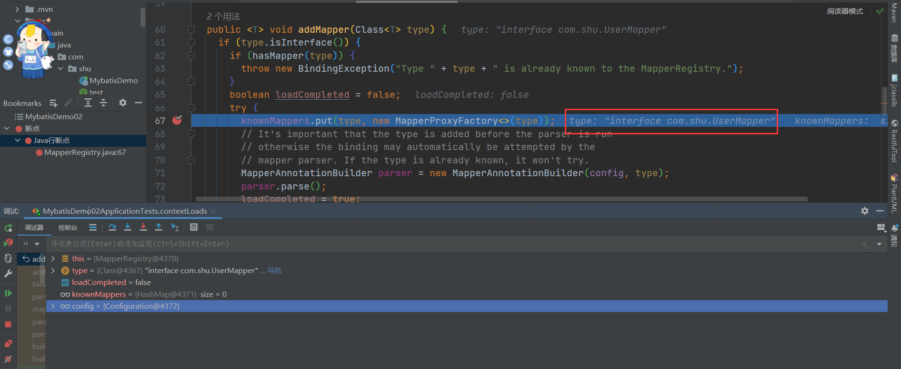

```java
public class MapperProxyFactory<T> {

  // 对应SQL的java接口类
  private final Class<T> mapperInterface;
  private final Map<Method, MapperMethod> methodCache = new ConcurrentHashMap<>();

  /**
   * MapperProxyFactory构造方法
   * @param mapperInterface 映射接口
   */
  public MapperProxyFactory(Class<T> mapperInterface) {
    this.mapperInterface = mapperInterface;
  }

  public Class<T> getMapperInterface() {
    return mapperInterface;
  }

  public Map<Method, MapperMethod> getMethodCache() {
    return methodCache;
  }

  @SuppressWarnings("unchecked")
  protected T newInstance(MapperProxy<T> mapperProxy) {
    // 三个参数分别是：
    // 创建代理对象的类加载器、要代理的接口、代理类的处理器（即具体的实现）。
    return (T) Proxy.newProxyInstance(mapperInterface.getClassLoader(), new Class[] { mapperInterface }, mapperProxy);
  }

  public T newInstance(SqlSession sqlSession) {
    final MapperProxy<T> mapperProxy = new MapperProxy<>(sqlSession, mapperInterface, methodCache);
    return newInstance(mapperProxy);
  }

}

```

这里涉及到Java的动态代理，在下一篇文章我们来具体分析接口是如何具体执行的。&#x20;

总结步骤：

1. **调用XMLMapperBuilder#parse（）对我们编写的Mybats.xml文件解析，主要包括：cache，resultMap，sql，select|insert|update|delete语句进行解析**

2. **resultMap进行解析是主要调用XMLMapperBuilder这个类进行解析返回ResultMapping**

3. **select|insert|update|delete解析主要调用XMLStatementBuilder这个类对数据库各个节点进行解析返回MappedStatement**

4. **绑定对应的接口，生成代理对象**

### 2.3.3 BoundSql（Sql语句）

**BoundSql**

```java

public class BoundSql {// 最终解析的sql，Mybatis将#{}和${}解析后的sql，其中#{}会被解析为?
  private final String sql;// 参数映射
  private final List<ParameterMapping> parameterMappings;// 参数对象
  private final Object parameterObject;// 额外的参数
  private final Map<String, Object> additionalParameters;// 元数据参数
  private final MetaObject metaParameters;
}
```

**StaticSqlSource&#x20;**

```java
public class StaticSqlSource implements SqlSource {

  private final String sql;
  private final List<ParameterMapping> parameterMappings;
  private final Configuration configuration;

  public StaticSqlSource(Configuration configuration, String sql) {
    this(configuration, sql, null);
  }

  public StaticSqlSource(Configuration configuration, String sql, List<ParameterMapping> parameterMappings) {
    this.sql = sql;
    this.parameterMappings = parameterMappings;
    this.configuration = configuration;
  }

  @Override
  public BoundSql getBoundSql(Object parameterObject) {
    return new BoundSql(configuration, sql, parameterMappings, parameterObject);
  }

}
```

我们来看BoundSql其实是经过SqlSource通过分词器解析后的结果

SqlSource 和 ParameterMapping

1. **SqlSource**：这是一个抽象类，其主要职责是根据不同的参数创建 SQL 语句。MyBatis 使用不同的实现来处理不同类型的动态 SQL 语句，例如静态 SQL、带有 `#{}` 的动态 SQL、基于 `<if>`, `<choose>`, `<when>`, `<otherwise>` 等标签的复杂动态 SQL。

   * **StaticSqlSource**：用于静态 SQL 语句。

   * **DynamicSqlSource**：用于动态 SQL 语句。

2. **ParameterMapping**：这是用来映射参数到 SQL 语句中的占位符的对象。例如，在 `#{paramName}` 这样的语法中，`#{paramName}` 就是一个参数映射。

**解析过程**

当执行一个 SQL 映射文件中的 SQL 语句时，MyBatis 会经历以下步骤：

1. **解析 SQL 语句**：MyBatis 读取 XML 映射文件中的 SQL 语句，并创建相应的 `SqlSource` 实例。

   * 对于简单的静态 SQL 语句，直接创建 `StaticSqlSource`。

   * 对于动态 SQL 语句，创建 `DynamicSqlSource`。

2. **创建 BoundSql**：当实际执行 SQL 语句时，`SqlSession` 调用 `SqlSource` 的 `getBoundSql` 方法来创建 `BoundSql` 对象。这个方法会使用 `GenericTokenParser` 或者 `DynamicContext` 来解析 SQL 语句。

* 对于静态 SQL，`GenericTokenParser` 会解析 SQL 中的 `#{}` 占位符，并为每个占位符创建一个 `ParameterMapping`。

* 对于动态 SQL，使用 `DynamicContext` 来解析并构建最终的 SQL 语句。

3. **绑定参数**：`BoundSql` 包含了最终的 SQL 语句和参数映射。在执行 SQL 之前，MyBatis 会根据传入的参数对象和 `ParameterMapping` 来设置 SQL 参数。

**BoundSql**

`BoundSql` 类包含了以下信息：

* **SQL 语句**：已经解析好的 SQL 语句。

* **参数映射列表**：`List<ParameterMapping>`，用于指示如何从参数对象中获取值并设置到 SQL 语句中。

* **参数对象**：传入的参数对象，可以是 Map、POJO 或者基本类型。

以下 SQL 语句：

```xml
<select id="selectUsers" resultType="User">
  SELECT * FROM user WHERE name = #{name} AND age >= #{age}
</select>
```

解析过程如下：

1. MyBatis 读取上面的 SQL 语句并创建一个 `DynamicSqlSource`。

2. 当调用 `SqlSession.selectList("selectUsers", params)` 时，`DynamicSqlSource` 的 `getBoundSql` 方法被调用。

3) 使用 `DynamicContext` 解析 SQL 并创建 `BoundSql`。

4) `BoundSql` 包含了最终的 SQL 语句和参数映射，例如：

   ```sql
   SELECT * FROM user WHERE name = ? AND age >= ?
   ```

5. 在执行查询时，根据参数映射将参数对象中的值设置到 SQL 语句的问号位置。


### 2.3.4 存储类总结

在 MyBatis 中，`Configuration` 和 `MappedStatement` 是两个非常重要的类，它们负责管理 MyBatis 的配置信息和映射 SQL 语句到 Java 对象的过程。下面是这两个概念的详细说明：

**Configuration**

`Configuration` 类是 MyBatis 中的核心配置类，它封装了整个 MyBatis 应用程序的配置信息，包括全局配置 (`mybatis-config.xml`) 和映射文件 (`XXXDAOMapper.xml`) 的配置。

**Configuration 的职责**

1. **封装 mybatis-config.xml**：`Configuration` 类封装了全局配置文件中的所有设置，如数据库连接信息、缓存策略、事务管理等。

2. **管理映射文件**：它还负责加载和管理所有的映射文件，包括 `<select>`、`<insert>`、`<update>` 和 `<delete>` 等标签的配置。

3) **创建相关对象**：`Configuration` 类还会创建和管理其他 MyBatis 相关的对象，如 `Executor`、`Environment`、`TypeHandlerRegistry`、`MapperRegistry` 等。

**MappedStatement**

`MappedStatement` 类代表了一个 SQL 映射语句，它包含了执行 SQL 所需的所有信息，包括 SQL 语句本身、参数映射、结果映射等。每个 `<select>`、`<insert>`、`<update>` 和 `<delete>` 标签都会对应一个 `MappedStatement` 实例。

**MappedStatement 的职责**

1. **封装 SQL 语句**：`MappedStatement` 包含了 SQL 语句的具体内容，包括 SQL 语句的文本、参数映射、结果映射等。

2. **存储配置信息**：它还存储了与该 SQL 语句相关的配置信息，如 SQL 的 ID、语句类型（`SELECT`、`INSERT` 等）、超时时间、缓存策略等。

3) **与 Configuration 关联**：`MappedStatement` 与 `Configuration` 相关联，这意味着它可以通过 `Configuration` 访问其他必要的组件和服务。

**BoundSql**

`BoundSql` 类是 `MappedStatement` 在执行 SQL 语句前创建的一个对象，它包含了最终的 SQL 语句和参数映射信息。`BoundSql` 主要由以下部分组成：

* **SQL 语句**：已经解析好的 SQL 语句。

* **参数映射列表**：`List<ParameterMapping>`，用于指示如何从参数对象中获取值并设置到 SQL 语句中。

* **参数对象**：传入的参数对象，可以是 Map、POJO 或者基本类型。

**总结**

* `Configuration` 是 MyBatis 的核心配置容器，它管理着全局配置和映射文件的加载。

* `MappedStatement` 表示一个具体的 SQL 映射语句，它封装了 SQL 语句的全部信息。

* `BoundSql` 是在执行 SQL 语句前创建的对象，它包含了最终的 SQL 语句和参数映射。

这些类之间的关系可以概括如下：

1. `Configuration` 加载并管理所有的映射文件，每个映射文件中的 `<select>`、`<insert>` 等标签都会被解析成一个 `MappedStatement`。

2. 每个 `MappedStatement` 都与一个特定的 SQL 映射语句相关联，并且包含执行该语句所需的所有信息。

3) 当实际执行 SQL 语句时，`MappedStatement` 会被用来创建 `BoundSql` 对象，该对象包含了最终的 SQL 语句和参数映射信息。

## 2.4 执行类源码分析

* 官网：[mybatis – MyBatis 3 | 简介](https://mybatis.org/mybatis-3/zh/index.html)

### 2.4.1  SqlSession的创建

* 使用 MyBatis 的主要 Java 接口就是 SqlSession。你可以通过这个接口来执行命令，获取映射器实例和管理事务。在介绍 SqlSession 接口之前，我们先来了解如何获取一个 SqlSession 实例。SqlSessions 是由 SqlSessionFactory 实例创建的。

* 而 SqlSessionFactory 本身是由 SqlSessionFactoryBuilder 创建的，它可以从 XML、注解或 Java 配置代码来创建 SqlSessionFactory。

```java
@Test
    void contextLoads() {
        // 第一阶段：MyBatis的初始化阶段
        String resource = "mybatis-config.xml";
        // 得到配置文件的输入流
        InputStream inputStream = null;
        try {
            inputStream = Resources.getResourceAsStream(resource);
        } catch (IOException e) {
            e.printStackTrace();
        }

        // 得到SqlSessionFactory
        SqlSessionFactory sqlSessionFactory = new SqlSessionFactoryBuilder().build(inputStream);

        // 第二阶段：数据读写阶段
        try (SqlSession session = sqlSessionFactory.openSession()) {
            // 找到接口对应的实现
            UserMapper userMapper = session.getMapper(UserMapper.class);
            // 组建查询参数
            User userParam = new User();
            userParam.setSchoolname("Sunny School");
            // 调用接口展开数据库操作
            List<User> userList =  userMapper.queryAllByLimit(userParam);
            // 打印查询结果
            for (User user : userList) {
                System.out.println("name : " + user.getName() + " ;  email : " + user.getEmail());
            }
        }
    }
```

* 我们来看看SqlSession的创建是如何创建的，在上面中完成配置文件的解析返回SqlSessionFactory

```java
          // 第二阶段：数据读写阶段
        try (SqlSession session = sqlSessionFactory.openSession()) {
```

* 可以通过调式看出，我们的SqlSessionFactory的实现是DefaultSqlSessionFactory

```java

@Override
  public SqlSession openSession() {
    return openSessionFromDataSource(configuration.getDefaultExecutorType(), null, false);
  }


public enum ExecutorType {
  SIMPLE, // 为每个语句创建新的预处理语句
  REUSE,  // 复用
  BATCH   // 执行批量操作
}


/**
   * 从数据源中获取SqlSession对象
   * @param execType 执行器类型
   * @param level 事务隔离级别
   * @param autoCommit 是否自动提交事务
   * @return SqlSession对象
   */
  private SqlSession openSessionFromDataSource(ExecutorType execType, TransactionIsolationLevel level, boolean autoCommit) {
    Transaction tx = null;
    try {
      // 找出要使用的指定环境
      final Environment environment = configuration.getEnvironment();
      // 从环境中获取事务工厂
      final TransactionFactory transactionFactory = getTransactionFactoryFromEnvironment(environment);
      // 从事务工厂中生产事务
      tx = transactionFactory.newTransaction(environment.getDataSource(), level, autoCommit);
      // 创建执行器
      final Executor executor = configuration.newExecutor(tx, execType);
      // 创建DefaultSqlSession对象
      return new DefaultSqlSession(configuration, executor, autoCommit);
    } catch (Exception e) {
      closeTransaction(tx); // may have fetched a connection so lets call close()
      throw ExceptionFactory.wrapException("Error opening session.  Cause: " + e, e);
    } finally {
      ErrorContext.instance().reset();
    }
  }

```

主要包含以下几个步骤：

1. 首先从configuration获取Environment对象，里面主要包含了DataSource和TransactionFactory对象

2. 创建TransactionFactory对象

3. 创建Transaction对象

4. 从configuration获取Executor

5. 构造DefaultSqlSession对象

**获取environments配置元素**

```java
//配置environment环境
<environments default="development">
    <environment id="development">
        /** 事务配置 type= JDBC、MANAGED 
         *  1.JDBC:这个配置直接简单使用了JDBC的提交和回滚设置。它依赖于从数据源得到的连接来管理事务范围。
         *  2.MANAGED:这个配置几乎没做什么。它从来不提交或回滚一个连接。
         */
        <transactionManager type="JDBC" />
        /** 数据源类型：type = UNPOOLED、POOLED、JNDI 
         *  1.UNPOOLED：这个数据源的实现是每次被请求时简单打开和关闭连接。
         *  2.POOLED：这是JDBC连接对象的数据源连接池的实现。 
         *  3.JNDI：这个数据源的实现是为了使用如Spring或应用服务器这类的容器
         */
        <dataSource type="POOLED">
            <property name="driver" value="com.mysql.jdbc.Driver" />
            <property name="url" value="jdbc:mysql://localhost:3306/xhm" />
            <property name="username" value="root" />
            <property name="password" value="root" />
            //默认连接事务隔离级别
            <property name="defaultTransactionIsolationLevel" value=""/> 
        </dataSource>
    </environment>
</environments>
```

* 解析我们配置文件中的environment配置元素，具体解析过程请参考前面的文章

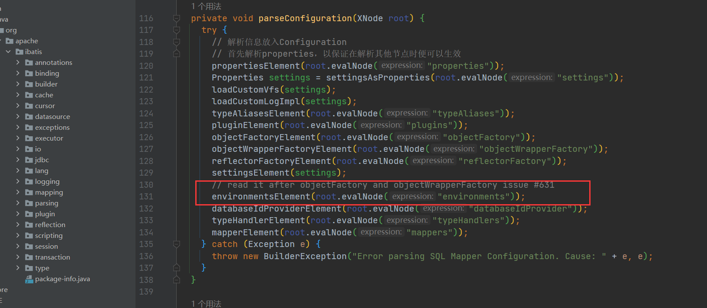

**XMLConfigBuilder**

```java
// 解析我们配置文件中的environment配置元素
private void environmentsElement(XNode context) throws Exception {
    if (context != null) {
        if (environment == null) {
            // 获取 default 属性
            environment = context.getStringAttribute("default");
        }
        for (XNode child : context.getChildren()) {
            // 获取 id 属性
            String id = child.getStringAttribute("id");
            /*
             * 检测当前 environment 节点的 id 与其父节点 environments 的属性 default 
             * 内容是否一致，一致则返回 true，否则返回 false
             * 将其default属性值与子元素environment的id属性值相等的子元素设置为当前使用的Environment对象
             */
            if (isSpecifiedEnvironment(id)) {
                // 将environment中的transactionManager标签转换为TransactionFactory对象
                TransactionFactory txFactory = transactionManagerElement(child.evalNode("transactionManager"));
                // 将environment中的dataSource标签转换为DataSourceFactory对象
                DataSourceFactory dsFactory = dataSourceElement(child.evalNode("dataSource"));
                // 创建 DataSource 对象
                DataSource dataSource = dsFactory.getDataSource();
                Environment.Builder environmentBuilder = new Environment.Builder(id)
                    .transactionFactory(txFactory)
                    .dataSource(dataSource);
                // 构建 Environment 对象，并设置到 configuration 中
                configuration.setEnvironment(environmentBuilder.build());
            }
        }
    }
}
```

**获取事务工厂**

**DefaultSqlSessionFactory**

```java
 private TransactionFactory getTransactionFactoryFromEnvironment(Environment environment) {
    if (environment == null || environment.getTransactionFactory() == null) {
         // 委托事务工厂
      return new ManagedTransactionFactory();
    }
    // 我们配置的事务工厂JdbcTransactionFactory
    return environment.getTransactionFactory();
  }

```

* JdbcTransaction由JDBC进行事务管理

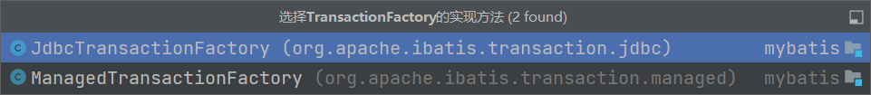

**JdbcTransaction**

```java
// 由JDBC进行事务管理
public class JdbcTransaction implements Transaction {

  private static final Log log = LogFactory.getLog(JdbcTransaction.class);

  // 数据库连接
  protected Connection connection;
  // 数据源
  protected DataSource dataSource;
  // 事务隔离级别
  protected TransactionIsolationLevel level;
  // 是否自动提交事务
  protected boolean autoCommit;

  public JdbcTransaction(DataSource ds, TransactionIsolationLevel desiredLevel, boolean desiredAutoCommit) {
    dataSource = ds;
    level = desiredLevel;
    autoCommit = desiredAutoCommit;
  }

  public JdbcTransaction(Connection connection) {
    this.connection = connection;
  }

  @Override
  public Connection getConnection() throws SQLException {
    if (connection == null) {
      openConnection();
    }
    return connection;
  }

  /**
   * 提交事务
   * @throws SQLException
   */
  @Override
  public void commit() throws SQLException {
    // 连接存在且不会自动提交事务
    if (connection != null && !connection.getAutoCommit()) {
      if (log.isDebugEnabled()) {
        log.debug("Committing JDBC Connection [" + connection + "]");
      }
      // 调用connection对象的方法提交事务
      connection.commit();
    }
  }

  /**
   * 回滚事务
   * @throws SQLException
   */
  @Override
  public void rollback() throws SQLException {
    if (connection != null && !connection.getAutoCommit()) {
      if (log.isDebugEnabled()) {
        log.debug("Rolling back JDBC Connection [" + connection + "]");
      }
      connection.rollback();
    }
  }

  @Override
  public void close() throws SQLException {
    if (connection != null) {
      resetAutoCommit();
      if (log.isDebugEnabled()) {
        log.debug("Closing JDBC Connection [" + connection + "]");
      }
      connection.close();
    }
  }

  protected void setDesiredAutoCommit(boolean desiredAutoCommit) {
    try {
      if (connection.getAutoCommit() != desiredAutoCommit) {
        if (log.isDebugEnabled()) {
          log.debug("Setting autocommit to " + desiredAutoCommit + " on JDBC Connection [" + connection + "]");
        }
        connection.setAutoCommit(desiredAutoCommit);
      }
    } catch (SQLException e) {
      // Only a very poorly implemented driver would fail here,
      // and there's not much we can do about that.
      throw new TransactionException("Error configuring AutoCommit.  "
          + "Your driver may not support getAutoCommit() or setAutoCommit(). "
          + "Requested setting: " + desiredAutoCommit + ".  Cause: " + e, e);
    }
  }

  protected void resetAutoCommit() {
    try {
      if (!connection.getAutoCommit()) {
        // MyBatis does not call commit/rollback on a connection if just selects were performed.
        // Some databases start transactions with select statements
        // and they mandate a commit/rollback before closing the connection.
        // A workaround is setting the autocommit to true before closing the connection.
        // Sybase throws an exception here.
        if (log.isDebugEnabled()) {
          log.debug("Resetting autocommit to true on JDBC Connection [" + connection + "]");
        }
        connection.setAutoCommit(true);
      }
    } catch (SQLException e) {
      if (log.isDebugEnabled()) {
        log.debug("Error resetting autocommit to true "
            + "before closing the connection.  Cause: " + e);
      }
    }
  }

  protected void openConnection() throws SQLException {
    if (log.isDebugEnabled()) {
      log.debug("Opening JDBC Connection");
    }
    connection = dataSource.getConnection();
    if (level != null) {
      connection.setTransactionIsolation(level.getLevel());
    }
    setDesiredAutoCommit(autoCommit);
  }

  @Override
  public Integer getTimeout() throws SQLException {
    return null;
  }

}

```

JdbcTransaction主要维护了一个默认autoCommit为false的Connection对象，对事物的提交，回滚，关闭等都是接见通过Connection完成的。

**获取执行器Executor**

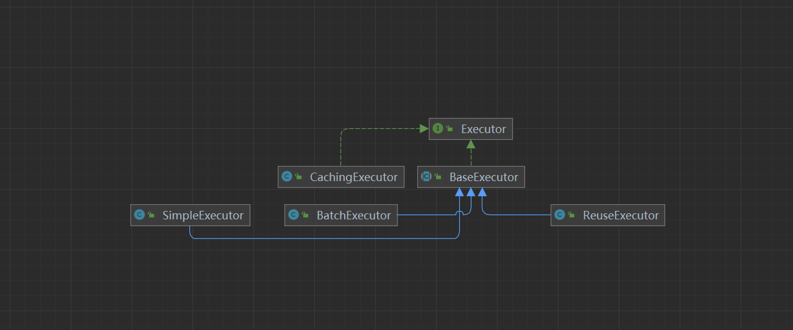

```java
/**
   * 创建一个执行器
   * @param transaction 事务
   * @param executorType 数据库操作类型
   * @return 执行器
   */
  public Executor newExecutor(Transaction transaction, ExecutorType executorType) {
    executorType = executorType == null ? defaultExecutorType : executorType;
    executorType = executorType == null ? ExecutorType.SIMPLE : executorType;
    Executor executor;
    // 根据数据操作类型创建实际执行器
    if (ExecutorType.BATCH == executorType) {
        // 批处理执行器
      executor = new BatchExecutor(this, transaction);
    } else if (ExecutorType.REUSE == executorType) {
        // 可以重用执行器
      executor = new ReuseExecutor(this, transaction);
    } else {
        //一个简单的执行器
      executor = new SimpleExecutor(this, transaction);
    }
    // 根据配置文件中settings节点cacheEnabled配置项确定是否启用缓存
    if (cacheEnabled) { // 如果配置启用缓存
      // 使用CachingExecutor装饰实际执行器
      executor = new CachingExecutor(executor);
    }
    // 为执行器增加拦截器（插件），以启用各个拦截器的功能
    executor = (Executor) interceptorChain.pluginAll(executor);
    return executor;
  }
```

* 执行器的类型，我们来看看执行器的接口信息

**Executor**

```java
public interface Executor {

  ResultHandler NO_RESULT_HANDLER = null;

  // 数据更新操作，其中数据的增加、删除、更新均可由该方法实现
  int update(MappedStatement ms, Object parameter) throws SQLException;
  // 数据查询操作，返回结果为列表形式
  <E> List<E> query(MappedStatement ms, Object parameter, RowBounds rowBounds, ResultHandler resultHandler, CacheKey cacheKey, BoundSql boundSql) throws SQLException;
  // 数据查询操作，返回结果为列表形式
  /**
   * 执行查询操作
   * @param ms 映射语句对象
   * @param parameter 参数对象
   * @param rowBounds 翻页限制
   * @param resultHandler 结果处理器
   * @param <E> 输出结果类型
   * @return 查询结果
   * @throws SQLException
   */
  <E> List<E> query(MappedStatement ms, Object parameter, RowBounds rowBounds, ResultHandler resultHandler) throws SQLException;
  // 数据查询操作，返回结果为游标形式
  <E> Cursor<E> queryCursor(MappedStatement ms, Object parameter, RowBounds rowBounds) throws SQLException;
  // 清理缓存
  List<BatchResult> flushStatements() throws SQLException;
  // 提交事务
  void commit(boolean required) throws SQLException;
  // 回滚事务
  void rollback(boolean required) throws SQLException;
  // 创建当前查询的缓存键值
  CacheKey createCacheKey(MappedStatement ms, Object parameterObject, RowBounds rowBounds, BoundSql boundSql);
  // 本地缓存是否有指定值
  boolean isCached(MappedStatement ms, CacheKey key);
  // 清理本地缓存
  void clearLocalCache();
  // 懒加载
  void deferLoad(MappedStatement ms, MetaObject resultObject, String property, CacheKey key, Class<?> targetType);
  // 获取事务
  Transaction getTransaction();
  // 关闭执行器
  void close(boolean forceRollback);
  // 判断执行器是否关闭
  boolean isClosed();
  // 设置执行器包装
  void setExecutorWrapper(Executor executor);

}

```

* executor包含了Configuration和刚刚创建的Transaction，默认的执行器为SimpleExecutor，如果开启了二级缓存(默认开启)，则CachingExecutor会包装SimpleExecutor，然后依次调用拦截器的plugin方法返回一个被代理过的Executor对象，记住这个地方，后面Sql语句具体的执行是交给执行器来进行处理的。

**构建DefaultSqlSession**

```java
 return new DefaultSqlSession(configuration, executor, autoCommit);
```

```java
public class DefaultSqlSession implements SqlSession {
  // 配置信息
  private final Configuration configuration;
  // 执行器
  private final Executor executor;
  // 是否自动提交
  private final boolean autoCommit;
  // 缓存是否已经被污染
  private boolean dirty;
  // 游标列表
  private List<Cursor<?>> cursorList;

  public DefaultSqlSession(Configuration configuration, Executor executor, boolean autoCommit) {
    this.configuration = configuration;
    this.executor = executor;
    this.dirty = false;
    this.autoCommit = autoCommit;
  }

}
```

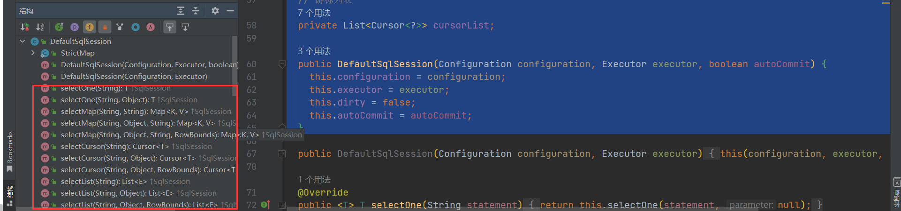

SqlSession的所有查询接口最后都归结位Exector的方法调用。

### 2.4.2 Exector的源码分析

* 执行器的创建时机

**DefaultSqlSessionFactory**

```java
/**
   * 从数据源中获取SqlSession对象
   * @param execType 执行器类型
   * @param level 事务隔离级别
   * @param autoCommit 是否自动提交事务
   * @return SqlSession对象
   */
  private SqlSession openSessionFromDataSource(ExecutorType execType, TransactionIsolationLevel level, boolean autoCommit) {
    Transaction tx = null;
    try {
      // 找出要使用的指定环境
      final Environment environment = configuration.getEnvironment();
      // 从环境中获取事务工厂
      final TransactionFactory transactionFactory = getTransactionFactoryFromEnvironment(environment);
      // 从事务工厂中生产事务
      tx = transactionFactory.newTransaction(environment.getDataSource(), level, autoCommit);
      // 创建执行器
      final Executor executor = configuration.newExecutor(tx, execType);
      // 创建DefaultSqlSession对象
      return new DefaultSqlSession(configuration, executor, autoCommit);
    } catch (Exception e) {
      closeTransaction(tx); // may have fetched a connection so lets call close()
      throw ExceptionFactory.wrapException("Error opening session.  Cause: " + e, e);
    } finally {
      ErrorContext.instance().reset();
    }
  }

```

**Configuration**

```java
/**
   * 创建一个执行器
   * @param transaction 事务
   * @param executorType 数据库操作类型
   * @return 执行器
   */
  public Executor newExecutor(Transaction transaction, ExecutorType executorType) {
    executorType = executorType == null ? defaultExecutorType : executorType;
    executorType = executorType == null ? ExecutorType.SIMPLE : executorType;// 默认
    Executor executor;
    // 根据数据操作类型创建实际执行器
    if (ExecutorType.BATCH == executorType) {
        // 批处理执行器
      executor = new BatchExecutor(this, transaction);
    } else if (ExecutorType.REUSE == executorType) {
        // 可以重用执行器
      executor = new ReuseExecutor(this, transaction);
    } else {
        //一个简单的执行器
      executor = new SimpleExecutor(this, transaction);
    }
    // 根据配置文件中settings节点cacheEnabled配置项确定是否启用缓存
    if (cacheEnabled) { // 如果配置启用缓存
      // 使用CachingExecutor装饰实际执行器
      executor = new CachingExecutor(executor);
    }
    // 为执行器增加拦截器（插件），以启用各个拦截器的功能
    executor = (Executor) interceptorChain.pluginAll(executor);
    return executor;
  }
```

* 接下来我们仔细来看看执行器的接口

**Executor**

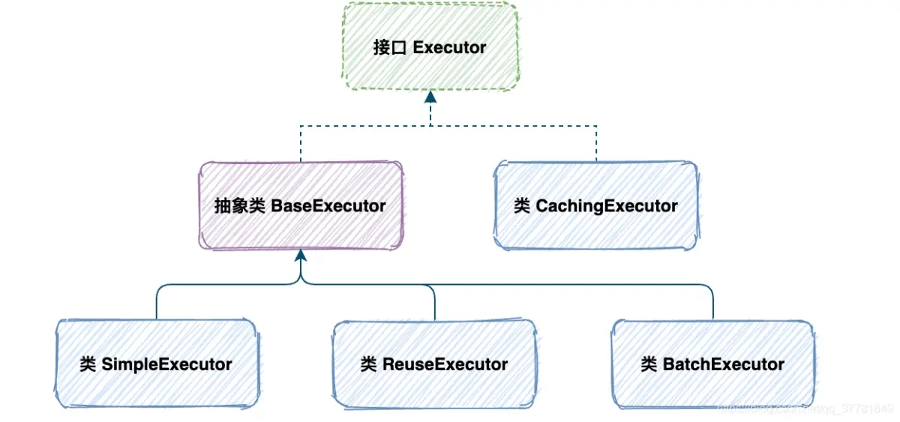

* Executor是Mybatis执行者接口，他包含的功能有：

* 基本功能:改、查，没有增删是因为所有的增删操作都可以归结为改。

* 缓存维护：包括创建缓存Key、清理缓存、判断缓存是否存在。

* 事务管理：提交、回滚、关闭、批处理刷新。

* Executor有6个实现类，这里先介绍三个重要的实现子类。分别是：SimpleExecutor(简单执行器)、ReuseExecutor(重用执行器)、BatchExecutor(批处理执行器)。


> 接口方法

```java

  // 数据更新操作，其中数据的增加、删除、更新均可由该方法实现
  int update(MappedStatement ms, Object parameter) throws SQLException;
  // 数据查询操作，返回结果为列表形式
  <E> List<E> query(MappedStatement ms, Object parameter, RowBounds rowBounds, ResultHandler resultHandler, CacheKey cacheKey, BoundSql boundSql) throws SQLException;
  // 数据查询操作，返回结果为列表形式
  <E> List<E> query(MappedStatement ms, Object parameter, RowBounds rowBounds, ResultHandler resultHandler) throws SQLException;
  // 数据查询操作，返回结果为游标形式
  <E> Cursor<E> queryCursor(MappedStatement ms, Object parameter, RowBounds rowBounds) throws SQLException;
  // 清理缓存
  List<BatchResult> flushStatements() throws SQLException;
  // 提交事务
  void commit(boolean required) throws SQLException;
  // 回滚事务
  void rollback(boolean required) throws SQLException;
  // 创建当前查询的缓存键值
  CacheKey createCacheKey(MappedStatement ms, Object parameterObject, RowBounds rowBounds, BoundSql boundSql);
  // 本地缓存是否有指定值
  boolean isCached(MappedStatement ms, CacheKey key);
  // 清理本地缓存
  void clearLocalCache();
  // 懒加载
  void deferLoad(MappedStatement ms, MetaObject resultObject, String property, CacheKey key, Class<?> targetType);
  // 获取事务
  Transaction getTransaction();
  // 关闭执行器
  void close(boolean forceRollback);
  // 判断执行器是否关闭
  boolean isClosed();
  // 设置执行器包装
  void setExecutorWrapper(Executor executor);
```

* Mybatis默认的执行器，它每处理一次会话当中的sql请求都会通过StatementHandler构建一个新的statment。这个是默认的执行器，很简单，首先让我们来开启日志打印，可以详细的看到不同执行器的执行情况

**配置**

配置文件中开启日志打印

```java
<settings>
        <!-- 打印sql日志 -->
        <setting name="logImpl" value="STDOUT_LOGGING" />
    </settings>
```

**测试代码**

```java
        @Test//简单执行器
    public void simpleTest() throws SQLException {
        // 创建一个简单的执行器
        SimpleExecutor simpleExecutor = new SimpleExecutor(configuration, jdbcTransaction);
        log.info("执行器类型：{}", simpleExecutor.getClass().getName());
        // 执行查询
        List<Object> query = simpleExecutor.doQuery(mappedStatement, 1, RowBounds.DEFAULT, SimpleExecutor.NO_RESULT_HANDLER, mappedStatement.getBoundSql(1));
        log.info("查询结果：{}", query);
    }
```

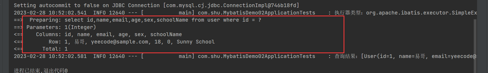

我们可以看到执行结果的返回

**分析**

前面的初始化流程，以及会话工厂的创建，请参考前面的内容，我们这里详细解释执行器，首先我们来看看SimpleExecutor的创建

**SimpleExecutor**

```java
// 构造器
public SimpleExecutor(Configuration configuration, Transaction transaction) {
    super(configuration, transaction);
  }
```

我们可以看到他调用了父类的方法，因此我们来看看他的父类BaseExecutor

**BaseExecutor**

```java
 protected BaseExecutor(Configuration configuration, Transaction transaction) {
    this.transaction = transaction;
    this.deferredLoads = new ConcurrentLinkedQueue<>();
     // 初始化本地缓存，实际上内部维护了一个HashMap
    this.localCache = new PerpetualCache("LocalCache");
    this.localOutputParameterCache = new PerpetualCache("LocalOutputParameterCache");
    this.closed = false;
    this.configuration = configuration;
    this.wrapper = this;
  }
```

下面调用具体的调用方法，doQuery，下面我们只介绍相关步骤，具体的流程前参考前面的文章

**SimpleExecutor**

```java
 @Override
  public <E> List<E> doQuery(MappedStatement ms, Object parameter, RowBounds rowBounds, ResultHandler resultHandler, BoundSql boundSql) throws SQLException {
    Statement stmt = null;
    try {
      // 获取我们解析好的配置文件
      Configuration configuration = ms.getConfiguration();
      // 创建一个隐射处理器
      StatementHandler handler = configuration.newStatementHandler(wrapper, ms, parameter, rowBounds, resultHandler, boundSql);
      // 参数预处理
      stmt = prepareStatement(handler, ms.getStatementLog());
      // 具体执行
      return handler.query(stmt, resultHandler);
    } finally {
      closeStatement(stmt);
    }
  }
```

有兴趣的话，自己去通过源码调试获取结果，下面会仔细解析StatementHandler ，PrepareStatement，ResultSetHandler，TypeHandler

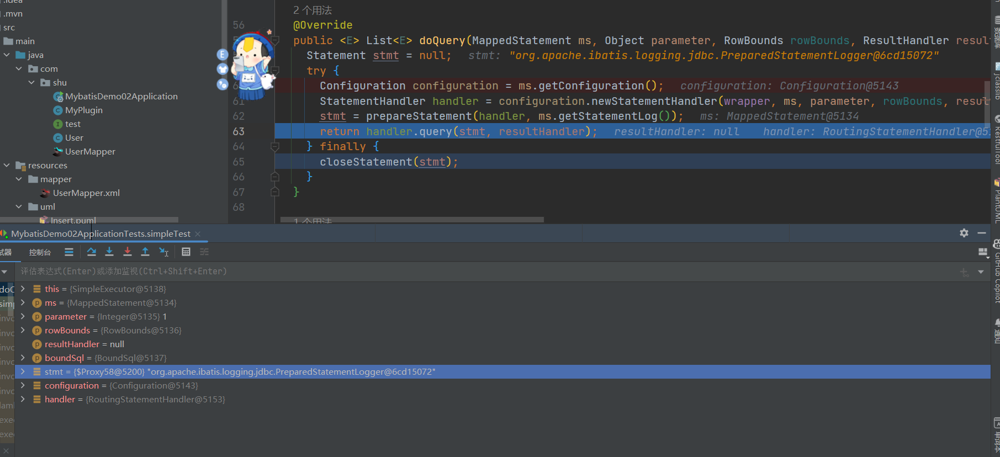

**总结**

* SimpleExecutor 继承了 BaseExecutor 抽象类 它是最简单的 Executor 接口实现。

* Executor 使用了模板方法模式，一级缓存等固定不变的操作都封装到了 BaseExecutor 中，在SimpleExecutor 中就不必再关系一级缓存等操作，只需要专注实现4个基本方法的实现即可。

**&#x20;ReuseExecutor**

* 可重用执行器，内部维护了一个statementMap来记录我们的执行语句，来减少语句的预编译，直观的效果就是，同一次查询，sql预编译了一次，减少Sql的预编译，在一定程度上提高了效率

```java
    @Test//重用执行器
    public void reuseTest() throws SQLException {
        // 创建一个重用执行器
        ReuseExecutor reuseExecutor = new ReuseExecutor(configuration, jdbcTransaction);
        log.info("执行器类型：{}", reuseExecutor.getClass().getName());
        // 执行查询
        List<Object> query = reuseExecutor.doQuery(mappedStatement, 1, RowBounds.DEFAULT, SimpleExecutor.NO_RESULT_HANDLER, mappedStatement.getBoundSql(1));
        log.info("查询结果：{}", query);
        // 执行查询
        List<Object> query2 = reuseExecutor.doQuery(mappedStatement, 1, RowBounds.DEFAULT, SimpleExecutor.NO_RESULT_HANDLER, mappedStatement.getBoundSql(1));
        log.info("查询结果：{}", query2);
    }
```

仔细观察结果，我们可以发现它的Sql预编译了一次

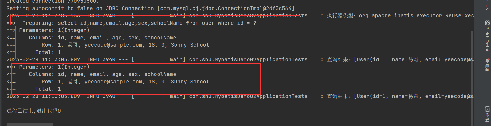

我们来看看为啥只执行了一次，他的原因是啥？

**分析**

**ReuseExecutor**

```java
// 缓存的编译Sql
private final Map<String, Statement> statementMap = new HashMap<>();
// 预处理参数
private Statement prepareStatement(StatementHandler handler, Log statementLog) throws SQLException {
    Statement stmt;
    BoundSql boundSql = handler.getBoundSql();
    String sql = boundSql.getSql();
    // 查询下缓存中是否存在，Sql语句作为Key,查询是否以及与编译过了

    if (hasStatementFor(sql)) {
       // 获取一编译语句

      stmt = getStatement(sql);
        // 更新查询超时以应用事务超时。
      applyTransactionTimeout(stmt);
    } else {
      Connection connection = getConnection(statementLog);
      stmt = handler.prepare(connection, transaction.getTimeout());
      // 添加到缓存

      putStatement(sql, stmt);
    }
    handler.parameterize(stmt);
    return stmt;
  }
  private void putStatement(String sql, Statement stmt) {
    statementMap.put(sql, stmt);
  }
```

* 简单来说：就是内部维护了一个HashMap作为缓存，每次先去缓存中查询一下是否存在，存在就直接返回，没有的话，就在执行预编译，好了再次缓存，以便下次使用

**总结**

重用执行器，相较于 SimpleExecutor 多了 Statement 的缓存功能，其内部维护一个 Map\<String, Statement>，每次编译完成的 Statement 都会进行缓存，不会关闭

**BatchExecutor&#x20;**

* 首先需要明确一点 BachExecutor 是基于 JDBC 的 addBatch、executeBatch 功能的执行器，所以 BachExecutor 只能用于更新（insert|delete|update），不能用于查询（select）

**测试代码**

```java
    @Test//批量执行器
    public void batchTest() throws SQLException {
        // 创建一个批量执行器
        BatchExecutor batchExecutor = new BatchExecutor(configuration, jdbcTransaction);
        log.info("执行器类型：{}", batchExecutor.getClass().getName());
        // 执行插入
        for (int i = 0; i < 10; i++) {
            int update = batchExecutor.doUpdate(mappedStatement, new User(1, "张三", "18", 1 + i, 2, "123456"));
        }
            // 刷新批处理
        batchExecutor.doFlushStatements(true);
    }
```

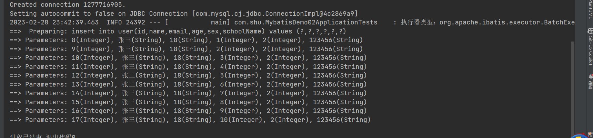

我们来看看的他的执行原理，批量执行，其实依赖于JDBC 的 addBatch、executeBatch

**BatchExecutor**

```java
public class BatchExecutor extends BaseExecutor {
  public static final int BATCH_UPDATE_RETURN_VALUE = Integer.MIN_VALUE + 1002;
  /* Statement链表**/
  private final List<Statement> statementList = new ArrayList<Statement>();

  /* batch结果链表**/
  private final List<BatchResult> batchResultList = new ArrayList<BatchResult>();
  private String currentSql;
  private MappedStatement currentStatement;
  public BatchExecutor(Configuration configuration, Transaction transaction) {
    super(configuration, transaction);
  }
 // 更新方法
  @Override
  public int doUpdate(MappedStatement ms, Object parameterObject) throws SQLException {
        //获得配置信息
    final Configuration configuration = ms.getConfiguration();
        //获得StatementHandler
    final StatementHandler handler = configuration.newStatementHandler(this, ms, parameterObject, RowBounds.DEFAULT, null, null);
    final BoundSql boundSql = handler.getBoundSql();
        //获得Sql语句
    final String sql = boundSql.getSql();
    final Statement stmt;
        //如果sql语句等于当前sql MappedStatement 等于当前Map碰到Statement
    if (sql.equals(currentSql) && ms.equals(currentStatement)) {

      int last = statementList.size() - 1;
          //获得最后一个
      stmt = statementList.get(last);
          handler.parameterize(stmt);//fix Issues 322
          //有相同的MappedStatement和参数
      BatchResult batchResult = batchResultList.get(last);
      batchResult.addParameterObject(parameterObject);
    } else {
          //如果不存在就创建一个批处理操作
      Connection connection = getConnection(ms.getStatementLog());
      stmt = handler.prepare(connection);
      handler.parameterize(stmt);    //fix Issues 322
      currentSql = sql;
      currentStatement = ms;
          //添加批量处理操作
      statementList.add(stmt);
      batchResultList.add(new BatchResult(ms, sql, parameterObject));
    }
  // handler.parameterize(stmt);
    //最终是调用jdbc的批处理操作
    handler.batch(stmt);
    return BATCH_UPDATE_RETURN_VALUE;
  }
  @Override
  public <E> List<E> doQuery(MappedStatement ms, Object parameterObject, RowBounds rowBounds, ResultHandler resultHandler, BoundSql boundSql)
      throws SQLException {
    Statement stmt = null;
    try {
      flushStatements();
          //获得配置信息
      Configuration configuration = ms.getConfiguration();
          //获得StatementHandler
      StatementHandler handler = configuration.newStatementHandler(wrapper, ms, parameterObject, rowBounds, resultHandler, boundSql);
          //获得连接
      Connection connection = getConnection(ms.getStatementLog());
      stmt = handler.prepare(connection);
          //获得Statement
      handler.parameterize(stmt);
      return handler.<E>query(stmt, resultHandler);
    } finally {
      closeStatement(stmt);
    }
  }
  /* 刷新Statement，记录执行次数*/
  @Override
  public List<BatchResult> doFlushStatements(boolean isRollback) throws SQLException {
    try {
      List<BatchResult> results = new ArrayList<BatchResult>();
      if (isRollback) {
        return Collections.emptyList();
      }
          //如果进行了批量处理
      for (int i = 0, n = statementList.size(); i < n; i++) {
        Statement stmt = statementList.get(i);
        BatchResult batchResult = batchResultList.get(i);
        try {
                  //记录批量处理执行操作的条数
          batchResult.setUpdateCounts(stmt.executeBatch());
          MappedStatement ms = batchResult.getMappedStatement();
                  //参数对象集合
          List<Object> parameterObjects = batchResult.getParameterObjects();
                  //生成key
          KeyGenerator keyGenerator = ms.getKeyGenerator();
          if (Jdbc3KeyGenerator.class.equals(keyGenerator.getClass())) {
            Jdbc3KeyGenerator jdbc3KeyGenerator = (Jdbc3KeyGenerator) keyGenerator;
            jdbc3KeyGenerator.processBatch(ms, stmt, parameterObjects);
          } else if (!NoKeyGenerator.class.equals(keyGenerator.getClass())) { //issue #141
            for (Object parameter : parameterObjects) {
              keyGenerator.processAfter(this, ms, stmt, parameter);
            }
          }
        } catch (BatchUpdateException e) {
          StringBuilder message = new StringBuilder();
          message.append(batchResult.getMappedStatement().getId())
              .append(" (batch index #")
              .append(i + 1)
              .append(")")
              .append(" failed.");
          if (i > 0) {
            message.append(" ")
                .append(i)
                .append(" prior sub executor(s) completed successfully, but will be rolled back.");
          }
          throw new BatchExecutorException(message.toString(), e, results, batchResult);
        }
                //记录操作
        results.add(batchResult);
      }
      return results;
    } finally {
      for (Statement stmt : statementList) {
        closeStatement(stmt);
      }
      currentSql = null;
      statementList.clear();
      batchResultList.clear();
    }
  }
 
}
```

**总结**

* BatchExecutor 的批处理添加过程相当于添加了一个没有返回值的**异步任务**，那么在什么时候执行异步任务，将数据更新到数据库呢，答案是处理 update 的任何操作，包括 select、commit、close等任何操作，具体执行的方法就是 **doFlushStatements**；**此外需要注意的是 Batch 方式插入使用 useGeneratedKeys 获取主键，在提交完任务之后，并不能马上取到，因为此时 sql 语句还在缓存中没有真正执行，当执行完 Flush 之后，会通过回调的方式反射设置主键**

**效率对比**

几种执行器效率对比

从上面的结果对比可以看到：

* 整体而言 reuser 比 simple 多了缓存功能，所以无论批处理的大小，其效率都要高一些。

* 此外在批处理量小的时候使用 foreach，效果还是可以的，但是当批量交大时，sql 编译的时间就大大增加了，当 foreach 固定批大小 + reuser 时，每次的 Statement 就可以重用，从表中也可以看到效率也时最高的。

* batch 的优点则是所有的更新语句都能用。

* 所以在配置的时候建议默认使用 reuser，而使用 foreach 和 batch 需要根据具体场景分析，如果更新比较多的时候，可以在批量更新的时候单独指定 ExecutorType.BATCH，如果批量插入很多的时候，可以固定批大小。

**BaseExecutor&#x20;**

* 首先Mybatis默认开启一级缓存，其次，执行器的设计分层遵循了软件设计的 **单一职责** 原则。

* BaseExecutor 只管理一级缓存，而具体的数据库交互逻辑，是交由更低层的三个执行器处理的(Simple/Reuse/Batch)。

**BaseExecutor**

```java
  protected BaseExecutor(Configuration configuration, Transaction transaction) {
    // 事物对象
    this.transaction = transaction;
    // 延迟加载队列
    this.deferredLoads = new ConcurrentLinkedQueue<>();
    // 一级缓存
    this.localCache = new PerpetualCache("LocalCache");
    // 本地输出参数缓存
    this.localOutputParameterCache = new PerpetualCache("LocalOutputParameterCache");
    // 执行器状态标识对象
    this.closed = false;
    // mybatis 配置对象
    this.configuration = configuration;
    this.wrapper = this;
  }
```

* 我们可以通过源码可以发现，PerpetualCache实际上对HashMap的封装

```java
public class PerpetualCache implements Cache {
  // Cache的id，一般为所在的namespace
  private final String id;
  // 用来存储要缓存的信息
  private Map<Object, Object> cache = new HashMap<>();
  public PerpetualCache(String id) {
    this.id = id;
  }
}
```

* 我们来看看查询方法，根据Sql，参数等信息，生成缓存Key在本地缓存中查询是否存在，如果命中，直接返回对象，没有的话，进行数据库查询，将结果写入到缓存中

```java
   /**
更新数据库数据，INSERT/UPDATE/DELETE三种操作都会调用该方法
@param ms 映射语句
@param parameter 参数对象
@return 数据库操作结果
@throws SQLException
*/
@Override
public int update(MappedStatement ms, Object parameter) throws SQLException {
ErrorContext.instance().resource(ms.getResource())
       .activity("executing an update").object(ms.getId());
if (closed) {
 // 执行器已经关闭
 throw new ExecutorException("Executor was closed.");
}
// 清理本地缓存
clearLocalCache();
// 返回调用子类进行操作
return doUpdate(ms, parameter);
}
        /**
执行查询操作
@param ms 映射语句对象
@param parameter 参数对象
@param rowBounds 翻页限制
@param resultHandler 结果处理器
@param <E> 输出结果类型
@return 查询结果
@throws SQLException
*/
@Override
public <E> List<E> query(MappedStatement ms, Object parameter, RowBounds rowBounds, ResultHandler resultHandler) throws SQLException {
BoundSql boundSql = ms.getBoundSql(parameter);
// 生成缓存的键
CacheKey key = createCacheKey(ms, parameter, rowBounds, boundSql);
return query(ms, parameter, rowBounds, resultHandler, key, boundSql);
}
  /**
查询数据库中的数据
@param ms 映射语句
@param parameter 参数对象
@param rowBounds 翻页限制条件
@param resultHandler 结果处理器
@param key 缓存的键
@param boundSql 查询语句
@param <E> 结果类型
@return 结果列表
@throws SQLException
*/
@SuppressWarnings("unchecked")
@Override
public <E> List<E> query(MappedStatement ms, Object parameter, RowBounds rowBounds, ResultHandler resultHandler, CacheKey key, BoundSql boundSql) throws SQLException {
ErrorContext.instance().resource(ms.getResource()).activity("executing a query").object(ms.getId());
if (closed) {
 // 执行器已经关闭
 throw new ExecutorException("Executor was closed.");
}
if (queryStack == 0 && ms.isFlushCacheRequired()) { // 新的查询栈且要求清除缓存
 // 清除一级缓存
 clearLocalCache();
}
List<E> list;
try {
 queryStack++;
 // 尝试从本地缓存获取结果
 list = resultHandler == null ? (List<E>) localCache.getObject(key) : null;
 if (list != null) {
   // 本地缓存中有结果，则对于CALLABLE语句还需要绑定到IN/INOUT参数上
   handleLocallyCachedOutputParameters(ms, key, parameter, boundSql);
 } else {
   // 本地缓存没有结果，故需要查询数据库
   list = queryFromDatabase(ms, parameter, rowBounds, resultHandler, key, boundSql);
 }
} finally {
 queryStack--;
}
if (queryStack == 0) {
 // 懒加载操作的处理
 for (DeferredLoad deferredLoad : deferredLoads) {
   deferredLoad.load();
 }
 deferredLoads.clear();
 // 如果本地缓存的作用域为STATEMENT，则立刻清除本地缓存
 if (configuration.getLocalCacheScope() == LocalCacheScope.STATEMENT) {
   clearLocalCache();
 }
}
return list;
}
```

详细的内容，前参考后面的缓存

**总结**

* BaseExecutor 处于 mybatis 执行器体系的中间层。其设计与实现遵循了 **单一职责** 原则。具体体现在 baseExecutor 主要聚焦在处理一级缓存的逻辑上，而与数据库交互的具体实现依赖于另外三个底层执行器(simple/reuse/batch)。

* 一级缓存默认是开启的，作用域默认会话层级(session)。任意更新操作都会清空一级缓存中的所有数据。一级缓存有一个 mybatis 的自定义实现类

* 影响一级缓存命中的因素有namespaceid，mybatis 分页参数 limit/offset，sql，sql 入参，mybatis 环境配置参数

**&#x20;CachingExecutor**

* CachingExecutor的成员变量有个Executor实例，这显然是个装饰器模式，这的类就是在其他Executor实例的方法进行了flushCacheIfRequired(),也就是刷新缓存，所以这个类在其他类上添加了缓存的功能

* 从query()方法中也能看出先查找缓存，缓存没有再进行调用Executor实例的query()进行数据的查询，首先我们是否开启二级缓存，如果开启了二级缓存，首先会从二级缓存中获取数据

```java
  <cache/>
```

**CachingExecutor**

```java
  /**
更新数据库数据，INSERT/UPDATE/DELETE三种操作都会调用该方法
@param ms 映射语句
@param parameterObject 参数对象
@return 数据库操作结果
@throws SQLException
*/
@Override
public int update(MappedStatement ms, Object parameterObject) throws SQLException {
// 根据要求判断语句执行前是否要清除二级缓存，如果需要，清除二级缓存
flushCacheIfRequired(ms);
return delegate.update(ms, parameterObject);
}
  @Override
  public <E> List<E> query(MappedStatement ms, Object parameterObject, RowBounds rowBounds, ResultHandler resultHandler) throws SQLException {
    BoundSql boundSql = ms.getBoundSql(parameterObject);
    CacheKey key = createCacheKey(ms, parameterObject, rowBounds, boundSql);
    return query(ms, parameterObject, rowBounds, resultHandler, key, boundSql);
  }
  @Override
  public <E> Cursor<E> queryCursor(MappedStatement ms, Object parameter, RowBounds rowBounds) throws SQLException {
    flushCacheIfRequired(ms);
    return delegate.queryCursor(ms, parameter, rowBounds);
  }
  /**
查询数据库中的数据
@param ms 映射语句
@param parameterObject 参数对象
@param rowBounds 翻页限制条件
@param resultHandler 结果处理器
@param key 缓存的键
@param boundSql 查询语句
@param <E> 结果类型
@return 结果列表
@throws SQLException
*/
@Override
public <E> List<E> query(MappedStatement ms, Object parameterObject, RowBounds rowBounds, ResultHandler resultHandler, CacheKey key, BoundSql boundSql)
 throws SQLException {
// 获取MappedStatement对应的缓存，可能的结果有：该命名空间的缓存、共享的其它命名空间的缓存、无缓存
Cache cache = ms.getCache();
// 如果映射文件未设置<cache>或<cache-ref>则，此处cache变量为null
if (cache != null) { // 存在缓存
 // 根据要求判断语句执行前是否要清除二级缓存，如果需要，清除二级缓存
 flushCacheIfRequired(ms);
 if (ms.isUseCache() && resultHandler == null) { // 该语句使用缓存且没有输出结果处理器
   // 二级缓存不支持含有输出参数的CALLABLE语句，故在这里进行判断
   ensureNoOutParams(ms, boundSql);
   // 从缓存中读取结果
   @SuppressWarnings("unchecked")
   List<E> list = (List<E>) tcm.getObject(cache, key);
   if (list == null) { // 缓存中没有结果
     // 交给被包装的执行器执行
     list = delegate.query(ms, parameterObject, rowBounds, resultHandler, key, boundSql);
     // 缓存被包装执行器返回的结果
     tcm.putObject(cache, key, list); // issue #578 and #116
   }
   return list;
 }
}
// 交由被包装的实际执行器执行
return delegate.query(ms, parameterObject, rowBounds, resultHandler, key, boundSql);
}
```

**TransactionalCacheManager**

```java
public class TransactionalCacheManager {
  // 管理多个缓存的映射
  private final Map<Cache, TransactionalCache> transactionalCaches = new HashMap<>();
}
```

**TransactionalCache**

```java
public class TransactionalCache implements Cache {
  private static final Log log = LogFactory.getLog(TransactionalCache.class);
  // 被装饰的对象
  private final Cache delegate;
  // 事务提交后是否直接清理缓存
  private boolean clearOnCommit;
  // 事务提交时需要写入缓存的数据
  private final Map<Object, Object> entriesToAddOnCommit;
  // 缓存查询未命中的数据
  private final Set<Object> entriesMissedInCache;
  public TransactionalCache(Cache delegate) {
    this.delegate = delegate;
    this.clearOnCommit = false;
    this.entriesToAddOnCommit = new HashMap<>();
    this.entriesMissedInCache = new HashSet<>();
  }
}
```

* 实际上二级缓存的实现调用了事务管理器的TransactionalCacheManager进行管理，从源码上看实际上维护了一个TransactionalCache中的HashMap来管理。具体的内容请参考前面的二级缓存

* 存储二级缓存对象的时候是放到TransactionalCache.entriesToAddOnCommit这个map中，但是每次查询的时候是直接从TransactionalCache.delegate中去查询的，所以这个二级缓存查询数据库后，设置缓存值是没有立刻生效的，主要是因为直接存到 delegate 会导致脏数据问题。

**执行器执行查询**

```java
 /**
   * 查询数据库中的数据
   * @param ms 映射语句
   * @param parameterObject 参数对象
   * @param rowBounds 翻页限制条件
   * @param resultHandler 结果处理器
   * @param key 缓存的键
   * @param boundSql 查询语句
   * @param <E> 结果类型
   * @return 结果列表
   * @throws SQLException
   */
  @Override
  public <E> List<E> query(MappedStatement ms, Object parameterObject, RowBounds rowBounds, ResultHandler resultHandler, CacheKey key, BoundSql boundSql)
      throws SQLException {
    // 获取MappedStatement对应的缓存，可能的结果有：该命名空间的缓存、共享的其它命名空间的缓存、无缓存
    Cache cache = ms.getCache();
    // 如果映射文件未设置<cache>或<cache-ref>则，此处cache变量为null
    if (cache != null) { // 存在缓存
      // 根据要求判断语句执行前是否要清除二级缓存，如果需要，清除二级缓存
      flushCacheIfRequired(ms);
      if (ms.isUseCache() && resultHandler == null) { // 该语句使用缓存且没有输出结果处理器
        // 二级缓存不支持含有输出参数的CALLABLE语句，故在这里进行判断
        ensureNoOutParams(ms, boundSql);
        // 从缓存中读取结果
        @SuppressWarnings("unchecked")
        List<E> list = (List<E>) tcm.getObject(cache, key);
        if (list == null) { // 缓存中没有结果
          // 交给被包装的执行器执行
          list = delegate.query(ms, parameterObject, rowBounds, resultHandler, key, boundSql);
          // 缓存被包装执行器返回的结果
          tcm.putObject(cache, key, list); // issue #578 and #116
        }
        return list;
      }
    }
    // 交由被包装的实际执行器执行
    return delegate.query(ms, parameterObject, rowBounds, resultHandler, key, boundSql);
  }

```

**SimpleExecutor**

```java
/**
   * 查询数据库中的数据
   * @param ms 映射语句
   * @param parameter 参数对象
   * @param rowBounds 翻页限制条件
   * @param resultHandler 结果处理器
   * @param key 缓存的键
   * @param boundSql 查询语句
   * @param <E> 结果类型
   * @return 结果列表
   * @throws SQLException
   */
  @SuppressWarnings("unchecked")
  @Override
  public <E> List<E> query(MappedStatement ms, Object parameter, RowBounds rowBounds, ResultHandler resultHandler, CacheKey key, BoundSql boundSql) throws SQLException {
    ErrorContext.instance().resource(ms.getResource()).activity("executing a query").object(ms.getId());
    if (closed) {
      // 执行器已经关闭
      throw new ExecutorException("Executor was closed.");
    }
    if (queryStack == 0 && ms.isFlushCacheRequired()) { // 新的查询栈且要求清除缓存
      // 清除一级缓存
      clearLocalCache();
    }
    List<E> list;
    try {
      queryStack++;
      // 尝试从本地缓存获取结果
      list = resultHandler == null ? (List<E>) localCache.getObject(key) : null;
      if (list != null) {
        // 本地缓存中有结果，则对于CALLABLE语句还需要绑定到IN/INOUT参数上
        handleLocallyCachedOutputParameters(ms, key, parameter, boundSql);
      } else {
        // 本地缓存没有结果，故需要查询数据库
        list = queryFromDatabase(ms, parameter, rowBounds, resultHandler, key, boundSql);
      }
    } finally {
      queryStack--;
    }
    if (queryStack == 0) {
      // 懒加载操作的处理
      for (DeferredLoad deferredLoad : deferredLoads) {
        deferredLoad.load();
      }
      deferredLoads.clear();
      // 如果本地缓存的作用域为STATEMENT，则立刻清除本地缓存
      if (configuration.getLocalCacheScope() == LocalCacheScope.STATEMENT) {
        clearLocalCache();
      }
    }
    return list;
  }

```

* 从一级缓存中查找查询结果。若缓存未命中，再向数据库进行查询。至此我们明白了一级二级缓存的大概思路，先从二级缓存中查找，若未命中二级缓存，再从一级缓存中查找，若未命中一级缓存，再从数据库查询数据，那我们来看看是怎么从数据库查询的。

**SimpleExecutor**

```java
 /**
   * 从数据库中查询结果
   * @param ms 映射语句
   * @param parameter 参数对象
   * @param rowBounds 翻页限制条件
   * @param resultHandler 结果处理器
   * @param key 缓存的键
   * @param boundSql 查询语句
   * @param <E> 结果类型
   * @return 结果列表
   * @throws SQLException
   */
  private <E> List<E> queryFromDatabase(MappedStatement ms, Object parameter, RowBounds rowBounds, ResultHandler resultHandler, CacheKey key, BoundSql boundSql) throws SQLException {
    List<E> list;
    // 向缓存中增加占位符，表示正在查询
    localCache.putObject(key, EXECUTION_PLACEHOLDER);
    try {
      list = doQuery(ms, parameter, rowBounds, resultHandler, boundSql);
    } finally {
      // 删除占位符
      localCache.removeObject(key);
    }
    // 将查询结果写入缓存
    localCache.putObject(key, list);
    if (ms.getStatementType() == StatementType.CALLABLE) {
      localOutputParameterCache.putObject(key, parameter);
    }
    return list;
  }


```

* 调用了**doQuery**方法进行查询，最后将查询结果放入一级缓存，我们来看看doQuery,在SimpleExecutor中

**SimpleExecutor**

```java
public <E> List<E> doQuery(MappedStatement ms, Object parameter, RowBounds rowBounds, ResultHandler resultHandler, BoundSql boundSql) throws SQLException {
    Statement stmt = null;
    try {
        Configuration configuration = ms.getConfiguration();
        // 创建 StatementHandler
        StatementHandler handler = configuration.newStatementHandler(wrapper, ms, parameter, rowBounds, resultHandler, boundSql);
        // 创建 Statement
        stmt = prepareStatement(handler, ms.getStatementLog());
        // 执行查询操作
        return handler.<E>query(stmt, resultHandler);
    } finally {
        // 关闭 Statement
        closeStatement(stmt);
    }
}

```

* 我们可以看到ResultHandler 最后进过处理，返回结构，下面我们来介绍一下Mybatis参数的处理

### 2.4.3 StatmentHandler源码分析

* StatementHandler 是四大组件中最重要的一个对象，负责操作 Statement 对象与数据库进行交流，在工作时还会使用 ParameterHandler 和 ResultSetHandler 对参数进行映射，对结果进行实体类的绑定

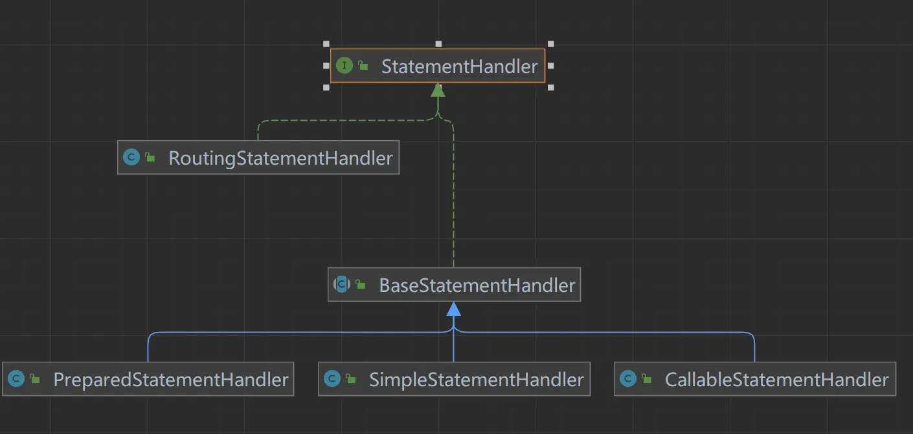

**接口方法**

**StatementHandler**

```java
public interface StatementHandler {

  // 从Connection中创建一个Statement
  Statement prepare(Connection connection, Integer transactionTimeout)
      throws SQLException;

  // 为Statement绑定实参
  void parameterize(Statement statement)
      throws SQLException;

  // 批量执行操作
  void batch(Statement statement)
      throws SQLException;

  // 执行增、删、改操作
  int update(Statement statement)
      throws SQLException;

  // 执行查找操作，返回list
  <E> List<E> query(Statement statement, ResultHandler resultHandler)
      throws SQLException;

  // 执行查询操作，返回迭代游标
  <E> Cursor<E> queryCursor(Statement statement)
      throws SQLException;

  // 获取BoundSql对象
  BoundSql getBoundSql();

  // 获取参数处理器
  ParameterHandler getParameterHandler();

}
```

**StatementHandler 接口**

`StatementHandler` 接口负责处理与 `PreparedStatement` 或 `CallableStatement` 相关的事务，比如创建 SQL 语句、设置参数以及执行查询或更新操作。它与 `Executor` 接口紧密相关，因为 `Executor` 负责执行 SQL 语句，而 `StatementHandler` 则负责处理具体的 SQL 语句和参数。

**RoutingStatementHandler**

`RoutingStatementHandler` 类并不是直接处理 `Statement` 对象，而是根据 `StatementType`（`STATEMENT`, `PREPARED`, 或 `CALLABLE`）创建一个代理对象，该代理对象指向具体的 `StatementHandler` 实现。这意味着 `RoutingStatementHandler` 本身并不直接执行 SQL 语句，而是作为适配器来决定使用哪种类型的 `StatementHandler`。

**BaseStatementHandler**

`BaseStatementHandler` 是一个抽象类，它实现了 `StatementHandler` 接口，并提供了通用的行为和方法，以简化具体 `StatementHandler` 实现类的开发。它包含了基本的 SQL 执行逻辑，并提供了处理 `Statement` 对象的基础框架。

**具体实现类**

* **SimpleStatementHandler**: 这个类负责处理不需要预编译的 SQL 语句，即使用普通的 `Statement` 对象来执行 SQL。通常用于执行简单的 SQL 查询或更新操作。

* **PreparedStatementHandler**: 这个类用于处理需要预编译的 SQL 语句，即使用 `PreparedStatement` 对象。预编译 SQL 语句可以提高性能，并有助于防止 SQL 注入攻击。

* **CallableStatementHandler**: 这个类用于调用数据库中的存储过程，它使用 `CallableStatement` 对象来执行 SQL。

**设计模式**

`BaseStatementHandler` 和它的实现类遵循了适配器模式（Adapter Pattern），其中 `BaseStatementHandler` 作为适配器，将具体的 `StatementHandler` 实现类（如 `SimpleStatementHandler`, `PreparedStatementHandler`, 和 `CallableStatementHandler`）统一到 `StatementHandler` 接口下，以便于 `RoutingStatementHandler` 可以根据不同的 `StatementType` 来选择使用正确的 `StatementHandler`。

**工作流程**

1. **初始化阶段**:

   * `RoutingStatementHandler` 被创建，它根据 `StatementType` 创建一个具体的 `StatementHandler` 实现类的代理。

2. **执行阶段**:

   * `Executor` 调用 `RoutingStatementHandler` 的方法来执行 SQL 语句。

   * `RoutingStatementHandler` 调用其代理的具体 `StatementHandler` 实现类的方法来处理 SQL 语句。

   * 具体的 `StatementHandler` 实现类处理 SQL 语句和参数，并通过 JDBC API 与数据库交互。

**SimpleExecutor**

```java

  @Override
  public int doUpdate(MappedStatement ms, Object parameter) throws SQLException {
    Statement stmt = null;
    try {
       // 获取解析好的配置文件 
      Configuration configuration = ms.getConfiguration();
        // 获取一个处理器对象
      StatementHandler handler = configuration.newStatementHandler(this, ms, parameter, RowBounds.DEFAULT, null, null);
       // 调用处理器的方法返回一个 Statement
      stmt = prepareStatement(handler, ms.getStatementLog());
      return handler.update(stmt);
    } finally {
      closeStatement(stmt);
    }
  }
```

**Configuration**

* 好的我们看到了关键代码，我们下面看看：

```java
  public StatementHandler newStatementHandler(Executor executor, MappedStatement mappedStatement, Object parameterObject, RowBounds rowBounds, ResultHandler resultHandler, BoundSql boundSql) {
       //  策越模式
      StatementHandler statementHandler = new RoutingStatementHandler(executor, mappedStatement, parameterObject, rowBounds, resultHandler, boundSql);
      //  插件
      statementHandler = (StatementHandler) interceptorChain.pluginAll(statementHandler);
    return statementHandler;
  }
```

**RoutingStatementHandler**

```java
  // 根据语句类型选取出的被代理类的对象
  private final StatementHandler delegate;
  
  public RoutingStatementHandler(Executor executor, MappedStatement ms, Object parameter, RowBounds rowBounds, ResultHandler resultHandler, BoundSql boundSql) {
    // 根据语句类型选择被代理对象
    switch (ms.getStatementType()) {
      case STATEMENT:
        delegate = new SimpleStatementHandler(executor, ms, parameter, rowBounds, resultHandler, boundSql);
        break;
      case PREPARED:
        delegate = new PreparedStatementHandler(executor, ms, parameter, rowBounds, resultHandler, boundSql);
        break;
      case CALLABLE:
        delegate = new CallableStatementHandler(executor, ms, parameter, rowBounds, resultHandler, boundSql);
        break;
      default:
        throw new ExecutorException("Unknown statement type: " + ms.getStatementType());
    }
  }
```

* 然后根据我们配置文件中的类型，来创建不同的对象返回，当然默认值为PREPARED一个需要预编译的Sql

要定义了从Connection中获取Statement的方法，而对于具体的Statement操作则未定义，主要采用适配器模式来实现，下面我们来看看调用过程吧，首先是构造器实例化在这其中初始化了后面的两大重要组件：ParameterHandler与ResultSetHandler，具体的实现我们后面再看

**BaseStatementHandler**

```java
  protected BaseStatementHandler(Executor executor, MappedStatement mappedStatement, Object parameterObject, RowBounds rowBounds, ResultHandler resultHandler, BoundSql boundSql) {
    this.configuration = mappedStatement.getConfiguration();
    this.executor = executor;
    this.mappedStatement = mappedStatement;
    this.rowBounds = rowBounds;
    
    this.typeHandlerRegistry = configuration.getTypeHandlerRegistry();
    this.objectFactory = configuration.getObjectFactory();

    if (boundSql == null) { // issue #435, get the key before calculating the statement
      // 如果是前置主键自增，则在这里进行获得自增的键值
      generateKeys(parameterObject);
      // 获取BoundSql对象
      boundSql = mappedStatement.getBoundSql(parameterObject);
    }

    this.boundSql = boundSql;
    // 参数处理器
    this.parameterHandler = configuration.newParameterHandler(mappedStatement, parameterObject, boundSql);
    // 结果处理器
    this.resultSetHandler = configuration.newResultSetHandler(executor, mappedStatement, rowBounds, parameterHandler, resultHandler, boundSql);
  }
```

* 我们再来梳理一下Jdbc的执行流程：

1. 从Connection获取一个Statement

2. 为Statement设置参数

* 那我们来看看他是怎样获取的一个Statement的？

**BaseStatementHandler**

```java
  // 从连接中获取一个Statement，并设置事务超时时间
  @Override
  public Statement prepare(Connection connection, Integer transactionTimeout) throws SQLException {
    ErrorContext.instance().sql(boundSql.getSql());
    Statement statement = null;
    try {
       // 实际上他还是调用他的实现类类  
      statement = instantiateStatement(connection);
      //  设置超时时间
      setStatementTimeout(statement, transactionTimeout);
       // 读取大小 
      setFetchSize(statement);
      return statement;
    } catch (SQLException e) {
      closeStatement(statement);
      throw e;
    } catch (Exception e) {
      closeStatement(statement);
      throw new ExecutorException("Error preparing statement.  Cause: " + e, e);
    }
  }

  // 从Connection中实例化Statement
  protected abstract Statement instantiateStatement(Connection connection) throws SQLException;
```

* 到这就可能涉及到驱动包的源码的知识，这部分我们不会多讲，我们只是梳理Mybatis的执行过程，下面我们PreparedStatementHandler以基本的案例为例

**PreparedStatementHandler**

```java
  @Override
  protected Statement instantiateStatement(Connection connection) throws SQLException {
    String sql = boundSql.getSql();
     // 自增主键     
    if (mappedStatement.getKeyGenerator() instanceof Jdbc3KeyGenerator) {
      String[] keyColumnNames = mappedStatement.getKeyColumns();
      if (keyColumnNames == null) {
         // 调用   
        return connection.prepareStatement(sql, PreparedStatement.RETURN_GENERATED_KEYS);
      } else {
        return connection.prepareStatement(sql, keyColumnNames);
      }
    } else if (mappedStatement.getResultSetType() == ResultSetType.DEFAULT) {
      return connection.prepareStatement(sql);
    } else {
      return connection.prepareStatement(sql, mappedStatement.getResultSetType().getValue(), ResultSet.CONCUR_READ_ONLY);
    }
  }
```

这段代码主要用于处理自动生成主键的情况，以及根据 `ResultSetType` 来创建 `PreparedStatement`。下面是这段代码的详细解释：

**获取 SQL 语句**

```java
String sql = boundSql.getSql();
```

这里获取了绑定到当前 `StatementHandler` 的 SQL 语句。

**主键的情况**

```java
if (mappedStatement.getKeyGenerator() instanceof Jdbc3KeyGenerator) {
  String[] keyColumnNames = mappedStatement.getKeyColumns();
  if (keyColumnNames == null) {
    return connection.prepareStatement(sql, PreparedStatement.RETURN_GENERATED_KEYS);
  } else {
    return connection.prepareStatement(sql, keyColumnNames);
  }
}
```

这段代码检查 `MappedStatement` 的 `KeyGenerator` 是否为 `Jdbc3KeyGenerator`。如果是，那么它会根据是否指定了主键列名来创建 `PreparedStatement`。

* 如果没有指定主键列名 (`keyColumnNames` 为 `null`)，则使用 `PreparedStatement.RETURN_GENERATED_KEYS` 创建 `PreparedStatement`。这表示在执行完插入操作后，可以通过 `getGeneratedKeys()` 方法获取自动生成的主键。

* 如果指定了主键列名，则使用这些列名创建 `PreparedStatement`。这允许指定多个生成的主键列。

**根据 `ResultSetType` 创建 `PreparedStatement`**

```java
else if (mappedStatement.getResultSetType() == ResultSetType.DEFAULT) {
  return connection.prepareStatement(sql);
} else {
  return connection.prepareStatement(sql, mappedStatement.getResultSetType().getValue(), ResultSet.CONCUR_READ_ONLY);
}
```

如果 `KeyGenerator` 不是 `Jdbc3KeyGenerator`，则根据 `ResultSetType` 来创建 `PreparedStatement`。

* 如果 `ResultSetType` 为 `DEFAULT`，则简单地创建 `PreparedStatement`。

* 否则，使用指定的 `ResultSetType` 和 `CONCUR_READ_ONLY` 创建 `PreparedStatement`。这通常用于只读查询，以提高性能。

* 后续就交给Java JDBC API，`connection.prepareStatement` 方法是 Java JDBC API 中用于创建 `PreparedStatement` 对象的方法。这个方法允许你在数据库连接上准备一条预编译的 SQL 语句。预编译 SQL 语句的好处包括提高性能（因为 SQL 语句只需要解析一次），防止 SQL 注入攻击，以及在某些情况下支持更高级的功能，如批处理和存储过程调用。

* `connection.prepareStatement` 方法是 Java JDBC API 中用于创建 `PreparedStatement` 对象的方法。这个方法允许你在数据库连接上准备一条预编译的 SQL 语句。预编译 SQL 语句的好处包括提高性能（因为 SQL 语句只需要解析一次），防止 SQL 注入攻击，以及在某些情况下支持更高级的功能，如批处理和存储过程调用。

**方法签名：**

1. **创建基本的&#x20;**`**PreparedStatement**`:

   ```java
   PreparedStatement preparedStatement = connection.prepareStatement(sql);
   ```

   这个方法创建一个 `PreparedStatement` 对象，用于执行给定的 SQL 语句。

2. **创建带返回生成键的&#x20;**`**PreparedStatement**`:

   ```java
   PreparedStatement preparedStatement = connection.prepareStatement(sql, int autoGeneratedKeys);
   ```

   这个方法创建一个 `PreparedStatement` 对象，用于执行给定的 SQL 语句，并返回由 SQL 语句生成的键。`autoGeneratedKeys` 参数可以是以下常量之一：

   * `Statement.RETURN_GENERATED_KEYS`: 请求生成的键被返回。

   * `Statement.NO_GENERATED_KEYS`: 不请求任何生成的键。

3) **创建带指定列名的&#x20;**`PreparedStatement`:

   ```java
   PreparedStatement preparedStatement = connection.prepareStatement(sql, String[] columnNames);
   ```

   这个方法创建一个 `PreparedStatement` 对象，用于执行给定的 SQL 语句，并返回由 SQL 语句生成的键。`columnNames` 是一个包含要返回的键的列名的数组。

4) **创建带指定列索引的&#x20;**`PreparedStatement`:

   ```java
   PreparedStatement preparedStatement = connection.prepareStatement(sql, int[] columnIndexes);
   ```

   这个方法创建一个 `PreparedStatement` 对象，用于执行给定的 SQL 语句，并返回由 SQL 语句生成的键。`columnIndexes` 是一个包含要返回的键的列索引的数组。

5. **创建带结果集类型的&#x20;**`**PreparedStatement**`:

   ```java
   PreparedStatement preparedStatement = connection.prepareStatement(sql, int resultSetType, int resultSetConcurrency);
   ```

   这个方法创建一个 `PreparedStatement` 对象，用于执行给定的 SQL 语句，并指定结果集的类型和并发模式。`resultSetType` 可以是以下常量之一：

   * `ResultSet.TYPE_FORWARD_ONLY`: 结果集只能向前滚动。

   * `ResultSet.TYPE_SCROLL_INSENSITIVE`: 结果集可以双向滚动，但不敏感于外部更改。

   * `ResultSet.TYPE_SCROLL_SENSITIVE`: 结果集可以双向滚动，并且敏感于外部更改。

   `resultSetConcurrency` 可以是以下常量之一：

   * `ResultSet.CONCUR_READ_ONLY`: 结果集只读。

   * `ResultSet.CONCUR_UPDATABLE`: 结果即可更新。

**示例**

假设我们有一个插入语句，并且想要获取自动生成的主键：

```java
String sql = "INSERT INTO my_table (name, age) VALUES (?, ?)";
PreparedStatement preparedStatement = connection.prepareStatement(sql, Statement.RETURN_GENERATED_KEYS);
preparedStatement.setString(1, "John Doe");
preparedStatement.setInt(2, 30);
preparedStatement.executeUpdate();

// 获取生成的键
try (ResultSet generatedKeys = preparedStatement.getGeneratedKeys()) {
  if (generatedKeys.next()) {
    int id = generatedKeys.getInt(1);
    System.out.println("Generated ID: " + id);
  }
}
```

**BaseStatementHandler**

```java
public Statement prepare(Connection connection, Integer transactionTimeout) throws SQLException {
  ErrorContext.instance().sql(boundSql.getSql());
  Statement statement = null;
  try {
    statement = instantiateStatement(connection);
    setStatementTimeout(statement, transactionTimeout);
    setFetchSize(statement);
    return statement;
  } catch (SQLException e) {
    closeStatement(statement);
    throw e;
  } catch (Exception e) {
    closeStatement(statement);
    throw new ExecutorException("Error preparing statement.  Cause: " + e, e);
  }
}
```

### 2.4.4 ParameterHandler源码分析

* 上面我们介绍了StatementHandler 组件最主要的作用在于创建 Statement 对象与数据库进行交流，还会使用 ParameterHandler 进行参数配置，使用 ResultSetHandler 把查询结果与实体类进行绑定。

**案例**

假设你有一个 SQL 映射文件中的 `insert` 语句如下：

```xml
<insert id="insertUser" parameterType="com.example.User">
  INSERT INTO t_user (id, name) VALUES (?, ?)
</insert>
```

对应的 Java 代码可能如下所示：

```java
User user = new User(1, "孙帅");
sqlSession.insert("com.example.mapper.UserMapper.insertUser", user);
```

* MyBatis 会在内部创建一个 `ParameterHandler` 实例，并使用它来设置 SQL 语句中的参数。`ParameterHandler` 会将 `user` 对象中的 `id` 和 `name` 属性分别绑定到 SQL 语句的两个问号位置。

**创建时机**

**BaseStatementHandler**

```java
   protected BaseStatementHandler(Executor executor, MappedStatement mappedStatement, Object parameterObject, RowBounds rowBounds, ResultHandler resultHandler, BoundSql boundSql) {
    this.configuration = mappedStatement.getConfiguration();
    this.executor = executor;
    this.mappedStatement = mappedStatement;
    this.rowBounds = rowBounds;
    
    this.typeHandlerRegistry = configuration.getTypeHandlerRegistry();
    this.objectFactory = configuration.getObjectFactory();

    if (boundSql == null) { // issue #435, get the key before calculating the statement
      // 如果是前置主键自增，则在这里进行获得自增的键值
      generateKeys(parameterObject);
      // 获取BoundSql对象
      boundSql = mappedStatement.getBoundSql(parameterObject);
    }

    this.boundSql = boundSql;
    // 参数处理器
    this.parameterHandler = configuration.newParameterHandler(mappedStatement, parameterObject, boundSql);
    // 结果处理器
    this.resultSetHandler = configuration.newResultSetHandler(executor, mappedStatement, rowBounds, parameterHandler, resultHandler, boundSql);
  }
```

**ParameterHandler**

```java
public interface ParameterHandler {

  // 获取参数对象
  Object getParameterObject();

  // 设置参数对象
  void setParameters(PreparedStatement ps)
      throws SQLException;
}

```

* 下面我们来看看他的实现类，注意ParameterHandler的创建时机在BaseStatementHandler的初始化的时候

**DefaultParameterHandler**

```java
public class DefaultParameterHandler implements ParameterHandler {

  // 类型处理器注册表
  private final TypeHandlerRegistry typeHandlerRegistry;
  // MappedStatement对象（包含完整的增删改查节点信息）
  private final MappedStatement mappedStatement;
  // 参数对象
  private final Object parameterObject;
  // BoundSql对象（包含SQL语句、参数、实参信息）
  private final BoundSql boundSql;
  // 配置信息
  private final Configuration configuration;

  public DefaultParameterHandler(MappedStatement mappedStatement, Object parameterObject, BoundSql boundSql) {
    this.mappedStatement = mappedStatement;
    this.configuration = mappedStatement.getConfiguration();
    this.typeHandlerRegistry = mappedStatement.getConfiguration().getTypeHandlerRegistry();
    this.parameterObject = parameterObject;
    this.boundSql = boundSql;
  }

  @Override
  public Object getParameterObject() {
    return parameterObject;
  }

  /**
   * 为语句设置参数
   * @param ps 语句
   */
  @Override
  public void setParameters(PreparedStatement ps) {
    ErrorContext.instance().activity("setting parameters").object(mappedStatement.getParameterMap().getId());
    // 取出参数列表
    List<ParameterMapping> parameterMappings = boundSql.getParameterMappings();
    if (parameterMappings != null) {
      for (int i = 0; i < parameterMappings.size(); i++) {
        ParameterMapping parameterMapping = parameterMappings.get(i);
        // ParameterMode.OUT是CallableStatement的输出参数，已经单独注册。故忽略
        if (parameterMapping.getMode() != ParameterMode.OUT) {
          Object value;
          // 取出属性名称
          String propertyName = parameterMapping.getProperty();
          if (boundSql.hasAdditionalParameter(propertyName)) {
            // 从附加参数中读取属性值
            value = boundSql.getAdditionalParameter(propertyName);
          } else if (parameterObject == null) {
            value = null;
          } else if (typeHandlerRegistry.hasTypeHandler(parameterObject.getClass())) {
            // 参数对象是基本类型，则参数对象即为参数值
            value = parameterObject;
          } else {
            // 参数对象是复杂类型，取出参数对象的该属性值
            MetaObject metaObject = configuration.newMetaObject(parameterObject);
            value = metaObject.getValue(propertyName);
          }
          // 确定该参数的处理器
          TypeHandler typeHandler = parameterMapping.getTypeHandler();
          JdbcType jdbcType = parameterMapping.getJdbcType();
          if (value == null && jdbcType == null) {
            jdbcType = configuration.getJdbcTypeForNull();
          }
          try {
            // 此方法最终根据参数类型，调用java.sql.PreparedStatement类中的参数赋值方法，对SQL语句中的参数赋值
            typeHandler.setParameter(ps, i + 1, value, jdbcType);
          } catch (TypeException | SQLException e) {
            throw new TypeException("Could not set parameters for mapping: " + parameterMapping + ". Cause: " + e, e);
          }
        }
      }
    }
  }

}

```

### 2.4.5 TypeHandler源码分析

`TypeHandler` 接口及其实现类负责处理 Java 对象与数据库列之间的类型转换。`TypeHandler` 是 MyBatis 中非常重要的组件之一，它确保了 Java 应用程序与数据库之间类型转换的正确性。

**TypeHandler 接口定义**

**TypeHandler**

```java
public interface TypeHandler<T> {

  void setParameter(PreparedStatement ps, int i, T parameter, JdbcType jdbcType) throws SQLException;

  T getResult(ResultSet rs, String columnName) throws SQLException;

  T getResult(ResultSet rs, int columnIndex) throws SQLException;

  T getResult(CallableStatement cs, int columnIndex) throws SQLException;

}
```

**TypeHandler 的工作流程**

1. 注册 TypeHandler: MyBatis 允许用户注册自定义的 `TypeHandler`，也可以使用内置的 `TypeHandler`。

2. 获取 TypeHandler: 当执行 SQL 语句时，MyBatis 会根据 Java 类型或数据库列类型查找相应的 `TypeHandler`。

3. 设置参数: 在执行 SQL 语句之前，`TypeHandler` 通过 `setNonNullParameter` 方法将 Java 对象设置到 `PreparedStatement` 中。

4. 获取结果: 在执行查询后，`TypeHandler` 通过 `getParameter` 方法从 `ResultSet` 中获取 Java 对象。

**TypeHandler 的实现**

* MyBatis 提供了多种内置的 `TypeHandler` 实现，例如 `IntegerTypeHandler`, `LongTypeHandler`, `StringTypeHandler` 等。此外，用户还可以自定义 `TypeHandler` 来处理特定的数据类型。

* 在 MyBatis 中，`TypeHandler` 接口及其实现类负责处理 Java 对象与数据库列之间的类型转换。`TypeHandler` 是 MyBatis 中非常重要的组件之一，它确保了 Java 应用程序与数据库之间类型转换的正确性。

**IntegerTypeHandler 实现**

假设我们正在使用 `IntegerTypeHandler` 来处理 `Integer` 类型的数据。

```java
public class IntegerTypeHandler extends BaseTypeHandler<Integer> {

  @Override
  public void setNonNullParameter(PreparedStatement ps, int i, Integer parameter, JdbcType jdbcType) throws SQLException {
    ps.setInt(i, parameter);
  }

  @Override
  public Integer getNullableResult(ResultSet rs, String columnName) throws SQLException {
    return rs.getInt(columnName);
  }

  @Override
  public Integer getNullableResult(ResultSet rs, int columnIndex) throws SQLException {
    return rs.getInt(columnIndex);
  }

  @Override
  public Integer getNullableResult(CallableStatement cs, int columnIndex) throws SQLException {
    return cs.getInt(columnIndex);
  }
}
```

**分析**

1. **setNonNullParameter**: 此方法用于将 Java 对象设置到 `PreparedStatement` 中。在这个例子中，它将 `Integer` 类型的对象设置为 `PreparedStatement` 的整数参数。

2. **getNullableResult**: 这些方法用于从 `ResultSet` 或 `CallableStatement` 中获取 Java 对象。在这个例子中，它从结果集中获取整数值。

**注册 TypeHandler**

MyBatis 提供了两种方式来注册 `TypeHandler`：

1. **XML 配置**:

   ```xml
   <typeHandlers>
     <typeHandler handler="com.example.MyCustomTypeHandler"/>
   </typeHandlers>
   ```

2. **注解**:

   ```java
   @MappedTypes(Integer.class)
   @MappedJdbcTypes(JdbcType.INTEGER)
   public class MyCustomTypeHandler extends BaseTypeHandler<Integer> {
     // ...
   }
   ```

**使用 TypeHandler**

在 SQL 映射文件中，可以通过 `<resultMap>` 或 `<parameter>` 标签指定使用特定的 `TypeHandler`。

**示例**

假设你有一个 `User` 类，其中包含一个 `Integer` 类型的 `id` 字段，你可以使用 `IntegerTypeHandler` 来处理这个字段。

```xml
<select id="selectUserById" parameterType="int" resultType="com.example.User">
  SELECT * FROM t_user WHERE id = #{id, javaType=int, jdbcType=INTEGER, typeHandler=com.example.IntegerTypeHandler}
</select>
```

### 2.4.6 ResultSetHandler 源码分析

* 终于到了最后一个组件，我们想一想在我们使用Jdbc的时候，在执行预处理语句之后返回的并不是我们想要的结果，我们需要自己来选择返回什么类型的结果，而Mybatis中采用ResultSetHandler来解析我们想要的结果。

* 首先会经过 Executor 执行器，它主要负责管理创建 StatementHandler 对象，然后由 StatementHandler 对象做数据库的连接以及生成 Statement 对象，并解析 SQL 参数，由 ParameterHandler 对象负责把 Mapper 方法中的参数映射到 XML 中的 SQL 语句中，那么是不是还少了一个步骤，就能完成一个完整的 SQL 请求了？没错，这最后一步就是 SQL 结果集的处理工作，也就是 ResultSetHandler 的主要工作

* 首先我们来看看接口方法，而他的实现类与ParameterHandler一样，只有一个默认的实现类DefaultResultSetHandler

**ResultSetHandler**

```java
public interface ResultSetHandler {

  // 将Statement的执行结果处理为List
  <E> List<E> handleResultSets(Statement stmt) throws SQLException;

  // 将Statement的执行结果处理为Map
  <E> Cursor<E> handleCursorResultSets(Statement stmt) throws SQLException;

  // 处理存储过程的输出结果
  void handleOutputParameters(CallableStatement cs) throws SQLException;

}
```


* 与上面一样ResultSetHandler的初始化在BaseStatementHandler的构造器中完成

**BaseStatementHandler**

```java
protected BaseStatementHandler(Executor executor, MappedStatement mappedStatement, Object parameterObject, RowBounds rowBounds, ResultHandler resultHandler, BoundSql boundSql) {
    this.configuration = mappedStatement.getConfiguration();
    this.executor = executor;
    this.mappedStatement = mappedStatement;
    this.rowBounds = rowBounds;
    this.typeHandlerRegistry = configuration.getTypeHandlerRegistry();
    this.objectFactory = configuration.getObjectFactory();

    if (boundSql == null) { // issue #435, get the key before calculating the statement
      // 如果是前置主键自增，则在这里进行获得自增的键值
      generateKeys(parameterObject);
      // 获取BoundSql对象
      boundSql = mappedStatement.getBoundSql(parameterObject);
    }

    this.boundSql = boundSql;
        // 初始化参数处理器
    this.parameterHandler = configuration.newParameterHandler(mappedStatement, parameterObject, boundSql);
    // 初始化结果处理器
    this.resultSetHandler = configuration.newResultSetHandler(executor, mappedStatement, rowBounds, parameterHandler, resultHandler, boundSql);
  }
```

**Configuration**

```java
  public ResultSetHandler newResultSetHandler(Executor executor, MappedStatement mappedStatement, RowBounds rowBounds, ParameterHandler parameterHandler,
      ResultHandler resultHandler, BoundSql boundSql) {
    // 创建结果处理器   
    ResultSetHandler resultSetHandler = new DefaultResultSetHandler(executor, mappedStatement, parameterHandler, resultHandler, boundSql, rowBounds);
    // 插件过滤链  
    resultSetHandler = (ResultSetHandler) interceptorChain.pluginAll(resultSetHandler);
    return resultSetHandler;
  }
```

* MyBatis 只有一个默认的实现类就是 DefaultResultSetHandler，ResultSetHandler 主要负责处理两件事

1. 处理 Statement 执行后产生的结果集，生成结果列表

2. 处理存储过程执行后的输出参数

下面我们针对关键代码进行分析，结果集的返回

**DefaultResultSetHandler**

```java
/**
   * 处理Statement得到的多结果集（也可能是单结果集，这是多结果集的一种简化形式），最终得到结果列表
   * @param stmt Statement语句
   * @return 结果列表
   * @throws SQLException
   */
  @Override
  public List<Object> handleResultSets(Statement stmt) throws SQLException {
    ErrorContext.instance().activity("handling results").object(mappedStatement.getId());
    // 用以存储处理结果的列表
    final List<Object> multipleResults = new ArrayList<>();
    // 可能会有多个结果集，该变量用来对结果集进行计数
    int resultSetCount = 0;
    // 可能会有多个结果集，先取出第一个结果集
    ResultSetWrapper rsw = getFirstResultSet(stmt);
    // 查询语句对应的resultMap节点，可能含有多个
    List<ResultMap> resultMaps = mappedStatement.getResultMaps();
    int resultMapCount = resultMaps.size();
    // 合法性校验（存在输出结果集的情况下，resultMapCount不能为0）
    validateResultMapsCount(rsw, resultMapCount);
    // 循环遍历每一个设置了resultMap的结果集
    while (rsw != null && resultMapCount > resultSetCount) {
      // 获得当前结果集对应的resultMap
      ResultMap resultMap = resultMaps.get(resultSetCount);
      // 进行结果集的处理
      handleResultSet(rsw, resultMap, multipleResults, null);
      // 获取下一结果集
      rsw = getNextResultSet(stmt);
      // 清理上一条结果集的环境
      cleanUpAfterHandlingResultSet();
      resultSetCount++;
    }

    // 获取多结果集中所有结果集的名称
    String[] resultSets = mappedStatement.getResultSets();
    if (resultSets != null) {
      // 循环遍历每一个没有设置resultMap的结果集
      while (rsw != null && resultSetCount < resultSets.length) {
        // 获取该结果集对应的父级resultMap中的resultMapping（注：resultMapping用来描述对象属性的映射关系）
        ResultMapping parentMapping = nextResultMaps.get(resultSets[resultSetCount]);
        if (parentMapping != null) {
          // 获取被嵌套的resultMap的编号
          String nestedResultMapId = parentMapping.getNestedResultMapId();
          ResultMap resultMap = configuration.getResultMap(nestedResultMapId);
          // 处理嵌套映射
          handleResultSet(rsw, resultMap, null, parentMapping);
        }
        rsw = getNextResultSet(stmt);
        cleanUpAfterHandlingResultSet();
        resultSetCount++;
      }
    }
    // 判断是否是单结果集：如果是则返回结果列表；如果否则返回结果集列表
    return collapseSingleResultList(multipleResults);
  }
```

```java
// 将一行记录转化为对象

  /**
   * 将一条记录转化为一个对象
   * @param rsw 结果集包装
   * @param resultMap 结果映射
   * @param columnPrefix 列前缀
   * @return 转化得到的对象
   * @throws SQLException
   */
  private Object getRowValue(ResultSetWrapper rsw, ResultMap resultMap, String columnPrefix) throws SQLException {
    // 创建一个延迟加载器
    final ResultLoaderMap lazyLoader = new ResultLoaderMap();
    // 创建这一行记录对应的对象
    Object rowValue = createResultObject(rsw, resultMap, lazyLoader, columnPrefix);
    if (rowValue != null && !hasTypeHandlerForResultObject(rsw, resultMap.getType())) {
      // 根据对象得到其MetaObject
      final MetaObject metaObject = configuration.newMetaObject(rowValue);
      boolean foundValues = this.useConstructorMappings;
      // 是否允许自动映射未明示的字段
      if (shouldApplyAutomaticMappings(resultMap, false)) {
        // 自动映射未明示的字段
        foundValues = applyAutomaticMappings(rsw, resultMap, metaObject, columnPrefix) || foundValues;
      }
      // 按照明示的字段进行重新映射
      foundValues = applyPropertyMappings(rsw, resultMap, metaObject, lazyLoader, columnPrefix) || foundValues;
      foundValues = lazyLoader.size() > 0 || foundValues;
      rowValue = foundValues || configuration.isReturnInstanceForEmptyRow() ? rowValue : null;
    }
    return rowValue;
  }
```

**方法解析**

1. 初始化变量:

   * `multipleResults`: 用于存储处理后的结果。

   * `resultSetCount`: 用于计数处理了多少个结果集。

2. 获取第一个结果集:

   * `rsw = getFirstResultSet(stmt);`: 获取第一个结果集，并将其包装成 `ResultSetWrapper` 对象。

3. 合法性校验:

   * `validateResultMapsCount(rsw, resultMapCount);`: 确保如果存在输出结果集，则 `resultMapCount` 不能为零。

4. 处理设置了 `resultMap` 的结果集:

   * `while (rsw != null && resultMapCount > resultSetCount)`:

     * 循环遍历每一个设置了 `resultMap` 的结果集:

       * `ResultMap resultMap = resultMaps.get(resultSetCount);`: 获取当前结果集对应的 `ResultMap`。

       * `handleResultSet(rsw, resultMap, multipleResults, null);`: 处理当前结果集。

       * `rsw = getNextResultSet(stmt);`: 获取下一个结果集。

       * `cleanUpAfterHandlingResultSet();`: 清理上一个结果集的环境。

       * `resultSetCount++;`: 计数器递增。

5. 处理未设置 `resultMap` 的结果集:

   * 如果 `mappedStatement.getResultSets()` 不为空，处理那些没有显式设置 `resultMap` 的结果集。

   * `while (rsw != null && resultSetCount < resultSets.length)`:

     * 循环遍历每一个未设置 `resultMap` 的结果集:

       * 获取 `parentMapping`。

       * `String nestedResultMapId = parentMapping.getNestedResultMapId();`: 获取嵌套的 `resultMap` 的编号。

       * `ResultMap resultMap = configuration.getResultMap(nestedResultMapId);`: 获取嵌套的 `ResultMap`。

       * `handleResultSet(rsw, resultMap, null, parentMapping);`: 处理嵌套映射。

       * `rsw = getNextResultSet(stmt);`: 获取下一个结果集。

       * `cleanUpAfterHandlingResultSet();`: 清理上一个结果集的环境。

       * `resultSetCount++;`: 计数器递增。

6. 处理单结果集:

   * `collapseSingleResultList(multipleResults);`: 如果只有一个结果集，返回单个结果；如果有多个结果集，则返回结果集列表。

到此我们一个基本的流程就走通了，下面对一些实现细节进行分析，敬请期待

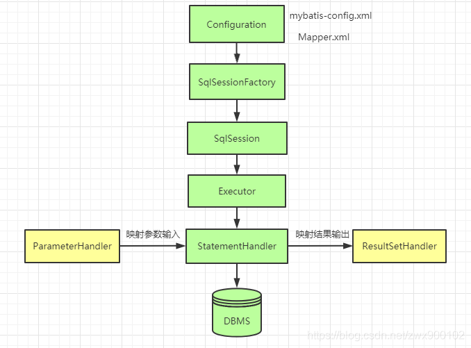