# C语言基础


> [!TIP]
>
> 参考教程： https://getiot.tech/c/


# 一 介绍

> [!TIP]
>
> - C 语言是一种通用的、面向过程的计算机编程语言，支持结构化编程、词法作用域和递归，使用静态类型系统。
> - 简单来说，C 语言是一门静态类型、编译型的编程语言，既有高级语言又有低级语言（汇编语言）的特点，具有语法简洁、高效、灵活、可移植等优点。
> - C 语言诞生于20世纪70年代初，是一门古老但依然广泛使用的编程语言，对后来的编程语言发展也产生了深远影响，许多解释性语言（如 Python）的解析器就是由 C 语言实现的。作为一门通用的高级编程语言，C 语言在计算机科学领域扮演着重要的角色。无论是嵌入式系统、操作系统、网络编程还是游戏开发，C 语言都发挥着重要的作用。

## 1.1 起源

- 1969年，美国贝尔实验室的肯·汤普森（Ken Thompson）与丹尼斯·里奇（Dennis Ritchie）一起开发了 Unix 操作系统。Unix 是用汇编语言写的，无法移植到其他计算机，他们决定使用高级语言重写。但是，当时的高级语言无法满足他们的要求，于是汤普森就在 BCPL 语言的基础上发明了 B 语言。
- 但由于 B 语言过于简单，功能有限。因此在1972年，丹尼斯·里奇和布莱恩·柯林汉（Brian Kernighan）在 B 语言的基础上重新设计了一种新语言 —— C 语言（取 BCPL 的第二个字母）。C 语言既保持 了 BCPL 和 B 语言语法精练、接近硬件的优点，同时又克服了它们过于简单、数据无类型等缺点，因此顺理成章地取代了 B 语言。


## 1.2 优点

C 语言的三大优点 —— 效率、可移植性和稳定性。

- **效率**

  在这里，效率可能是指一些非常不一样的东西：能量和内存效率（适用于小型或便携式设备、卫星），运行时效率（适用于中型或大型计算密集型计算）或速度（适用于科学可视化、游戏或网络通信 ）。C 在这些领域的效率是无与伦比的，其他编程语言倾向于引入大量的内存间接、动态行为，从而遏制了效率。

- **可移植性**

  C 语言的抽象状态机旨在可移植到任何计算设备上。这个概念带来了很大的好处：通常为新 CPU 开发的第一批软件组件就是 C 编译器。因此，用 C 编写的代码，特别是操作系统和其他系统软件，可以进行快速的移植。大量的软件项目从中受益，Linux 发行版是数千个软件包的集合，这些软件包可以很容易地移植到新架构上，并与现有主流平台的发展保持同步。

- **稳定性**

  C 语言委员会致力于保证用户代码库的稳定性。你现在编写的 C 代码仍然可以在 20 年后仍然可以编译和运行。80 年代或 90 年代写的代码今天仍然可以使用。此外，C 还提供了一系列有限的特性，这些特性在工程学院的研究生阶段就应该掌握。因此，在数年甚至数十年后仍然可以保持可维护性。在 C 语言中，“遗留”有着不同的含义，好的 C 代码是真正的资产，而不是负担。

## 1.3 应用领域

具体来说，目前 C 语言主要应用领域包括：

- **嵌入式开发**：C语言具有高级语言的特点，又具有汇编语言的特点，是最接近硬件的高级编程语言，因此在嵌入式领域是绝对的首选。
- **操作系统**：包括 Linux 内核以及各类 RTOS，绝大多数操作系统都采用 C 语言编程。
- **数据库**：MySQL、Redis、TDengine 等数据库核心采用 C 语言编程。
- **解析器**：JVM 虚拟机、Python 解析器、Lua 解析器等都是采用 C 语言编程实现。
- **绘图处理**：C 语言具有绘图能力强，可移植性，并具备很强的数据处理能力，OpenGL 就是使用 C 语言实现的。
- **关键算法**：C 语言具有极高的运行效率，许多软件的关键算法也会使用 C 语言编程进行优化。

## 1.4 标准变动

> 1. C89/C90（ANSI C）

- **首个国际标准**：由ANSI（1989）和ISO（1990）发布，奠定C语言核心语法。
- 关键特性：
  - 标准化了K&R C的实践（如函数原型、`void`类型）。
  - 定义标准库（如`stdio.h`、`stdlib.h`）。

> **2. C99（ISO/IEC 9899:1999）**

- 重大改进：
  - **内联函数**（`inline`关键字）。
  - **变量声明位置**：允许在代码块任意位置声明变量。
  - **单行注释**（`//`）。
  - **`long long`类型**：支持更大整数。
  - **变长数组（VLA）**：栈上动态大小数组。
  - **复合字面量**：匿名结构体/数组初始化。
  - **`restrict`指针**：优化指针别名。

> 3. C11（ISO/IEC 9899:2011）

- 现代化扩展：
  - **多线程支持**（`<threads.h>`，但实现较少）。
  - **原子操作**（`<stdatomic.h>`）。
  - **泛型宏**（`_Generic`）。
  - **静态断言**（`static_assert`）。
  - **安全函数**（如`gets_s`替代不安全的`gets`）。

> 4. C17/C18（ISO/IEC 9899:2018）

- **缺陷修复**：主要修正C11的问题，无新功能。
- **兼容性**：被视为C11的维护版本。

> 5. C2x（预计2025-2026发布）

正在制定的下一代标准，可能包含：

- **属性扩展**：如`[[deprecated]]`、`[[nodiscard]]`。
- **模式匹配**：简化条件分支（提案中）。
- **改进的UTF-8支持**：如`char8_t`类型。
- **更灵活的数组操作**：如`void`指针算术。
- **标准库增强**：网络、图形等（可能以可选附件形式）。

# 二 语法

## 2.1 程序结构

> [!TIP]
>
> 一个 C 程序通常包含以下几个部分：
>
> - 预处理命令（例如头文件引用、宏定义等等）
> - 函数（具体的功能实现）
> - 变量（存储数据的地方）
> - 语句（或者称为表达式）
> - 注释（用于补充说明）

```c
#include <stdio.h>

int main(void)
{
   /* My first program in C */
   printf("Hello, World! \n");
   return 0;
}
```

- \#include <stdio.h> 是预处理器指令，告诉 C 编译器在实际编译之前要包含 stdio.h 文件。
- int main() 是主函数，程序从这里开始执行。
- {}括号内的是具体代码块
- /*...*/ 将会被编译器忽略，这里放置程序的注释内容。它们被称为程序的注释。
- printf(...) 是 C 中另一个可用的函数，会在屏幕上显示消息 "Hello, World!"。
- return 0; 终止 main() 函数，并返回值 0。 

### 2.1.1 分号

> [!TIP]
>
> 在 C 程序中，分号; 是语句结束符。也就是说，代码中的语句必须以分号结束。它表明一个逻辑实体的结束。

```c
printf("Hello, World! \n");
return 0;
```

### 2.1.2 注释

> 注释
>
> - C 语言的注释支持**单行注释**和**多行注释**。单行注释以双斜杠 `//` 开头，从双斜杠到行尾都属于注释。注释可以独立一行，也可以放在一行语句的末尾
> - 多行注释则使用 `/*` 和 `*/` 符号包裹，也就是说，它们之间的内容都属于注释。

```c
// 这是一行注释

int x = 1; // 这也是注释
```

```c
/* 注释 */

/*
  这是一行注释
*/
```

## 2.2 程序语法

> [!TIP]
>
> 语句或代码块
>
> 语句（statement）是 C 语言代码的重要组成部分，一个语句可以理解为是程序对计算机的一个操作命令。在 C 语言中，语句可以是**简单语句**或**复合语句**。简单语句以分号结尾，复合语句由用花括号括起来的一个或多个语句组成，也称为代码块或语句块。

- 简单语句

```c
    printf("Hello, World!\n");
```

- 复杂语句

```c
{
    int x;
    x = 1;
}
```

> [!TIP]
>
> 表达式与赋值
>
> - 所谓的表达式（expression）就是一个计算式，用来获取值。
> - 在 C 语言中，赋值语句使用 `=` 运算符，`=` 号也称为赋值号，在 `=` 左边的称为左值，是被赋值的变量，右边的为右值可以为常量、变量或表达式。

```c
#include "library.h"

#include <stdio.h>

void hello(void) {
    printf("Hello, World!\n");
}


int main(void) {
    hello();
    return 0;
}

```

> [!TIP]
>
> 空白符
>
> - 常见的空白符包括空格（Space）、制表符（Tab）和换行符。在 C 语言中，空白符的作用主要是用来帮助编译器区分语法单位。如果语法单位不用空格就能区分，空格就不是必须的，只是为了增加代码的可读性。

```c
// 缩进四个空格
if (x > 0)
    printf("is a positive number\n");

// 缩进两个空格
if (x > 0)
  printf("is a positive number\n");
```

## 2.3 数据类型

> [!WARNING]
>
> C 语言是一门静态类型语言，也就是说，数据类型是在编译其间确定的，或者说在运行之前确定的，因此编写 C 代码时需要声明变量的数据类型。确定数据类型之后，就确定了其在存储中占用多少空间以及如何解释其中的字节。
>
> - **基本类型**：基本类型是用作算术运算的数据类型，可进一步分为**整数**类型和**浮点**类型。
> - **枚举类型**：枚举类型也属于算术类型，只不过它们用于定义只能分配某些离散整数值的变量。
> - **void 类型**：类型说明符 *void* 表示没有可用值，即空类型。
> - **派生类型**：包括**指针**类型、**数组**类型、**结构体**类型、**联合体**类型和**函数**类型。

### 2.3.1 整数类型

- C 语言的整数类型包括 char、short、int、long 和 long long 五种，默认是有符号的整数，如果想要声明为无符号整数，需要在前面加上 unsigned 关键字。

> |          **特性**          |           **有符号整数（signed）**           |  **无符号整数（unsigned）**  |
> | :------------------------: | :------------------------------------------: | :--------------------------: |
> |       **最高位含义**       |              符号位（0正，1负）              |      数值位（始终为正）      |
> | **数值范围**（以32位为例） | -2³¹ ~ 2³¹-1 （如 -2147483648 ~ 2147483647） | 0 ~ 2³²-1 （0 ~ 4294967295） |
> |        **溢出行为**        |            溢出是未定义行为（UB）            |     溢出时自动取模（2ⁿ）     |
> |          **用途**          |        需要表示负数（如温度、偏移量）        | 仅非负数（如计数器、位操作） |

| 类型               | 存储大小    | 数值范围                                   |
| ------------------ | ----------- | ------------------------------------------ |
| char               | 1 字节      | -128 - 127                                 |
| unsigned char      | 1 字节      | 0 - 255                                    |
| int                | 4 字节      | -2,147,483,648 - 2,147,483,647             |
| unsigned int       | 4 字节      | 0 - 4,294,967,295                          |
| short              | 2 字节      | -32,768 - 32,767                           |
| unsigned short     | 2 字节      | 0 - 65,535                                 |
| long               | 4 或 8 字节 |                                            |
| unsigned long      | 4 或 8 字节 |                                            |
| long long          | 8 字节      | -9223372036854775808 - 9223372036854775807 |
| unsigned long long | 8 字节      | 0 - 18446744073709551615                   |

- 在声明数据类型，如果不添加 unsigned，则默认为 signed 类型。也就是说 `int` 和 `signed int` 是等效的。

```c
void NumberType(void) {
    // 数字类型： unsigned 无符号， signed 有符号 区别： 符号位 
    char a = 'a'; //  char -128 ~ 127  1字节
    unsigned char b = 'b'; // 0 ~ 255  1字节
    int c = 1; // -2147483648 ~ 2147483647  4字节
    unsigned int d = 2; // 0 ~ 4294967295  4字节
    short e = 3; // -32768 ~ 32767  2字节 
    unsigned short f = 4; // 0 ~ 65535  2字节
    long  g = 5; // -2147483648 ~ 2147483647  4字节或8字节
    unsigned long h = 6; // 0 ~ 4294967295  4字节或8字节
    long long i = 7; // -9223372036854775808 ~ 9223372036854775807  8字节
    unsigned long long j = 8; // 0 ~ 18446744073709551615  8字节
    printf("NumberType\n");
}
```

### 2.3.2 浮点类型

- C 语言的浮点类型包括 float、double 以及 long double 三种，浮点数都是有符号。其中，float 称为单精度浮点型，double 称为双精度浮点型。
- 浮点数可以使用科学计数法表示，在赋值时可以在数值常量末尾添加 `f` 进行限定。

|    类型     | 存储大小 |       数值范围        |      精度      |
| :---------: | :------: | :-------------------: | :------------: |
|    float    |  4 字节  |   1.2E-38 - 3.4E+38   | 小数点后 6 位  |
|   double    |  8 字节  |  2.3E-308 - 1.7E+308  | 小数点后 15 位 |
| long double | 10 字节  | 3.4E-4932 - 1.1E+4932 | 小数点后 19 位 |

```c
float a = 1.0;
float b = 1.0f;
float c = 112.64E3;
double d = 0.7623e-2;
double e = 1.23002398;
```

### 2.3.3 空类型

- 如果一个函数返回 void，则表示该函数不返回任何值。

```c
void exit(int status);
```

- 如果一个函数的参数列表是 void，则表示该函数不接受任何参数，或者说它不需要参数。

```c
int rand(void);
```

- `void *` 类型的指针表示对象的地址，但不表示其类型，或者说它是可以指向任意类型的指针。

```c
void *malloc( size_t size );
```

```c
/* C 语言基本数据类型介绍
 * 1. 整型
 *    - char：通常 1 字节，-128~127（signed）或 0~255（unsigned）
 *    - short：通常 2 字节
 *    - int：通常 4 字节
 *    - long：32 位系统 4 字节，64 位系统 8 字节
 *    - long long：至少 8 字节
 *
 * 2. 浮点型
 *    - float：单精度，通常 4 字节
 *    - double：双精度，通常 8 字节
 *    - long double：扩展精度，字节数依平台而定
 *
 * 3. 布尔型（C99 起）
 *    - 需包含 <stdbool.h>，使用 true / false
 *
 * 4. 空类型
 *    - void：表示“无类型”，用于函数无返回值或空指针
 *
 * 5. 枚举型
 *    - enum：用户自定义的整型常量集合
 *
 * 6. 派生类型
 *    - 指针、数组、结构体(struct)、联合体(union)、函数
 *
 * 类型修饰符：signed / unsigned / short / long / const / volatile / restrict
 * 长度保证：见 <stdint.h> 中的 int32_t、uint64_t 等定宽整数
 */
 
#include <stdio.h>

int main(void) {
    /* 演示基本数据类型的字节大小与范围（以常见 64 位 Linux/GCC 为例） */
    printf("char:          %zu 字节，范围 %d ~ %d\n", sizeof(char),        -128, 127);
    printf("unsigned char: %zu 字节，范围 %u ~ %u\n", sizeof(unsigned char), 0, 255);
    printf("short:         %zu 字节\n", sizeof(short));
    printf("int:           %zu 字节\n", sizeof(int));
    printf("long:          %zu 字节\n", sizeof(long));
    printf("long long:     %zu 字节\n", sizeof(long long));
    printf("float:         %zu 字节\n", sizeof(float));
    printf("double:        %zu 字节\n", sizeof(double));
    printf("long double:   %zu 字节\n", sizeof(long double));

    /* 演示布尔类型（C99） */
    #include <stdbool.h>
    bool flag = true;
    printf("bool:          %zu 字节，值：%s\n", sizeof(bool), flag ? "true" : "false");

    return 0;
}

```

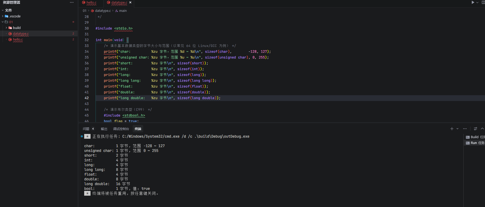

## 2.4 变量

> [!WARNING]
>
> - 在 C 程序中，变量（variable）只不过是我们的程序可以操作的存储区域的名称。
>
> - C 程序中的每个变量都有一个特定的数据类型，它决定了变量内存的大小和布局、该内存中可以存储的值的范围，以及可以应用于变量的操作集。

- 命名规则

> C 语言的变量名遵循标识符命名规则，可以是字母、数字和下划线（`_`）的组合。但必须满足以下规则：
>
> - 变量名的开头必须是字母或下划线，不能是数字。
> - 变量名中的字母是区分大小写的。比如 a 和 A 是不同的变量名，num 和 Num 也是不同的变量名。
> - 变量名绝对不可以是C语言关键字，想知道 C 语言都有哪些关键字，可以点击[这里](https://getiot.tech/c/c-keywords/)查看。
>
> 虽然允许以下划线开头，但并不建议使用，因为以下划线开头的变量名通常是系统专用的。

- 定义

> [!WARNING]
>
> - 在 C 语言中，变量要“先定义，再使用”。变量定义的作用是告诉编译器在何处以及为变量创建多少存储空间。
>
> - type 必须是有效的 C 数据类型，包括 char、int、float、double 或任何用户定义的对象；
> - variable_list 可以由一个或多个以逗号分隔的标识符名称组成。
> - 对于没有初始化的变量，如果是具有静态存储持续时间的变量隐式初始化为 NULL（所有字节的值为 0），除此之外其他变量的初始值均未定义（undefined）。

```c
type variable_list;
```

```c
int    i, j, k;
char   c, ch;
float  f, salary;
double d;
```

- 声明

> [!WARNING]
>
> - 变量声明向编译器保证存在具有给定类型和名称的变量，以便编译器可以继续进行进一步编译，而不需要有关该变量的完整详细信息。变量定义仅在编译时才有意义，编译器在链接程序时需要实际的变量定义。
> - 当使用多个文件并且在链接程序时可用的文件之一中定义变量时，变量声明非常有用。我们可以使用关键字 `extern` 在任何地方声明变量。需要注意，尽管可以在 C 程序中多次声明一个变量，但它只能在文件、函数或代码块中定义一次。
> - **定义** —— 所谓的定义就是编译器创建一个对象，为这个对象分配一块内存并给它取上一个名字，这个名字就是我们所说的变量名/对象名。这个名字一旦和这块内存匹配起来，它们就同生共死，终生不离不弃，并且这块内存的位置也不能被改变。一个变量或对象在一定区域内（涉及作用域和生命周期）只能被定义一次，如果定义多次，编译器会提示你重复定义同一个变量或对象。
> - **声明** —— 告诉编译器，这个名字已经匹配到一块内存上了，所以你不能再用它作为将要定义的变量名/对象名。和变量的定义不同，变量的声明是可以出现多次的，并且在多个源文件中使用该变量之前都应该先声明。

```c
// C 中的变量
// 变量是程序中用于存储数据的命名内存位置
// 每个变量都有一个数据类型，决定了它可以存储的数据种类和大小
// 声明： 数据类型 变量名;
// 初始化： 数据类型 变量名 = 初始值;
// 赋值： 变量名 = 新值;
// 可以在声明时初始化，也可以稍后赋值
// 初始化时可以使用常量表达式，也可以使用其他变量的值

// 案例：计算圆的面积
#include <stdio.h>

int main() {
    const float PI = 3.14159f;      // 定义常量π
    float radius = 5.0f;            // 声明并初始化半径
    float area;                     // 声明面积变量

    area = PI * radius * radius;    // 计算面积
    printf("半径为 %.2f 的圆面积是 %.2f\n", radius, area);

    return 0;
}

```

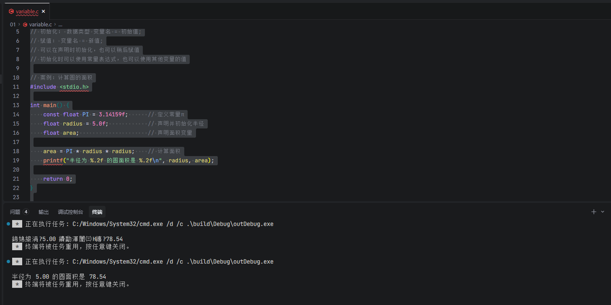

**声明：**用来告诉编译器变量的名称和类型，而**不分配内存，不赋初值**。

**定义：**为了给变量分配内存，**可以为变量赋初值**。

注：定义要为变量分配内存空间；而声明不需要为变量分配内存空间。

> - extern 关键字 用于声明在其他文件中已经定义的全局变量或函数
> - 它告诉编译器："这个变量/函数在其他地方定义，编译时不要报错，链接时会找到它"
> - 只有声明，没有定义，不会分配内存
> - 可以跨多个文件访问同一个全局变量

- global.c

```c
// global.c - 定义全局变量
#include <stdio.h>

// 定义全局变量
int global_radius = 10;
float global_pi = 3.14159f;

// 定义全局函数
void print_global_values() {
    printf("全局变量值: global_radius = %d, global_pi = %.2f\n", global_radius, global_pi);
}
```

- main_extern.c

```c
// main_extern.c - 使用 extern 声明访问其他文件的全局变量
#include <stdio.h>

// 使用 extern 声明在 global.c 中定义的全局变量
extern int global_radius;
extern float global_pi;

// 使用 extern 声明在 global.c 中定义的全局函数
extern void print_global_values();

int main() {
    // 使用 extern 声明的全局变量计算圆的面积
    float area = global_pi * global_radius * global_radius;
    printf("使用外部全局变量计算的圆面积：\n");
    printf("半径 = %d\n", global_radius);
    printf("π = %.2f\n", global_pi);
    printf("面积 = %.2f\n\n", area);
    
    // 修改外部全局变量的值
    global_radius = 15;
    global_pi = 3.14f;
    
    // 调用外部全局函数
    printf("修改后的值：\n");
    print_global_values();
    
    // 再次计算面积
    area = global_pi * global_radius * global_radius;
    printf("新的面积 = %.2f\n", area);
    
    return 0;
}
```

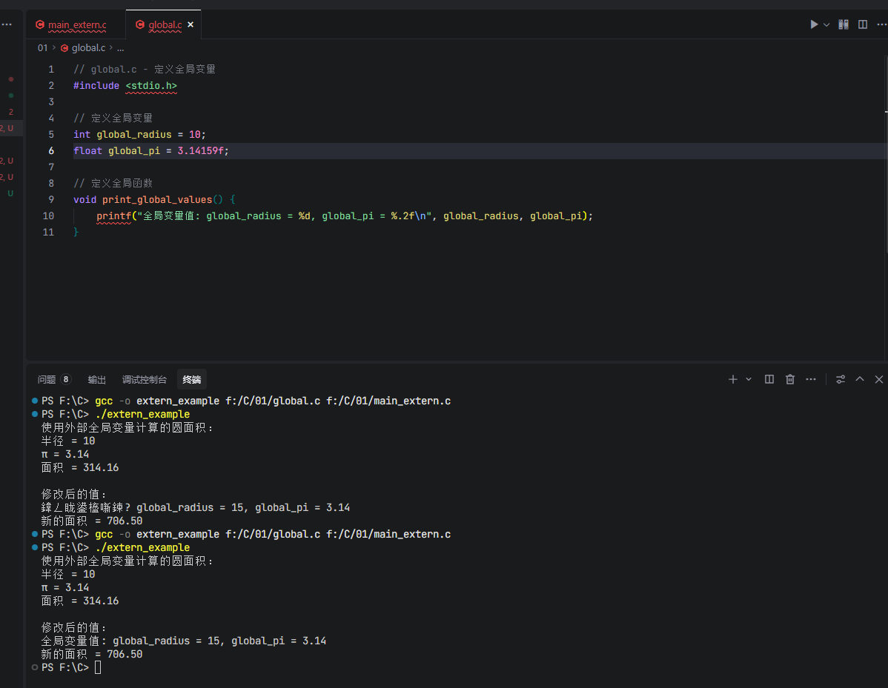

- 左值和右值

> C 语言中有两种表达式，即左值（lvalue）表达式和右值（rvalue）表达式，它们的区别如下：
>
> - **左值**：引用内存位置的表达式称为“左值”表达式。左值可以显示为赋值的左侧或右侧。
> - **右值**：右值是指存储在内存中某个地址的数据值。右值是一个不能赋值的表达式，这意味着右值可以出现在赋值号的右侧，但不能出现在左侧。
>
> 变量是左值，因此它们可能出现在赋值语句的左侧。数字常量是右值，因此它们可能不会被赋值，也不能出现在左侧。

```c
// lvalue_rvalue.c - 左值和右值概念演示
#include <stdio.h>
#include <stdlib.h>

// 函数声明
int add(int a, int b);      // 接受右值参数
void modify(int *ptr);       // 接受指针（左值地址）

// 全局变量
int global_var = 100;

// 返回左值的函数（通过指针间接实现）
int* return_lvalue_ptr() {
    return &global_var;
}

// 接受右值参数的函数
int add(int a, int b) {
    return a + b;
}

// 接受指针（左值地址）的函数
void modify(int *ptr) {
    *ptr = 200;
}

// 主函数
int main() {
    printf("=== 左值和右值概念演示 ===\n\n");
    
    // 1. 左值基本概念：可以放在赋值号左边的值
    int x = 5;       // x是左值，5是右值
    printf("1. 左值基本示例：\n");
    printf("   int x = 5;  // x是左值，5是右值\n");
    printf("   x = 10;     // 正确：x是左值，可以被赋值\n");
    x = 10;
    printf("   当前x的值：%d\n\n", x);
    
    // 2. 右值基本概念：只能放在赋值号右边的值
    printf("2. 右值基本示例：\n");
    printf("   5 = x;       // 错误：5是右值，不能被赋值\n");
    printf("   10 + x = 20; // 错误：表达式10 + x是右值，不能被赋值\n");
    printf("   x = 10 + 5;  // 正确：10 + 5是右值，可以赋值给左值x\n");
    x = 10 + 5;
    printf("   当前x的值：%d\n\n", x);
    
    // 3. 左值和右值的区别
    printf("3. 左值和右值的区别：\n");
    printf("   - 左值：有持久的存储位置，可以被取地址\n");
    printf("   - 右值：临时值，没有持久的存储位置，不能被取地址\n");
    printf("   &x = 0;      // 错误：&x是右值（地址值），不能被赋值\n");
    printf("   x = &global_var; // 错误：类型不匹配，但&global_var是右值\n");
    printf("   int *ptr = &x;  // 正确：&x是右值，可以赋值给左值ptr\n");
    int *ptr = &x;
    printf("   ptr指向的值：%d\n\n", *ptr);
    
    // 4. 函数调用中的左值和右值
    printf("4. 函数调用中的左值和右值：\n");
    printf("   add(5, 10) = 20; // 错误：函数返回值是右值，不能被赋值\n");
    printf("   x = add(5, 10);   // 正确：函数返回值是右值，可以赋值给左值x\n");
    x = add(5, 10);
    printf("   add(5, 10)的结果：%d\n\n", x);
    
    // 5. 可以返回左值的函数（通过指针）
    printf("5. 返回左值的函数（通过指针）：\n");
    printf("   *return_lvalue_ptr() = 300; // 正确：函数返回指针，解引用后是左值\n");
    *return_lvalue_ptr() = 300;
    printf("   global_var的值：%d\n\n", global_var);
    
    // 6. 左值在表达式中的使用
    printf("6. 左值在表达式中的使用：\n");
    int y = 20;
    printf("   int y = 20;\n");
    printf("   x = y;       // 正确：y是左值，赋值给左值x\n");
    x = y;
    printf("   x = 40;      // 正确：直接给左值x赋值\n");
    x = 40;
    printf("   x的值：%d, y的值：%d\n\n", x, y);
    
    // 7. 数组名作为左值
    printf("7. 数组名作为左值：\n");
    int arr[5] = {1, 2, 3, 4, 5};
    printf("   int arr[5] = {1, 2, 3, 4, 5};\n");
    printf("   arr = {6, 7, 8, 9, 10}; // 错误：数组名是常量左值，不能被重新赋值\n");
    printf("   arr[0] = 100; // 正确：数组元素是左值，可以被赋值\n");
    arr[0] = 100;
    printf("   arr[0]的值：%d\n\n", arr[0]);
    
    // 8. 指针与左值
    printf("8. 指针与左值：\n");
    int z = 50;
    int *pz = &z;
    printf("   int z = 50; int *pz = &z;\n");
    printf("   *pz = 150; // 正确：*pz是左值，可以被赋值\n");
    *pz = 150;
    printf("   z的值：%d\n", *pz);
    printf("   pz = &global_var; // 正确：pz是左值，可以被赋值\n");
    pz = &global_var;
    printf("   pz现在指向global_var：%d\n\n", *pz);
    
    // 9. const左值
    printf("9. const左值：\n");
    const int const_var = 100;
    printf("   const int const_var = 100;\n");
    printf("   const_var = 200; // 错误：const左值不能被修改\n");
    printf("   const_var是左值，可以取地址：%p\n\n", &const_var);
    
    // 10. 字符串字面量
    printf("10. 字符串字面量：\n");
    char *str_ptr = "hello"; // 字符串字面量是const左值
    printf("   char *str_ptr = \"hello\";");
    printf("   // \"hello\"是const左值，str_ptr指向它\n");
    printf("   *str_ptr = 'H'; // 错误：字符串字面量是const左值，不能被修改\n");
    printf("   str_ptr = \"world\"; // 正确：str_ptr是左值，可以指向新的字符串字面量\n");
    str_ptr = "world";
    printf("   str_ptr现在指向：%s\n\n", str_ptr);
    
    // 11. 复合字面量（C99+）
    printf("11. 复合字面量（C99+）：\n");
    int *comp_ptr = (int[]){1, 2, 3, 4, 5};
    printf("   int *comp_ptr = (int[]){1, 2, 3, 4, 5};\n");
    printf("   comp_ptr[0] = 10; // 正确：复合字面量是左值，可以被修改\n");
    comp_ptr[0] = 10;
    printf("   复合字面量第一个元素：%d\n\n", comp_ptr[0]);
    
    printf("=== 演示结束 ===\n");
    
    return 0;
}
```

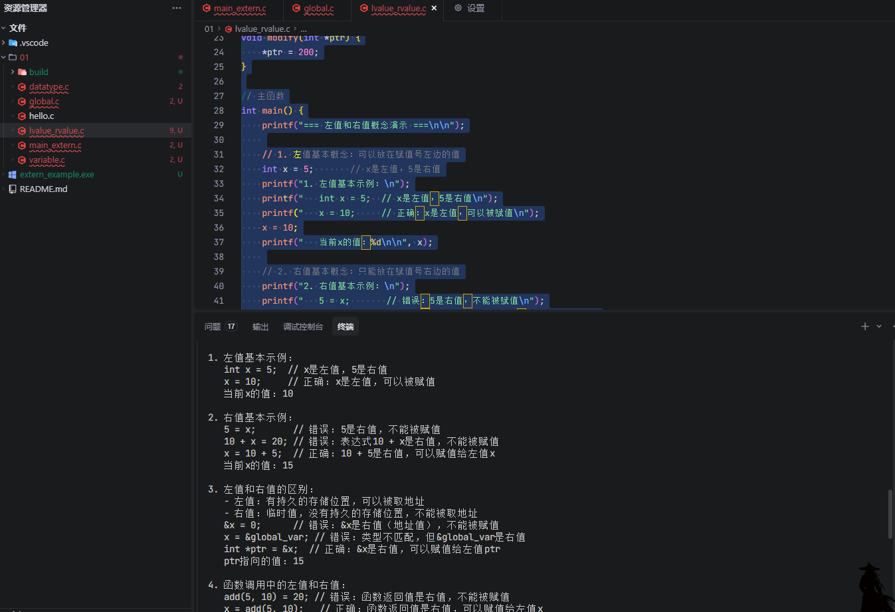

- 1、左值
  左值就是那些可以出现在赋值符号左边的东西，它标识了一个可以存储结果值的地点。
  程序在编译时，编译器会为每个变量分配一个地址(左值)，这个地址在编译是即可知。
  也就是说，左值在编译时即可知，左值标志存储结果的一个地方，也可以理解为左值就是一块空间。

- 2、右值
  右值就是那些可以出现在赋值符号右边的东西，它必须具有一个特定的值。
  与左值相反，变量中存储的那个值(右值),只有在运行时才可知，且只有要用到变量中存储的值时，编译器才会发出指令从指定的地址读入变量的值，并将它存于寄存器中。
  也就是说，右值就是一个数字或一个字面值或一个常量，它并不标识任何位置。

## 2.5 常量

### 2.5.1 定义

> [!TIP]
>
> - 在 C 语言中，常量（Constants）是指程序在执行过程中不能改变的固定值。这些固定值也称为**字面量**（Literals）。常量可以是任何基本数据类型，例如整数常量、浮点常量、字符常量或字符串文字，以及枚举常量。
> - 在使用时，常量可以直接在代码中使用，也可以通过定义常量来使用。通过定义创建的常量，其处理方式与变量基本一样，只是它们的值在定义后不能修改，换句话说，常量是只读的。

- 定义： C 语言定义常量的方式有两种，一是使用 `#define` 宏定义，二是使用 `const` 关键字。

- 使用 `#define` 可以在 C 程序中定义一个常量，`#define` 是一个预处理指令，也称为“宏定义”，因此它会在编译时被替换为其对应的值。

```c
#define identifier value
#define PI 3.1415926
```

> 注意：`#define` 宏定义末尾不需要添加分号 `;`。

- 在定义变量时，使用 `const` 关键字可将其声明为只读变量，即常量，此后该变量的值在其生命周期将不能修改。

```
const type variable = value;
const int MAX_VALUE = 100;
```

### 2.5.2 整数常量

> [!TIP]
>
> - 整数常量（Integer Literals）可以是十进制、十六进制、八进制或二进制的常量，默认为十进制整数，可通过前缀指定基数。例如，`0x` 或 `0X` 表示十六进制，`0` 表示八进制，`0b` 或 `0B` 表示二进制。不过，需要注意的是，并不是所有的 C 编译器都支持二进制数字，只有一部分编译器支持，并且和编译器的版本有关系。
> - 注意：不同进制的数字不能超过其进制限制，比如十六进制的数字范围是 0-9 以及 A-F，二进制数字只能是 0 和 1，否则会报错。例如 `0b1002`、`0855` 都是不允许的。
> - 注意：不同进制的数字不能超过其进制限制，比如十六进制的数字范围是 0-9 以及 A-F，二进制数字只能是 0 和 1，否则会报错。例如 `0b1002`、`0855` 都是不允许的。

```c
256        /* decimal */
0567       /* octal */
0x4F       /* hexadecimal */
0b1010     /* binary */
30         /* int */
30U        /* unsigned int */
30L        /* long */
30UL       /* unsigned long */
```

### 2.5.3  浮点常量

> [!TIP]
>
> 浮点常量（Floating-point Literals）由整数部分、小数点、小数部分和指数部分组成。你可以使用小数形式或者指数形式来表示浮点常量。
>
> - 当使用小数形式表示时，必须包含整数部分、小数部分，或同时包含两者。
> - 当使用指数形式表示时，必须包含小数点、指数（使用 e 或 E 引入），或同时包含两者。
>
> 浮点常量可以带一个后缀，后缀是 `F` 或 `L`，也可以是小写 `f` 或 `l`。如果不带后缀，浮点常量的类型默认为 `double`，如果后缀是字母 `f` 或 `F`，则常量的类型为 `float`。 如果后缀是字母 `l` 或 `L`，则常量的类型为 `long double`。

```c
100.0         /* 合法的 */
-100.0f       /* 合法的 */
3.1415926L    /* 合法的 */
314159E-5     /* 合法的 */
314159E-5L    /* 合法的 */
510E          /* 非法的：不完整的指数 */
210f          /* 非法的：没有小数或指数 */
.e55          /* 非法的：缺少整数或分数 */
```

### 2.5.4 字符常量

>[!TIP]
>
>字符常量（Character Constants）就是一个个的字符，在 C 语言中由单引号包裹。例如，'x' 可以存储在 `char` 类型的简单变量中。
>
>在 C 语言中，字符常量可以是一个普通的字符（例如 'x'）、一个转义字符（例如 '\t'），或一个通用的字符（例如 '\u02C0'）。转义字符是一些特定的字符，它们具有特殊的含义，使用反斜杠开头，例如换行符（`\n`）或制表符（`\t`）等，下表列出了一些常见的转义字符。

| 转义字符 | 含义                          | ASCII 码 |
| :------- | :---------------------------- | -------- |
| `\a`     | 响铃（BEL）                   | 007      |
| `\b`     | 退格（BS）                    | 008      |
| `\f`     | 换页（FF）                    | 012      |
| `\n`     | 换行（LF）                    | 010      |
| `\r`     | 回车（CR）                    | 013      |
| `\t`     | 水平制表（HT）                | 009      |
| `\v`     | 垂直制表（VT）                | 011      |
| `\\`     | 反斜杠                        | 092      |
| `\?`     | 问号字符                      | 063      |
| `\'`     | 单引号字符                    | 039      |
| `\"`     | 双引号字符                    | 034      |
| `\0`     | 空字符（NULL）                | 000      |
| `\ddd`   | ddd 表示三位八进制的任意字符  |          |
| `\xhh`   | hh 表示二位十六进制的任意字符 |          |

### 2.5.5 字符串常量

> [!TIP]
>
> 字符串常量（String Literals）使用双引号 `" "` 包裹。一个字符串包含字符常量的字符，包括普通的字符、转义序列和通用的字符。在字符串常量中，你可以使用空格做分隔符，把一个很长的字符串常量进行分行。

```c
// 第1种形式
"hello, dear"

// 第2种形式
"hello, \

dear"

// 第3种形式
"hello, " "d" "ear"
```


## 2.6 存储类

> [!TIP]
>
> **存储类**（storage class）用于确定 C 程序中变量/函数的存储位置、生命周期和作用域。变量作用域分为全局（global）和局部（local）两种，对应的存储类为“静态”和“自动”。具有全局的生命周期贯穿整个程序的执行过程，而局部变量则只能在局部范围内使用。对于函数而言，所有函数都具有全局生存期。

### 2.6.1 auto 存储类

> [!TIP]
>
> - *auto* 存储类是所有局部变量（local variables）默认的存储类。定义在函数中的变量默认为 *auto* 存储类，这意味着它们在函数开始时被创建，在函数结束时被销毁。
> - 需要注意的是，*auto* 只能用在函数内，即 *auto* 只能修饰局部变量。

```c
{
   int mount;
   auto int month;
}
```

### 2.6.2 *register* 存储类

>[!TIP]
>
>- *register* 存储类用于定义存储在寄存器中而不是内存（RAM）中的局部变量。这意味着变量的最大尺寸等于寄存器的大小（通常是一个字），且不能对它应用一元的 `&` 运算符（因为它没有内存位置）。
>- 由于 *register* 存储类定义存储在寄存器，所以 *register* 变量的访问速度更快，但是它不能直接取地址，因为它不是存储在 RAM 内存中的。如果一个变量需要频繁访问，那么使用 *register* 修饰该变量可以提高程序的运行速度。
>- 计算机的寄存器是很珍贵的，因此 *register* 存储类只用于需要快速访问的变量，比如计数器。还应注意的是，定义 *register* 并不意味着变量将被存储在寄存器中，它仅仅意味着变量可能存储在寄存器中，这取决于硬件平台和编译器的实现和限制。

```c
{
   register int  miles;
}
```

### 2.6.3 static 存储类

> [!TIP]
>
> *static* 存储类用于指示编译器在程序的生命周期内保持局部变量的存在，而不需要在每次它进入和离开作用域时进行创建和销毁。因此，使用 *static* 修饰局部变量可以在函数调用之间保持局部变量的值。简单来说，对于一个局部变量，使用 *static* 修饰之后，它的作用域（可见性）不会改变，但是生命周期会变成和全局变量一样，这样的变量也称为“静态变量”。

```c
#include <stdio.h>
 
/* function declaration */
void func(void);
 
static int count = 5; /* global variable */

int main(void) 
{
    while (count--)
    {
        func();
    }

   return 0;
}

/* function definition */
void func(void)
{
    static int i = 5; /* local static variable */
    i++;
    
    printf("i is %d and count is %d\n", i, count);
}
```

### 2.6.4 extern 存储类

> [!TIP]
>
> - *extern* 存储类用于定义在其他文件中声明的全局变量或函数。当使用 *extern* 关键字时，不会为变量分配任何存储空间，而只是指示编译器该变量在其他文件中定义。也就是说，这是一个声明，而不是定义。
> - *extern* 存储类用于提供一个全局变量的引用，全局变量对所有的程序文件都是可见的。当你使用 *extern* 时，对于无法初始化的变量，会把变量名指向一个之前定义过的存储位置。

## 2.7  运算符与优先级

> [!TIP]
>
> 运算符是一种告诉编译器执行特定的数学或逻辑操作的符号，在 C 语言中内置了丰富的运算符。

| **类别**       | **运算符**                   | **描述**                       | **结合性** | **优先级** |
| -------------- | ---------------------------- | ------------------------------ | ---------- | ---------- |
| **算术运算符** | `++` `--`（后缀）            | 自增、自减（后置）             | 左→右      | 1（高）    |
|                | `+` `-` `++` `--`（前缀）    | 正、负、自增、自减（前置）     | 右→左      | 2          |
|                | `*` `/` `%`                  | 乘、除、取模                   | 左→右      | 3          |
|                | `+` `-`                      | 加、减                         | 左→右      | 4          |
| **关系运算符** | `<` `<=` `>` `>=`            | 小于、小于等于、大于、大于等于 | 左→右      | 5          |
|                | `==` `!=`                    | 等于、不等于                   | 左→右      | 6          |
| **位运算符**   | `~`                          | 按位取反                       | 右→左      | 2          |
|                | `<<` `>>`                    | 左移、右移                     | 左→右      | 5          |
|                | `&`                          | 按位与                         | 左→右      | 7          |
|                | `^`                          | 按位异或                       | 左→右      | 8          |
|                | `|`                          | 按位或                         | 左→右      | 9          |
| **逻辑运算符** | `!`                          | 逻辑非                         | 右→左      | 2          |
|                | `&&`                         | 逻辑与                         | 左→右      | 10         |
|                | `||`                         | 逻辑或                         | 左→右      | 11         |
| **赋值运算符** | `=` `+=` `-=` `*=` `/=` `%=` | 赋值及复合赋值                 | 右→左      | 14（低）   |
|                | `<<=` `>>=` `&=` `^=` `|=`   | 位运算复合赋值                 | 右→左      | 14         |
| **条件运算符** | `?:`                         | 三元运算符（`a ? b : c`）      | 右→左      | 13         |
| **其他运算符** | `sizeof`                     | 计算变量/类型大小              | 右→左      | 2          |
|                | `&`                          | 取地址                         | 右→左      | 2          |
|                | `*`                          | 指针解引用                     | 右→左      | 2          |
|                | `,`                          | 逗号运算符（顺序求值）         | 左→右      | 15（最低） |

```c
int a = 5, b = 3, c = 2;
int result = a + b * c;  // * 优先级高于 +，先算 b * c
int logical = !a && b;   // ! 优先级高于 &&，先算 !a
int bitwise = a << 2 | b; // << 优先级高于 |，先算 a << 2
```

> [!WARNING]
>
> C 语言中，运算符的运算规则是：**优先级高的运算符先执行，优先级低的运算符后执行，同一优先级的运算符按照从左到右的顺序进行。**
>
> 需要注意的是，C 语言中大部分运算符都是从左向右执行的，只有单目运算符、赋值运算符它们是从右向左执行的。如果有小括号 `()`，则小括号的优先级最高。

## 2.8 条件语句

> [!WARNING]
>
> C 语言任何**非零**和**非空**的值假定为 **true**，把**零**或 **null** 假定为 **false**。

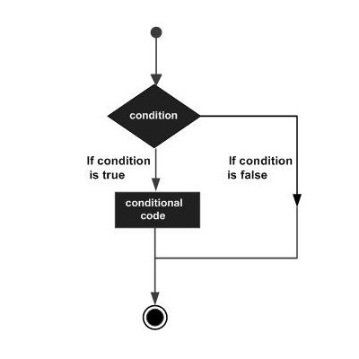

### 2.8.1 IF 语句

> 一个 `if` 语句包含一个或多个条件组成的布尔表达式（Boolean expression）。

- 语法

```c
if (boolean_expression) {
   /* statement(s) will execute if the boolean expression is true */
}
```

如果布尔表达式的值为 **true**，那么 `if` 语句后面由大括号包裹的语句块将被执行。如果布尔表达式的值为 **false**，那么将执行整个 `if` 语句后的代码，也就是 `}` 后的第一行代码。值得一提的是，如果 `if` 语句的语句块中只有一行代码，那么大括号 `{ }` 是可以省略的。但对于新手来说，不建议省略，因为很容易出错。

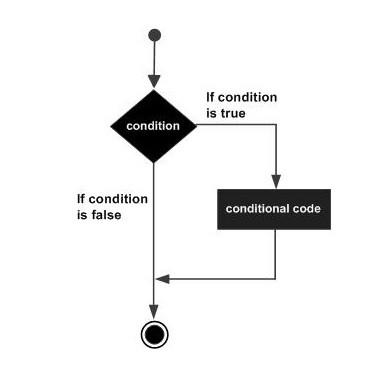

```c
#include <stdio.h>
 
int main(void)
{
   /* local variable definition */
   int a = 10;
 
   /* check the boolean condition using if statement */
	
   if (a < 20) {
      /* if condition is true then print the following */
      printf("a is less than 20\n" );
   }
   
   printf("value of a is : %d\n", a);
 
   return 0;
}
```

### 2.8.2 if...else 语句

一个 `if` 语句后面可以带上一个 `else` 语句，这样就能覆盖所有的条件，条件为 **true** 则执行 `if` 语句后面的语句块，条件为 **false** 则执行 `else` 语句后面的语句块。

- 语法

```c
if (boolean_expression) {
   /* statement(s) will execute if the boolean expression is true */
} else {
   /* statement(s) will execute if the boolean expression is false */
}
```

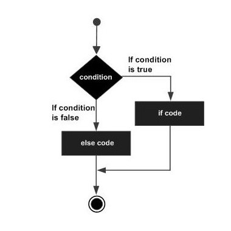

```c
#include <stdio.h>
 
int main(void)
{
   /* local variable definition */
   int a = 100;
 
   /* check the boolean condition */
   if (a < 20) {
      /* if condition is true then print the following */
      printf("a is less than 20\n" );
   } else {
      /* if condition is false then print the following */
      printf("a is not less than 20\n" );
   }
   
   printf("value of a is : %d\n", a);
 
   return 0;
}
```

### 2.8.3 f...else if 语句

一个 `if` 语句后面还可以带多个 `else if` 语句，进行多种条件判断。这种结构是非常有用的，因为它比单一的 `if...else` 语句更丰富。如果末尾带上 `else` 语句，就形成了一个条件 100% 覆盖的 `if...else if...else` 语句。

使用 `if...else if...else` 语句时，有以下几点需要注意：

- 一个 `if` 后可跟零个或一个 `else`，`else` 必须在所有 `else if` 之后；
- 一个 `if` 后可跟零个或多个 `else if`，`else if` 必须在 `else` 之前；
- 一旦某个 `else if` 匹配成功，其他的 `else if` 或 `else` 将不会被测试。

> 语法

```c
if (boolean_expression 1) {
   /* Executes when the boolean expression 1 is true */
} else if (boolean_expression 2) {
   /* Executes when the boolean expression 2 is true */
} else if (boolean_expression 3) {
   /* Executes when the boolean expression 3 is true */
} else {
   /* executes when the none of the above condition is true */
}
```

```c
#include <stdio.h>

int main(void) 
{
   /* local variable definition */
   int a = 100;
 
   /* check the boolean condition */
   if (a == 10) {
      /* if condition is true then print the following */
      printf("Value of a is 10\n" );
   } else if (a == 20) {
      /* if else if condition is true */
      printf("Value of a is 20\n" );
   } else if (a == 30) {
      /* if else if condition is true  */
      printf("Value of a is 30\n" );
   } else {
      /* if none of the conditions is true */
      printf("None of the values is matching\n" );
   }
   
   printf("Exact value of a is: %d\n", a );
 
   return 0;
}
```

### 2.8.4 嵌套 if 语句

在 C 语言中，嵌套 `if` 语句是合法的。也就是说，你可以在一个 `if` 或 `else if` 或 `else` 语句的语句块中再使用另一个 `if` 语句，而在该 `if` 语句中又可以继续使用另一个 `if` 语句。这种语法就称为“嵌套 if 语句”。

> 语法

```c
if (boolean_expression 1) {

   /* Executes when the boolean expression 1 is true */
   if (boolean_expression 2) {
      /* Executes when the boolean expression 2 is true */
   }
   else if (boolean_expression 3) {
      /* Executes when the boolean expression 3 is true */
   } else {
      /* executes when the none of the above condition is true */
   }
}
```

```c
#include <stdio.h>
 
int main (void) {

   /* local variable definition */
   int a = 100;
   int b = 200;
 
   /* check the boolean condition */
   if (a == 100) {
   
      /* if condition is true then check the following */
      if (b == 200) {
         /* if condition is true then print the following */
         printf("Value of a is 100 and b is 200\n" );
      }
   }
   
   printf("Exact value of a is : %d\n", a );
   printf("Exact value of b is : %d\n", b );
 
   return 0;
}
```

### 2.8.5 switch 语句

如果程序需要处理多级判断时，使用 `if...else if..else` 语句会显得非常冗长，因此 C 语言提供了 `switch` 语句。一个 `switch` 语句用于测试一个变量等于多个值时的情况，每个值称为一个 **case**。

> 语法
>
> `switch` 语句必须遵循下面的规则：
>
> - `switch` 语句中的 `expression` 是一个常量表达式，必须是一个整型或枚举类型；
> - 在一个 `switch` 中可以有任意数量的 `case` 语句。每个 `case` 后跟一个要比较的值和一个冒号；
> - `case` 的 *constant-expression* 必须与 `switch` 中的变量具有相同的数据类型，且**必须是一个常量或字面量**。
> - 当被测试的变量等于 `case` 中的常量时，`case` 后跟的语句将被执行，直到遇到 `break` 语句为止；
> - 当遇到 `break` 语句时，`switch` 终止，控制流将跳转到 `switch` 语句后的下一行；
> - 不是每一个 `case` 都需要包含 `break`。如果 `case` 语句不包含 `break`，控制流将会继续后续的 `case`，直到遇到 `break` 为止；
> - 一个 `switch` 语句可以有一个可选的 **default** case，出现在 `switch` 的结尾。`default` 可用于在上面所有 `case` 都不为真时执行一个任务；
> - `default` 中的 `break` 语句不是必需的。

```c
switch (expression) {

   case constant-expression  :
      statement(s);
      break; /* optional */
	
   case constant-expression  :
      statement(s);
      break; /* optional */
  
   /* you can have any number of case statements */
   default : /* Optional */
   statement(s);
}
```

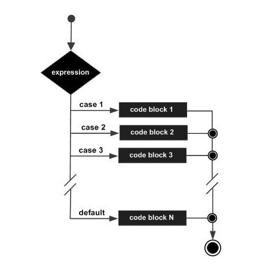

```c
#include <stdio.h>
 
int main(void)
{
   /* local variable definition */
   char grade = 'B';

   switch (grade) {
      case 'A' :
         printf("Excellent!\n" );
         break;
      case 'B' :
      case 'C' :
         printf("Well done\n" );
         break;
      case 'D' :
         printf("You passed\n" );
         break;
      case 'F' :
         printf("Better try again\n" );
         break;
      default :
         printf("Invalid grade\n" );
   }
   
   printf("Your grade is  %c\n", grade );
 
   return 0;
}
```

### 2.8.6 三目运算符 ? :

> 语法
>
> 这里的 `Exp1`、`Exp2` 和 `Exp3` 都是表达式，由问号 `?` 和冒号 `:` 分隔。
>
> `?` 表达式的值由 `Exp1` 决定：
>
> - 如果 `Exp1` 为 **true**，则计算 `Exp2` 的值，`Exp2` 的结果即为整个表达式的值；
> - 如果 `Exp1` 为 **false**，则计算 `Exp3` 的值，`Exp3` 的结果即为整个表达式的值。

```c
Exp1 ? Exp2 : Exp3;
```

## 2.9 循环语句

循环结构是程序设计中的另一种常用结构，比如在某些场景，你需要重复执行某一段代码很多次，这时候就需要用到循环语句了。

### 2.9.1 while 循环

> 语法
>
> 这里的 `condition` 可以是任意的表达式，当为任意非零值时都为 *true*。当条件为 *true* 时执行循环。 当条件为 *false* 时，退出循环，程序流将继续执行紧接着循环的下一条语句。
>
> `statement(s)` 可以是一个单独的语句，也可以是几个语句组成的代码块。如果是单条语句，可以不使用大括号包裹。

```c
while (condition) {
    statement(s);
}
```

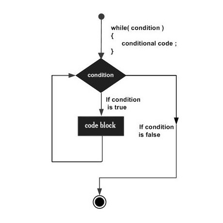

```c
#include <stdio.h>
 
int main(void)
{
    /* local variable definition */
    int a = 10;
    
    /* while loop execution */
    while (a < 20) {
        printf("value of a: %d\n", a);
        a++;
    }
    
    return 0;
}
```

### 2.9.2 for 循环

> 语法
>
> 1. 首先执行 **init** 部分，并且只会执行一次。你可以在这里声明并初始化任何循环控制变量，也可以不在这里写任何语句，只要有一个分号出现即可。
> 2. 接下来，会判断 **condition** 表达式。如果为真，则执行循环主体。如果为假，则不执行循环主体，且控制流会跳转到紧接着 for 循环的下一条语句。
> 3. 在执行完 for 循环主体后，控制流会跳回上面的 **increment** 语句。通常会在这里更新循环控制变量，该语句可以留空，只要在条件后有一个分号出现即可。
> 4. 条件再次被判断。如果为真，则执行循环，这个过程会不断重复（循环主体，然后增加步值，再然后重新判断条件）。在条件变为假时，for 循环终止。

```c
for (init; condition; increment) {
    statement(s);
}
```

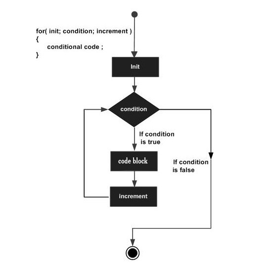

```c
#include <stdio.h>
 
int main(void)
{
    int a;
    
    /* for loop execution */
    for (a = 10; a < 20; a = a + 1) {
        printf("value of a: %d\n", a);
    }
    
    return 0;
}
```

### 2.9.3 循环控制语句

> 有时候，我们并不希望程序执行完整的循环，比如说当满足某个条件时，就跳出循环。这时候就需要用到循环控制语句，来改变代码的执行顺序。
>
> C 语言提供了三种循环控制语句，包括 break、continue 和 goto 语句。goto 有点特殊，我们以后再介绍，这里先介绍前两种。
>
> - break 语句：终止循环或 switch 语句，程序流将继续执行紧接着循环或 switch 的下一条语句。
> - continue 语句：告诉一个循环体立刻停止本次循环迭代，重新开始下次循环迭代。
> - goto 语句：将控制转移到被标记的语句，但是不建议在程序中使用 goto 语句。

## 2.10 函数


> 函数是 C 程序中的基本模块单元，通常设计为执行一项特定任务，由一系列语句组成。

### 2.10.1 概念

> [!TIP]
>
> - 函数（Function）是计算机编程中一个通用的概念，一个函数就是一组一起执行一个任务的语句。在不同的编程语言或应用领域中，函数可能有一些不同的叫法，比如方法、子例程或子程序等等。
> - 在前面的章节中，其实我们已经接触过函数，因为每个 C 程序都至少有一个函数，即主函数 `main()`。当然，除了主函数，我们也可以把代码划分到不同的函数中，也就是自定义函数。至于如何划分代码到不同的函数中，则完全是由程序员（你）来决定的，但在逻辑上，通常会根据每个函数执行一个特定的任务来进行的。
> - 在 C 语言中，函数包含声明和语句，函数声明是为了告诉编译器函数的名称、返回类型和参数。函数定义则提供了函数的实际主体，也就是该任务需要执行的一组语句。每个函数都有一个名称，函数名通常会反映该任务是做什么的。比如，C 标准库提供的函数 `strcat()` 用来连接两个字符串，函数 `memcpy()` 用来复制内存到另一个位置。
> - C 标准库提供了大量的程序可以调用的内置函数，你可以在《[Linux 常用 C 函数参考手册](https://getiot.tech/manual/linux-c-functions/index.html)》中找到它们。

### 2.10.2 定义

> [!TIP]
>
> C 函数由一个函数头和一个函数主体组成，其中函数头又包含函数名称、参数列表、返回类型 3 部分。具体说明如下：
>
> - **返回类型（Return Type）**：一个函数可以返回一个值，而 `return_type` 就是函数返回的值的数据类型，表示当函数执行完毕将返回一个该类型的数据。并不是所有函数都需要返回值，这时候返回类型是 `void`，表示无返回值。
> - **函数名称（Function Name）**：这是函数的实际名称，函数名可以反映函数的功能，函数名和参数列表一起构成了函数签名。
> - **参数（Parameters）**：参数列表包括函数参数的类型、顺序、数量。当调用函数时，需要按要求传递参数。但不是所有函数都需要参数，也就是说，参数是可选的。
> - **函数主体（Function Body）**：函数主体包含一组定义函数执行任务的语句。

```c
return_type function_name( parameter list ) {
    body of the function
}
```

```c
/* function returning the max between two numbers */
int max(int num1, int num2)
{
    /* local variable declaration */
    int result;
    
    if (num1 > num2)
        result = num1;
    else
        result = num2;
    
    return result; 
}
```

### 2.10.3 参数

> [!TIP]
>
> - 参数在函数名之后的圆括号内指定。你可以添加任意多的参数，只需用逗号分隔它们。
> - 形式参数类似于函数内的其他局部变量，在进入函数时被创建，退出函数时被销毁。
> - 在 C 语言中，调用函数时有两种向函数传递参数的方式：
>
> - **值传递**：该方法把参数的实际值复制给函数的形式参数。在这种情况下，修改函数内的形式参数不会影响实际参数。
> - **地址传递**：通过指针传递方式，形参为指向实参地址的指针，当对形参的指向操作时，就相当于对实参本身进行的操作。
>
> - 默认情况下，C 使用**值传递**来传递参数。一般来说，这意味着函数内的代码不能改变用于调用函数的实际参数。

```c
int max(int num1, int num2);
```

## 2.11 参数传递

> [!WARNING]
>
> C 语言中形参和实参的概念，以及参数传递的两种方式，即 **值传递** 和 **地址传递**。

### 2.11.1 形参与实参

- 在 C 语言中，如果函数要使用参数，则必须声明接受参数值的变量。我们以前面介绍的 `max()` 函数来说明：
- 在这里，`max()` 函数参数列表中的 `num1` 和 `num2`，这些变量称为函数的**形式参数**（Formal parameters），简称**形参**。而在函数调用时传入的变量值则称为**实际参数**（Actual parameters），简称**实参**，比如这里的 `a` 和 `b`。

```c
#include <stdio.h>

/* function returning the max between two numbers */
int max(int num1, int num2)
{
    return (num1 > num2 ? num1 : num2); 
}

int main(void)
{
    /* local variable definition */
    int a = 100;
    int b = 200;
    int ret;
 
    /* calling a function to get max value */
    ret = max(a, b);
    printf( "Max value is : %d\n", ret );
    
    return 0;
}
```

### 2.11.2 值传递

> [!DANGER] 
>
> **值传递**是 **C 语言中函数参数传递的默认方式，即把参数的实际值复制给函数的形式参数。**

```c
#include <stdio.h>
 
/* function declaration */
void swap(int x, int y);

int main(void)
{
    /* local variable definition */
    int a = 100;
    int b = 200;
    
    printf("Before swap, value of a : %d\n", a);
    printf("Before swap, value of b : %d\n", b);
    
    /* calling a function to swap the values */
    swap(a, b);
    
    printf("After swap, value of a : %d\n", a);
    printf("After swap, value of b : %d\n", b);
    
    return 0;
}

void swap(int x, int y)
{
    int temp;
    
    temp = x; /* save the value of x */
    x = y;    /* put y into x */
    y = temp; /* put temp into y */
    
    return;
}
```

### 2.11.3 地址传递

> [!DANGER] 
>
> - **地址传递**有时候也被称为“引用传递”或“指针传递”，因为在 C 语言中是通过指针来实现的。通过指针传递方式，形参为指向实参地址的指针，当对形参的指向操作时，就相当于对实参本身进行的操作。
> - 传递指针可以让多个函数访问指针所引用的对象，而不用把对象（变量）声明为全局可访问。指针在 C 语言中有非常多的用法，在 [C 语言 - 指针](https://getiot.tech/c/c-pointers/) 章节中会详细介绍。
> - 提示：在 C++ 中，指针和引用是两个不同的概念，不过在 C 语言中并没有本质区别，实际上就是一个地址。

```c
#include <stdio.h>

int main(void)
{
    /* local variable definition */
    int a = 100;
    int b = 200;
    
    printf("Before swap, value of a : %d\n", a );
    printf("Before swap, value of b : %d\n", b );
    
    /* calling a function to swap the values */
    swap(&a, &b);
    
    printf("After swap, value of a : %d\n", a );
    printf("After swap, value of b : %d\n", b );
    
    return 0;
}

void swap(int *x, int *y)
{
    int temp;
    
    temp = *x; /* save the value of x */
    *x = *y;    /* put y into x */
    *y = temp; /* put temp into y */
    
    return;
}
```

### 2.11.4 总结

| 方式             | 是否改变实参 | 参数类型     | 是否复制数据 | 是否需要取地址符 |
| ---------------- | ------------ | ------------ | ------------ | ---------------- |
| 值传递           | 否           | 普通变量类型 | 是           | 否               |
| 地址传递（指针） | 是           | 指针类型     | 否           | 是（`&`）        |

- **值传递**：适用于不需要修改原始变量的情况，常用于输入参数。
- **地址传递（指针）**：适用于需要修改原始变量，或者处理大型结构体、数组等，避免复制大量数据。

## 2.12 指针


> 指针是 C 语言中最强大、最灵活，也最容易让初学者困惑的概念之一。
>
> 它直接操作内存地址，是实现高效程序设计（如动态内存管理、数据结构、函数参数传递等）的基础。

### 2.12.1 定义

**指针** 是一个变量，它的值是另一个变量的**内存地址**。换句话说，指针“指向”某个内存位置。

> 💡 简单类比：  
> 内存就像一栋大楼，每个房间是一个内存单元（有地址）。  
> 指针就像是一个“房间号”，通过这个号码可以找到并访问那个房间里的数据。

### 2.12.2 声明指针

```c
数据类型 *指针名;
```

例如：
```c
int    *p;   // p 是一个指向整型变量的指针
float  *q;   // q 是一个指向浮点型变量的指针
char   *r;   // r 是一个指向字符型变量的指针
```

> ⚠️ 注意：`*` 是声明的一部分，表示这是一个指针变量，不是取值操作。

- 获取变量地址：`&` 运算符

使用 `&` 可以获取变量的内存地址。

```c
int a = 10;
printf("a 的地址是：%p\n", &a);  // %p 用于打印地址
```

- 指针赋值：让指针指向某个变量

```c
int a = 10;
int *p;      // 声明指针
p = &a;      // p 指向 a 的地址
```

也可以在声明时直接初始化：
```c
int *p = &a;
```

- 访问指针所指向的值：`*` 解引用（Dereferencing）

使用 `*` 可以获取指针所指向地址中存储的值。

```c
int a = 10;
int *p = &a;

printf("a 的值是：%d\n", a);        // 输出 10
printf("p 指向的值是：%d\n", *p);   // 输出 10
printf("p 存储的地址是：%p\n", p);   // 输出 &a
```

> ✅ `*p` 就等价于 `a`

### 2.12.3 指针的常见操作示例

```c
#include <stdio.h>

int main() {
    int a = 100;
    int *p = &a;

    printf("变量 a 的值: %d\n", a);           // 100
    printf("变量 a 的地址: %p\n", &a);         // 如 0x7fff5fbff6ac
    printf("指针 p 的值（即 a 的地址）: %p\n", p); // 同上
    printf("指针 p 指向的值: %d\n", *p);       // 100

    // 修改指针指向的值
    *p = 200;
    printf("修改后 a 的值: %d\n", a);          // 200

    return 0;
}
```

### 2.12.4 指针的类型

指针也有类型，如 `int*`、`float*`、`char*` 等。类型决定了：

- 指针指向的数据类型。
- 指针进行算术运算时的步长（见下文）。

> ❗ 虽然所有指针在 64 位系统上通常占 8 字节，但类型不同会影响解引用和指针运算。

- 指针运算（Pointer Arithmetic）

指针可以进行加减运算，但它的步长取决于所指向的数据类型。

```c
int arr[3] = {10, 20, 30};
int *p = arr;  // 指向数组首元素

printf("%d\n", *p);     // 10
printf("%d\n", *(p+1));  // 20
printf("%d\n", *(p+2));  // 30
```

步长规则：

- `p + 1` 实际增加 `sizeof(数据类型)` 字节。
  - `int* p`：`p+1` 增加 4 字节（假设 int 占 4 字节）
  - `char* p`：`p+1` 增加 1 字节
  - `double* p`：`p+1` 增加 8 字节

- 指针与数组的关系

在 C 中，数组名本质上是一个**指向首元素的指针常量**。

```c
int arr[5] = {1, 2, 3, 4, 5};
int *p = arr;  // 等价于 int *p = &arr[0];

// 以下等价：
arr[2]   == *(arr + 2)
p[2]     == *(p + 2)
```

> ✅ 数组名不能被赋值（如 `arr = p;` ❌），因为它是常量指针。

- 指针与字符串

字符串在 C 中是字符数组，通常用字符指针处理：

```c
char *str = "Hello, World!";
printf("%s\n", str);
```

- `str` 是一个指向字符串首字符 `'H'` 的指针。
- 字符串存储在只读内存区，不能通过指针修改内容（否则可能崩溃）。

> ⚠️ 安全写法：
```c
char str[] = "Hello";  // 可修改
str[0] = 'h';          // ✅ 合法
```

- 指针与函数

1. 函数参数传递指针（实现“地址传递”）

```c
void increment(int *p) {
    (*p)++;  // 修改指针指向的值
}

int main() {
    int a = 5;
    increment(&a);
    printf("a = %d\n", a);  // 输出 6
    return 0;
}
```

2. 函数返回指针（需注意作用域）

```c
int* createArray() {
    int *arr = (int*)malloc(5 * sizeof(int));
    return arr;  // ✅ 动态分配的内存可返回
}
```

> ❌ 错误示例：返回局部变量地址
```c
int* badFunc() {
    int x = 10;
    return &x;  // ❌ 危险！x 在函数结束后被销毁
}
```

- 空指针（NULL Pointer）

未初始化的指针是**野指针**（指向未知地址），非常危险！

应初始化为 `NULL`：
```c
int *p = NULL;
if (p != NULL) {
    *p = 10;  // 安全检查
}
```

> `NULL` 通常定义为 `0` 或 `(void*)0`，表示“不指向任何地址”。

- void 指针（通用指针）

`void*` 可以指向任何类型的数据，但不能直接解引用，必须先转换类型。

```c
int a = 100;
void *p = &a;

// 必须强制类型转换
printf("%d\n", *(int*)p);  // 输出 100
```

> 常用于：内存管理函数（如 `malloc`）、泛型编程。

- 多级指针（指针的指针）

```c
int a = 10;
int *p = &a;     // 一级指针
int **pp = &p;   // 二级指针，指向指针 p

printf("%d\n", **pp);  // 输出 10
```

> 常用于：二维数组、动态二维数组、函数修改指针本身。

## 2.13 数组

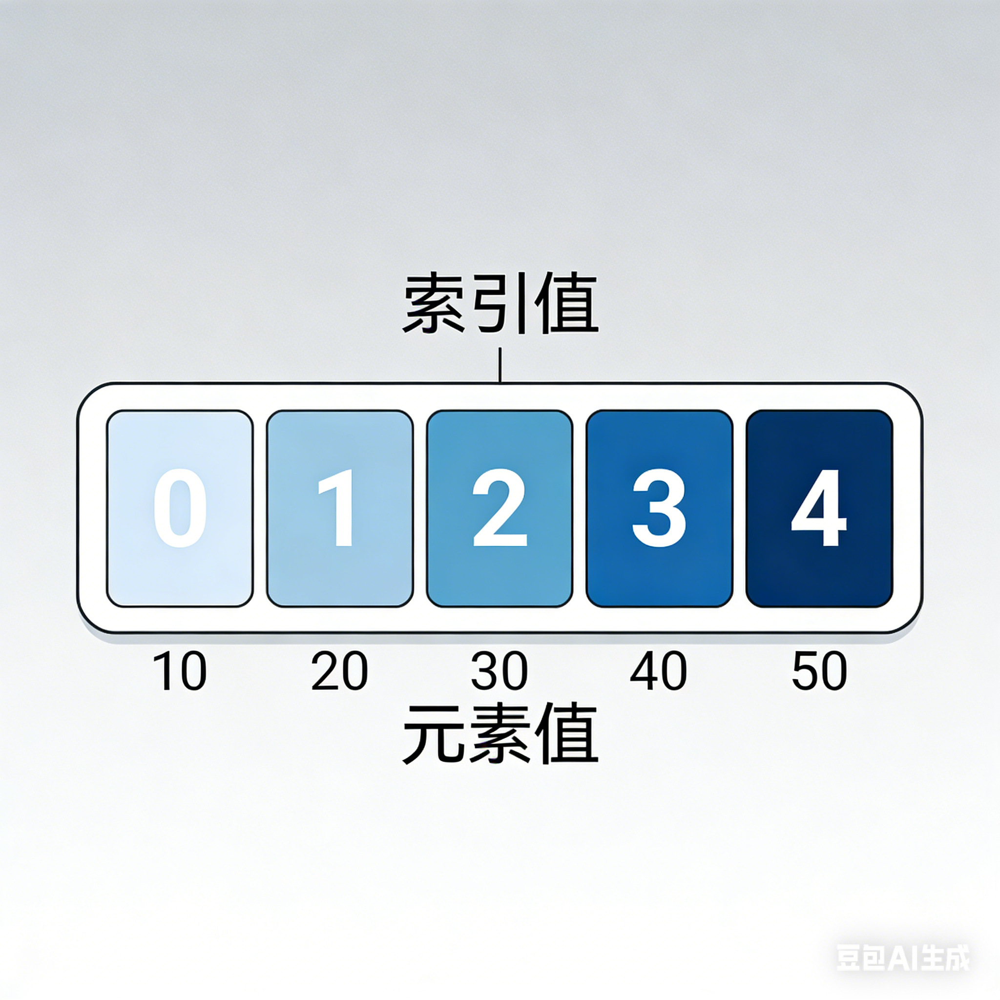

### 2.13.1 定义

> [!DANGER] 
>
> C 语言支持**数组**数据结构，它可以存储一个固定大小的相同类型元素的顺序集合。数组是用来存储一系列数据，但它往往被认为是一系列相同类型的变量。
>
> 数组的声明并不是声明一个个单独的变量，比如 runoob0、runoob1、...、runoob99，而是声明一个数组变量，比如 runoob，然后使用 runoob[0]、runoob[1]、...、runoob[99] 来代表一个个单独的变量。

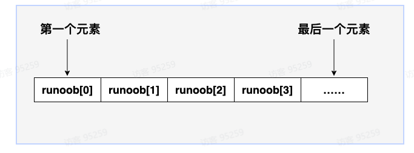

### 2.1.3.2 声明

在 C 中要声明一个数组，需要指定元素的类型和元素的数量，如下所示：

```C
type arrayName [ arraySize ];
```

这叫做一维数组。**arraySize** 必须是一个大于零的整数常量，**type** 可以是任意有效的 C 数据类型。例如，要声明一个类型为 double 的包含 10 个元素的数组 **balance**，声明语句如下：

```C
double balance[10];
现在 balance 是一个可用的数组，可以容纳 10 个类型为 double 的数字。
  
```

> 初始化数组

在 C 中，您可以逐个初始化数组，也可以使用一个初始化语句，如下所示：

```C
double balance[5] = {1000.0, 2.0, 3.4, 7.0, 50.0};
```

大括号 { } 之间的值的数目不能大于我们在数组声明时在方括号 [ ] 中指定的元素数目。

如果您省略掉了数组的大小，数组的大小则为初始化时元素的个数。因此，如果：

```C
double balance[] = {1000.0, 2.0, 3.4, 7.0, 50.0};
```

您将创建一个数组，它与前一个实例中所创建的数组是完全相同的。下面是一个为数组中某个元素赋值的实例：

```C
balance[4] = 50.0;
```

上述的语句把数组中第五个元素的值赋为 50.0。所有的数组都是以 0 作为它们第一个元素的索引，数组的最后一个索引是数组的总大小减去 1。以下是上面所讨论的数组的的图形表示：


下图是一个长度为 **10** 的数组，第一个元素的索引值为 **0**，第九个元素 **runoob** 的索引值为 **8**:


>  访问数组元素

数组元素可以通过数组名称加索引进行访问。元素的索引是放在方括号内，跟在数组名称的后边。例如：

double salary = balance[9];

上面的语句将把数组中第 10 个元素的值赋给 salary 变量。下面的实例使用了上述的三个概念，即，声明数组、数组赋值、访问数组：

```C
#include <stdio.h>
 
int main ()
{
   int n[ 10 ]; /* n 是一个包含 10 个整数的数组 */
   int i,j;
 
   /* 初始化数组元素 */         
   for ( i = 0; i < 10; i++ )
   {
      n[ i ] = i + 100; /* 设置元素 i 为 i + 100 */
   }
   
   /* 输出数组中每个元素的值 */
   for (j = 0; j < 10; j++ )
   {
      printf("Element[%d] = %d\n", j, n[j] );
   }
 
   return 0;
}
```

当上面的代码被编译和执行时，它会产生下列结果：

```C
Element[0] = 100
Element[1] = 101
Element[2] = 102
Element[3] = 103
Element[4] = 104
Element[5] = 105
Element[6] = 106
Element[7] = 107
Element[8] = 108
Element[9] = 109
```

> 获取数组长度

数组长度可以使用 **sizeof** 运算符来获取数组的长度，例如：

```C
#include <stdio.h>

int main() {
    int array[] = {1, 2, 3, 4, 5};
    int length = sizeof(array) / sizeof(array[0]);
    printf("数组长度为: %d\n", length);
    return 0;
}
```

以上实例输出结果为：

```C
数组长度为: 5
```

## 2.14 字符串

> [!DANGER] 
>
> 在 C 语言中，字符串实际上是使用空字符 **\0** 结尾的一维字符数组。

下面的声明和初始化创建了一个 xiaozhi字符串。由于在数组的末尾存储了空字符 **\0**，所以字符数组的大小比单词 xiaozhi的字符数多一个。

```C
char site[8] = {'x', 'i', 'a', 'o', 'z', 'h', 'i','\0'};
```

依据数组初始化规则，您可以把上面的语句写成以下语句,C 编译器会在初始化数组时，自动把 **\0** 放在字符串的末尾。：

char site[] = "xiaozhi";

以下是 C/C++ 中定义的字符串的内存表示：

| 索引 | 0    | 1    | 2    | 3    | 4    | 5    | 6    | 7    |
| ---- | ---- | ---- | ---- | ---- | ---- | ---- | ---- | ---- |
| 变量 | x    | i    | a    | o    | z    | h    | i    | \0   |

```C
#include <stdio.h>
 
int main ()
{
   char site[8] = "xiaozhi";
 
   printf("%s\n", site );
 
   return 0;
}
```

当上面的代码被编译和执行时，它会产生下列结果：

```
xiaozhi
```

C 中有大量操作字符串的函数：

| 序号 | 函数 & 目的                                                  |
| ---- | ------------------------------------------------------------ |
| 1    | strcpy(s1, s2); 复制字符串 s2 到字符串 s1。                  |
| 2    | strcat(s1, s2); 连接字符串 s2 到字符串 s1 的末尾。           |
| 3    | strlen(s1); 返回字符串 s1 的长度。                           |
| 4    | strcmp(s1, s2); 如果 s1 和 s2 是相同的，则返回 0；如果 s1<s2 则返回小于 0；如果 s1>s2 则返回大于 0。 |

下面的实例使用了上述的一些函数：

```C
#include <stdio.h>
#include <string.h>
 
int main ()
{
   char str1[14] = "xiaozhi";
   char str2[14] = "google";
   char str3[14];
   int  len ;
 
   /* 复制 str1 到 str3 */
   strcpy(str3, str1);
   printf("strcpy( str3, str1) :  %s\n", str3 );
 
   /* 连接 str1 和 str2 */
   strcat( str1, str2);
   printf("strcat( str1, str2):   %s\n", str1 );
 
   /* 连接后，str1 的总长度 */
   len = strlen(str1);
   printf("strlen(str1) :  %d\n", len );
 
   return 0;
}
```

## 2.15 结构体


> [!DANGER] 
>
> 数组：可存储相同类型数据。
>
> 结构体：可存储不同类型数据。
>
> **C 语言中用于**封装不同类型数据**的核心自定义数据类型，解决了基本数据类型（int、char 等）无法表示复杂实体的问题，是构建复杂数据结构（如链表、树）的基础。**

```C
Title 标题
Author 作者
Book ID id
```
### 2.15.1 定义

结构体定义由关键字 **struct** 和结构体名组成，结构体名可以根据需要自行定义。

struct 语句定义了一个包含多个成员的新的数据类型，struct 语句的格式如下：

```C
struct tag { 
    member1；
    member2；
    ...
} variable-list ;
```

**tag** 是结构体标签。

**member1** 是标准的变量定义，比如 **int i;** 或者 **float** **f;**，或者其他有效的变量定义。

**variable-list** 结构变量，定义在结构的末尾。

下面是声明 Book 结构的方式：

```C
建议写法：
struct Books
{
   char  title[50];
   char  author[50];
   char  subject[100];
   int   book_id;
};
其它写法：
struct Books
{
   char  title[50];
   char  author[50];
   char  subject[100];
   int   book_id;
} book;
```

###  2.15.2 结构体变量的初始化

和其它类型变量一样，对结构体变量可以在定义时指定初始值。

```C
#include <stdio.h>
struct Books
{
   char  title[50];
   char  author[50];
   char  subject[100];
   int   book_id;
};
int main()
{
    struct Books book = {"C 语言", "RUNOOB", "编程语言", 123456};
    printf("title : %s\nauthor: %s\nsubject: %s\nbook_id: %d\n", book.title, book.author, book.subject, book.book_id);
}
或
#include <stdio.h>
struct Books
{
   char  title[50];
   char  author[50];
   char  subject[100];
   int   book_id;
} book = {"C 语言", "RUNOOB", "编程语言", 123456};
int main()
{
    printf("title : %s\nauthor: %s\nsubject: %s\nbook_id: %d\n", book.title, book.author, book.subject, book.book_id);
}
```

执行输出结果为：

```C
title : C 语言
author: RUNOOB
subject: 编程语言
book_id: 123456
```

### 2.15.3 结构作为函数参数

您可以把结构作为函数参数，传参方式与其他类型的变量或指针类似。您可以使用上面实例中的方式来访问结构变量：

```C
#include <stdio.h>
#include <string.h>
 
struct Books
{
   char  title[50];
   char  author[50];
   char  subject[100];
   int   book_id;
};
 
void printBook( struct Books book )
{
   printf( "Book title : %s\n", book.title);
   printf( "Book author : %s\n", book.author);
   printf( "Book subject : %s\n", book.subject);
   printf( "Book book_id : %d\n", book.book_id);
}

int main( )
{
   struct Books Book1;        /* 声明 Book1，类型为 Books */
   struct Books Book2;        /* 声明 Book2，类型为 Books */
 
   /* Book1 详述 */
   strcpy( Book1.title, "C Programming");
   strcpy( Book1.author, "Nuha Ali"); 
   strcpy( Book1.subject, "C Programming Tutorial");
   Book1.book_id = 6495407;
 
   /* Book2 详述 */
   strcpy( Book2.title, "Telecom Billing");
   strcpy( Book2.author, "Zara Ali");
   strcpy( Book2.subject, "Telecom Billing Tutorial");
   Book2.book_id = 6495700;
 
   /* 输出 Book1 信息 */
   printBook( Book1 );
 
   /* 输出 Book2 信息 */
   printBook( Book2 );
 
   return 0;
}
```

当上面的代码被编译和执行时，它会产生下列结果：

```C
Book title : C Programming
Book author : Nuha Ali
Book subject : C Programming Tutorial
Book book_id : 6495407
Book title : Telecom Billing
Book author : Zara Ali
Book subject : Telecom Billing Tutorial
Book book_id : 6495700
```

### 2.15.4 指向结构的指针

您可以定义指向结构的指针，方式与定义指向其他类型变量的指针相似，如下所示：

```C
struct Books *struct_pointer;
```

现在，您可以在上述定义的指针变量中存储结构变量的地址。为了查找结构变量的地址，请把 & 运算符放在结构名称的前面，如下所示：

```C
struct_pointer = &Book1;
```

为了使用指向该结构的指针访问结构的成员，您必须使用 -> 运算符，如下所示：

```C
struct_pointer->title;
#include <stdio.h>
#include <string.h>
 
struct Books
{
   char  title[50];
   char  author[50];
   char  subject[100];
   int   book_id;
};
 
void printBook( struct Books *book )
{
   printf( "Book title : %s\n", book->title);
   printf( "Book author : %s\n", book->author);
   printf( "Book subject : %s\n", book->subject);
   printf( "Book book_id : %d\n", book->book_id);
}

int main( )
{
   struct Books Book1;        /* 声明 Book1，类型为 Books */
   struct Books Book2;        /* 声明 Book2，类型为 Books */
 
   /* Book1 详述 */
   strcpy( Book1.title, "C Programming");
   strcpy( Book1.author, "Nuha Ali"); 
   strcpy( Book1.subject, "C Programming Tutorial");
   Book1.book_id = 6495407;
 
   /* Book2 详述 */
   strcpy( Book2.title, "Telecom Billing");
   strcpy( Book2.author, "Zara Ali");
   strcpy( Book2.subject, "Telecom Billing Tutorial");
   Book2.book_id = 6495700;
 
   /* 通过传 Book1 的地址来输出 Book1 信息 */
   printBook( &Book1 );
 
   /* 通过传 Book2 的地址来输出 Book2 信息 */
   printBook( &Book2 );
 
   return 0;
}
```

当上面的代码被编译和执行时，它会产生下列结果：

```C
Book title : C Programming
Book author : Nuha Ali
Book subject : C Programming Tutorial
Book book_id : 6495407
Book title : Telecom Billing
Book author : Zara Ali
Book subject : Telecom Billing Tutorial
Book book_id : 6495700
```

**更多用法**

结构体的成员可以包含其他结构体，也可以包含指向自己结构体类型的指针，而通常这种指针的应用是为了实现一些更高级的数据结构如链表和树等。

```C
struct SIMPLE
{
    int id;
};
//此结构体的声明包含了其他的结构体
struct COMPLEX
{
    char string[100];
    struct SIMPLE a;
};

//初始化
struct COMPLEX complex;
//赋值
complex.a.id = 1000;

```

## 2.16 预处理指令


> [!DANGER] 
>
> 代码在我们按下编译按钮时，会执行预处理，编译，汇编，链接，最终生成可执行文件。

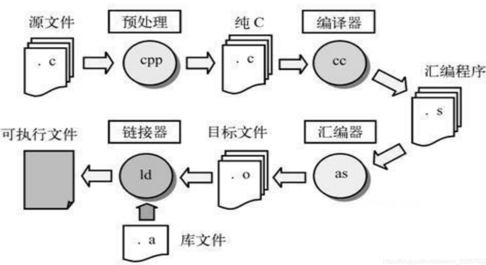

> 预处理，它在编译代码之前对源代码进行处理。  预处理器的主要任务是执行以 # 开头的代码替换。 然后生成一个新的中间代码文件，然后将其传递给编译器进行编译。 预处理功能可以帮助程序员简化代码、提高代码的可读性和可维护性。
>
>  **下方是常用的预处理器指令：**
>
> | 指令     | 描述                                        |
> | -------- | ------------------------------------------- |
> | #include | 头文件包含                                  |
> | #define  | 宏定义                                      |
> | #ifdef   | 条件编译 ，如果宏已经定义，则编译此部分内容 |
> | #ifndef  | 条件编译 ，如果宏没有定义，则编译此部分内容 |
> | #endif   | 结束一个条件编译块                          |

### 2.16.1 define基本用法

\#define关键词的作用主要是提高代码可读性和可维护性。

- 1.1、对象宏定义

```C
格式：
#define 宏名称 替换体
说明：
宏名称： 通常使用全大写以区分变量。
替换体： 在预处理阶段，源代码中所有的“宏名称”都会被替换为的“替换体”。它可以是数字、表达式、字符串等。

示例：
#define NAME "xiaozhi"
#define MAX_SIZE 100
#define PI 3.14159
```

接着，我们看下代码中如何使用 *#define* 定义常量来增强可读性、方便代码维护。

```C
#include <stdio.h>

#define NAME "John Doe"
#define MAX_SIZE 100

int main(void)
{
   int array[MAX_SIZE];
   printf("name is: %s\n", NAME);   
   return 0;
}
```

### 2.16.2 **函数宏定义**

C语言一个强大的功能是可以使用参数化的宏来模拟函数。例如，下方是一个返回输入值平方的函数：

```C
int square(int x) {
   return x * x;
}
```

这个函数，我们可以使用#define宏定义实现

```C
格式：
#define 宏名称(参数列表) 替换体
参数列表： 一个或多个参数，用逗号分隔。参数名不能带类型。
替换体： 包含参数的表达式。强烈建议将参数和整个替换体用括号括起来，以避免运算符优先级导致的意外错误。

我们可以使用宏重写上面的代码，如下：
#define SQUARE(x) ((x) * (x))
```

在使用带有参数的宏之前，必须使用 **#define** 指令定义。参数列表是括在圆括号内，且必须紧跟在宏名称的后边。宏名称和左圆括号之间不允许有空格。例如：

```C
#include <stdio.h>
 
#define SQUARE(x) ((x) * (x))
 
int main(void)
{
   printf("10*10=%d\n", SQUARE(10));  
   return 0;
}
```

**常见陷阱**

```C++
// 错误示例：缺少括号
#define SQUARE(x) x * x
int wrong = SQUARE(1 + 2);  // 展开为 1 + 2 * 1 + 2 = 5

// 正确写法
#define SQUARE(x) ((x) * (x))
int correct = SQUARE(1 + 2); // 展开为 ((1 + 2) * (1 + 2)) = 9

```

### 1.16.3 #**ifdef、#ifndef  用法**

\#ifdef、#ifndef被叫做条件编译，它的作用包括

- 调试代码控制
- 功能模块开关
- 平台特定代码

```C
格式：
#ifdef 宏定义名称
   //如果定义了宏，会编译放在此处的代码
#else //可省略
   //如果未定义宏，会编译放在此处的代码
#endif

例如：
#ifdef DEBUG
    // 调试模式下执行的代码
    printf("Debug: value = %d\n", value);
#endif
```

这个指令告诉 CPP 如果定义了 DEBUG宏，则打印调试信息，例如下发工程，如果我们只希望在调试时打印信息，正式发布不打印信息。

```C
#include <stdio.h>

#define DEBUG 1

int main(void)
{
   printf("main run\n"); 
   #ifdef DEBUG
       // 调试模式下执行的代码
       printf("Here is the debug message\n"); 
   #endif
   return 0;
}
```

同理#ifndef则刚好相反

```C++
#ifndef 宏定义名称
   //如果未定义宏，会编译放在此处的代码
#else //可省略
   //如果定义宏，会编译放在此处的代码
#endif

例如：
#ifndef VERSION
    #define VERSION "1.0.0"
#endif
```
