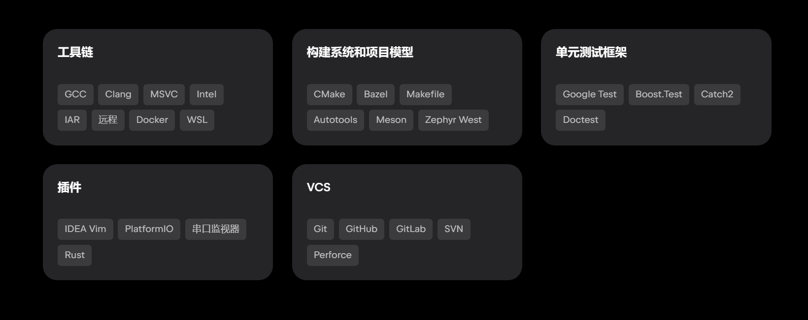
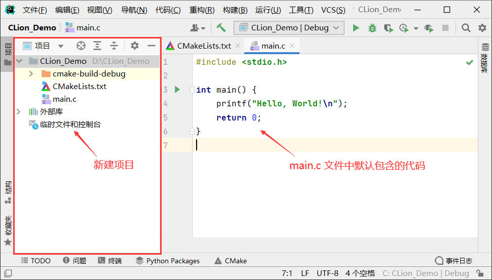
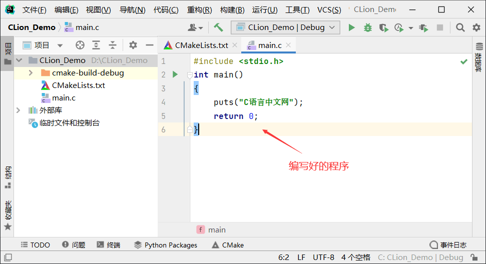
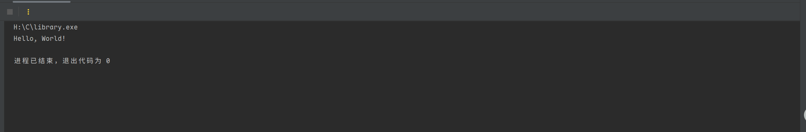

# C语言编程工具

> [!TIP]
>
> 首先是各种工具的对比：
>
> - `DEV C++`：大伙用的最多的，很方便啊是吧，但是也很朴素……没有代码补全是不是有点难受？
> - `小熊猫 DEV`：我后来用的是这个，增添了代码补全，也是比较流畅，但毕竟是魔改版而且跟原来的 DEV 不能同时用，不放心就给卸了；
> - `Visual Studio`：没怎么深入体验过，那大 10 个 G 看了还是……呵呵
> - `VSCode`：可以说编程工具里的瑞士军刀，什么都能写，体验也还不错，美中不足的就是……安装配置 C 语言真的**很麻烦**。
> - `CLion`：安装好之后应该在 1G 左右，收费（北航邮箱可以免费使用教育版），有一定的学习成本，但是让我最欣赏的是它真的特别**人性化**，写起代码相当便捷流畅。而且学校机房是可以使用 `CLion `的（`VSCode`和小熊猫用不了，万一到机房考试还是一夜回到解放前）。

# VSCode(代码编辑)+GCC（编译器)

## 1.1 安装VSCode
- VSCode安装非常简单，可自行在官网下载安装包Visual Studio Code - Code Editing. Redefined，下载完成后，一路下一步即可安装完成。
- 如果官网下载过慢，这里也提供安装包可自行下载。
- 安装完成后，打开VSCode，点击左侧的扩展图标，搜索并安装C/C++插件，该插件提供了C语言的语法高亮、代码补全、调试等功能。


## 1.2 安装GCC

- GCC（GNU Compiler Collection）是一个开源的编译器集合，支持多种编程语言，包括C、C++、Objective-C、Fortran、Ada等。
- 在Windows上安装GCC可以使用MinGW或TDM-GCC等工具链。
- 安装完成后，将GCC添加到系统环境变量中，即可在VSCode中使用GCC编译C语言程序。
- 为了在 Windows 上安装 GCC，您需要安装 MinGW。为了安装 MinGW，请访问 MinGW 的主页 mingw-w64.org，进入 MinGW 下载页面，下载 MinGW 安装程序。


> 解压完成后，将 MinGW 安装目录添加到系统环境变量中，即可在 VSCode 中使用 GCC 编译 C 语言程序。


> 验证安装是否成功，打开 VSCode，创建一个新的 C 文件，输入如下代码：

```c
#include <stdio.h>

int main(void) {
    printf("Hello, World!\n");
    return 0;
}
```


# CLion

- https://www.jetbrains.com.cn/clion/promo




## 1.1 项目先建

- 打开 CLion，选择“新建项目”，如下图所示：


- 弹出如下窗口，选择要创建的项目类型，这里选择创建“C 可执行文件”项目，该项目遵循的 C语言标准为 C11：


- 创建好的项目如下图所示：



- 运行： 初始状态，创建好的项目中只有 main.c 源文件，其它文件都是为 CLion 运行 C 语言程序提供支持的。在 main.c 文件中，CLion 已经编写好了一个最简单的 "Hello, World!" 程序，将它替换成我们自己编写好的程序。



> 第一个程序

```c
#include "library.h"

#include <stdio.h>

void hello(void) {
    printf("Hello, World!\n");
}


int main(void) {
    hello();
    return 0;
}
```



## 1.2 CMake介绍

> [!TIP]
>
> `CMake`是一个开源的跨平台构建系统，用来管理软件建置的程序，并不依赖于某特定编译器，并可支持多层目录、多个应用程序与多个库。虽然`CMake`同样用构建文件控制构建过程（名称是`CMakeLists.txt`），但它却并不直接构建并生成目标，而是产生**其他构建系统**所需要的构建文件，然后再由它们来构建生成最终目标。支持`MSBuild`、`GNU Make`、`MINGW Make`等等构建系统。


- `C`: 项目源目录，包含项目源文件的**顶级目录**。
- `cmake-build-debug`：`CLion`调用`CMake`生成的默认**构建目录**。什么是构建目录呢，用于存储**构建系统文件**（比如makefile以及其他一些cmake相关配置文件）和**构建输出文件**（编译生成的中间文件、可执行程序、库）的顶级目录。因为我们肯定不想把构建生成的文件和项目源文件混在一块，这样会使项目结构变得混乱，所以一般都会单独创建一个构建目录。当然如果你喜欢，可以直接将项目源目录作为构建目录。

- `CMakeLists.txt`：`cmake`项目配置文件，准确点说是项目顶级目录的`cmake`配置文件，因为一个项目在多个目录下可以有多个`CMakeLists.txt`文件。这个应该是`cmake`的核心配置文件了，基本上更改项目构建配置都是围绕着这个文件进行。

> 配置解释

1. `cmake_minimum_required(VERSION 3.31)`
   - 指定构建此项目所需的最低 CMake 版本为 3.31
2. `project(C C)`
   - 定义项目名称为 "C"
   - 第二个参数 "C" 表示这是一个 C 语言项目（不是 C++）
3. `set(CMAKE_C_STANDARD 11)`
   - 设置 C 语言标准为 C11（2011 年发布的 C 语言标准）
4. `add_library(C STATIC library.c)`
   - 添加一个静态库目标，名为 "C"
   - 这个静态库将由源文件 library.c 编译生成
   - STATIC 表示生成的是静态库（.a 或 .lib 文件），而不是动态库