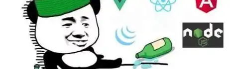
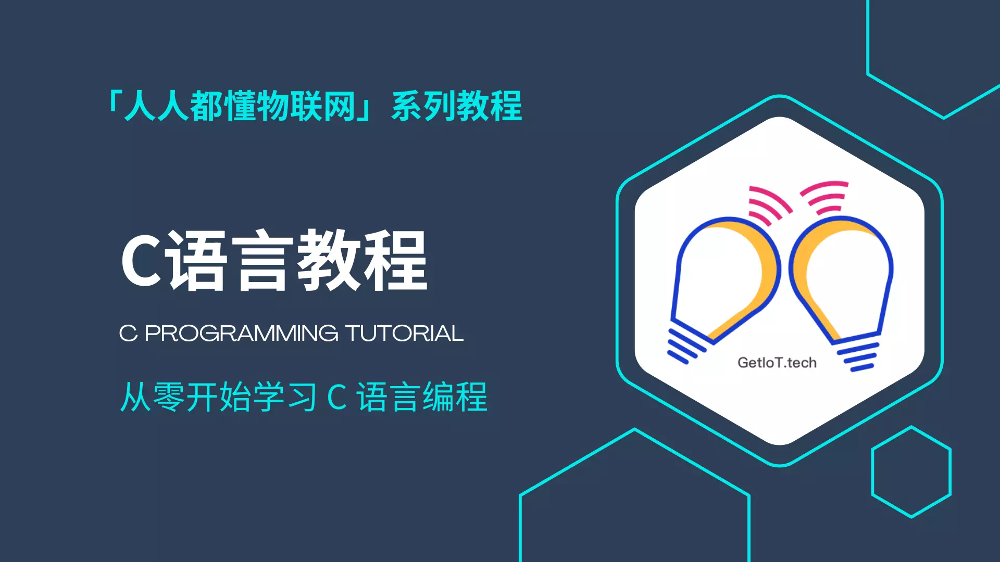

<confetti />

> [!WARNING]
> - 学习网站：https://getiot.tech/c/c-intro/
> - 欢迎来到 C 的世界！C 语言是一门“古老”的语言，诞生于1972年，至今已经半个世纪。但是它依然是一门非常流行的计算机编程语言，应用非常广泛，几乎所有智能电子设备中都有它的身影。

在这个 C 语言系列教程中，你将学习 C 语言的基本概念、基础语法、关键特性、编译运行方法、指针的使用等等。在高阶课程中，我们会进一步讲解 C 语言的高级特性，C 程序工程的组织、跨语言调用，以及一些常用的 C 库使用。在教程的最后，我们会通过一些综合案例，带你了解如何使用 C 语言设计并实现一些有趣、实用的程序。

