> [!TIP]
>
> 参考教程：【电子元器件+模拟电路硬件零基础入门，mos管三极管、电阻电容电感、电子元件、CircuitSimulator】https://www.bilibili.com/video/BV14dTczJE4X?vd_source=d1be7a4fa41169e519ea11876b261491

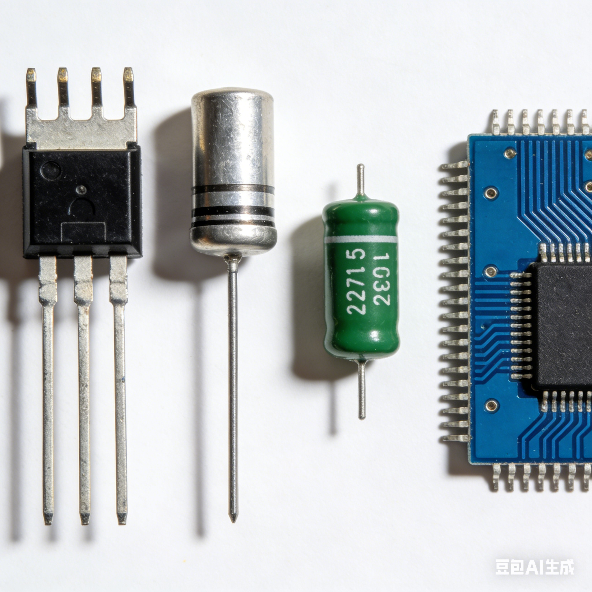

# 一 电路基础

## 1.1 原⼦知识

### 1.1.1 原子

- **定义**：化学反应中的最小粒子，保持着元素的基本化学性质。不同元素的原子种类不同。
- **结构**：像一个极其微小的“太阳系”。
  - **原子核**：位于中心，**体积很小但质量极大**（占原子总质量的99.94%以上）。原子核由**质子**和**中子**紧密结合而成。
  - **电子**：在原子核外很大的空间里高速运动，质量非常轻（约为质子的1/1836），带**负电**。

| 粒子     | 电荷           | 相对质量        | 位置         | 作用                                                         |
| -------- | -------------- | --------------- | ------------ | ------------------------------------------------------------ |
| **质子** | **+1（正电）** | 1               | 原子核内     | **定义元素种类**。原子核中有几个质子，就决定了它是哪种元素（原子序数）。 |
| **中子** | **0（中性）**  | ≈1 (略重于质子) | 原子核内     | **稳定原子核**。中子通过强核力帮助质子结合在一起，防止因正电相斥而飞散。**同位素**（同种元素的不同形态）就是由中子数不同造成的。 |
| **电子** | **-1（负电）** | 约1/1836        | 原子核外空间 | **决定化学性质**。电子在化学反应中可以被得失或共享，从而形成化学键。正常情况下，原子中**质子数 = 电子数**，所以整个原子呈电中性。 |

- 原⼦是构成物质的最⼩单位，它由原⼦核和电⼦组成，其中原⼦核由质⼦和中⼦组成。

  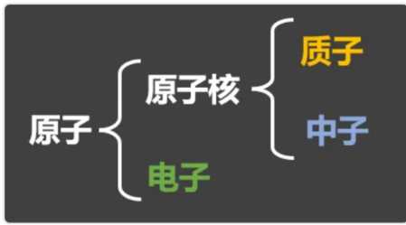

  > 简易模型图
  >
  > 备注：此处提及原⼦结构，是为了给后续的：电流、电压、⼆极管、三极管等知识做铺垫，但也会忽略掉⼀些与电学⽆关的知识，⽐如：有些元素（氢的同位素氕）没有中⼦，再⽐如：中⼦和质⼦的⽐例关系，会对元素的放射性有⼀定影响等，这些知识不在课程中体现。

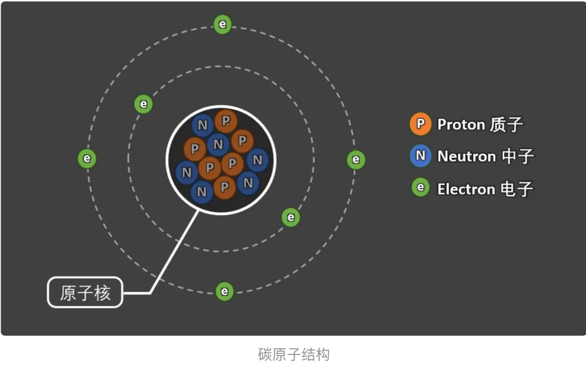

### 1.1.2 质子

- 质⼦带⼀个单位的正电荷，且质⼦数量决定着元素身份，改变了质⼦数量，也就改变了原⼦的类型。

### 1.1.3 中⼦

- 中⼦不带电，且中⼦对原⼦的影响远⼩于质⼦。

### 1.1.4 电子

- 电⼦带⼀个单位的负电荷，它围绕原⼦核做⽆规则的运动。

- 通常来说原⼦的质⼦数和电⼦数相等，其内部的正电荷与负电荷互相抵消，这时候原⼦呈电中性。

- 电⼦层：电⼦围绕原⼦核活动的范围。
- 最外层电⼦数为 8个时，通常是较稳定的状态。
- 不同电荷之间互相吸引，相同电荷之间互相排斥。
- 最外层的电⼦更容易脱离原⼦，因为它们与原⼦核的距离较远，受到的引⼒较弱。

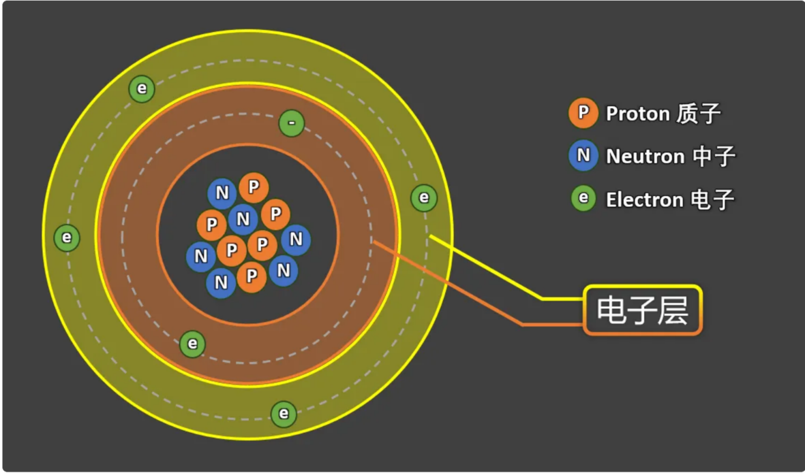

> 每个电⼦层上最多可容纳的电⼦数为 ： 2n （n是电⼦层的编号），例如：
>
> 1. 第⼀层（n=1）最多容纳： 2 * 1 = 2 个电⼦
>
> 2. 第⼆层（n=2）最多容纳： 2 * 2 = 8 个电⼦
>
> 3. 第三层（n=3）最多容纳： 2 * 3 = 18 个电⼦

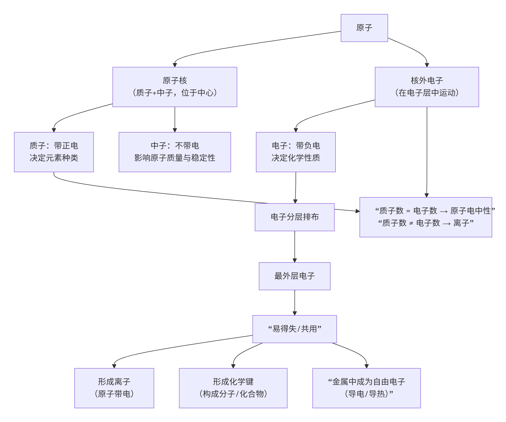

## 1.2 电流

### 1.2.1 概念

> [!TIP]
>
> 概念：电荷的定向移动，形成了电流，衡量电流的⼤⼩，要看单位时间内通过导体横截⾯的电荷量。
>
> 注意：电学上定义的『电流⽅向』是正电荷的流动的⽅向，这个概念在19世纪初就先被定义了，后来虽然发现了是电⼦在移动，但为了保持定义的统⼀性，『电流⽅向』仍然⽤正电荷的流动去定义，所以『电流⽅向』与『电⼦移动⽅向』是相反的。

### 1.2.2 单位

- 单位：安培(A)
- 1A 的含义：1秒钟内有 6.242*10 个单位电荷通过了导体横截⾯（电⼦、质⼦、都属于单位电荷）。
- 备注： 6.242*10 个单位电荷所带的电荷总量，为 1 库伦(C)。所以 1A 的含义也能这样描述： 在1秒钟内，有1库仑的电荷通过了导体的横截⾯。

### 1.2.3 单位换算

- 进位为1000，例如 **1A = 1000mA** ，常⽤的是： 安(A)、毫安(mA)

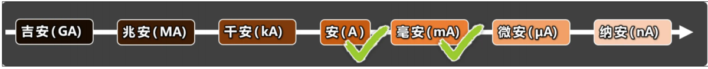

### 1.2.4 常⻅电器的⼯作电流

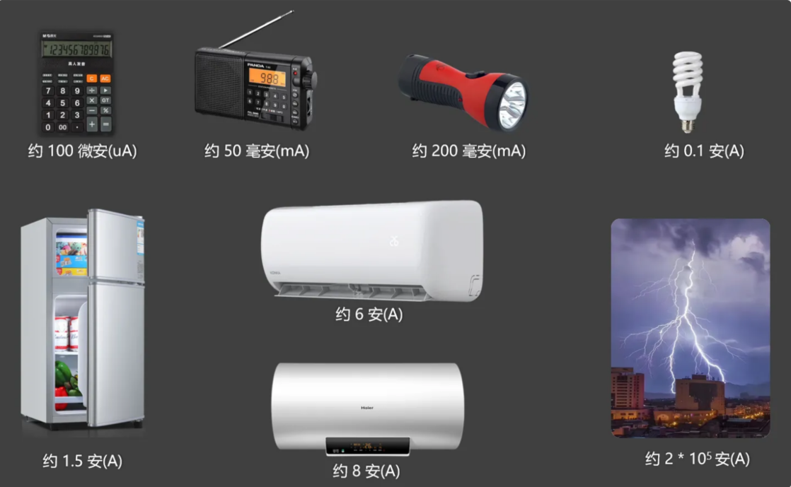

## 1.3 电场、电势、电势能

### 1.3.1 重⼒场、电场

> - 重⼒场：在地球周围存在，有质量的物体进⼊该区域后，会受到被拉向中⼼的⼒。
>
> - 电场：在电荷周围存在，带电的粒⼦进⼊这个区域后，会受到吸引⼒或排斥⼒。
> - 沿着电场线⽅向，电场的强度会逐渐减弱，且⽆论正电荷还是负电荷，⽆穷远处的电场强度为 0。

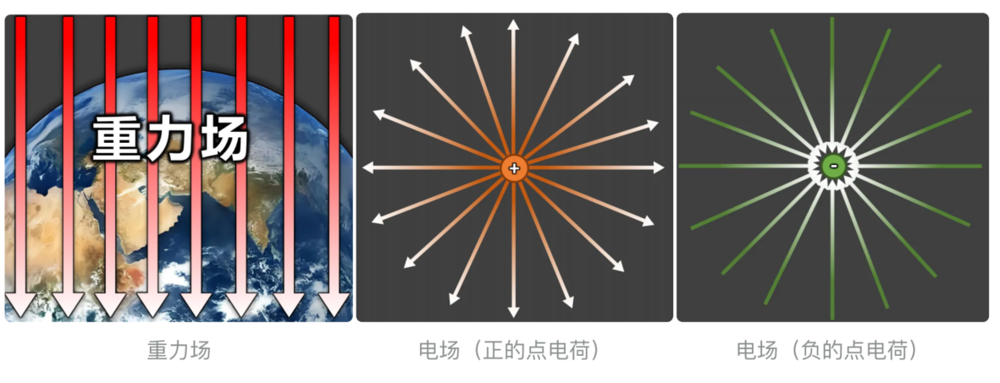

### 1.3.2 重⼒势能、电势能

> - 重⼒势能：描述物体在重⼒场中所具备的能量，与所处位置、物体质量，均有关。
> - 电势能：描述带电粒⼦在电场中所具备的能量，与所处位置、粒⼦带电量，均有关。
> - 左图中：桌⼦⾼度越⾼、⼩球质量越⼤，它所具备的重⼒势能就越⼤。
> - 右图中：电场中试探电荷距离中⼼电荷距离越近、试探电荷所带电量越多，电势能就越⼤。

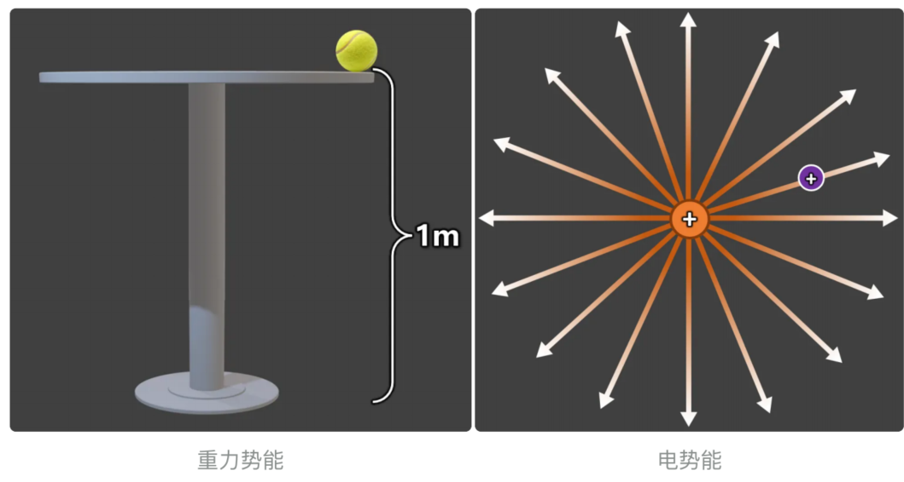

### 1.3.3 重⼒势、电势

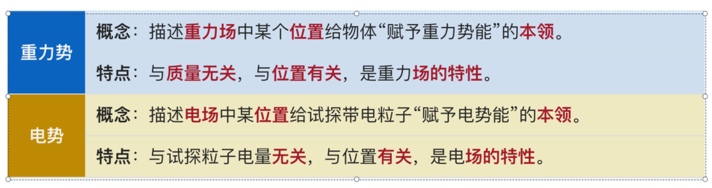

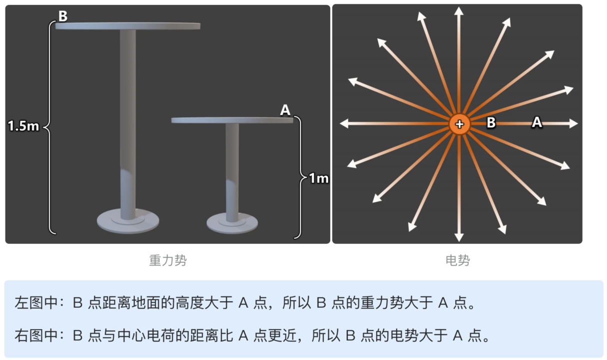

## 1.4 电压

### 1.4.1 概念

- ⼜称电势差，是两点之间电势的差值，衡量电压的⼤⼩，要看两点电势差的⼤⼩。

### 1.4.2 单位

- 伏特( **V** )
- **1V** 的含义是：电场 对 1库伦(C) 电荷，做了 1焦⽿(J) 的功。

### 1.4.3 单位换算

- 进位为1000，例如 1kV = 1000V

### 1.4.4 常⻅电源的电压

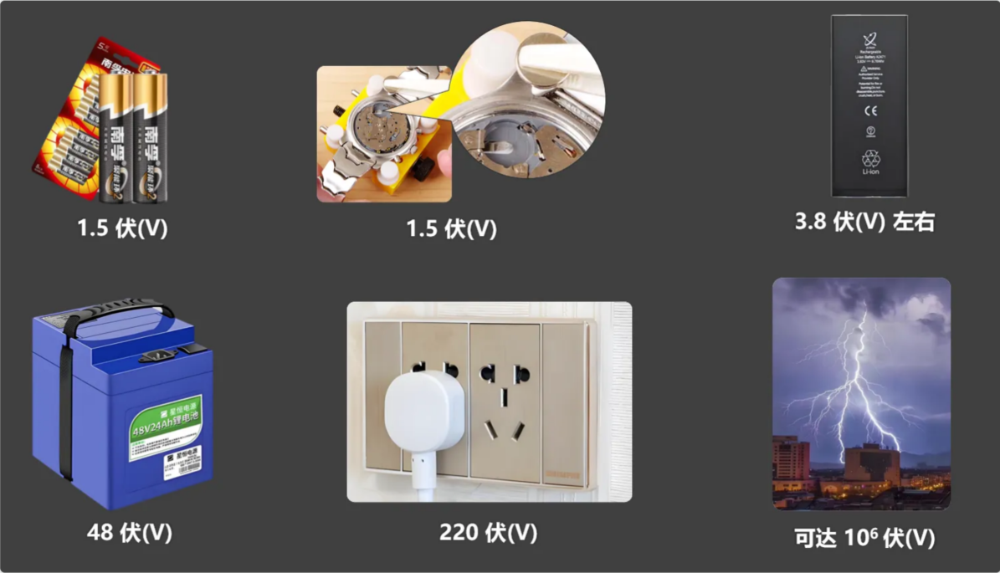

## 1.5 电阻

### 1.5.1 概念

- 材料或元器件对电流流动的阻碍程度。

### 1.5.2 单位

- 欧姆（简称欧），符号是Ω。

- 1Ω 的含义：给导体施加 1V 电压，此时如果导体的电流为1A，那这个导体的电阻就是1Ω。

### 1.5.3 单位换算

- 进位为1000，例如 1KΩ = 1000Ω

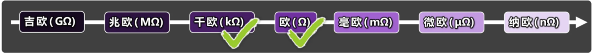

### 1.5.4 电阻决定式

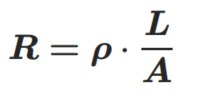

> R：电阻。
>
> ρ：材料的电阻率，表示材料对电流的阻碍能⼒。
>
> L：导体的⻓度。
>
> A：导体的横截⾯积。

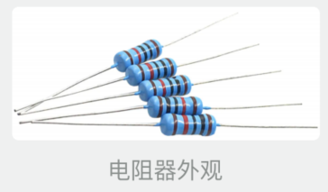

## 1.6 电路

### 1.6.1 概念

- 电源：物理学中将提供电能的装置叫做电源。
- ⽤电器：将灯泡、电动机、等这类消耗电能的装置叫做⽤电器。
- 电路：电源、⽤电器，再加上导线、开关等，组就成了电流可以流过的路径，这就是电路

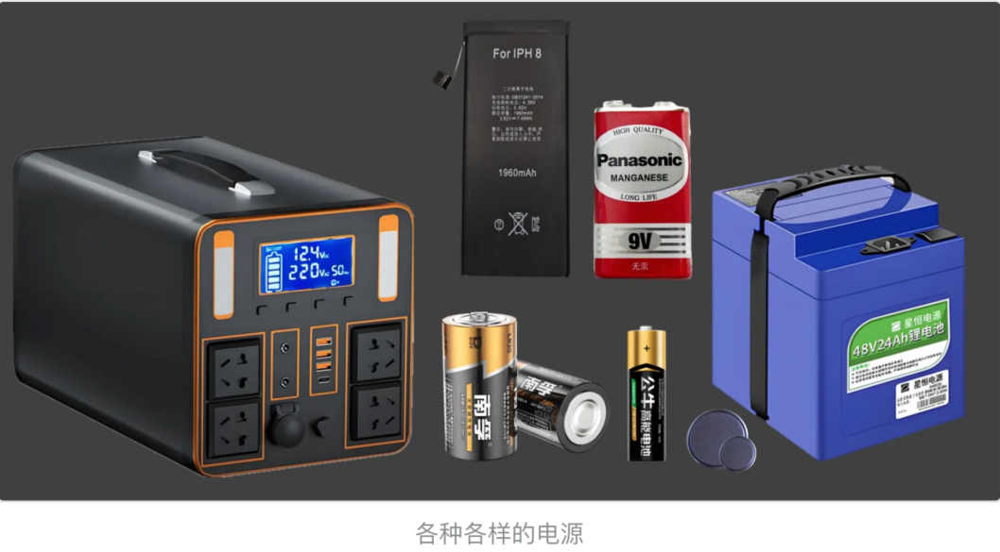

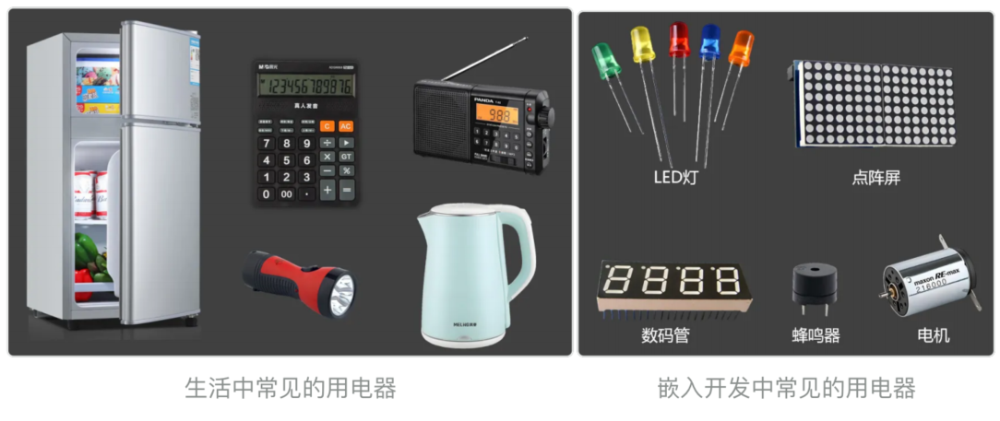

### 1.6.2 电路图

- 在绘制电路图时，为了绘制简单且⽅便研究，通常⽤图形符号来表示元件。

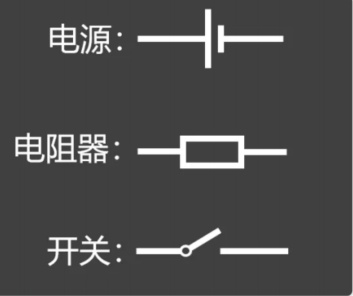

### 1.6.3 电路状态

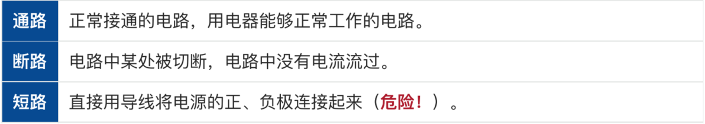

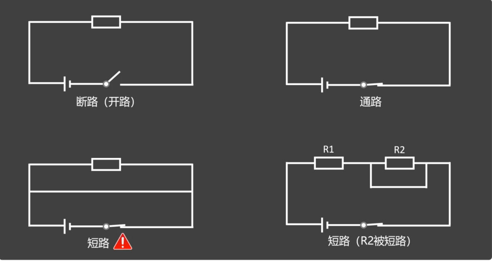

## 1.7 欧姆定律

### 1.7.1 概念

- 导体中的电流，与导体两端的电压成正⽐，与导体的电阻成反⽐。
- 推导结论：在电阻不变的情况下，电压越⼤，电流也会越⼤。

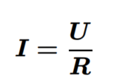

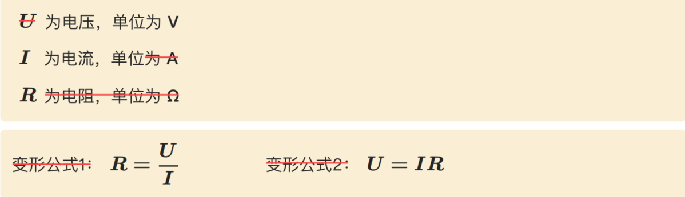

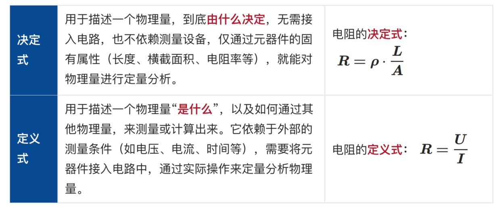

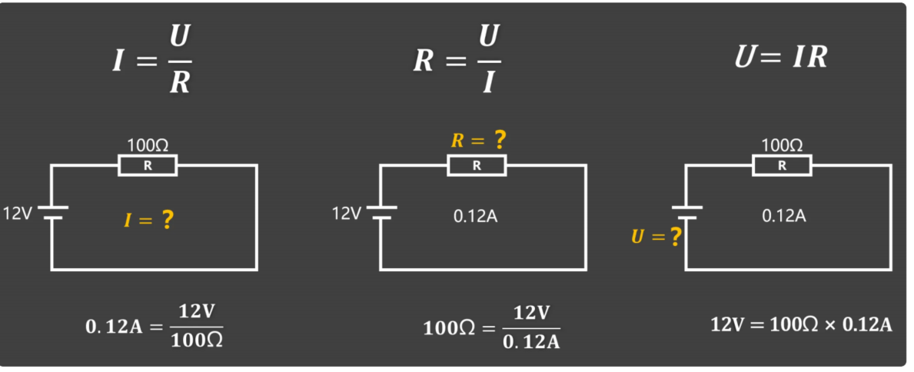

### 1.7.2 直流电与交流电

> 直流电：有固定的正负极，且电流⽅向始终『不变』的电流，全称：Direct Current，简称DC

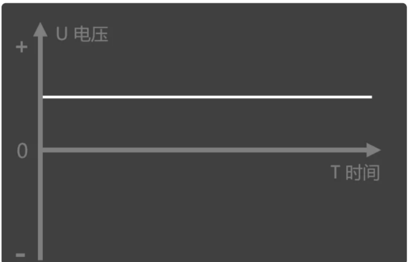

> 交流电： 电流⽅向随时间做『周期性变化』的电流，全称：Alternating Current，简称 AC。
>
> 交流电的电流⽅向⼀定做周期性变化，但电流⼤⼩不⼀定做周期性变化！

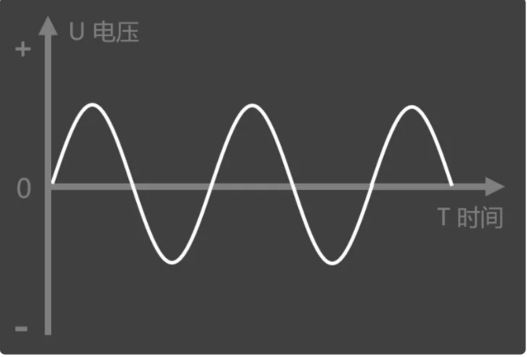

> 整流 ：交流（AC） → 直流（DC）
>
> 逆变 ：直流（DC） → 交流（AC）
>
> 备注：在⽣活中很多的电器，都是把交流变成直流后⼯作的，例如：电脑、⼿机、路由器等，因为直流电更加稳定，适合精密电路。

### 1.7.3 强电与弱电

> 弱电：电压⼀般较低，⾏业规定安全电压为不⾼于36V，弱电通常⽤于直流电路（3.3V、5V、12V）、弱电也能于信号传递，例如：⾳频和视频线路、⽹络线路、电话线等。

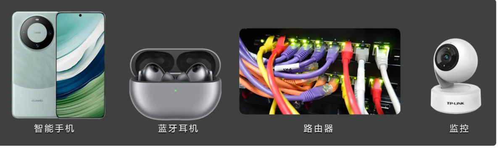

> 强电：电压⼀般很⾼，例如：220V 的家⽤电，1000V 及以上的⾼压电，强电常⽤于传递能量。

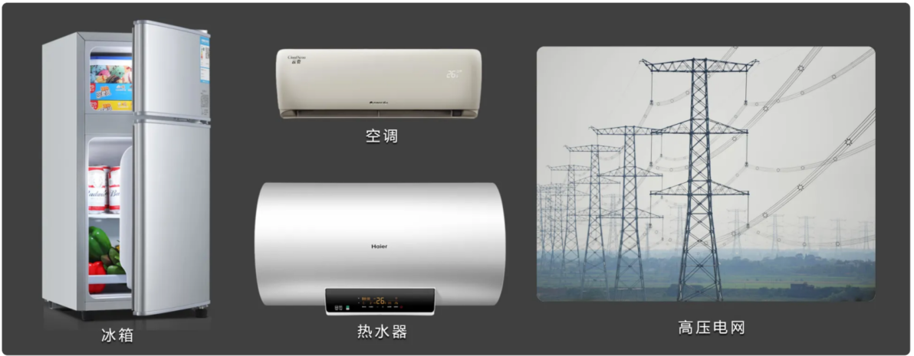

## 1.8  串联与并联

### 1.8.1 串联电路

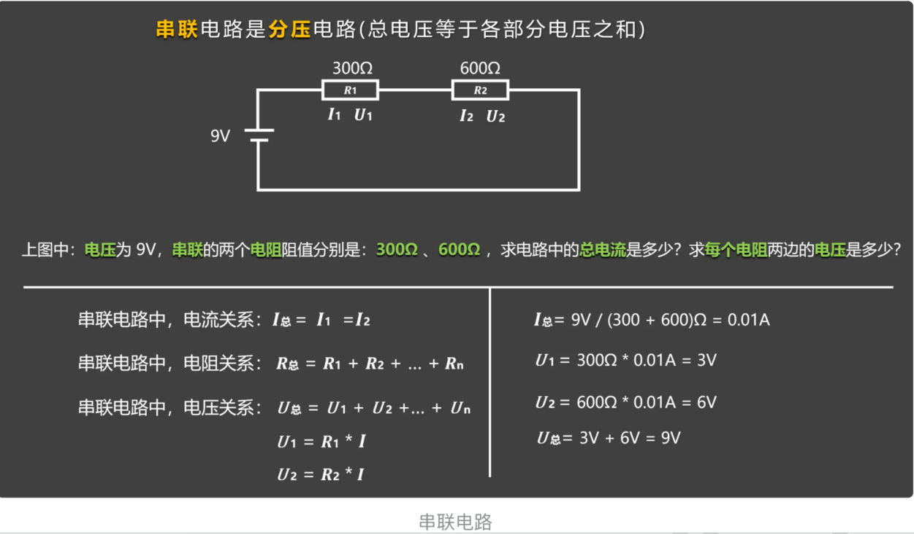

### 1.8.2 并联电路

## 1.9 电路仿真软件

> 在线地址：https://cc.xiaogd.net/

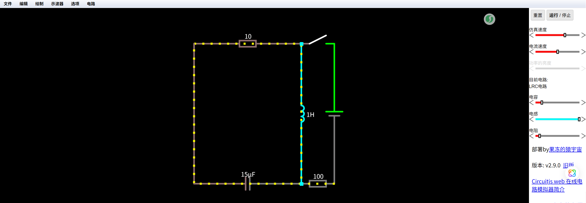

## 1.10 电功率

### 1.10.1 概念

> [!TIP]
>
> 概念：⽤于衡量电流在单位时间内所做的功（⽤来表示⽤电器消耗电能快慢的物理量）。
>
> 单位：瓦特（简称瓦），符号是W。
>
> 单位换算：进位为1000，例如： 1kW = 1000W 。

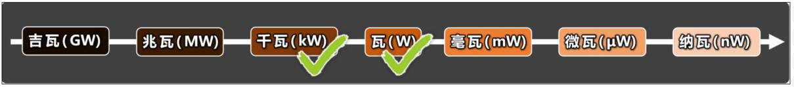

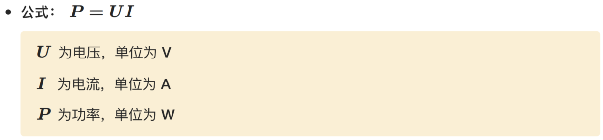

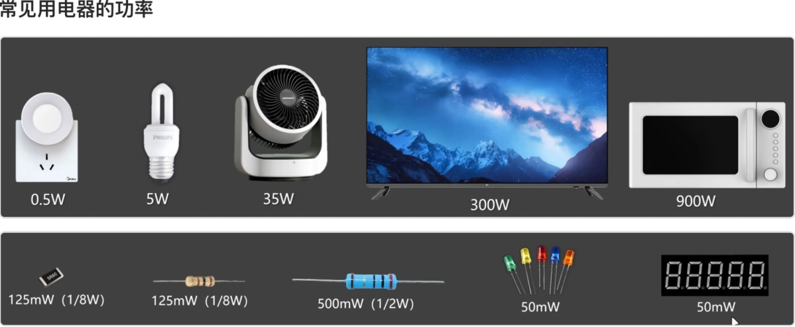

### 1.10.2 瓦时 VS 千瓦时

> ⼆者都是表示电能的⼀种单位。
>
> 1. 瓦时：
>
> 瓦时是功率（W）与时间（h）的乘积， 即：瓦时 = 功率 × 时间。
>
> ⼀个 1W 的⽤电器，⼯作 1h ，它消耗的电量就是1瓦时（ 1Wh ）。
>
> **2.** 千瓦时：
>
> 千瓦时是瓦时的千倍， 通常⽤于描述⼤型电⼒设备，如电表读数、新能源汽⻋等。
>
> ⼀个 1kW 的电器⼯作 1h ，它消耗的电量就是1千瓦时（ 1kWh ，俗称1度电）。

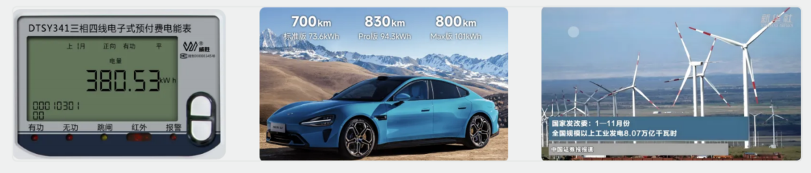

### 1.10.3 安时、毫安时

> ⼆者都是描述电池容量的单位。
>
> 1. 安时：表示该电池能以 1A 的电流持续⼯作 1h ，通常⽤于描述⼤容量的电池。
>
> 2. 毫安时：安时的千分之⼀，通常⽤于描述⼩容量的电池。
>
> 例如：华为『Mate70 Pro』⼿机电池容量为 5700mAh ，充电宝的电池容量为 20000mAh ，有些时候我们也省略 h ，直接说：⼿机的电池容量和为 5700mA ，充电宝电池容量为： 20000mA 。

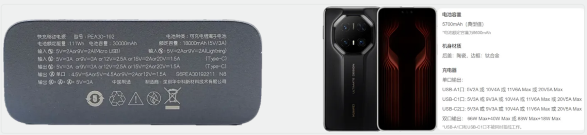
