> [!TIP]
>
> 参考教程：【电子元器件+模拟电路硬件零基础入门，mos管三极管、电阻电容电感、电子元件、CircuitSimulator】https://www.bilibili.com/video/BV14dTczJE4X?vd_source=d1be7a4fa41169e519ea11876b261491

# 一 电路基础

## 1.1 原⼦知识

### 1.1.1 原子

- **定义**：化学反应中的最小粒子，保持着元素的基本化学性质。不同元素的原子种类不同。
- **结构**：像一个极其微小的“太阳系”。
  - **原子核**：位于中心，**体积很小但质量极大**（占原子总质量的99.94%以上）。原子核由**质子**和**中子**紧密结合而成。
  - **电子**：在原子核外很大的空间里高速运动，质量非常轻（约为质子的1/1836），带**负电**。

| 粒子     | 电荷           | 相对质量        | 位置         | 作用                                                         |
| -------- | -------------- | --------------- | ------------ | ------------------------------------------------------------ |
| **质子** | **+1（正电）** | 1               | 原子核内     | **定义元素种类**。原子核中有几个质子，就决定了它是哪种元素（原子序数）。 |
| **中子** | **0（中性）**  | ≈1 (略重于质子) | 原子核内     | **稳定原子核**。中子通过强核力帮助质子结合在一起，防止因正电相斥而飞散。**同位素**（同种元素的不同形态）就是由中子数不同造成的。 |
| **电子** | **-1（负电）** | 约1/1836        | 原子核外空间 | **决定化学性质**。电子在化学反应中可以被得失或共享，从而形成化学键。正常情况下，原子中**质子数 = 电子数**，所以整个原子呈电中性。 |

- 原⼦是构成物质的最⼩单位，它由原⼦核和电⼦组成，其中原⼦核由质⼦和中⼦组成。

  

  > 简易模型图
  >
  > 备注：此处提及原⼦结构，是为了给后续的：电流、电压、⼆极管、三极管等知识做铺垫，但也会忽略掉⼀些与电学⽆关的知识，⽐如：有些元素（氢的同位素氕）没有中⼦，再⽐如：中⼦和质⼦的⽐例关系，会对元素的放射性有⼀定影响等，这些知识不在课程中体现。

### 1.1.2 质子

- 质⼦带⼀个单位的正电荷，且质⼦数量决定着元素身份，改变了质⼦数量，也就改变了原⼦的类型。

### 1.1.3 中⼦

- 中⼦不带电，且中⼦对原⼦的影响远⼩于质⼦。

### 1.1.4 电子

- 电⼦带⼀个单位的负电荷，它围绕原⼦核做⽆规则的运动。

- 通常来说原⼦的质⼦数和电⼦数相等，其内部的正电荷与负电荷互相抵消，这时候原⼦呈电中性。

- 电⼦层：电⼦围绕原⼦核活动的范围。
- 最外层电⼦数为 8个时，通常是较稳定的状态。
- 不同电荷之间互相吸引，相同电荷之间互相排斥。
- 最外层的电⼦更容易脱离原⼦，因为它们与原⼦核的距离较远，受到的引⼒较弱。

> 每个电⼦层上最多可容纳的电⼦数为 ： 2n （n是电⼦层的编号），例如：
>
> 1. 第⼀层（n=1）最多容纳： 2 * 1 = 2 个电⼦
>
> 2. 第⼆层（n=2）最多容纳： 2 * 2 = 8 个电⼦
>
> 3. 第三层（n=3）最多容纳： 2 * 3 = 18 个电⼦

## 1.2 电流

### 1.2.1 概念

> [!TIP]
>
> 概念：电荷的定向移动，形成了电流，衡量电流的⼤⼩，要看单位时间内通过导体横截⾯的电荷量。
>
> 注意：电学上定义的『电流⽅向』是正电荷的流动的⽅向，这个概念在19世纪初就先被定义了，后来虽然发现了是电⼦在移动，但为了保持定义的统⼀性，『电流⽅向』仍然⽤正电荷的流动去定义，所以『电流⽅向』与『电⼦移动⽅向』是相反的。

### 1.2.2 单位

- 单位：安培(A)
- 1A 的含义：1秒钟内有 6.242*10 个单位电荷通过了导体横截⾯（电⼦、质⼦、都属于单位电荷）。
- 备注： 6.242*10 个单位电荷所带的电荷总量，为 1 库伦(C)。所以 1A 的含义也能这样描述： 在1秒钟内，有1库仑的电荷通过了导体的横截⾯。

### 1.2.3 单位换算

- 进位为1000，例如 **1A = 1000mA** ，常⽤的是： 安(A)、毫安(mA)

### 1.2.4 常⻅电器的⼯作电流

## 1.3 电场、电势、电势能

### 1.3.1 重⼒场、电场

> [!TIP]
>
> - 重⼒场：在地球周围存在，有质量的物体进⼊该区域后，会受到被拉向中⼼的⼒。
>
> - 电场：在电荷周围存在，带电的粒⼦进⼊这个区域后，会受到吸引⼒或排斥⼒。
> - 沿着电场线⽅向，电场的强度会逐渐减弱，且⽆论正电荷还是负电荷，⽆穷远处的电场强度为 0。

### 1.3.2 重⼒势能、电势能

> [!TIP]
>
> - 重⼒势能：描述物体在重⼒场中所具备的能量，与所处位置、物体质量，均有关。
> - 电势能：描述带电粒⼦在电场中所具备的能量，与所处位置、粒⼦带电量，均有关。
> - 左图中：桌⼦⾼度越⾼、⼩球质量越⼤，它所具备的重⼒势能就越⼤。
> - 右图中：电场中试探电荷距离中⼼电荷距离越近、试探电荷所带电量越多，电势能就越⼤。

### 1.3.3 重⼒势、电势

## 1.4 电压

### 1.4.1 概念

- ⼜称电势差，是两点之间电势的差值，衡量电压的⼤⼩，要看两点电势差的⼤⼩。

### 1.4.2 单位

- 伏特( **V** )
- **1V** 的含义是：电场 对 1库伦(C) 电荷，做了 1焦⽿(J) 的功。

### 1.4.3 单位换算

- 进位为1000，例如 1kV = 1000V

### 1.4.4 常⻅电源的电压

## 1.5 电阻

### 1.5.1 概念

- 材料或元器件对电流流动的阻碍程度。

### 1.5.2 单位

- 欧姆（简称欧），符号是Ω。

- 1Ω 的含义：给导体施加 1V 电压，此时如果导体的电流为1A，那这个导体的电阻就是1Ω。

### 1.5.3 单位换算

- 进位为1000，例如 1KΩ = 1000Ω

### 1.5.4 电阻决定式

> R：电阻。
>
> ρ：材料的电阻率，表示材料对电流的阻碍能⼒。
>
> L：导体的⻓度。
>
> A：导体的横截⾯积。

## 1.6 电路

### 1.6.1 概念

> [!TIP]
>
> - 电源：物理学中将提供电能的装置叫做电源。
> - ⽤电器：将灯泡、电动机、等这类消耗电能的装置叫做⽤电器。
> - 电路：电源、⽤电器，再加上导线、开关等，组就成了电流可以流过的路径，这就是电路

### 1.6.2 电路图

- 在绘制电路图时，为了绘制简单且⽅便研究，通常⽤图形符号来表示元件。

### 1.6.3 电路状态

## 1.7 欧姆定律

### 1.7.1 概念

- 导体中的电流，与导体两端的电压成正⽐，与导体的电阻成反⽐。
- 推导结论：在电阻不变的情况下，电压越⼤，电流也会越⼤。

### 1.7.2 直流电与交流电

> 直流电：有固定的正负极，且电流⽅向始终『不变』的电流，全称：Direct Current，简称DC

> 交流电： 电流⽅向随时间做『周期性变化』的电流，全称：Alternating Current，简称 AC。
>
> 交流电的电流⽅向⼀定做周期性变化，但电流⼤⼩不⼀定做周期性变化！

> 整流 ：交流（AC） → 直流（DC）
>
> 逆变 ：直流（DC） → 交流（AC）
>
> 备注：在⽣活中很多的电器，都是把交流变成直流后⼯作的，例如：电脑、⼿机、路由器等，因为直流电更加稳定，适合精密电路。

### 1.7.3 强电与弱电

> 弱电：电压⼀般较低，⾏业规定安全电压为不⾼于36V，弱电通常⽤于直流电路（3.3V、5V、12V）、弱电也能于信号传递，例如：⾳频和视频线路、⽹络线路、电话线等。

> 强电：电压⼀般很⾼，例如：220V 的家⽤电，1000V 及以上的⾼压电，强电常⽤于传递能量。

## 1.8  串联与并联

### 1.8.1 串联电路

### 1.8.2 并联电路

## 1.9 电路仿真软件

> 在线地址：https://cc.xiaogd.net/

## 1.10 电功率

### 1.10.1 概念

> [!TIP]
>
> 概念：⽤于衡量电流在单位时间内所做的功（⽤来表示⽤电器消耗电能快慢的物理量）。
>
> 单位：瓦特（简称瓦），符号是W。
>
> 单位换算：进位为1000，例如： 1kW = 1000W 。

### 1.10.2 瓦时 VS 千瓦时

> [!TIP]
>
> ⼆者都是表示电能的⼀种单位。
>
> 1. 瓦时：
>
> 瓦时是功率（W）与时间（h）的乘积， 即：瓦时 = 功率 × 时间。
>
> ⼀个 1W 的⽤电器，⼯作 1h ，它消耗的电量就是1瓦时（ 1Wh ）。
>
> **2.** 千瓦时：
>
> 千瓦时是瓦时的千倍， 通常⽤于描述⼤型电⼒设备，如电表读数、新能源汽⻋等。
>
> ⼀个 1kW 的电器⼯作 1h ，它消耗的电量就是1千瓦时（ 1kWh ，俗称1度电）。

### 1.10.3 安时、毫安时

> [!TIP]
>
> ⼆者都是描述电池容量的单位。
>
> 1. 安时：表示该电池能以 1A 的电流持续⼯作 1h ，通常⽤于描述⼤容量的电池。
>
> 2. 毫安时：安时的千分之⼀，通常⽤于描述⼩容量的电池。
>
> 例如：华为『Mate70 Pro』⼿机电池容量为 5700mAh ，充电宝的电池容量为 20000mAh ，有些时候我们也省略 h ，直接说：⼿机的电池容量和为 5700mA ，充电宝电池容量为： 20000mA 。

### 1.10.4  焦耳定律

> - 电流通过导体产⽣的热量与电流的平⽅成正⽐，跟导体的电阻成正⽐，跟通电时间成正⽐。
> - 单位：焦⽿(J)，简称焦

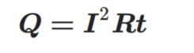

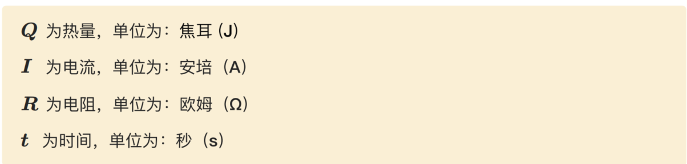

- 案例：⼀根 60Ω 的电阻丝接在 36V 的电源两端，在 5s 内共产⽣多少热量？

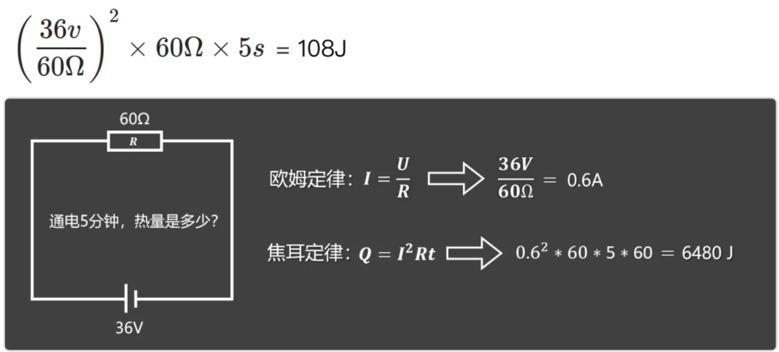

> 注意：电路通过导体时，如果电能全部转化为内能，⽽没有同时转化为其他形式的能量，那么电流产⽣的热量就等于消耗的电能，但实际上：只有纯电阻电路，才能把电能完全⽤于产⽣热量！

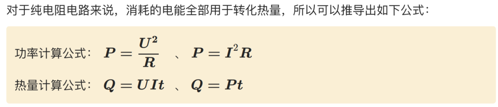

# 二 元器件基本知识

## 2.1 元器件封装方式

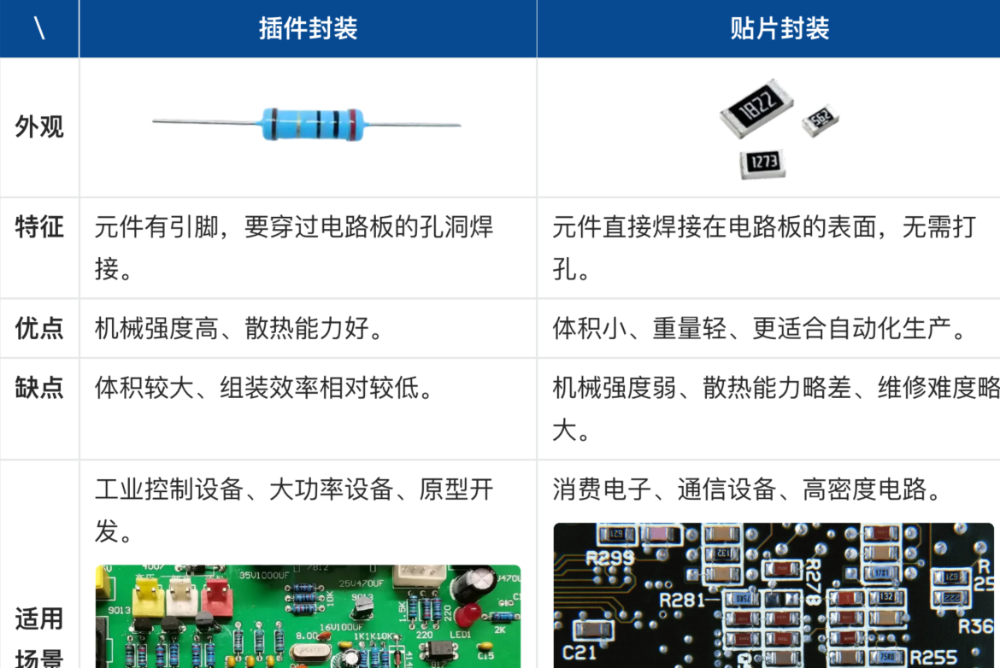

> 插件封装

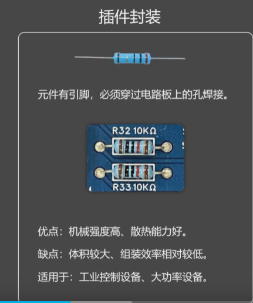

> 贴片封装

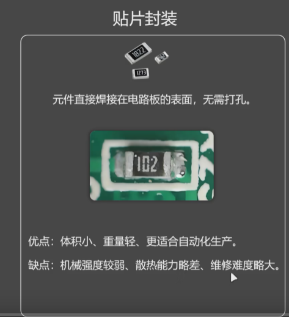

> 大多是贴片封装，少数插件封装

- 51开发板

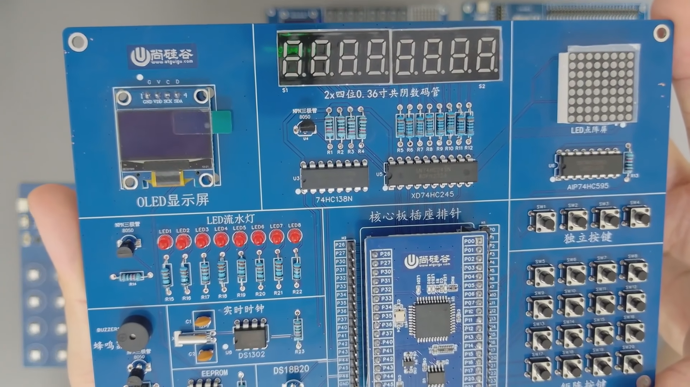

- 32开发板

## 2.2 采购

> 官网：https://www.szlcsc.com/

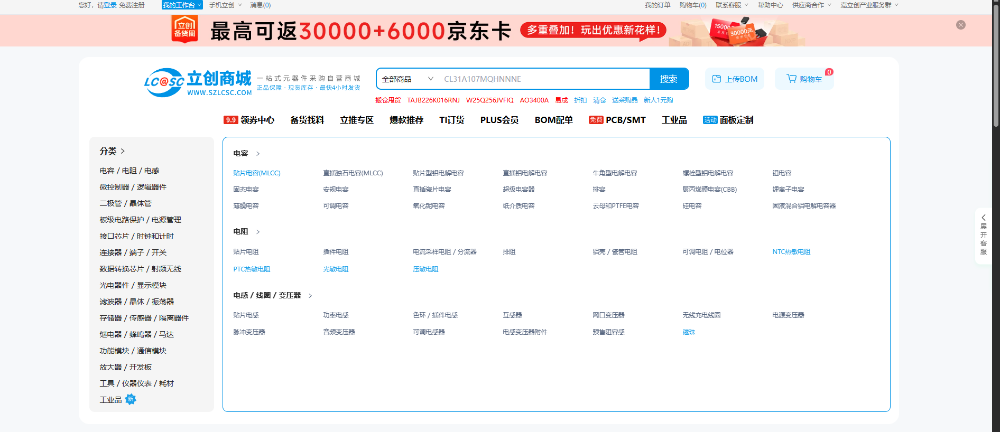

> 直流稳定电源：**直流稳定电源的作用是：为电子设备提供“干净、可控、安全”的直流电，确保系统可靠运行和精准测试。**

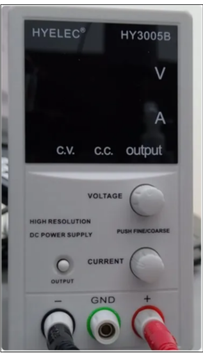

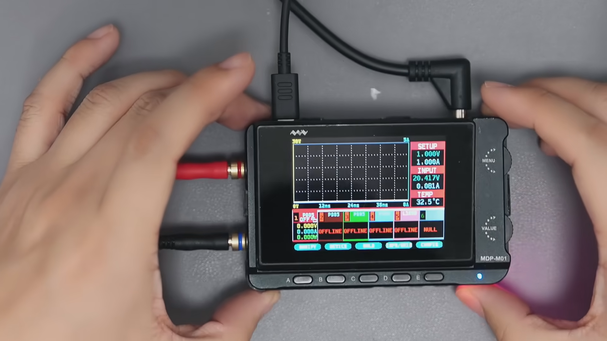

## 2.3 电阻器

> [!WARNING]
>
> 电阻器的理解：
>
> - 电阻器是一种对电流产生阻碍作用的电子元件，它的核心功能是控制电路中的电流和电压。水暖系统
>
> > 想象一个给房子供暖的水循环系统：
> >
> > - **电池/电源** 就像 **水泵**，提供压力（电压）让水流动。
> > - **导线** 就像 **水管**，是水（电流）流动的通道。
> > - **电阻器** 就像 **水龙头或一个狭窄的水管段**。
> >   - **阻碍水流**：当你关小水龙头（增大电阻），水流（电流）就变小了；开大水龙头（减小电阻），水流就变大。
> >   - **产生压降**：水流经过狭窄处，前方压力会降低。同样，电流经过电阻，电阻两端的电压也会降低。电阻就像一个“消耗电压的元件”。
> >   - **能量转换**：水在流经狭窄处时，摩擦会产生热量。电流在流经电阻时，电子碰撞也会产生热量，这就是电阻的**发热效应**。
> >
> > **核心公式：欧姆定律**
> >
> > 这个水系统的规律，在电学中就是 **`V = I × R`**。
> >
> > - **V (电压)**： 水泵的压力差，单位伏特。
> > - **I (电流)**： 水流的流量，单位安培。
> > - **R (电阻)**： 水龙头的“狭窄程度”，单位欧姆。
> >
> > **这个公式告诉我们三者的关系：在同样的电压下，电阻越大，电流就越小；要得到同样的电流，电阻越大，需要的电压就越高。**

### 2.3.1 固定电阻

> [!TIP]
>
> **固定电阻**（Fixed Resistor）是最基础、最常见的电子元件之一，其核心特点是：**阻值在制造完成后即固定不变**（不随电压、电流、温度或时间显著变化，理想情况下为常数）。
>
> 1. 限流（Current Limiting）
>    - 限制电路中的电流大小，保护敏感器件（如 LED、晶体管）。
>    - 例：串联一个 220Ω 电阻给 LED 供电，防止过流烧毁。
> 2. 分压（Voltage Division）
>    - 与其它电阻组成分压电路，获取所需电压。
>    - 例：传感器信号调理、ADC 参考电压生成。
> 3. 上拉/下拉（Pull-up / Pull-down）
>    - 确保数字输入引脚在无信号时处于确定电平（高或低），避免悬空干扰。
>    - 常用于微控制器 GPIO、I²C 总线等。
> 4. 阻抗匹配（Impedance Matching）
>    - 减少信号反射，提高传输效率（在高频或长线通信中）。
> 5. 偏置设置（Biasing）
>    - 为晶体管、运放等有源器件提供合适的工作点（静态工作点）。
> 6. 终端匹配（Termination）
>    - 在通信线路末端接入电阻，消除信号振铃（如 RS-485、CAN 总线）。

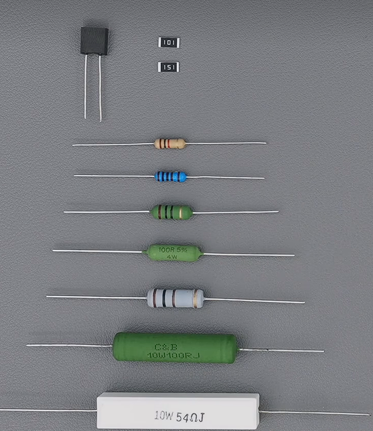

- 常见类型

| 类型            | 特点                                 | 应用场景               |
| --------------- | ------------------------------------ | ---------------------- |
| 碳膜电阻        | 成本低，噪声较大，精度一般（±5%）    | 普通消费电子、电源电路 |
| 金属膜电阻      | 精度高（±1% 或更高），温漂小，噪声低 | 仪器仪表、精密电路     |
| 金属氧化膜电阻  | 耐高温、耐高压，功率较大             | 电源、工业设备         |
| 绕线电阻        | 功率大，精度高，但有电感             | 大电流负载、电流采样   |
| 贴片电阻（SMD） | 体积小，适合自动化贴装               | 手机、电脑、各类 PCB   |

- 参数

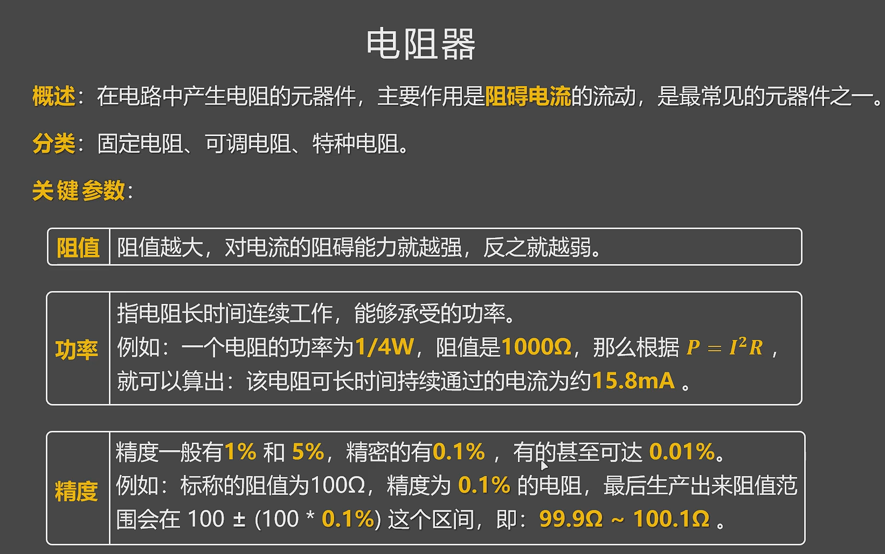

| 参数             | 说明                                     |
| ---------------- | ---------------------------------------- |
| 标称阻值         | 如 1kΩ、10kΩ、100Ω                       |
| 允许偏差（精度） | ±1%、±5% 等（E24、E96 系列）             |
| 额定功率         | 如 1/8W、1/4W、1W —— 超过会发热烧毁      |
| 温度系数（TCR）  | 单位：ppm/°C，表示温度变化引起的阻值漂移 |
| 最大工作电压     | 高压下可能击穿（尤其高阻值电阻）         |

> [!WARNING]
>
> 注意点：电阻的外观大小，和阻值没有必然联系，外观大小通常和功率有关。额定功率过载，温度过高

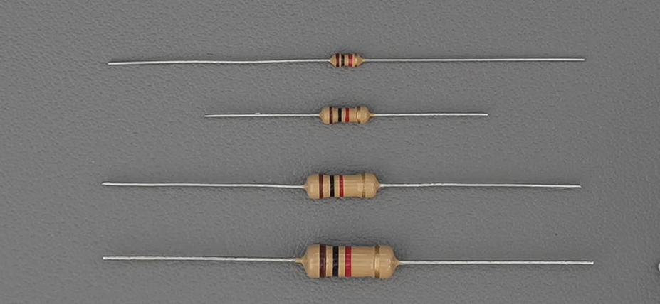

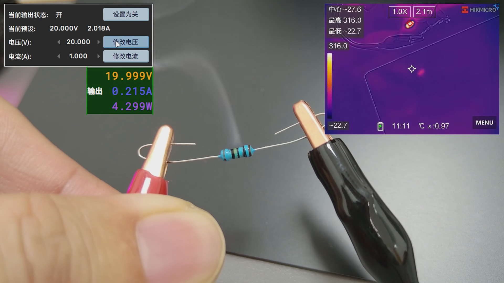

#### 2.3.1.1 线绕电阻

> [!TIP]
>
> **线绕电阻**（Wirewound Resistor）是一种通过将**高电阻率的合金电阻丝**（如康铜、锰铜、镍铬合金等）的方法制成的固定电阻器。它在功率、精度和稳定性方面具有独特优势，适用于特定高性能场景。
>
> - **电阻体**：精密绕制在陶瓷、玻璃纤维或铝制骨架上的电阻丝。
> - **封装**：通常外覆绝缘釉层、硅涂层或金属外壳（带散热片），部分可灌封环氧树脂。
> - **引脚**：轴向引线（直插）或螺栓安装（大功率）。
> - 本质：利用金属合金丝的**固有电阻率**实现阻值，物理结构稳定。

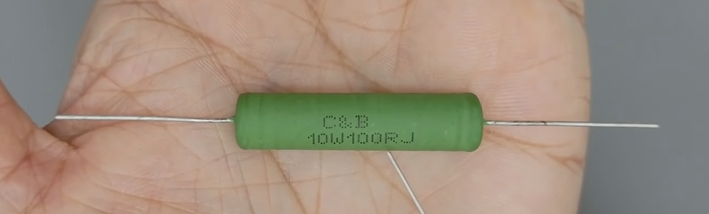

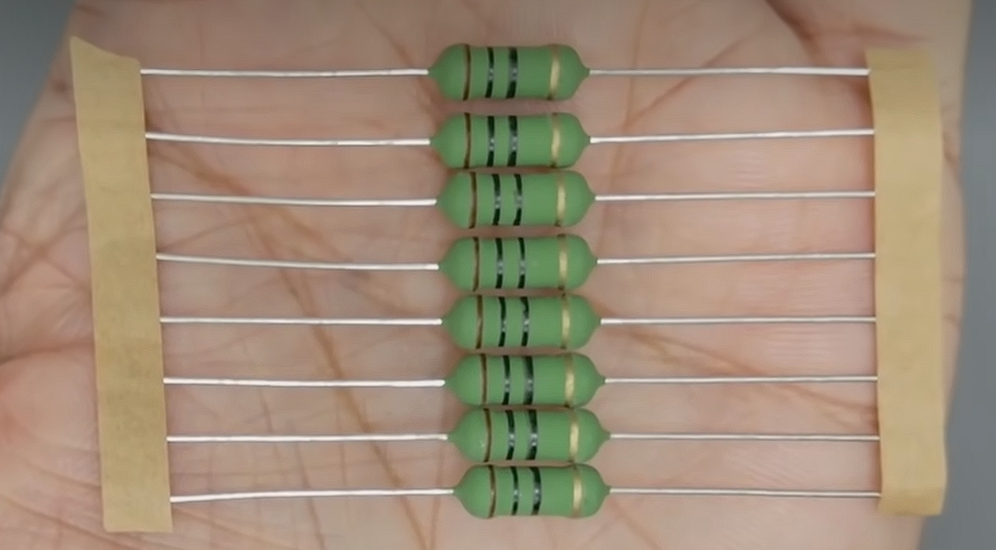

- 工艺

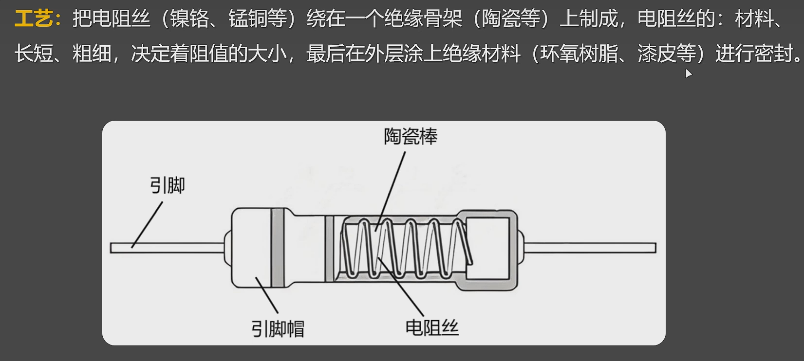

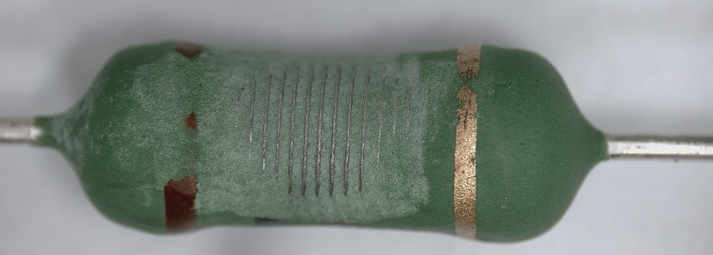

> 优点

| 特性           | 说明                                                     |
| -------------- | -------------------------------------------------------- |
| 高功率承受能力 | 可达数瓦至数百瓦（如 5W、10W、50W+），适合大电流场合     |
| 高精度         | 可做到 ±0.1%、±0.01% 甚至更高（用于标准电阻、测量仪器）  |
| 低温漂（TCR）  | 低至 ±5 ppm/°C（使用锰铜等材料），温度变化时阻值几乎不变 |
| 长期稳定性好   | 老化率低，适合长期工作的精密设备                         |
| 耐高温         | 工作温度可达 200°C 以上（取决于封装材料）                |

> 缺点

| 问题         | 原因                      | 影响                                       |
| ------------ | ------------------------- | ------------------------------------------ |
| 存在寄生电感 | 电阻丝绕成线圈 → 形成电感 | ❌ 不适用于高频电路（如射频、高速数字信号） |
| 体积较大     | 相比贴片或碳膜电阻        | 不适合高密度 PCB 设计                      |
| 成本较高     | 材料和工艺复杂            | 消费电子中较少使用                         |

> 场景

| 领域     | 应用示例                             |
| -------- | ------------------------------------ |
| 电源系统 | 开关电源电流采样、负载电阻、浪涌抑制 |
| 工业控制 | 电机驱动制动电阻、变频器能耗制动     |
| 测试测量 | 标准电阻箱、万用表内部基准、校准设备 |
| 音频设备 | 功放输出级（低噪声、高可靠性）       |
| 汽车电子 | 电池管理系统（BMS）电流检测          |
| 老化测试 | 作为假负载（Dummy Load）吸收功率     |

#### 2.3.1.2 碳膜电阻

> [!TIP]
>
> **碳膜电阻**（Carbon Film Resistor）是一种广泛应用的**固定电阻器**，因其成本低、性能稳定、制造工艺成熟，是消费类电子产品中最常见的电阻类型之一。
>
> - **基体**：陶瓷棒（绝缘、耐高温）
> - **电阻层**：在陶瓷棒表面**高温分解烃类气体**（如甲烷），沉积一层**结晶碳膜**
> - **调节阻值**：通过激光或机械方式在碳膜上切割出螺旋槽，改变导电路径长度
> - **封装**：外覆环氧树脂涂层，印有色环标识阻值

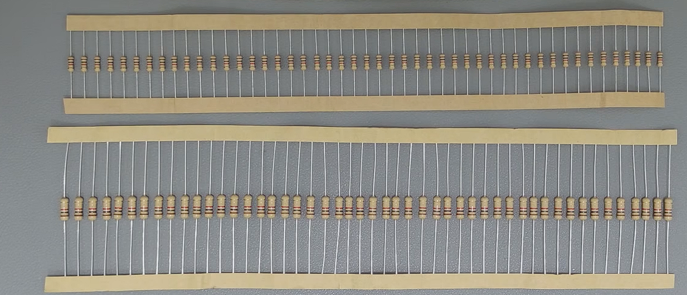

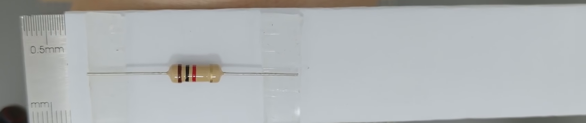

- 工艺

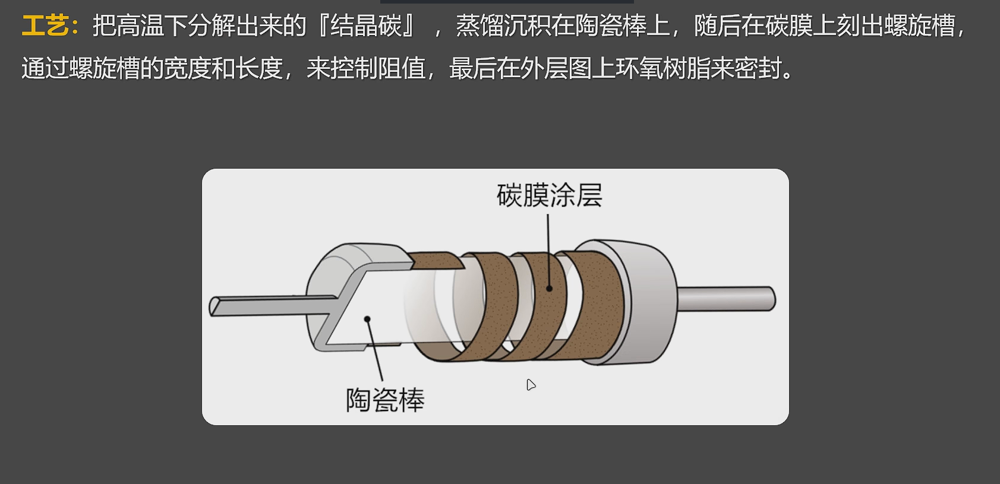

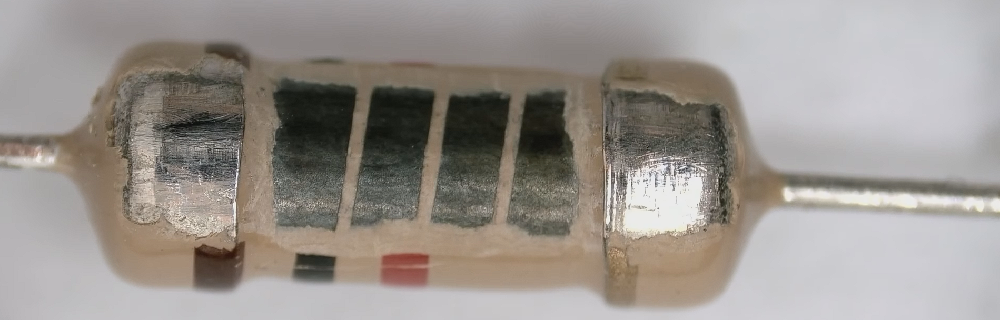

> 优点

| 优点         | 说明                                                    |
| ------------ | ------------------------------------------------------- |
| 成本低廉     | 原材料便宜，适合大规模生产                              |
| 噪声较低     | 比碳合成电阻（实心电阻）噪声小                          |
| 高频特性较好 | 寄生电感/电容小，适用于一般高频电路（如音频、射频前端） |
| 工作电压较高 | 可承受数百伏电压（适合电源电路）                        |
| 稳定性较好   | 在常温常湿环境下性能可靠                                |

> 缺点

| 优点         | 说明                                                    |
| ------------ | ------------------------------------------------------- |
| 成本低廉     | 原材料便宜，适合大规模生产                              |
| 噪声较低     | 比碳合成电阻（实心电阻）噪声小                          |
| 高频特性较好 | 寄生电感/电容小，适用于一般高频电路（如音频、射频前端） |
| 工作电压较高 | 可承受数百伏电压（适合电源电路）                        |
| 稳定性较好   | 在常温常湿环境下性能可靠                                |

> 应用场景

| 领域          | 应用示例                             |
| ------------- | ------------------------------------ |
| 消费电子      | 手机充电器、电视、音响内部偏置、限流 |
| 电源电路      | 启动电阻、假负载、反馈分压           |
| 信号调理      | 音频耦合、滤波、上拉/下拉            |
| 教育实验      | 电子套件、基础电路教学               |
| 通用 PCB 设计 | 成本敏感型产品的首选电阻             |

#### 2.3.1.3 金属膜电阻

> [!TIP]
>
> **属膜电阻**（Metal Film Resistor）是目前**应用最广泛、综合性能最优**的固定电阻类型之一，尤其在对精度、稳定性、噪声和温度特性有较高要求的电路中占据主导地位。
>
> - **基体**：高纯度陶瓷棒（绝缘、耐高温）
> - **电阻层**：在真空环境中，通过**溅射或蒸发工艺**将**镍铬**（NiCr）等合金沉积在陶瓷表面，形成一层致密的金属薄膜（厚度约几十纳米）
> - **阻值调节**：用激光精密切割螺旋槽，精确控制电阻值
> - **封装**：外覆环氧树脂保护层，印有色环或数字标识(5色环)

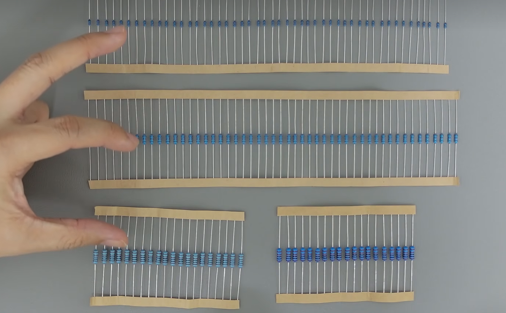

- 工艺

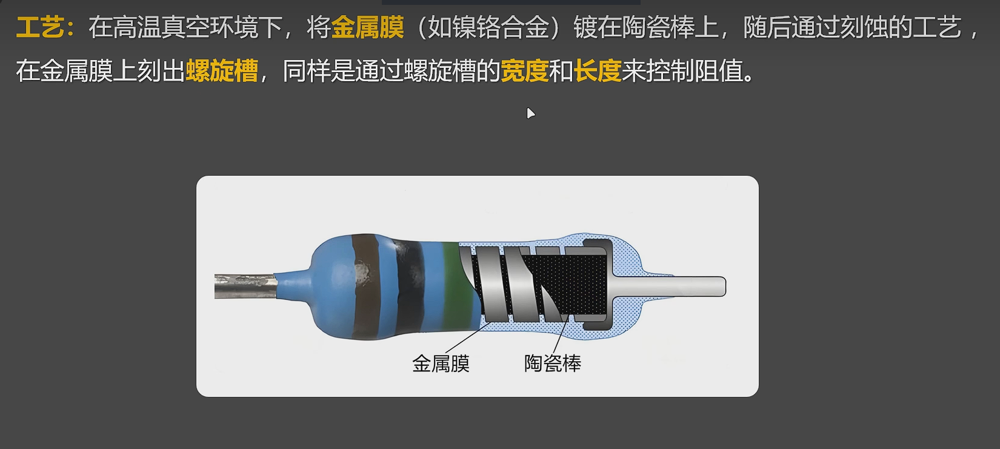

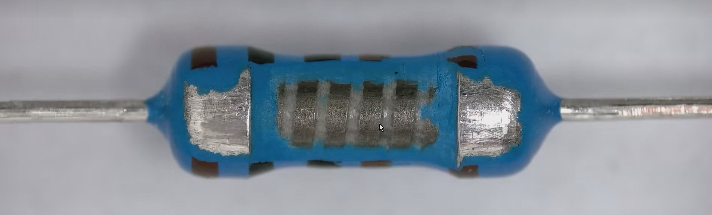

> 优点

| 特性             | 优势说明                                                     |
| ---------------- | ------------------------------------------------------------ |
| 高精度           | 常见 ±1%、±0.5%，甚至 ±0.1%（E96、E192 系列）                |
| 低温漂（TCR）    | 典型值 ±25 ～ ±100 ppm/°C（碳膜为 -200～-500 ppm），温度变化时阻值更稳定 |
| 低噪声           | 电流通过时产生的电噪声极小，适合音频、传感器、精密放大电路   |
| 长期稳定性好     | 老化率低（年漂移 <0.1%），适合长期运行设备                   |
| 高频特性优良     | 寄生电感/电容小，可用于MHz级信号电路                         |
| 体积小、一致性好 | 适合自动化贴装和高密度 PCB 设计                              |

> 缺点

| 缺点               | 说明                                               |
| ------------------ | -------------------------------------------------- |
| 成本略高于碳膜电阻 | 但差距已很小，大批量下几乎无感                     |
| 功率一般不大       | 常见 1/8W ～ 1W，大功率需选金属氧化膜或线绕电阻    |
| 耐浪涌能力较弱     | 瞬间高压/大电流可能烧毁薄膜（不如绕线电阻 robust） |

> 场景

| 领域             | 应用示例                                |
| ---------------- | --------------------------------------- |
| 精密仪器         | 万用表、示波器、数据采集卡内部基准电阻  |
| 传感器信号调理   | 应变片、热电偶放大电路中的增益/偏置电阻 |
| 音频设备         | 前级放大、音调控制（低噪声关键！）      |
| 通信模块         | 射频匹配、滤波器、ADC/DAC 外围电路      |
| 工业控制         | PLC、变送器、高可靠性控制系统           |
| 计算机与手机主板 | 电源管理、信号终端匹配                  |

#### 2.3.1.4 贴片电阻

> [!TIP]
>
> **贴片电阻**（Surface Mount Resistor，简称 **SMD 电阻** 或 **Chip Resistor**）是专为**表面贴装技术**（SMT）设计的微型固定电阻，广泛应用于现代电子产品（如手机、电脑、可穿戴设备等）中，因其体积小、适合自动化生产、高频性能好而成为主流。
>
> - **基体**：高强度陶瓷（氧化铝）
> - **电阻层**：金属膜（NiCr 镍铬合金为主）或厚膜（钌酸盐浆料烧结）
> - **电极**：三层结构（内：银/钯；中：镍阻挡层；外：锡/铅或无铅焊料）
> - **封装**：无引脚，矩形片状，直接焊接在 PCB 表面
>
>  常见类型：
>
> > - **薄膜贴片电阻**（Thin Film）→ 高精度、低温漂（用于仪器）
> > - **厚膜贴片电阻**（Thick Film）→ 成本低、通用性强（90% 以上消费电子使用）

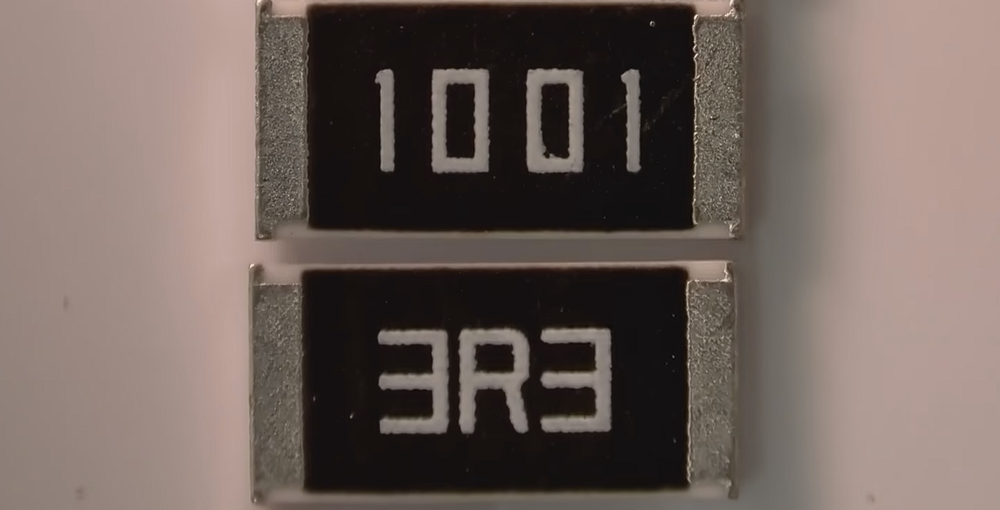

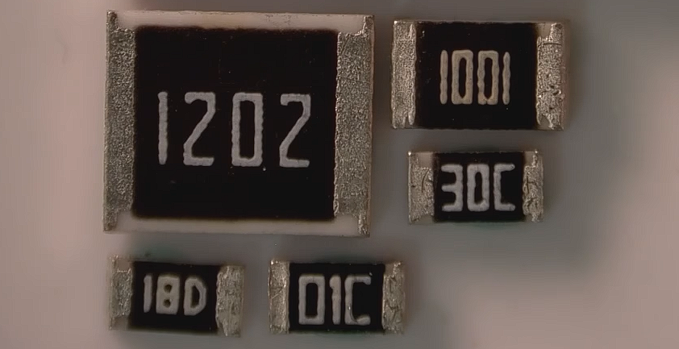

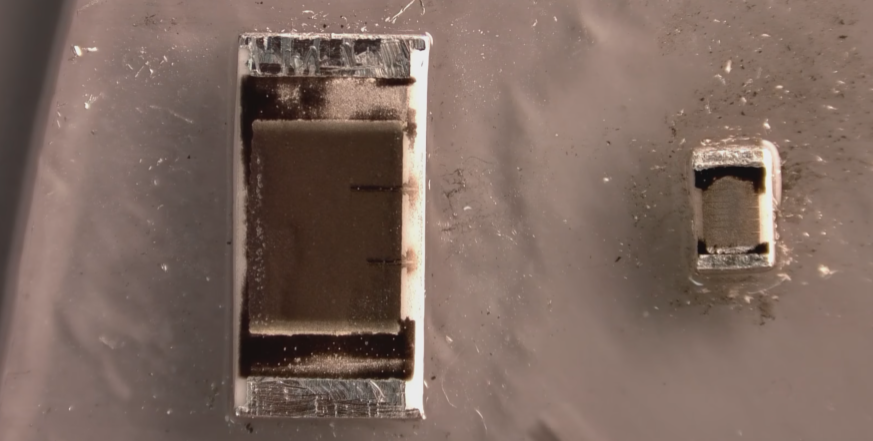

- 工艺

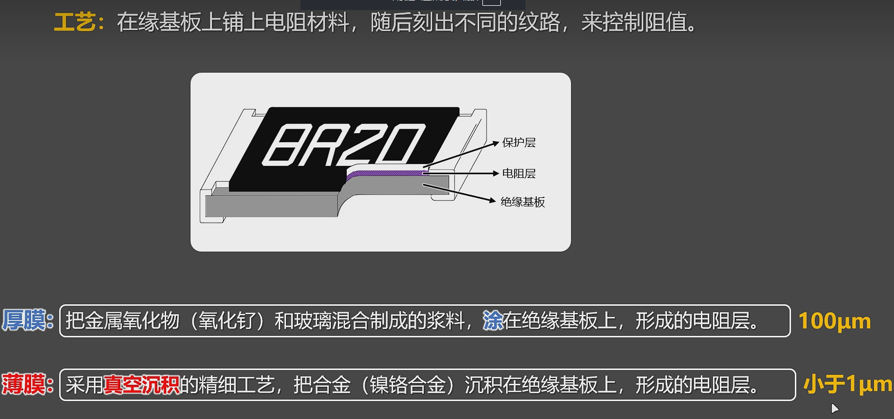

> 厚膜（主要针对功率⽽设计）：
>
> - 厚度：通常在 100 微⽶左右。
> - 精度：常⻅精度为 1% ~ 5% ，最⾼达到 0.1% 左右。
> - 功率： 10mW ~ 10W 。
> - TCR： 50ppm/**℃** ~ 200ppm/**℃** 。
> - 抗氧化能⼒相对好⼀些。
> - 适⽤于：⼀般消费电⼦、汽⻋电⼦、家电等领域。
> - 厚膜电阻覆盖了 90%左右的消费类电⼦产品，应⽤⼗分⼴泛！

> 薄膜（主要针对精度⽽设计）：
>
> - 厚度：通常在 0.1 微⽶左右。
> - 精度：常⻅精度为 0.1% ~ 2% ，最⾼可达 0.01% 。
> - 功率： 10mW ~ 3W 。
> - TCR低： 5ppm/**℃** ~ 50ppm/**℃** 。
> - 抗氧化能⼒不是很好。
> - 适⽤于：⼀些精密电路（精密仪器、⾼端⾳响、测量设备等）

#### 2.3.1.5 ⾦属箔电阻

> [!TIP]
>
> **金属箔电阻** 是一种利用黏贴在陶瓷基片上的超薄合金箔（通常厚度在微米级别），通过**光刻工艺**蚀刻出特定图案，从而形成电阻元件的电子元器件。

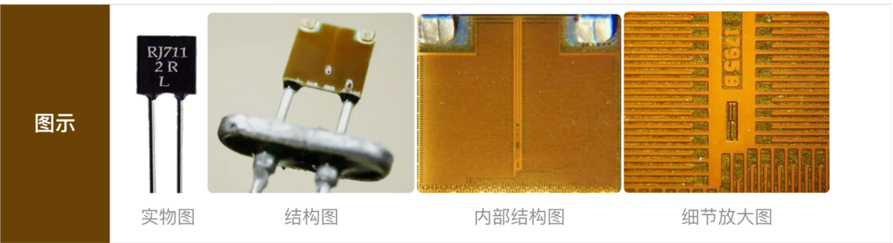

- 工艺：把合⾦（镍铬合⾦等）与添加剂混合，做成厚度控制在⼏微⽶范围内的膜，涂在绝缘体上，随后刻蚀成不同的纹路来控制阻值。

> 1. 精度极⾼：精度可达 ±0.001% 。
>
> 2. 功率范围： 1/16W ~ 15W 左右。
>
> 3. 成本很⾼： 100 个 135Ω ，精度 ±0.01% ，功率 600mW ，约
>
> 为 5700 元。
>
> 4. TCR极低： 1ppm/**℃** ，特殊制造的可达 0.05ppm/**℃**
>
> 5. 低噪声、耐静电、低感低容。
>
> ⾦属箔电阻是所有电阻中，精度和稳定性最好的电阻！
>
> 适⽤ 对可靠性要求极⾼的场景，例如：航空航天领域、军⼯领域、医学领域等。

### 2.3.2 可调电阻

> [!TIP]
>
> **可调电阻**（Adjustable Resistor）是一类**阻值可以在一定范围内手动或自动调节**的电子元件，广泛用于电路调试、参数校准、音量/亮度控制等场景。

### 2.3.3 特种电阻

> [!TIP]
>
> **特种电阻**（Specialty Resistors）是指**具有特定物理、电气或环境响应特性**的一类电阻器，其阻值会随外部条件（如温度、光照、电压、磁场、气体等）发生**可预测的变化**。它们不仅是“限流/分压”元件，更是**传感器**（Sensor）。

## 2.4 电容器

## 2.5 电感器

## 2.6 半导体

## 2.7 二极管

## 2.8 三极管

## 2.9 MOS管

