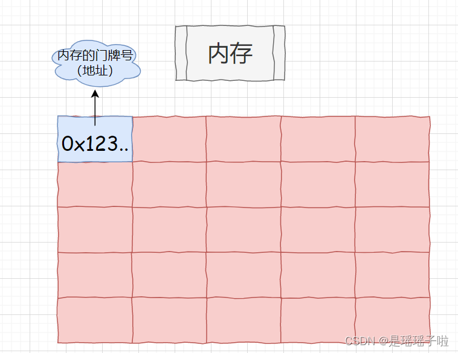
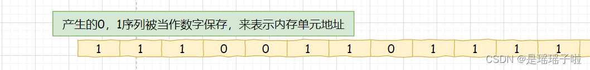
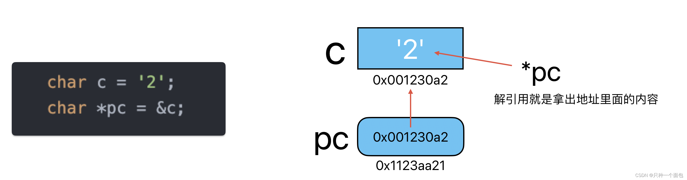
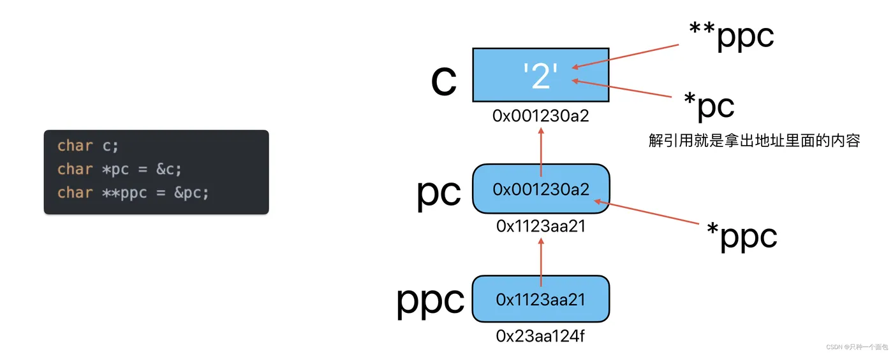
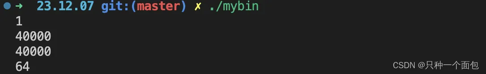
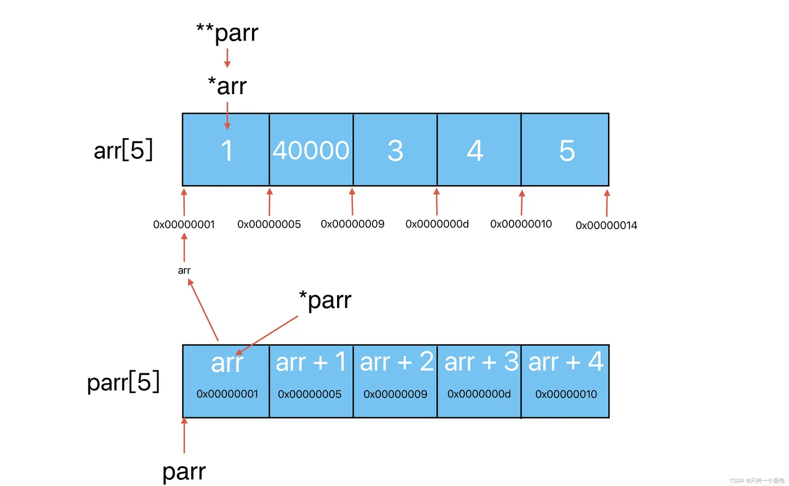
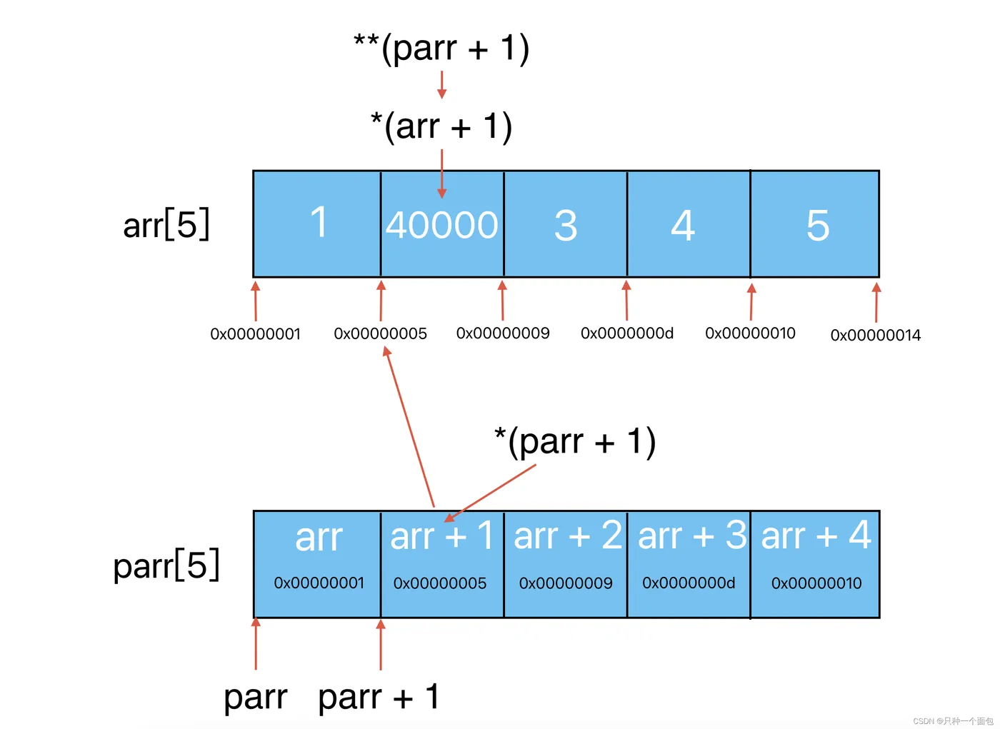
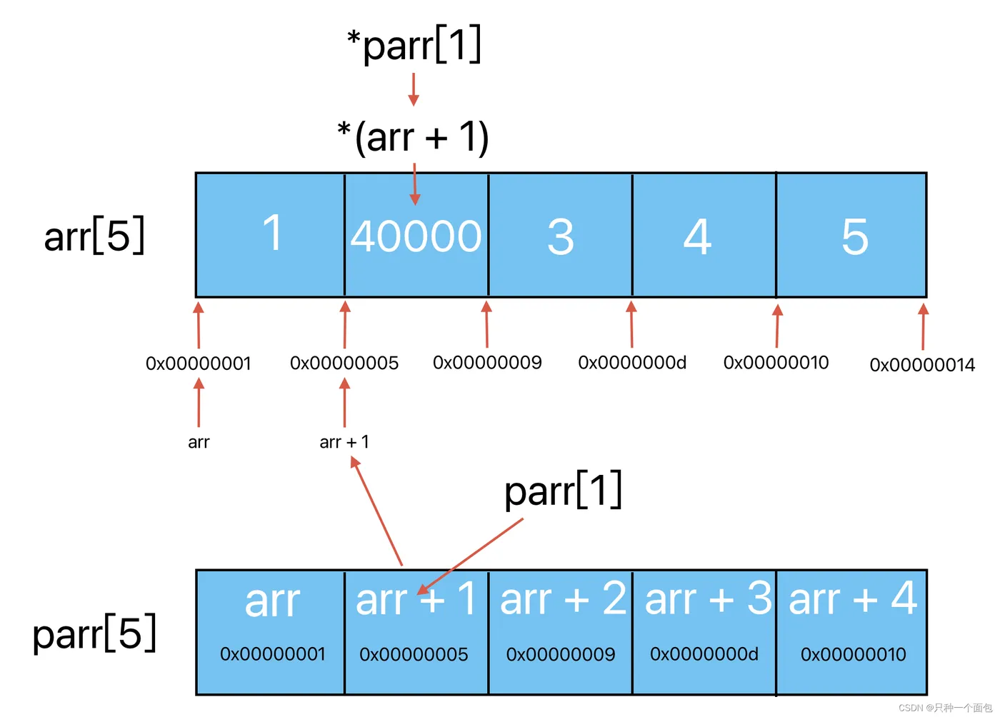
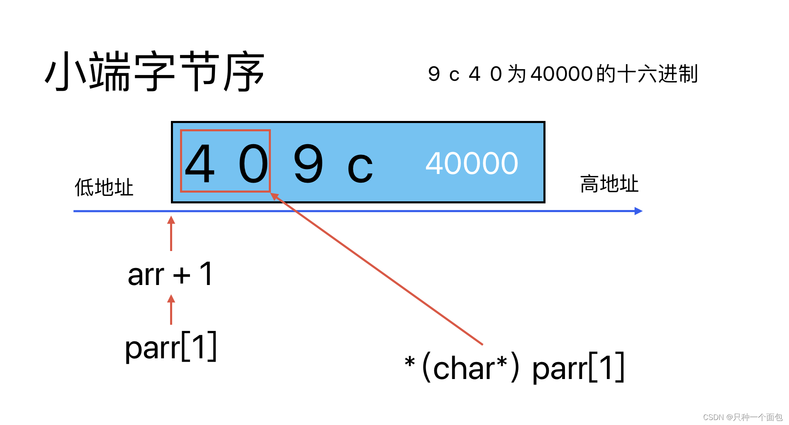
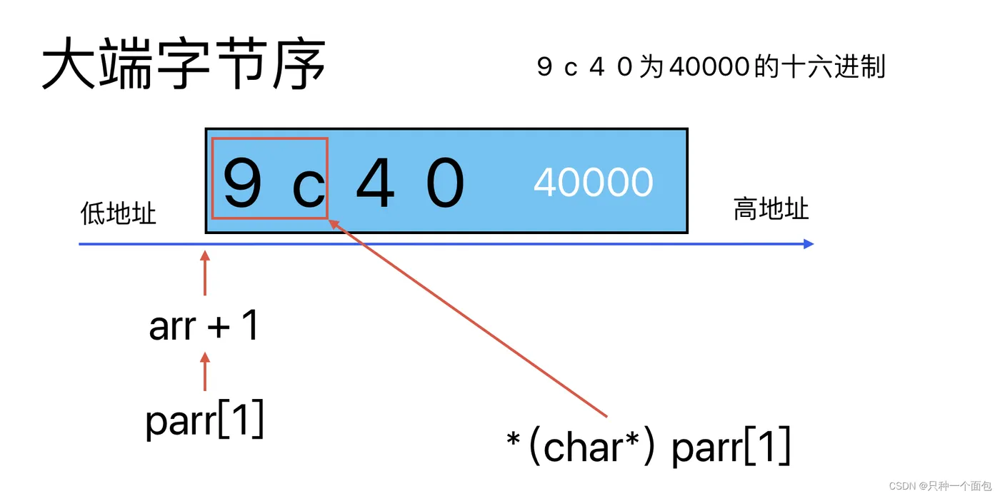

# 重点理解指针

> [!TIP]
> 参考博客： https://developer.aliyun.com/article/1402981

## 1.1 内存地址

- 相信大部分同学都住宿过，住宿的时候，每一间宿舍都有一个门牌号。在这个宿舍楼里，你只要告诉我你的门牌号，我就能找到你的宿舍，并且可以访问你的宿舍（默认我有钥匙），并且可以对你宿舍里的物品进行我想要的处理。
  其实对于计算机的内存来说，你可以把它看作宿舍楼，而指针，其实就是门牌号，通过门牌号，就可以找到对应宿舍，而这个门牌号本质是什么呢？



- 我们总是听说，机器有32位，64位？这个32和64指的是什么？其实是地址线,（类似于电线），有两种状态（高低电压），用1，0来表示，在这32/64根地址线运作的过程中，能产生32/64位的0/1序列，每一个序列用来标识内存中最小内存单元(1byte)空间的地址。（32位平台保存一个地址，即0/1序列，需要32bit,4字节，64位需要64bit,8字节）–存储地址所用内存的大小由机器而定。
  

## 1.2 取地址&、解引用*和指针的加法

-  取地址很好理解，就是对一个变量取出它的地址；然后我们要用[指针类型](https://so.csdn.net/so/search?q=指针类型&spm=1001.2101.3001.7020)来接收这个地址，所以既然指针可以接收地址，那就说明指针就是地址！
-  而指针最重要的其实就是解引用和指针的加法

## 1.3  一级指针

> 一级指针：其实存的就是非指针变量的地址，可以是各种非指针类型的地址,
>
> 而一级指针也是一个变量，变量一定占空间，有空间就要有地址，所以一级指针也是有地址的，千万不能认为一级指针没有地址！！！



```c
    char c = '2';
    char *pc = &c;            //存char变量的地址
    
    short s = 1;
    short *ps = &s;           //存short变量的地址
    
    int i = 3;
    int *pi = &i;             //存int变量的地址
    
    double d = 4.5;
    double *pd = &d;          //存double变量的地址
    
    float f = 5.6f;
    float *pf = &f;           //存float变量的地址
    
//无符号等基本数据类型
 
    struct List l;
    struct List *plist = &l;  //存结构体stuct 变量的地址
    
    union All all; 
    union All *pall = &all;     //存联合体union变量的地址
 
enum、位段等自定义类型
```

## 1.4 二级指针

> [!TIP]
> 二级指针：对一级指针取地址，可以是各种指针类型的地址
>
> 所以二级指针就是存放一级指针的地址的指针变量，那同理二级指针也是有地址的，这样就可以实现无限套娃，三级指针、四级指针、n级指针；



```c
    char c;
    char *pc = &c;            
    char **ppc = &pc;
 
    short s;
    short *ps = &s;          
    short **pps = &ps;
    
    int i;
    int *pi = &i;             
    int **ppi = &pi;
    
    double d;
    double *pd = &d;          
    double **ppd = &pd;
    
    float f;
    float *pf = &f;           
    float **ppf = &pf;
    
//无符号等基本数据类型
 
    struct List l;
    struct List *plist = &l; 
    struct List **pplist = &plist;
    
    union All all;
    union All *pall = &all;   
    union All **ppall = &pall;
    
//enum、位段等自定义类型    
```

## 1.5 指针数组

>  我们先来学习指针数组的原因就是比数组指针好理解，并且数组名和二维数组的行都是和数组指针有关系的。
>
>  那什么是指针数组呢？
>
>  指针数组，顾名思义：是一个数组，数组元素都是指针类型的，说白了，指针数组就是存放地址的数组。

```c
int arr[5] = {1,2,3,4,5};
int *arr[5] = {arr, arr + 1, arr + 2, arr + 3, arr + 4};
```

## 1.6 指针数组的计算

```c
#include <stdio.h>
int main()
{
    int arr[5] = {1,40000,3,4,5};
    int *parr[5] = {arr, arr + 1, arr + 2, arr + 3, arr + 4};
    printf("%d\n", **parr);
    printf("%d\n", **(parr + 1));
    printf("%d\n", *parr[1]);
    printf("%d\n", *(char*)parr[1]);
    return 0;
}
```


  
> 第一个printf首先 **parr ，先看parr 这是一个数组名，是首元素的地址，也就是arr的地址，那parr的数据类型就是int*，*parr解引用是根据 int* 来的，也就是拿出一个指针类型大小的字节（指针类型在32位机器下是4字节，在64位机器下是8字节），取出了arr，那**parr 本质上就是*arr，arr是首元素地址，类型是int*，那*arr解引用就是根据int来的，拿出了一个int类型的大小，4字节，所以**parr = 1；



> 第二个printf 同理，这里就是用到了指针+整数，parr的数据类型是int **，那parr + 1，是根据int *来加 的，也就是往后移动一个指针类型的大小，后面的过程都跟第一个相同



> 第三个printf 就是典型的用下标访问数组元素，但是在这里你就会发现 *(parr + 1) 和 parr[1]是等效的，那我们就可以使用指针的方式和数组下标一起来访问数组元素，因为这是等价的；



> 四个printf这里就涉及到一个强制类型转换，也就会导致我们解引用的时候取出来的字节数是改变的；具体结果和大小端有关
>
> 大端字节序：低地址存放高数字位
>
> 小端字节序：低地址存放低数字位

  这里我们能快速地找到parr[1]是arr + 1 这个地址，然后被强制转换为char*类型，这也就表明了解引用的时候，只能取出char类型的字节，1字节。然而这里涉及一个大小端的问题，解引用的时候是从低地址开始解引用，一个字节一个字节取，所以经过char*强转取出来了只有地址最低的一个字节，也就是40；转换为十进制就是64；这是基于小端字节序的结果：



大端字节序的结果为：9c = 156

