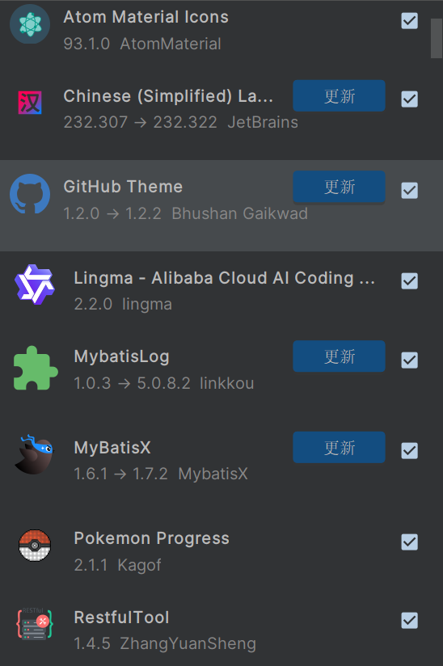
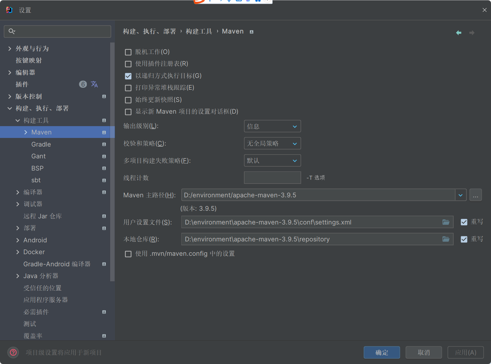
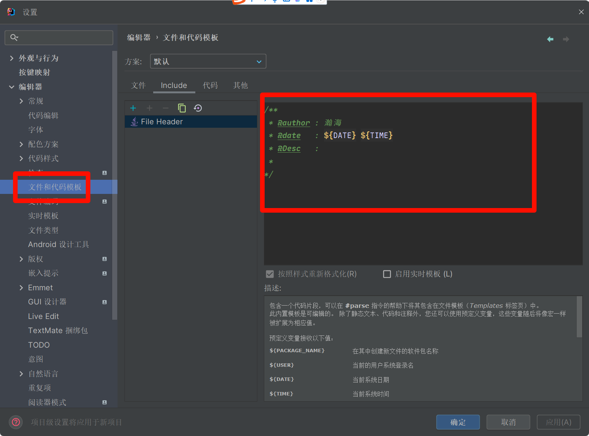
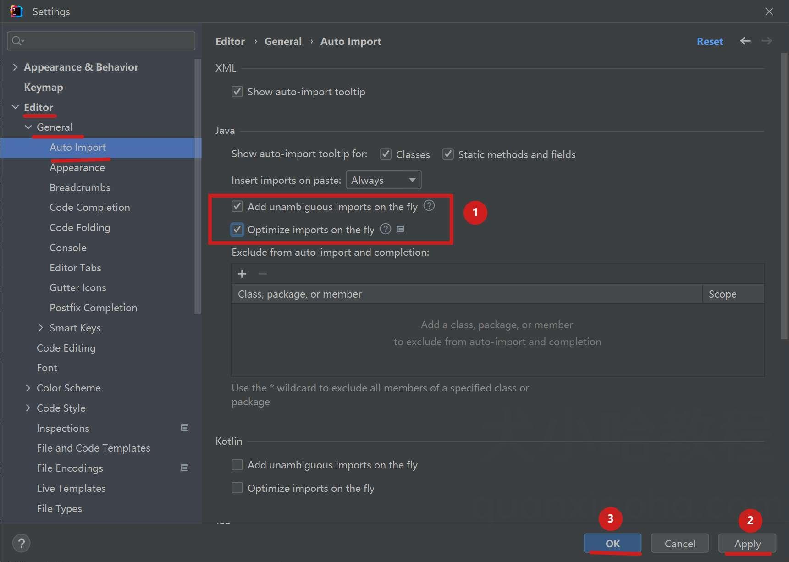
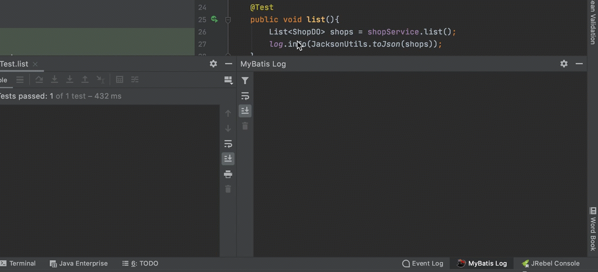

# 一 工具篇

> [!TIP]
> **工匠想要做好工作，必须先把工具磨得锋利**

## 1.1 开发工具

> IDEA

- https://www.jetbrains.com/idea

**插件推荐**

1. Lombok (强力推荐，必装)
   简化臃肿代码插件，可自动生成实体类中的get/set/构造/toString/hashCode等方法，再也不用写重复代码了。

2. MybatisX (强力推荐，必装)

   高效操作Mybatis插件，它 是一款基于 IDEA 的快速开发插件，在我们使用mybatis以及mybatis-plus开发时简化繁琐的重复操作，提高开发速率，功能包括：xml跳转、代码生成、JPA提示和生成语句。

3. JRebel (强力推荐，必装)
   热加载插件，JRebel是一款JAVA虚拟机插件，它使得JAVA程序员能在不进行重部署的情况下，即时看到代码的改变对一个应用程序带来的影响。JRebel使你能即时分别看到代码、类和资源的变化，你可以一个个地上传而不是一次性全部部署。当程序员在开发环境中对任何一个类或者资源作出修改的时候，这个变化会直接反应在部署好的应用程序上，从而跳过了构建和部署的过程，每年可以省去部署用的时间花费高达5.25个星期。

4. Maven Helper (强力推荐，必装)
   依赖冲突分析神器，当项目中可能会出现Jar包的冲突的问题，而此插件可以快速解决依赖冲突。

5. Converter YAML and Properties File
   yml和properties文件互转插件，快速将Properties文件转换为YAML文件，或将YAML文件转换为Properties文件。

6. Rainbow Brackets
   彩虹括号插件，看着很舒服，有点赏心悦目的感觉，代码开始和结束就更加明了。

7. CamelCase
   命名风格转换插件，可以在 kebab-case，SNAKE_CASE，PascalCase，camelCase，snake_case 和 空格风格之间切换。

8. Gsonforma JSON实体类转换插件

   实体类转换插件，它能够将我们的json格式数据快速生成对应的实体类，层级关系通过内部类来嵌套。特别是在对接一些第三方接口时非常有用。

9. Key Promoter X
   快捷键提示插件，它每次都会在右下角弹窗提示，帮助我们快速熟悉快捷键。

10. CodeGlance
    显示代码缩略图插件，当代码很多的时候，方便查看，很有用。

11. Translation
    中英文翻译工具，比较吃电脑资源，直接在idea中使用外部翻译软件，一般我用有道字典，但还需要获取有道翻译应用id和应用密钥。

12. Alibaba Java Coding Guidelines
    阿里巴巴代码规范检查插件，它会按照阿里Java开发手册上规范帮我们检查代码，然后对代码做不同颜色展示，鼠标放上去，会看到提示内容，帮助我们写出更规范的代码




**IDEA全局Maven开发配置**

- 打开IDEA，进入主界面后点击 configure，然后点击 settings
- 在上面的快捷查找框中输入maven，查找与maven相关的设置，然后点击maven
- 修改maven的路径（使用本地的Maven），以及修改settings文件的位置和本地仓库的位置
- 注意在最外部的配置是全局配置，单独的项目也可以设置配置



**设置类、方法注释模板**

- *Author* : 类创建作者；
- *Date* : 类创建日期；
- *Version* : 版本号；
- *Description*: 类描述信息；



**自动导包&删除包**

- 点击菜单 *File -> Preferences / Settings -> Editor -> General -> Auto Import*, 勾选上下图中的两个选项，点击应用，之后 IDEA 会帮助你自动导入包（唯一确定时才会生效），以及删除没有被用到的导入包：



**格式化代码快捷键**

- Windows 快捷键: `Ctrl` + `Alt` + `L`;
- Mac 快捷键: `Command` + `Option` + `L`;

**AI工具**

- **通义灵码**： 通义灵码是阿里推出的基于通义大模型，提供代码智能生成、研发智能问答能力的人工智能编码助手，经过海量优秀开源代码数据训练，可根据当前代码文件及跨文件的上下文，为你生成行级/函数级代码、单元测试、代码注释等等。
- **CodeGeeX**：是一款基于大模型的全能的智能编程助手。它可以实现代码的生成与补全、自动添加注释、代码翻译以及智能问答等功能，能够帮助开发者显著提高工作效率。`CodeGeeX`支持主流的编程语言，并适配多种主流IDE。

**Mybatis**

- 日志插件：MyBatis Log EasyPlus



- MybatisX: **MybatisX** 是一款基于 **IntelliJ IDEA** 的快速开发插件，旨在简化 **MyBatis** 和 **MyBatis-Plus** 的开发流程。通过 MybatisX，开发者可以快速生成持久层代码，减少繁琐的重复操作，从而提高开发效率

> Vscode

- https://code.visualstudio.com/

**插件清单**

- Chinese (Simplified) (简体中文)
- Auto Rename Tag
- open in browser
- [Prettier](https://so.csdn.net/so/search?q=Prettier&spm=1001.2101.3001.7020) - Code formatter
- Live Server
- Path Intellisense
- Image preview
- Code Spell Checker
- Better Comments
- Easy LESS
- Sass
- Live Sass Compiler
- jQuery Code Snippets
- 14.JavaScript (ES6) code snippets 
- One Dark Pro
- Material Theme
- Tokyo Night
- Material Icon Theme
- vscode-icons

**设置**

```json
{
    /*editor*/
    "editor.cursorBlinking": "smooth",//使编辑器光标的闪烁平滑，有呼吸感
    "editor.formatOnPaste": true,//在粘贴时格式化代码
    "editor.formatOnType": true,//敲完一行代码自动格式化
    "editor.smoothScrolling": true,//使编辑器滚动变平滑
    "editor.tabCompletion": "on",//启用Tab补全
    "editor.fontFamily": "'Jetbrains Mono', '思源黑体'",//字体设置，个人喜欢Jetbrains Mono作英文字体，思源黑体作中文字体
    "editor.fontLigatures": true,//启用字体连字
    "editor.detectIndentation": false,//不基于文件内容选择缩进用制表符还是空格
    /*
    因为有时候VSCode的判断是错误的
    */
    "editor.insertSpaces": true,//敲下Tab键时插入4个空格而不是制表符
    "editor.copyWithSyntaxHighlighting": false,//复制代码时复制纯文本而不是连语法高亮都复制了
    "editor.suggest.snippetsPreventQuickSuggestions": false,//这个开不开效果好像都一样，据说是因为一个bug，建议关掉
    "editor.stickyTabStops": true,//在缩进上移动光标时四个空格一组来移动，就仿佛它们是制表符(\t)一样
    "editor.wordBasedSuggestions": false,//关闭基于文件中单词来联想的功能（语言自带的联想就够了，开了这个会导致用vscode写MarkDown时的中文引号异常联想）
    "editor.linkedEditing": true,//html标签自动重命名（喜大普奔！终于不需要Auto Rename Tag插件了！）
    "editor.wordWrap": "on",//在文件内容溢出vscode显示区域时自动折行
    "editor.cursorSmoothCaretAnimation": true,//让光标移动、插入变得平滑
    "editor.renderControlCharacters": true,//编辑器中显示不可见的控制字符
    "editor.renderWhitespace": "boundary",//除了两个单词之间用于分隔单词的一个空格，以一个小灰点的样子使空格可见
    /*terminal*/
    "terminal.integrated.defaultProfile.windows": "Command Prompt",//将终端设为cmd，个人比较喜欢cmd作为终端
    "terminal.integrated.cursorBlinking": true,//终端光标闪烁
    "terminal.integrated.rightClickBehavior": "default",//在终端中右键时显示菜单而不是粘贴（个人喜好）
    /*files*/
    "files.autoGuessEncoding": true,//让VScode自动猜源代码文件的编码格式
    "files.autoSave": "onFocusChange",//在编辑器失去焦点时自动保存，这使自动保存近乎达到“无感知”的体验
    "files.exclude": {//隐藏一些碍眼的文件夹
        "**/.git": true,
        "**/.svn": true,
        "**/.hg": true,
        "**/CVS": true,
        "**/.DS_Store": true,
        "**/tmp": true,
        "**/node_modules": true,
        "**/bower_components": true
    },
    "files.watcherExclude": {//不索引一些不必要索引的大文件夹以减少内存和CPU消耗
        "**/.git/objects/**": true,
        "**/.git/subtree-cache/**": true,
        "**/node_modules/**": true,
        "**/tmp/**": true,
        "**/bower_components/**": true,
        "**/dist/**": true
    },
    /*workbench*/
    "workbench.list.smoothScrolling": true,//使文件列表滚动变平滑
    "workbench.editor.enablePreview": false,//打开文件时不是“预览”模式，即在编辑一个文件时打开编辑另一个文件不会覆盖当前编辑的文件而是新建一个标签页
    "workbench.editor.wrapTabs": true,//编辑器标签页在空间不足时以多行显示
    "workbench.editor.untitled.hint": "hidden",//隐藏新建无标题文件时的“选择语言？”提示（个人喜好，可以删掉此行然后Ctrl+N打开无标题新文件看看不hidden的效果）
    /*explorer*/
    "explorer.confirmDelete": false,//删除文件时不弹出确认弹窗（因为很烦）
    "explorer.confirmDragAndDrop": false,//往左边文件资源管理器拖动东西来移动/复制时不显示确认窗口（因为很烦）
    /*search*/
    "search.followSymlinks": false,//据说可以减少vscode的CPU和内存占用
    /*window*/
    "window.menuBarVisibility": "visible",//在全屏模式下仍然显示窗口顶部菜单（没有菜单很难受）
    "window.dialogStyle": "custom",//使用更具有VSCode的UI风格的弹窗提示（更美观）
    /*debug*/
    "debug.internalConsoleOptions": "openOnSessionStart",//每次调试都打开调试控制台，方便调试
    "debug.showBreakpointsInOverviewRuler": true,//在滚动条标尺上显示断点的位置，便于查找断点的位置
    "debug.toolBarLocation": "docked",//固定调试时工具条的位置，防止遮挡代码内容（个人喜好）
    "debug.saveBeforeStart": "nonUntitledEditorsInActiveGroup",//在启动调试会话前保存除了无标题文档以外的文档（毕竟你创建了无标题文档就说明你根本没有想保存它的意思（至少我是这样的。））
    "debug.onTaskErrors": "showErrors",//预启动任务出错后显示错误，并不启动调试
    /*html*/
    "html.format.indentHandlebars": true//在写包含形如{{xxx}}的标签的html文档时，也对标签进行缩进（更美观）
}
```


> WebStorm 

- https://www.jetbrains.com/webstorm/

- 参考上面的配置

## 1.2 数据库设计


