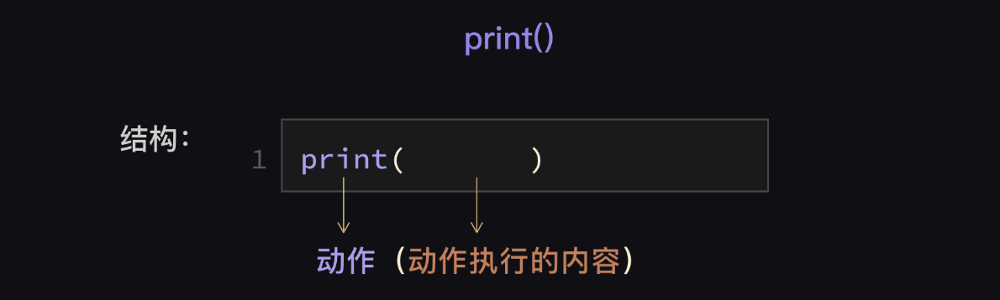
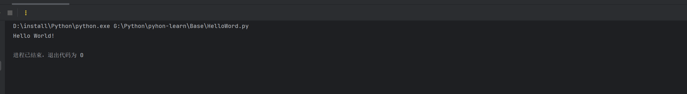
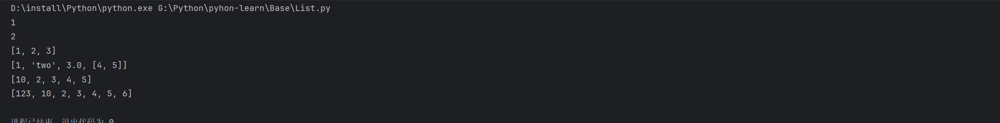

# Python基础学习笔记

# 一 环境搭建

## 1.1 Python 环境安装

- 安装环境：**Windwos 10** 
- Python版本：3.9.7（64位）
- [Welcome to Python.org](https://www.python.org/)


- 找到自己需要安装的版本包


- 下载，安装


- 查看版本

```bash
python
```


- 注意需要添加环境变量，否则不会生效

## 1.2 PyCharm 代码工具

- 官网：https://www.jetbrains.com/pycharm/download/

- 点击需要的版本下载


- 破解使用，点击脚本一键破解


- 插件推荐


- 到此，准备环境搭建完毕，下面学习基本语法，与高级语法

# 二 基础语法

- 参考教程：https://github.com/walter201230/Python

## 2.1 介绍

Python 在诞生之初，因为其功能不好，运转功率低，不支持多核，根本没有并发性可言，在计算功能不那么好的年代，一直没有火爆起来，甚至很多人根本不知道有这门语言。

随着时代的发展，物理硬件功能不断提高，而软件的复杂性也不断增大，开发效率越来越被企业重视。因此就有了不一样的声音，在软件开发的初始阶段，性能并没有开发效率重要，没必然为了节省不到 1ms 的时间却让开发量增加好几倍，这样划不过来。也就是开发效率比机器效率更为重要，那么 Python 就逐渐得到越来越多开发者的亲睐了。

至此，Python 已经成为互联网开发的焦点。在「Top 10 的编程语言走势图」可以看到，Python 已经跃居第三位，而且在 2017 年还成为了最受欢迎的语言。


## 2.2 注释

- 快捷键：`Ctrl+/`

### 2.2.1 块注释

“#”号后空一格，段落件用空行分开（同样需要“#”号）

```python
# 块注释
# 块注释
#
# 块注释
# 块注释
```

### 2.2.2 行注释

至少使用两个空格和语句分开，注意不要使用无意义的注释

```python
# 正确的写法
x = x + 1  # 边框加粗一个像素
# 不推荐的写法(无意义的注释)
x = x + 1 # x加1
```

### 2.2.3 文档注释

- 作为文档的Docstring一般出现在模块头部、函数和类的头部，这样在python中可以通过对象的__doc__对象获取文档. 编辑器和IDE也可以根据Docstring给出自动提示.

- 文档注释以 """ 开头和结尾, 首行不换行, 如有多行, 末行必需换行, 以下是Google的docstring风格示例

```python
# -*- coding: utf-8 -*-
"""Example docstrings.

This module demonstrates documentation as specified by the `Google Python
Style Guide`_. Docstrings may extend over multiple lines. Sections are created
with a section header and a colon followed by a block of indented text.

Example:
    Examples can be given using either the ``Example`` or ``Examples``
    sections. Sections support any reStructuredText formatting, including
    literal blocks::

        $ python example_google.py

Section breaks are created by resuming unindented text. Section breaks
are also implicitly created anytime a new section starts.
"""
```

## 2.3 命名规范

- 作用：方便管理,便于区分,基本规范

### 2.3.1 模块

- 模块尽量使用小写命名，首字母保持小写，尽量不要用下划线(除非多个单词，且数量不多的情况)

```python
# 正确的模块名
import decoder
import html_parser

# 不推荐的模块名
import Decoder
```

### 2.3.2 类名

- 类名使用驼峰(`CamelCase`)命名风格，首字母大写，私有类可用一个下划线开头

```python
class Farm():
    pass
class AnimalFarm(Farm):
    pass

class _PrivateFarm(Farm):
    pass
```

- 将相关的类和顶级函数放在同一个模块里. 不像Java, 没必要限制一个类一个模块.

### 2.3.3 函数

- 函数名一律小写，如有多个单词，用下划线隔开

```python
def run():
    pass

def run_with_env():
    pass
```

- 私有函数在函数前加一个下划线_

```python
class Person():

    def _private_func():
        pass
```

### 2.3.4 变量名

- 变量名尽量小写, 如有多个单词，用下划线隔开

```python
if __name__ == '__main__':
    count = 0
    school_name = ''
```

- 常量采用全大写，如有多个单词，使用下划线隔开

```python
MAX_CLIENT = 100
MAX_CONNECTION = 1000
CONNECTION_TIMEOUT = 600
```

### 2.3.5 常量

- 常量使用以下划线分隔的大写命名

```python
MAX_OVERFLOW = 100
Class FooBar:

    def foo_bar(self, print_):
        print(print_)
```

## 2.4 基本语法

### 2.4.1 第一个程序

```python
# _*_ coding: utf-8 _*_
"""
Time:     2025/1/12 下午1:00
Author:   EasonShu
Version:  V 0.1
File:     HelloWord.py
Describe: 
"""
# 主程序入口
if __name__ == '__main__':
    
    # 打印Hello World
    print("Hello World!")
```

- `print()` 函数由两部分构成 ：

  1. 指令：print
  2. 指令的执行对象，在 print 后面的括号里的内容

  

- 而 `print()` 函数的作用是让计算机把你给它的指令结果，显示在屏幕的终端上。这里的指令就是你在 `print()` 函数里的内容。



- 它的执行流程如下：
  - 向解释器发出指令，打印 'Hello Python'
  - 解析器把代码解释为计算器能读懂的机器语言
  - 计算机执行完后就打印结果


### 2.4.2 基本数据类型

#### 2.3.2.1 字符串

- 字符串英文 string ，是 python 中随处可见的数据类型，字符串的识别也非常的简单，就是用「引号」括起来的。
- 引号包括单引号 `' '` ，双引号 `" "` 和 三引号 `''' '''` ，比如 `'abc'` ，`"123"` 等等。
- 占位符：
  - `%s`：用于字符串的占位符。它可以插入任何对象的字符串表示形式
  - `%d` 或 `%i`：用于整数的占位符。它们将插入一个十进制整数
  - `%f`：用于浮点数的占位符。可以指定精度
  - `%x` 或 `%X`：用于十六进制整数的占位符，`%x` 输出小写字母，`%X` 输出大写字母，

```python
# _*_ coding: utf-8 _*_
"""
Time:     2025/1/12 下午1:05
Author:   EasonShu
Version:  V 0.1
File:     BaseType.py
Describe: 
"""
if __name__ == '__main__':
    # 字符串数据
    str = "Hello World!"
    # char字符
    char = 'a'
    # 三引号
    str1 = """Hello World!"""
    print(str, char, str1)
    # 站位符
    print("str = %s, char = %s ,str1 = %s" % (str, char, str1))
```


#### 2.3.2.2 整数

- 整数英文为 integer 。代码中的整数跟我们平常认识的整数一样，包括正整数、负整数和零，是没有小数点的数字。
- Python 可以处理任意大小的整数，例如：`1`，`100`，`-8080`，`0`，等等。

```python
# _*_ coding: utf-8 _*_
"""
Time:     2025/1/12 下午1:05
Author:   EasonShu
Version:  V 0.1
File:     BaseType.py
Describe: 
"""
if __name__ == '__main__':
    # 字符串数据
    str = "Hello World!"
    # char字符
    char = 'a'
    # 三引号
    str1 = """Hello World!"""
    print(str, char, str1)
    # 站位符
    print("str = %s, char = %s ,str1 = %s" % (str, char, str1))
    # 整数
    num = 100
    age = 18
    print(num, age)
    print("num = %d, age = %d" % (num, age))
```


#### 2.3.2.3 浮点数

- 浮点数的英文名是 float ，是指带小数的数字。
- 浮点数跟整数有很多类似的地方，但是浮点数是最折磨人的，也是最难让人捉摸透的。
- `type`函数，打印类型

```python
# _*_ coding: utf-8 _*_
"""
Time:     2025/1/12 下午1:05
Author:   EasonShu
Version:  V 0.1
File:     BaseType.py
Describe: 
"""
if __name__ == '__main__':
    # 字符串数据
    str = "Hello World!"
    # char字符
    char = 'a'
    # 三引号
    str1 = """Hello World!"""
    print(str, char, str1)
    # 站位符
    print("str = %s, char = %s ,str1 = %s" % (str, char, str1))
    # 整数
    num = 100
    age = 18
    print(num, age)
    print("num = %d, age = %d" % (num, age))
    # 浮点数
    num1 = 3.14
    print(num1)
    print("num1 = %.2f" % num1)
    # 打印类型
    print(type(str), type(char), type(str1), type(num), type(age), type(num1))
```


#### 2.3.2.4 布尔值

- 布尔值和布尔代数的表示完全一致，一个布尔值只有 `True` 、 `False `两种值，要么是 `True`，要么是 `False`，在 Python 中，可以直接用 True、False 表示布尔值（请注意大小写），也可以通过布尔运算计算出来。
- 布尔值可以用 `and`、`or` 和 `not` 运算。

`and` 运算是与运算，只有所有都为 True，and 运算结果才是 True。

`or` 运算是或运算，只要其中有一个为 True，or 运算结果就是 True。

`not` 运算是非运算，它是一个单目运算符，把 True 变成 False，False 变成 True。

```python
# _*_ coding: utf-8 _*_
"""
Time:     2025/1/12 下午1:05
Author:   EasonShu
Version:  V 0.1
File:     BaseType.py
Describe: 
"""
if __name__ == '__main__':
    # 字符串数据
    str = "Hello World!"
    # char字符
    char = 'a'
    # 三引号
    str1 = """Hello World!"""
    print(str, char, str1)
    # 站位符
    print("str = %s, char = %s ,str1 = %s" % (str, char, str1))
    # 整数
    num = 100
    age = 18
    print(num, age)
    print("num = %d, age = %d" % (num, age))
    # 浮点数
    num1 = 3.14
    print(num1)
    print("num1 = %.2f" % num1)
    # 打印类型
    print(type(str), type(char), type(str1), type(num), type(age), type(num1))
    # 布尔类型
    bool = True
    print(bool)
    print(type(bool))
```


#### 2.3.2.5 空型

基本上每种编程语言都有自己的特殊值——空值，在 Python 中，用 None 来表示

```python
# _*_ coding: utf-8 _*_
"""
Time:     2025/1/12 下午1:05
Author:   EasonShu
Version:  V 0.1
File:     BaseType.py
Describe: 
"""
if __name__ == '__main__':
    # 字符串数据
    str = "Hello World!"
    # char字符
    char = 'a'
    # 三引号
    str1 = """Hello World!"""
    print(str, char, str1)
    # 站位符
    print("str = %s, char = %s ,str1 = %s" % (str, char, str1))
    # 整数
    num = 100
    age = 18
    print(num, age)
    print("num = %d, age = %d" % (num, age))
    # 浮点数
    num1 = 3.14
    print(num1)
    print("num1 = %.2f" % num1)
    # 打印类型
    print(type(str), type(char), type(str1), type(num), type(age), type(num1))
    # 布尔类型
    bool = True
    print(bool)
    print(type(bool))
    # 空值型
    null = None
    print(null)
    print(type(null))
```


### 2.4.3 字符串的编码问题

- **字符集**：字符集是一组字符的集合，例如 ASCII 字符集包含了英文字母、数字和一些常见的符号，而 Unicode 字符集则包含了几乎世界上所有语言的字符。
- **编码**：编码是将字符集中的字符转换为字节序列的规则。例如，ASCII 编码将英文字符转换为 7 位或 8 位的二进制字节序列，而 UTF-8 是一种 Unicode 的编码方式，它可以使用 1 到 4 个字节来表示不同的字符，对于英文字符使用 1 个字节，对于其他语言的字符可能使用更多字节。

- 在 Python 3 中，字符串默认使用 Unicode 编码，因此你可以直接使用各种语言的字符，例如：

```python
s = "你好，世界"
print(s)
```

- 字符串是不可变的序列类型，存储的是字符的 Unicode 码点，而不是字节。

- **编码（Encode）**：将字符串转换为字节序列，使用 `encode()` 方法。例如，将一个 Unicode 字符串编码为 UTF-8 字节序列：

```python
s = "你好，世界"
utf8_bytes = s.encode('utf-8')
print(utf8_bytes)
```

- 这里 `encode('utf-8')` 表示使用 UTF-8 编码将字符串 `s` 转换为字节序列，得到的 `utf8_bytes` 是一个 `bytes` 类型的对象。
- **解码（Decode）**：将字节序列转换为字符串，使用 `decode()` 方法。例如，将 UTF-8 字节序列解码为字符串：

```python
utf8_bytes = b'\xe4\xbd\xa0\xe5\xa5\xbd\xef\xbc\x8c\xe4\xb8\x96\xe7\x95\x8c'
s = utf8_bytes.decode('utf-8')
print(s)
```

- 这里 `b'\xe4\xbd\xa0\xe5\xa5\xbd\xef\xbc\x8c\xe4\xb8\x96\xe7\x95\x8c'` 是一个 UTF-8 编码的字节序列，使用 `decode('utf-8')` 将其转换为 Unicode 字符串。

不过由于 Python 源代码也是一个文本文件，所以，当你的源代码中包含中文的时候，在保存源代码时，就需要务必指定保存为 UTF-8 编码。当Python 解释器读取源代码时，为了让它按 UTF-8 编码读取，我们通常在文件开头写上这两行：

```python
#!/usr/bin/env python3
# -*- coding: utf-8 -*-
```

- 第一行注释是为了告诉 Linux/OS X 系统，这是一个 Python 可执行程序，Windows 系统会忽略这个注释；
- 第二行注释是为了告诉 Python 解释器，按照 `UTF-8` 编码读取源代码，否则，你在源代码中写的中文输出可能会有乱码。

### 2.4.4 类型转换

Python 中基本数据类型转换的方法有下面几个

| 方法                   | 说明                                                  |
| ---------------------- | ----------------------------------------------------- |
| int(x [,base ])        | 将x转换为一个整数                                     |
| float(x )              | 将x转换到一个浮点数                                   |
| complex(real [,imag ]) | 创建一个复数                                          |
| str(x )                | 将对象 x 转换为字符串                                 |
| repr(x )               | 将对象 x 转换为表达式字符串                           |
| eval(str )             | 用来计算在字符串中的有效 Python 表达式,并返回一个对象 |
| tuple(s )              | 将序列 s 转换为一个元组                               |
| list(s )               | 将序列 s 转换为一个列表                               |
| chr(x )                | 将一个整数转换为一个字符                              |
| unichr(x )             | 将一个整数转换为 Unicode 字符                         |
| ord(x )                | 将一个字符转换为它的整数值                            |
| hex(x )                | 将一个整数转换为一个十六进制字符串                    |
| oct(x )                | 将一个整数转换为一个八进制字符串                      |

- 注：在 Python 3 里，只有一种整数类型 int，表示为长整型，没有 python2 中的 Long。

```python
# _*_ coding: utf-8 _*_
"""
Time:     2025/1/12 下午1:29
Author:   EasonShu
Version:  V 0.1
File:     TypeChange.py
Describe:  类型转换
"""
if __name__ == '__main__':
#     方法	说明
# int(x [,base ])	将x转换为一个整数
# float(x )	将x转换到一个浮点数
# complex(real [,imag ])	创建一个复数
# str(x )	将对象 x 转换为字符串
# repr(x )	将对象 x 转换为表达式字符串
# eval(str )	用来计算在字符串中的有效 Python 表达式,并返回一个对象
# tuple(s )	将序列 s 转换为一个元组
# list(s )	将序列 s 转换为一个列表
# chr(x )	将一个整数转换为一个字符
# unichr(x )	将一个整数转换为 Unicode 字符
# ord(x )	将一个字符转换为它的整数值
# hex(x )	将一个整数转换为一个十六进制字符串
# oct(x )	将一个整数转换为一个八进制字符串
# 注：在 Python 3 里，只有一种整数类型 int，表示为长整型，没有 python2 中的 Long。
    print(int(1.23))
    print(float(1))
    print(complex(1, 2))
    print(str(1))
    print(repr(1))
    print(eval('1+2'))
    print(tuple([1, 2, 3]))
    print(list([1, 2, 3]))
    print(chr(65))
    print(ord('A'))
    print(hex(255))
    print(oct(255))
```


### 2.4.5 变量与常量

> 变量

**变量的定义与赋值**：

- 在 Python 中，变量是用来存储数据的标识符，其值可以在程序运行过程中被修改。
- 变量的命名遵循一定的规则，通常由字母、数字和下划线组成，且不能以数字开头。
- 变量的定义和赋值可以同时进行

```python
# 定义并赋值一个变量
my_variable = 10
print(my_variable)  # 输出: 10
```

```python
# 先定义变量
another_variable = None
# 赋值
another_variable = "Hello, World"
print(another_variable)  # 输出: Hello, World=
```

**变量的数据类型**：

- Python 是一种动态类型语言，这意味着你不需要显式声明变量的类型，解释器会根据赋值自动推断。
- 变量可以存储各种数据类型，包括整数、浮点数、字符串、列表、元组、字典等。

```python
# 存储整数
integer_var = 5
print(type(integer_var))  # 输出: <class 'int'>

# 存储浮点数
float_var = 3.14
print(type(float_var))  # 输出: <class 'float'>

# 存储字符串
string_var = "Python"
print(type(string_var))  # 输出: <class 'string'>

# 存储列表
list_var = [1, 2, 3]
print(type(list_var))  # 输出: <class 'list'>

# 存储元组
tuple_var = (4, 5, 6)
print(type(tuple_var))  # 输出: <class 'tuple'>

# 存储字典
dict_var = {'key1': 'value1', 'key2': 'value2'}
print(type(dict_var))  # 输出: <class 'dict'>
```

**变量的重新赋值**

- 由于 Python 是动态类型语言，变量可以重新赋值为不同的数据类型，

```python
var = 10
print(var)  # 输出: 10
var = "New value"
print(var)  # 输出: New value
```

**变量的作用域**：

- **全局变量**：在函数外部定义，可在整个程序中使用。

```python
global_var = 100

def my_function():
    print(global_var)  # 可以访问全局变量

my_function()  # 输出: 100
print(global_var)  # 输出: 100
```

- **局部变量**：在函数内部定义，仅在函数内部有效。

```python
def another_function():
    local_var = 200
    print(local_var)  # 输出: 200

another_function()
# print(local_var)  # 这会引发 NameError，因为 local_var 是局部变量，仅在 another_function 内有效
```

- **使用 global 关键字**：在函数内部修改全局变量。

```python
count = 0

def increment_count():
    global count
    count += 1
    print(count)

increment_count()  # 输出: 1
increment_count()  # 输出: 2
```

> 常量

**常量的表示方法**：

- Python 没有内置的常量类型，但通常用全大写字母来表示常量，以表示其值不应被修改，这只是一种约定俗成的做法，而不是强制的。

```python
PI = 3.14159
GRAVITY = 9.8
```

**2. 模拟常量的方式**：

- 如果你想强制一个变量成为常量，可以使用 `const` 模块，但这需要通过 `pip` 安装，并且不是 Python 标准库的一部分。另一种方式是使用自定义类：

```python
class _Constants:
    def __init__(self):
        self.PI = 3.14159
        self.GRAVITY = 9.8

CONST = _Constants()

print(CONST.PI)  # 输出: 3.14159
print(CONST.GRAVITY)  # 输出: 9.8
# 以下操作会引发错误
# CONST.PI = 3.14  # AttributeError: can't set attribute
```

## 2.5 列表（List）和元组（tuple）

### 2.5.1 列表（List）

- 列表是一种可变的有序集合，可以存储任意类型的数据，包括其他列表。列表使用方括号 `[]` 来创建，元素之间用逗号分隔。

```python
# _*_ coding: utf-8 _*_
"""
Time:     2025/1/12 下午1:40
Author:   EasonShu
Version:  V 0.1
File:     List.py
Describe: 
"""
if __name__ == '__main__':
    # 创建列表
    list1 = [1, 2, 3, 4, 5]
    # 数据类型可以多种
    list2 = [1, 2, 3, 4, 5, 'a', 'b', 'c', 'd', 'e']
    list3 = [1, 2, 3, 4, 5, [1, 2, 3, 4, 5]]
```

- 索引：我们可以通过列表的下标索引来访问列表中的值，同样你也可以使用方括号的形式截取字符

```python
# _*_ coding: utf-8 _*_
"""
Time:     2025/1/12 下午1:40
Author:   EasonShu
Version:  V 0.1
File:     List.py
Describe: 
"""
if __name__ == '__main__':
    # 创建列表
    list1 = [1, 2, 3, 4, 5]
    # 数据类型可以多种
    list2 = [1, 2, 3, 4, 5, 'a', 'b', 'c', 'd', 'e']
    list3 = [1, 2, 3, 4, 5, [1, 2, 3, 4, 5]]
    # 列表索引: [index] eg: [0]=1
    print(list1[0])
    print(list1[1])
    # 列表切片: [start:end]: eg：[0:3]=[1,2,3]
    print(list1[0:3])
```

- 修改元素：由于列表是可变的，可以修改列表中的元素。

```python
# _*_ coding: utf-8 _*_
"""
Time:     2025/1/12 下午1:40
Author:   EasonShu
Version:  V 0.1
File:     List.py
Describe: 
"""
if __name__ == '__main__':
    # 创建列表
    list1 = [1, 2, 3, 4, 5]
    # 数据类型可以多种
    list2 = [1, 2, 3, 4, 5, 'a', 'b', 'c', 'd', 'e']
    list3 = [1, 2, 3, 4, 5, [1, 2, 3, 4, 5]]
    # 列表索引: [index] eg: [0]=1
    print(list1[0])
    print(list1[1])
    # 列表切片: [start:end]: eg：[0:3]=[1,2,3]
    print(list1[0:3])
    # 列表中可以包含不同类型的元素
    mixed_list = [1, "two", 3.0, [4, 5]]
    print(mixed_list)  # 输出: [1, 'two', 3.0, [4, 5]]
    # 修改元素： list[index] = value
    list1[0] = 10
    print(list1)
```


- 添加元素：

  - 使用 `append()`方法在列表末尾添加元素

    ```python
    my_list.append(6)
    print(my_list)  # 输出: [1, 2, 10, 4, 5, 6]
    ```

  - 使用 `insert()` 方法在指定位置插入元素
  
    ```python
    my_list.insert(2, 7)
    print(my_list)  # 输出: [1, 2, 7, 10, 4, 5, 6]
    ```

```python
# _*_ coding: utf-8 _*_
"""
Time:     2025/1/12 下午1:40
Author:   EasonShu
Version:  V 0.1
File:     List.py
Describe: 
"""
if __name__ == '__main__':
    # 创建列表
    list1 = [1, 2, 3, 4, 5]
    # 数据类型可以多种
    list2 = [1, 2, 3, 4, 5, 'a', 'b', 'c', 'd', 'e']
    list3 = [1, 2, 3, 4, 5, [1, 2, 3, 4, 5]]
    # 列表索引: [index] eg: [0]=1
    print(list1[0])
    print(list1[1])
    # 列表切片: [start:end]: eg：[0:3]=[1,2,3]
    print(list1[0:3])
    # 列表中可以包含不同类型的元素
    mixed_list = [1, "two", 3.0, [4, 5]]
    print(mixed_list)  # 输出: [1, 'two', 3.0, [4, 5]]
    # 修改元素： list[index] = value
    list1[0] = 10
    print(list1)
    # 添加元素 list.append(value)： 在列表的末尾添加一个元素，insert(index, value): 在指定位置添加一个元素
    list1.append(6)
    list1.insert(0, 123)
    print(list1)
```



- **删除元素**：
  - 使用 `remove()` 方法删除指定元素
  - 使用 `pop()` 方法删除并返回指定索引的元素，若不指定索引，默认删除最后一个元素

```python
# _*_ coding: utf-8 _*_
"""
Time:     2025/1/12 下午1:40
Author:   EasonShu
Version:  V 0.1
File:     List.py
Describe: 
"""
if __name__ == '__main__':
    # 创建列表
    list1 = [1, 2, 3, 4, 5]
    # 数据类型可以多种
    list2 = [1, 2, 3, 4, 5, 'a', 'b', 'c', 'd', 'e']
    list3 = [1, 2, 3, 4, 5, [1, 2, 3, 4, 5]]
    # 列表索引: [index] eg: [0]=1
    print(list1[0])
    print(list1[1])
    # 列表切片: [start:end]: eg：[0:3]=[1,2,3]
    print(list1[0:3])
    # 列表中可以包含不同类型的元素
    mixed_list = [1, "two", 3.0, [4, 5]]
    print(mixed_list)  # 输出: [1, 'two', 3.0, [4, 5]]
    # 修改元素： list[index] = value
    list1[0] = 10
    print(list1)
    # 添加元素 list.append(value)： 在列表的末尾添加一个元素，insert(index, value): 在指定位置添加一个元素
    list1.append(6)
    list1.insert(0, 123)
    print(list1)
    # 删除元素 list.remove(value): 删除列表中第一个匹配的元素，pop(index): 删除并返回列表中指定位置的元素，del list[index]: 删除列表中指定位置的元素
    list1.remove(123)
    print(list1.pop(0))
    print(list1)
```

- **列表的拼接和重复**：
  - 可以使用 `+` 运算符拼接两个列表
  - 可以使用 `*` 运算符重复列表元素

```python
# _*_ coding: utf-8 _*_
"""
Time:     2025/1/12 下午1:40
Author:   EasonShu
Version:  V 0.1
File:     List.py
Describe: 
"""
if __name__ == '__main__':
    # 创建列表
    list1 = [1, 2, 3, 4, 5]
    # 数据类型可以多种
    list2 = [1, 2, 3, 4, 5, 'a', 'b', 'c', 'd', 'e']
    list3 = [1, 2, 3, 4, 5, [1, 2, 3, 4, 5]]
    # 列表索引: [index] eg: [0]=1
    print(list1[0])
    print(list1[1])
    # 列表切片: [start:end]: eg：[0:3]=[1,2,3]
    print(list1[0:3])
    # 列表中可以包含不同类型的元素
    mixed_list = [1, "two", 3.0, [4, 5]]
    print(mixed_list)  # 输出: [1, 'two', 3.0, [4, 5]]
    # 修改元素： list[index] = value
    list1[0] = 10
    print(list1)
    # 添加元素 list.append(value)： 在列表的末尾添加一个元素，insert(index, value): 在指定位置添加一个元素
    list1.append(6)
    list1.insert(0, 123)
    print(list1)
    # 删除元素 list.remove(value): 删除列表中第一个匹配的元素，pop(index): 删除并返回列表中指定位置的元素，del list[index]: 删除列表中指定位置的元素
    list1.remove(123)
    print(list1.pop(0))
    print(list1)
    # 重复与拼接 list * n: 重复列表n次，list + list: 拼接两个列表
    list1 = list1 * 2
    print(list1)
    list1 = list1 + list2
    print(list1)
```

- 方法

| 函数&方法               | 描述                                                         |
| ----------------------- | ------------------------------------------------------------ |
| len(list)               | 列表元素个数                                                 |
| max(list)               | 返回列表元素最大值                                           |
| min(list)               | 返回列表元素最小值                                           |
| list(seq)               | 将元组转换为列表                                             |
| list.append(obj)        | 在列表末尾添加新的对象                                       |
| list.count(obj)         | 统计某个元素在列表中出现的次数                               |
| list.extend(seq)        | 在列表末尾一次性追加另一个序列中的多个值（用新列表扩展原来的列表） |
| list.index(obj)         | 从列表中找出某个值第一个匹配项的索引位置                     |
| list.insert(index, obj) | 将对象插入列表                                               |
| list.pop(obj=list[-1])  | 移除列表中的一个元素（默认最后一个元素），并且返回该元素的值 |
| list.remove(obj)        | 移除列表中的一个元素（参数是列表中元素），并且不返回任何值   |
| list.reverse()          | 反向列表中元素                                               |
| list.sort([func])       | 对原列表进行排序                                             |

```python
# _*_ coding: utf-8 _*_
"""
Time:     2025/1/12 下午1:40
Author:   EasonShu
Version:  V 0.1
File:     List.py
Describe: 
"""
if __name__ == '__main__':
    # 创建列表
    list1 = [1, 2, 3, 4, 5]
    # 数据类型可以多种
    list2 = [1, 2, 3, 4, 5, 'a', 'b', 'c', 'd', 'e']
    list3 = [1, 2, 3, 4, 5, [1, 2, 3, 4, 5]]
    # 列表索引: [index] eg: [0]=1
    print(list1[0])
    print(list1[1])
    # 列表切片: [start:end]: eg：[0:3]=[1,2,3]
    print(list1[0:3])
    # 列表中可以包含不同类型的元素
    mixed_list = [1, "two", 3.0, [4, 5]]
    print(mixed_list)  # 输出: [1, 'two', 3.0, [4, 5]]
    # 修改元素： list[index] = value
    list1[0] = 10
    print(list1)
    # 添加元素 list.append(value)： 在列表的末尾添加一个元素，insert(index, value): 在指定位置添加一个元素
    list1.append(6)
    list1.insert(0, 123)
    print(list1)
    # 删除元素 list.remove(value): 删除列表中第一个匹配的元素，pop(index): 删除并返回列表中指定位置的元素，del list[index]: 删除列表中指定位置的元素
    list1.remove(123)
    print(list1.pop(0))
    print(list1)
    # 重复与拼接 list * n: 重复列表n次，list + list: 拼接两个列表
    list1 = list1 * 2
    print(list1)
    list1 = list1 + list2
    print(list1)
    # | 函数&方法               | 描述                                                         |
    # | ----------------------- | ------------------------------------------------------------ |
    # | len(list)               | 列表元素个数                                                 |
    # | max(list)               | 返回列表元素最大值                                           |
    # | min(list)               | 返回列表元素最小值                                           |
    # | list(seq)               | 将元组转换为列表                                             |
    # | list.append(obj)        | 在列表末尾添加新的对象                                       |
    # | list.count(obj)         | 统计某个元素在列表中出现的次数                               |
    # | list.extend(seq)        | 在列表末尾一次性追加另一个序列中的多个值（用新列表扩展原来的列表） |
    # | list.index(obj)         | 从列表中找出某个值第一个匹配项的索引位置                     |
    # | list.insert(index, obj) | 将对象插入列表                                               |
    # | list.pop(obj=list[-1])  | 移除列表中的一个元素（默认最后一个元素），并且返回该元素的值 |
    # | list.remove(obj)        | 移除列表中的一个元素（参数是列表中元素），并且不返回任何值   |
    # | list.reverse()          | 反向列表中元素                                               |
    # | list.sort([func])       | 对原列表进行排序                                             |
    print(len(list1))
    print(max(list1))
    print(min(list1))
    print(list(list1))
    print(list1.append(7))
    print(list1.count(1))
    print(list1.extend([8, 9]))
    print(list1.index(1))
    print(list1.insert(0, 123))
    print(list1.pop(0))
    print(list1.remove(123))
    print(list1.reverse())
    print(list1.sort())
```

### 2.5.2 元组（tuple）

- 元组是一种`不可变`的有序集合，使用圆括号 `()` 来创建，元素之间用逗号分隔。
- 当元组只有一个元素时，需要在元素后面添加一个逗号，以与普通的括号表示法区分。

- 创建元组：可以不同的类型

```python
# 创建一个简单的元组
my_tuple = (1, 2, 3, 4, 5)
print(my_tuple)  # 输出: (1, 2, 3, 4, 5)
# 包含不同类型元素的元组
mixed_tuple = (1, "two", 3.0, (4, 5))
print(mixed_tuple)  # 输出: (1, 'two', 3.0, (4, 5))
# 单元素元组
single_tuple = (1,)
print(single_tuple)  # 输出: (1,)
```

- 访问元组：和列表一样，可以通过索引来访问元组中的元素，索引从 0 开始，也可以使用负数索引从末尾开始访问元素。

```python
print(my_tuple[0])  # 输出: 1
print(my_tuple[-1])  # 输出: 5
```

- 元组是不可变的，这意味着不能修改元组中的元素(重点关注，不可变)，tuple 元组中的元素值是不允许删除的，但我们可以使用 del 语句来删除整个元组

```python
#-*-coding:utf-8-*-
tuple1=('两点水','twowter','liangdianshui',[123,456])
print(tuple1)
del tuple1
```

- 元组切片：元组可以使用切片操作，但结果仍然是一个元组：

```python
sub_tuple = my_tuple[1:4]
print(sub_tuple)  # 输出: (2, 3, 4)
```

- 方法

| 方法       | 描述                 |
| ---------- | -------------------- |
| len(tuple) | 计算元组元素个数     |
| max(tuple) | 返回元组中元素最大值 |
| min(tuple) | 返回元组中元素最小值 |
| tuple(seq) | 将列表转换为元组     |

### 2.5.3 对比

**1. 可变性**：

- 列表是可变的，允许修改、添加和删除元素。
- 元组是不可变的，一旦创建，其元素不能修改。

**2. 性能**：

- 对于频繁修改的数据，使用列表更合适。
- 对于不会修改的数据，使用元组可以提高性能，因为元组的不可变性使得 Python 可以对其进行一些优化。

**3. 存储和使用**：

- 当需要存储一系列元素并且可能会对元素进行修改、添加或删除操作时，使用列表。
- 当需要存储一些固定的数据，并且不希望这些数据被修改，或者将数据作为字典的键或函数的返回值时，使用元组。

## 2.6 字典与Set

### 2.6.1 字典(Dictionary)

- 字典是另一种可变容器模型，且可存储任意类型对象。
- 字典的每个键值(key=>value)对用冒号(:)分割，每个对之间用逗号(,)分割，整个字典包括在花括号({})中 

```python
dict = {key1 : value1, key2 : value2 }
```

- 创建字典：键必须是唯一的且不可变的数据类型，通常是字符串或数字，而值可以是任何数据类型。

```python
# _*_ coding: utf-8 _*_
"""
Time:     2025/1/12 下午3:42
Author:   EasonShu
Version:  V 0.1
File:     Dict.py
Describe: 
"""
if __name__ == '__main__':
    # 创建一个简单的字典
    my_dict = {"name": "Alice", "age": 25, "city": "New York"}
    print(my_dict)  # 输出: {'name': 'Alice', 'age': 25, 'city': 'New York'}
    # 也可以使用 dict() 函数创建字典
    another_dict = dict(name="Bob", age=30, city="San Francisco")
    print(another_dict)  # 输出: {'name': 'Bob', 'age': 30, 'city': 'San Francisco'}
```

- 访问元素：可以通过键来访问字典中的值。如果键不存在，会引发 `KeyError`，可以使用 `get()` 方法避免这种错误。

```python
# _*_ coding: utf-8 _*_
"""
Time:     2025/1/12 下午3:42
Author:   EasonShu
Version:  V 0.1
File:     Dict.py
Describe: 
"""
if __name__ == '__main__':
    # 创建一个简单的字典
    my_dict = {"name": "Alice", "age": 25, "city": "New York"}
    print(my_dict)  # 输出: {'name': 'Alice', 'age': 25, 'city': 'New York'}
    # 也可以使用 dict() 函数创建字典
    another_dict = dict(name="Bob", age=30, city="San Francisco")
    print(another_dict)  # 输出: {'name': 'Bob', 'age': 30, 'city': 'San Francisco'}
    print(my_dict["name"])  # 输出: Alice
    # 使用 get() 方法
    print(my_dict.get("occupation"))  # 输出: None
    print(my_dict.get("occupation", "Unknown"))  # 输出: Unknown
```

- 修改元素：

```python
my_dict["age"] = 26
print(my_dict)  # 输出: {'name': 'Alice', 'age': 26, 'city': 'New York'}
```

- 添加元素

```python
my_dict["occupation"] = "Engineer"
print(my_dict)  # 输出: {'name': 'Alice', 'age': 26, 'city': 'New York', 'occupation': 'Engineer'}
```

- 删除元素
  - `del` 方法
  - `pop `方法
  - `popitem` 方法

```python
del my_dict["city"]
print(my_dict)  # 输出: {'name': 'Alice', 'age': 26, 'occupation': 'Engineer'}

removed_value = my_dict.pop("occupation")
print(removed_value)  # 输出: Engineer
print(my_dict)  # 输出: {'name': 'Alice', 'age': 26}

removed_item = my_dict.popitem()
print(removed_item)  # 输出: ('age', 26)
print(my_dict)  # 输出: {'name': 'Alice'}
```

- 方法

| 方法和函数     | 描述                                             |
| -------------- | ------------------------------------------------ |
| len(dict)      | 计算字典元素个数                                 |
| str(dict)      | 输出字典可打印的字符串表示                       |
| type(variable) | 返回输入的变量类型，如果变量是字典就返回字典类型 |
| dict.clear()   | 删除字典内所有元素                               |
| dict.copy()    | 返回一个字典的浅复制                             |
| dict.values()  | 以列表返回字典中的所有值                         |
| popitem()      | 随机返回并删除字典中的一对键和值                 |
| dict.items()   | 以列表返回可遍历的(键, 值) 元组数组              |

```python
# _*_ coding: utf-8 _*_
"""
Time:     2025/1/12 下午3:42
Author:   EasonShu
Version:  V 0.1
File:     Dict.py
Describe: 
"""
if __name__ == '__main__':
    # 创建一个简单的字典
    my_dict = {"name": "Alice", "age": 25, "city": "New York"}
    print(my_dict)  # 输出: {'name': 'Alice', 'age': 25, 'city': 'New York'}
    # 也可以使用 dict() 函数创建字典
    another_dict = dict(name="Bob", age=30, city="San Francisco")
    print(another_dict)  # 输出: {'name': 'Bob', 'age': 30, 'city': 'San Francisco'}
    print(my_dict["name"])  # 输出: Alice
    # 使用 get() 方法
    print(my_dict.get("occupation"))  # 输出: None
    print(my_dict.get("occupation", "Unknown"))  # 输出: Unknown
    # 方法和函数	描述
    # len(dict)	计算字典元素个数
    # str(dict)	输出字典可打印的字符串表示
    # type(variable)	返回输入的变量类型，如果变量是字典就返回字典类型
    # dict.clear()	删除字典内所有元素
    # dict.copy()	返回一个字典的浅复制
    # dict.values()	以列表返回字典中的所有值
    # popitem()	随机返回并删除字典中的一对键和值
    # dict.items()	以列表返回可遍历的(键, 值) 元组数组
    dict1 = {"name": "Alice", "age": 25, "city": "New York"}
    print(len(dict1))
    print(str(dict1))
    print(type(dict1))
    dict1.clear()
    print(dict1)
    dict1 = {"name": "Alice", "age": 25, "city": "New York"}
    dict2 = dict1.copy()
    print(dict2)
    print(dict1.values())
    print(dict1.popitem())
    print(dict1.items())
    # 循环
    for key in dict1:
        print(key)
        print(dict1[key])
```

- 注意：
  - 由于字典是无序的，元素的存储顺序可能与添加顺序不同。如果需要有序的键值对集合，可以使用 `collections.OrderedDict`。
  - 键必须是可哈希的，这意味着不能使用列表或字典作为键，但可以使用元组作为键。

### 2.6.2 Set

- 集合是一种`无序的、不重复`的数据集合，使用花括号 `{}` 或者 `set()` 函数来创建。
- 集合中的元素必须是可哈希的，通常是不可变的数据类型，如整数、浮点数、字符串和元组，但不能包含列表、字典等可变对象。

- 创建：

```python
# 使用花括号创建集合
my_set = {1, 2, 3, 4, 5}
print(my_set)  # 输出: {1, 2, 3, 4, 5}

# 使用 set() 函数创建集合
another_set = set([3, 4, 5, 6, 7])
print(another_set)  # 输出: {3, 4, 5, 6, 7}

# 注意：创建空集合不能使用 {}，因为这会创建一个空字典，而应该使用 set()
empty_set = set()
print(empty_set)  # 输出: set()
```

- 添加：使用 `add()` 方法向集合中添加元素。如果元素已存在，不会重复添加

```python
my_set.add(6)
print(my_set)  # 输出: {1, 2, 3, 4, 5, 6}
```

- 删除：
  - 使用 `discard()` 方法删除元素，如果元素不存在，不会引发错误
  - 使用 `remove()` 方法删除元素，如果元素不存在，会引发 `KeyError`
  - 使用 `pop()` 方法随机删除并返回一个元素，由于集合是无序的，无法确定删除哪个元素。如果集合为空，会引发 `KeyError`。

```python
my_set.remove(6)
print(my_set)  # 输出: {1, 2, 3, 4, 5}
# my_set.remove(7)  # 会引发 KeyError
removed_element = my_set.pop()
print(removed_element)  # 输出: 1
print(my_set)  # 输出: {2, 3, 4}
my_set.discard(7)  # 不会引发错误
my_set.discard(5)
print(my_set)  # 输出: {1, 2, 3, 4}
```

- 长度：使用 `len()` 函数获取集合中元素的数量。

```python
print(len(my_set))  # 输出: 4
```

- 数学操作

  

  - 使用 `|` 运算符或 `union()` 方法计算两个集合的并集。
  - 使用 `&` 运算符或 `intersection()` 方法计算两个集合的交集。
  - 使用 `-` 运算符或 `difference()` 方法计算两个集合的差集。
  - 使用 `^` 运算符或 `symmetric_difference()` 方法计算两个集合的对称差集，即只属于其中一个集合的元素。

```python
# 定义两个集合
set1 = {1, 2, 3, 4, 5}
set2 = {4, 5, 6, 7, 8}
# 计算并集
# 使用 | 运算符
union_set_operator = set1 | set2
print("Union using | operator:", union_set_operator)  # 输出: {1, 2, 3, 4, 5, 6, 7, 8}

# 使用 union() 方法
union_set_method = set1.union(set2)
print("Union using union() method:", union_set_method)  # 输出: {1, 2, 3, 4, 5, 6, 7, 8}


# 计算交集
# 使用 & 运算符
intersection_set_operator = set1 & set2
print("Intersection using & operator:", intersection_set_operator)  # 输出: {4, 5}

# 使用 intersection() 方法
intersection_set_method = set1.intersection(set2)
print("Intersection using intersection() method:", intersection_set_method)  # 输出: {4, 5}


# 计算差集
# 使用 - 运算符
difference_set_operator = set1 - set2
print("Difference using - operator:", difference_set)  # 输出: {1, 2, 3}

# 使用 difference() 方法
difference_set_method = set1.difference(set2)
print("Difference using difference() method:", difference_set_method)  # 输出: {1, 2, 3}


# 计算对称差集
# 使用 ^ 运算符
symmetric_difference_set_operator = set1 ^ set2
print("Symmetric Difference using ^ operator:", symmetric_difference_set_operator)  # 输出: {1, 2, 3, 6, 7, 8}

# 使用 symmetric_difference() 方法
symmetric_difference_set_method = set1.symmetric_difference(set2)
print("Symmetric Difference using symmetric_difference() method:", symmetric_difference_set_method)  # 输出: {1, 2, 3, 6, 7, 8}
```

- 包含关系
  - 使用 `issubset()` 方法或 `<=` 运算符判断一个集合是否是另一个集合的子集。
  - 使用 `issuperset()` 方法或 `>=` 运算符判断一个集合是否是另一个集合的超集。

```python
subset1 = {1, 2}
print(subset1.issubset(set1))  # 输出: True
print(subset1 <= set1)  # 输出: True
print(set1.issuperset(subset1))  # 输出: True
print(set1 >= subset1)  # 输出: True
```

- 遍历

```python
for element in my_set:
    print(element)
```

- 注意：
  - 集合是无序的，元素的存储顺序是不确定的。
  - 集合中的元素必须是可哈希的，不能包含列表、字典等可变对象。
