# Python高级部分

- 参考图解Python: https://www.showmeai.tech/tutorials/56

## 1.1 数据结构

Python中有大量的数据结构与容器供编程使用，在本节内容中我们汇总前面所学的知识点，并拓展一些新知识，来介绍Python数据结构。

### 1.1.1 列表 （List）

Python中列表是可变的，这是它区别于字符串和元组的最重要的特点，一句话概括即：`列表可以修改，而字符串和元组不能`。

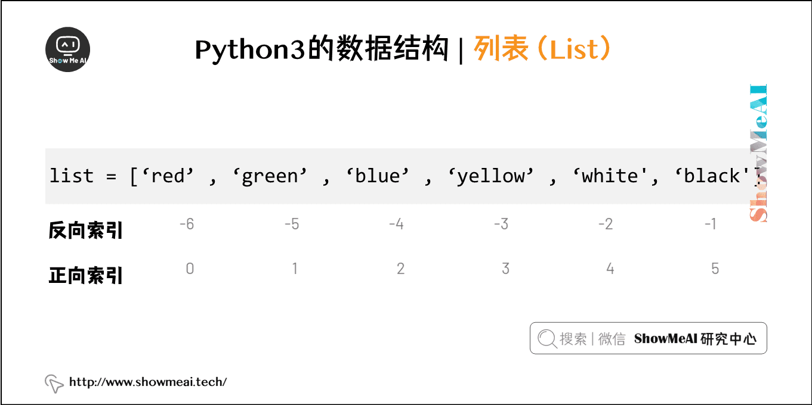

> 方法

| 方法              | 描述                                                         |
| :---------------- | :----------------------------------------------------------- |
| list.append(x)    | 把一个元素添加到列表的结尾，相当于 a[len(a):] = [x]。        |
| list.extend(L)    | 通过添加指定列表的所有元素来扩充列表，相当于 a[len(a):] = L。 |
| list.insert(i, x) | 在指定位置插入一个元素。第一个参数是准备插入到其前面的那个元素的索引，例如 a.insert(0, x) 会插入到整个列表之前，而 a.insert(len(a), x) 相当于 a.append(x) 。 |
| list.remove(x)    | 删除列表中值为 x 的第一个元素。如果没有这样的元素，就会返回一个错误。 |
| list.pop([i])     | 从列表的指定位置移除元素，并将其返回。如果没有指定索引，a.pop()返回最后一个元素。元素随即从列表中被移除。（方法中 i 两边的方括号表示这个参数是可选的，而不是要求你输入一对方括号，你会经常在 Python 库参考手册中遇到这样的标记。） |
| list.clear()      | 移除列表中的所有项，等于del a[:]。                           |
| list.index(x)     | 返回列表中第一个值为 x 的元素的索引。如果没有匹配的元素就会返回一个错误。 |
| list.count(x)     | 返回 x 在列表中出现的次数。                                  |
| list.sort()       | 对列表中的元素进行排序。                                     |
| list.reverse()    | 倒排列表中的元素。                                           |
| list.copy()       | 返回列表的浅复制，等于a[:]。                                 |

>  列表作为堆栈：后进先出

- 列表方法使得列表可以很方便的作为一个堆栈来使用，堆栈作为特定的数据结构，最先进入的元素最后一个被释放（后进先出）。
- 用 append() 方法可以把一个元素添加到堆栈顶。用不指定索引的 pop() 方法可以把一个元素从堆栈顶释放出来。

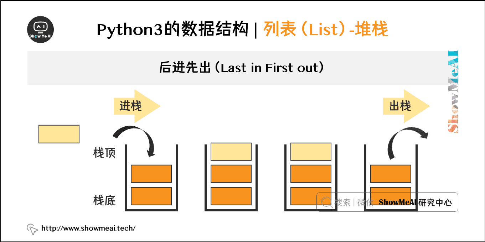

>  列表作为队列：先进先出

- 也可以把列表当做队列用，只是在队列里第一加入的元素，第一个取出来；但是拿列表用作这样的目的效率不高。在列表的最后添加或者弹出元素速度快，然而在列表里插入或者从头部弹出速度却不快（因为所有其他的元素都得一个一个地移动）。

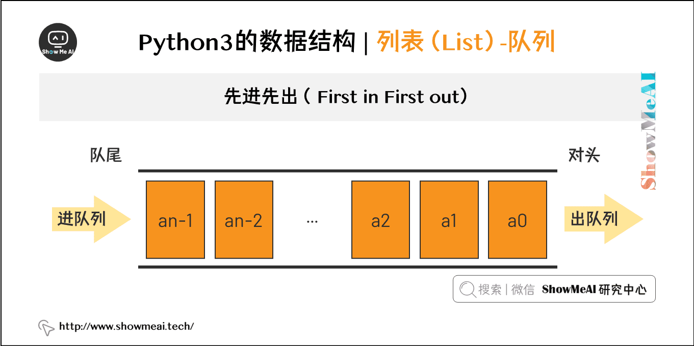

### 1.1.2 元组

- 元组由若干逗号分隔的值组成

- 元组在输出时总是有括号的，以便于正确表达嵌套结构。在输入时可能有或没有括号， 不过括号通常是必须的（如果元组是更大的表达式的一部分）

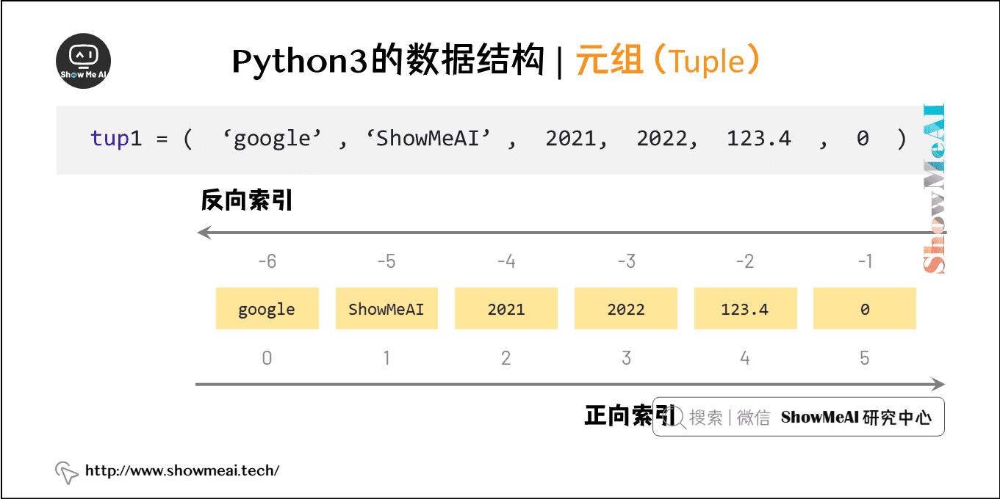

### 1.1.3 集合

集合是一个无序不重复元素的集。基本功能包括关系测试和消除重复元素。

可以用大括号({})创建集合。注意：如果要创建一个空集合，你必须用 set() 而不是 {} ；后者创建一个空的字典


### 1.1.4 字典 （Map）

- 序列是以连续的整数为索引，与此不同的是，字典以关键字为索引，关键字可以是任意不可变类型，通常用字符串或数值。
- 理解字典的最佳方式是把它看做无序的键=>值对集合。在同一个字典之内，关键字必须是互不相同。
- 一对大括号创建一个空的字典：{}。

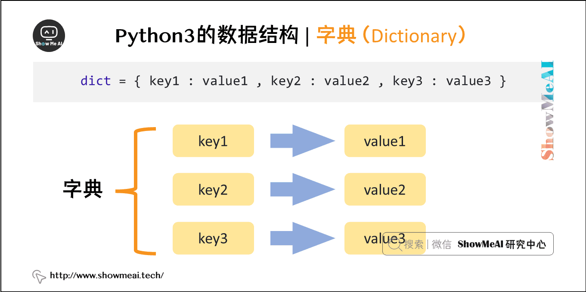

## 1.2 模块

### 1.2.1 模块介绍

- 在程序开发过程中，文件代码越来越长，维护越来越不容易。我们把很多不同的功能编写成函数，放到不同的文件里，方便管理和调用。在Python中，一个.py文件就称之为一个模块（Module）。
- 使用模块可以大大提高了代码的可维护性，而且当一个模块编写完毕，就可以被其他地方引用。我们在使用python完成很多复杂工作时，也经常引用其他第3方模块，受益于强大的python社区，几乎我们完成任何一项任务，都可以有对应的方便快捷可引用的库和模块来协助。

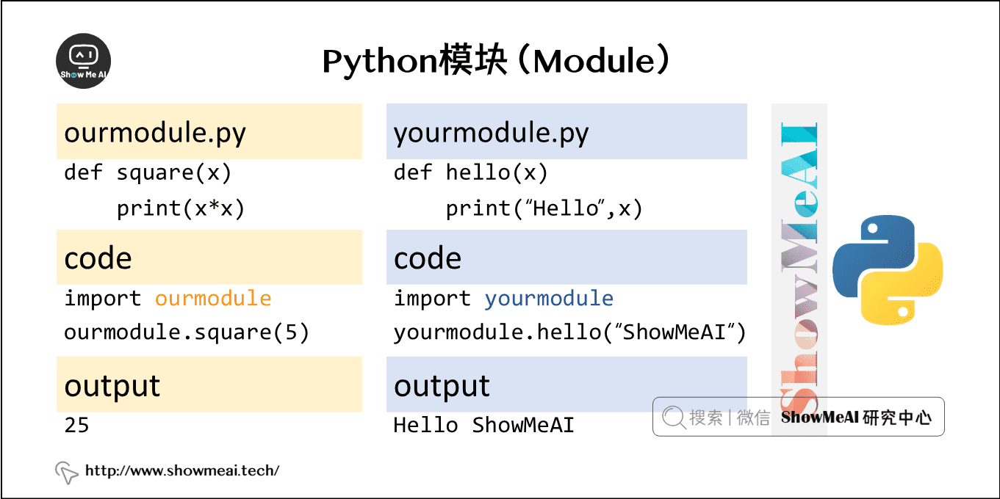

> 语法

- 想使用Python模块，只需在另一个源文件里执行import语句
- Python 的 from 语句让你从模块中导入一个指定的部分到当前命名空间中

```python
import module1[, module2[,... moduleN]
from modname import name1[, name2[, ... nameN]]              
```

```python
import datetime
import sqlite3
import random
import requests
import time
from bs4 import BeautifulSoup
import re
from fake_useragent import UserAgent
```

### 1.2.2 包

- 包是一种管理Python模块命名空间的形式，我们经常会以「包.模块」的形式来导入模块，例如一个模块的名称是C.D， 那么他表示一个包C中的子模块D。使用这种形式不用担心不同库之间的模块重名的情况。


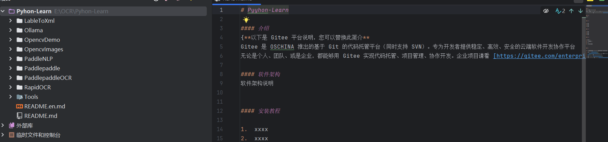

## 1.3 文件操作

- 读写文件是最常见的操作之一，Python内置了读写文件的函数，整体是比较方便的。
- 在磁盘上读写文件的功能都是由操作系统提供的，读写文件就是请求操作系统打开一个文件对象（通常称为文件描述符），然后通过操作系统提供的接口从这个文件对象中读取数据（读文件），或者把数据写入这个文件对象（写文件）。

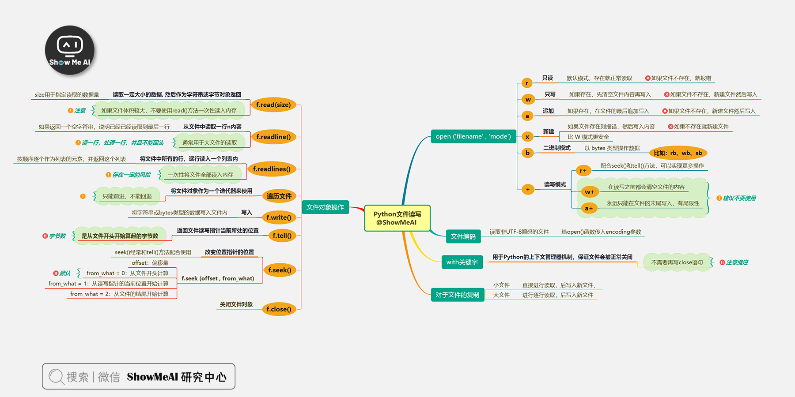

### 1.3.1 基本操作

- 在 Python 中，可以使用`open()`函数打开一个文件进行读取。`open()`函数接受文件路径和打开模式作为参数。
- filename：一个包含了你要访问的文件名称的字符串值，通常是一个文件路径，mode：打开文件的模式，有很多种，默认是只读方式r。
- 为了更方便地管理文件资源，避免忘记关闭文件，可以使用`with`语句，当`with`块结束时，文件会自动关闭，无论块内的操作是否出现异常。

**模式：**

| 模式 | 操作       | 说明                                                         |
| :--- | :--------- | :----------------------------------------------------------- |
| r    | 只读       | 默认模式，如果文件不存在就报错，存在就正常读取。             |
| w    | 只写       | 如果文件不存在，新建文件然后写入；如果存在，先清空文件内容，再写入。 |
| a    | 追加       | 如果文件不存在，新建文件，然后写入；如果存在，在文件的最后追加写入。 |
| x    | 新建       | 如果文件存在则报错，如果不存在就新建文件，然后写入内容，比w模式更安全。 |
| b    | 二进制模式 | 比如rb、wb、ab，以bytes类型操作数据                          |
| +    | 读写模式   | 比如r+、w+、a+                                               |

```python
"""
 @Author: EasonShu
 @FileName: FileRead.py
 @DateTime: 2025/1/14 下午4:55
"""
if __name__ == '__main__':
    # path : 文件路径
    # 使用原始字符串，避免转义字符问题
    path = r'E:\OCR\Pyhon-Learn\Tools\test.txt'
    try:
        with open(path, 'r') as f:
            lines = f.readlines()
            for line in lines:
                print(line.strip())  # 打印行，strip() 去除行末的换行符
    except FileNotFoundError:
        print(f"文件 {path} 未找到，请检查文件路径。")
    except Exception as e:
        print(f"读取文件时出现错误：{e}")
```

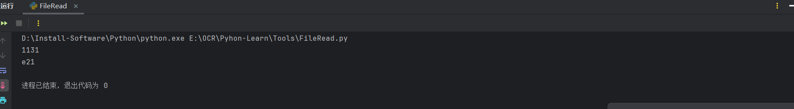

- 追加写入

```python
   # 追加 写入
    try:
        with open(path, 'a') as f:
            f.write('\n')
            f.write('Hello, World!')
    except FileNotFoundError:
        print(f"文件 {path} 未找到，请检查文件路径。")
    except Exception as e:
        print(f"写入文件时出现错误：{e}")
```

- 二进制写入

```python
    # 二进制写入
    try:
        with open(path, 'wb') as f:
            f.write(b'Hello, World!')
    except FileNotFoundError:
        print(f"文件 {path} 未找到，请检查文件路径。")
    except Exception as e:
        print(f"写入文件时出现错误：{e}")
```

### 1.3.2 数据缓冲和刷新

- Python 的文件写入操作通常会使用缓冲机制。这意味着数据可能不会立即写入到磁盘，而是先存储在内存缓冲区中。
- 可以使用`flush()`方法手动将缓冲区的数据写入磁盘

```python
file_path = "output.txt"
file = open(file_path, "w")
file.write("Some data")
file.flush()  # 强制将缓冲区数据写入磁盘
file.close()
```

### 1.3.3 文件编码

**ASCII 编码**：

- ASCII（American Standard Code for Information Interchange）是最基本的字符编码，它使用 7 位二进制数表示 128 个字符，包括英文字母、数字、标点符号和一些控制字符。
- 例如，字符 `A` 的 ASCII 编码是 65，在二进制中表示为 `01000001`。
- 在 Python 中，如果文件只包含 ASCII 字符，可以使用默认的编码方式打开文件。

**UTF-8 编码**：

- UTF-8 是一种广泛使用的字符编码，它是 Unicode 的一种实现方式，可以表示世界上几乎所有的字符。
- UTF-8 使用变长编码，对于英文字符，它使用 1 个字节表示，和 ASCII 兼容；对于其他字符，使用多个字节表示。
- 打开 UTF-8 编码的文件时，可以指定编码参数：

```python
with open('utf8_file.txt', 'r', encoding='utf-8') as file:
    content = file.read()
```

- 当写入文件时，也可以指定 UTF-8 编码：

```python
with open('utf8_file.txt', 'w', encoding='utf-8') as file:
    file.write('你好，世界！')
```

**文件编码的检测和转换**：

- 有时可能需要检测文件的编码，可以使用 `chardet` 库（需要安装：`pip install chardet`）

```python
import chardet
with open('unknown_encoding_file.txt', 'rb') as file:
    raw_data = file.read()
    result = chardet.detect(raw_data)
    encoding = result['encoding']
    print(f"文件编码是: {encoding}")
```

## 1.4 文件目录与OS模块

我们在实际开发中，经常需要对文件进行读取、遍历、修改等操作，通过 python 的标准内置os模块，能够以简洁高效的方式完成这些操作。常见的操作整理如下：

- 文件夹操作：包括文件夹的创建、修改（改名/移动），查询（查看、遍历）、删除等。
- 文件操作：包括文件的创建、修改、读取、删除等。
- 路径操作：文件夹或文件的路径操作，如绝对路径，文件名与路径分割，扩展名分割等

```python
import os
```

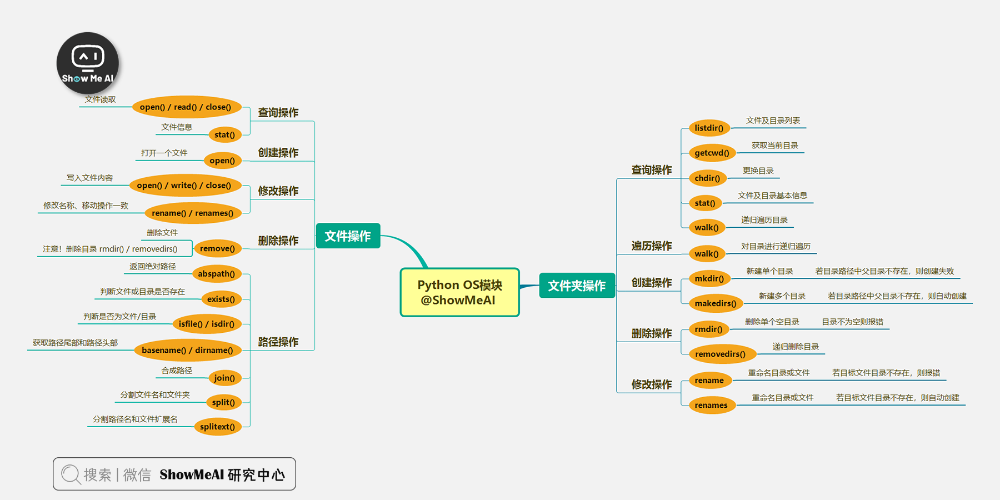

### 1.4.1 查询操作

- listdir ： 文件及目录列表
- getcwd ：获取当前目录
- chdir ：更换目录
- stat ：文件及目录基本信息
- walk ：递归遍历目录

```python
"""
 @Author: EasonShu
 @FileName: OsTest.py
 @DateTime: 2025/1/14 下午5:12
"""
if __name__ == '__main__':
    # Os 模块 查询测试
    import os
    print(os.getcwd())# 获取当前工作目录
    print(os.listdir())# 获取当前目录下所有文件和文件夹
    # 文件目录基本信息
    print(os.stat('OsTest.py'))
    # 更换工作目录
    os.chdir('../')
    print(os.getcwd())
    # 递归查询所有文件和文件夹
    for root, dirs, files in os.walk('.'):
        print(files)

```

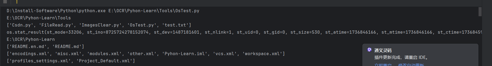

其中 stat 函数返回的是文件或者目录的基本信息，具体如下：

- **st_mode:** inode 保护模式
- **st_ino:** inode 节点号。
- **st_dev:** inode 驻留的设备。
- **st_nlink:** inode 的链接数。
- **st_uid:** 所有者的用户ID。
- **st_gid:** 所有者的组ID。
- **st_size:** 普通文件以字节为单位的大小
- **st_atime:** 上次访问的时间。
- **st_mtime:** 最后一次修改的时间。
- **st_ctime:** 创建时间。

### 1.4.2 创建操作

- mkdir ：新建单个目录，若目录路径中父目录不存在，则创建失败
- makedirs ：新建多个目录，若目录路径中父目录不存在，则自动创建

```python
"""
 @Author: EasonShu
 @FileName: OsTest.py
 @DateTime: 2025/1/14 下午5:12
"""
if __name__ == '__main__':
    # Os 模块 创建测试
    import os
    import random
    # mkdir ：新建单个目录，若目录路径中父目录不存在，则创建失败
    # makedirs ：新建多个目录，若目录路径中父目录不存在，则自动创建
    os.makedirs('test_dir/test_dir2', exist_ok=True)
    print(os.listdir('test_dir'))
    for i in range(10):
        # 随机生成文件名
        file_name = 'test_file_' + str(random.randint(1, 100)) + '.txt'
        # 随机生成文件内容
        file_content = 'This is a test file.'
        # 创建文件
        with open(os.path.join('test_dir', file_name), 'w') as f:
            f.write(file_content)
```

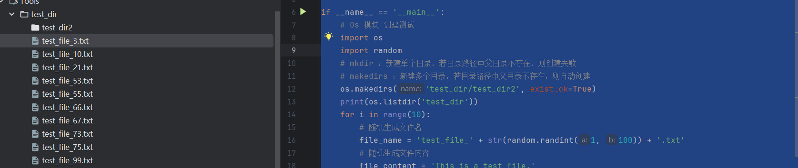

### 1.4.3 删除操作

- rmdir ：删除单个空目录，目录不为空则报错
- removedirs ： 按路径删除递归多级空目录，目录不为空则报错

```python
"""
 @Author: EasonShu
 @FileName: OsTest.py
 @DateTime: 2025/1/14 下午5:12
"""
if __name__ == '__main__':
    # Os 模块 创建测试
    import os
    import random
    # mkdir ：新建单个目录，若目录路径中父目录不存在，则创建失败
    # makedirs ：新建多个目录，若目录路径中父目录不存在，则自动创建
    os.makedirs('test_dir/test_dir2', exist_ok=True)
    print(os.listdir('test_dir'))
    for i in range(10):
        # 随机生成文件名
        file_name = 'test_file_' + str(random.randint(1, 100)) + '.txt'
        # 随机生成文件内容
        file_content = 'This is a test file.'
        # 创建文件
        with open(os.path.join('test_dir', file_name), 'w') as f:
            f.write(file_content)
    # rmdir ：删除单个空目录，目录不为空则报错
    # removedirs ： 按路径删除递归多级空目录，目录不为空则报错
    os.removedirs('test_dir/test_dir2')
    print(os.listdir('test_dir'))
    os.rmdir('test_dir')
```

### 1.4.4 修改操作

- rename ：重命名目录或文件，可修改文件或目录的路径（即移动操作），若目标文件目录不存在，则报错。
- renames ：重命名目录或文件，若目标文件目录不存在，则自动创建

```python
"""
 @Author: EasonShu
 @FileName: OsTest.py
 @DateTime: 2025/1/14 下午5:12
"""
if __name__ == '__main__':
    # Os 模块 创建测试
    import os
    import random
    # mkdir ：新建单个目录，若目录路径中父目录不存在，则创建失败
    # makedirs ：新建多个目录，若目录路径中父目录不存在，则自动创建
    os.makedirs('test_dir/test_dir2', exist_ok=True)
    print(os.listdir('test_dir'))
    for i in range(10):
        # 随机生成文件名
        file_name = 'test_file_' + str(random.randint(1, 100)) + '.txt'
        # 随机生成文件内容
        file_content = 'This is a test file.'
        # 创建文件
        with open(os.path.join('test_dir', file_name), 'w') as f:
            f.write(file_content)
    # rmdir ：删除单个空目录，目录不为空则报错
    # removedirs ： 按路径删除递归多级空目录，目录不为空则报错
    os.removedirs('test_dir/test_dir2')
    print(os.listdir('test_dir'))
    # rename ：重命名目录或文件，可修改文件或目录的路径（即移动操作），若目标文件目录不存在，则报错。
    # renames ：重命名目录或文件，若目标文件目录不存在，则自动创建
    os.renames('test_dir', 'test_dir2')
    print(os.listdir('.'))
    os.renames('test_dir2', 'test_dir')
```

### 1.4.5 其他判断

- exists ：判断文件或目录是否存在
- abspath ：返回绝对路径
- isfile/isdir ：判断是否为文件/目录
- basename/dirname：获取路径尾部和路径头部。其实就是以路径中最后一个 `/` 为分割符，分为头（head） 和尾（tail）两部分，tail 是 basename 返回的内容，head 是 dirname 返回的内容。经常用于获取文件名，目录名等操作
- join ：合成路径，即把两个参数使用系统路径分割符进行连接，形成完整路径。
- split ：分割文件名和文件夹，即把 path 以最后一个斜线”/“为分隔符，切割为 head 和 tail ，以 (head, tail) 元组的形式返回。
- splitext ：分割路径名和文件扩展名，把path 以最后一个扩展名分隔符“.”分割，切割为 head 和 tail ，以 (head, tail) 元组的形势返回。注意与 split 的区别是分隔符的不同。

## 1.5 错误与异常

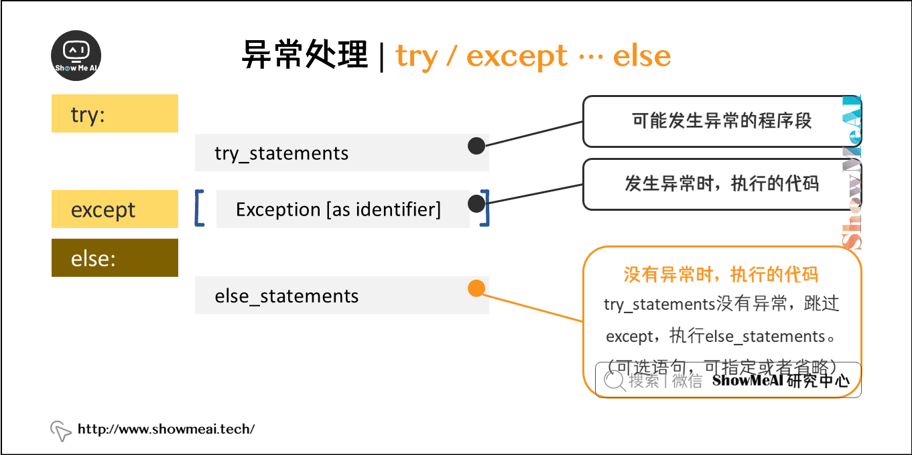

- Python中的语法错误和异常很容易被辨认，我们也可以借助try…except来做相应的处理。

```python
for arg in sys.argv[1:]:
    try:
        f = open(arg, 'r')
    except IOError:
        print('无法打开文件', arg)
    else:
        print(arg, '有', len(f.readlines()), '行')
        f.close()
```

## 1.6 类与对象

### 1.6.1 面向对象（OOP）

- 面向对象编程，在英文中称之为Object Oriented Programming，简称OOP，是一种程序设计思想。OOP把对象作为程序的基本单元，一个对象包含了数据和操作数据的函数。

### 1.6.2 对象概念

- **类(Class)**： 用来描述具有相同的属性和方法的对象的集合。它定义了该集合中每个对象所共有的属性和方法。对象是类的实例。
- **方法**：类中定义的函数。
- **类变量**：类变量在整个实例化的对象中是公用的。类变量定义在类中且在函数体之外。类变量通常不作为实例变量使用。
- **数据成员**：类变量或者实例变量用于处理类及其实例对象的相关的数据。
- **方法重写**：如果从父类继承的方法不能满足子类的需求，可以对其进行改写，这个过程叫方法的覆盖（override），也称为方法的重写。
- **局部变量**：定义在方法中的变量，只作用于当前实例的类。
- **实例变量**：在类的声明中，属性是用变量来表示的，这种变量就称为实例变量，实例变量就是一个用 self 修饰的变量。
- **继承**：即一个派生类（derived class）继承基类（base class）的字段和方法。继承也允许把一个派生类的对象作为一个基类对象对待。例如，有这样一个设计：一个Dog类型的对象派生自Animal类，这是模拟”是一个（is-a）”关系（例图，Dog是一个Animal）。
- **实例化**：创建一个类的实例，类的具体对象。
- **对象**：通过类定义的数据结构实例。对象包括两个数据成员（类变量和实例变量）和方法。

### 1.6.3 类定义

- 类实例化后，可以使用其属性，实际上，创建一个类之后，可以通过类名访问其属性。

```python
class ClassName:
    <statement-1>
    .
    .
    .
    <statement-N>
```

#### 1.6.3.1 构造函数

类有一个名为 `__init__()` 的特殊方法（**构造方法/构造函数**），该方法在类实例化时会自动调用

```java
class ImagesClear:     
    '''
     
    '''
    def __init__(self, image_dir, record_file):
        self.image_dir = image_dir
        self.record_file = record_file 
```

- 调用时机：类定义了 `__init__()` 方法，类的实例化操作会自动调用 `__init__()` 方法。如下实例化类NewClass，对应的 `__init__()` 方法就会被调用

```java
 ImagesClear(imagepath, file)
```

- self代表类的实例，而非类，实例就拥有构造器的属性
- 在类的内部，我们可以使用 **def** 关键字来定义类方法，类方法必须包含参数self, 且其为第一个参数，self代表的是类的实例

```java
import os


class ImagesClear:
    '''

    '''

    def __init__(self, image_dir, record_file):
        self.image_dir = image_dir
        self.record_file = record_file
        print(" init ")

    def clear_images(self):
        try:
            # 读取记录文件内容
            with open(self.record_file, "r") as f:
                lines = f.readlines()
            # 提取记录文件中需保留的文件名部分
            preserve_names = set()
            for line in lines:
                line = line.strip()
                # 提取文件名相关部分（去掉扩展名及前面的路径部分）
                name_parts = line.split(".")[0].split("/")
                if len(name_parts) > 1:
                    preserve_names.add(name_parts[1])
                else:
                    # 如果分割后不符合预期格式，跳过该行记录
                    continue

            # 遍历图像目录及其子目录
            for root, dirs, files in os.walk(self.image_dir):
                for file in files:
                    if file.endswith(".jpg"):
                        print(f"正在处理文件: {file}")
                        # 判断文件名是否包含对应要匹配的部分，若匹配则保留
                        if any(name in file for name in preserve_names):
                            print(f"文件 {file} 匹配成功，保留")
                        else:
                            print(f"文件 {file} 未匹配，删除")
                            try:
                                os.remove(os.path.join(root, file))
                            except OSError as e:
                                print(f"删除文件 {os.path.join(root, file)} 时出现错误: {e}")
        except FileNotFoundError:
            print(f"记录文件 {self.record_file} 不存在，请检查路径是否正确！")
        except Exception as e:
            print(f"在处理过程中出现其他错误: {e}")


if __name__ == "__main__":
    imagepath = r"F:\Images"  # 使用原始字符串表示路径，避免转义问题
    file = r"F:\Images\fileState.txt"
    ImagesClear(imagepath, file)

```

#### 1.6.3.2 继承

- Python 同样支持类的继承。派生类的定义如下所示,子类（派生类/DerivedClass）会继承父类（基类/BaseClass）的属性和方法。
- BaseClassName（实例中的基类名）必须与派生类定义在一个作用域内。除了类，还可以用表达式，基类定义在另一个模块中时这一点非常有用:

```python
class DerivedClass(BaseClass):
    <statement-1>
    .
    .
    .
    <statement-N>
```

```python
#类定义
class person:
    #定义基本属性
    name = ''
    age = 0
    #定义私有属性,私有属性在类外部无法直接进行访问
    __weight = 0
    #定义构造方法
    def __init__(self,n,a,w):
        self.name = n
        self.age = a
        self.__weight = w
    def talk(self):
        print("%s的年龄是 %d 岁。" %(self.name,self.age))
#单继承示例
class student(person):
    grade = ''
    def __init__(self,n,a,w,g):
        #调用父类的构函
        people.__init__(self,n,a,w)
        self.grade = g
    #覆写父类的方法
    def talk(self):
        print("%s的年龄是 %d 岁，目前在读 %d 年级"%(self.name,self.age,self.grade))
s = student('小Show',12,60,5)
s.talk()
```

> 多继承

- Python同样支持多继承形式。多继承的类定义

```python
class DerivedClassName(Base1, Base2, Base3):
    <statement-1>
    .
    .
    .
    <statement-N>
```

- 需要注意圆括号中父类的顺序，若是父类中有相同的方法名，而在子类使用时未指定，python从左至右搜索 即方法在子类中未找到时，从左到右查找父类中是否包含方法。

```python
#类定义
class person:
    #定义基本属性
    name = ''
    age = 0
    #定义私有属性,私有属性在类外部无法直接进行访问
    __weight = 0
    #定义构造方法
    def __init__(self,n,a,w):
        self.name = n
        self.age = a
        self.__weight = w
    def speak(self):
        print("%s的年龄是 %d 岁。" %(self.name,self.age))
#单继承示例
class student(person):
    grade = ''
    def __init__(self,n,a,w,g):
        #调用父类的构函
        people.__init__(self,n,a,w)
        self.grade = g
    #覆写父类的方法
    def talk(self):
        print("%s的年龄是 %d 岁，目前在读 %d 年级"%(self.name,self.age,self.grade))
#另一个类，多重继承之前的准备
class speaker():
    topic = ''
    name = ''
    def __init__(self,n,t):
        self.name = n
        self.topic = t
    def talk(self):
        print("%s是一个演说家，今天ta演讲的主题是 %s"%(self.name,self.topic))
#多重继承
class sample(speaker,student):
    a =''
    def __init__(self,n,a,w,g,t):
        student.__init__(self,n,a,w,g)
        speaker.__init__(self,n,t)
test = sample("ShowMeAI",25,80,4,"Python")
test.talk()   #方法名同，默认调用的是在括号中排前地父类的方法
```

> 方法重写

- 如果你的父类方法的功能不能满足你的需求，你可以在子类重写你父类的方法
- **super()**函数是用于调用父类(超类)的一个方法。

```python
class Parent:        # 定义父类
   def my_method(self):
      print ('调用父类方法')
class Child(Parent): # 定义子类
   def my_method(self):
      print ('调用子类方法')
c = Child()          # 子类实例
c.my_method()         # 子类调用重写方法
super(Child,c).my_method() #用子类对象调用父类已被覆盖的方法
```

#### 1.6.3.3 类属性与方法

- 类的私有属性

**`__private_attrs`**：由两个下划线开头，声明为私有属性，不能在类的外部被使用或直接访问。在类内部的方法中可以使用，使用方法为 **`self.__private_attrs`**。

- 类的方法

- 在类的内部定义的成员方法，必须包含参数 **self**，且为第一个参数，**self** 代表的是类的实例，self 的名字并不是规定死的，也可以使用 **this**，但建议还是按照约定使用 **self**。

