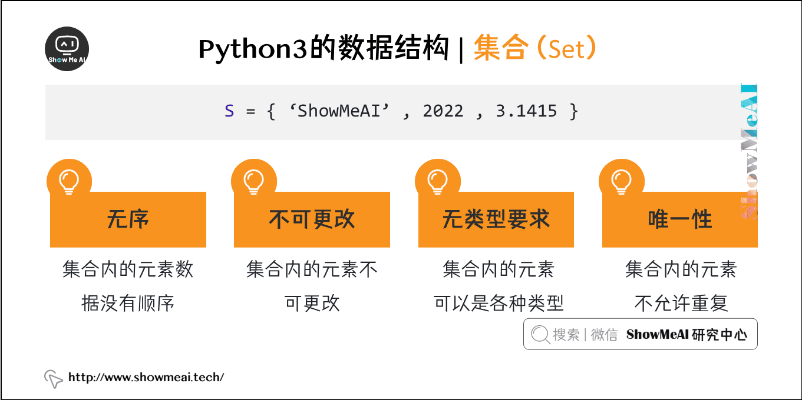
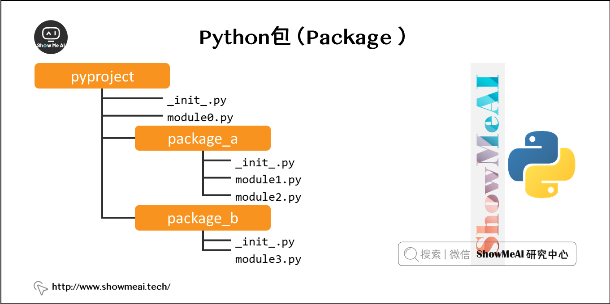

# Python高级部分

- 参考图解Python: https://www.showmeai.tech/tutorials/56

## 1.1 数据结构

Python中有大量的数据结构与容器供编程使用，在本节内容中我们汇总前面所学的知识点，并拓展一些新知识，来介绍Python数据结构。

### 1.1.1 列表 （List）

Python中列表是可变的，这是它区别于字符串和元组的最重要的特点，一句话概括即：`列表可以修改，而字符串和元组不能`。


> 方法

| 方法              | 描述                                                         |
| :---------------- | :----------------------------------------------------------- |
| list.append(x)    | 把一个元素添加到列表的结尾，相当于 a[len(a):] = [x]。        |
| list.extend(L)    | 通过添加指定列表的所有元素来扩充列表，相当于 a[len(a):] = L。 |
| list.insert(i, x) | 在指定位置插入一个元素。第一个参数是准备插入到其前面的那个元素的索引，例如 a.insert(0, x) 会插入到整个列表之前，而 a.insert(len(a), x) 相当于 a.append(x) 。 |
| list.remove(x)    | 删除列表中值为 x 的第一个元素。如果没有这样的元素，就会返回一个错误。 |
| list.pop([i])     | 从列表的指定位置移除元素，并将其返回。如果没有指定索引，a.pop()返回最后一个元素。元素随即从列表中被移除。（方法中 i 两边的方括号表示这个参数是可选的，而不是要求你输入一对方括号，你会经常在 Python 库参考手册中遇到这样的标记。） |
| list.clear()      | 移除列表中的所有项，等于del a[:]。                           |
| list.index(x)     | 返回列表中第一个值为 x 的元素的索引。如果没有匹配的元素就会返回一个错误。 |
| list.count(x)     | 返回 x 在列表中出现的次数。                                  |
| list.sort()       | 对列表中的元素进行排序。                                     |
| list.reverse()    | 倒排列表中的元素。                                           |
| list.copy()       | 返回列表的浅复制，等于a[:]。                                 |

>  列表作为堆栈：后进先出

- 列表方法使得列表可以很方便的作为一个堆栈来使用，堆栈作为特定的数据结构，最先进入的元素最后一个被释放（后进先出）。
- 用 append() 方法可以把一个元素添加到堆栈顶。用不指定索引的 pop() 方法可以把一个元素从堆栈顶释放出来。


>  列表作为队列：先进先出

- 也可以把列表当做队列用，只是在队列里第一加入的元素，第一个取出来；但是拿列表用作这样的目的效率不高。在列表的最后添加或者弹出元素速度快，然而在列表里插入或者从头部弹出速度却不快（因为所有其他的元素都得一个一个地移动）。


### 1.1.2 元组

- 元组由若干逗号分隔的值组成

- 元组在输出时总是有括号的，以便于正确表达嵌套结构。在输入时可能有或没有括号， 不过括号通常是必须的（如果元组是更大的表达式的一部分）


### 1.1.3 集合

集合是一个无序不重复元素的集。基本功能包括关系测试和消除重复元素。

可以用大括号({})创建集合。注意：如果要创建一个空集合，你必须用 set() 而不是 {} ；后者创建一个空的字典



### 1.1.4 字典 （Map）

- 序列是以连续的整数为索引，与此不同的是，字典以关键字为索引，关键字可以是任意不可变类型，通常用字符串或数值。
- 理解字典的最佳方式是把它看做无序的键=>值对集合。在同一个字典之内，关键字必须是互不相同。
- 一对大括号创建一个空的字典：{}。


## 1.2 模块

### 1.2.1 模块介绍

- 在程序开发过程中，文件代码越来越长，维护越来越不容易。我们把很多不同的功能编写成函数，放到不同的文件里，方便管理和调用。在Python中，一个.py文件就称之为一个模块（Module）。
- 使用模块可以大大提高了代码的可维护性，而且当一个模块编写完毕，就可以被其他地方引用。我们在使用python完成很多复杂工作时，也经常引用其他第3方模块，受益于强大的python社区，几乎我们完成任何一项任务，都可以有对应的方便快捷可引用的库和模块来协助。


> 语法

- 想使用Python模块，只需在另一个源文件里执行import语句
- Python 的 from 语句让你从模块中导入一个指定的部分到当前命名空间中

```python
import module1[, module2[,... moduleN]
from modname import name1[, name2[, ... nameN]]              
```

```python
import datetime
import sqlite3
import random
import requests
import time
from bs4 import BeautifulSoup
import re
from fake_useragent import UserAgent
```

### 1.2.2 包

- 包是一种管理Python模块命名空间的形式，我们经常会以「包.模块」的形式来导入模块，例如一个模块的名称是C.D， 那么他表示一个包C中的子模块D。使用这种形式不用担心不同库之间的模块重名的情况。



