# Tkinter 
- https://www.pytk.net/tkinter/1657853591.html

- https://steam.oxxostudio.tw/

- Tkinter是Python自带的标准库，因此无须另行安装，它支持跨平台运行，不仅可以在 Windows 平台上运行，还支持在 Linux 和 Mac 平台上运行。

  > 优点需要的场景：

- 有Python基础，想做个图形化界面程序，但不会C++、C#。

- 简单的小工具、小程序开发。

- 外观要求不高。

- 跨平台支持，支持编译到Windows、Linux、Mac。

  > 缺点需要的场景：

- 对界面美观、性能、大小有要求的程序不适用。

- 跨平台，各平台UI不一致。

- 打包后体积过大。

## 1.1 初步体验

```python
"""
 @Author: EasonShu
 @FileName: 1.py
 @DateTime: 2025/1/17 下午1:44
"""
if __name__ == '__main__':
    # 导入tkinter
    from tkinter import *
    # 导入ttk。ttk是tkinter基于各个平台的主题的组件 相对原始tkinter更美观。
    from tkinter.ttk import *
    # 创建一个窗口
    win = Tk()
    # 设置标题
    win.title("Tkinter编程 pytk.net")
    # 窗口大小设置
    win.geometry("500x200")
    # 创建一个文本标签
    txt = Label(win, text="我在使用TkinterGUI编程")
    # 设置标签大小和位置
    txt.place(width=200, height=50, x=10, y=10)
    # 创建一个按钮
    btn = Button(win, text="我是按钮")
    # 设置按钮的大小和位置
    btn.place(width=130, height=50, x=200, y=100)
    # 展示窗口
    win.mainloop()
```

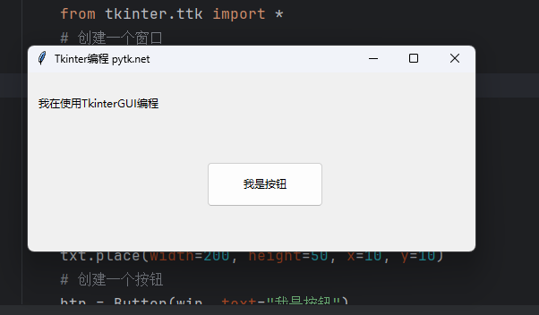

- 在使用 **Tkinter** 之前，需要创建一个 **Tkinter** 窗口对象，通常称之为 `root` 。这个窗口将充当 **GUI** 应用程序的主窗口。

```python
root = tk.Tk()
root.title("Pack布局示例")
```

## 1.2 建立 tkinter 窗口

>[!TIP]
>
>kinter 是 Python 的內建函式庫，只要 import tkinter 就能使用，下方的程式碼執行後，會*使用 Tk() 方法建立 tkinter 視窗物件，接著使用 mainloop() 將其放在主迴圈中一直執行*，直到使用者關閉該視窗才會停止運作。

```python
root = tk.Tk()
root.title("Pack布局示例")
```

### 1.2.1 设置窗口标题，图标

- 确保 `favicon.ico` 文件存在于程序的当前工作目录中。

```python
"""
 @Author: EasonShu
 @FileName: 1.py
 @DateTime: 2025/1/17 下午1:44
"""
if __name__ == '__main__':
    # 导入tkinter
    from tkinter import *
    # 导入ttk。ttk是tkinter基于各个平台的主题的组件 相对原始tkinter更美观。
    from tkinter.ttk import *
    # 创建一个窗口
    win = Tk()
    # 设置标题
    win.title("TdAdmin")
    # 窗口大小设置
    win.geometry("500x200")
    # 设置图标
    win.iconbitmap("favicon.ico")
    # 创建一个文本标签
    txt = Label(win, text="我在使用TkinterGUI编程")
    # 设置标签大小和位置
    txt.place(width=200, height=50, x=10, y=10)
    # 展示窗口
    win.mainloop()
```

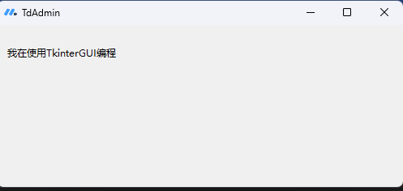


### 1.2.2 尺寸和位置

使用 geometry 方法的「尺寸和位置」

```python
  # 计算屏幕尺寸
    width = win.winfo_screenwidth()
    height = win.winfo_screenheight()
    left = int((width - 500) / 2)
    top = int((height - 200) / 2)
    win.geometry(f'{width}x{height}+{left}+{top}')
```

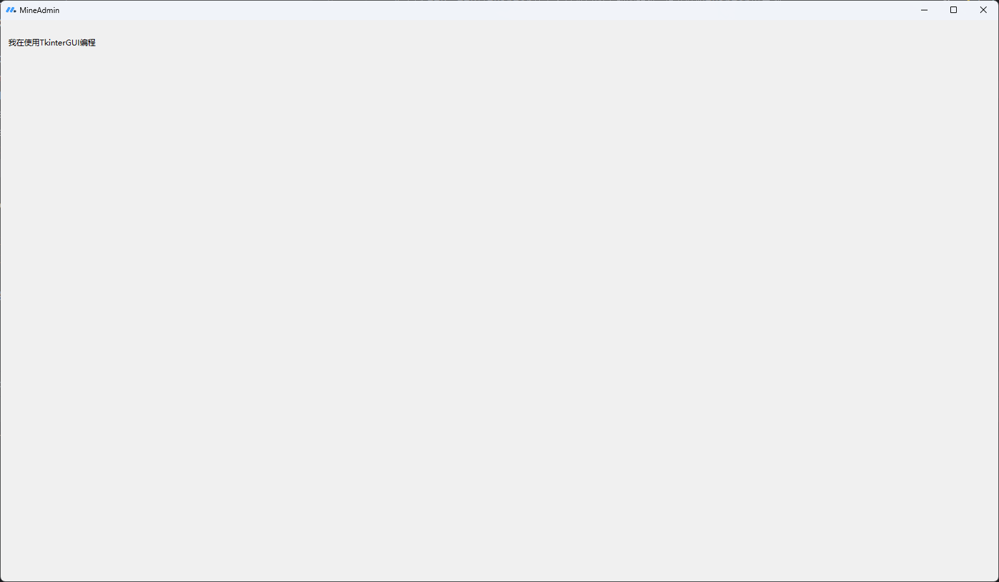

### 1.1.3 最大尺寸与最小尺寸

- 使用 minsize 方法可以設定視窗的「最小」長寬尺寸，使用 maxsize 則可以設定視窗的「最大」長寬尺寸。

```python
    # 计算屏幕尺寸
    width = win.winfo_screenwidth()
    height = win.winfo_screenheight()
    left = int((width - 500) / 2)
    top = int((height - 200) / 2)
    win.geometry(f'{width}x{height}+{left}+{top}')
    # 窗口大小设置: root.maxsize(width, height)
    win.maxsize(width, height)
    win.minsize(500, 200)
```

### 1.1.4 缩放

- *使用 resizable 方法可以設定視窗是否可以縮放*，resizable 包含兩個參數，分別是 x 方向與 y 方向，設定 True 表示可以縮放，設定 False 表示不能縮放。

```python
"""
 @Author: EasonShu
 @FileName: 1.py
 @DateTime: 2025/1/17 下午1:44
"""
if __name__ == '__main__':
    # 导入tkinter
    from tkinter import *
    # 导入ttk。ttk是tkinter基于各个平台的主题的组件 相对原始tkinter更美观。
    from tkinter.ttk import *
    # 创建一个窗口
    win = Tk()
    # 设置标题
    win.title("MineAdmin")
    # 计算屏幕尺寸
    width = win.winfo_screenwidth()
    height = win.winfo_screenheight()
    left = int((width - 500) / 2)
    top = int((height - 200) / 2)
    win.geometry(f'{width}x{height}+{left}+{top}')
    # 窗口大小设置: root.maxsize(width, height)
    win.maxsize(width, height)
    win.minsize(500, 200)
    win.resizable(False, False)   # 設定 x 方向和 y 方向都不能縮放
    #
    # # 窗口大小设置: root.geometry(f'{width}x{height}+{left}+{top}')
    # win.geometry("500x200")
    # 设置图标
    win.iconbitmap("favicon.ico")
    # 创建一个文本标签
    txt = Label(win, text="我在使用TkinterGUI编程")
    # 设置标签大小和位置
    txt.place(width=200, height=50, x=10, y=10)
    # 展示窗口
    win.mainloop()
```

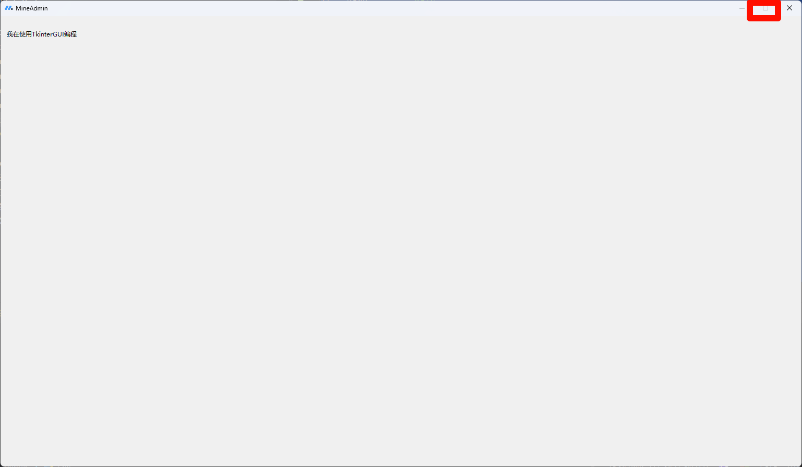

### 1.1.5 颜色

- *設定視窗 configure 裡的 background，就能設定視窗的背景色*，背景色可以使用十六進位的色碼，也可以輸入顏色的名稱，例如紅色 red、黑色 black...等。

```python
"""
 @Author: EasonShu
 @FileName: 1.py
 @DateTime: 2025/1/17 下午1:44
"""
if __name__ == '__main__':
    # 导入tkinter
    from tkinter import *
    # 导入ttk。ttk是tkinter基于各个平台的主题的组件 相对原始tkinter更美观。
    from tkinter.ttk import *
    # 创建一个窗口
    win = Tk()
    # 设置标题
    win.title("MineAdmin")
    # 计算屏幕尺寸
    width = win.winfo_screenwidth()
    height = win.winfo_screenheight()
    left = int((width - 500) / 2)
    top = int((height - 200) / 2)
    win.geometry(f'{width}x{height}+{left}+{top}')
    # 窗口大小设置: root.maxsize(width, height)
    win.maxsize(width, height)
    win.minsize(500, 200)
    win.resizable(False, False)   # 設定 x 方向和 y 方向都不能縮放
    # 背景颜色
    win.configure(bg='#e2e1e4')
    #
    # # 窗口大小设置: root.geometry(f'{width}x{height}+{left}+{top}')
    # win.geometry("500x200")
    # 设置图标
    win.iconbitmap("favicon.ico")
    # 创建一个文本标签
    txt = Label(win, text="我在使用TkinterGUI编程")
    # 设置标签大小和位置
    txt.place(width=200, height=50, x=10, y=10)
    # 展示窗口
    win.mainloop()
```

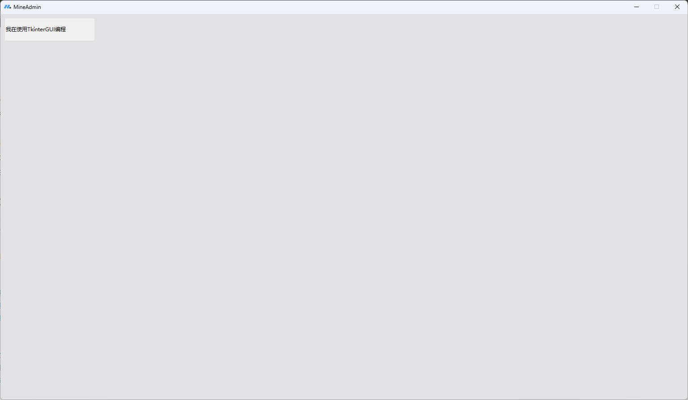

## 1.3 Label (标签)

>[!TIP]
>
>Label 是 tkinter 裡用來建立文字或圖片的標籤物件，這篇教學會介紹如何在 tkinter 視窗裡加入 Label 標籤，並進行像是文字字型、大小、顏色和位置...等參數設定。

### 1.3.1 创建标签

建立 tkinter 視窗物件後，*透過 Label 方法，就能在視窗物件中建立 label 標籤*，必要的參數有兩個，第一個表示要加入的視窗物件，第二個則是標籤參數 ( 通常是文字 text、圖片 image )，*建立 label 標籤後再使用 pack() 方法將其加入* ( 參考 [pack 參數設定](https://steam.oxxostudio.tw/category/python/tkinter/label.html#a6) )，下方的程式碼執行後，會在視窗裡加入一段 hello world 的文字 ( 位置、大小和顏色都使用預設值 )。

```python
"""
 @Author: EasonShu
 @FileName: 1.py
 @DateTime: 2025/1/17 下午1:44
"""
if __name__ == '__main__':
    # 导入tkinter
    from tkinter import *
    # 导入ttk。ttk是tkinter基于各个平台的主题的组件 相对原始tkinter更美观。
    from tkinter.ttk import *
    # 创建一个窗口
    win = Tk()
    # 设置标题
    win.title("MineAdmin")
    # 计算屏幕尺寸
    width = win.winfo_screenwidth()
    height = win.winfo_screenheight()
    left = int((width - 500) / 2)
    top = int((height - 200) / 2)
    win.geometry(f'{width}x{height}+{left}+{top}')
    # 窗口大小设置: root.maxsize(width, height)
    win.maxsize(width, height)
    win.minsize(500, 200)
    win.resizable(False, False)   # 設定 x 方向和 y 方向都不能縮放
    # 背景颜色
    win.configure(bg='#e2e1e4')
    #
    # # 窗口大小设置: root.geometry(f'{width}x{height}+{left}+{top}')
    # win.geometry("500x200")
    # 设置图标
    win.iconbitmap("favicon.ico")
    # 创建一个文本标签
    txt = Label(win, text="我在学习Python")
    # 设置标签大小和位置
    txt.place(x=100, y=100)
    # 展示窗口
    win.mainloop()
```

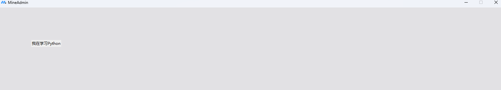

### 1.3.2 标签参数

| 參數           | 說明                                                         |
| -------------- | ------------------------------------------------------------ |
| anchor         | 擺放位置，可以設定 n、s、w、e、ne、nw、sw、se、center ( e 右，w 左，s 下，n 上 )，預設 center。 |
| text           | 文字內容，可以使用換行符 ( \n )。                            |
| width          | 寬度，單位是字元數，預設 0。                                 |
| height         | 高度，單位是字元數，預設 0。                                 |
| padx           | 內容和標籤左右邊界的間距 ( px )，預設 1。                    |
| pady           | 內容和標籤上下邊界的間距 ( px )，預設 1。                    |
| bg/background  | 背景顏色，可以使用十六進位色碼或顏色名稱。                   |
| fg/foreground  | 文字顏色，可以使用十六進位色碼或顏色名稱。                   |
| font           | 字型設定，包含字體、大小 ( px )、粗體 ( bold )、斜體 ( italic )。 |
| justify        | 多行文字的對齊方式，可以設定 left、right、center，預設 center。 |
| cursor         | 滑鼠移動到標籤的樣式，可以設定 arrow、circle、cross、plus...等，預設 arrow。 |
| relief         | 邊框樣式，可以設定 flat、sunken、raised、groove、ridge、solid，預設 flat。 |
| bd/borderwidth | 邊框粗細，預設 1。                                           |
| textvariable   | 文字內容的變數名稱，如果變數被修改，文字就會發生變化。       |
| underline      | 第幾個字元開始加底線 ( 0 為第一個字元, 預設 -1 不加底線 )。  |
| wraplength     | 一段文字超過多少寬度 ( px ) 會換行。                         |
| image          | 圖片內容。                                                   |
| bitmap         | 使用 bitmap 圖示作為標籤內容。                               |
| compound       | 設定文字與圖片排列的方式，可以設定 none、center、top、bottom、left、right，預設 none。 |

## 9.2 容器（定位）

- 在Tkinter中，提供了三种布局方式: `pack（打包）、grid（网格布局）、place（定位布局）`。

| 布局方法 | 说明                                                         |
| -------- | ------------------------------------------------------------ |
| pack()   | 按照组件添加到容器的顺序布局。在使用容器（Frame）布局时非常方便，调整窗口大小时布局自动缩放 |
| grid()   | 网格布局，以行、列来对组件进行布局，较为灵活                 |
| place()  | 定位布局，指定组件大小和位置，最灵活                         |

### 9.2.1 pack()

>[!TIP]
>
>-  容器： **Pack** 布局需要一个容器，通常是 **Frame** （框架）或窗口。元素将被放置在这个容器内。 
>-  方向：你可以指定排列元素的方向，可以是垂直或水平。默认情况下， **Pack** 布局是垂直的，即元素从上到下依次排列。 
>-  定位：你可以使用 **Pack** 布局的选项来控制元素在容器中的位置，例如对齐方式、填充等。 

| 常用参数 | 说明                                                         |
| -------- | ------------------------------------------------------------ |
| anchor   | 指定组件方向，取值 NSEW,北南东西,和他们的组合方位,以及Center |
| expand   | 如果父组件的大小增加，则展开当前组件                         |
| fill     | 是否拉伸组件 NONE(不拉伸) 、X(横向拉伸)、Y(竖向拉伸)、BOTH(都拉伸) |
| side     | 将组件添加到哪 TOP、 BOTTOM 、 LEFT 、 RIGHT                 |

- **side**: 决定组件停靠的方向。

　选项：`left, right, top, bottom`

　la1.pack( side=’top’) # 向上停靠 默认

　la1.pack( side=’bottom) # 向下停靠

　la1.pack( side=’left’) # 向左停靠

　la1.pack( side=’right’) # 向右停靠

```python
"""
 @Author: EasonShu
 @FileName: Pack.py
 @DateTime: 2025/1/17 下午1:49
"""
if __name__ == '__main__':
    # 导入tkinter
    from tkinter import *
    # 导入ttk
    from tkinter.ttk import *
    # 创建一个窗口
    win = Tk()
    # 设置标题
    win.title("布局器 pack() 演示 ~ Tkinter布局助手")
    # 窗口大小设置
    win.geometry("500x200")
    # 创建一个文本标签
    top = Label(win, background="red")
    left = Label(win, background="blue")
    right = Label(win, background="green")
    bottom = Label(win, background="yellow")

    # 调整这里的顺序试试
    left.pack(side=LEFT, fill=BOTH)
    top.pack(side=TOP, fill=BOTH)
    right.pack(side=RIGHT, fill=BOTH)
    bottom.pack(side=BOTTOM, fill=BOTH)
    # 展示窗口
    win.mainloop()
```

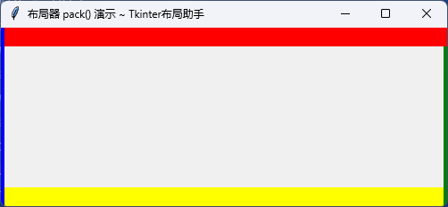

- **fill:** 决定组件是否填充，以及填充的方向

　选项：`x, y, both, none`

　fill=”none” # 不填充 默认

　fill=”x” # [横向填充](https://zhida.zhihu.com/search?content_id=183918291&content_type=Article&match_order=1&q=横向填充&zhida_source=entity)

　fill=”y” # [纵向填充](https://zhida.zhihu.com/search?content_id=183918291&content_type=Article&match_order=1&q=纵向填充&zhida_source=entity)

　fill=”both” # 横向纵向都填充

```python
"""
 @Author: EasonShu
 @FileName: Pack.py
 @DateTime: 2025/1/17 下午1:49
"""
if __name__ == '__main__':
    # 导入tkinter
    from tkinter import *
    # 导入ttk
    from tkinter.ttk import *
    # 创建一个窗口
    win = Tk()
    # 设置标题
    win.title("布局器 pack() 演示 ~ Tkinter布局助手")
    # 窗口大小设置
    win.geometry("500x200")
    # 创建一个文本标签
    # top = Label(win, background="red")
    left = Label(win, background="blue")
    # right = Label(win, background="green")
    # bottom = Label(win, background="yellow")

    # 调整这里的顺序试试
    left.pack(side=LEFT, fill='y')
    # top.pack(side=TOP, fill=BOTH)
    # right.pack(side=RIGHT, fill=BOTH)
    # bottom.pack(side=BOTTOM, fill=BOTH)

    # 展示窗口
    win.mainloop()
```

- **padx/pady:** 组件外，组件跟邻近组件或窗体边界的距离(外边距)

　 默认值：0

```python
"""
 @Author: EasonShu
 @FileName: Pack.py
 @DateTime: 2025/1/17 下午1:49
"""
if __name__ == '__main__':
    # 导入tkinter
    from tkinter import *
    # 导入ttk
    from tkinter.ttk import *
    # 创建一个窗口
    win = Tk()
    # 设置标题
    win.title("布局器 pack() 演示 ~ Tkinter布局助手")
    # 窗口大小设置
    win.geometry("500x200")
    # 创建一个文本标签
    # top = Label(win, background="red")
    left = Label(win, background="blue")
    # right = Label(win, background="green")
    # bottom = Label(win, background="yellow")

    # 调整这里的顺序试试
    left.pack(side=LEFT, fill='y',padx=20)
    # top.pack(side=TOP, fill=BOTH)
    # right.pack(side=RIGHT, fill=BOTH)
    # bottom.pack(side=BOTTOM, fill=BOTH)
    # 展示窗口
    win.mainloop()
```

- **ipadx/ipady:** 组件内，组件文本跟组件边界之间的距离(内边距)

　默认值：0

```python
"""
 @Author: EasonShu
 @FileName: Pack.py
 @DateTime: 2025/1/17 下午1:49
"""
if __name__ == '__main__':
    # 导入tkinter
    from tkinter import *
    # 导入ttk
    from tkinter.ttk import *
    # 创建一个窗口
    win = Tk()
    # 设置标题
    win.title("布局器 pack() 演示 ~ Tkinter布局助手")
    # 窗口大小设置
    win.geometry("500x200")
    # 创建一个文本标签
    # top = Label(win, background="red")
    left = Label(win, background="blue")
    # right = Label(win, background="green")
    # bottom = Label(win, background="yellow")

    # 调整这里的顺序试试
    left.pack(side=LEFT, fill='y', padx=20, ipady=20, ipadx=20)
    # top.pack(side=TOP, fill=BOTH)
    # right.pack(side=RIGHT, fill=BOTH)
    # bottom.pack(side=BOTTOM, fill=BOTH)

    # 展示窗口
    win.mainloop()
```

- **anchor:** 决定组件停靠的位置

　选项：`n,nw,ne,s,nw,ne,center` 默认值：center (居中显示)

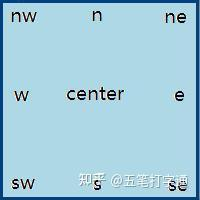


```python
"""
 @Author: EasonShu
 @FileName: Pack.py
 @DateTime: 2025/1/17 下午1:49
"""
if __name__ == '__main__':
    # 导入tkinter
    from tkinter import *
    # 导入ttk
    from tkinter.ttk import *
    # 创建一个窗口
    win = Tk()
    # 设置标题
    win.title("布局器 pack() 演示 ~ Tkinter布局助手")
    # 窗口大小设置
    win.geometry("500x200")
    # 创建一个文本标签
    # top = Label(win, background="red")
    left = Label(win, background="blue")
    # right = Label(win, background="green")
    # bottom = Label(win, background="yellow")

    # 调整这里的顺序试试
    left.pack(side=LEFT,  anchor='center')
    # top.pack(side=TOP, fill=BOTH)
    # right.pack(side=RIGHT, fill=BOTH)
    # bottom.pack(side=BOTTOM, fill=BOTH)

    # 展示窗口
    win.mainloop()
```

```python
"""
 @Author: EasonShu
 @FileName: Pack.py
 @DateTime: 2025/1/17 下午1:49
"""
if __name__ == '__main__':
    from tkinter import *
    root=Tk()
    root.geometry('300x150+888+444')
    la1=Label(root,text='五笔打字通',bg='lightblue')
    la1.pack(side='right',expand=True,anchor='nw')
    root.mainloop()
```


- **expand:** 决定组件的“势力范围”是否扩大到“扩展范围”

　选项：True, False

　默认值：False (标签只在自己的势力范围内活动)

```python
"""
 @Author: EasonShu
 @FileName: Pack.py
 @DateTime: 2025/1/17 下午1:49
"""
if __name__ == '__main__':
    from tkinter import *
    root=Tk()
    root.geometry('300x150+888+444')
    la1=Label(root,text='五笔打字通',bg='lightblue')
    la1.pack()  # 第5行代码
    root.mainloop()
```

- `la1.pack()` 参数为空，参数值就取默认值。相当于：`la1.pack(side='top’,anchor='center’)`

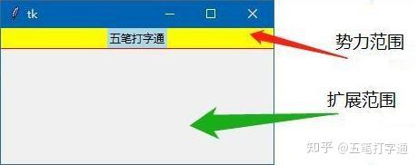

- 其实只要在测试代码第5行中加入`expand=True`，就可以把组件的活动范围由它本来的势力范围扩大到扩展范围

```python
"""
 @Author: EasonShu
 @FileName: Pack.py
 @DateTime: 2025/1/17 下午1:49
"""
if __name__ == '__main__':
    from tkinter import *
    root=Tk()
    root.geometry('300x150+888+444')
    la1=Label(root,text='五笔打字通',bg='lightblue')
    la1.pack(side='top',fill='y',expand=True)
    root.mainloop()
```

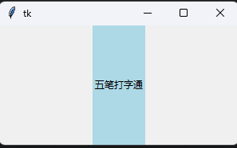

### 9.2.2 grid()

- 网格布局，用类似网格的形式，将界面分为几行，几列，每个组件布置在相应的格子里。

| 常用参数   | 说明                               |
| ---------- | ---------------------------------- |
| column     | 组件在第几列 默认从0开始           |
| columnspan | 这个组件跨了几个列                 |
| row        | 组件在第几行 默认从0开始           |
| rowspan    | 这个组件跨了几行                   |
| sticky     | 组件在单元格内，靠近哪边，默认居中 |

```python
"""
 @Author: EasonShu
 @FileName: Grid.py
 @DateTime: 2025/1/17 下午2:24
"""
if __name__ == '__main__':
    # 导入tkinter
    from tkinter import *
    # 导入ttk
    from tkinter.ttk import *

    # 创建一个窗口
    win = Tk()
    # 设置标题
    win.title("布局器 grid() 演示 ~ Tkinter布局助手")
    # 窗口大小设置
    win.geometry("500x200")

    for i in range(1, 4):
        for j in range(1, 4):
            btn = Button(win, text=str(i * j))
            btn.grid(column=i, row=j)
    # 展示窗口
    win.mainloop()
```

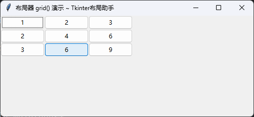

```python
"""
 @Author: EasonShu
 @FileName: Grid.py
 @DateTime: 2025/1/17 下午2:24
"""
if __name__ == '__main__':
    from tkinter import *
    root=Tk() 

    la1=Label(root,text='用户名：')
    la1.grid(row=0,column=0,padx=(10,0),pady=10) # 0行0列

    en1=Entry(root)  # 用户名文本框
    en1.grid(row=0,column=1,columnspan=2,padx=(0,10),ipadx=60) # 0行1列，跨2列

    la2=Label(root,text='密　码：')
    la2.grid(row=1,column=0,padx=(10,0))

    en2=Entry(root)  # 密码文本框
    en2.grid(row=1,column=1,columnspan=2,padx=(0,10),ipadx=60) # 1行1列，跨2列

    but1=Button(root,text="确定")
    but1.grid(row=2,column=1,pady=10,ipadx=30)
    but2=Button(root,text="取消")
    but2.grid(row=2,column=2,ipadx=30)

    root.mainloop()
```

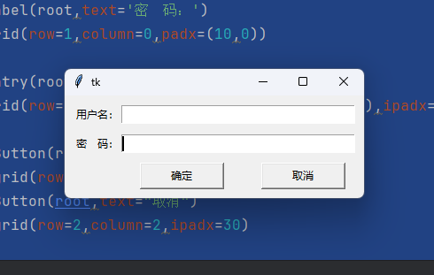