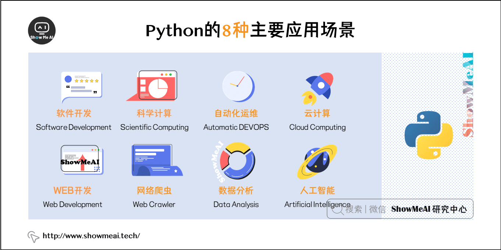

- **常规软件开发**

Python支持函数式编程和OOP面向对象编程，能够承担任何种类软件的开发工作，因此常规的软件开发、脚本编写、网络编程等都属于标配能力。

- **科学计算**

随着NumPy，SciPy，Matplotlib，Enthoughtlibrarys等众多程序库的开发，Python越来越适合于做科学计算、绘制高质量的2D和3D图像。

和科学计算领域最流行的商业软件Matlab相比，Python是一门通用的程序设计语言，比Matlab所采用的脚本语言的应用范围更广泛，有更多的程序库的支持。虽然Matlab中的许多高级功能和toolbox目前还是无法替代的，不过在日常的科研开发之中仍然有很多的工作是可以用Python代劳的。

- **自动化运维**

  这几乎是Python应用的自留地，作为运维工程师首选的编程语言，Python在自动化运维方面已经深入人心，比如Saltstack和Ansible都是大名鼎鼎的自动化平台。

- **云计算**

开源云计算解决方案OpenStack就是基于Python开发的，搞云计算的同学都懂的。

- **WEB开发**

基于Python的Web开发框架不要太多，比如耳熟能详的Django，还有Tornado，Flask。其中的Python+Django架构，应用范围非常广，开发速度非常快，学习门槛也很低，能够帮助你快速的搭建起可用的WEB服务。

- **网络爬虫**

也称网络蜘蛛，是大数据行业获取数据的核心工具。没有网络爬虫自动地、不分昼夜地、高智能地在互联网上爬取免费的数据，那些大数据相关的公司恐怕要少四分之三。能够编写网络爬虫的编程语言有不少，但Python绝对是其中的主流之一，其Scripy爬虫框架应用非常广泛。

- **数据分析**

在大量数据的基础上，结合科学计算、机器学习等技术，对数据进行清洗、去重、规格化和针对性的分析是大数据行业的基石。Python是数据分析的主流语言之一。

- **人工智能**

Python在人工智能大范畴领域内的机器学习、神经网络、深度学习等方面都是主流的编程语言，得到广泛的支持和应用。