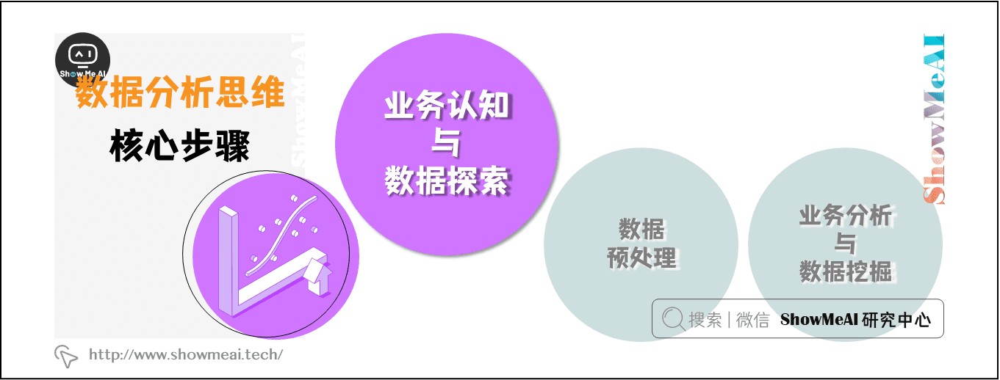
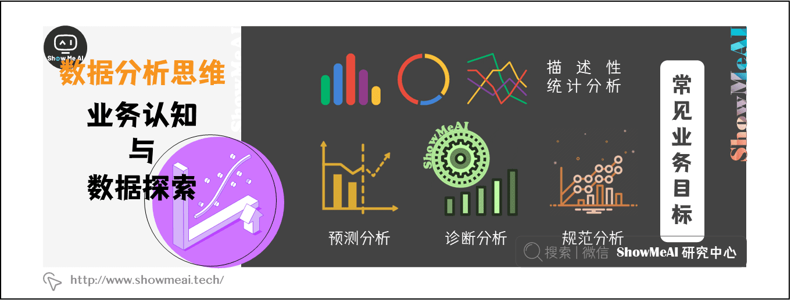

# 业务认知与数据初探

> 数据分析分核心步骤分为：业务认知与数据探索、数据预处理、业务认知与数据探索 等三个核心步骤。本文介绍第一个步骤——**业务认知与数据探索**。

### 1.1 常见业务目标

> （1）描述性分析：分析和描述数据的特征

描述性分析是处理信息汇总的好方法，与视觉分析相结合，可以提供全面的数据结构，并通过仪表板展示所得到的结论。企业中通过分析KPI来评估绩效的做法，就是描述性分析的常见应用之一。

> （2）预测分析：预测未来的结果

预测分析是一个复杂的领域，需要较大大规模的历史数据，并借助技术进步（尤其是机器学习）构建高并发的预测模型，以获得有关未来的预测性洞察。

> （3）诊断分析：透过数据诊断实际问题

通过诊断分析，可以对数据进行批判性思考，判断实际存在的问题，并进一步优化管理或减少损失。物流企业使用诊断分析可以减少物流延迟，电商企业可以借助诊断分析更新营销策略，降本提效。

> （4）规范分析：数据分析的集大成者

规范分析结合了上述所有分析技术，可以帮助公司在数据结论的基础上制定相关决策。需要注意的是，使用规范分析的必要基础是足够大的数据规模、数量使用AI技术，也因此常被应用于大型互联网公司（如Google）和金融机构。

### 1.2 常见业务指标

>  虚荣指标 VS 有效指标

指标是衡量事物好坏的一个指数。数据指标很多，**北极星指标**，**二级指标**、**定性指标**、**量化指标**、**虚荣指标**等等。好的数据指标，应该为产品业务线所在的发展阶段提供指引，而有些数据却起到了相反的作用。