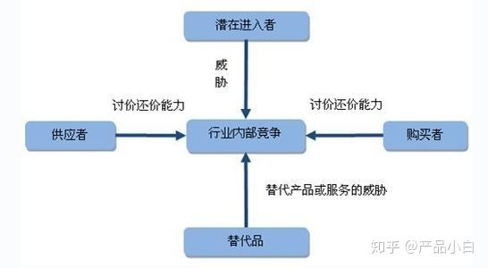

# 数据分析

> 数据分析的数学基础在20世纪早期就已确立，但计算机出现后，规范和自动化的分析才具备可行性。现在，数据分析已经广泛地应用到了各个领域。

# 一 认识数据分析

### 1.1 数据分析的价值

> 个人

- **学习数据分析可以增加个人的就业机会**。打开各种招聘网站，越来越多的岗位开始要求『具备一定的数据分析能力』。同样参与面试的两个优秀候选人，具备数据分析能力的那个有更大的机会拿到Offer。
- **学习数据分析可以得到更多的晋升机会**。例如销售人员，可以通过分析各个渠道的转化率，发现在话术、内容、咨询时间不同的方面的转化效果，从而优化个人的工作流程与相关的内容。有数据支持的业务分析，更容易做出合理的决策，贡献优秀的绩效。
- **学习数据分析拓宽就业方向**。大中型企业（尤其是头部企业），都设置有『数据分析』岗位，例如数据分析师、数据科学家等等。目前各种数据分析岗位招聘需求都相对较大。
- **学习数据分析可以参与公司的决策核心**。数据分析对于企业最大的价值就是可以为企业的发展提供更加明确的方向，能为企业的产业结构优化减少更多的成本支出，作为数据分析人员必然需要参与到决策之中，其重要程度可见一斑。

> 企业

- **掌握数据分析的人才能为企业节约更多的成本**。通过数据分析能够发现人员管理、业务流程、产业结构等过程中的漏洞并加以优化，降低其中的损耗成本。
- **掌握数据分析的人才为企业的发展带来更多的可能**。通过市场数据分析和用户数据分析，可以为目标用户提供更精准的产品和夫，从而提高企业营收规模。

### 1.2 数据分析模型

#### 1.2.1 波特五力模型

**波特五力模型（Porter's Five Forces Model）** 是由 **迈克尔·波特（Michael Porter）** 在 **1979年** 提出的战略分析框架，用于评估一个行业的竞争环境和盈利能力。该模型认为，行业的吸引力（即长期盈利能力）取决于 **五种基本竞争力量** 的相互作用。

> (1) 现有竞争者的竞争程度（Industry Rivalry）

- **定义**：行业内现有企业之间的竞争强度。
- 影响因素：
  - 竞争者数量（市场集中度）
  - 行业增长速度（增长慢→竞争更激烈）
  - 产品差异化程度（同质化→价格战）
  - 退出壁垒（退出成本高→竞争更激烈）
- 例子：
  - **航空业**：竞争激烈，价格战频繁（同质化服务）。
  - **智能手机行业**：苹果 vs. 三星 vs. 华为（品牌差异化缓解竞争）。

> (2) 潜在进入者的威胁（Threat of New Entrants）

- **定义**：新竞争者进入行业的可能性及其影响。

- 影响因素：

  - 进入壁垒

    （Barriers to Entry）：

    - 资本需求（如芯片制造需要巨额投资）
    - 规模经济（如汽车行业）
    - 品牌忠诚度（如可口可乐）
    - 政府政策（如医药行业的监管）

  - **现有企业的反击**（如降价、专利诉讼）

- 例子：

  - **电商行业**：亚马逊、阿里巴巴等巨头垄断，新进入者难生存。
  - **餐饮行业**：进入门槛低，竞争激烈。

> (3) 替代品的威胁（Threat of Substitutes）

- **定义**：其他行业的产品或服务能否替代本行业的产品。
- 影响因素：
  - 替代品的性价比（如电动车 vs. 燃油车）
  - 消费者转换意愿（如纸质书 vs. 电子书）
  - 替代品的创新速度（如数码相机替代胶卷）
- 例子：
  - **传统出租车 vs. 网约车（Uber、滴滴）**
  - **有线电视 vs. 流媒体（Netflix、Disney+）**

> (4) 供应商的议价能力（Bargaining Power of Suppliers）

- **定义**：供应商对行业利润的影响程度。
- 影响因素：
  - 供应商集中度（如台积电在芯片行业的垄断）
  - 替代供应商的稀缺性（如稀土金属供应商）
  - 供应商是否可前向整合（如苹果自研芯片）
- 例子：
  - **英特尔 vs. AMD**（PC厂商依赖它们，议价能力强）
  - **石油输出国组织（OPEC）** 控制油价

> (5) 买方的议价能力（Bargaining Power of Buyers）

- **定义**：客户对价格和服务的谈判能力。
- 影响因素：
  - 买方集中度（如沃尔玛对供应商的压价）
  - 产品标准化程度（如钢铁行业，买方易比价）
  - 买方是否可后向整合（如特斯拉自建电池厂）
- 例子：
  - **航空公司 vs. 波音/空客**（买方少，议价能力强）
  - **消费者 vs. 手机品牌**（品牌忠诚度降低议价能力）

| 五力           | 关键问题               | 影响行业利润        |
| -------------- | ---------------------- | ------------------- |
| **现有竞争者** | 竞争有多激烈？         | 竞争越强→利润越低   |
| **潜在进入者** | 新玩家容易进入吗？     | 进入壁垒低→利润越低 |
| **替代品**     | 是否有更好的替代方案？ | 替代品多→利润越低   |
| **供应商**     | 供应商能提价吗？       | 议价能力强→利润越低 |
| **买方**       | 客户能压价吗？         | 议价能力强→利润越低 |

> 缺点

实际上，关于五力分析模型的实践运用一直存在许多争论，目前较为一致的看法是：该模型更多是一种理论思考工具，而非可以实际操作的战略工具。该模型的理论是建立在以下三个假定基础之上的：

- 制定战略者可以了解整个行业的信息，显然现实中是难于做到的；
- 同行业之间只有竞争关系，没有合作关系，但现实中企业之间存在多种合作关系，不一定是你死我活的竞争关系；
- 行业的规模是固定的，因此，只有通过夺取对手的份额来占有更大的资源和市场，但现实中企业之间往往不是通过吃掉对手而是与对手共同做大行业的蛋糕来获取更大的资源和市场，同时，市场可以通过不断的开发和创新来增大容量。

因此，要将波特的竞争力模型有效地用于实践操作，以上在现实中并不存在的三项假设就会使操作者要么束手无策，要么头绪万千。

#### 1.2.2 PEST分析法

**PEST分析常用于分析宏观环境**。宏观环境包括了一系列影响企业战略规划和经营管理的外部要素，是一切规划工作的前提。PEST模型为宏观环境分析提供了基本框架。

> 1. 政治因素（Political）

**定义**：政府政策、法律法规、国际关系等对企业的影响。
​**关键点**​：

- **政策法规**（如环保政策、税收政策）
- **政治稳定性**（如地区冲突、选举影响）
- **贸易政策**（如关税、进出口限制）
  ​**例子**​：
- 中国“双碳”政策推动新能源行业发展。
- 欧盟GDPR数据法规影响互联网企业运营。

> 2. 经济因素（Economic）

**定义**：宏观经济环境对企业经营的影响。
​**关键点**​：

- **经济增长率**（GDP增速）
- **通货膨胀/通货紧缩**
- **利率与汇率波动**
- **消费者收入与支出水平**
  ​**例子**​：
- 美联储加息影响全球资本市场。
- 经济衰退导致奢侈品消费下降。

> 3. 社会文化因素（Sociocultural）

**定义**：人口结构、文化习惯、价值观等社会层面的影响。
​**关键点**​：

- **人口老龄化/年轻化**
- **消费习惯变化**（如健康饮食趋势）
- **教育水平与劳动力结构**
  ​**例子**​：
- 中国“Z世代”推动国潮品牌崛起。
- 素食主义流行影响食品行业。

> 4. 技术因素（Technological）

**定义**：技术创新对行业竞争格局的颠覆性影响。
​**关键点**​：

- **技术突破**（如AI、区块链）
- **研发投入与专利壁垒**
- **技术普及速度**（如5G推广）
  ​**例子**​：
- ChatGPT冲击传统内容生产行业。
- 电动汽车技术颠覆燃油车市场。

#### 1.2.3 SWOT分析法

**SWOT 是指企业内部的的优势和劣势、外部竞争市场上的机会和威胁**。SWOT 分析法通对企业进行深入全面的分析，以明确竞争优势的定位，将公司的战略与公司内部资源、外部环境有机结合，从而制定企业战略。

> ① 优势（Strengths）

- **定义**：企业独有的、优于竞争对手的资源或能力。
- 常见例子：
  - 品牌影响力（如苹果、可口可乐）
  - 核心技术专利（如华为5G技术）
  - 成本控制能力（如小米供应链管理）

> ② 劣势（Weaknesses）

- **定义**：企业内部不足或限制发展的短板。
- 常见例子：
  - 资金短缺（初创企业）
  - 产品单一化（如诺基亚功能机时代）
  - 管理效率低下（传统企业转型困难）

> ③ 机会（Opportunities）

- **定义**：外部环境中对企业有利的趋势或变化。
- 常见例子：
  - 政策支持（如中国新能源补贴）
  - 市场需求增长（如老龄化催生银发经济）
  - 技术突破（如AI赋能医疗行业）

> ④ 威胁（Threats）

- **定义**：外部环境中可能对企业造成风险的因素。
- 常见例子：
  - 竞争加剧（如拼多多冲击电商市场）
  - 经济衰退（消费降级）
  - 技术颠覆（如数码相机淘汰胶卷）

#### 1.2.4 行业生命周期理论

**行业生命周期**(Industry Life Cycle) ，指行业从出现到完全退出社会经济活动所经历的时间。行业的生命发展周期主要包括四个发展阶段：**初创期**，**成长期**，**成熟期**，**衰退期**。类似的分析思路也常用于用户生命周期的分析。

> （1）导入期（Introduction）

**特征**：

- 产品刚进入市场，技术不成熟，用户认知低。
- 企业数量少，竞争弱，但研发和营销成本高。
- **现金流**：负值（烧钱阶段）。

**典型案例**：

- 2007年iPhone初代发布（智能手机导入期）
- 现在的元宇宙（VR/AR设备）

**企业策略**：

- 聚焦技术研发，建立专利壁垒。
- 教育市场，培养早期用户（如特斯拉早期定位高端）。

> （2）成长期（Growth）

**特征**：

- 需求爆发，销量快速上升，技术逐步标准化。
- 竞争者涌入，价格战初现。
- **现金流**：开始转正，利润增长。

**典型案例**：

- 2010-2020年新能源汽车（特斯拉、比亚迪）
- 当前的AI大模型（如ChatGPT）

**企业策略**：

- 扩大产能，抢占市场份额。
- 差异化竞争（如蔚来汽车主打用户社群）。

> （3）成熟期（Maturity）

**特征**：

- 市场饱和，增速放缓，行业集中度提高。
- 竞争白热化，利润率下降。
- **现金流**：稳定但增长有限。

**典型案例**：

- 传统燃油汽车（丰田、大众）
- 智能手机行业（苹果、华为）

**企业策略**：

- 成本控制（如富士康代工模式）。
- 产品微创新或拓展新市场（如手机厂商进军IoT）。

> （4）衰退期（Decline）

**特征**：

- 需求持续下降，技术被替代。
- 企业退出或转型，行业萎缩。
- **现金流**：萎缩甚至亏损。

**典型案例**：

- 传统胶卷（柯达破产）
- 功能手机（诺基亚退出主流市场）

**企业策略**：

- 收割剩余价值（如缩减产线，提高单价）。
- 转型新领域（如IBM从硬件转向云计算）。

| **指标**       | 导入期      | 成长期   | 成熟期   | 衰退期   |
| -------------- | ----------- | -------- | -------- | -------- |
| **市场增速**   | 低→缓慢增长 | 高速增长 | 低速增长 | 负增长   |
| **竞争者数量** | 极少        | 快速增加 | 兼并减少 | 大量退出 |
| **利润率**     | 亏损        | 上升     | 稳定     | 下降     |
| **技术风险**   | 极高        | 中等     | 低       | 被替代   |

#### 1.2.5  人货场理论

- 人货场，适用于**零售业**的发展分析，不管是最早一代的商超、百货还是现在的**电商零售**、**直播带货**。

#### 1.2.6 金字塔原理

- 金字塔原理（Pyramid Principle），是说**任何事情都可以归纳出一个中心论点，而此中心论点可由三至七个论据支持**，这些一级论据本身也可以是个论点，被二级的三至七个论据支持，如此延伸，状如金字塔。

#### 1.2.7  SMART原则

们在制定工作目标或任务目标时，无论是制定团队的工作目标还是员工的绩效目标，考虑一下目标与计划是不是符SMART原则。**只有具备 SMART 化的计划才具有良好的可实施性，也才能指导保证计划得以实现**。

| **字母** | **维度**             | **关键问题**         | **反面案例**           | **正面案例**                          |
| -------- | -------------------- | -------------------- | ---------------------- | ------------------------------------- |
| **S**    | Specific（明确性）   | 目标是否清晰具体？   | "提升业绩"             | "Q3通过开拓华东市场，使销售额增长20%" |
| **M**    | Measurable（可衡量） | 如何量化结果？       | "优化客户服务"         | "将客户投诉率降至5%以下"              |
| **A**    | Achievable（可实现） | 目标是否现实？       | "一年内成为行业巨头"   | "两年内市场份额从10%提升至15%"        |
| **R**    | Relevant（相关性）   | 目标是否与战略一致？ | "行政部学习Python编程" | "技术团队全员掌握AI模型部署技能"      |
| **T**    | Time-bound（时限性） | 是否有明确截止时间？ | "尽快完成项目"         | "在2024年12月前上线新系统"            |

> 案例1：个人职业发展

- **模糊目标**："我想升职加薪"

- SMART目标：

  "通过考取PMP认证（S），在2025年Q1前（T）达到部门项目管理评分前20%（M），需每周学习10小时（A），与公司晋升要求一致（R）"

> 案例2：企业市场拓展

- **模糊目标**："增加海外市场份额"

- SMART目标：

  "通过入驻亚马逊欧洲站（S），2024年实现欧洲区营收500万美元（M），投入预算200万（A），符合公司全球化战略（R），12月31日前完成（T）"

#### 1.2.8 5W2H分析法

5W2H分析法，又称**七问分析法**，是以5个W开头的英语单词和两个以H开头的英语单词进行设问，发现解决问题的线索，寻找新思路，进行设计构思，从而作出新的发明项目或者作出新的决策的方法。

|   **维度**   |      **关键问题**      |    **应用示例**（以“新产品推广”为例）     |
| :----------: | :--------------------: | :---------------------------------------: |
|   **What**   |  做什么？目标是什么？  |    推广一款智能手表，目标销量10万台。     |
|   **Why**    |   为什么做？必要性？   |   抢占可穿戴设备市场，弥补产品线空白。    |
|   **Who**    | 谁负责？目标用户是谁？ | 市场部主导，目标用户为25-40岁运动爱好者。 |
|   **When**   |   何时做？时间节点？   |      Q3启动，双十一前完成首轮推广。       |
|  **Where**   |    在哪里做？渠道？    |  线上（电商平台+社交媒体）+线下体验店。   |
|   **How**    |  如何做？方法/步骤？   |      KOL合作+限时折扣+线下体验活动。      |
| **How much** | 投入多少？预算/资源？  |        总预算500万，人力投入15人。        |

> 案例：特斯拉进入中国市场

|   **维度**   |               **策略**                |
| :----------: | :-----------------------------------: |
|   **What**   |   销售Model 3/Y，建立上海超级工厂。   |
|   **Why**    | 中国是全球最大新能源市场，政策支持。  |
|   **Who**    | 中产阶层、环保主义者，本地团队运营。  |
|   **When**   |  2019年启动，2020年实现国产化交付。   |
|  **Where**   |       一线城市直营店+线上订购。       |
|   **How**    | 本土化定价（降价）+政府合作拿地建厂。 |
| **How much** |   初期投资50亿美元，年产能50万辆。    |

#### 1.2.9  帕累托法则

源于经典的二八法则，在数据分析中，可以理解为  的数据产生了  的效果，需要围绕这  的数据进行挖掘。

### 1.3  数据分析思维

有人把数据分析的核心总结为六字，即**对比**、**细分**、**溯源**，也被数据分析的三板斧，支撑数据分析的核心应用，具体来说：

**对比：成对地比较**。

- 横向对比：与『他人』比较，比如，两家公司的离职率。
- 纵向对比：按照时间维度与『自己』的比较，比如，一家公司去年和今年的离职率。

**细分：对数据增加维度、降低粒度地分析**。

- 分维度：增加维度，比如，离职率按照部门维度来分析。
- 降低粒度：降低数据聚合的程度，比如，离职率不按年份、而按照月份来统计。

**溯源：在对比、细分锁定到具体维度和粒度之后，依然没有结论，那就需要查看原始数据，洞察数据，从数据中寻找灵感**。

好的，你对“对比”、“细分”、“溯源”这三个数据分析基本概念的解释非常清晰和准确！这种框架对于系统性分析问题至关重要。为了帮助你更好地理解和应用，我来丰富一下你的理解，并补充一些例子：

**应用举例 (连贯场景 - 分析“上周用户投诉率突然上升20%”)：**

1. **对比 (纵向)：** 确认是否真的是异常？对比上周投诉率 vs. 前一周、上个月同期、去年同期。发现上周确实是显著跳升。
2. **细分 (维度 - 时间粒度):** 是整周都高，还是某几天特别高？细分到每天投诉量，发现主要是上周三和周四突然激增。
3. **细分 (维度 - 来源)：** 激增的投诉主要来自哪些渠道？（APP内反馈、电话客服、邮件？）发现APP内反馈暴增。
4. **细分 (维度 - 类型/产品)：** 投诉主要集中在哪些问题类型或哪些功能？发现集中反映“下单支付后订单未创建”。
5. **细分 (降低粒度)：** 查看具体投诉内容样本（此时已靠近溯源）。
6. **溯源**：
   - 查找上周三/四的系统日志，发现那两天正好上线了新支付接口。
   - 检查支付接口监控，发现上线后出现偶发的连接超时错误。
   - 查看用户订单失败记录，与投诉时间和描述吻合。
   - **结论：** 新上线的支付接口稳定性问题导致了大量的支付失败和用户投诉。

# 二 案例

**计划名称：** 汽车检测行业全景认知提升计划

**核心目标：** 系统、深入地理解汽车检测行业的现状、技术、法规、市场、挑战与未来趋势，为后续决策或行动奠定坚实基础。

------

## 1. WHAT (做什么？ - 提升对汽车检测行业的认识)

- 具体内容：
  - **行业定义与范畴：** 明确汽车检测的具体内涵（安全、环保、综合性能等）、检测对象（新车、在用车、特定部件）、检测类型（强制性年检、出厂检验、维修诊断、二手车评估、特定项目检测等）。
  - **技术体系：** 掌握核心检测技术原理与应用（如排放分析、制动/灯光/侧滑检测、底盘动态/静态检测、OBD诊断、ADAS标定与检测、新能源汽车三电系统检测、NVH检测等）。
  - **法规标准体系：** 熟悉国内外主要的汽车检测法规与标准（如中国的GB标准、国六排放法规、年检规定；国际上的ECE法规、ISO标准等）及其演变。
  - **市场结构与产业链：** 了解行业的主要参与者（检测机构类型：政府授权机构、第三方商业机构、车企自建；设备供应商；软件系统提供商；数据服务商等）及其相互关系。分析市场规模、增长驱动因素（保有量增长、法规趋严、技术升级）。
  - **业务流程与价值链：** 理解一次完整的汽车检测（尤其是年检）涉及的关键环节（预约、缴费、外观检查、上线检测、数据上传、报告出具、复检）及其背后的价值创造点。
  - **痛点与挑战：** 识别行业当前面临的主要问题（如检测效率、数据真实性、设备精度、人员素质、政策执行差异、新能源/智能网联汽车带来的新挑战）。
  - **发展趋势与未来展望：** 洞察行业未来发展方向（智能化/自动化检测、远程诊断与OTA检测、大数据应用、新能源专属检测技术发展、检测服务模式创新等）。

------

## 2. WHY (为什么做？ - 提升认识的重要性与目的)

- 重要性：
  - **行业变革期：** 新能源汽车、智能网联汽车的快速发展对传统检测技术、标准和模式带来颠覆性挑战。
  - **法规趋严：** 环保（排放）、安全（主动/被动安全）法规不断升级，检测要求日益严格。
  - **市场潜力：** 庞大的汽车保有量和持续增长带来稳定的检测需求，同时新技术催生新市场（如ADAS标定服务）。
  - **决策基础：** 无论是进入行业（就业、创业、投资）、优化现有业务（检测站运营、设备研发），还是制定相关政策，深刻认识行业是前提。
  - **风险规避：** 了解法规、技术和市场风险，避免决策失误。
- 目的：
  - 建立对汽车检测行业的系统性、框架性认知。
  - 掌握核心技术和关键流程。
  - 理解政策法规环境及其影响。
  - 把握市场动态和竞争格局。
  - 识别行业痛点和未来机遇。
  - 为后续的深入研究、职业规划、商业决策或政策建议提供可靠依据。

------

## 3. WHO (谁来做？ - 执行主体与相关方)

- **执行主体：** 你个人（或你所在的团队/部门）。
- 关键相关方：
  - 信息提供者：
    - **行业专家/从业者：** 检测站站长、技术负责人、设备工程师、审核员。
    - **行业协会/学会：** 中国汽车维修行业协会、地方机动车检测协会等。
    - **研究机构/咨询公司：** 发布行业报告的研究机构。
    - **设备/软件供应商：** 销售和技术支持人员。
    - **政府监管部门：** 交通运输管理部门、生态环境部门相关人员（政策解读）。
  - **学习伙伴：** 同事、同学、行业社群成员（交流讨论）。
  - **潜在受益者：** 你自己（知识提升）、未来可能的雇主、合作伙伴或客户（如果你基于此进行决策或行动）。

------

## 4. WHEN (何时做？ - 时间计划与阶段)

- **总周期：** 建议 **3-6个月**（可根据个人时间投入强度调整）。
- 阶段划分：
  - 第一阶段：基础认知构建 (1-2个月)
    - 目标：建立行业整体框架，了解基本概念、流程和主要法规。
    - 活动：广泛阅读入门资料、行业报告、政策文件；观看科普视频；梳理核心术语。
  - 第二阶段：深入专项研究 (2-3个月)
    - 目标：针对关键技术（如排放、制动、新能源检测）、核心法规（年检新规、国六）、市场结构、痛点挑战等进行深入研究。
    - 活动：精读技术文档、标准原文；分析市场报告；访谈行业人士；参加线上/线下研讨会。
  - 第三阶段：实践与整合 (1个月)
    - 目标：将知识应用于实践（如模拟分析、案例分析），整合信息，形成系统认知。
    - 活动：参观检测站（实地观察）；尝试分析检测数据（公开数据）；撰写学习总结报告；参与行业社群讨论。
  - 第四阶段：持续跟踪与更新 (长期)
    - 目标：保持对行业动态的敏感度。
    - 活动：订阅行业媒体、协会公众号；定期查阅新政策、新技术发布；持续关注头部企业动态。

------

## 5. WHERE (在哪里做？ - 资源获取渠道与活动地点)

- 信息获取渠道：
  - 线上：
    - 政府官网（交通运输部、生态环境部、认监委、国家标准委）。
    - 行业协会/学会官网及公众号。
    - 行业垂直媒体网站/APP（如汽车之家维修频道、AC汽车、搜狐汽车维修产经等）。
    - 研究机构/咨询公司报告（艾瑞咨询、易观分析、头豹研究院等付费/免费报告）。
    - 学术数据库（知网、万方等，查找技术论文）。
    - 在线课程平台（慕课网、网易云课堂等，搜索相关课程）。
    - 行业社群/论坛（微信群、QQ群、知乎专栏、专业论坛）。
    - 设备供应商官网（了解技术白皮书、产品手册）。
  - 线下：
    - 图书馆（查阅行业年鉴、标准汇编）。
    - 行业展会/研讨会（如AMR北京国际汽车维修检测诊断设备及服务用品展览会）。
    - 实地参观：联系并参观不同类型的汽车检测站（交管部门下属站、社会化站、品牌4S店检测线）。
    - 专家访谈/交流活动。
- **主要活动地点：** 个人学习空间（家/办公室）、图书馆、检测站现场、展会/会议中心、咖啡馆（交流）。

------

## 6. HOW (怎么做？ - 具体方法与执行步骤)

1. 文献研究与信息收集：
   - 系统搜索并阅读行业概述性文章、研究报告（市场分析、趋势预测）。
   - 精读核心的国家标准和行业标准（如GB 38900-2020《机动车安全技术检验项目和方法》）。
   - 查阅政府发布的政策法规原文及解读。
   - 收集主要设备供应商的产品技术资料和解决方案白皮书。
   - 关注行业头部企业（检测机构、设备商）的动态和新闻。
2. 专家访谈与交流：
   - 目标：获取一手经验、洞察行业痛点、验证信息。
   - 对象：检测站管理者/技术骨干、设备厂商技术专家、行业协会人员、资深审核员。
   - 方式：通过人脉介绍、行业活动结识、主动邮件/电话联系（清晰说明目的和承诺时间短）。
   - 准备：提前拟定访谈提纲（围绕5W2H），做好记录。
3. 实地观察与体验：
   - 申请参观检测站：重点观察检测流程、设备操作、人员工作状态、车主体验。
   - 参加行业展会：直观了解最新检测设备、技术解决方案、行业风向。
   - （如条件允许）尝试以车主身份体验一次检测流程。
4. 数据分析：
   - 查找并分析公开的行业数据：汽车保有量、检测站数量分布、检测量、通过率、主要不合格项目统计等。
   - 尝试理解数据背后的含义（如新能源车占比提升对检测量的影响，特定不合格项目高发反映的普遍问题）。
5. 案例研究：
   - 研究国内外汽车检测行业的典型案例：
     - 成功案例（如高效运营的检测站、创新的检测技术应用、成功的商业模式）。
     - 问题案例（如检测造假事件、设备故障导致的事故、政策执行中的矛盾）。
   - 分析其成功因素或失败教训。
6. 知识整理与输出：
   - 建立个人知识库：使用笔记软件（如Notion, Obsidian, Evernote）分门别类整理收集到的信息、笔记、报告。
   - 绘制思维导图：梳理行业结构、技术分类、流程环节、关键要素之间的关系。
   - 撰写学习报告/总结：定期（如每月）或按专题进行总结，强制自己提炼核心观点。
   - 参与讨论：在行业社群或与同行交流中分享见解，通过“教”来深化“学”。
7. 技能补充（可选但推荐）：
   - 学习基础汽车原理和构造。
   - 了解基本的传感器、数据采集和分析知识。
   - 关注大数据、人工智能在检测领域的应用趋势。

------

## 7. HOW MUCH (需要多少资源？ - 投入估算)

- 时间投入：
  - 建议每周投入 **10-15小时**（平均每天1.5-2小时）。可根据阶段和个人情况调整。
- 财务投入：
  - **低成本方案 (0 - 1000元人民币)：** 主要依靠免费资源（政府网站、公开报告、免费社群、部分公开课）。可能支出：少量交通费（参观）、打印资料费。
  - **中等成本方案 (1000 - 5000元人民币)：** 购买有价值的行业深度研究报告（几份关键报告）。参加线上付费课程或小型线上研讨会。购买相关书籍或标准文本。
  - **较高成本方案 (5000元以上)：** 参加大型线下行业展会/高端峰会（门票、差旅、住宿）。系统性地报名参加专业培训课程或认证。进行更广泛的专家咨询（可能需要支付咨询费）。
- **人力投入：** 主要是个人时间和精力。如果需要团队协作，则涉及团队成员的投入。
- **其他资源：** 良好的信息检索能力、沟通能力、分析能力、笔记工具、稳定的网络连接。

