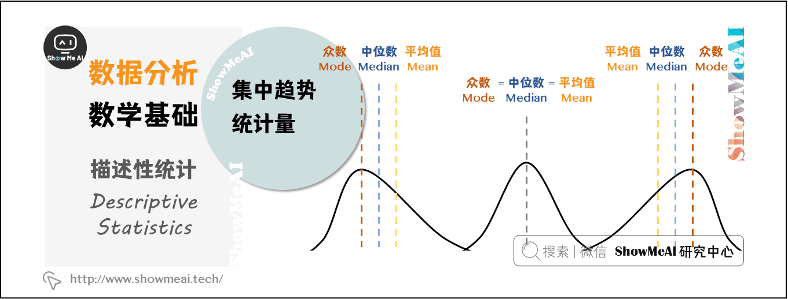
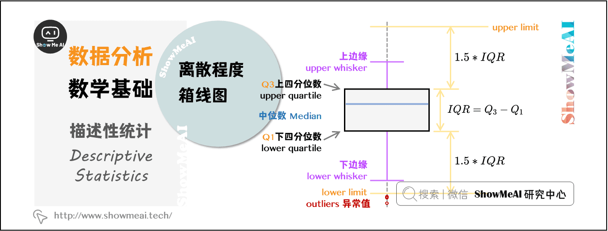
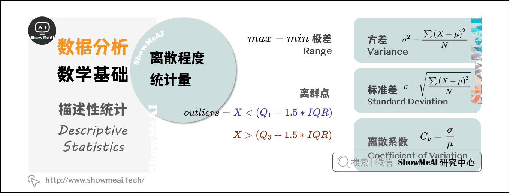
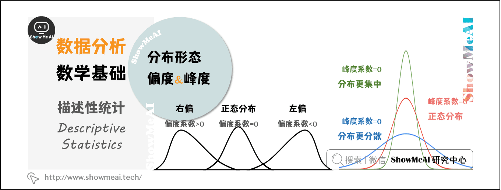

# 数据分析的数学基础

## 一维：描述性统计

> 描述性统计量分为：**集中趋势**、**离散程度**（离中趋势）和**分布形态**。

### 1.1 集中趋势

> 数据的集中趋势，用于度量数据分布的中心位置。直观地说，测量一个属性值的大部分落在何处。描述数据集中趋势的统计量是：**平均值**、**中位数**、**众数**。

- **平均值**（Mean）：指**一组数据的算术平均数**，描述一组数据的平均水平，是集中趋势中波动最小、最可靠的指标，但是均值容易受到极端值（极小值或极大值）的影响。
- **中位数**（Median）：指当一组数据按照顺序排列后，**位于中间位置的数**，不受极端值的影响，对于定序型变量，中位数是最适合的表征集中趋势的指标。
- **众数**（Mode）：指一组数据中**出现次数最多的观测值**，不受极端值的影响，常用于描述定性数据的集中趋势。

> [!TIP]
>
> #### **例子**：假设5个人的月收入（元）为：`3000, 4000, 5000, 6000, 20000`
>
> - 平均值：53000+4000+5000+6000+20000=7600
>   - *问题*：被高收入者（20000）拉高，不能代表多数人收入。
> - 中位数：排序后中间值为 5000
>   - *优势*：不受20000的影响，更贴近大多数人的收入。
> - **众数**：无重复值，故**无众数**；若数据为`3000, 3000, 5000, 6000`，则众数为 **3000**。

### 1.2 离散程度

> 数据的**离散趋势**，用于描述数据的分散程度，描述离散趋势的统计量是：**极差**、**四分位数极差**（IQR）、**标准差**、**离散系数**。

- **极差**（Range）：又称**全距**，记作  ，是一组数据中的最大观测值和最小观测值之差。一般情况下，**极差越大，离散程度越大**，其值容易受到极端值的影响。
- **四分位数极差**（Inter-Quartile Range， IQR）：又称**内距**，是上四分位数和下四分位数的差值，给出数据的中间一半所覆盖的范围。 是统计分散程度的一个度量，分散程度通过需要借助**箱线图**（Box Plot）来观察。通常把小于  或者大于  的数据点视作离群点。

- **方差**（Variance）：方差和标准差是**度量数据离散程度**时，最重要、最常用的指标。方差，是每个数据值与全体数据值的平均数之差的平方值的平均数，常用  表示。

%5E%7B2%7D%7D%7BN%7D)

- **标准差**（Standard Deviation）：又称**均方差**，常用  表示，是方差的算术平方根。计算所有数值相对均值的偏离量，反映**数据在均值附近的波动程度**，比方差更方便直观。

%5E%7B2%7D%20%7D%7BN%7D%20%7D%20)

- **离散系数**（Coefficient of Variation）：又称变异系数，为标准差  与平均值  之比，用于比较不同样本数据的离散程度。离散系数大，说明数据的离散程度大；离散系数小，说明数据的离散程度也小。

> [!TIP]
>
> - **A组**: 70, 75, 80, 85, 90
> - **B组**: 50, 60, 80, 100, 110
>
> | **指标** | **A组计算结果** | **B组计算结果** |               **对比结论**                |
> | :------: | :-------------: | :-------------: | :---------------------------------------: |
> |   极差   |  90 - 70 = 20   |  110 - 50 = 60  |      B组极差更大，说明成绩分布更分散      |
> |   IQR    |  85 - 75 = 10   |  100 - 60 = 40  |          B组中间50%数据跨度更大           |
> |   方差   |       50        |       520       |   B组方差极大，因极端值（110）拉大差异    |
> |  标准差  |     50≈7.07     |    520≈22.8     |     B组标准差是A组的3倍多，波动更剧烈     |
> | 离散系数 |  807.07=0.088   |  8022.8=0.285   | B组CV更高，离散程度更显著（即使均值相同） |
>
> 

### 1.3 分布形态

**偏度**（Skewness）：用来评估一组数据分布呈现的**对称程度**。

- 当 偏度系数  时，分布是**对称**的
- 当 偏度系数  时，分布呈**正偏态（右偏）**
- 当 偏度系数  时，分布呈**负偏态（左偏）**

**峰度**（Kurtosis）：用来评估一组数据的分布形状的**高低程度**的指标。

- 当 峰度系数  时，是**正态分布**
- 当 峰度系数  时，分布**形态陡峭**，数据分布更集中
- 当 峰度系数  时，分布**形态平缓**，数据分布更分散

**其他数据分布图**——**分位数**是观察数据分布的最简单有效的方法，但分位数只能用于观察单一属性的数据分布。**散点图**可以用来观察双变量的数据分布，**聚类**可以用来观察更多变量的数据分布。通过观察数据的分布，采用合理的指标，使数据的分析更全面，避免得出像平均工资这类偏离事实的的分析结果。