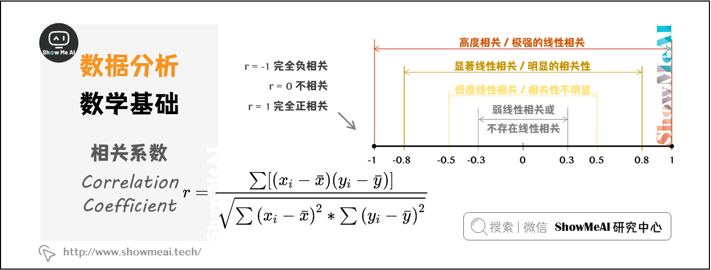

# 数据分析的数学基础

## 一维：描述性统计

> 描述性统计量分为：**集中趋势**、**离散程度**（离中趋势）和**分布形态**。

### 1.1 集中趋势

> 数据的集中趋势，用于度量数据分布的中心位置。直观地说，测量一个属性值的大部分落在何处。描述数据集中趋势的统计量是：**平均值**、**中位数**、**众数**。

- **平均值**（Mean）：指**一组数据的算术平均数**，描述一组数据的平均水平，是集中趋势中波动最小、最可靠的指标，但是均值容易受到极端值（极小值或极大值）的影响。
- **中位数**（Median）：指当一组数据按照顺序排列后，**位于中间位置的数**，不受极端值的影响，对于定序型变量，中位数是最适合的表征集中趋势的指标。
- **众数**（Mode）：指一组数据中**出现次数最多的观测值**，不受极端值的影响，常用于描述定性数据的集中趋势。

> [!TIP]
>
> #### **例子**：假设5个人的月收入（元）为：`3000, 4000, 5000, 6000, 20000`
>
> - 平均值：53000+4000+5000+6000+20000=7600
>   - *问题*：被高收入者（20000）拉高，不能代表多数人收入。
> - 中位数：排序后中间值为 5000
>   - *优势*：不受20000的影响，更贴近大多数人的收入。
> - **众数**：无重复值，故**无众数**；若数据为`3000, 3000, 5000, 6000`，则众数为 **3000**。

### 1.2 离散程度

> 数据的**离散趋势**，用于描述数据的分散程度，描述离散趋势的统计量是：**极差**、**四分位数极差**（IQR）、**标准差**、**离散系数**。

- **极差**（Range）：又称**全距**，记作  ，是一组数据中的最大观测值和最小观测值之差。一般情况下，**极差越大，离散程度越大**，其值容易受到极端值的影响。
- **四分位数极差**（Inter-Quartile Range， IQR）：又称**内距**，是上四分位数和下四分位数的差值，给出数据的中间一半所覆盖的范围。 是统计分散程度的一个度量，分散程度通过需要借助**箱线图**（Box Plot）来观察。通常把小于  或者大于  的数据点视作离群点。

- **方差**（Variance）：方差和标准差是**度量数据离散程度**时，最重要、最常用的指标。方差，是每个数据值与全体数据值的平均数之差的平方值的平均数，常用  表示。

%5E%7B2%7D%7D%7BN%7D)

- **标准差**（Standard Deviation）：又称**均方差**，常用  表示，是方差的算术平方根。计算所有数值相对均值的偏离量，反映**数据在均值附近的波动程度**，比方差更方便直观。

%5E%7B2%7D%20%7D%7BN%7D%20%7D%20)

- **离散系数**（Coefficient of Variation）：又称变异系数，为标准差  与平均值  之比，用于比较不同样本数据的离散程度。离散系数大，说明数据的离散程度大；离散系数小，说明数据的离散程度也小。

> [!TIP]
>
> - **A组**: 70, 75, 80, 85, 90
> - **B组**: 50, 60, 80, 100, 110
>
> | **指标** | **A组计算结果** | **B组计算结果** |               **对比结论**                |
> | :------: | :-------------: | :-------------: | :---------------------------------------: |
> |   极差   |  90 - 70 = 20   |  110 - 50 = 60  |      B组极差更大，说明成绩分布更分散      |
> |   IQR    |  85 - 75 = 10   |  100 - 60 = 40  |          B组中间50%数据跨度更大           |
> |   方差   |       50        |       520       |   B组方差极大，因极端值（110）拉大差异    |
> |  标准差  |     50≈7.07     |    520≈22.8     |     B组标准差是A组的3倍多，波动更剧烈     |
> | 离散系数 |  807.07=0.088   |  8022.8=0.285   | B组CV更高，离散程度更显著（即使均值相同） |
>
> 

### 1.3 分布形态

**偏度**（Skewness）：用来评估一组数据分布呈现的**对称程度**。

- 当 偏度系数  时，分布是**对称**的
- 当 偏度系数  时，分布呈**正偏态（右偏）**
- 当 偏度系数  时，分布呈**负偏态（左偏）**

**峰度**（Kurtosis）：用来评估一组数据的分布形状的**高低程度**的指标。

- 当 峰度系数  时，是**正态分布**
- 当 峰度系数  时，分布**形态陡峭**，数据分布更集中
- 当 峰度系数  时，分布**形态平缓**，数据分布更分散

**其他数据分布图**——**分位数**是观察数据分布的最简单有效的方法，但分位数只能用于观察单一属性的数据分布。**散点图**可以用来观察双变量的数据分布，**聚类**可以用来观察更多变量的数据分布。通过观察数据的分布，采用合理的指标，使数据的分析更全面，避免得出像平均工资这类偏离事实的的分析结果。

## 二 交叉维度

### 2.1  相关性和线性回归

> **相关系数**：又称**简单相关系数**，常用  表示，反应两个变量之间的相关关系及相关方向。
>
> #### 案例1：广告与销售额
>
> - **数据**：广告投入(X) vs 销售额(Y)
> - **结果**：r=0.82 (p<0.001)
> - **结论**：强正相关，但需排除季节性因素影响
>
> #### 案例2：学习时间与成绩
>
> - **异常现象**：r=0.05 (p=0.62)
>
> - 深入分析：分组后发现：
>
>   - 小学生群体：r=0.73
>  - 大学生群体：r=-0.21
>   
>- **启示**：需警惕**辛普森悖论**

>**线性回归**（Linear Regression）：线性回归是利用数理统计中回归分析，确定两种或两种以上变量间相互依赖的定量关系。

- 回归分析中，只包括**一个自变量和一个因变量**，且二者的关系可用一条直线近似表示，这种回归分析称为**一元线性回归**分析。
- 如果回归分析中包括**两个或两个以上的自变量**，且因变量和自变量之间是线性关系，则称为**多元线性回归**分析。

### 2.2 方差分析

**单因素方差分析**：**一项试验只有一个影响因素**，或者存在多个影响因素时，只分析一个因素与响应变量的关系。

**多因素有交互方差分析**：**一项实验有多个影响因素**，分析多个影响因素与响应变量的关系，同时考虑多个影响因素之间的关系。

## 三 概率论

### 3.1 概率事件

- **独立事件**：%20%3D%20P(A)P(B))

- **对立事件**：%20%3D%201%20-%20P(B))

- **互斥事件**：%3D0)

- **穷举事件**：%3D1)

### 3.2 条件概率

- **条件概率**：%20%3D%20%5Cfrac%7BP(AB)%7D%7BP(B)%7D)

- **全概率公式**：%3DP(AB)%20%2B%20P(%5Cbar%7BA%7D%20B)%20%3D%20P(A)P(B%20%5Cmid%20A)%20%2B%20P(%5Cbar%7BA%7D)P(B%20%5Cmid%20%5Cbar%7BA%7D))

- **贝叶斯定理**：%20%3D%20%5Cfrac%7B%20P(A)P(B%20%5Cmid%20A)%20%7D%7B%20P(A)P(B%20%5Cmid%20A)%20%2B%20P(%5Cbar%7BA%7D)P(B%20%5Cmid%20%5Cbar%7BA%7D)%7D)

### 3.3 排列组合

- **排列**：!%7D)

- **组合**：!%7D)

### 3.4 概率分布

#### （1）连续型概率分布

**正态分布**：正态概率分布是连续型随机变量中最重要的分布，记为 )

**经验法则**：正态随机变量有  的值在均值加减个标准差的范围内， 的值在两个标准差内， 的值在三个标准差内。

#### （2）离散型概率分布

**伯努利分布** ：进行一次实验，若成功则随机变量取值为 ，若失败则取值为 ，成功的概率为  失败的概率为 。

**二项分布** ： 个独立的是/非实验中，成功次数的概率分布。 时，二项分布就是伯努利分布。

**泊松分布** ：在连续时间或空间单位上发生随机事件次数的概率。

>这部分介绍了几种基本的概率事件类型及其计算公式：
>- **独立事件**：如果事件A和事件B的发生互不影响，则它们是独立的。此时，两个独立事件同时发生的概率等于各自发生概率的乘积，即\(P(A \cap B) = P(A)P(B)\)。
>- **对立事件**：如果事件A和事件B不能同时发生，并且其中必有一个发生，则它们是对立的。一个事件发生的概率等于1减去其对立事件发生的概率，即\(P(A) = 1 - P(B)\)，这里假设B是A的对立事件。
>- **互斥事件**：如果事件A和事件B不能同时发生（但不一定必须有一个发生），则它们是互斥的。此时，两个互斥事件同时发生的概率为0，即\(P(A \cap B) = 0\)。
>- **穷举事件**：如果事件A和事件B至少有一个必然发生，则它们是穷举的。此时，两个穷举事件至少有一个发生的概率为1，即\(P(A \cup B) = 1\)。
>
>- **排列**：当考虑选取顺序时，使用排列公式\(P_n^N = n!{N \choose n} = \frac{N!}{(N-n)!}\)，表示从N个不同元素中选取n个元素并按特定顺序排列的方式总数。
>- **组合**：当不考虑选取顺序时，使用组合公式\(C_n^N = {N \choose n} = \frac{N!}{n!(N-n)!}\)，表示从N个不同元素中无序选取n个元素的方式总数。
>
>- **条件概率**：给定事件B已经发生的情况下，事件A发生的概率，用\(P(A|B) = \frac{P(AB)}{P(B)}\)表示。
>- **全概率公式**：用于计算一个事件发生的总概率，当这个事件可以通过多个互斥的途径发生时，公式为\(P(B) = P(AB) + P(\bar{A}B) = P(A)P(B|A) + P(\bar{A})P(B|\bar{A})\)。
>- **贝叶斯定理**：用于计算在已知结果的情况下，某个原因发生的概率，公式为\(P(A|B) = \frac{P(A)P(B|A)}{P(A)P(B|A) + P(\bar{A})P(B|\bar{A})}\)。
>

## 四 统计推断

### 4.1 抽样

**抽样**：应该满足抽样的随机性原则。

**抽样方法**：简单随机抽样、分层抽样、整群抽样、系统抽样

### 4.2  置信区间

### 4.3 假设检验

