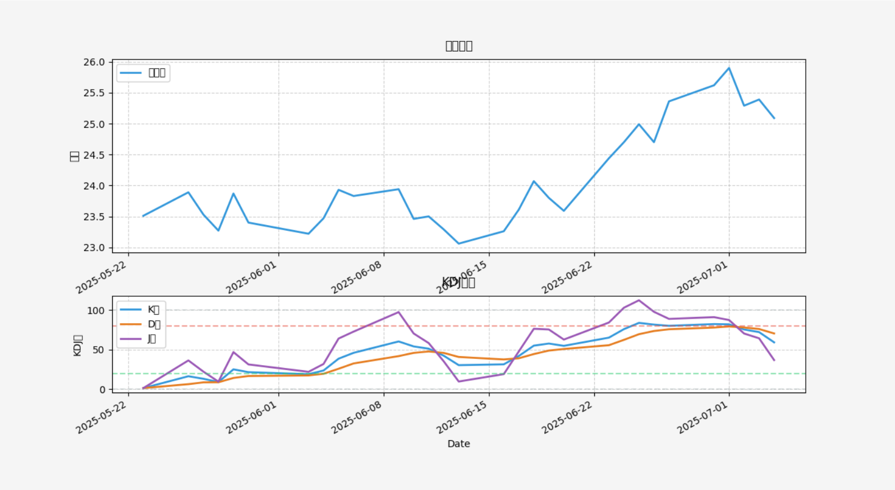
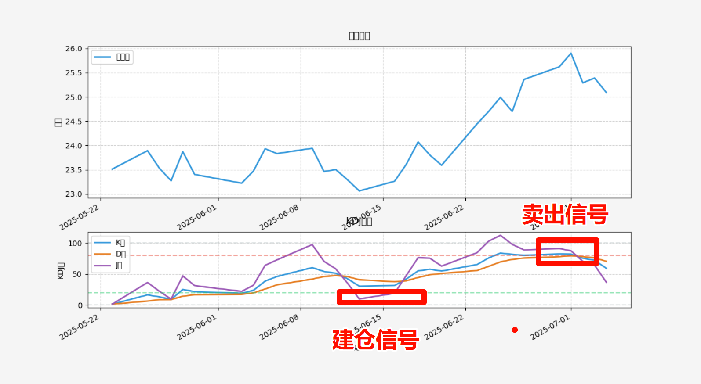
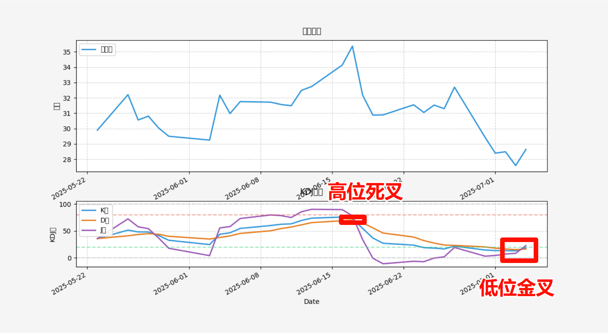
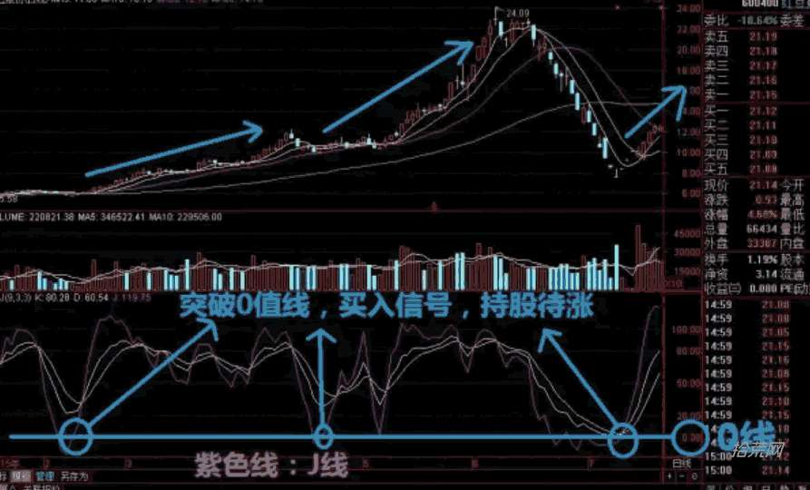
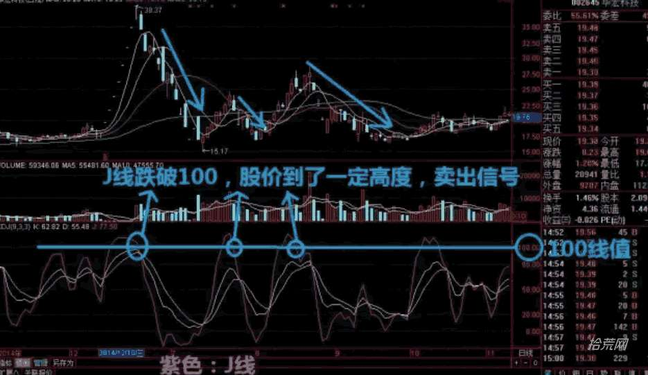
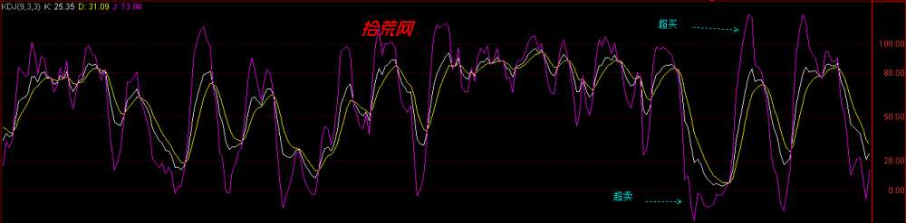
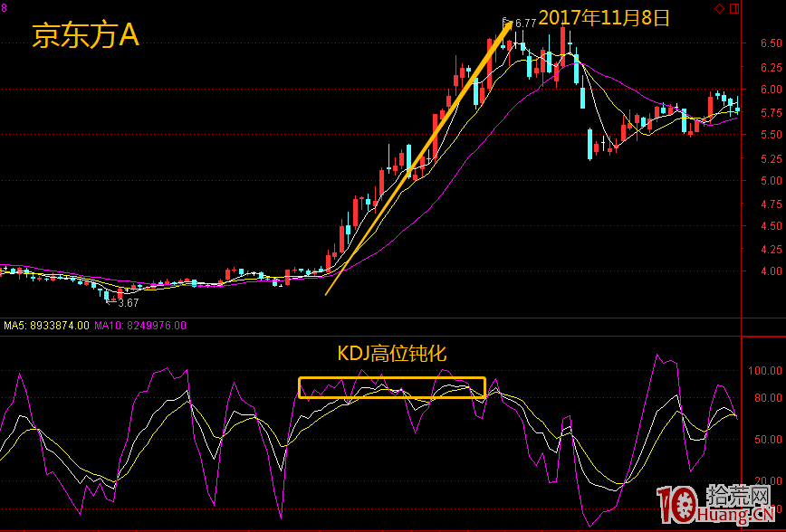
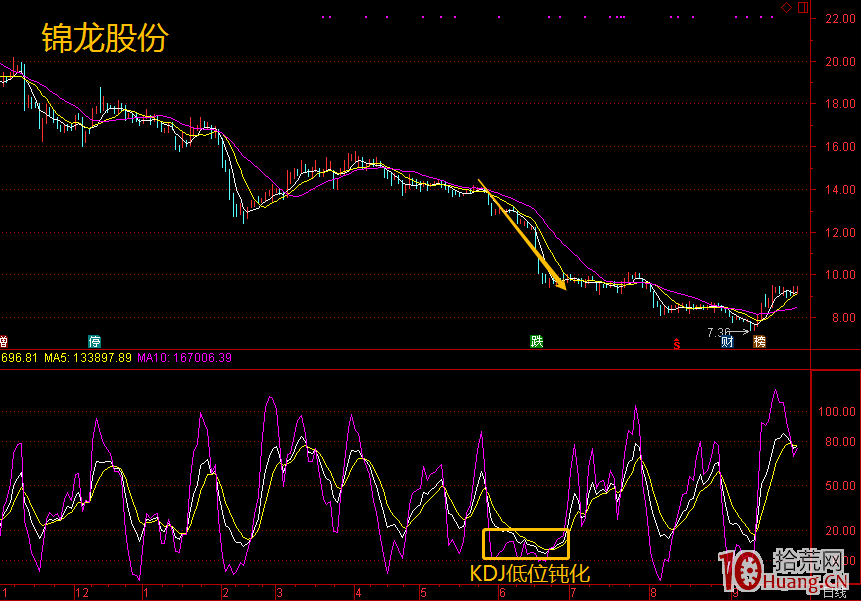
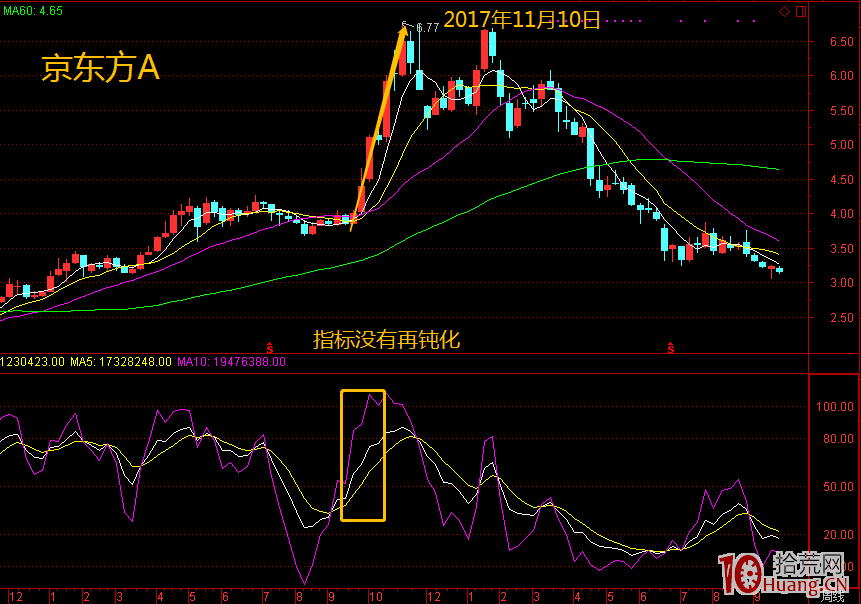
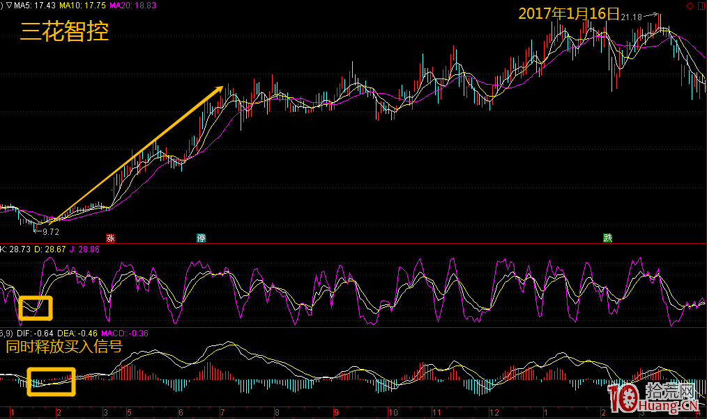

# KDJ

## 1.1 基础认识

随机指标、即`KDJ`指标，主要用于推算行情涨跌的强弱势头，从而找出买点或卖点。`KDJ`是一个颇具实战意义的指标，因此深受广大投资者喜欢。

**随机指标在图标上共有三根线，即K线、D线、J线。**其中，K为快速指标，D为慢速指标。

- **当K线向上突破D线时，表示为上升趋势，可以买进;**
- **当K线向下突破D线时，可以卖出。**
- **随机指数的最大值为100，最小值为0，当KD值升到90以上时表示偏高，跌到20以下时表示偏低;太高就有下跌的可能，而太低就有上涨的机会。**

>注意：
>
>1.当股价处在上升趋势或下降趋势，不断创新高或新低时，KDJ会出现在高位或低位反复钝化的现象，此时应选用趋势类指标如MACD来判断。
>
>2.KDJ发出的金叉与死叉信号有时会失效，KDJ在低位发生的金叉信号以及在高位发生的死叉信号更有效，KDJ低位值在30及以下，高位值在70及以上。
>
>3.KDJ顶背离与底背离出现时，只代表了股价有回调和反弹的需求，但是幅度与时间无法准确判断。
>
>4.KDJ指标结合K线，形态以及量价关系使用会更有效!

## 1.2 交易准则

### 1.1 D信号 

> D线跌破20，为买入信号。
>
> - 当KDJ指标中的D线跌破20时，说明市场进入了超卖状态，股价继续下跌的空间已经很小。
> - 这是看涨买入的信号，一旦多方力量复苏，股价有望持续拉升，投资可这时适当买入一部分股票，当D线重新突破20后继续上涨时，可以再次加仓。
>
> D线从上至下跌破80，为卖出信号。
>
> - 当指标D一路上涨，突破80时，指标即进入超卖区域。
> - 该形态说明多方力量强烈到了极点，如果后续力量不足，将会有反转下跌的危险，看到这个信号，投资者应该卖出部分股票，而如果在D线向上突破80时，成交量也出现萎缩，说明多方力量已经开始衰弱，一旦D线再次回头跌破80，最好清仓出局。

### 1.2 金叉信号

> - K线与D线低位金叉，买入股票。
>
> 第一、当K线和D线都位于20下方并且同时上涨，K线向上突破D线时，就被称为低位金叉。该形态表示空方力量强盛到极致后多方力量开始反攻，金叉过后股价将被多方持续拉升。此时，投资者可以积极买入股票。而如果金叉出现在50上方时，则不能作为有效的看涨买入信号。
>
> - K线与D线高位死叉，卖出股票。
>
> 第二、当K线和D线都位于80上方并且同时下跌，K线向下跌破D线时，就被称为高位死叉。该形态表示空方力量开始反攻，而多方再难继续拉升股价。此时，投资者应该将手指的股票卖出。通常，死叉出现的位置越高，看跌信号越强烈。

### 1.3 J信号

> - 第一、J线从0下方反弹图片0值，买入信号
>
> 当J线连续多日在0下方，一旦回升到0上方，就表明空方力量消耗严重，多方力量复苏，是一个积极的买入信号。且J线在0下方的时间越长，该形态的看涨信号越强烈。
>
> - J线从100上方回调跌破100，卖出信号
>
> 股价在连续上涨过程中，J线连续多日在100以上，之后开始下跌并跌破100，表明空方力量复苏，是股价即将下跌的信号。这时投资者就应该卖出部分股票，如果同时伴有K、D线的高位死叉，则看跌信号更加强烈。

### 1.4 超卖与超买

- 当K、D、J三值均小于20时，表示市场进入超卖区，股价存在反弹回升的需求
- 当K、D、J三值均大于80时，表示市场进入超买区，股价存在下跌回落的需求。

### 1.5 量价背离

- 股价创新高，KDJ曲线没创新高，为KDJ顶背离，股价有下跌回调的需求
- 股价创新低，KDJ曲线没创新低，为KDJ底背离，股价有反弹回升的需求。

### 1.6 钝化

- KDJ指标是进行股票交易使用最多的指标之一，它的最大优点是反应敏感，能给出非常明显的入场和离场信号。
- 但是，KDJ指标的缺点同样也比较明显，就是容易产生低位钝化和高位钝化，从而导致投资者在黄金交叉的信号进货太早而被套牢，死亡交叉的信号出货太早而被轧空。

> 高位钝化

- **KDJ指标维持在超买区，进入了钝化状态，是一种强势股的特征，可以密切关注，或者少量参与。**

- **KDJ指标出现高位钝化，股价加速上行，指标继续钝化，投资者可以继续加仓，这种情况该跌不跌，很有可能走出超强的行情**

> 低位钝化

- **KDJ指标维持在超卖区域，进入了钝化状态，是一种弱势股的特征，需要谨慎操作。**

- **KDJ指标出现低位钝化，股价加速下跌，指标继续钝化，投资者需要积极清仓。**

> 如何解决钝化

- 如在日K线图上产生KDJ指标的低位黄金交叉，我们可以把它放大到周线图上去看，如果在周线图上也是在低位产生黄金交叉，我们将认为这个信号可靠性强，可以大胆去操作。
- 如果周线图上显示的是在下跌途中，那么日线图上的黄金交叉可靠性不强，有可能是庄家的骗线手法，这时候我们可以采用观望的方法。

> **MACD指标结合使用**

- 我们知道MACD指标的含义是“市场平均成本的离差值（长期和短期平均成本差异）”，一般反应中线的整体趋势，其基本与市场价格同步移动，使得发出信号的要求和限制增加，从而避免了很多KDJ假信号的出现。
- 因此，对于短期走势的判断，KDJ发出的买卖信号，需要MACD来验证配合，一旦MACD与KDJ同步（共振）发出同一指令，则买卖准确率将大大提高。当然，要是股价或者成交量长短均线也发出共振指令，那可靠度也进一步增强

