# K线图

### 1.1 K线图简介

> [!TIP]
>
> 起源于日本，又称蜡烛图，阴阳线。原来是日本米商用于记录米市中的行情波动，后因其表示价格趋势的方法直观、真实，逐渐成为使用最广泛的技术图形。
>
> **一根单K线构成，包括四大要素：开盘价、收盘价、最高价、最低价。**

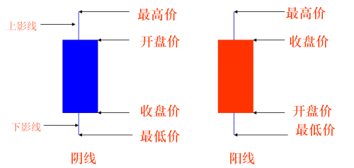

### 1.2 使用规则

只要股票市场存在一天，就总有人买卖股票，归结起来来就是多空两大阵营。多方阵营强大时，股价就涨;当空方阵营强大时，股价就跌。

### 1.3 常见形态

> [!TIP]
>
> **光头光脚小阳线**
>
> 此形态表示最低价和开盘价相同，最高价与收盘价相同，上下价位窄幅波动，表示买方力量逐步增加，多方力量暂时略点优势。此形态常在上涨初期、回调结束或盘整的时候出现。

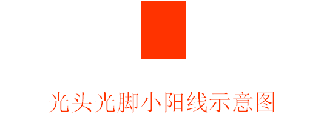

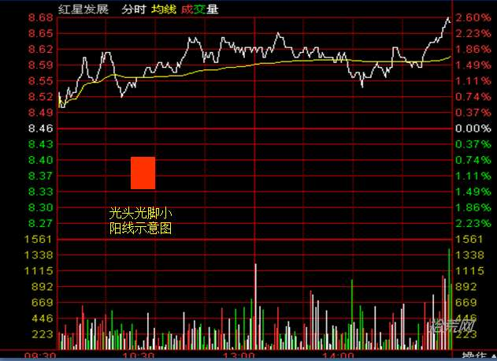

> [!TIP]
>
> **光头光脚小阴线**
>
> 此形态表示开盘价就是最高价，收盘价就是最低价，价格波动幅度有限，表示卖方力量有所增加，买卖双方空方力量暂时卖方略占优势。此形态常在下跌初期、横盘整理的反弹结束时出现。

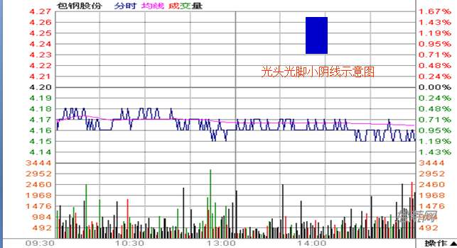

> [!TIP]
>
> 光头光脚长阳线
>
> 没有上下影线，表示多方走势强劲买方点绝对优势，空方毫无抵抗。经常出现在脱离底部的初期，回调结束后的再次上涨，高位的拉升阶段，有时也会在严重超跌后的大力反弹中出现。

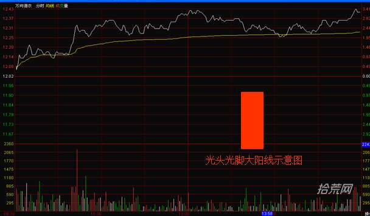

> [!TIP]
>
> 光头光脚长阴线
>
> 没有上下影线，表示空方走势强劲，卖方占绝对优势，多方毫无抵抗。经常出现在头部开始下跌的初期，反弹结束后或最后的打压过程。

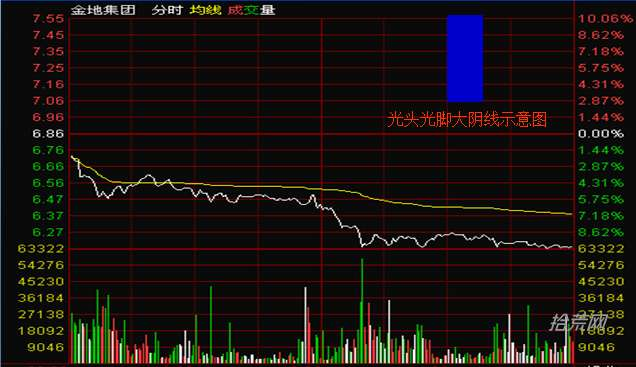

> [!TIP]
>
> 带上影线的阳线
>
> 这是上升抵抗型，表示多方在上攻途中遇到了阻力。此形态常出现在上涨途中、上涨末期或股价从底部启动的密集成交区，上影线和实体的比例可以反映多方遇阻的程度。上影线越上，表示压力越大，实体的长度越长，表示多方的力量越强。

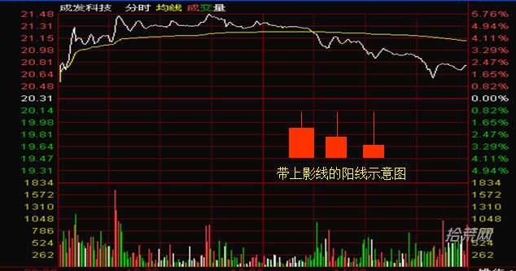

> [!TIP]
>
> 带上影线的阴线
>
> 这是上升抵抗型，表示多方在上攻途中遇到了阻力。此形态常出现在上涨途中、上涨末期或股价遇到密集成交区，上影线和实体的比例可以反映多主遇阻的程度。上影线越上，表示压力越大。

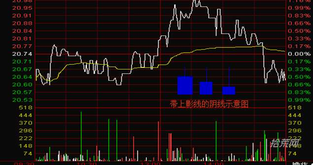

> [!TIP]
>
> 带下影线的的阴线
>
> 表示下方有支撑、上有压力，总体卖方点优。常出现在市场的底部、上升途中。上影线长，说明上方压力大;下影长，说明下方支撑强;实体越长，说明空方实力强。

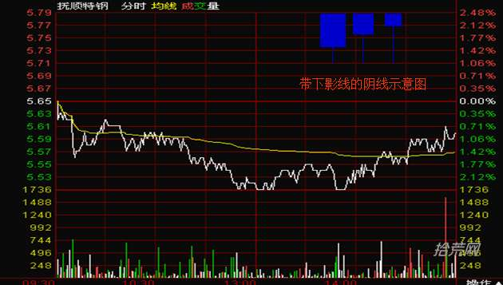

> [!TIP]
>
> 带上下影线的阳线
>
> 表示下有支撑，上有压力，总体买方占优。常出现在市场的底部，上升途中。上影线长，说明上方压大;下影线长，说明下方支撑强;实体越长，说明多方实力强。

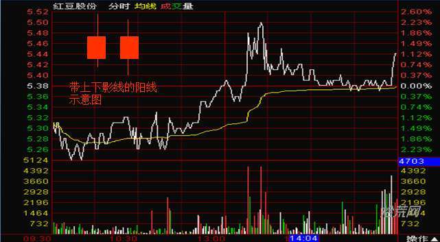

> [!TIP]
>
> 带上下影线的阴线
>
> 表示下有支撑，上有压力，总体卖方点优。常出现在市场的底部、上升途中。上影线长，说明上方压力大;下影线长说明下方支撑强;实体越大，说明空方实力强。

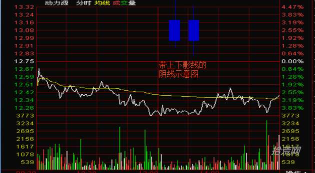

> [!TIP]
>
> 十字星图形
>
> 表示开盘价和收盘价相同，多空力量暂时处于平衡。如果十字星出在一段走势的末端，往往预示着将要反转。十字星有很多变形形态，开盘价和收盘价可略有差异(中间可略带实体)，上影长代表卖方点优势，下影线长代表买方点优势。

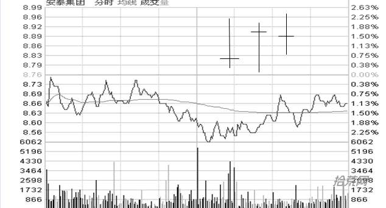

> [!TIP]
>
> “T”字形
>
> 也属于十字星的变形形态，表示开盘价和、最高价、收盘价相同，下影线表示下方有一定支撑，预示着后市向上反转。

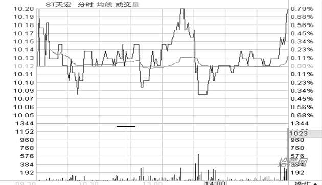

> [!TIP]
>
> 倒“T”字形
>
> 也属于十字星的变形形态，表示开盘价和收盘价相同，上影长表示上方有一定的压力。

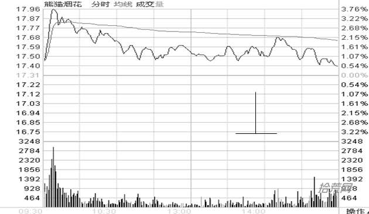

> [!TIP]
>
> 一字线
>
> 此种形态表示开盘价、最高价、最低价、收盘价在同一价位上，在此时段内，股价没有任变化。

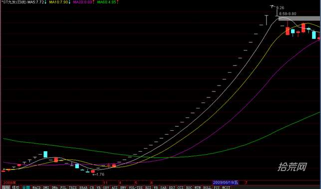

### 1.4 经典K线图

| **名称**                                 | **图形**                                                     | **特征**                                                     | **技术含义**                                                 | **备注**                                                     |
| ---------------------------------------- | ------------------------------------------------------------ | ------------------------------------------------------------ | ------------------------------------------------------------ | ------------------------------------------------------------ |
| **早晨十字星，又称 希望十字星**          | [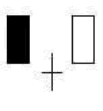](http://www.10huang.cn/zb_users/upload/2023/11/202311121699799661901573.png) | （1）出现在下跌途中 （2）由3根K线组成，第一根是阴线，第二根是十字线，第三根是阳线。第三根K线实体深入到第一根K线实体之内 | 见底信号，后市看涨                                           |                                                              |
| **早晨之星，又称 希望之星**              | [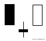](http://www.10huang.cn/zb_users/upload/2023/11/20231112202136_44898.jpg) | 和早晨十字星相似，区别在于早晨十字星的第二根K线是十字线，而早晨之星的第二根K线是小阴线或小阳线 | 见底信号，后市看涨                                           | 信号不如早晨十字星强                                         |
| **好友反攻**                             | [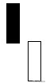](http://www.10huang.cn/zb_users/upload/2023/11/20231112202137_63767.jpg) | （1）出现在下跌行情中 （2）由一阴一阳2根K线组成 （3）先是一根大阴线，接着跳低开盘，结果收了一根中阳线或大阳线，并且收在前一根K线收盘价相同或相近的位置上 | 见底信号，后市看涨                                           | 转势信号不如曙光初现强                                       |
| **曙光初现**                             | [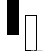](http://www.10huang.cn/zb_users/upload/2023/11/20231112202139_88630.jpg) | （1）出现在下跌趋势中 （2）由一阴一阳2根K线组成 （3）先是一根大阴线或中阴线，接着出现一根大阳线或中阳线。阳线的实体深入到阴线实体的二分之一以上处 | 见底信号，后市看涨                                           | 阳线实体深入阴线实体的部分越多，转势信号越强                 |
| **旭日东升**                             |  | （1）出现在下跌趋势中 （2）由一阴一阳2根K线组成 （3）先是一根大阴线或中阴线，接着出现一根高开的大阳线或中阳线，阳线的收盘价已高于前一根阴线的开盘价 | 见底信号，后市看涨                                           | （1）强于曙光初现 （2）阳线实体高现阴线实体部分越多，转势信号越强 |
| **倒锤头线**                             | [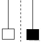](http://www.10huang.cn/zb_users/upload/2023/11/20231112202142_78741.jpg) | （1）出现在下跌途中 （2）阳线（亦可以是阴线）实体很小，上影线大于或等于实体的两倍 （3）一般无下影线，少数会略有一点下影线 | 见底信号，后市看涨                                           | 实体与上影线比例越悬殊，信号越有参考价值。如倒锤头与早晨之星同时出现，见底信号就更加可靠 |
| **锤头线**                               | [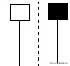](http://www.10huang.cn/zb_users/upload/2023/11/20231112202144_78190.jpg) | （1）出现在跌途中 （2）阳线（亦可以是阴线）实体很小，下影线大于或等于实体的两倍 （3）一般无上影线，少数会略有一点上影线 | 见底信号，后市看涨                                           | 锤头实体与下影线比例越悬殊，越有参考价值。如锤头与早晨之星同时出现，见底信号就更加可靠 |
| **平底，又称钳子底**                     | [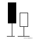](http://www.10huang.cn/zb_users/upload/2023/11/20231112202146_54777.jpg) | （1）在下跌趋势中出现 （2）由2根或2根以上的K线组成 （3）最低价处在同一水平位置上 | 见底信号，后市看涨                                           |                                                              |
| **塔形底**                               | [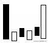](http://www.10huang.cn/zb_users/upload/2023/11/20231112202147_15870.jpg) | （1）出现在下跌趋势中 （2）先是一根大阴线或中阴线，后为一连串的小阴小阳线，最后出现一根大阳线或中阳线 | 见底信号，后市看涨                                           | 转势信号不如曙光初现强                                       |
| **圆底**                                 |  | （1）在跌势中出现 （2）股价形成一个圆弧底 （3）圆弧内的K线多为小阴小阳线，最后以向上跳空缺口来确认，圆底形态成立 | 见底信号，后市看涨                                           | 与技术图形的圆底有一定区别                                   |
| **旭日东升**                             | [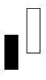](http://www.10huang.cn/zb_users/upload/2023/11/202311121699799693337015.png) | （1）出现在下跌趋势中（2）由2根阳线组成 （3）第一根阳线跳空低开，其收盘时在前一根K线下方留有一个缺口，后面一根阳线与第一根阳线并肓而立 | 见底信号，后市看涨                                           |                                                              |
| **低档五阳线**                           |  | （1）出现在下跌行情中 （2）连续拉出5根阳线，多为小阳线       | 见底信号，后市看涨                                           | 低档五阳线不一定都是5根阳线，有时也可能是6根、7根阳线        |
| **连续跳空三阴线**                       | [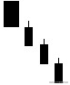](http://www.10huang.cn/zb_users/upload/2023/11/20231112202154_87658.jpg) | （1）出现在下跌趋势中 （2）连续出现3根向下跳空低开的阴线     | 见底信号，后市看涨                                           | 如在股价已有大幅下挫的情况下出现，见底可能性更大             |
| **红三兵**                               | [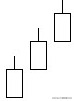](http://www.10huang.cn/zb_users/upload/2023/11/20231112202155_27094.jpg) | （1）出现在上涨行情初期 （2）由3根连续创新高的小阳线组成     | 见底信号，后市看涨                                           | 当3根小阳线收于最高或接近最高点时，称为3个白色武士，3个白色武士拉升股价的作用要强于普通的红三兵，投资者应引起足够重视 |
| **冉冉上升形**                           | [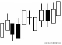](http://www.10huang.cn/zb_users/upload/2023/11/20231112202156_25977.jpg) | （1）在盘整后期出现 （2）由若干小K线组成（一般不少于8根），其中以小阳线居多，中间也可夹着小阴线、十字线 （3）整个K线排列呈略微向上倾斜状 | 见底信号，后市看涨                                           | 该K线组合犹如冉冉升起的旭日，升幅虽不大，但它往往是股价大涨的前兆，如成交量能同步放大，这种可能性就很大 |
| **徐缓上升形**                           | [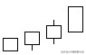](http://www.10huang.cn/zb_users/upload/2023/11/20231112202157_87372.jpg) | （1）多数出现在涨势初期 （2）先接连出现几个小阳线，然后才拉出中大阳线 | 见底信号，后市看涨                                           |                                                              |
| **稳步上涨形**                           |  | （1）出现在上涨行情中 （2）众多阳线中夹着较少的小阴线。整个K线排列呈向上倾斜状 | 见底信号，后市看涨                                           | 后面的阳线对插入的阴线覆盖的速度越快越有力，上升的潜力就越大 |
| **上升抵抗形**                           | [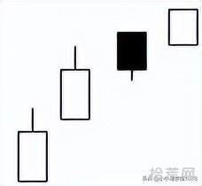](http://www.10huang.cn/zb_users/upload/2023/11/20231112202159_50328.jpg) | （1）在上涨途中出现 （2）由若干K线组成 （3）连续跳高开盘，即使中间收出阴线，但收盘价出要比前一根K线的收盘价高 | 见底信号，后市看涨                                           | 拾荒网打板专注短线技术技巧进阶。                             |
| **弧形线**                               | [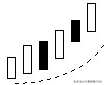](http://www.10huang.cn/zb_users/upload/2023/11/20231112202204_94656.jpg) | （1）在涨势初期出现 （2）由若干K线组成 （3）股价走势是一个向上的抛物线 | 见底信号，后市看涨                                           | 一旦弧形线为市场认可，上涨周期就很长                         |
| **下探上涨形**                           | [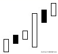](http://www.10huang.cn/zb_users/upload/2023/11/20231112202206_24469.jpg) | 在上涨途中，突然跳低开盘（甚至以跌停板开盘），当日以涨势收盘收出一根大阳线（甚至以涨停板收盘） | 见底信号，后市看涨                                           | 多数为控盘庄家利用消息洗盘，一般后市将有一段较大升势         |
| **上涨二颗星**                           | [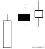](http://www.10huang.cn/zb_users/upload/2023/11/20231112202207_29705.jpg) | （1）在涨势初期、中期内出现 （2）由一大二小3根K线组成 （3）在上涨时先出现一根大阳线或中阳线，随后就在这根阳线的上方出现2根小K线（既可以是小十字线，也可以是实体很小的阳线、阴线） | 继续看涨                                                     | 少数情况下会在一根大阳线上方出现3根小K线，这时就称为上涨三颗星。上涨三颗星技术含义与上涨二颗星相同 |
| **跳空上扬形，又称升势鹤鸦缺口**         |  | （1）出现在涨势中 （2）由2根一阳一阴的K线组成 （3）先是拉出一根跳空上扬的阳线，留下一个缺口，第二天又出现一根低收的阴线，但它收在前一根阳线缺口上方附近 | 继续看涨                                                     |                                                              |
| **高位并排阳线，又称升势恋人肩并肩缺口** | [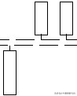](http://www.10huang.cn/zb_users/upload/2023/11/20231112202209_99665.jpg) | （1）出现在涨势中 （2）由2根阳线组成 （3）第一根阳线跳空向上，其收盘时在前一根K线上方留下一个缺口。第二根阳线与之并排，开盘价与第一根阳线的开盘价基本相同 | 继续看涨                                                     | 这个向上跳空的缺口对日后股价走势有较强支撑作用，但如发现日后股价跌破这个缺口，股价走势就会转弱 |
| **跳空下跌三颗星**                       | [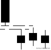](http://www.10huang.cn/zb_users/upload/2023/11/20231112202210_91929.jpg) | （1）出现在连续下跌途中 （2）由3根小阴线组成 （3）3根小阴线有一个明显的空白区域，也即通常说的缺口 | 见底信号                                                     | 如果在3根小阴线后出现一根大阳线，上涨的可能性就更大          |
| **上升三步曲**                           | [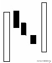](http://www.10huang.cn/zb_users/upload/2023/11/20231112202211_56774.jpg) | （1）出现在上涨途中 （2）由大小不等的5根K线组成 （3）先拉出一根大阳线或中阳线，接着连续出现3根小阴线，但都汉有跌破前面阳线的开盘价，随后出现了一根大阳线或中阳线，其走势有点类似英文字母"N" | 继续看涨                                                     |                                                              |
| **多方尖兵**                             | [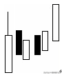](http://www.10huang.cn/zb_users/upload/2023/11/20231112202212_17916.jpg) | （1）出现在上涨行情中 （2）由若干根K线组成 （3）在拉出一根中阳线或大阳线时，留下一根较长的上影线，然后股价回落，但不久股价又涨至上影线的上方 | 继续看涨                                                     | 走势图上出现这种K线形态，实际上是多方主力发动全面进攻前的一次试盘 |
| **两红夹一黑**                           | [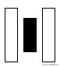](http://www.10huang.cn/zb_users/upload/2023/11/20231112202214_50415.jpg) | （1）既可出现在涨势中，也可出现在跌势中 （2）由2根较长的阳线和1根较短的阴线组成，阴线夹在阳线之中 | 看涨、见底                                                   | 在涨势中出现，继续看涨；在跌势中出现是见底信号               |
| **黄昏十字星**                           | [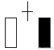](http://www.10huang.cn/zb_users/upload/2023/11/20231112202218_24869.jpg) | （1）出现在涨势中 （2）由3根K线组成，第一根为阳线，第二根为十字线，第三根为阴线。第三根K线实体深入到第一根K线之内 | 见顶信号，后市看跌                                           |                                                              |
| **黄昏之星**                             | [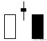](http://www.10huang.cn/zb_users/upload/2023/11/20231112202219_88230.jpg) | >和黄昏十字星相似，区别在于黄昏十字星第二根K线是十字线，而黄昏之星第二根K线是小阴线或小阳线 | 见顶信号，后市看跌                                           | 信号不如黄昏十字星强                                         |
| **淡友反攻**                             | [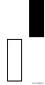](http://www.10huang.cn/zb_users/upload/2023/11/20231112202220_21840.jpg) | （1）出现在涨势中 （2）由一阳一阴2根K线组成 （3）先是出现一根大阳线，接着跳高开盘，结果拉出一根中阴线或长阴线，收在前一根K线收盘价相同或相近的位置上 | 见顶信号，后市看跌                                           | 转势信号不如乌云盖顶强                                       |
| **乌云盖顶**                             | [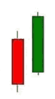](http://www.10huang.cn/zb_users/upload/2023/11/202311121699799751359289.png) | （1）出现在涨势中 （2）由一根中阳线或大阳线和一根中阴线或大阴线组成 （3）阴线已深入到阳线实体二分之一以下处 | 见顶信号，后市看跌                                           | 阴线深入阳线实体部分越多，转势信号越强                       |
| **倾盆大雨**                             | [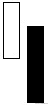](http://www.10huang.cn/zb_users/upload/2023/11/20231112202222_44369.jpg) | （1）出现在上涨趋势中 （2）由一阳一阴2根K线组成 （3）先是一根大阳线或中阳线，接着出现一根低开的大阴线或中阴线，阴线的收盘价已低于前一根阳线的开盘价 | 见顶信号，后市看跌                                           | 见顶信号强于乌云盖顶，阴线实体低于阳线实体部分越多，转势信号越强 |
| **射击之星，又称流星、扫帚星**           | [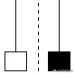](http://www.10huang.cn/zb_users/upload/2023/11/20231112202223_92080.jpg) | （1）出现在上涨趋势中 （2）阳线（亦可以是阴线）实体很小，上影线大于或等于实体的两倍 （3）一般无下影线，少数会略有一点下影线 | 见顶信号，后市看跌                                           | 实体与上影线比例越悬殊，信号越有参考价值。如射击之星与黄昏之星同时出现，见顶信号就更加可靠 |
| **吊颈线**                               | [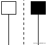](http://www.10huang.cn/zb_users/upload/2023/11/20231112202224_88018.jpg) | （1）出现在涨势中 （2）阳线（亦可以是阴线）实体很小，下影线大于或先等于实体的两倍 （3）一般无上影线，少数略有一点上影线 | 见顶信号，后市看跌                                           | 实体与下影线比例越悬殊，越有参考价值。如吊颈线与黄昏之星同时出现，见顶信号就更加可靠 |
| **平顶，又称钳子顶**                     | [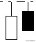](http://www.10huang.cn/zb_users/upload/2023/11/20231112202225_15019.jpg) | （1）在上涨趋势中出现 （2）由2根或2根以上的K线组成 （3）最高价处在同一水平位置上 | 见顶信号，后市看跌                                           |                                                              |
| **塔形顶**                               | [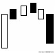](http://www.10huang.cn/zb_users/upload/2023/11/20231112202226_50770.jpg) | （1）出现在上涨趋势中 （2）先是一根大阳线或中阳线，后为一连串的小阳小阴线，最后出现一根大阴线或中阴线 | 见顶信号，后市看跌                                           | 这是来自拾荒网10Huang.CN， 专注短线技术技巧进阶。            |
| **圆顶**                                 | [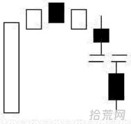](http://www.10huang.cn/zb_users/upload/2023/11/202311121699799762476696.png) | （1）在上涨趋势中出现 （2）股市形成一个圆弧顶 （3）圆弧内的K线多为小阳小阴线，最后以向下跳空缺口来确认，圆顶形态成立 | 见顶信号，后市看跌                                           | 与技术图形的圆顶有一定区别                                   |
| **双飞乌鸦**                             | [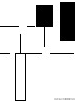](http://www.10huang.cn/zb_users/upload/2023/11/20231112202228_80666.jpg) | （1）出现在涨势中 （2）由2根一大一小阴线组成 （3）第一根阴线的收盘价高于前一根阳线的收盘价，且第二根阴线完全包容了第一根阴线 | 见顶信号，后市看跌                                           |                                                              |
| **三只乌鸦，又称暴跌三杰**               | [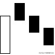](http://www.10huang.cn/zb_users/upload/2023/11/20231112202230_20449.jpg) | （1）出现在涨势中 （2）由3根阴线组成，阴线多为大阴线或中阴线 （3）每次均以跳高开盘，最后以下跌收盘 | 见顶信号，后市看跌                                           |                                                              |
| **高档五阴线**                           | [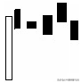](http://www.10huang.cn/zb_users/upload/2023/11/20231112202231_74513.jpg) | （1）出现在涨势中 （2）由5根阴线组成，但多为小阴线 （3）先是拉出一根较有力度的阳线，接着连续出现5根并排阴线 | 见顶信号，后市看跌                                           | 高档五阴线不一定都是5根阴线，有时也可能是6根、7根阴线        |
| **下降覆盖线**                           |  | （1）在上涨行情中出现 （2）由4根K线组成。前2根K线构成一个穿头破脚形态，第三根K线是一根中阳线或小阳线，但阳线的实体通常比前一根阴线要短，之后又出现一根中阴线或小阴线，阴线实体已深入到前一根阳线实体之中 | 见顶信号，后市看跌                                           | 见顶信号要强于穿头破脚                                       |
| **低档盘旋形**                           |  | （1）出现在下跌途中 （2）由若干根小阴小阳线组成 （3）先是小阴小阳线的横盘，后来出现一根跳空向下的阴线 | 卖出信号，后市看跌                                           |                                                              |
| **黑三兵**                               |  | （1）既可在涨势中出现，也可在跌势中出现 （2）由3根小阴线组成，最低价一根比一根低 | 卖出信号，后市看跌                                           |                                                              |
| **绵绵阴跌形**                           |  | （1）在盘整后期出现 （2）由若干根小K线组成（一般不少于8根），其中以小阴线居多，中间也可夹着一些小阳线、十字线 （3）整个K线排列呈略微向下倾斜状 | 卖出信号，后市看跌                                           | 每步跌幅虽不大，但犹如黄梅天的阴雨下个不停，从而延长了下跌的时间和拓展了下跌的空间，股价很可能就此长期走弱了。因此对绵绵阴跌走势的个股，应及早作出停损离场的决断 |
| **徐缓下跌形**                           |  | （1）多数出现在跌势初期 （2）先连接出现几根小阴线，然后拉出中大阴线 | 卖出信号，后市看跌                                           |                                                              |
| **下跌不止形**                           |  | （1）出现在下跌途中（2）众多阳线中夹着较少的小阳线。整个K线排列呈向下倾斜状 | 卖出信号，后市看跌                                           |                                                              |
| **下降抵抗形**                           |  | （1）出现在下跌途中 （2）由若干根阴线和阳线组成，但阴线大大多于阳线 （3）连续跳低开盘，即使中间收出阳线，但收盘价也要比前一根K线的收盘价低 | 卖出信号，后市看跌                                           |                                                              |
| **高开出逃形**                           |  | 突然跳高开盘（甚至以涨停板开盘），然后一路下跌，最后收出一根大阴线（甚至以跌停板收盘） | 卖出信号，后市看跌                                           | 多数为被套庄家利用朦胧消息拉高出货所致，一般后市将有一段较大跌势 |
| **下跌三颗星**                           |  | （1）在下跌行情初期、中期出现 （2）由一大三小4根K线组成 （3）在下跌时，先出现一根大阴线或中阴线，随后就在这根阴线的下方出现了3根小K线（既可以是小十字线，也可以是实体很小的阳线、阴线） | 卖出信号，后市看跌                                           | 下跌途中出现下跌三颗星，表明市场买卖意愿不强，市场将以盘跌为主 |
| **下降三部曲**                           |  | （1）出现在下降趋势中 （2）由5根大小不等的K线组成 （3）先出现一根大阴线或中阴线，接着出现3根向上爬升的小阳线，但这3根小阳线都没有冲破第一根阳线开盘价，最后一根大阴线或中阴线又一下子全部或大部分吞吃了前面3根小阳线。拾荒网http://www.10huang.cn，专注短线技术技巧进阶。 | 卖出信号，后市看跌                                           |                                                              |
| **空方尖兵**                             |  | （1）出现在下跌行情中 （2）由若干根K线组成 （3）在拉出一根中阴线或大阴线时，留下了一根较长的下影线，然后股价反弹，但不久股价又跌至下影线下方 | 卖出信号，后市看跌                                           | 走势图上出现这种K线形态，实际上是空方主力向多方进行全面扫荡前的一次试盘 |
| **倒三阳**                               |  | （1）出现在下跌初期 （2）由3根阳线组成 （3）每日都是低开高走，第一根K线以跌势收盘，后2根K线的收盘价低于或接近前一天的阳线开盘价，因此虽然连收3根阳线，但图形上却出现了近似连续3根阴线的跌势 | 卖出信号，后市看跌                                           | 此种情况多数发生在庄家股上，出现这种K线图下跌概率极大，投资者要趁早果断斩仓离场 |
| **连续跳空三阳线**                       |  | （1）出现在上涨行情中 （2）连续出现3根向上跳空高开的阳线     | 滞涨信号，后市看淡                                           |                                                              |
| **升势受阻**                             |  | （1）出现在涨势中 （2）由3根阳线组成 （3）3根阳线实体越来越小，最后一根阳线的上影线很长 | 滞涨信号，后市看淡                                           |                                                              |
| **升势停顿**                             |  | （1）出现在涨势中 （2）由3根阳线组成 （3）上升时先拉出2根大阳线或中阳线，第三根阳线实体很小，反映升势可能停顿 | 滞涨信号，后市看淡                                           |                                                              |
| **阳线跛脚形**                           |  | （1）出现在涨势中 （2）由3根以上（含3根）的阳线组成 （3）最后2根阳线都是低开，且最后一根阳线收盘价比前面阳线收盘价要低 | 滞涨信号，后市看淡                                           |                                                              |
| **两黑夹红**                             |  | （1）既可出现在涨势中，也可出现在跌势中 （2）由2根较长的阴线和一根较短的阳线组成，阳线夹在阴线之中 | 见顶、看跌                                                   | 在涨势中出现，是见顶信号；在跌势中出现，继续看跌             |
| **大阳线**                               |  | （1）可出现在任何情况下 （2）阳线实体较长，可略带上下影线    | 后市看涨                                                     | 在上涨刚开始时出现大阳线，后市看涨；在上涨途中出现大阳线，继续看涨；在连续加速上涨行情中出现大阳线，是见顶信号，在连续下跌的行情中出现大阳线，有见底回升的意义                           阳线实体越长，信号越可靠 |
| **大阴线**                               |  | （1）可出现在任何情况下 （2）阴线实体较长，可略带上、下影线  | 见顶信号，后市看跌                                           | 在涨势中出现大阴线，是见顶信号；在下跌刚开始时出现大阴线，后市看跌；在下跌途中出现大阴线，继续看跌；在连续加速下跌行情中出现大阴线，有空头陷阱之嫌疑 |
| **小阳线**                               |  | （1）在盘整行情中出现较多，也可在上涨和下跌行情中出现 （2）K线实体很小，可略带上、下影线 | 行情不明朗                                                   | 多空双方小心接触，但多方略占上风，单根小阳线研判意义不大，应结合其它K线形态一起研判 |
| **小阴线**                               |  | （1）在盘整行情中出现较多，也可在下跌和上涨行情中出现 （2）K线实体很小，可略带上、下影线 | 行情不明朗                                                   | 多空双方小心接触，但空方略占上风，单根小阴线研判意义不大，应结合其它K线形态一起研判 |
| **十字线**                               |  | （1）既可出现在涨势中，也可出现在跌势中 （2）开盘价，收盘价相同，成为"一"字，但上下影线较短 | 行情不明朗                                                   | 在上涨趋势末端出现，是见顶信号；在下跌趋势末端出现，是见底信号。在上涨途中出现，继续看涨；在下跌途中出现，继续看跌，信号可靠性不强。应结合其它K线一起研判 |
| **长十字线**                             |  | （1）既可出现在涨势中，也可出现在跌势中 （2）开盘价、收盘价相同，成为"一"字，但最高价与最低价拉得很开，因此上下影线都很长 | 在上涨趋势末端出现，是见顶信号；因下跌趋势末端出现，是见底信号。在上涨途中出现，继续看涨；在下跌途中出现，继续看跌 | 虽然长十字线的技术含义与一般的十字线的含义相同，但其信号可靠程度远比后者高。因此，投资者可将它作为"逃顶"与"抄底"的重要参考指标 |
| **螺旋桨**                               |  | （1）既可出现在涨势中，也可出现在跌势中 （2）开盘价、收盘价相近，K线实体（可阳可阴）很小，但最高价与最低价拉得很开，因此上下影线都很长 | 在涨势中出现，后市看跌；在下跌途中出现，继续看跌；在连续加速下跌行情中出现，有见底回升的意义 | 转势信号比长十字线更强                                       |
| **一字线**                               |  | （1）既可出现在涨势中，也可出现在跌势中 （2）开盘价、收盘价、最高价、最低价几乎相同成为"一"字 | 在上涨趋势趋势中出现，是买进信号；在下跌趋势中出现，是卖出信号 | 涨跌停板制度下，一字线有特别意义。涨势中出现一字线，表示股价封在涨停价上，说明多头气盛，日后该股往往会变成强势股；跌势中出现一字线，表示股价封杀在跌停价上，说吸空头力量极其强大，日后该股往往会变成弱势股 |
| **T字线**                                |  | 开盘价、收盘价、最高价粘连在一起，成为"一"字，但最低价与之有相当距离，因而在K线上留下一根下影线，构成"T"字状图形 | 在上涨趋势末端出现，为卖出信号；在下跌趋势末端出现，为买进信号，在上涨途中出现，继续看涨；因下跌途中出现，继续看跌 | T字线下影线越长，力度越大，信号越可靠                        |
| **倒T字线**                              |  | 开盘价、收盘价、最低价粘连在一起，成为"一"字，但最高价与之有相当距离，因而在K线上留下一根上影线，构成倒"T"字状图形 | 在上涨趋势末端出现，为卖出信号；在下跌趋势末端出现，为买进信号。在上涨途中出现，继续看涨；在下跌途中出现，继续看跌 | 倒T字线上影线越长，力度越大，信号越可靠。在上升趋势中出现的倒T字线，称为上档倒T字线，又称下跌转折线 |
| **搓揉线**                               |  | （1）多出现在涨势中 （2）由一正一反两根T字线组成             | 在上涨途中出现，继续看涨，在上涨末端出现，是见顶信号         | 在上涨途中出现的搓揉线以小T字线居多；在上涨末端出现的搓揉线以大T字居多 |
| **尽头线**                               |  | （1）既可出现在涨势中，也可出现在跌势中 （2）由2根一大一小K线组成 （3）出现在涨势中，第一根K线为大阳线或中阳线，并留有一根上影线，第二根K线为小十字线或小阳小阴线，依附在第一根K线的上影线之内 （4）出现在跌势中，第一根K线为大阴线或中阴线，并留有一根下影线，第二根K线为小十字线或小阳小阴线，依附在第一根K线的下影线之内 | 出现在涨势中，是见顶信号；出现在跌势中，是见底信号           | 尽头线的上影线或下影线的右方，带着的K线越小（如小十字星），则信号越强 |
| **穿头破脚**                             |  | （1）既可在上涨趋势中出现，也可在下跌趋势中出现 （2）由大小不等，阴阳相反的2根K线组成 （3）在上涨趋势中出现，前一根为阳线，后一根为阴线，后者将前者实体全部包容在内（不包括上下影线） （4）在下跌趋势中出现，前一根为阴线 | 在上涨趋势中出现，是卖出信号；在下跌趋势中出现，为买进信号   | 2根K线的长短越悬殊，或一根长的K线包容前面的K线越多，信号的参考价值就越大 |
| **身怀六甲**                             |  | （1）既可在上涨趋势中出现，也可在下跌趋势中出现 （2）由大小不等的2根K线组成，两根K线可一阴一阳，亦可同是两阳或两阴 （3）第一根K线实体能包容第二根K线实体 （4）第二根K线可以是小阴、小阳、十字线 | 在上涨趋势中出现，是卖出信号；在下跌趋势中出现，是买进信号   | 若第二组K线为十字线，俗称十字胎，在身怀六甲中，十字胎是力度最大的K线形态之一 |
| **镊子线**                               |  | （1）既可出现在涨势中，也可出现在跌势中 （2）由3根二大一小的K线组成 （3）3根K线的最高价几乎处在同一水平位置上（从图上看就像有人拿着镊子夹着一块小东西） | 在上涨时出现为头部信号；在下跌是时出现为底部信号             |                                                              |
| **上档盘旋形**                           |  | （1）出现在上涨途中 （2）由若干根或十几根K线组成 （3）在上涨是拉出一根较有力度的阳线后，就出现了阴阳交错、上下波动范围很小的横盘走势 | 上档盘旋时间在5－14天内，多数看涨，超过14天多数看跌          | 盘旋时间太久，说明多方上攻愿望不强，因而跌的可能性很大       |
| **加速度线**                             |  | （1）既可出现在涨势中，也可出现在跌势中 （2）上涨时出现加速度线，表现为开始缓慢爬升，后来攀升速度越来越快，接着连续拉出中阴线或大阴线 （3）下跌时出现加速度线，表现为开始缓慢下跌，后来下跌速度越来越快，接着连续拉出中阴线或大阴线 | 在上涨时出现为头部信号；在下跌时出现为底部信号               |                                                              |
| **下跌三连阴**                           |  | （1）出现在跌势中 （2）由3根阴线组成，阴线多为大阴线或中阴线 （3）每根阴线都以最低价或次低价报收，最后一根往往是大阴线 | 在下跌初期出现，继续看跌。在下跌后期出现，是见底信号         | 在连续阴跌不止情况下，特别是在股价已有较大跌幅后出现三连阴，表明已经用尽筹码，是见底信号 |

