# MACD

### 1.1 MACD介绍

>[!TIP]
>
>**MACD指标**，又称为指数平滑异同平均线，也称指数离差指标，是移动平均线原理的进一步发展，它利用快速移动平均线(EMA12)与慢速移动平均线(EMA26)聚合与分离的征兆，加上双重平滑运算来判断买进与卖出的时机。
>
>- DIF线(快线)由下往上穿越DEA线(慢线)，这种形态叫**MACD金叉** 。金叉会出现在零轴之上，也会出现在零轴之下。
>- **在零轴下出现，表示股价止跌回涨，可短线买入;而金叉在零轴上出现时，则表明股价即将开始有较大幅度的反弹，适合长线投资。**
>- 类似的，当DIF线由上往下穿越DEA线，形成**MACD死叉** 。
>- **如果死叉在零轴之上出现，意味着股价短期内下跌调整开始，投资者应减仓;若死叉出现在零轴下，则表示股价已经见顶，后市很可能开始大幅下行，投资者应立即清仓。**

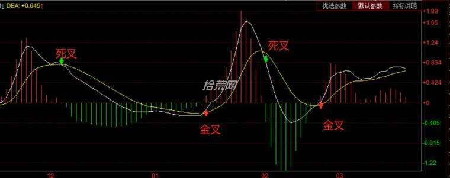

### 1.2 背离现象

- 它由慢线DEA，快线DIF，MACD红绿能量柱线，零轴线(多空分界线)五部分组成。 参数一般默认(12、26、9)，数值可以依据经验和个人习惯进行调整。

> [!TIP]
>
> - 顶背离: 即股价创阶段新高，但MACD红柱线不创阶段新高，这叫MACD顶背离。
>
> - 顶背离现象一般是股价在高位即将反转转势的信号，表明股价短期内即将下跌，是卖出股票的信号。

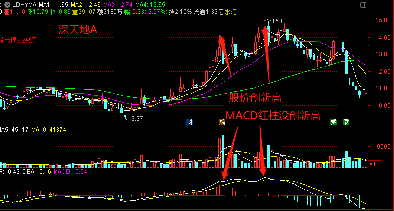

> [!TIP]
>
> 当股价K线图上的股票走势，股价还在下跌，而MACD指标图形上的由绿柱构成的图形的走势是一底比一底高，即当股价创阶段新低，而MACD指标的绿柱不创阶段新低，这叫底背离现象。
>
> 底背离现象一般是预示股价在低位可能反转向上的信号，表明股价短期内可能反弹向上，是短期买入股票的信号。

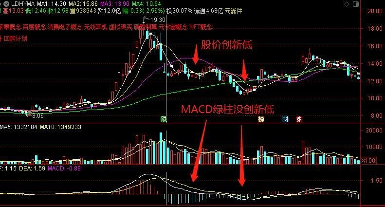

> [!WARNING]
>
> 注意： 
>
> 1，各种技术指标有效性并不相同，进行技术指标分析时，相对而言，用MACD、KDJ还有RSI以及配合量价背离、支撑压力位、均线等综合观察来研判行情的转向成功率较高，尽量多技术配合使用。
>
> 2，MACD底背离也分为柱线体底背离和DIF线底背离，以上讲的底背离主要看柱线体，但是如果当MACD的柱线体底背离与DIF线底背离同时发生时，股价后续走高的可能性更大。
>
> 3，指标背离一般出现在强势中比较可靠，就是股价在高位时，通常只需出现一次顶背离的形态，即可确认反转形态;而股价在低位时，一般要反复出现几次底背离才可确认反转形态。底背离的次数越多，后续走高的可能性越大。

### 1.3 八种形态

>  MACD形态一佛手向上
>
> 从图中可以看出，DIF与DEA金叉后，随着股价上升而上行，而后，随股价的回调而下行，当主力洗盘时，股价回调，而DIF线回调到MACD线附近时，DIF线反转向上，便形成了佛手向上形态。

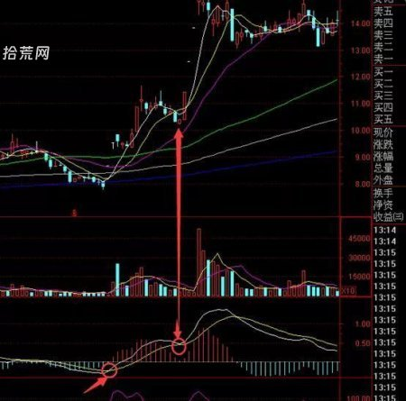

>  MACD形态二小鸭出水
>
> DIF在0轴以下金叉DEA线以后，并没有上穿0轴或上穿0轴一点就回到0轴之下，然后向下死叉DEA，几天后再次金叉DEA线，该形态为骨架在下跌探底之后，抛盘穷尽之时呈现的底部形态，应理解为反弹见底信号，可择机入市

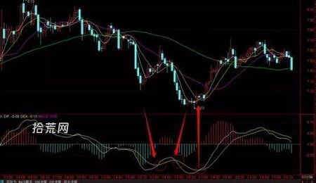

>  MACD形态三漫步青云
>
> 漫步青云指的是DIF线在0轴以上死叉DEA线，然后下穿0轴，然后在0轴以上金叉DEA线。该形态形成是股价在探底回升途中做的盘整，也有的是筑底形态，呈上攻之势，应理解为积极介入信号，果断入

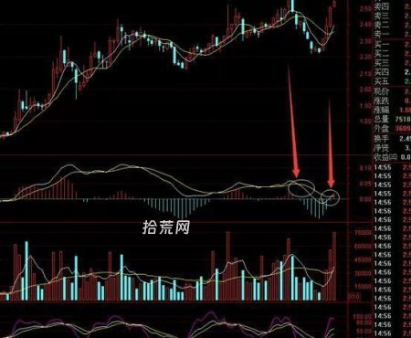

>  MACD形态四天鹅展翅
>
> 天鹅展翅指的是DIF线在0轴一下金叉DEA线，随后没有上穿0轴就回调，向DEA靠拢，MACD红柱缩短，但没有死叉DEA就在此反转向上，同事配合MACD红柱加长，使形态展开天鹅展翅形态，该形态的形成多位底部形态，是股价在下跌探底之后，抛盘穷尽呈现的底部形态，应理解为主力建仓区域，择机介入。

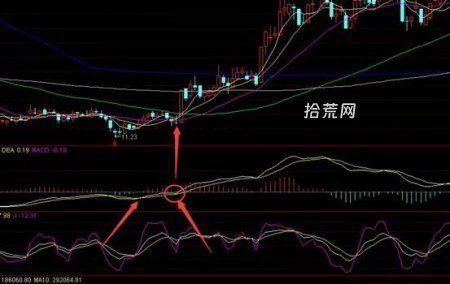

>  MACD形态五空中缆绳
>
> 空中缆绳指的是MACD指标中的DIF之前在0轴之下金叉DEA线，其中在0轴之上运行一段时间然后随股价回调，DIF也开始向下回调，当DIF到DEA线的时候，两条线粘合成一条线，当他们再次分离多头散发的时候，形成买入时机，新的涨势开始。改性态的出现多位上档盘整和主力洗盘所为。股价在上升途中作为短暂的盘整后，呈现强势上攻形态，应理解为积极介入信号。果断买入。

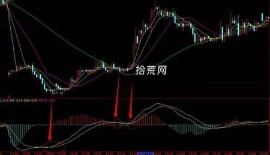

> MACD形态六空中缆车
>
> 空中缆车主要指DIF线在0轴之上死叉DEA线，但不能下穿0轴，过几天再次在0轴之上金叉DEA。该形态的出现多为上档盘整，主力洗盘所为，股价做短暂的调整后，呈现强劲上升动力，可理解为积极介入信号，可果断买入，如果持续放量可坚决看多

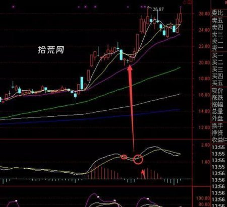

>  MACD形态七蛟龙出水
>
> 蛟龙出水指的是MACD在0轴一下运行很长一段时间(一个月以上)，DIF线金叉DEA线以后(再0轴以下)两条线不是强劲的上升，而是与DEA线粘合成一条直线，数值几乎相等，好像一条蛟龙。一点两条线开始多头散发，即可买入。0轴以下的蛟龙出水形态的形成，多为股价在下跌探底之后，抛盘穷尽时呈现的底部形态，这时主力介入，进入压箱顶吸货所致，应理解为择机入市。

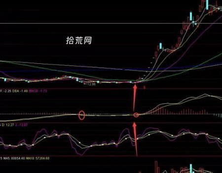

> MACD形态八海底捞月
>
> 海底捞月DIF在0轴以下下穿DEA线形成一次金叉运行一段时间后，再次产生的二次金叉，表明该股打底完成，开始走出底部，可择机介入。

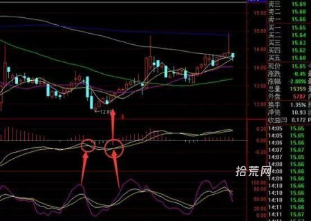