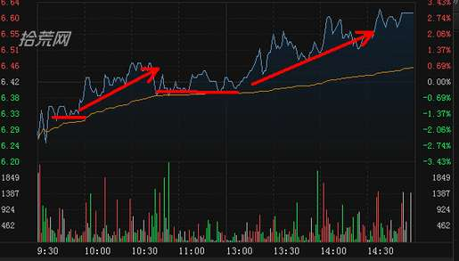
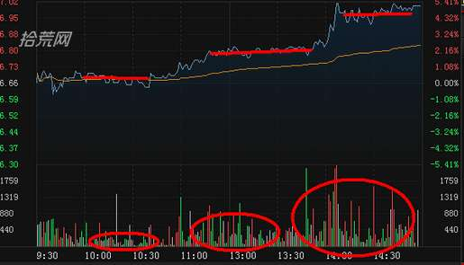
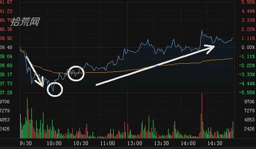
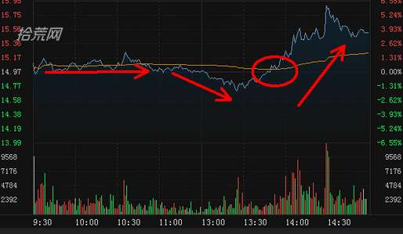
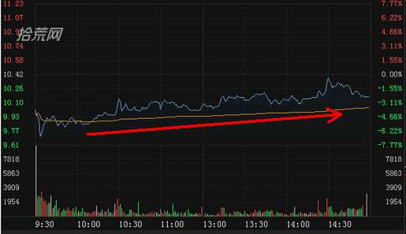
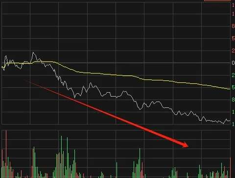
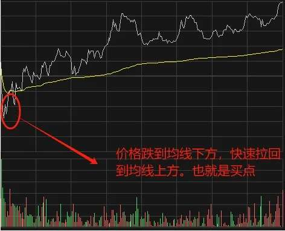
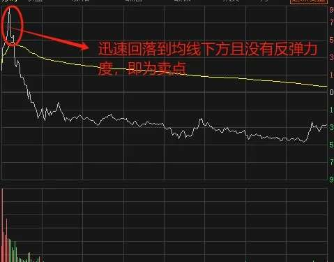
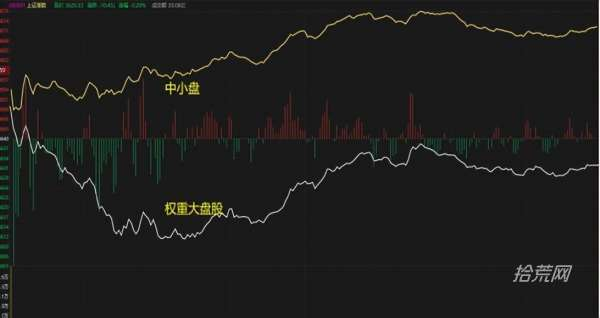
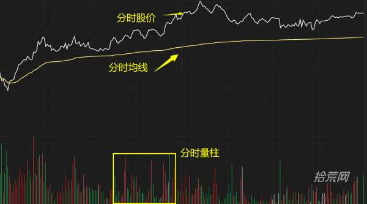

# 如何把握分时图中的买卖点？

## 1.1 买卖原则

> [!DANGER]
> - 1、早盘寻找高抛的机会，尾盘2:30寻找低吸的机会；
> - 2、脉冲式快速上拉是高抛机会，恐慌性跳水时低吸机会；
> - 3、MACD红大波的最高红柱是高抛机会，绿大波的最高绿柱是低吸机会；
> - 4、跌破均价线即黄线回探是卖出机会，升过均价线即黄线回踩是买入机会五、没买好，买后再次发现还有下跌空间，果断止损认错。

## 1.2 买点判别技巧

> **1、非正常低开**

- 正常情况，个股的开盘价应该是随着大盘的开盘指数定位。比大盘指数开低的要多很多，无非有两种可能：
- 是股价原来就处在日K线形态的跌势中，惯性低开低走，这个不在入货考虑之内。
- 是股价上升行情未尽，庄家有意低开，先回避昨天获利盘回吐锋芒，这样即使碰上大盘开盘后下跌，也能逆势而上。

> **2、开盘后走低，反弹越过开盘价位**

- 个股全天走势的强弱，在早盘就能显出预兆。
- 其一，在多空较量的第一个回合，大盘如果先下后上，而个股随大盘，但能反弹越过开盘价位，表明该股有上攻能力。
- 其二，如果庄家想派发，开盘后会直接冲高，不能开盘后低走，要有回调之心，反弹一般不会很快超过开盘价位。
- 最后，反弹越过开盘价位的一刻，是进货之时，开盘后落在低点的股价虽然便宜，但那时不敢断定该股能当日能否走强。(开盘价必须涨幅1%以下，以1%到-2%为好)

> **3、高开高走回调不破均价线**

- (1)集合竞价时间中，股价以高于上一个交易日的收盘价开盘，至于高开的幅度嘛，可大可少。
- (2)开盘过后，股价一直在均价线上方，虽然盘中出现回调，但是没有击穿当日的均价线，说明主力拉升明显，往上攻击的欲望很强。操作上，投资者可以在回调并不破黄色均价线的时候，选择在低点买进。如果在市场相对底部并伴随着成交量放大，可坚定介入。

## 1.3 几种形态

> 均价线支撑做多
>
> 当股价在均价线以上运行时，每次回调都受到均价线的支撑，使均价线不断上移，分时上涨量能较大，分时回调量能明显缩小，说明市场做多意愿充足。

> 平台上移做多
>
> 当股价横盘平台区间不断向上移动，分时的量能持续放大，说明市场做多意愿强烈。

> 向下勾头
>
> 当股价迅速下跌时，分时量能逐渐缩小，形成向下的脉冲，反弹时量能有效放大，同时股价向上冲破均价线，说明市场做多意愿强烈。
>
> 如下面的分时图和K线走势，股价平开后在迅速下跌，跌破均价线，随后出现回抽形成一个向下的脉冲，量能在下跌过程中明显缩小反弹时量能放大。同时K线在智能辅助线附近运行，捕捞季节翻红进入强势区域，随后股价出现小幅调整，下跌阶段量能明显缩小，调整3天后出现超过40%的涨幅。

> 股价向上突破均价线做多
>
> 当个股运行到相对低位时，股价出现迅速上涨并突破均价线，上涨分时量能出现明显放大，说明市场做多意愿强烈。

> 低位震荡做多
>
> 当个股运行到相对低位时，股价在低位进行横盘震荡，同时股价位于均价线上方，分时量能比较平静，全天量能出现明显缩小，说明市场出现反转的可能加大。

> 震荡走弱
>
> 以看到，黄线就是我们所说的均线，这个股价一直在均线下方，那么这种情况就是属于震荡走弱的形态。我们这个时候要小心了，这说明了走势变弱了，股价会持续下探，直到站稳。

> 由弱变强
>
> 这个情况可以确定一只个股当天的买点，也就是由弱变强的转折点，这种形态是最好的介入关键节点。一只股由弱变强，那么后续很大概率会继续拉升。

> 由强变弱
>
> 这个情况可以确定一只个股当天的卖点，也是由强变弱的转折点，这种形态是最好的离场时机。一只股由强变弱，后续大概率会进行调整。

## 1.4 分时图的强弱比较

> - 当日股价开盘上涨，且一直高于开盘价并在均线上方运行且一直保持距离的强，回调不碰分时最近支撑的强，不低于当日开盘价的强，回调碰触均线的弱了一些，碰触开盘价的再弱，由上涨到下跌的再弱。
> - 当日开盘下跌就是弱，可如果股价不断拉升，超过均线则强一些，涨幅为正再强一些，不断上涨突破当日新高再强，配合成交量，拉升过程不断放量更强。

## 1.5 大盘分时图

> 分时走势图也叫即时走势图，它是把股票市场的交易信息实时地用曲线 ，在坐标图。上加以显示的技术图形。坐标的横轴是开市的时间，纵轴的上半部分是股价或指数，下半部分显示的是成交量。

- 白色曲线:表示大盘加权指数，即证交所每日公布媒体常说的大盘实际指数。更能体现权重走势
- 黄色曲线:大盘不含加权的指标，即不考虑股票盘子的大小，有股票对指数影响看作相同而计算出来的大盘指数。更能体现小盘股走势

> [!WARNING]
>
> - A)当大盘指数上涨时，黄线在白线之上，表示流通盘较小的股票涨幅较大;反之，黄线在白线之下，说明盘小的股票涨幅落后大盘股。
> - B)当大盘指数下跌时，黄线在白线之上，表示流通盘较小的股票跌幅小于盘大的股票;反之，盘小的股票跌幅大于盘大的股票

## 1.6 个股分时图

> [!TIP]
>
> a:白色曲线：该股票即时实时成交价格
>
> b:黄色曲线：该股票即时成交的平均价格，即当天成交金额除以成交总股数!
>
> c:红绿柱线：分时成交量柱，表现每一分钟的成交量，单位是手!
>
> 红柱线的增长减短表示上涨买盘力量的增减;绿柱线的增长缩短表示下跌卖盘力度的强弱。
>
> 重点关注9: 30-10: 00和13.00-13: 30两个时间段
>
> 意义：开盘前半小时是情绪集中爆发点，前半小时强势早盘容易持续走强，弱势早盘容易持续走弱!午盘开盘前半小时经过中午休息，思维冷静操作理性，容易变盘。实际中时间也有些变化!