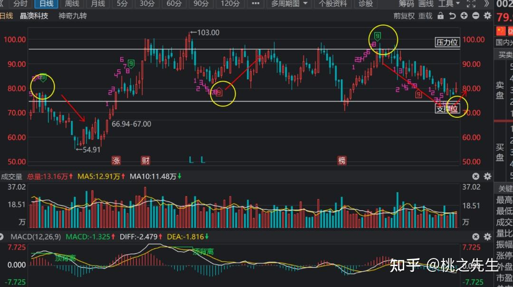
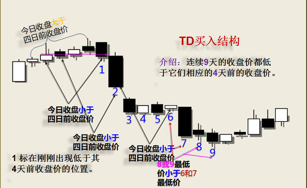
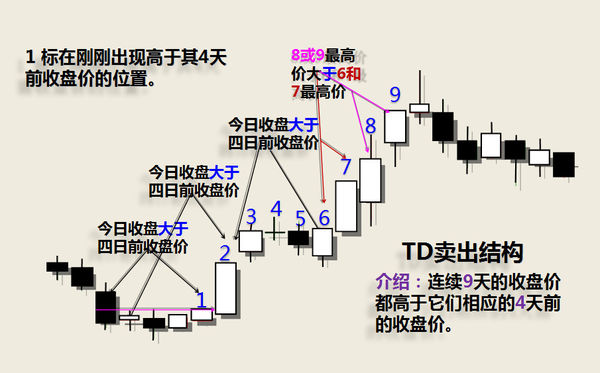

# 序列九转

## 1.1 序列九转
> [!WARNING]
>
> - 定义：九转序列是根据TD马克序列的思想产生的趋势叠加反弹指标，因徐小明的交易师而成为股海中的“网红”。
>
> - 连续出现的9根K线，每根K线的收盘价均**比各自前面的第4根K线的收盘价高（上涨九转）**或者**比各自前面的第4根K线收盘价低（下跌九转），九转成立。**
> - **如下图为九转形式：通过九转指标对个股/ETF进行波段炒作，每一次几乎都能精准的逃离顶部并且捕获底部的建仓机会**

## 1.2 实现图解

> 下九转

> 上九转

> [!TIP]
>
> 1、操作**上涨序列**，从**高“5”逢低吸纳**（中阴线低吸最佳），到**高“8”或高“9”择机高抛**，持股约四五个序列周期。
>
> 2、操作**下跌序列**，从下跌序列低“8”或低“9”或再延迟一天抄底超跌股为佳，也就是说**抄底的时间为低“9”前后3个交易周期。**
>
> 3、巧用大小周期九转共振，即大周期九转和小周期九转达到协调统一时，更准。
>
> 4、九转序列最好与MACD背离技术结合使用，准确率会更高。

## 1.3 应用

> [!WARNING]
>
> - 一般出6后就会有50%概率会出9，出到6就要时刻留意了。
> - 一般到高9意味着可能出现下跌，低9意味着转折上涨，但九转绝对不能单独使用。他只决定了有转折，要配合其他指标来看（多结合macd底部背离来看，后面会单独讲到macd底部背离如何看）。
> - 低9出现小阴线（<1%）会比较好，收大阴线跌速太大，收阳线低9九转效果不好。如下图效果就不太好，没有阴线，出7还是个阳线

## 1.4 九转级别的K线

> [!WARNING]
>
> - 九转看大级别，60分钟以上，一般日线,120分钟线,90分钟线
>
> - 神奇九转在日线图上，有着提示短期买卖点的作用，通常作用周期在至少一周左右的时间。
>
> - 比如日线级别的上涨途中，出现九转高9，则意味着有至少1周左右的调整周期。比如日线级别的下跌途中，出现九转低9，则意味着有至少1周左右的反弹周期。
>
>   **上升趋势中，低9的成功率较高。**
>
>   上升趋势中的低9成功较高，但高9成功率低不建议使用。
>
>   **震荡趋势中，高9和低9成功率相近。**
>
>   震荡趋势中，九转高9与低9均具备参考价值
>
>   **下跌趋势中，高9成功率较高。**
>
>   下跌趋势中九转高9成功率较大。但低9成功率较低，不建议使用。