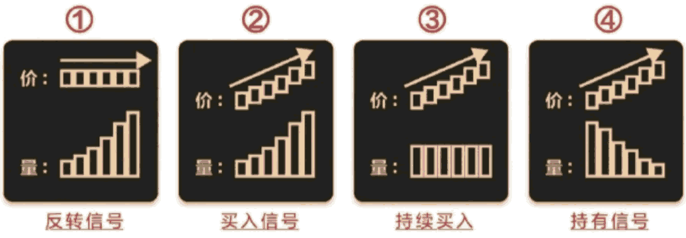
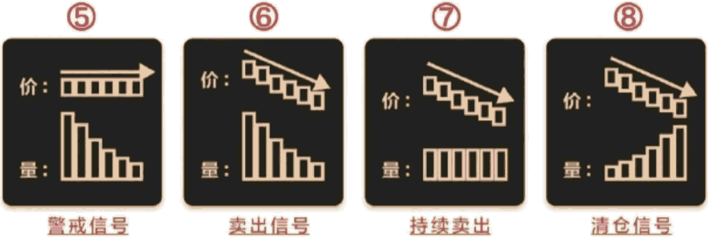

# 认识成交量

> [!WARNING]
>
> 股谚云：“股市上什么都能骗人，唯有成交量不能骗人 ”可以说，成交量的大小，直接表明了市场上多空双方对市场某一时刻的技术形态最终的认同程度。那么，如何根据成交量判断买卖点?

## 1.1 原理

> 在技术分析中，研究量与价的关系占据了极重要的地位。成交量是推动股价上的原动力，市场的有效变动必须要有成交量的配合，它的大小反映该种股票受投资者关注的程度。

- 量见底后，若又暴出巨量，此时要特别小心当日行情，一般情况下，量的暴增不是好事，除非第二天量缩价涨，否则是反弹而已。
- 任何进出，均以大盘为观察点，大盘不好时不要做，更不要被逆市上涨股迷惑。
- 在多数情况下，当量缩后价不再跌，一旦量逐步放大，这是好事。
- 在下跌过程中，若成交量不断萎缩，在某天量缩到“不可思意”的程度，而股价跌势又趋缓时，就是买入的时机。
- 成交量萎缩后，新底点连续2天不再出现时，量的打底已可确认，可考虑介入。

> 1、小单：成交量在1万股及以下，或成交金额在5万元以下的成交单。
>
> 2、中单：成交量在1万股到6万股之间，或成交金额在5万元到30万元之间的成交单。
>
> 3、大单：成交量在6万股到20万股之间，或成交金额在30万元到100万元之间，或成交量占流通盘0.1%的成交单。
>
> 4、特大单：成交量在20万股及以上，或成交金额在100万元及以上的成交单。
>
> **很显然，特大单就是主力行为，而且是大主力行为!跟随特大单就是跟随大主力。**

>[!TIP]
>
>上市时间大于90天，非ST，流通市值小于120亿，股价小于50元，一年内涨停次数大于等于1，昨日的5日均线、10日均线、20日均线多头排列，今日竞价未涨停，今日涨幅大于5%，特大单净额大于1000万元，特大单净比大于5，主力净量大于0.1

## 1.2 量价关系

> [!WARNING]
>
> - **量**，一般指大盘指数或单只股票在单位时间内的成交量，包括分钟成交量、日成交量、月成交量、年成交量等等。在观察指数时，成交量一般是指单位时间内的总成交金额;在观察个股时，成交量既可以是成交股数，也可以指成交金额。
>
> - **价**，指的是大盘指数或个股在单位时间内的价格，主要是指收盘价，也包括开盘价、最高价、最低价等。

