- 最近ChatGPT爆火，作为我们程序员我们当然也想要上手来使用一番，下面账号注册，手机认证，服务器上API使用等方便来说明
- ChatGPTAPI：[https://platform.openai.com/docs/models/overview](https://platform.openai.com/docs/models/overview)
- 聊天：[https://chat.openai.com/chat](https://chat.openai.com/chat)

# 一 准备工作
## 1.1 网络环境准备工作
代理流量： [SakuraC3`at](https://sakuracat-link.com/#/register?code=ZjWXKfTK)

- 注册账号

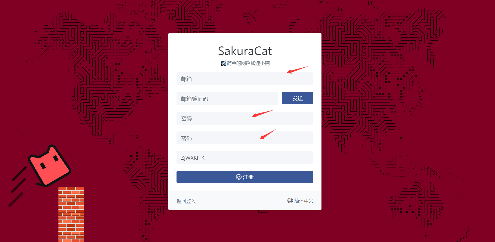

- 购买流量包

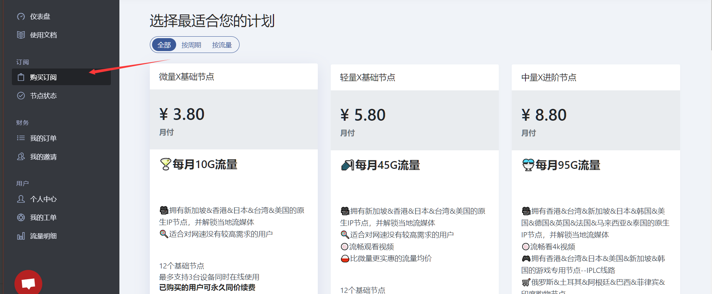
个人建议购买这个套餐（看自己的需求）
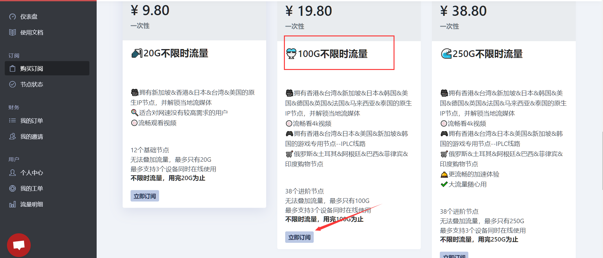

- 工具

百度网盘：[https://pan.baidu.com/s/1cTK6_uYj2VwAftkWdcEb8w?pwd=sacc](https://pan.baidu.com/s/1cTK6_uYj2VwAftkWdcEb8w?pwd=sacc)
Gitub：[https://github.com/Fndroid/clash_for_windows_pkg](https://github.com/Fndroid/clash_for_windows_pkg)
下载安装完毕之后，我们打开购买的流量包页面
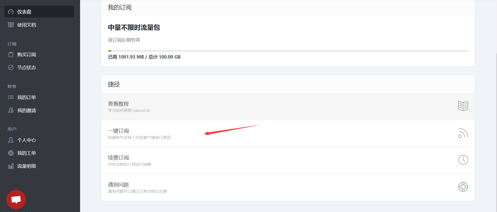
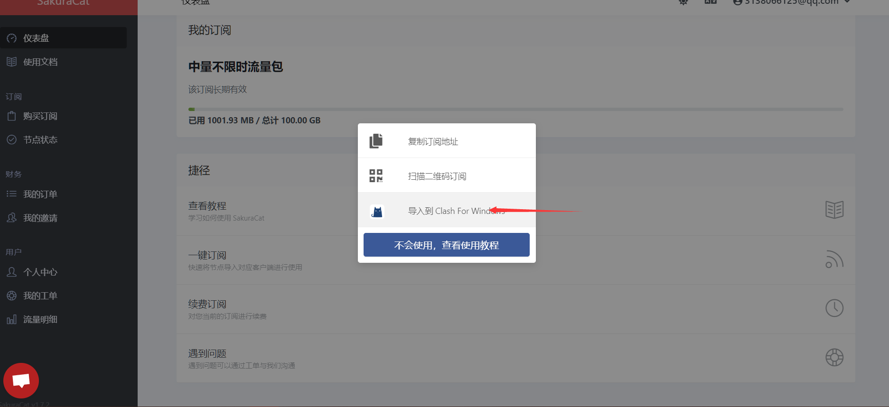
导入到Clash中，点击下载
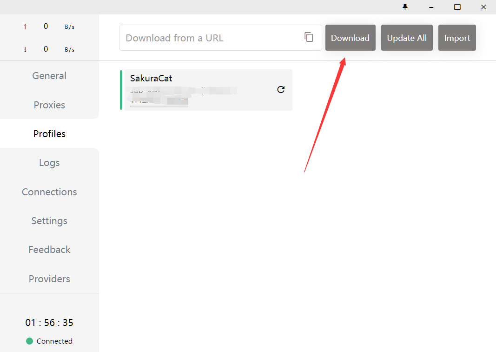
选择代理节点，看网络延迟，看自己的选择
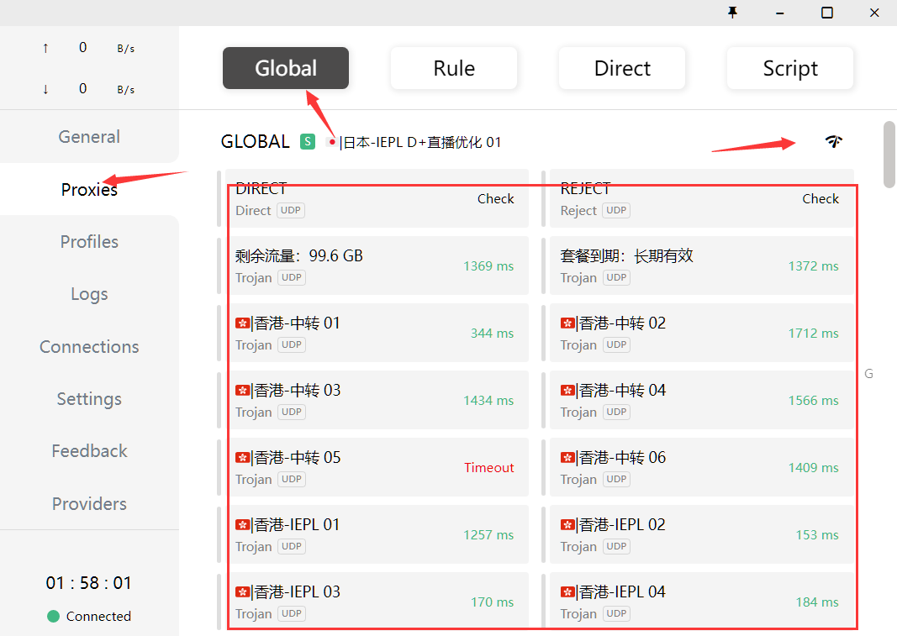
开启代理，访问服务，注意关闭时请不要直接关闭，先关闭代理，再关程序
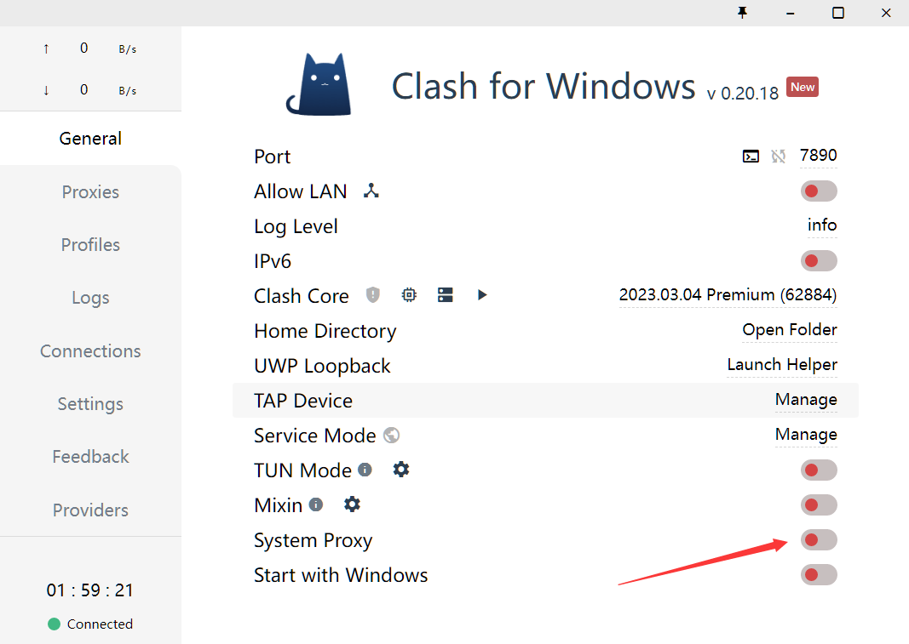

- 测试一下

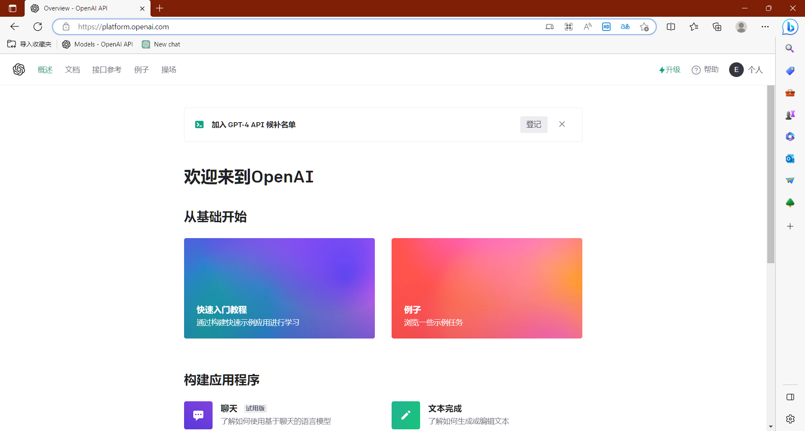
好的我们的网络环境，就搭建再这，下面我们来看看账号的注册的准备工作

## 1.2 账号注册准备工作
账号注册是需要国外手机的验证，因此我们需要一个需要虚拟账号
网站：[Get a virtual phone number. Temporary number. SMS service activation](https://sms-activate.org/getNumber)
点击注册，充值2美元，比较坑的是支付宝最低2美元
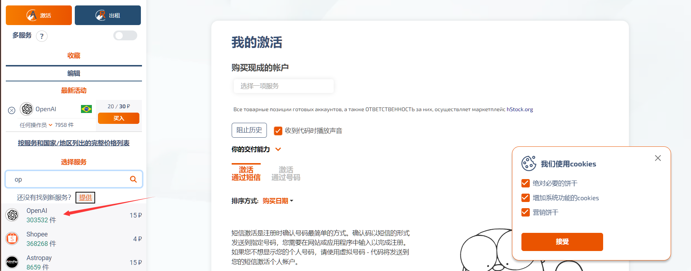

## 1.3 程序开发准备工作
前提：如果你只是向玩玩ChatGPT可以省掉这一步
关于ChatGPT的api调用，国内可能无法调用，一种方式代理，一种方式外国服务器
我就选择的是外国服务器，我就是来玩玩他们的API文档，这里推荐阿里云的服务器
这里我也参考网络上的其他配置，就是太麻烦了，甲骨文，微软等等，果断放弃了
地址：[轻量应用服务器_web服务器_个人建站_弹性计算-阿里云](https://www.aliyun.com/product/swas?spm=5176.19720258.J_3207526240.34.d1fa76f49USCWZ)
看自己的需求吧
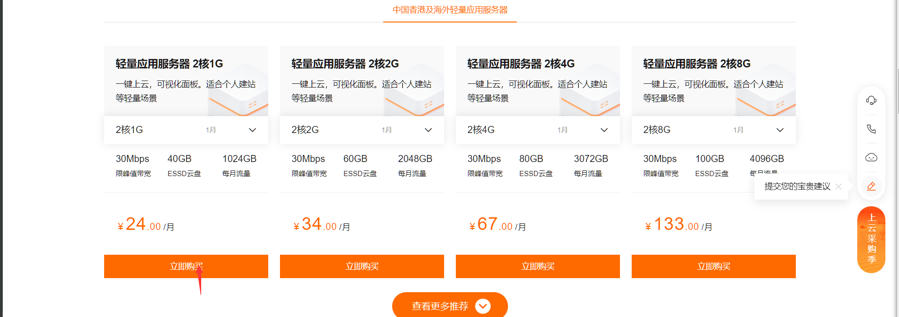
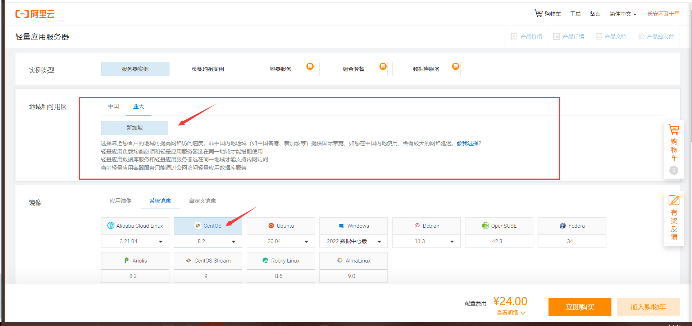
付钱，配置一下，SSH工具可以连接就行了，到这我们的准备工作就完了，下面开始注册，当然这种也有缺点，无法工具中调试

# 二 注册账号

- 第一步代理服务开启

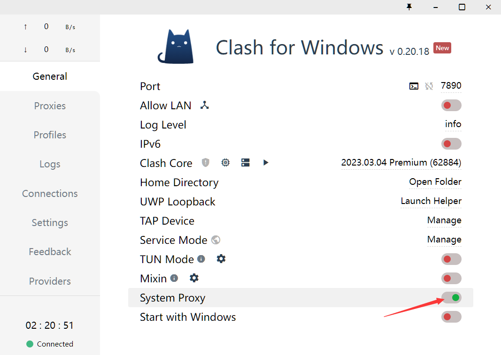

- 进入网站进行注册

地址：[https://chat.openai.com/auth/login](https://chat.openai.com/auth/login)

这里我们选择微软账号注册，没有微软装好可以先注册一个
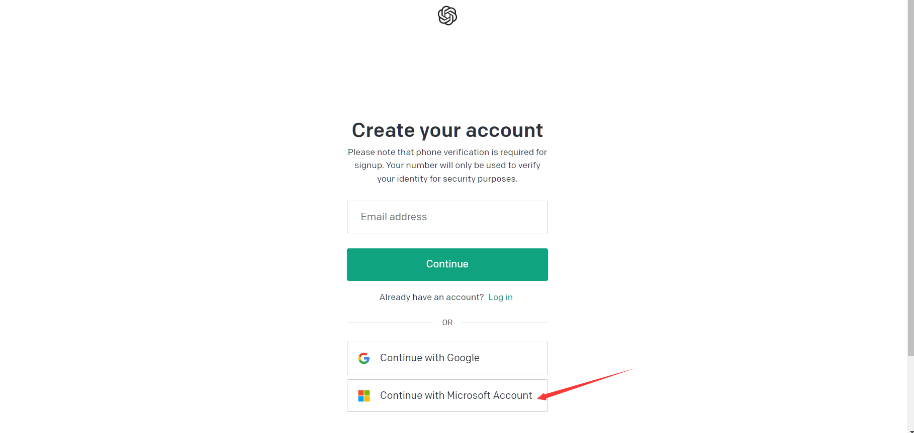
需要账号与密码，进行登录，登录成功之后，来到手机号验证界面

谁便填写，关键是手机号验证

这个是时候，来到我们前面装备的工作的虚拟手机号注册，购买手机号
输入openAI
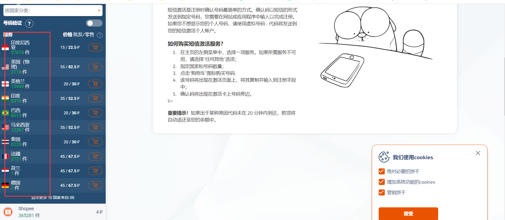
请记住国旗，我这里选择的巴西，看球的都熟悉这个国旗，加入购物车
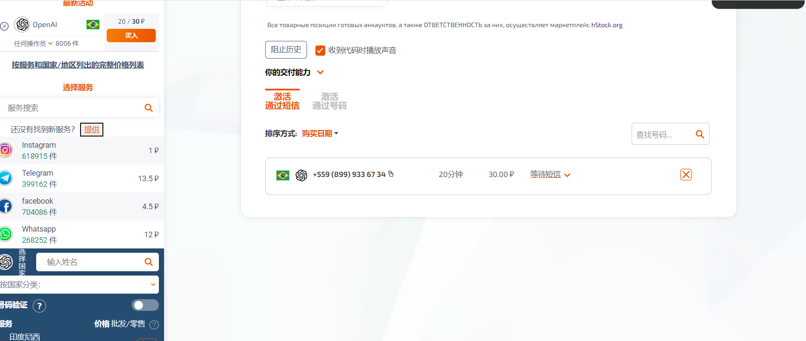
点击复制手机号，来到验证界面，进行手机号验证

进行验证，等待验证码，粘贴完成认证
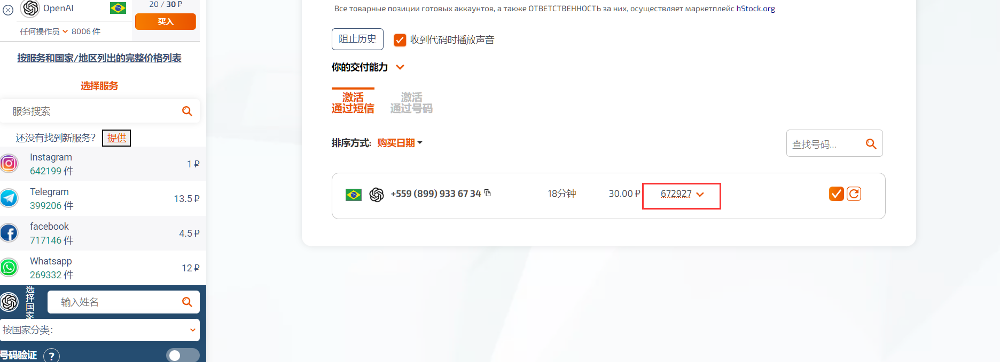
注册成功，来到聊天页面，我们就可以聊天了
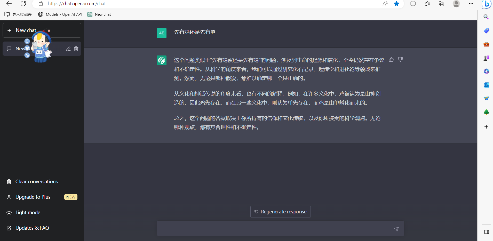

# 三 程序开发
API文档：[https://platform.openai.com/docs/models/overview](https://platform.openai.com/docs/models/overview)
注意他的调用不会是免费的，有5美元的免费额度，自己玩的话够用了
![image.png](https://cdn.nlark.com/yuque/0/2023/png/12426173/1679823415954-865d028f-fb99-4040-9bec-103b3dee254d.png#
API KEY 调用时验证身份
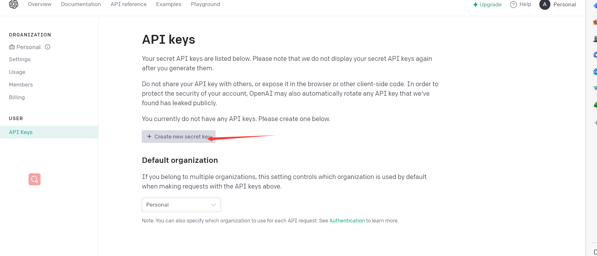
服务器上测试是否能够调用

```java
curl https://api.openai.com/v1/models \
  -H "Authorization: Bearer $OPENAI_API_KEY" \
  -H "OpenAI-Organization: org-gMZJtnznaLIomJ2vTWYWFSLo"

```
调用成功，之后就可以集成在自己的程序中，具体的使用参考API文档
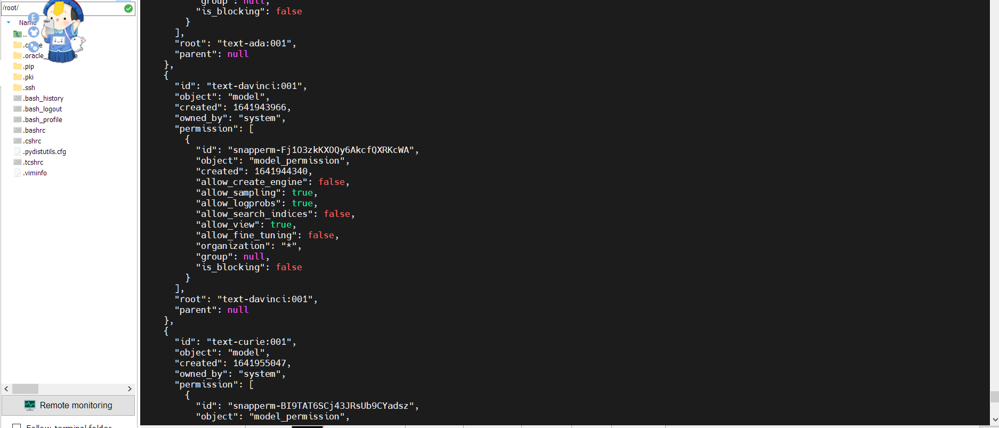
