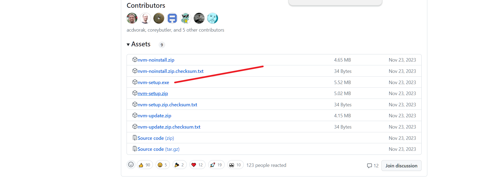
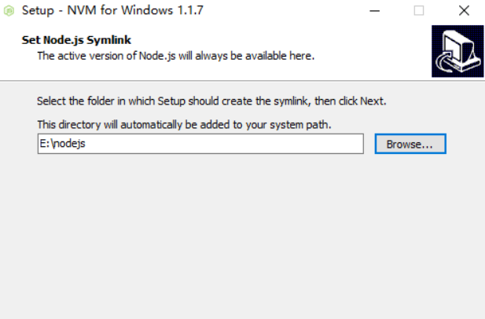
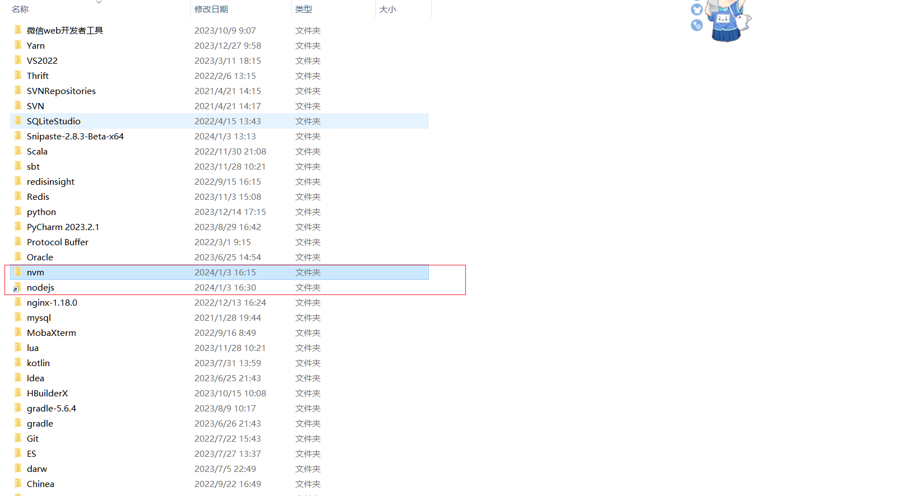
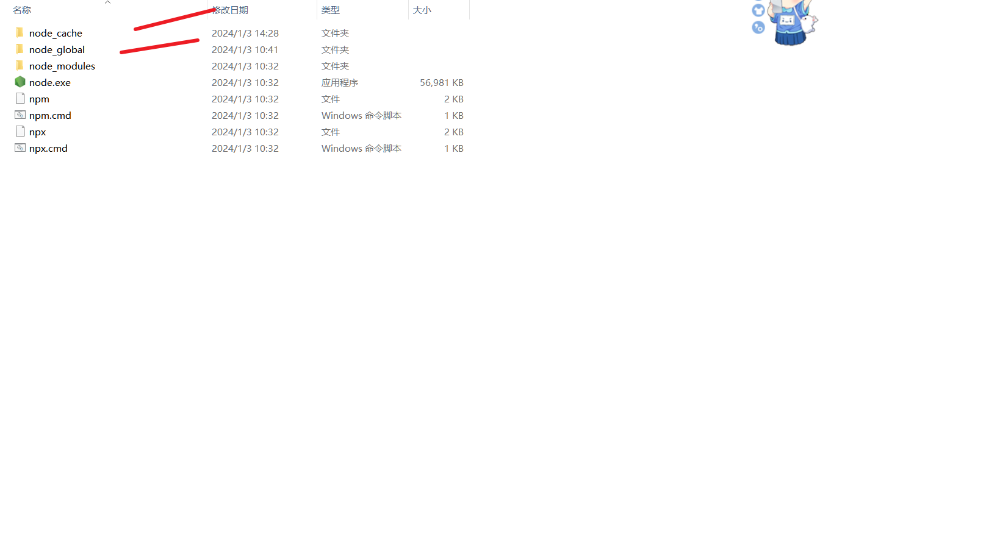
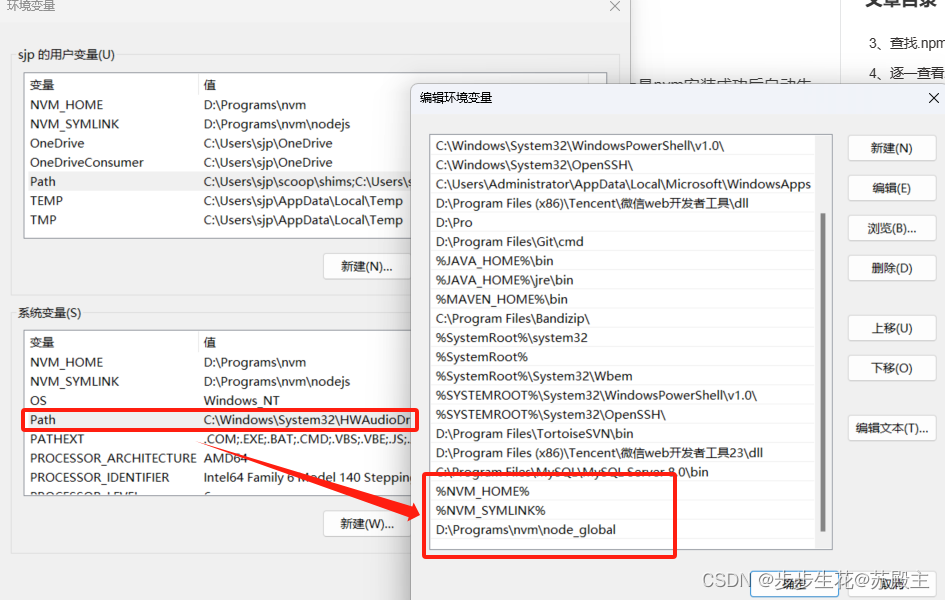

# 一 NVM Node  多版本多控制

## 1.1 卸载Node

- 如果你已经安装了node，那么你需要先卸载node，如果你没有安装那直接跳过这一步到下一步。
- 打开控制面板 -> 打开程序和功能 -> 右上角搜索输入node -> 右键卸载
- 为了确保彻底删除node在看看你的node安装目录中还有没有node文件夹，有的话一起删除。再看看C:\Users\用户名 文件夹下有没有`.npmrc`以及`.yarnrc`等等统统删除。再去看看你的环境变量有没有node相关的，有的话也一起删除了。

## 1.2 下载NVM

- 下载地址： https://github.com/coreybutler/nvm-windows/releases



- 傻瓜式安装，注意`nvm`安装路径与`nodejs`路径




- 点击next，安装完成后在终端输入`nvm version`，能查到版本号说明安装成功了。

![image-20240103164222611](data:image/png;base64,iVBORw0KGgoAAAANSUhEUgAABLAAAAJYCAYAAABy5h8aAAAc1UlEQVR4nO3dzXEeObqm4ac0HWelxWx7BxPGBJgwJsCEYwJMGBNgQpsAE8oE7Hp7POhZJD+KFKkSqR/yleq6IhQVVcovkcja3QEg//j48eN/AgAAAABFfXjvBwAAAACAvyJgAQAAAFCagAUAAABAaQIWAAAAAKUJWAAAAACUJmABAAAAUJqABQAAAEBpAhYAAAAApQlYAAAAAJQmYAEAAABQmoAFAAAAQGkCFgAAAAClCVgAAAAAlCZgAQAAAFCagAUAAABAaQIWAAAAAKUJWAAAAACUJmABAAAAUJqABQAAAEBpAhYAAAAApQlYAAAAAJT2UwLW7Emf62fcuqS/23wBAAAA3tJPCVh7J72fJP1n3L6c6vOdoyV9vvdjAAAAAHyTPz5+/Pif27/M0dLHTNJykpx9ss/JXq+PH2u0jDOS/fxv97Vs6br2JGuMJOduNdNOkox1ctZ49djv4WvzvZm9pc/rHSfJ2ifnrOyVJPvZ99JystZI2vUuxjpZbb3q/a3ZM3b/6vMBAAAAVHMfsPbs2W1mzpmcnZYreqw27+PIa4yWZK6sMb/42zVaVltXtPnst6vNXyq2vGS+sye7r+x5XdOSzLtgNcZKzrUN8bn30pKsNTJ2/xSlXvn+RCwAAADgV/QhuULI7jNzXPEquRLMmDstK7fVQq+xT9Kzk/at2+peF8ze29fm25K0MbLXzm1ut3f8c4LS0/c35s7q23ZCAAAA4JfyoSVpvWfvJNmP/vIkOWsl7XHA6i3Ze2asnS/FrdtvW695LtSP9rX5tuTJe7zZa39LI/wmbxmxrum+0cQAAACA39aHfhWs7L2fveBaMPRtX9jbOxk/6HDz3pK1Zvbe2Xtnrp0x55N737Y+3q4baz1aFTVaMufMWjNzryT9CnJ39/48yr103K/Ndydpe2fO8WSV1jrJ3SFYb+K5iHV7L2OutLSsObL3zto7bXy6bvZ8ehd75zbXfffO195JG9mzX++q9+w1r/u0cf//5q/i53NeOi4AAADw+/nQ2t1pTOflW/b2SXqfWaPnr7b67ST97OQ7V2G1JGOOzHXSe0/vPVnj+ueDVU23c6LWGen9+vu2Zub6FJx2rhBy9hVQepI2Zvq8DlB/uGropeO+dL5j7rSzstfMXCvtm7dXfr/PI9ZO0s5Oa+1uzknv/QpRo93HobmTNXpOTuZYua3aG3Nnn5UxZnJW5txp2Tm9p4+VrJExR8Zqmb2nt9dtL33puAAAAMDv58PPHmCtnd6/bxtZS7LT7qLTZe6nXygcPVkZd19NPPfX9T3TxnXtOZ8CVstJmyNrruTszJ3M3nOLIy8d96Xzvc68Wpn3Xxacmev5kPNwxdFbrDA6Jznn2so45865i0F75/5ctJt9rtj1MOL1lqzdHl17LSz7dObXvvZZfvMzvnRcAAAA4Pfy0wPWPslo3xdfbiub5pppfeS2Qmqu8yiI9N6zr0ry6PfnnLQvnD+1HgSWbx330W9eMN99TsaYmaOnZ2Wt+eT6uXO/6qv3ntH7D11h9KUvEl4L8R6/j8/P77rC1MoYPfer1XrL2T/34P33GhcAAAB4Xx/OSVrOFw8Y/14/6jD3MXfOmpmjZe+V+dnZVjdrtEcrl/beaWM9e6D41Wr+On68dNyH93xuvs8d4r5P0sdK2zN9vN35TV+KV6+x912o6yM9yWnjTVZBvde4AAAAwPv5cFtx86UVStdil++LK3snvZ987xfp1r5WLo3ekzWz1njybOPBeVUP/3ztvK7vHfeh5+bbki9Gqr33m32x70fEq+Ruk+Xe1+qw0a7D/r/x/f4K4wIAAADv58OnINDyeUBpSdK/f4XLp8PNnwac58LN5//t9qXEm5PrLKqs+Wil05e2Cj63+uklXjru556b70ky2nk2fLXWnt269xIveX83Pype3ey9M3ty+ro7LOttvNe4AAAAwPv4kFyHdo+20+fKLXz0lsw1rgOyPwsrvSV7z4y189JVQ/uZw833Phnt3J0vdRm9JeNxmOgtmXM+ikm9Ja33nAdbAOc6mW09mceYI7evEL7GS8d9yXxPknZO1hpP59tn9nr9+VYvfX/Jj49X1/hJsq/D2fOWAet9xgUAAADexx8fP378T3Llnjk/xZV9kjnXsweHX3FrZp2eNUZesnKo5QpiY+bRPUdLxoNItPbJmp++Ini7ps2ZdnK/8ukkmes6n+rJOH8xj9mTPp9Gj7Ge+arhK8Z9yXznaNmnZ/R88fn29YDXuzjJuv9i4adti3PfXffC9zdHyzzjL+PVw/eyk8w+07Mz98wt/vVr4Ee/+1IYu81jJzljZqzrEPyxTlZb9383+8y3RKifEeQAAACAmu4D1ltYo2VmPglFv6u/23wBAAAAfoYPbznYWueHHOb+q/i7zRcAAADgZ3jTFVgAAAAA8FpvugILAAAAAF5LwAIAAACgNAELAAAAgNKeBKzekj7nDxvgre/XW7LWzN47e+/MtZPmK4AAAAAAv6p/JNc38uYcaa0nrWXu77vpe91vtKTPlbl2zu7X70bPWjNjJDnr+x4EAAAAgDf3v/7rv/5r/k+SP8+f+df+M//3f/+ZnZ6zvz32vNf9/t9/9/z3n/8n51/z0+/+PBk92en5nz//9c3PAAAAAMD7uN9CeE5yzsk554fc+L3uN0ZL0j/97u7HrbUf8hwAAAAAvK1/vPcD/Ehr7Zyzc5etHvlRIQ0AAACAt/V7BayTZD0+4L0nOb3njO88iAsAAACAd/HkK4S/mzF75moOcAcAAAD4Rf3WAWv2ZJ6es8Z7PwoAAAAA3+i3DVizJ6vNnM+2FAIAAADwa/ktA5Z4BQAAAPD7+O0C1mjJ7k/jVWvtnZ4IAAAAgO/xWwWs0ZLMlT0fH9jek7ThHCwAAACAX9GjgNWStNbTW5LWn1y8RsveO2287It+b3m/lqTPkT13WrtWXN3+jNlzjhVYAAAAAL+ifyRX/FlrJO1apdST7DWzk8w+k+xX3fQ97nfFrZa1epKnq63OfN2YAAAAANTwx8ePH//z3g8BAAAAAF/yW52BBQAAAMDvR8ACAAAAoDQBCwAAAIDSBCwAAAAAShOwAAAAAChNwAIAAACgNAELAAAAgNIELAAAAABKE7AAAAAAKE3AAgAAAKA0AQsAAACA0gQsAAAAAEoTsAAAAAAoTcACAAAAoDQBCwAAAIDSBCwAAAAAShOwAAAAAChNwAIAAACgNAELAAAAgNIELAAAAABKE7AAAAAAKE3AAgAAAKA0AQsAAACA0gQsAAAAAEr7KQFr9qTP9TNuXdLfbb4AAAAAb+mnBKy9k95Pkv4zbl9O9fnO0ZI+3/sxAAAAAL7JHx8/fvzP7V/maOljJmk5Sc4+2edkr9fHjzVaxhnJfv63+1q2dF17kjVGknO3mmknScY6OWu8euz38LX53sze0uf1jpNk7ZNzVvZKkv3se2k5WWsk7XoXY52stl71/tbsGbt/9fkAAAAAqrkPWHv27DYz50zOTssVPVab93HkNUZLMlfWmF/87Rotq60r2nz229XmLxVbXjLf2ZPdV/a8rmlJ5l2wGmMl59qG+Nx7aUnWGhm7f4pSr3x/IhYAAADwK/qQXCFk95k5rniVXAlmzJ2WldtqodfYJ+nZSfvWbXWvC2bv7WvzbUnaGNlr5za32zv+OUHp6fsbc2f1bTshAAAA8Ev50JK03rN3kuxHf3mSnLWS9jhg9ZbsPTPWzpfi1u23rdc8F+pH+9p8W/LkPd7stb+lEX4TEQsAAAD41XzoV8HK3vvZC64FQ9/2hb29k/GDDjfvLVlrZu+dvXfm2hlzPrn3bevj7bqx1qNVUaMlc86sNTP3StKvIHd378+j3EvH/dp8d5K2d+YcT1ZprZPcHYL1JkQsAAAA4FfyobW705jOy7fs7ZP0PrNGz19t9dtJ+tnJd67CaknGHJnrpPee3nuyxvXPB6uabudErTPS+/X3bc3M9Sk47SR775x9haqepI2ZPq8D1K/btVeN+9L5jrnTzspeM3OttG/eXvn9RCwAAADgV/HhZw+w1k7v37c/riXZaXfR6TL30y8Ujp6sjLuvJp776/qeaeO69pxPAavlpM2RNVdyduZOZu+5baV86bgvne915tXKvP+y4Mxcz5+bNXvuV33tvbP2vv8KIQAAAMDfyU8PWPsko31ffLmtbJprpvWR2wqpuc6j7Y299+x98vmqsHNO2hfOn1oPDlX/1nEf/eYF893nZIyZOXp6VtaaT66fO/ervnrvGb1/81bO5/giIQAAAPCr+HBO0nK+eMD49/pRh7mPuXPWzBwte6/Mz862ulmjPVq5tPdOG+vR1sCHz/a1rZMvHffhPZ+b73OHuO+T9LHS9kwfb7e6SrwCAAAAfiUfrn7z5RVK4zok6rsG2Tvp/eR7P7W39rVyafSerJm1xpNnGw/Oq3r452vndX3vuA89N9+WfDFS7b2fDWw/g3gFAAAA/Go+7CTZt3ObHgeUliR9JOf5LxS+1KfDzZ8GnOfCzef/7falxJuT6yyqrPlopdOXtgo+t/rpJV467ueem+9JMtp5Nny11nILia/1kvd3I14BAAAAv6IPSTLnzmg7fa7cwkdvyVwja7d8HlZ6S/aeGWvnpauG9jOHm+99Mtq5O1/qMnpLxrqWMT0Yb875KCb1lrTecx5sAZzrZLb1ZB5jjty+QvgaLx33JfM9Sdo5WWs8nW+f2ev151u99P0lX49X//73v1/0BwAAAOCt/fHx48f/JFfumfNTXNknmXM9e3D4Fbdm1ulZY+QlK4dariA2Zh7dc7RkPIhEa5+s+ekrgrdr2pxpJ/crn06Sua7zqZ6M8xfzmD3p8+mKsrGe+arhK8Z9yXznaNmnZ/R88fn29YDXuzjJuv9i4adti3PfXffC9zdHyzzjL1devTRO/fOf/3zRdQAAAAA/yn3AegtrtMzMJ6Hod/UrzVfAAgAAAKr68JaDrXV+yGHuv4q/23wBAAAAfoY3XYFFXVZgAQAAAFUJWAAAAACU9qZbCAEAAADgtQQsAAAAAEoTsAAAAAAoTcACAAAAoDQBCwAAAIDSBCwAAAAAShOwAAAAAChNwAIAAACgNAELAAAAgNIELAAAAABKE7AAAAAAKE3AAgAAAKA0AQsAAACA0gQsAAAAAEoTsAAAAAAoTcACAAAAoDQBCwAAAIDSBCwAAAAAShOwAAAAAChNwAIAAACgNAELAAAAgNIELAAAAABKE7AAAAAAKE3AAgAAAKA0AQsAAACA0gQsAAAAAEoTsAAAAAAoTcACAAAAoDQBCwAAAIDSBCwAAAAAShOwAAAAAChNwAIAAACgNAELAAAAgNIELAAAAABKE7AAAAAAKE3AAgAAAKA0AQsAAACA0gQsAAAAAEoTsAAAAAAoTcACAAAAoDQBCwAAAIDSBCwAAAAAShOwAAAAAChNwAIAAACgNAELAAAAgNIELAAAAABKE7AAAAAAKE3AAgAAAKA0AQsAAACA0gQsAAAAAEoTsAAAAAAoTcACAAAAoDQBCwAAAIDSBCwAAAAAShOwAAAAAChNwAIAAACgNAELAAAAgNIELAAAAABKE7AAAAAAKE3AAgAAAKA0AQsAAACA0gQsAAAAAEoTsAAAAAAoTcACAAAAoDQBCwAAAIDSBCwAAAAAShOwAAAAAChNwAIAAACgNAELAAAAgNIELAAAAABKE7AAAAAAKE3AAgAAAKA0AQsAAACA0gQsAAAAAEoTsAAAAAAoTcACAAAAoDQBCwAAAIDSBCwAAAAAShOwAAAAAChNwAIAAACgNAELAAAAgNIELAAAAABKE7AAAAAAKE3AAgAAAKA0AQsAAACA0gQsAAAAAEoTsAAAAAAoTcACAAAAoDQBCwAAAIDSBCwAAAAAShOwAAAAAChNwAIAAACgNAELAAAAgNIELAAAAABKE7AAAAAAKE3AAgAAAKA0AQsAAACA0gQsAAAAAEoTsAAAAAAoTcACAAAAoDQBCwAAAIDSBCwAAAAAShOwAAAAAChNwAIAAACgNAELAAAAgNIELAAAAABKE7AAAAAAKE3AAgAAAKA0AQsAAACA0gQsAAAAAEoTsAAAAAAoTcACAAAAoDQBCwAAAIDSBCwAAAAAShOwAAAAAChNwAIAAACgNAELAAAAgNIELAAAAABKE7AAAAAAKE3AAgAAAKA0AQsAAACA0gQsAAAAAEoTsAAAAAAoTcACAAAAoDQBCwAAAIDSBCwAAAAAShOwAAAAAChNwAIAAACgNAELAAAAgNIELAAAAABKE7AAAAAAKE3AAgAAAKA0AQsAAACA0gQsAAAAAEoTsAAAAAAoTcACAAAAoDQBCwAAAIDSBCwAAAAAShOwAAAAAChNwAIAAACgNAELAAAAgNIELAAAAABKE7AAAAAAKE3AAgAAAKA0AQsAAACA0gQsAAAAAEoTsAAAAAAoTcACAAAAoDQBCwAAAIDSBCwAAAAAShOwAAAAAChNwAIAAACgNAELAAAAgNIELAAAAABKE7AAAAAAKE3AAgAAAKA0AQsAAACA0gQsAAAAAEoTsAAAAAAoTcACAAAAoDQBCwAAAIDSBCwAAAAAShOwAAAAAChNwAIAAACgNAELAAAAgNIELAAAAABKE7AAAAAAKE3AAgAAAKA0AQsAAACA0gQsAAAAAEoTsAAAAAAoTcACAAAAoDQBCwAAAIDSBCwAAAAAShOwAAAAAChNwAIAAACgNAELAAAAgNIELAAAAABKE7AAAAAAKE3AAgAAAKA0AQsAAACA0gQsAAAAAEoTsAAAAAAoTcACAAAAoDQBCwAAAIDSBCwAAAAAShOwAAAAAChNwAIAAACgNAELAAAAgNIELAAAAABKE7AAAAAAKE3AAgAAAKA0AQsAAACA0gQsAAAAAEoTsAAAAAAoTcACAAAAoDQBCwAAAIDSBCwAAAAAShOwAAAAAChNwAIAAACgNAELAAAAgNIELAAAAABKE7AAAAAAKE3AAgAAAKA0AQsAAACA0gQsAAAAAEoTsAAAAAAoTcACAAAAoDQBCwAAAIDSBCwAAAAAShOwAAAAAChNwAIAAACgNAELAAAAgNIELAAAAABKE7AAAAAAKE3AAgAAAKA0AQsAAACA0gQsAAAAAEoTsAAAAAAoTcACAAAAoDQBCwAAAIDSBCwAAAAAShOwAAAAAChNwAIAAACgNAELAAAAgNIELAAAAABKE7AAAAAAKE3AAgAAAKA0AQsAAACA0gQsAAAAAEoTsAAAAAAoTcACAAAAoDQBCwAAAIDSBCwAAAAAShOwAAAAAChNwAIAAACgNAELAAAAgNIELAAAAABKE7AAAAAAKE3AAgAAAKA0AQsAAACA0gQsAAAAAEoTsAAAAAAoTcACAAAAoDQBCwAAAIDSBCwAAAAAShOwAAAAAChNwAIAAACgNAELAAAAgNIELAAAAABKE7AAAAAAKE3AAgAAAKA0AQsAAACA0gQsAAAAAEoTsAAAAAAoTcACAAAAoDQBCwAAAIDSBCwAAAAAShOwAAAAAChNwAIAAACgNAELAAAAgNIELAAAAABKE7AAAAAAKE3AAgAAAKA0AQsAAACA0gQsAAAAAEoTsAAAAAAoTcACAAAAoDQBCwAAAIDSBCwAAAAAShOwAAAAAChNwAIAAACgNAELAAAAgNIELAAAAABKE7AAAAAAKE3AAgAAAKA0AQsAAACA0gQsAAAAAEoTsAAAAAAoTcACAAAAoDQBCwAAAIDSBCwAAAAAShOwAAAAAChNwAIAAACgNAELAAAAgNIELAAAAABKE7AAAAAAKE3AAgAAAKA0AQsAAACA0gQsAAAAAEoTsAAAAAAoTcACAAAAoDQBCwAAAIDSBCwAAAAAShOwAAAAAChNwAIAAACgNAELAAAAgNIELAAAAABKE7AAAAAAKE3AAgAAAKA0AQsAAACA0gQsAAAAAEoTsAAAAAAoTcACAAAAoDQBCwAAAIDSBCwAAAAAShOwAAAAAChNwAIAAACgNAELAAAAgNIELAAAAABKE7AAAAAAKE3AAgAAAKA0AQsAAACA0gQsAAAAAEoTsAAAAAAoTcACAAAAoDQBCwAAAIDSBCwAAAAAShOwAAAAAChNwAIAAACgNAELAAAAgNIELAAAAABKE7AAAAAAKE3AAgAAAKA0AQsAAACA0gQsAAAAAEoTsAAAAAAoTcACAAAAoDQBCwAAAIDSBCwAAAAAShOwAAAAAChNwAIAAACgNAELAAAAgNIELAAAAABKE7AAAAAAKE3AAgAAAKA0AQsAAACA0gQsAAAAAEoTsAAAAAAoTcACAAAAoDQBCwAAAIDSBCwAAAAAShOwAAAAAChNwAIAAACgNAELAAAAgNIELAAAAABKE7AAAAAAKE3AAgAAAKA0AQsAAACA0gQsAAAAAEoTsAAAAAAoTcACAAAAoDQBCwAAAIDSBCwAAAAAShOwAAAAAChNwAIAAACgNAELAAAAgNIELAAAAABKE7AAAAAAKE3AAgAAAKA0AQsAAACA0gQsAAAAAEoTsAAAAAAoTcACAAAAoDQBCwAAAIDSBCwAAAAAShOwAAAAAChNwAIAAACgNAELAAAAgNIELAAAAABKE7AAAAAAKE3AAgAAAKA0AQsAAACA0gQsAAAAAEoTsAAAAAAoTcACAAAAoDQBCwAAAIDSBCwAAAAAShOwAAAAAChNwAIAAACgNAELAAAAgNIELAAAAABKE7AAAAAAKE3AAgAAAKA0AQsAAACA0gQsAAAAAEoTsAAAAAAoTcACAAAAoDQBCwAAAIDSBCwAAAAAShOwAAAAAChNwAIAAACgNAELAAAAgNIELAAAAABKE7AAAAAAKE3AAgAAAKA0AQsAAACA0gQsAAAAAEoTsAAAAAAoTcACAAAAoDQBCwAAAIDSBCwAAAAAShOwAAAAAChNwAIAAACgNAELAAAAgNIELAAAAABKE7AAAAAAKE3AAgAAAKA0AQsAAACA0gQsAAAAAEoTsAAAAAAoTcACAAAAoDQBCwAAAIDSBCwAAAAAShOwAAAAAChNwAIAAACgNAELAAAAgNIELAAAAABKE7AAAAAAKE3AAgAAAKA0AQsAAACA0gQsAAAAAEoTsAAAAAAoTcACAAAAoDQBCwAAAIDSBCwAAAAAShOwAAAAAChNwAIAAACgNAELAAAAgNIELAAAAABKE7AAAAAAKE3AAgAAAKA0AQsAAACA0gQsAAAAAEoTsAAAAAAoTcACAAAAoDQBCwAAAIDSBCwAAAAAShOwAAAAAChNwAIAAACgNAELAAAAgNIELAAAAABKE7AAAAAAKE3AAgAAAKA0AQsAAACA0gQsAAAAAEoTsAAAAAAoTcACAAAAoDQBCwAAAIDSBCwAAAAAShOwAAAAAChNwAIAAACgNAELAAAAgNIELAAAAABKE7AAAAAAKE3AAgAAAKA0AQsAAACA0gQsAAAAAEoTsAAAAAAoTcACAAAAoDQBCwAAAIDSBCwAAAAAShOwAAAAAChNwAIAAACgNAELAAAAgNIELAAAAABKE7AAAAAAKE3AAgAAAKA0AQsAAACA0gQsAAAAAEoTsAAAAAAoTcACAAAAoDQBCwAAAIDSBCwAAAAAShOwAAAAAChNwAIAAACgNAELAAAAgNIELAAAAABKE7AAAAAAKE3AAgAAAKA0AQsAAACA0gQsAAAAAEoTsAAAAAAoTcACAAAAoDQBCwAAAIDSBCwAAAAAShOwAAAAAChNwAIAAACgNAELAAAAgNIELAAAAABKE7AAAAAAKE3AAgAAAKA0AQsAAACA0gQsAAAAAEoTsAAAAAAoTcACAAAAoDQBCwAAAIDSBCwAAAAAShOwAAAAACjt/wOfuHmhO9aJxQAAAABJRU5ErkJggg==)

## 1.3 配置路径和下载源

- 安装完nvm后先不要着急安装node。**找到nvm安装路径 -> 找到 `settings.txt` 文件 -> 配置下载源**


```markdown
node_mirror: https://npm.taobao.org/mirrors/node/
npm_mirror: https://npm.taobao.org/mirrors/npm/
```


## 1.4 使用nvm安装node

- 在终端输入 `nvm list available`， 查看网络可以安装的版本。


- 安装node 版本 18.14.0 和 15.14.0

```markdown
nvm install 版本号
```


- 查看安装了的Node

```markdown
nvm ls
```


- 使用哪一个

```markdown
nvm use 版本号
```


注意必须先使用了，才有nodejs目录



## 1.5 常用命令

- nvm install version：安装指定版本的Node.js。例如，nvm install 14.17.0将安装Node.js 14.17.0版本。
- nvm use version：切换到指定版本的Node.js。例如，nvm use 14.17.0将切换到Node.js 14.17.0版本。
- nvm ls：列出已安装的所有Node.js版本。
- nvm ls-remote：列出远程可用的所有Node.js版本。
- nvm current：显示当前正在使用的Node.js版本。
- nvm alias name version：为指定的版本创建一个别名。例如，nvm alias default 14.17.0将为Node.js 14.17.0版本创建一个名为"default"的别名。
- nvm unalias name：删除指定的版本别名。例如，nvm unalias default将删除名为"default"的别名。
- nvm uninstall version：卸载指定的Node.js版本。例如，nvm uninstall 14.17.0将卸载Node.js 14.17.0版本。

## 1.6 卸载

系统应用找到该服务，点击卸载

## 1.7 配置npm

#### 1.7.1  配置全局安装的模块路径和缓存路径

- 首先在NVM的安装目录**新建两个文件夹**`node_global`和`node_cache`



- 创建完两个文件夹后，在cmd窗口中输入以下命令（两个路径即是两个文件夹的路径）

```markdown
npm config set prefix "D:\Programs\nvm\node_global"
npm config set cache "D:\Programs\nvm\node_cache"
```


#### 1.7.2 设置用户变量

- 【用户变量】中的path变量，%NVM_HOME% 和 %NVM_SYMLINK% 理论上是nvm安装成功后自动生成的。如果没有，新建进去。 如果有C:\Users\用户名\AppData\Roaming\npm，则将其修改为D:\Programs\nvm\node_global(刚刚新建node_global文件夹的位置)，如果没有就自己新建D:\Programs\nvm\node_global，总之保证有以下图片中内容
- 新建环境变量 `NODE_PATH`，值为`D:\Programs\nvm\node_global\node_modules`，其中`D:\Programs\nvm\node_global\node_modules`是上述创建的全局模块安装路径文件夹


#### 1.7.3  配置镜像

```markdown
npm config set registry https://registry.npm.taobao.org
 
npm config get registry
```


