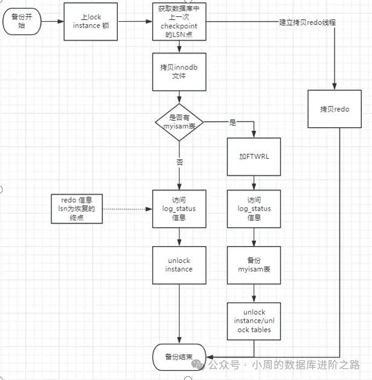
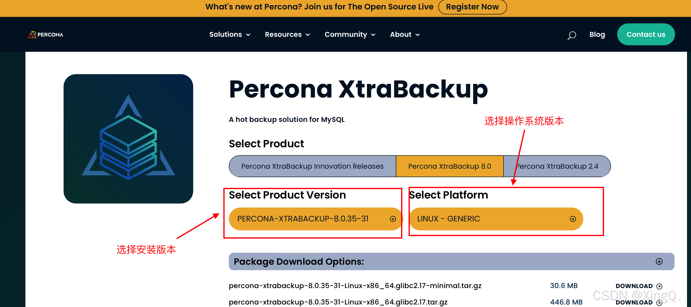

# Xtrabackup MYSQL 备份工具
> [!DANGER]
> Xtrabackup 是由 Percona 公司开源的一款 MySQL 物理热备份工具，以实现对 MySQL 或 MariaDB这类数据库的数据库进行物理备份。

## xtrabackup特点

1、属于物理备份工具，备份过程中是直接拷贝的数据库的物理文件，而不是像逻辑备份工具一样，要连接到MySQL服务端后通过执行大量的读操作，从而将对应的sql语句写入备份文件，所以xtrabackup备份过程中不会增加MySQL服务端的负载；
2、属于多线程备份工具，备份速度和数据恢复速度都很快；不像逻辑备份数据一样，恢复数据的时候只能单线程按顺序读取sql语句，然后再执行；
3、版本兼容性较差，不同版本的 XtraBackup 可能只能与特定版本的 MySQL 或 MariaDB 兼容。需要确保使用与数据库版本相匹配的 XtraBackup 版本。
4、一般用于全备份场景，排除指定数据不备份，恢复时比较繁琐。
5、支持innodb、mysaim等存储引擎的备份，备份速度受到服务器性能（IO等）影响；
xtrabackup支持流式输出、压缩、增量备份、加密，是目前各个备份厂商普遍使用的MySQL备份工具。

## 二、Xtrabackup备份原理

1、xtrabackup开始，记录lsn ，同时启动后台进程监控redo日志的变化，且将变化实时记录到xtrabackup_logfile中；
2、复制ibdata1，.ibd数据文件；
3、全局读锁，执行LOCK INSTANCE FOR BACKUP（8.0取代了 FLUSH TABLES WITH READ LOCK）；
4、复制非InnoDB的表和文件；
5、获取binlog位置信息；
6、停止复制redo log，即停止记录xtrabackup_logfile；
7、执行UNLOCK INSTANCE释放锁；
8、复制buffer pool；
9、备份完成。



## 三、安装

1、yum方式安装

官方下载地址：https://www.percona.com/downloads

到官网地址上下载适配当前MySQL数据库版本的软件
不同版本的 XtraBackup 可能只能与特定版本的 MySQL 或 MariaDB 兼容。需要确保使用与数据库版本相匹配的 XtraBackup 版本。

Percona XtraBackup 8.0 只支持MySQL 8.0的版本
Percona XtraBackup 2.4 支持MySQL 5.11 , 5.5, 5.6 和5.7的版本



```css
yum install -y libev libgcrypt openssl zlib libaio

yum localinstall -y percona-xtrabackup-80-8.0.35-31.1.el7.x86_64.rpm

xtrabackup --version
```

2、tar.gz方式安装

```bash
yum install -y perl-Digest-MD5 perl-DBD-MySQL libev
tar -xvf percona-xtrabackup-8.0.35-31-Linux-x86_64.glibc2.17.tar.gz
mv percona-xtrabackup-8.0.35-31-Linux-x86_64.glibc2.17 xtrabackup
echo "export PATH=\$PATH:/usr/local/xtrabackup/bin" >>/etc/profile
source /etc/profile
which xtrabackup
xtrabackup --version
```

## 四、xtrabackup常用参数

```diff
--user：指定连接数据库的用户名。
--password：指定连接数据库的密码。
--backup：执行备份操作。
--prepare：执行备份准备操作。
--copy-back：将备份恢复到原来的数据目录。
--datadir：指定数据目录的路径。
--target-dir：指定备份文件存储目录。
--incremental：执行增量备份操作。
--incremental-lsn：指定增量备份的LSN号。
--tables：仅备份特定的表。
--databases：仅备份特定的数据库。
--compress：压缩备份文件。#开启备份压缩，根据数据内容不同，压缩比可以在50%～60%
--stream=xbstream #开启流式备份，备份出来的数据输出到stdout
--remote-host=user@ip DST_DIR #备份到远程主机
```

## 五 利用[Xtrabackup](https://so.csdn.net/so/search?q=Xtrabackup&spm=1001.2101.3001.7020)进行mysql增量备份

现在xtrabackup版本升级到了8.0，但是只对`mysql8.0`才有支持, 我们这还是使用`2.4`, 但是`2.4`相比之前的`2.1`有了比较大的变化：`innobackupex` 功能全部集成到 `xtrabackup` 里面，只有一个 `binary`，另外为了使用上的兼容考虑，`innobackupex` 作为 `xtrabackup` 的一个软链，即 `xtrabackup` 现在支持非Innodb表备份，并且 `Innobackupex` 在下一版本中移除(8.0已经移除了)，建议通过`xtrabackup`替换`innobackupex`。还有其他的一些新特性，更多的说明可以看`xtrabackup`新版详细说明。

下载地址: `https://www.percona.com/downloads/Percona-XtraBackup-LATEST/`

文档地址: `https://www.percona.com/doc/percona-xtrabackup/2.4/index.html`

### 安装

如果安装需要依赖就把依赖安装一下

```
wget https://repo.percona.com/apt/percona-release_latest.$(lsb_release -sc)_all.deb
sudo dpkg -i percona-release_latest.$(lsb_release -sc)_all.deb
sudo apt-get update
sudo apt-get install percona-xtrabackup-24
```

### 设置数据库用于备份账户

```
mysql> CREATE USER 'bkpuser'@'localhost' IDENTIFIED BY '123456';
mysql> GRANT RELOAD, LOCK TABLES, PROCESS, REPLICATION CLIENT ON *.* TO 'bkpuser'@'localhost';
mysql> FLUSH PRIVILEGES;
```

### 全量备份

```
xtrabackup --user=bkpuser --password=123456 --backup --target-dir=/data/backups/mysql
 
# 会看到输出
200603 09:55:37 Executing UNLOCK TABLES
200603 09:55:37 All tables unlocked
200603 09:55:37 [00] Copying ib_buffer_pool to /data/backups/mysql/ib_buffer_pool
200603 09:55:37 [00]        ...done
200603 09:55:37 Backup created in directory '/data/backups/mysql/'
200603 09:55:37 [00] Writing /data/backups/mysql/backup-my.cnf
200603 09:55:37 [00]        ...done
200603 09:55:37 [00] Writing /data/backups/mysql/xtrabackup_info
200603 09:55:37 [00]        ...done
xtrabackup: Transaction log of lsn (837940114) to (837940123) was copied.
200603 09:55:37 completed OK!
```

- 准备备份

```
xtrabackup --prepare --target-dir=/data/backups/mysql
```

- 复制备份

我这里为了演示全量备份就直接将我博客 `mysql` 存储的数据目录给移动一下

```
mv /var/lib/mysql /var/lib/mysql_bak
mkdir /var/lib/mysql
 
xtrabackup --copy-back --target-dir=/data/backups/mysql  # 这样会保留原始备份 他会将当时读到my.cnf的datadir设置为恢复路径
 
200603 10:47:42 [01]        ...done
200603 10:47:42 [01] Copying ./performance_schema/mutex_instances.frm to /var/lib/mysql/performance_schema/mutex_instances.frm
200603 10:47:42 [01]        ...done
200603 10:47:42 [01] Copying ./performance_schema/events_transactions_history_long.frm to /var/lib/mysql/performance_schema/events_transactions_history_long.frm
200603 10:47:42 [01]        ...done
200603 10:47:42 [01] Copying ./xtrabackup_info to /var/lib/mysql/xtrabackup_info
200603 10:47:42 [01]        ...done
200603 10:47:42 [01] Copying ./ibtmp1 to /var/lib/mysql/ibtmp1
200603 10:47:42 [01]        ...done
200603 10:47:42 completed OK!
```

- 备份成功 重新启动 博客还能正常访问 哈哈哈哈

```
# 将恢复目录的属主更改一下
chown -R mysql:mysql mysql
/etc/init.d/mysql start
```

如果恢复玩不想要备份数据可以使用 `xtrabackup --move-back` 命令

### 增量备份

增量是基于已有数据进行备份的,也就行需要先创建一次全量备份,然后记录当时的记录点

- 创建备份

```
xtrabackup --user=bkpuser --password=123456 --backup --target-dir=/data/backups/base
 
# 基于全量备份进行增量
xtrabackup --user=bkpuser --password=123456 --backup --target-dir=/data/backups/inc1 --incremental-basedir=/data/backups/base
```

- 查看备份类型 确认是增量备份了

```
root@longing:/data/backups/inc1# cat xtrabackup_checkpoints 
backup_type = incremental
from_lsn = 837943393
to_lsn = 837943393
last_lsn = 837943402
compact = 0
recover_binlog_info = 0
flushed_lsn = 837943402
```

`from_lsn` 是备份的起始 `LSN`，对于增量备份，它必须`to_lsn`与先前 `base` 备份的相同。

在这种情况下，您可以看到`to_lsn` （最后一个检查点LSN）和`last_lsn`（最后一个复制的`LSN`）之间存在差异，这意味着在备份过程中服务器上有一些流量。

- 我们可以测试一下 对第一个增加继续创建增量 创建增量之前先创建几条数据

```
xtrabackup --user=bkpuser --password=123456 --backup --target-dir=/data/backups/inc2 --incremental-basedir=/data/backups/inc1
```

- 准备恢复

已经有3个备份了,我们要先对基础数据进行准备,然后对两个增量进行准备

```
xtrabackup --user=bkpuser --password=123456 --prepare --apply-log-only --target-dir=/data/backups/base
 
xtrabackup --user=bkpuser --password=123456 --prepare --apply-log-only --target-dir=/data/backups/base --incremental-dir=/data/backups/inc1
 
xtrabackup --user=bkpuser --password=123456 --prepare --target-dir=/data/backups/base --incremental-dir=/data/backups/inc2
```

`xtrabackup --apply-log-only` 合并除最后一个以外的所有增量时应使用, 一旦准备好，增量备份就与完整备份相同，可以用相同的方式还原它们。

- 恢复

```
xtrabackup --copy-back --target-dir=/data/backups/base
```

中间插入的数据就能看见了,真棒!

### 提问总结

- 增量备份步骤

1. 创建基础备份
2. 一定条件进行增量备份创建
3. 对所有备份进行准备 所有增量基于基础备份 相当于合并操作
4. 最后和全量备份一样 直接恢复即可

#### 原理

在`InnoDB`内部会维护一个redo日志文件，我们也可以叫做事务日志文件.事务日志会存储每一个InnoDB表数据的记录修改。当InnoDB启动时，InnoDB会检查数据文件和事务日志，并执行两个步骤：它应用（前滚）已经提交的

事务日志到数据文件，并将修改过但没有提交的数据进行回滚操作。

`Xtrabackup` 在启动时会记住`log sequence number（LSN）`, 并且复制所有的数据文件。复制过程需要一些时间，所以这期间如果数据文件有改动，那么将会使数据库处于一个不同的时间点。这时，`xtrabackup` 会运行一个后台进程，用于监视事务日志，并从事务日志复制最新的修改。`Xtrabackup` 必须持续的做这个操作，是因为事务日志是会轮转重复的写入，并且事务日志可以被重用。所以 `xtrabackup` 自启动开始，就不停的将事务日志中每个数据文件的修改都记录下来。上面就是 `xtrabackup` 的备份过程。

#### 为什么最后一次增量备份不用 "--apply-log-only"

最后一次"准备"操作可以不用跳过回滚操作，这样用来恢复的数据文件本地就处理好了，当服务启动后就不会再进入到回滚阶段，如果最后一次使用了这个参数，服务器启动后将进入回滚阶段。所以这个`--apply-log-only` 只是用来合并增量用的避免下一个增量不可用。 可以参见 `参见 man xtrabackup`

#### 为什么备份完后要准备备份 "prepare"

一般情况下,在备份完成后，数据尚且不能用于恢复操作，因为备份的数据中可能会包含尚未提交的事务或已经提交但尚未同步至数据文件中的事务。因此，此时数据文件仍处理不一致状态。他作用是通过回滚未提交的事务及同步已经提交的事务至数据文件使数据文件处于一致性状态。

#### 为什么选择这个做备份?

- `mysqldump` 备份缺点

效率较低,备份和还原速度慢,份过程中,数据插入和更新操作会被挂起

- `MySQL` 备份工具

跨平台性差,备份时间长,冗余备份,浪费存储空间

- `XtraBackup`

备份过程中不锁库表,适合生产环境,由专业组织`Percona`提供( 改进`MySQL`分支 )

- `XtraBackup`能对表 库进行备份吗?

当然了,只不过博主太懒了,写起来太麻烦了,不过原理都是差不多,操作也差不多,大家自己搞搞!

```
xtrabackup --user=bkpuser --password=123456 --backup --databases="u_test" --no-timestamp --target-dir=/data/backups/u
xtrabackup --prepare --target-dir=/data/backups/u
```

还原

1. 先`prepare`，利用`--apply-log`的作用是通过回滚未提交的事务及同步已经提交的事务至数据文件使数据文件处于一致性状态
2. `copy`，因为是部分备份，不能直接用`--copy-back`，只能手动来复制需要的库，也要复制`ibdata(数据字典）`
3. `cp /data/backups/u/ibdata1 /var/lib/mysql/`
4. `cp -r u/u_test /var/lib/mysql/`


