# 本地对象存储服务MinIO （Window）

- 中文文档：<https://www.minio.org.cn/docs/minio/windows/index.html>

- MinIO是一个对象存储解决方案，它提供了与Amazon Web Services S3兼容的API，并支持所有核心S3功能。 MinIO有能力在任何地方部署 - 公有云或私有云，裸金属基础设施，编排环境，以及边缘基础设施。

## 1.1 环境准备

- 准备一个空的[文件夹](https://so.csdn.net/so/search?q=文件夹&spm=1001.2101.3001.7020)，用来存放minio相关的内容；
- 这里是在D盘创建一个minio的文件夹；
- 后续所有跟MinIO相关的内容，都是基于此文件夹

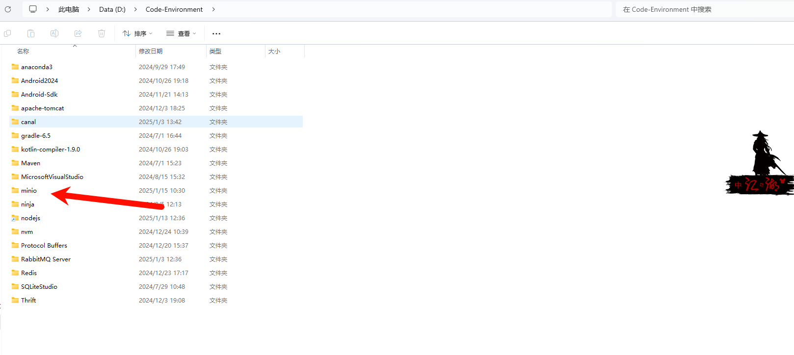

## 1.2 下载安装

- <https://www.minio.org.cn/download.shtml#/windows>

- <https://link.csdn.net/?from_id=140205289&target=https%3A%2F%2Fdl.minio.org.cn%2Fserver%2Fminio%2Frelease%2Fwindows-amd64%2Fminio.exe>

  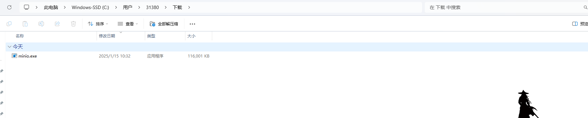

- 命令

注意：

- 一定要定位到文件夹下；
- D:\Code-Environment\minio\data 这个必须要填写，用来指定MinIO
- 在本地的存储路径； 这里用到data这个文件夹路径，可以提前创建好，没有创建的话也不要紧，执行上述命令时会自动帮我们创建

```bash
.\minio.exe server D:\Code-Environment\minio\data
```

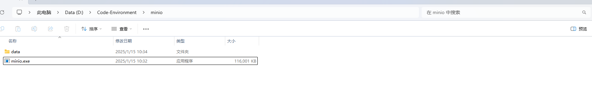

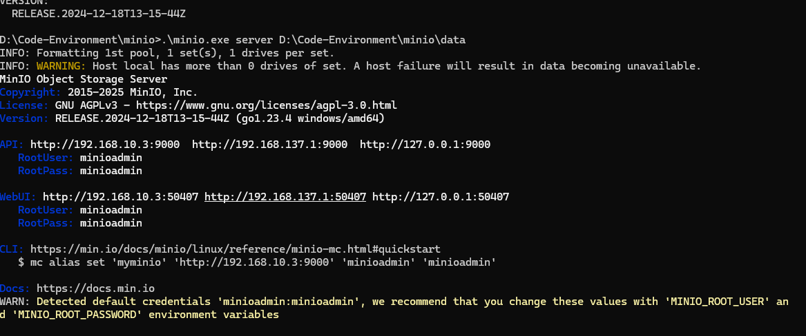

- 说明：
- API 列出了客户端可以访问MinIO S3 API的网络接口和端口; WebUI
- 列出了网络接口和端口，客户端可以通过这些接口和端口访问MinIO网页端的控制台。
- 9000端口为服务端口号 9001端口为控制台端口号

## 1.3 Web访问

在浏览器中地址栏输入【<http://127.0.0.1:9000】（以自己启动minio服务时的WebUI> 端口为准，每次启动服务随机生成），访问本地的MinIO服务控制台

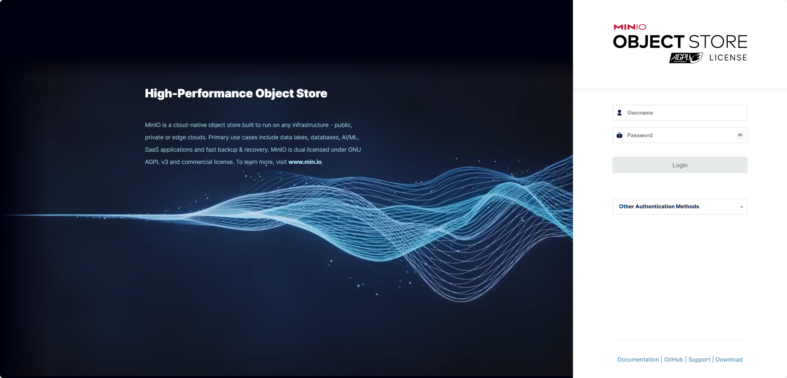

- 输入账号与密码，进入页面

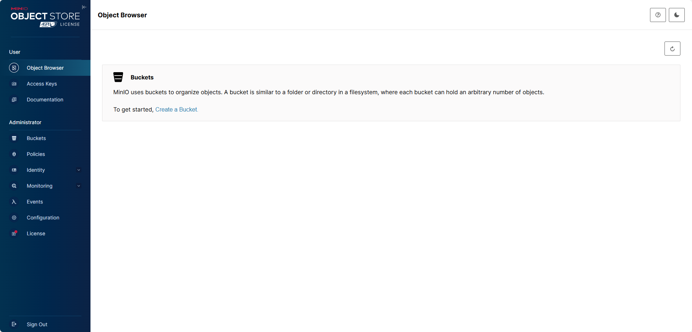

## 1.4 指定端口号启动服务】

前面启动服务时，像控制台地址【<http://127.0.0.1:9001】中的端口号，每次会自动生成，且不利于记忆。因此我们可以指定***控制台端口号> 9001；服务端口号9000；***

```bash
.\minio.exe server D:\minio\data --console-address "127.0.0.1:9001" --address "127.0.0.1:9000"
```

## 1.5 设置用户名密码(cmd操作)

- 设置账号（至少3位）：setx MINIO_ROOT_USER name
- 设置密码（至少8位）：setx MINIO_ROOT_PASSWORD password

修改用户名：

```xml
setx MINIO_ROOT_USER  admin
1
```

修改密码：

```xml
setx MINIO_ROOT_PASSWORD  admin
```

重启服务

## 1.6 启动脚本

```
cmd /c "cd /d D:\Code-Environment\minio&& .\minio.exe server  --address "127.0.0.1:9000" --console-address "127.0.0.1:9001"  D:\Code-Environment\minio\data"
```

- 注意：

【D:\minio\bin】：minio.exe服务的存放路径；
【.\minio.exe server 】：启动服务
【 --address “127.0.0.1:9000”】：指定服务端口号；
【 --console-address “127.0.0.1:9001”】：指定控制台端口号； 【 D:\minio\data 】：数据的存放路径；

*保存后，更改这个文档的后缀名位.bat；双击运行这个文件，可以看到我们的服务已经正常启动了；*

- 后台运行：在【start.bat】文件的最前面，加上下列命令

```
@echo off
if "%1" == "h" goto begin
mshta vbscript:createobject("wscript.shell").run("""%~nx0"" h",0)(window.close)&&exit
:begin
REM
cmd /c "cd /d D:\Code-Environment\minio&& .\minio.exe server  --address "127.0.0.1:9000" --console-address "127.0.0.1:9001"  D:\Code-Environment\minio\data"
```

- 保存后，双击运行，cmd窗口只是一闪而过，打开任务管理器，会发现minio服务是启动的，但是原来的cmd窗口已经被隐藏了

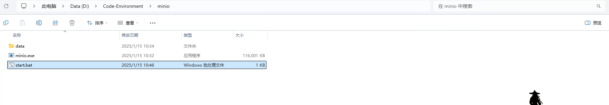

## 1.7 基本操作

### 1.7.1 存储桶管理

- 桶：用来组织管理文件对象，类似于文件夹或者目录；MinIO中的桶可以存放任意数量个文件，也可以存放目录文件夹；点击【Create Bucket】，创建桶

输入桶的名称，命名规则：

- 长度必须介于3（最小）到63（最大）个字符之间；
- 只能由小写字母、数字、点（.）和连字符（-）组成；
- 不得包含两个相邻的句点或与连字符相邻的句点；
- 不得格式化为IP地址（例如192.168.5.4）；
- 不能以前缀xn–开头；
- 不能以后缀-s3alias结尾；
- Bucket名称在分区内必须唯一；
- 这里创建名为【ssdl】的存储桶，其他都采用默认，点击【Create Bucket】创建即可；

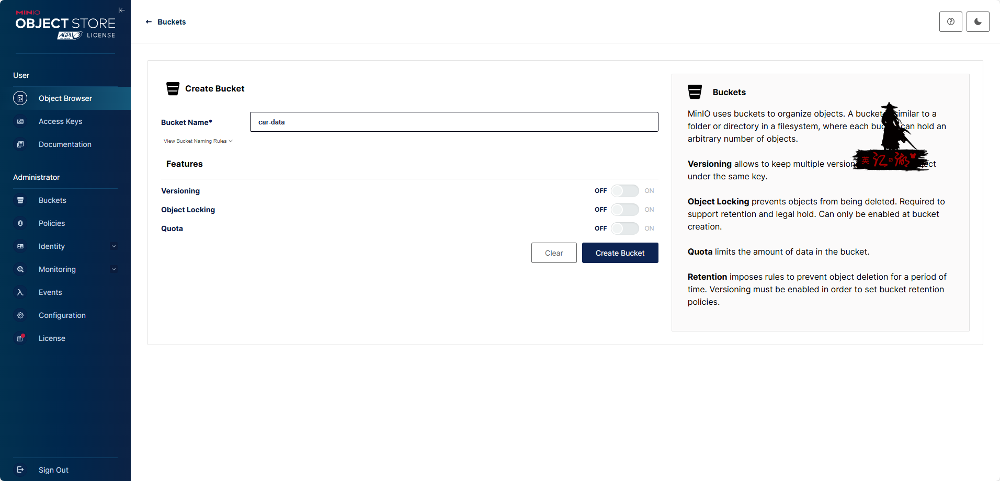

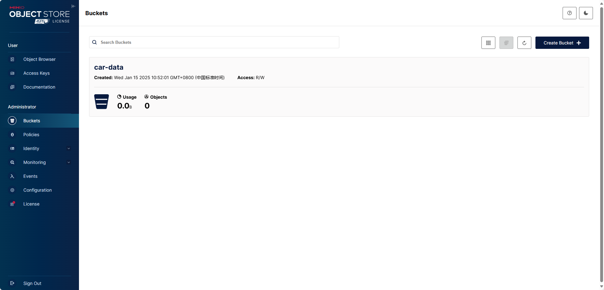

### 1.7.2 对象管理

- 对象，就是二进制数据，包括各种图片、各类文档，以及音频、视频等等；

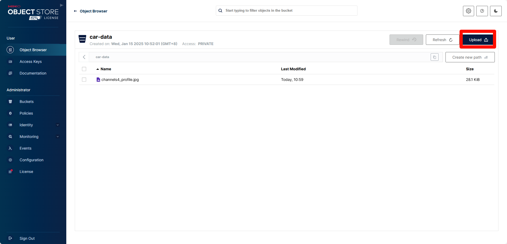

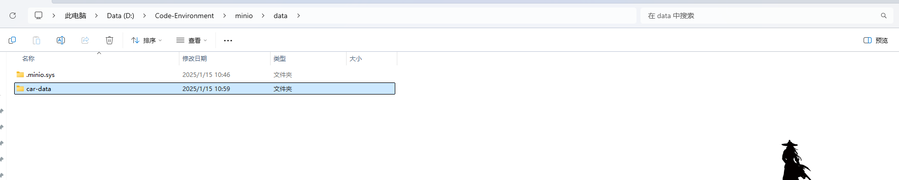

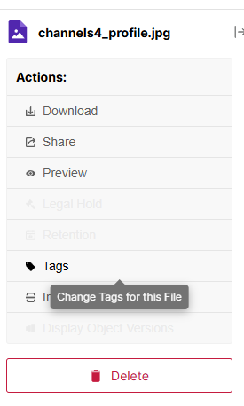

## 1.8 SpringBoot 整合

### 1.8.1 配置整合

- 依赖

```xml
    <dependency>
                <groupId>io.minio</groupId>
                <artifactId>minio</artifactId>
                <version>${minio.version}</version>
            </dependency>
```

- application.yaml

```yaml
# minio 配置
minio:
  endpoint: http://127.0.0.1:9000 #Minio服务所在地址
  bucketName: car-data #存储桶名称
  accessKey: 8uqkGMngGC3cWKggJFxr #访问的key
  secretKey: Fuofb4vUHY9UvKo10bs96yzMtweptHa7mSTz3x1C #访问的秘钥
```

- 配置类

```java
package com.pafx.config;

import io.minio.MinioClient;
import lombok.Data;
import lombok.extern.slf4j.Slf4j;
import org.springframework.boot.context.properties.ConfigurationProperties;
import org.springframework.context.annotation.Bean;
import org.springframework.context.annotation.Configuration;


/**
 * @Description minio配置类
 * @Author EasonShu
 * @Data 2025/1/15 下午1:06
 */
@Data
@Configuration
@ConfigurationProperties(prefix = "minio")
@Slf4j
public class MinioConfig {
    private String endpoint;
    private String accessKey;
    private String secretKey;
    private String bucketName;

    @Bean
    public MinioClient minioClient() {
        return MinioClient.builder()
                .endpoint(endpoint)
                .credentials(accessKey, secretKey)
                .build();
    }
}

```

### 1.8.2 工具类

```java
package com.pafx.utils;

import com.pafx.config.MinioConfig;
import io.minio.*;
import io.minio.http.Method;
import io.minio.messages.Bucket;
import io.minio.messages.Item;
import lombok.extern.slf4j.Slf4j;
import org.springframework.beans.factory.annotation.Autowired;
import org.springframework.stereotype.Component;
import org.springframework.util.FastByteArrayOutputStream;
import org.springframework.web.multipart.MultipartFile;

import javax.annotation.Resource;
import javax.servlet.ServletOutputStream;
import javax.servlet.http.HttpServletResponse;
import java.util.ArrayList;
import java.util.List;

/**
 * @Description MMIO工具类
 * @Author EasonShu
 * @Data 2025/1/15 下午1:17
 */
@Component
@Slf4j
public class MinioUtil {
    @Autowired
    private MinioConfig prop;

    @Resource
    private MinioClient minioClient;


    /**
     * 查看存储bucket是否存在
     *
     * @return boolean
     */
    public Boolean bucketExists(String bucketName) {
        Boolean found;
        try {
            found = minioClient.bucketExists(BucketExistsArgs.builder().bucket(bucketName).build());
        } catch (Exception e) {
            e.printStackTrace();
            return false;
        }
        return found;
    }

    /**
     * 创建存储bucket
     *
     * @return Boolean
     */
    public Boolean makeBucket(String bucketName) {
        try {
            minioClient.makeBucket(MakeBucketArgs.builder()
                    .bucket(bucketName)
                    .build());
        } catch (Exception e) {
            e.printStackTrace();
            return false;
        }
        return true;
    }

    /**
     * 删除存储bucket
     *
     * @return Boolean
     */
    public Boolean removeBucket(String bucketName) {
        try {
            minioClient.removeBucket(RemoveBucketArgs.builder()
                    .bucket(bucketName)
                    .build());
        } catch (Exception e) {
            e.printStackTrace();
            return false;
        }
        return true;
    }


    /**
     * 获取全部bucket
     */
    public List<Bucket> getAllBuckets() {
        try {
            List<Bucket> buckets = minioClient.listBuckets();
            return buckets;
        } catch (Exception e) {
            e.printStackTrace();
        }
        return null;
    }


    /**
     * 文件上传
     *
     * @param file 文件
     * @return Boolean
     */
    public String upload(MultipartFile file) {
        String originalFilename = file.getOriginalFilename();
        if (StringUtils.isBlank(originalFilename)) {
            throw new RuntimeException();
        }
        String fileName = UuidUtils.generateUuid() + originalFilename.substring(originalFilename.lastIndexOf("."));
        String objectName = CommUtils.getNowDateLongStr("yyyy-MM-dd") + "/" + fileName;
        try {
            PutObjectArgs objectArgs = PutObjectArgs.builder().bucket(prop.getBucketName()).object(objectName)
                    .stream(file.getInputStream(), file.getSize(), -1).contentType(file.getContentType()).build();
            //文件名称相同会覆盖
            minioClient.putObject(objectArgs);
        } catch (Exception e) {
            e.printStackTrace();
            return null;
        }
        return objectName;
    }

    /**
     * 预览图片
     *
     * @param fileName
     * @return
     */
    public String preview(String fileName) {
        // 查看文件地址
        GetPresignedObjectUrlArgs build = new GetPresignedObjectUrlArgs().builder().bucket(prop.getBucketName()).object(fileName).method(Method.GET).build();
        try {
            String url = minioClient.getPresignedObjectUrl(build);
            return url;
        } catch (Exception e) {
            e.printStackTrace();
        }
        return null;
    }

    /**
     * 文件下载
     *
     * @param fileName 文件名称
     * @param res      response
     * @return Boolean
     */
    public void download(String fileName, HttpServletResponse res) {
        GetObjectArgs objectArgs = GetObjectArgs.builder().bucket(prop.getBucketName())
                .object(fileName).build();
        try (GetObjectResponse response = minioClient.getObject(objectArgs)) {
            byte[] buf = new byte[1024];
            int len;
            try (FastByteArrayOutputStream os = new FastByteArrayOutputStream()) {
                while ((len = response.read(buf)) != -1) {
                    os.write(buf, 0, len);
                }
                os.flush();
                byte[] bytes = os.toByteArray();
                res.setCharacterEncoding("utf-8");
                // 设置强制下载不打开
                // res.setContentType("application/force-download");
                res.addHeader("Content-Disposition", "attachment;fileName=" + fileName);
                try (ServletOutputStream stream = res.getOutputStream()) {
                    stream.write(bytes);
                    stream.flush();
                }
            }
        } catch (Exception e) {
            e.printStackTrace();
        }
    }

    /**
     * 查看文件对象
     *
     * @return 存储bucket内文件对象信息
     */
    public List<Item> listObjects() {
        Iterable<Result<Item>> results = minioClient.listObjects(
                ListObjectsArgs.builder().bucket(prop.getBucketName()).build());
        List<Item> items = new ArrayList<>();
        try {
            for (Result<Item> result : results) {
                items.add(result.get());
            }
        } catch (Exception e) {
            e.printStackTrace();
            return null;
        }
        return items;
    }

    /**
     * 删除
     *
     * @param fileName
     * @return
     * @throws Exception
     */
    public boolean remove(String fileName) {
        try {
            minioClient.removeObject(RemoveObjectArgs.builder().bucket(prop.getBucketName()).object(fileName).build());
        } catch (Exception e) {
            return false;
        }
        return true;
    }

}
```

### 1.8.3 请求接口

```java
  /**
     * 上传文件
     */
    @PostMapping(value = "/upload", consumes = "multipart/form-data")
    @ApiOperation(value = "1:文件上传")
    public Result upload(@RequestParam("file") MultipartFile file) {
        String data = minioUtil.upload(file);
        String url = prop.getEndpoint() + "/" + prop.getBucketName() + "/" + data;
        SysAttachment sysAttachment = new SysAttachment();
        sysAttachment.setStorageMode(StorageModeEnum.MinIO.name());
        sysAttachment.setOriginName(file.getOriginalFilename());
        sysAttachment.setObjectName(data);
        try {
            sysAttachment.setHash(calculateFileMD5(file));
        } catch (NoSuchAlgorithmException | IOException e) {
            sysAttachment.setHash("");
        }
        sysAttachment.setMimeType(file.getContentType());
        SimpleDateFormat sdf = new SimpleDateFormat("yyyy-MM-dd");
        String storagePath = sdf.format(new Date());
        sysAttachment.setStoragePath(storagePath);
        String originalFileName = file.getOriginalFilename();
        if (originalFileName != null && originalFileName.contains(".")) {
            sysAttachment.setSuffix(originalFileName.substring(originalFileName.lastIndexOf(".") + 1));
        }
        sysAttachment.setSizeByte(String.valueOf(file.getSize()));
        sysAttachment.setSizeInfo(humanReadableByteCountBin(file.getSize()));
        sysAttachment.setUrl(url);
        sysAttachment.setRemark("");
        sysAttachment.setCreatTime(new Date());
        sysAttachment.setSystemId(1);
        boolean saved = sysAttachmentService.save(sysAttachment);
        if (!saved) {
            return Result.fail("上传失败");
        }
        return Result.success(sysAttachment);
    }
```

### 1.8.4 表结构设计

```sql
DROP TABLE IF EXISTS sys_attachment;
CREATE TABLE sys_attachment(
    `attachment_id` INT AUTO_INCREMENT COMMENT '自增Id' ,
    `storage_mode` VARCHAR(90) NOT NULL DEFAULT 'local' COMMENT '存储模式:local=本地,oss=阿里云,qiniu=七牛云,cos=腾讯云' ,
    `origin_name` VARCHAR(90) NOT NULL  COMMENT '原文件名' ,
    `object_name` VARCHAR(90) NOT NULL  COMMENT '新文件名' ,
    `hash` VARCHAR(255) NOT NULL  COMMENT '文件hash' ,
    `mime_type` VARCHAR(90) NOT NULL  COMMENT '资源类型' ,
    `storage_path` VARCHAR(255) NOT NULL  COMMENT '存储目录' ,
    `suffix` VARCHAR(90) NOT NULL  COMMENT '文件后缀' ,
    `size_byte` VARCHAR(255) NOT NULL  COMMENT '字节数' ,
    `size_info` VARCHAR(255) NOT NULL  COMMENT '文件大小' ,
    `url` VARCHAR(90) NOT NULL  COMMENT 'url地址' ,
    `remark` VARCHAR(255)   COMMENT '备注' ,
    `creat_time` DATETIME NOT NULL  COMMENT '创建时间' ,
    `system_id` INT  DEFAULT 1 COMMENT '系统id' ,
    PRIMARY KEY (attachment_id)
)  COMMENT = '附件信息表';
```

### 1.8.5 测试

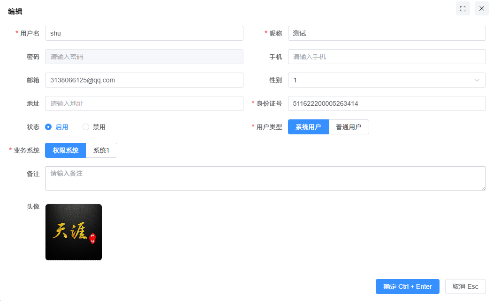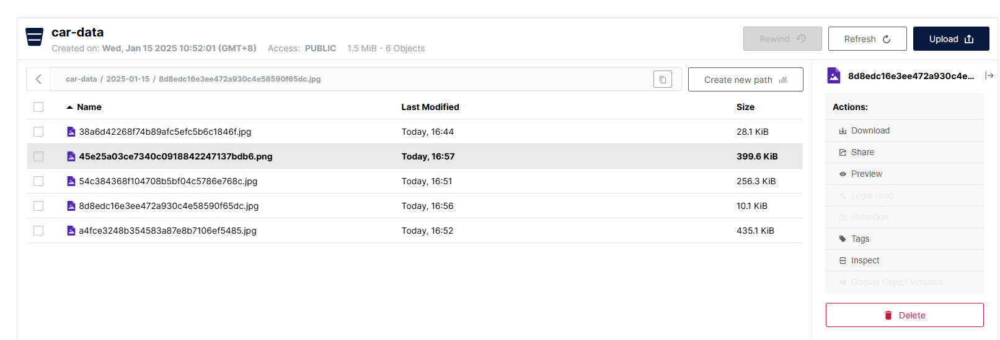

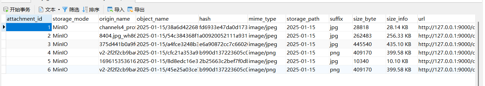
