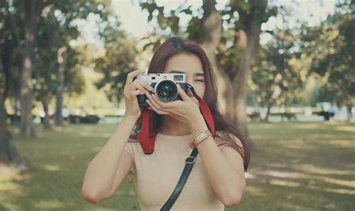

- https://mubu.com/doc/cU_C0pU2BJ
- 参考课程：【从零开始手把手教你学摄影，20节课带你从小白到大师 | 摄影前期拍摄入门教程】https://www.bilibili.com/video/BV1pv411H78e?p=2&vd_source=d1be7a4fa41169e519ea11876b261491

摄影当然是一种艺术，他是一门比较年轻的艺术表现手法，摄影艺术是高科技时代的必然产物，摄影艺术是对生活的高度概括，是源于生活又高于生活的影像表达艺术，是一种瞬间记录的写实高雅文化，摄影用自己的语言来诠释艺术。
