# 认识摄影

## 2.1 相机种类

- 微单相机：没有反光板的相机，但可换镜头、可电子取景
- 单反相机：单镜头反光的缩写，有一个镜头和一个反光板（取下镜头，相机里有一个小镜子）
- 卡片机：卡片机一般指小巧的、便携的、不可更换镜头的相机
- 运行相机： 就是在运动场景下用来拍摄的相机。

我们生活的相机基本上这几种
单反VS微单：
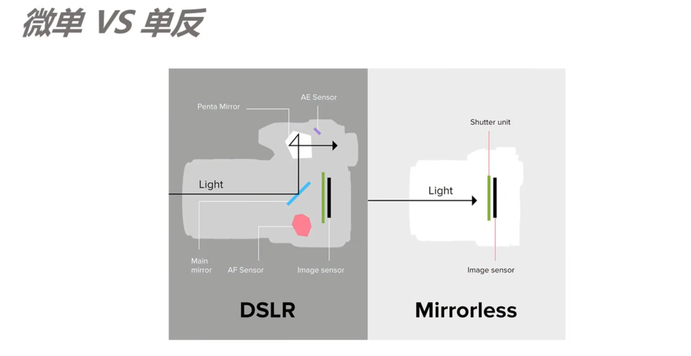

- 单反相机：单反相机通过反光镜将光线引导到取景器，使你能够实时看到通过镜头的场景。当你按下快门时，反光镜会翻起，光线进入感光元件（传感器或底片），进行曝光。
- 微单相机：微单相机没有传统的反光镜和光学取景器。相机通过电子取景器或LCD屏幕来实时显示通过镜头的图像，无需反光镜翻起。
## 2.1 传感器大小分类
- CMOS：CMOS传感器是目前主流的传感器技术，被广泛用于数码相机和手机摄像头，它们使用较少的电力，具有更好的功耗性能，同时也可以实现较高的集成度，包括在同一芯片上集成图像处理电路。
- CMOS传感器制造成本相对较低，也使得相机更加轻薄紧凑。
  

- 残幅（半画幅）&全画幅的对比

## 3.1 相机厂商

- **哈苏 Hasselblad**

  1906年，维克多·哈苏出生于瑞典哥德堡，是哈苏相机背后的缔造者，1941 年，哈苏 Hasselblad品牌诞生。哈苏相机见证并记录了人类发展史上众多里程碑瞬间，包括人类首次登月。
  哈苏在太空中最具标志性的时刻之一，是阿波罗 11 号登陆月球的瞬间——这是人类首次离开自己星球。一台哈苏 500EL 相机被选中，用以记录这一历史性时刻，也因此成为了首台登月相机。
  2016 年，哈苏推出史上第一台无反中画幅数码相机 X1D-50c，让中画幅走入更多大众的视野。
  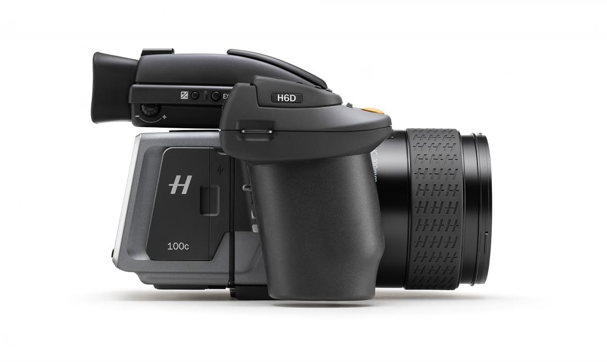

- **飞思Phase One**

  飞思Phase One A/S成立于90年代初期，是世界领先的中画幅数码摄影系统和为专业摄影师提供成像解决方案和工业应用的供应商。飞思总部设在丹麦哥本哈根，在纽约、东京、科隆、上海和特拉维夫设有办事处。
  飞思相机由XF机身、数码后背、镜头三部分组成。数码后背有IQ4、IQ3两个系列。XF IQ4 150MP相机系统是世界上的第一台1.51亿像素相机，其传感器面积是35mm全画幅的2.5倍，宽容度达到了15档。
  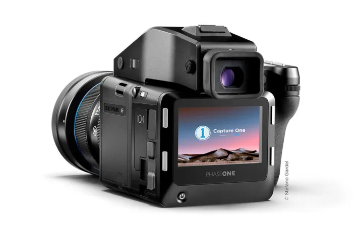

- **徕卡Leica**

  徕卡Leica是由一家同名的德国公司生产的照相机的品牌，由徕茨Leitz和照相机Camera的前音节组成。徕卡是135画幅的开创者，第一台135画幅相机就是徕卡生产的。
  

- **理光Ricoh**
  
    1936年，市村清成立理化学研究所，1963年公司名称变更为株式会社理光。2011年10月1日作为理光100%出资子公司，成立了宾得理光映像株式会社。2013年8月1日，公司名变更为理光映像株式会社。主要相机有：PENTAX/宾得中画幅专业数码单反相机645Z和理光RICOH GR III便携数码相机。
    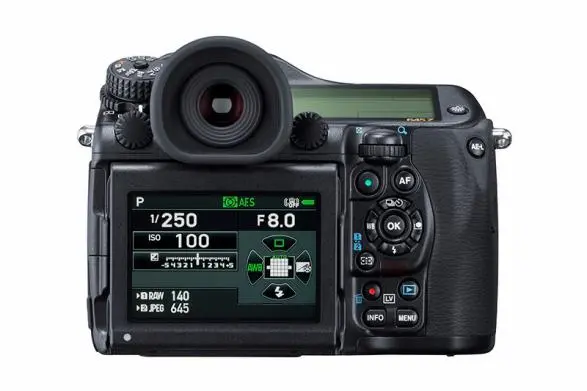
    
- **富士Fujifilm**
  
  1934年1月，为了实现胶片国产化目标，富士胶片的前身——富士写真胶片株式会社于1934年在日本成立。主要相机有：FUJIFILM GFX 50S中画幅无反数码相机和FUJIFILM X100F无反数码相机。目前即将推出GFX 100中画幅无反数码相机。
      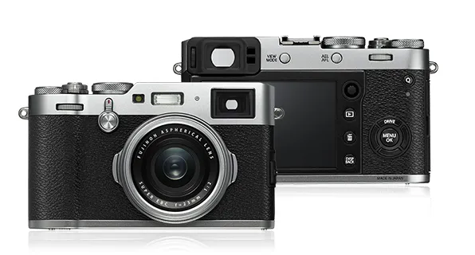
  
-  **佳能Canon**
   
      佳能公司的创始人是位日本医学博士，取此名的灵感出自他抬头眺望天空而来。佳能公司原来的名字叫“精机光学研究所”，是一个精密光学仪器研究所，于1933年在东京成立。1934年，佳能试制日本第一台35mm焦平面快门照相机。1937年，佳能股份有限公司前身“精机光学工业株式会社”成立。佳能相机产品主要有EOS单反/无反相机、EF/RF镜头、小型数码相机。
       
      
- **尼康Nikon**
  
  尼康Nikon成立于1917年，前身为日本光学工业株式会社，1988年更名为尼康株式会社。“尼康（Nikon）”名称来自“日本光学”日文读音（Nippon Kogaku）的罗马字母缩写，并且融合了德文中蔡司照相机ZeissIkon中kon的写法。尼康其众多的相机产品中，最主要的有尼康D系列的数码单反相机、尼克尔（Nikkor）相机镜头、Z系列无反相机、消费型数码相机Coolpix系列。
  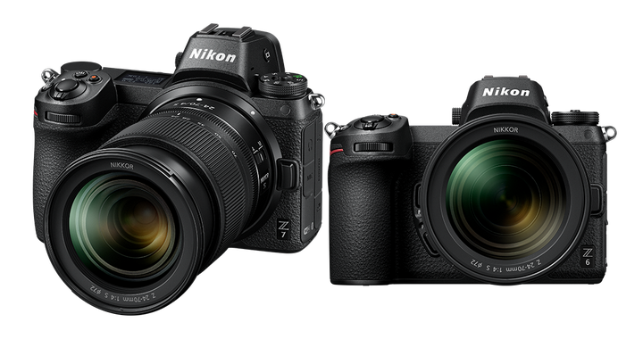
  
-  **索尼Sony**
   
    1946年，38岁的井深大和25岁的盛田昭夫凭着四处筹措的19万日元现金，成立了“东京通信工业株式会社”。1955年，井深和盛田，又一次做出了伟大的决定，为了让公司走向世界，制作了新的产品商标——Sony，并最终将公司名称也改为Sony。“Sony"是由表示声音的拉丁文词根“sonus”和含义为“聪明可爱”的“sonny”两个词组成而来的，其语源为“一个活泼调皮的小孩”。代表产品：全幅微单A9、A7系列。
    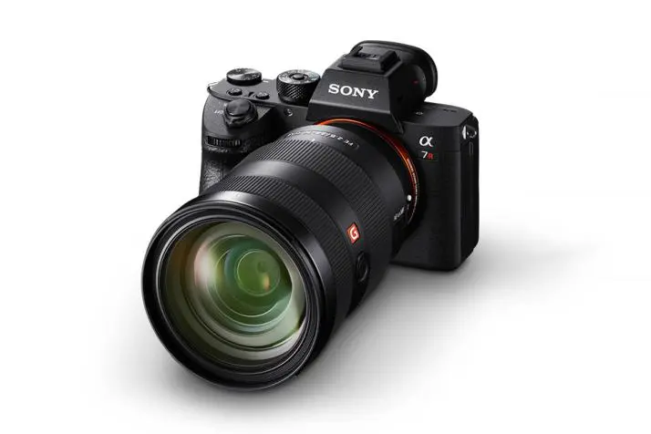
    
-  **松下Panasonic**
   
      松下电器产业株式会社创建于1918年，创始人是被誉为“经营之神”的松下幸之助先生。创立之初是由3人组成的小作坊，其中之一是后来三洋的创始人井植岁男先生。Panasonic的中文为“松下”，早期叫National，1986年开始逐步更改为Panasonic，2008年10月1日起全部统一为Panasonic。代表产品：LUMIX S1R全画幅无反相机、LUMIX GH5 M4/3无反相机。

- **奥林巴斯Olympus**

  1919年，创始人山下长建立高千穗制作所。1942年，高千穗制作所更名为高千穗光学有限公司，光学产品成为公司的主要支柱。1949 年，再次更名为奥林巴斯光学有限公司，意在提升企业形象。2003年，公司更名为奥林巴斯公司。在希腊神话中，奥林匹斯山是十二个至高无上的神居住的地方。奥林巴斯则以此山命名，反映其打造世界驰名的高质量产品的强烈愿望。自高千穗制作所（奥林巴斯公司的前身)时期以来，就一直使用“Olympus”作为商标。代表产品：OM-D E-M5 Mark II微型单电相机。

## 4.1 相机厂商产品线

- 佳能

- 尼康

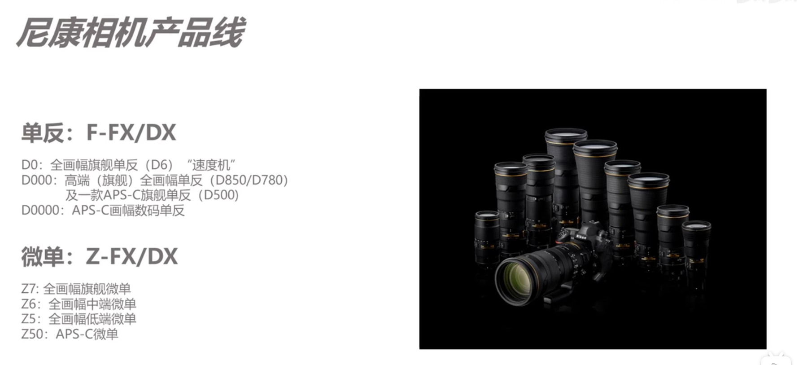

- 索尼

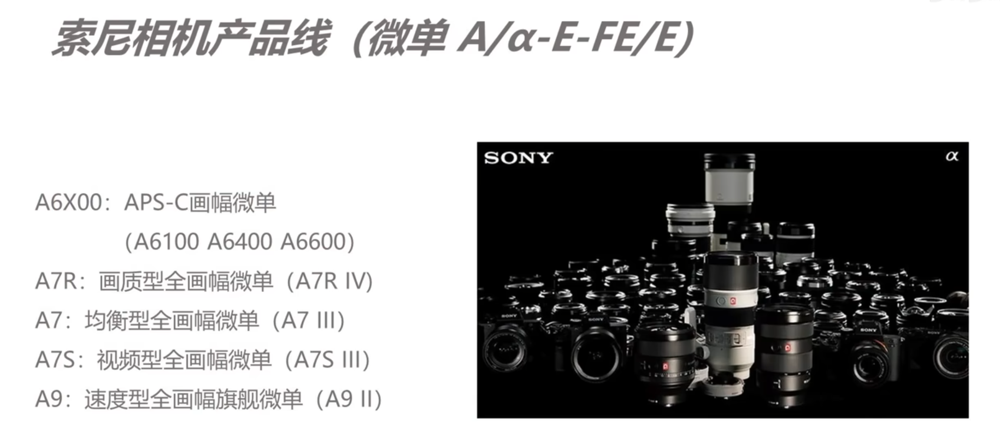
- 原厂：自己的相机品牌配自己的镜头
- 副厂：反之

## 5.1 焦距

### 5.1.1 认识焦距

- 焦距：我们都知道相机的成像原理是小孔成像，所以在数码相机中，焦距是指镜头小孔到传感器的距离，单位是mm（毫米）。
- 特点：焦距越小，视野范围越大，反之越大

- 16毫米的超广角：拍摄大景的风光照片
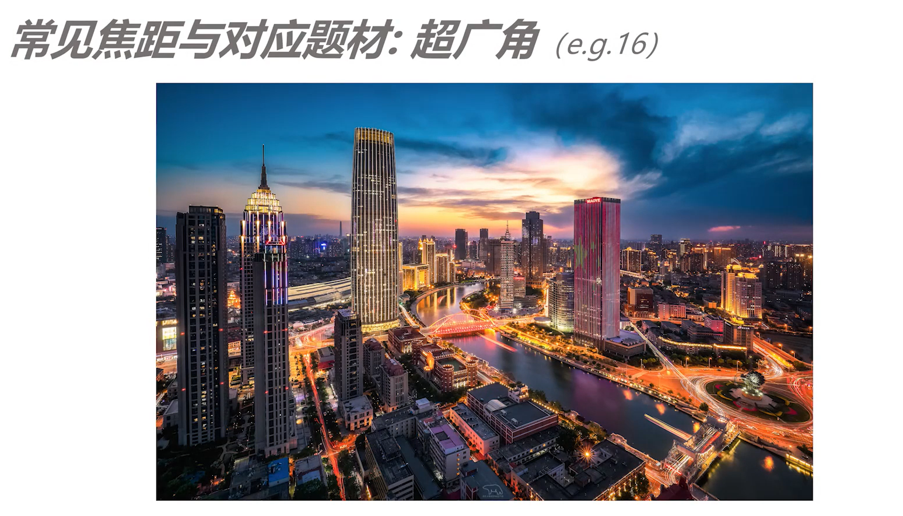
- 24毫米：也是拍摄风光，但是没有16毫米那么广阔和有冲击力，拍摄室内的照片
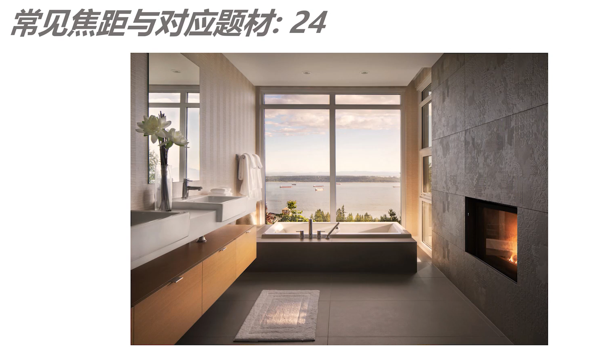

- 35毫米：拍摄人文、街拍，能以正常的比例去显示人物，同时能容纳一定条件的背景交代人物与背景的关系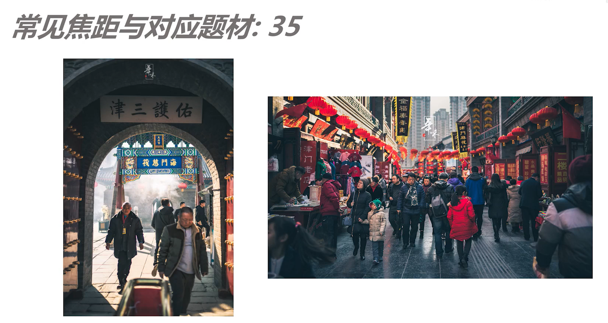

- 50毫米：比较符合人眼观看的视觉，变化是最小的，最符合我们实际看到的。拍摄人像、毕业照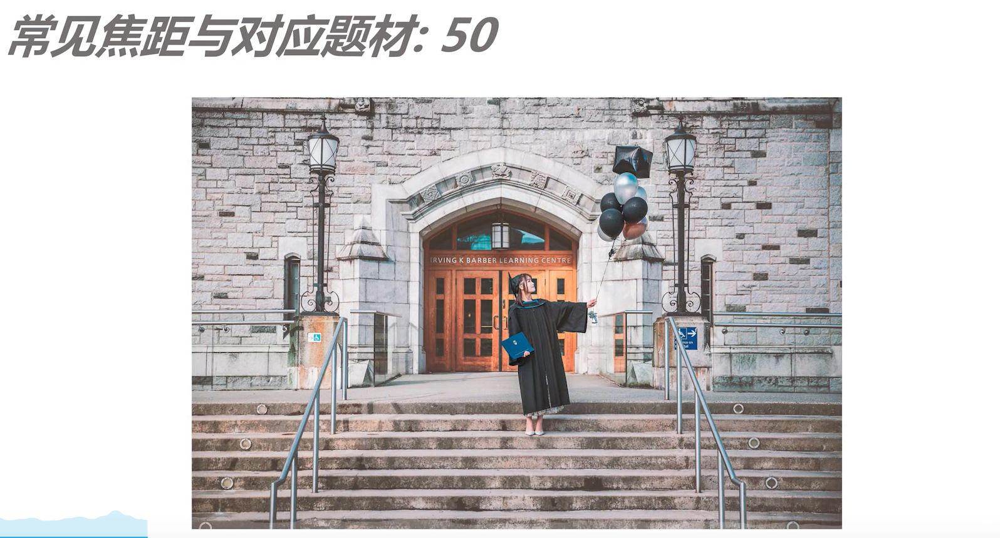

- 85毫米：人像的黄金焦段，拍摄人像的特写。可以站在远处，去拍摄一个具有压缩感的人像照片

- 200毫米的长焦：拍摄细节，比如建筑、人物、景象的细节等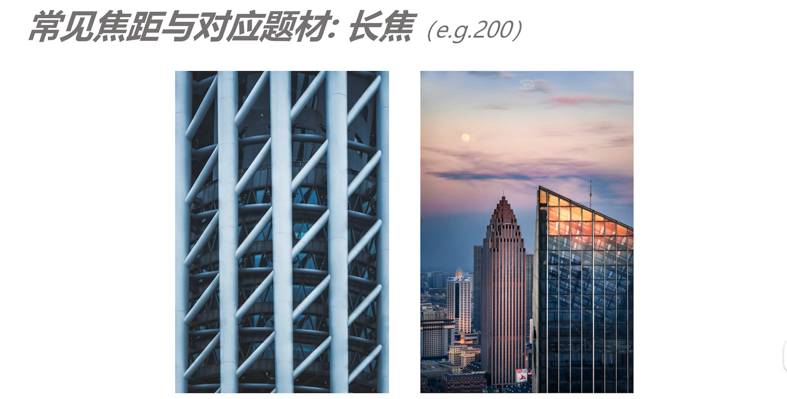

- 超长焦：300以上：拍摄野生动物、体育

- 总结：人像：35+50+85+135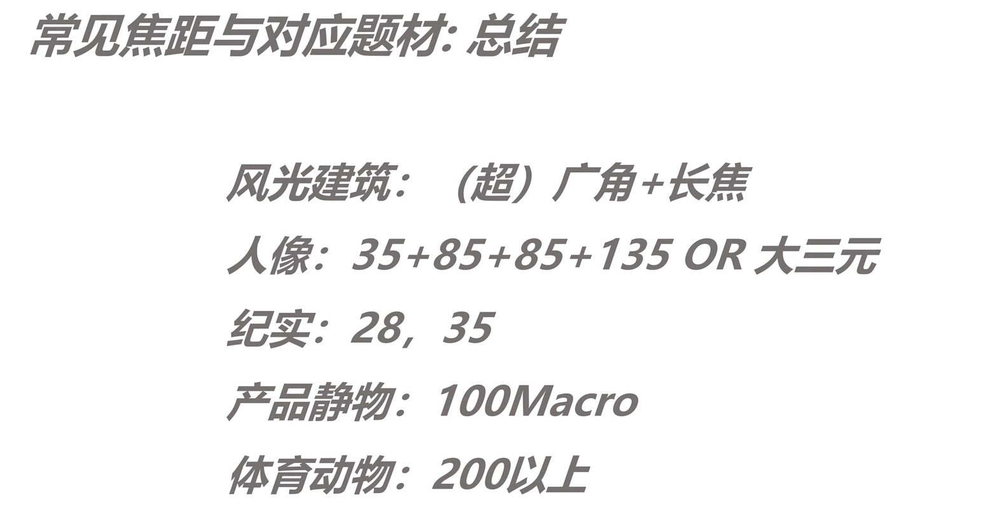
  - 任何焦段都可以拍摄任何题材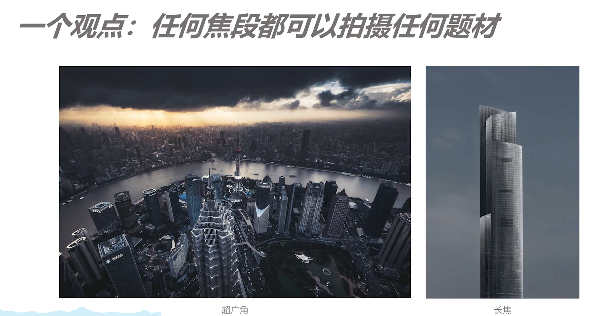

### 5.1.2 等效焦距

- 等效焦距

  - 等效焦距：根据传感器大小不同，焦段视角上会产生变化。在相同焦段的镜头下，APS-C画幅的相机比全画幅的相机视角更窄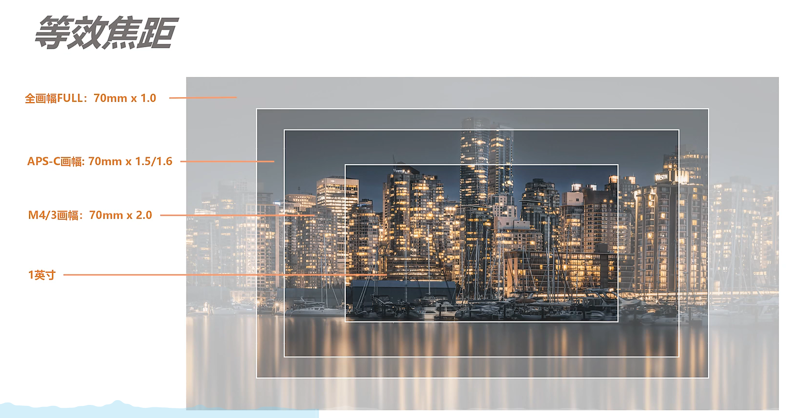

  - 转换系数

    - 全画幅：物理焦距等于实际的焦距，是一倍的关系，是正常的

    - APS-C画幅：除佳能乘1.6外，其他厂商的都会乘1.5。因为佳能的传感器大小会比其他家的稍有区别

    - M4/3画幅：乘2.0

### 5.1.3 其他分类

- 定焦镜头：要改变人物在相机中成像的大小，需要改变人物和相机之间的距离，即前后移动。如下是将人物远离镜头，从而达到减小人物在画面中成像的大小。

- 变焦镜头：要改变人物在相机中的成像大小，可以改变人物和相机之间的距离，也可以改变相机本身的焦距。如下是减小焦距，从而达到减小人物在画面中成像的大小。

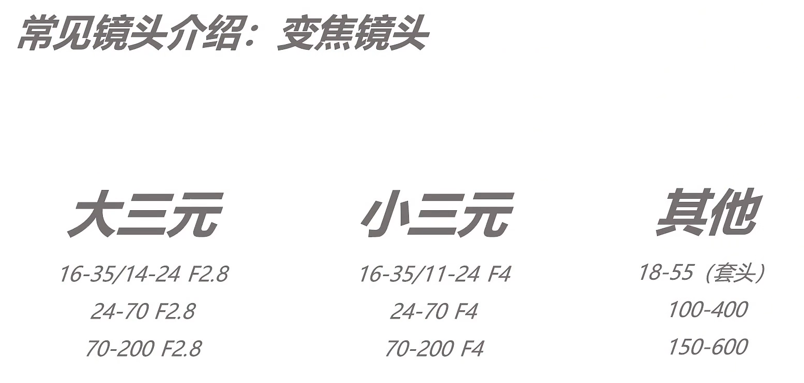

- **特种镜头：**
  

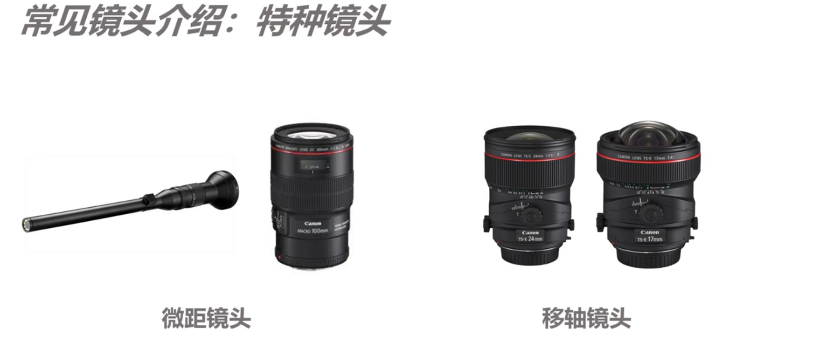

我们按照焦距的长短，大致可以分为广角镜头、标准镜头、中长焦镜头和长焦镜头。

- 广角镜头

焦距<35mm的镜头，适合拍摄大场景的照片，如风景、建筑等。

- 标准镜头

焦距在35mm~60mm区间的镜头，接近人眼视角。适合拍摄人文、静物和人像。

- 中长焦镜头

焦距在70mm-135mm区间的镜头，适合拍摄肖像。

- 长焦镜头

焦距>135mm的镜头，适合拍摄运动物体、天体。

## 5.2 镜头参数

### 5.2.1 参数认识

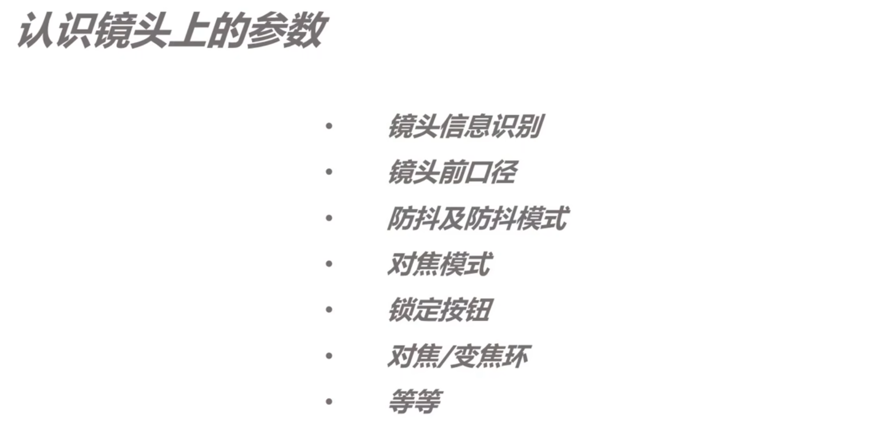

- AF：自动对焦
- MF：手动对焦
- STABILIZER：稳定器开关
- LOCK：锁定变焦环

### 5.2.2 镜头里的黑话

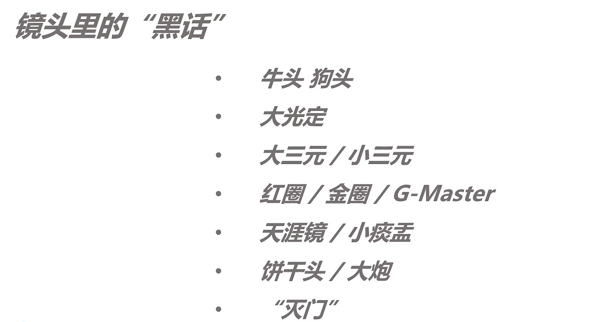

### 5.2.3 推荐

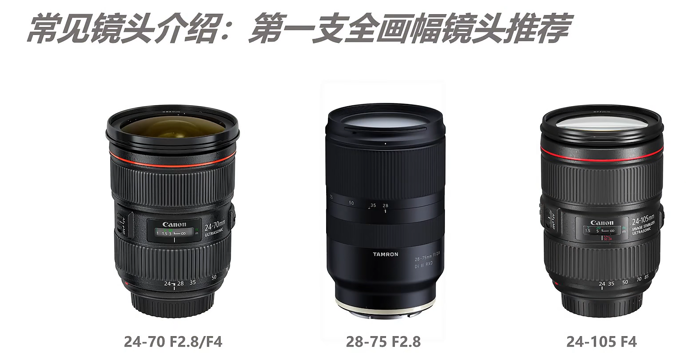

## 5.2 恒定光圈与浮动光圈

- 恒定光圈：恒定光圈变焦镜头是指不管在什么焦距下，最大光圈都保持不变的一种镜头。也就是说它的最大光圈不会受焦距变化的影响，无论你把变焦镜头设置为多少焦距，都能使用其标称的最大光圈。
- 浮动光圈：与之相对的就是非恒定光圈变焦镜头，我们日常见到的变焦镜多为非恒定光圈。
- 光圈越大，镜头上F的数值就越小
- 恒定光圈镜头比浮动光圈镜头要好
## 5.3 自动对焦与手动对焦
- **AF-S (单次AF)**
  当半按快门时开始自动对焦操作，一旦被摄体聚焦，焦点就会被锁定。
  这适用于拍摄静止物体，如风景或快照。
- **AF-C (连续AF)**
  当按下快门按钮并保持半按状态时，自动对焦操作继续进行,并不断调整焦点。
  这适用于拍摄运动物体，如运动或铁路摄影。
- **AF-A (自动AF)**
  半按快门时，相机会自动识别主题是否运动，并据此切换 AF-S 和 AF-C 两种 AF 模式。
  使用这种模式可以同时拍摄不同的物体，或者避免手动切换 AF 模式。
- **手动对焦(MF)**
  手动对焦(MF)可以让拍摄者手动进行调节而非相机自动调节。
  虽然自动对焦（AF）拍摄在数码相机中更为常用，但在自动对焦困难时，如在微距拍摄中，MF是有必要的

## 5.4 透视

- 透视，是一个绘画中的概念，指的是在二维的平面或[曲面](https://zhida.zhihu.com/search?content_id=165730681&content_type=Article&match_order=1&q=曲面&zhida_source=entity)上描绘物体的空间关系的方法或技术。
- 也就是说，透视其实就是观众在观看一个[二维画面](https://zhida.zhihu.com/search?content_id=165730681&content_type=Article&match_order=1&q=二维画面&zhida_source=entity)中的物体空间关系，当观看的角度不同，所形成的物体的空间位置、轮廓和投影不同的画面空间感。
- 透视，在绘画中是必不可少的，而作为绘画延伸的摄影，也是必须掌握的原理，是将摄影所取三维画面如何去立体的表现在二维平面上时，所必须具备的重要[摄影观念](https://zhida.zhihu.com/search?content_id=165730681&content_type=Article&match_order=1&q=摄影观念&zhida_source=entity)。

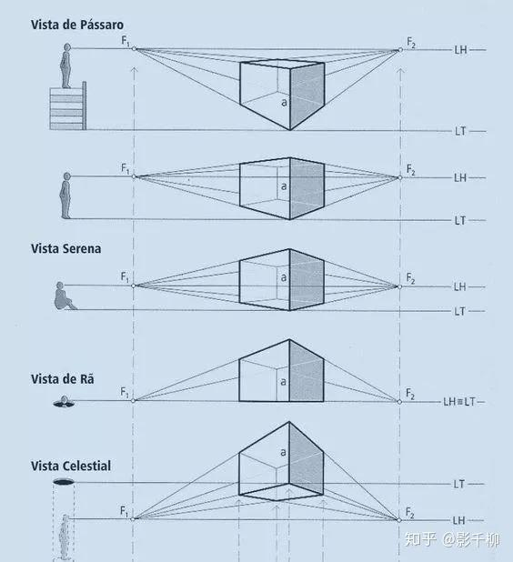

- 

### 5.4.1 透视介绍

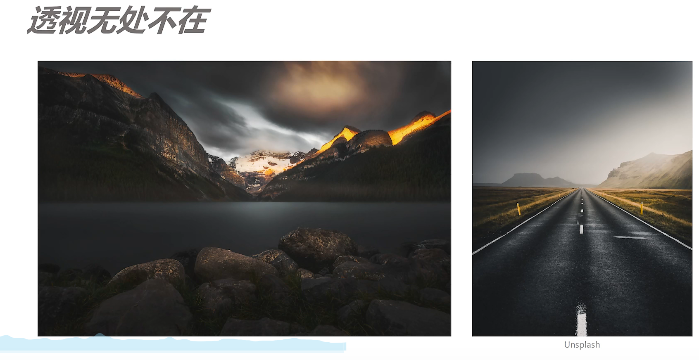

- 透视：通过一个二维的平面，来描述三维的世界
- 透视的核心：近大远小

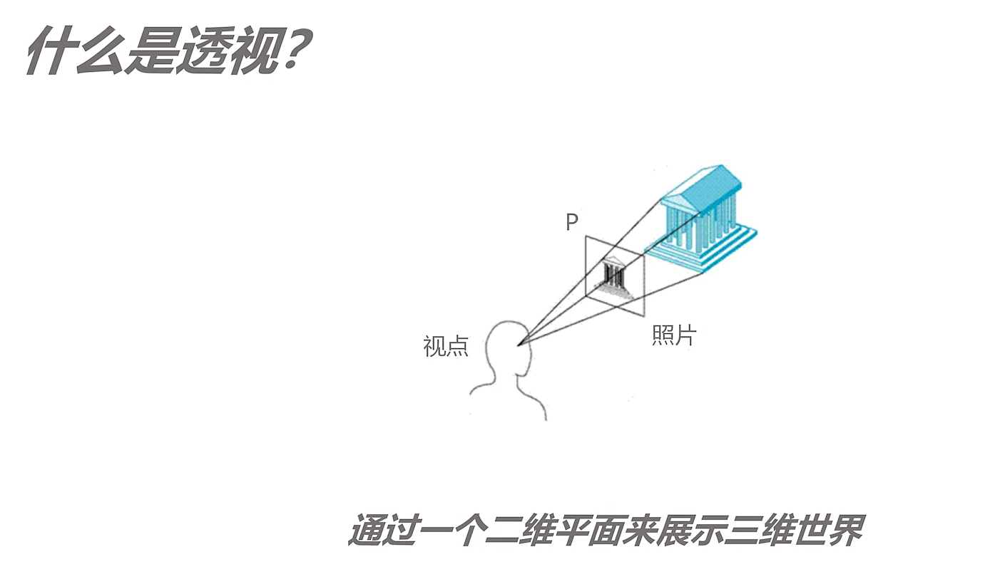

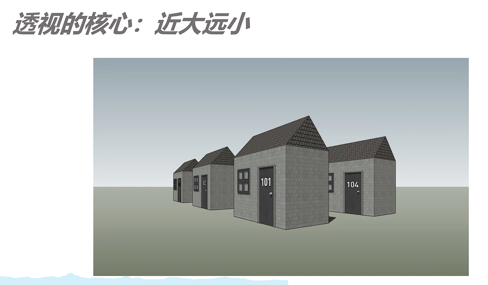

- 一点透视：画面中只有一个消失点，画面中不平行照片平面的线都会汇聚到那一个点，有一个平面会平行照片平面

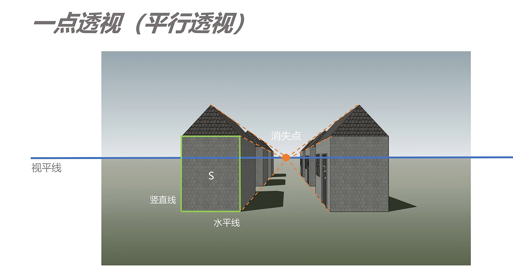

- 二点透视：画面中会有两个消失点，有竖直的线平行我们的照片平面

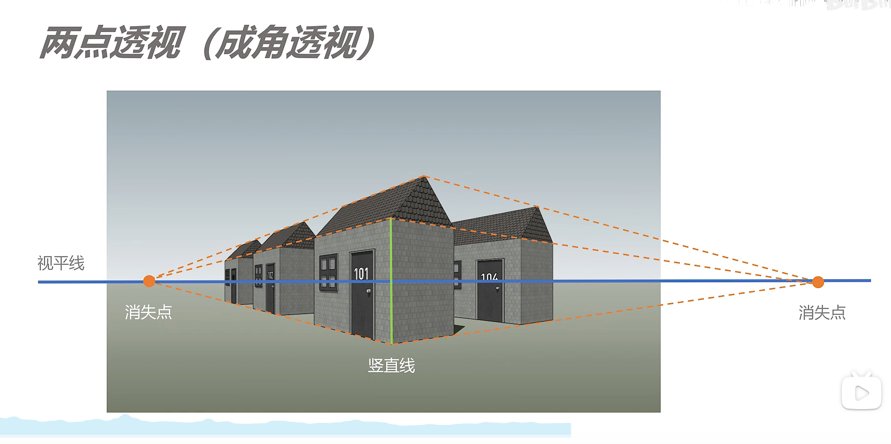

- 三点透视：画面中没有平行我们的照片平面的线。仰拍

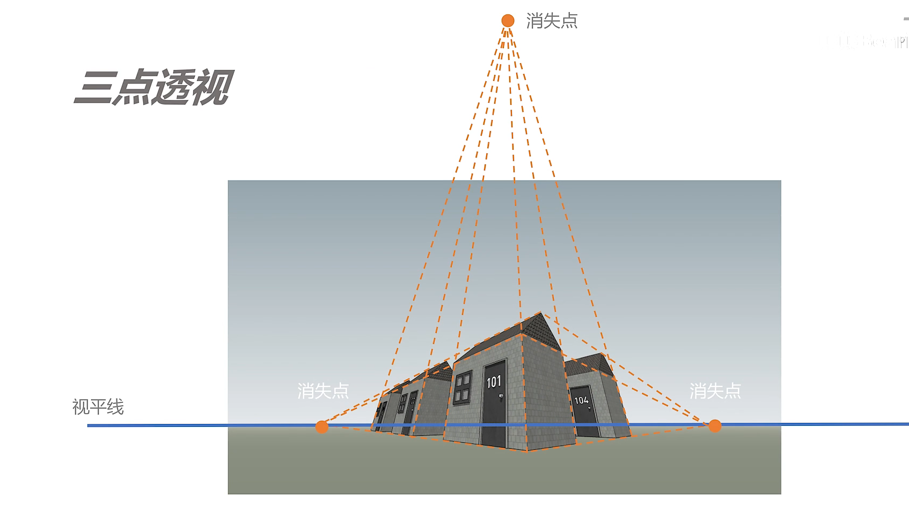

- 影响透视的核心因素：距离

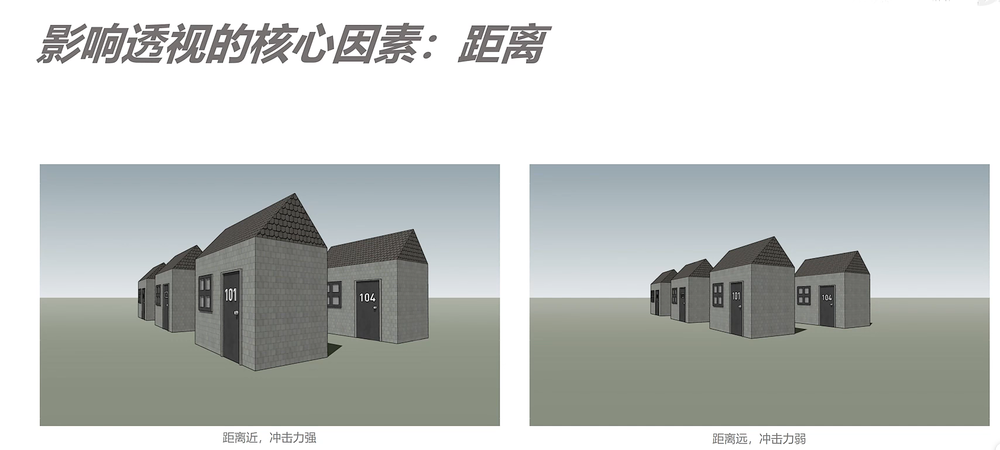

- 是因为广角离得近，近大远小，所以透视感更强，把广角贴的离主体更近，透视感更强

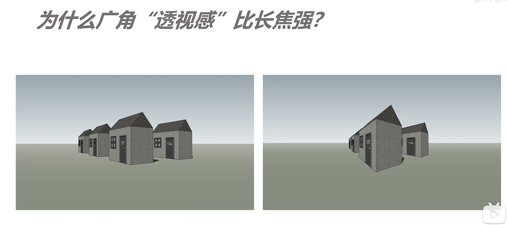

### 5.4.2 平行投影

- 平行投影：所有的线永不相交

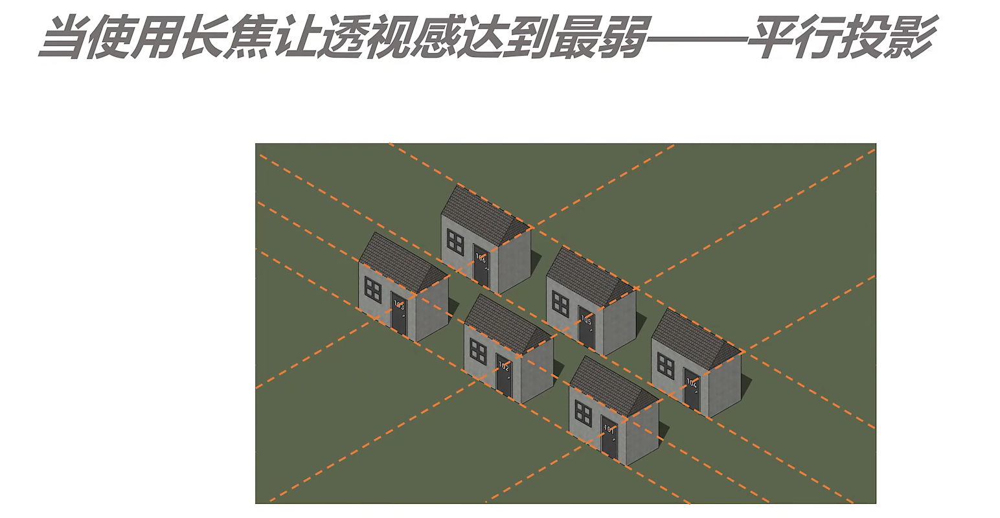

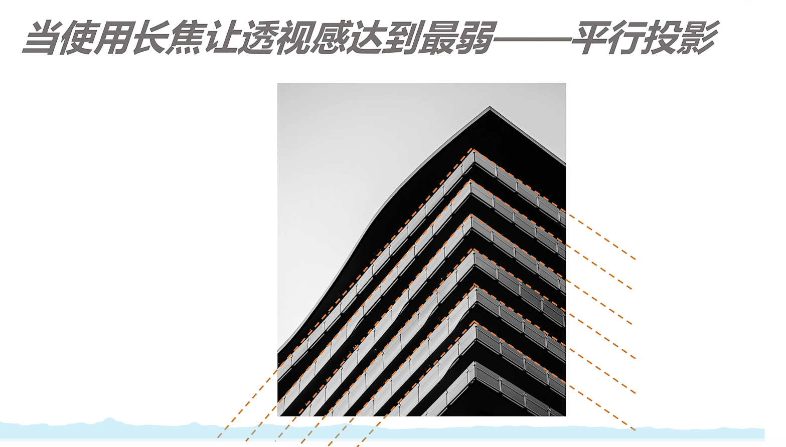
