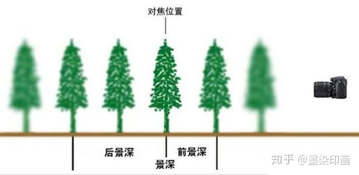
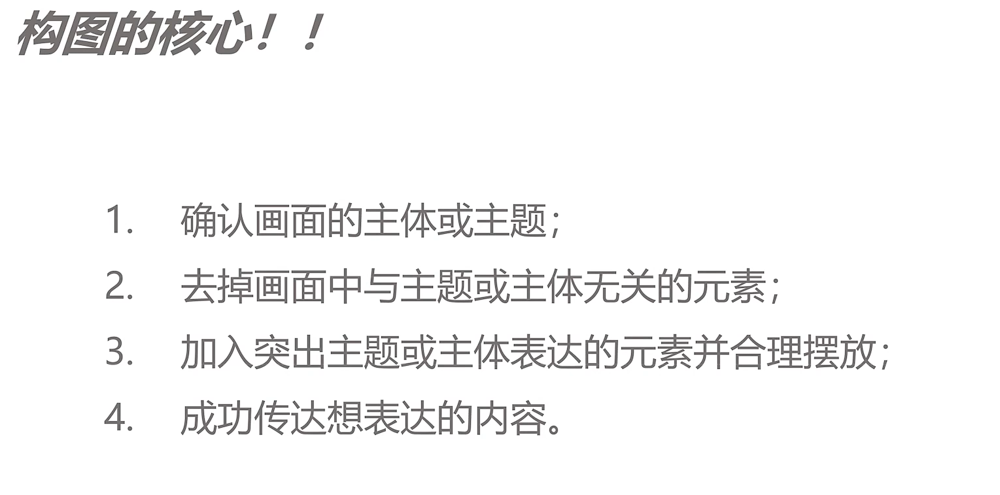

# 一 景深

## 1.1 何谓景深

大家都知道一般相机要对焦后才能拍摄，理论上照片中只有被准确对焦的部分清晰，焦点前及焦点后的景物会因在焦点以外而显得模糊。不过，基于镜头、拍摄距离等因素，在焦点前、后仍然会有一段距离的景物能够被清晰显示，不致于落入模糊地带，这个清晰的范围便称为景深。

- 使用小光圈，焦点位于画面三分之一处，从焦点前到焦点后画面清晰的区域非常广泛，便是典型的大景深。

- 焦点位于靠前的花瓣上，因为使用的光圈较大，花瓣前后这段清晰的区域比较小，这叫做小景深。

> 小景深的照片，只有焦点部分才会清晰显示，景深外的地方显得十分模糊；而大景深的照片，所有景物都显得十分清晰，两者体现在画面中效果完全不一样。
>
> - 最清晰的是焦平面
> - 拍摄时，使用大光圈，会获得一个虚化比较强的效果，叫做前景深、小景深
> - 拍摄时，使用小光圈，会获得一个清晰的画面，叫做深景深、大景深

## 1.2 构图

### 1.2.1 摄影构图的核心

- 三分法、居中法、框架法等等这些并不是摄影构图的核心，只是一种形式的表现、排放的法则。

