# （二）认识摄影

## 1.1 畸变

> [!TIP]
> 畸变：一般出现在画面的边缘，拍广角的时候一般不会让人物站在边缘

- 枕形畸变一般出现在长焦
- 桶形畸变一般出现在广角

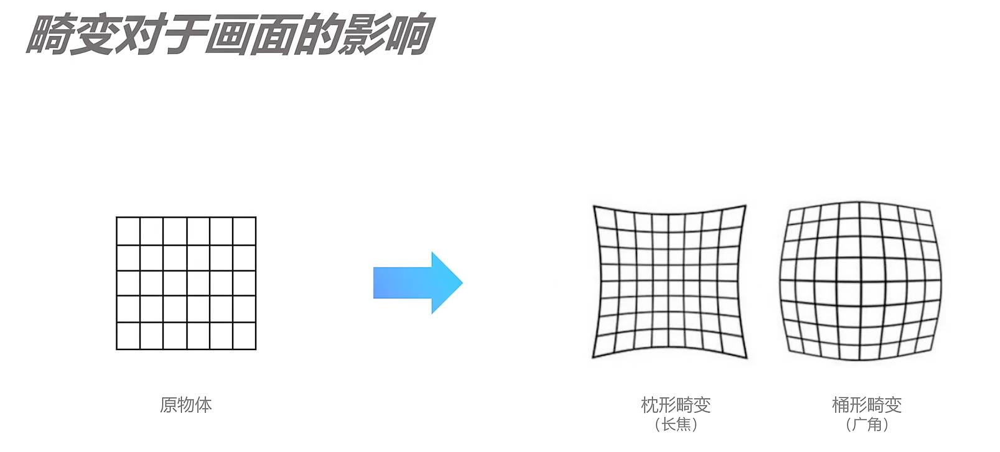

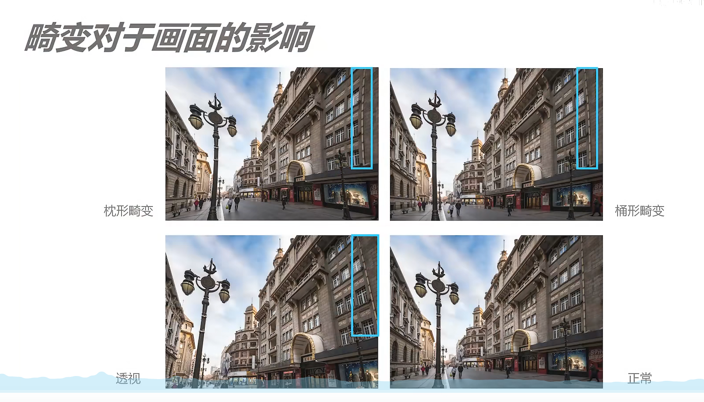

> [!TIP]
> 畸变与透视的对比：畸变是镜头问题；透视是客观存在的

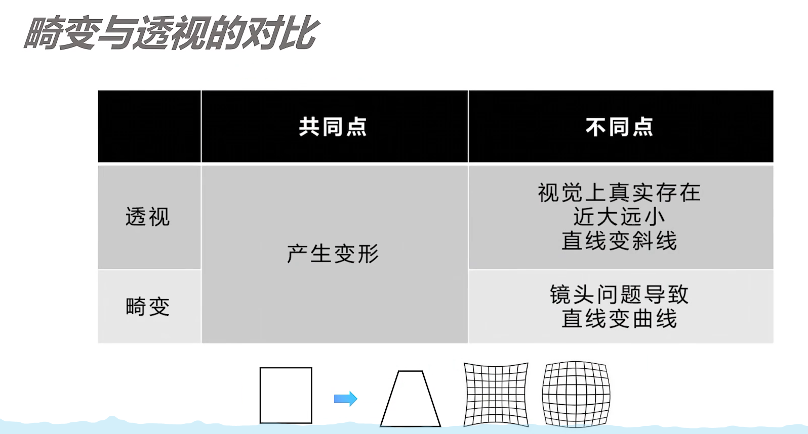

## 1.2 曝光

### 1.2.1 曝光三要素

> [!TIP]
> 曝光就是接水量，水龙头的开关就是快门的闭合，水龙头的直径就是光圈，水压的多少就是感光度

#### 1.2.1.1 光圈-F

- 光圈： 光圈：F或f代表光圈的 数值，A可能代表光圈

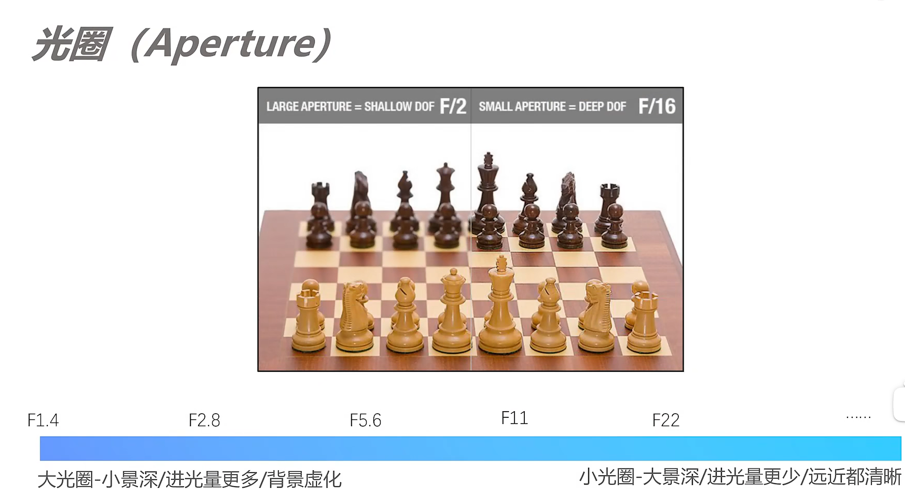

- F的数值=焦距/通光孔径
- F的数值越大，光圈越小，近光量越少，远近都清晰；F的数值越小，光圈越大，近光量越多，背景虚化。是一个反比的关系

#### 1.2.1.2 快门-S

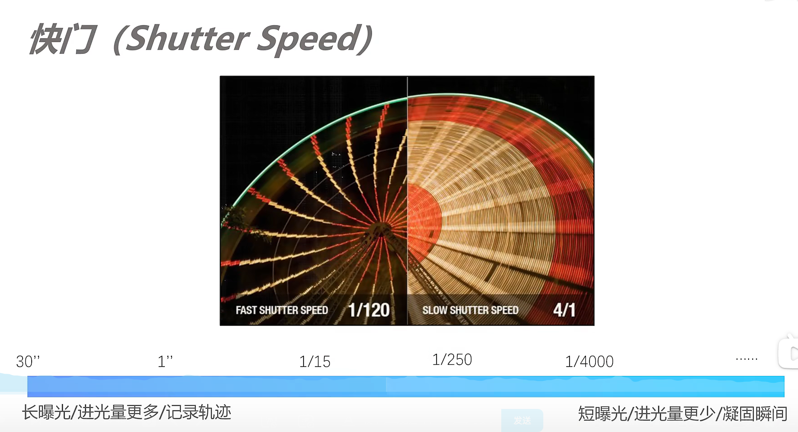

- 时间越长，快门越慢，进光量更多；时间越短，快门就越快，进光量更少。是一个正比的关系
- 秒为单位。列如：30s是长曝光；1/4000 s 是短曝光，凝固瞬间，抓拍的时候就是用高速快门

#### 1.2.1.3 感光度-ISO

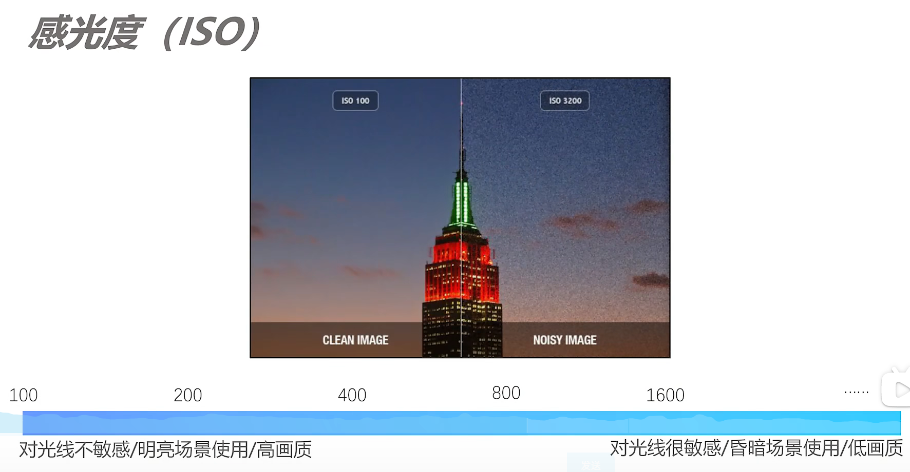

#### 1.2.1.4 关系

- 互易率：不断改变三者的参数，获得相同的曝光水平

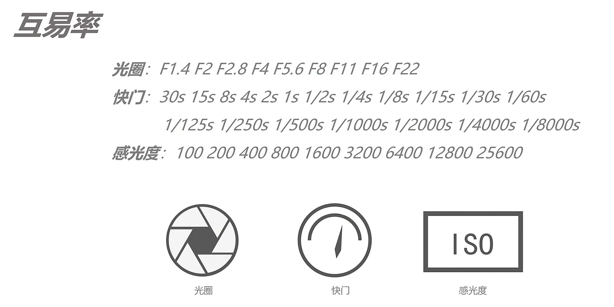

- 光圈的挡位：是一个根号2的关系，每差一挡光圈，其实是差两挡的亮度

- 快门：是一个2倍的关系，每差一档快门，也是差两挡的亮度

- 感光度：也是一个2倍的关系，每差一档快门，也是差两挡的亮度

> [!TIP]
> 结论：某个参数向一个方向调了N挡，另外一个参数向另外一个方向调N挡，就可以获得相同的曝光

### 1.2.2 曝光补偿EV

- 控制我们画面的最终亮度，同时也是快速调节画面的一个方式

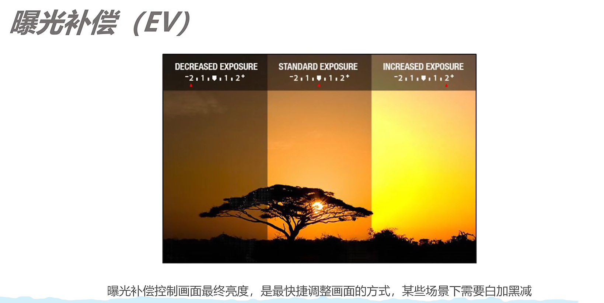

- 白加黑减：在拍摄深色、浅色物体的时候，例如煤炭、白雪，这个时候相机的测光系统是不太准确的。相机在默认0曝光补偿的时候，会把东西拍成灰色，黑煤就会变成灰媒，白雪就会变成灰雪。这个时候曝光就不准确了，为了获得准确的曝光，就需要添加一点曝光补偿，让灰雪就会变成白雪。减少一点曝光补偿，让灰煤就会变成黑媒

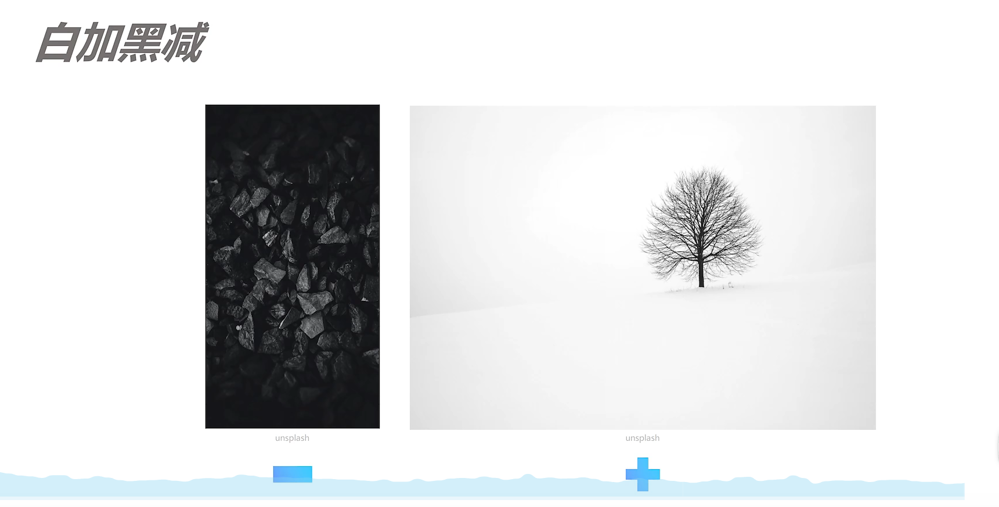

- 明暗调节的应用：O是默认的曝光补偿，-是减少了一些曝光补偿（突出灯带）

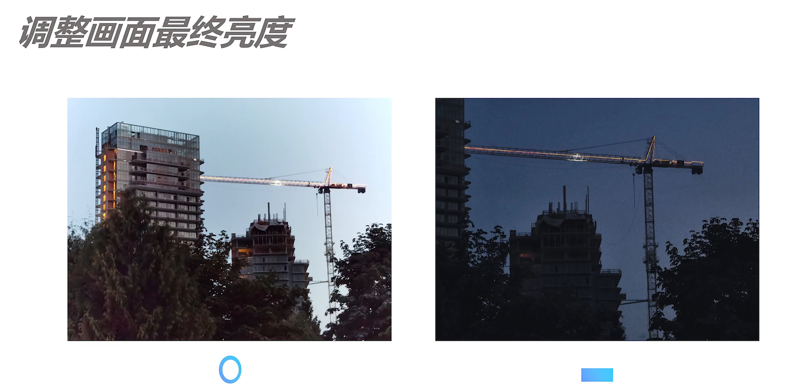

## 1.3 相机常用拍摄模式（挡位）

### 1.3.1 常见档位

- A挡
  - 光圈、快门、感光度全都不能手动调节，交给相机自动调节

- P挡

  - 感光度可以调节，可以选择手动调节、自动调节，可以调节曝光补偿

  - 旅行、抓拍可能用到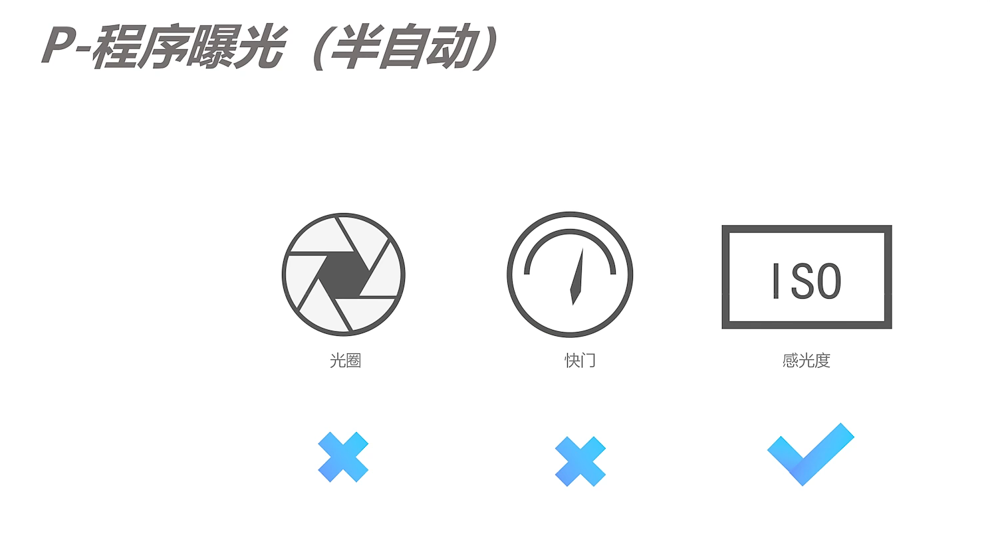

- A/AV-光圈优先

  - 可以调节光圈和感光度，快门由相机自动调节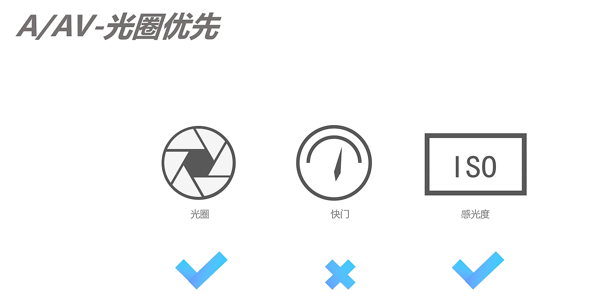

  - 拍摄例子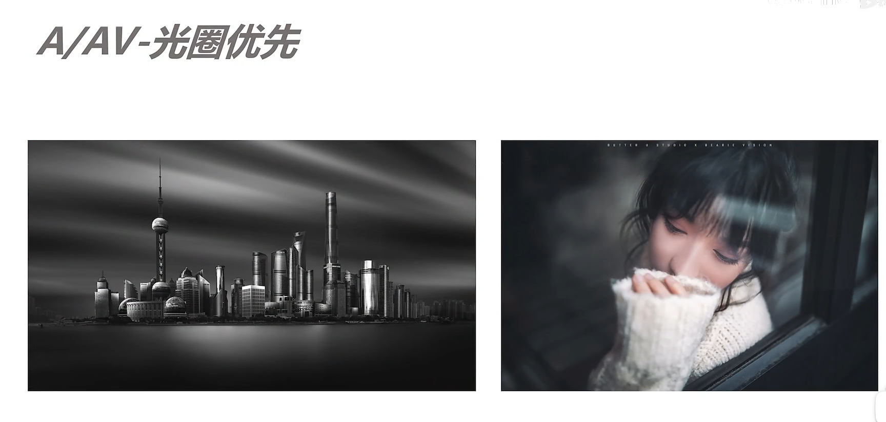

- S/TV-快门优先

  - 比较适合抓拍，体育、新闻、野生动物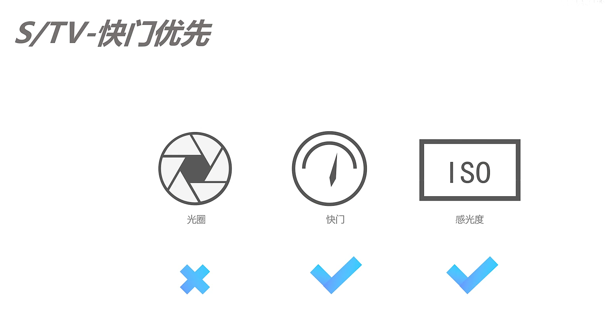

  - 拍摄例子

### 1.3.2 M档

- 光圈、快门、感光度都可以手动调节

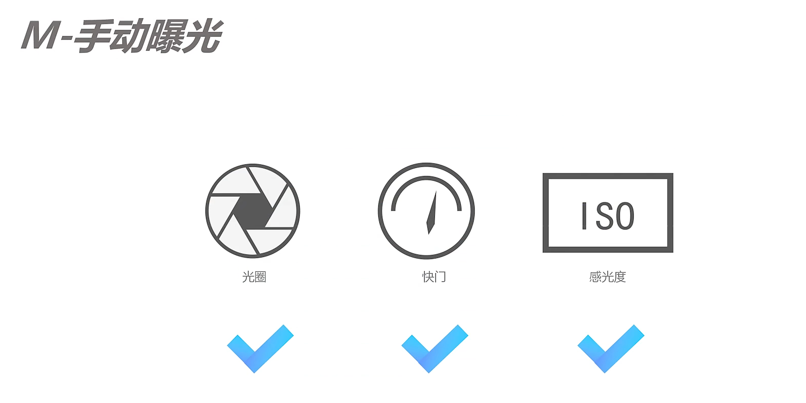

- 曝光补偿不能调节，会形成曝光表的作用
- 曝光的标尺在左边代表欠曝，在右边代表过曝，只是一个参考的作用，并不起实际控制的效果
- 误区：并不是M挡才能拍出好照片，也不是说使用M挡才是一个专业的摄影师
- 固定参数拍摄的物体、超出EV能够补偿的亮度（月亮）、复杂的光线，光线有着超大的变化（舞台光的拍摄）、使用闪光灯（下面最左边的图使用了闪光灯），使用M挡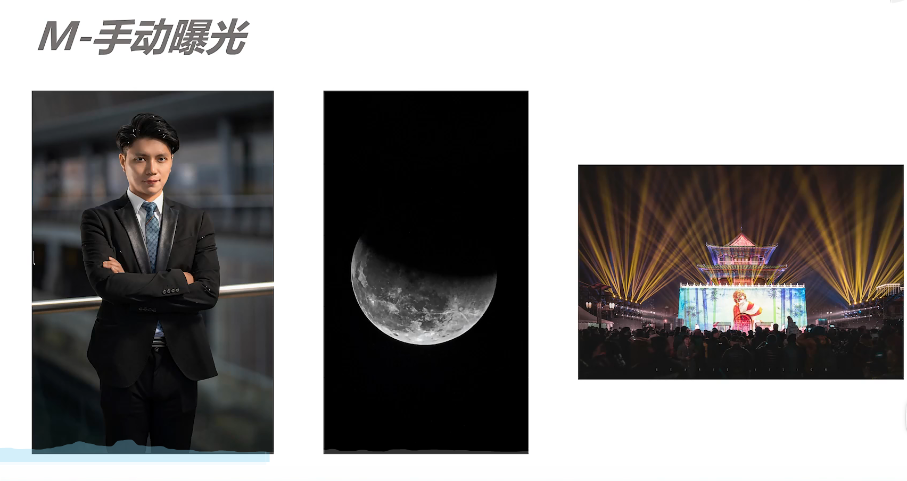

### 1.3.3 B-B门（长时间曝光）

- 拍摄长时间曝光（30s以上）会用B挡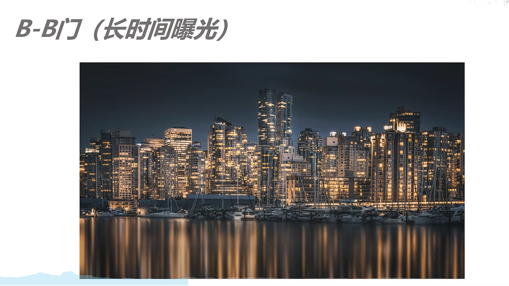
- 操作方式：按下快门，就会进行曝光，直到手松开才结束曝光

### 1.3.4 自定义

- C1、C2、C3
  - 自定义模式，可以把前面的挡位注册成你常用的参数，设置到这些挡位之中

### 1.3.5 对焦模式

- ONE SHOT/AF-S：半按快门自动对焦（只对一次焦），适合静态物体的拍摄
- AI SERVO/AF-C：半按快门自动对焦（连续对焦），适合运动物体的拍摄
- AI FOCUS/AF-A：识别场景，对上面两个对焦方式自动切换

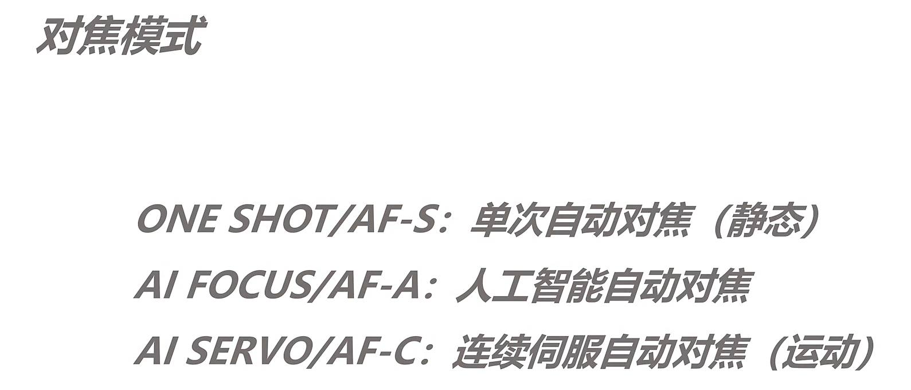

### 1.3.6 对焦区域

- 对焦区域：在这个对焦当中，被对焦物体的区域的大小（或者说精确程度）

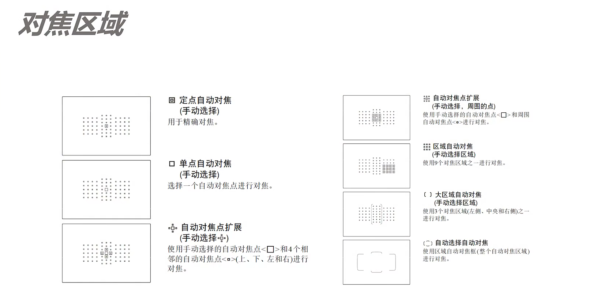

- 单点自动对焦：适合拍摄精确的物体，静物、前景有遮挡的时候
- 扩展点的对焦：轻微运动的物体