# Tailwind CSS 


- 官网： https://www.tailwindcss.cn/docs/installation

# 一 环境篇

> `包括Tailwind简介`、·`tailwindcss的优势`、`如何快速创建项目`、`turbopack`简介及优势、`TailwindCss相关插件（官方插件和类名排序插件的用法，以及其它特殊场景如何做排序，包括clsx类名拼接额外知识拓展等）`、`已有css知识体系如何快速跟TailwindCss做关联`等等

## 1.1 TailwindCss是什么

> 江湖有言：`TailwindCss`是目前最流行的 “原子化CSS框架” ？😱 并且截止目前为止已经斩获[83.6k stars](https://link.juejin.cn/?target=https%3A%2F%2Fgithub.com%2Ftailwindlabs%2Ftailwindcss)，而且社区也是异常的活跃👍🏻。它到底是怎么样一种框架？

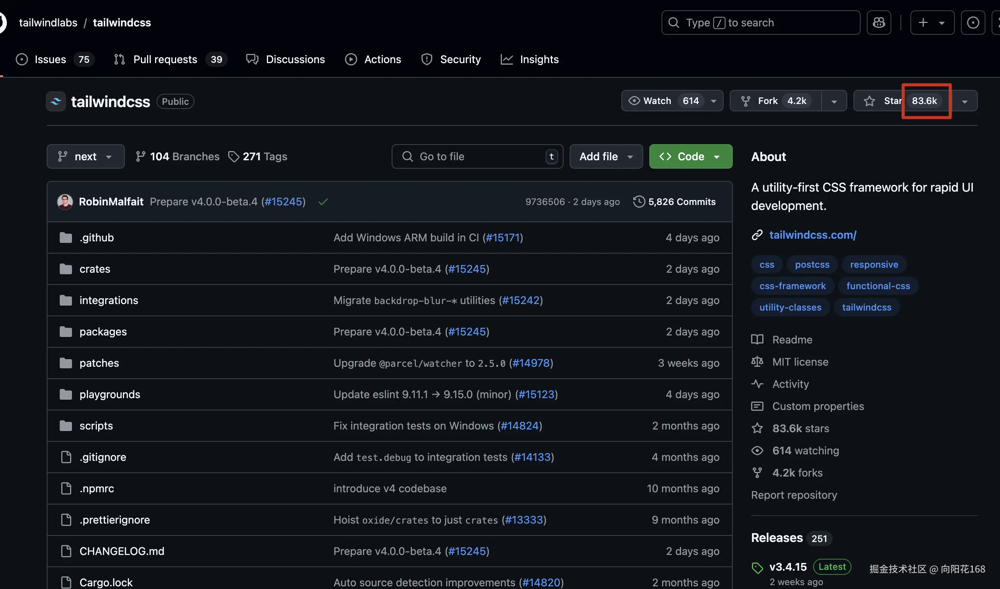

## 1.2 TailwindCss特点

> 可高度定制化
>
> 不同于less、scss、sass这类库还需我们手写css样式再引入，TailwindCss为我们`提供了大量系统预设类名`以及一些`基础设计套件`，比如`尺寸`、`配色`、`布局`、`阴影`等。当然也`支持自定义`，在无需手动编写与导入css样式的情况下`非常快速的呈现界面`（换用官方的话，就是让你不离开html而开发界面😄）

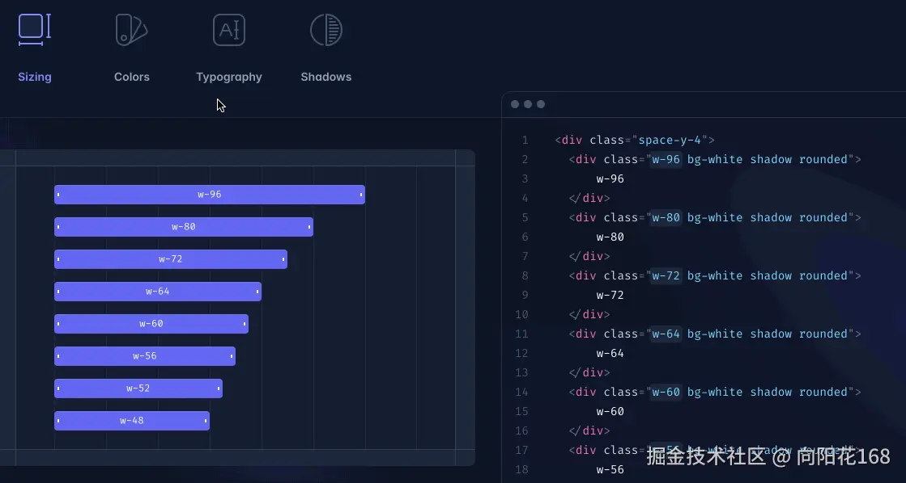

> 性能优化
>
> 通过按需加载样式类，TailwindCss可以显著减少css文件大小，提高页面加载速度(至于为何提高的后文也有提及)。关于显著提升文件体积这块，有一个原因是基于它`样式的可复用性`，举例： 如果不使用这类原子化的CSS框架，我们在页面中不同层级元素中或多或少存在着一些重复的样式，打包时会重复打包；而直接用TailwindCSS，是`原子化最小粒度的引用`，比如`text-red-500`，哪怕全局引用100次它也只会产生一份！

> 强大的响应式集成
>
> 产物单位会自动转换成`rem`，当然也可以是其它比如`em`或者`px`等。再也无需通过媒体查询、百分比等一系列手段实现响应式了。

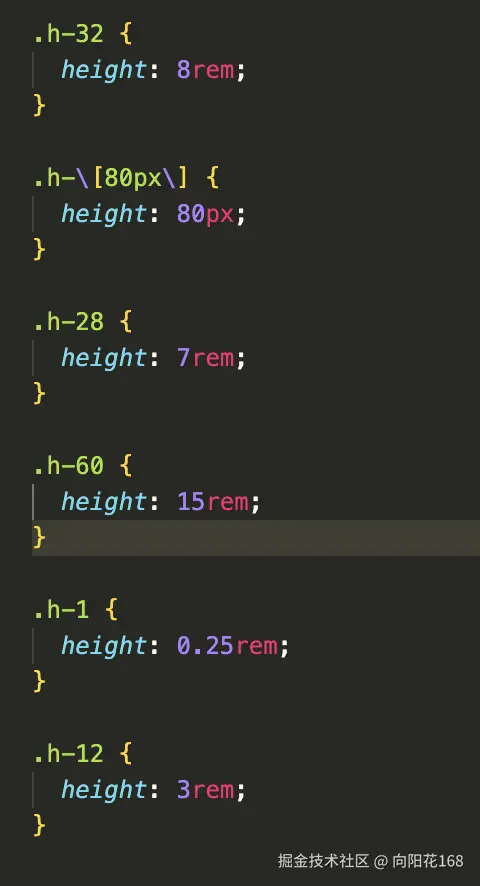

## 1.3 安装

> https://www.tailwindcss.cn/docs/installation

#  二 TailwindCss 实践

## 2.1 基础宽高

> [!TIP]
>
> - 使用系统预设宽高：`w-xx、h-xx`
> - 其中*w*表示宽度，*h*表示高度，`h-14`表示高度为`3.5rem`，对应`56px`；同理，`w-52`则表示宽度为`13rem`，对应`208px`

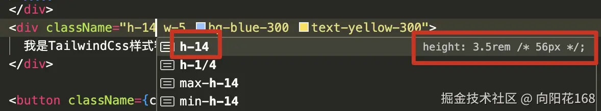

> [!TIP]
>
> 如何自定义其它数值？
>
> 可以使用`方括号[]`自定义任意数值，比如`px`、`rem`、`em`等。

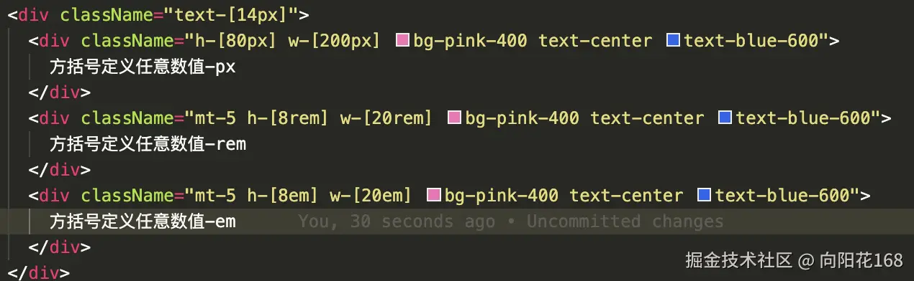

> [!TIP]
>
> - 如何自定义百分比数值？
> - 我们可以使用`w-分子/分母`、`h-分子/分母`表示

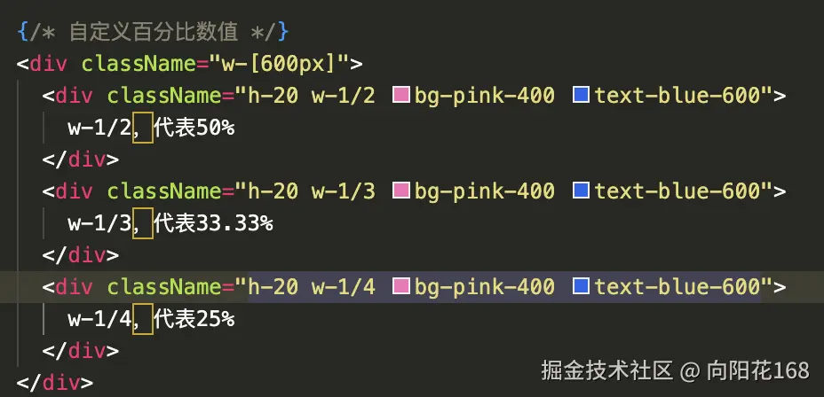

>[!TIP]
>
>- `w-full`和`w-screen`
>- w-full`和`w-screen`分别表示`撑满容器的100%`和`撑满设备屏幕的100%`，其中`w-screen相当于100vw

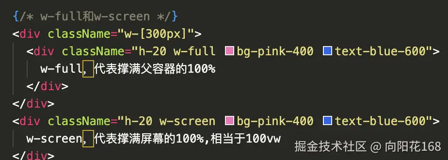

> [!TIP]
>
> `min-w-[]` 和`max-w-[]` 分别表示`最小`和`最大`宽度，`min-h-[]` 和`max-h-[]` 分别表示最小和最大高度
>
> 以`max-w-52`为例，代表最大宽度`13rem，208px`

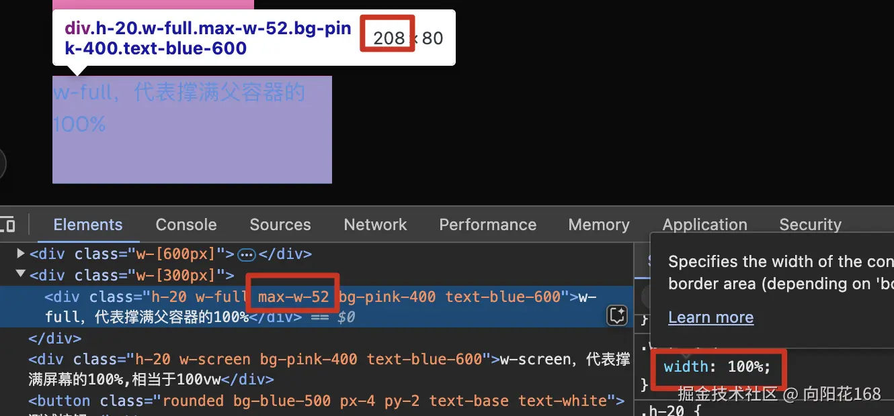

> [!WARNING]
>
> 核心概念
>
> Tailwind CSS 提供了一套完整的宽高(Width/Height)工具类系统，主要特点包括：
>
> 1. **基于rem单位**：默认使用rem单位(1rem=16px)，确保响应式设计
> 2. **预设尺寸**：提供从0到64(0.25rem到16rem)的增量尺寸
> 3. **百分比支持**：支持1/2、1/3、2/3、1/4、3/4等常见百分比
> 4. **特殊值**：full(100%)、screen(100vh/100vw)、auto、min/max-content等
>
> 宽度(Width)类
>
> 固定宽度
>
> - `w-{size}`：0-96预设尺寸(增量为4)
> - `w-px`：1像素宽度
> - `w-{fraction}`：1/2、1/3、2/3、1/4、3/4等分数宽度
> - `w-full`：100%宽度
> - `w-screen`：100vw宽度
> - `w-min`：min-content宽度
> - `w-max`：max-content宽度
>
> 最小/最大宽度
>
> - `min-w-{size}`：最小宽度
> - `max-w-{size}`：最大宽度(包括xs-7xl预设断点)
>
> 高度(Height)类
>
> 固定高度
>
> - `h-{size}`：0-96预设尺寸(增量为4)
> - `h-px`：1像素高度
> - `h-{fraction}`：1/2、1/3等分数高度
> - `h-full`：100%高度
> - `h-screen`：100vh高度
> - `h-min`：min-content高度
> - `h-max`：max-content高度
>
> 最小/最大高度
>
> - `min-h-{size}`：最小高度
> - `max-h-{size}`：最大高度
>
> 响应式设计
>
> 所有宽高类都支持响应式前缀：
>
> - `sm:`、`md:`、`lg:`、`xl:`、`2xl:`

## 2.2 边距

>  margin

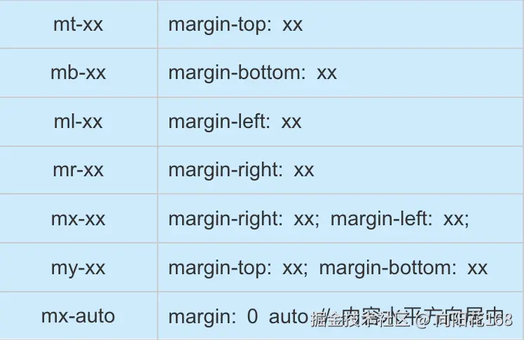

```html
<div class="m-0">无margin</div>
<div class="m-1">小margin (0.25rem/4px)</div>
<div class="m-2">margin (0.5rem/8px)</div>
<div class="m-4">margin (1rem/16px)</div>
<div class="m-8">大margin (2rem/32px)</div>
<div class="m-auto">自动margin (常用于居中)</div>
```

> padding

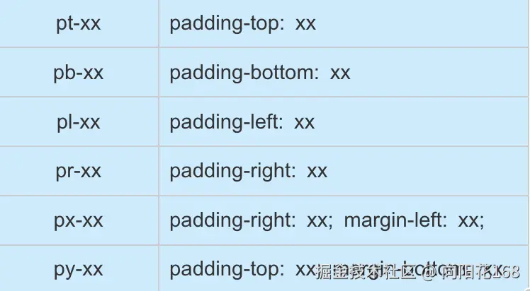

> space
>
> 写过React框架antd项目的同学一定非常清楚，space代表间距。具体值有`space-x-xx`和`space-y-xx`，分别表示`x`和`y`两个方向的间距，值会根据所选自动计算。

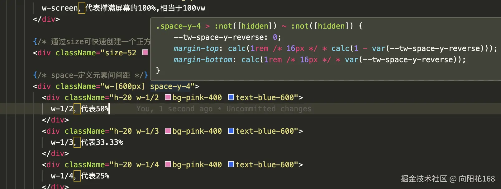

## 2.3 边框

> [!TIP]
>
> 定义线宽

| border      | border-width: 1px                              |
| ----------- | ---------------------------------------------- |
| border-xx   | 4个方向的border均为xx                          |
| border-t    | border-top-width: 1px                          |
| border-t-xx | border-top-width: xx                           |
| border-b-xx | border-bottom-width: xx                        |
| border-l-xx | border-left-width: xx                          |
| border-r-xx | border-right-width: xx                         |
| border-x-xx | border-right-width: xx; border-left-width: xx; |
| border-y-xx | border-top-width: xx; border-bottom-width: xx  |

> [!TIP]
>
> - 定义线颜色: `border-色系-色值`


> [!TIP]
>
> - 定义线类型

| border-solid  | border-style: solid  |
| ------------- | -------------------- |
| border-dashed | border-style: dashed |
| border-dotted | border-style: dotted |
| border-double | border-style: double |

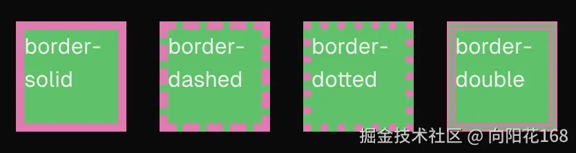

> [!TIP]
>
> - 自定义线弧度

| ounded       | border-radius: 0.25rem; /* 4px */                            |
| ------------ | ------------------------------------------------------------ |
| rounded-md   | border-radius: 0.375rem; /* 6px */                           |
| rounded-lg   | border-radius: 0.5rem; /* 8px */                             |
| rounded-full | border-start-start-radius: 9999px; border-end-start-radius: 9999px; |

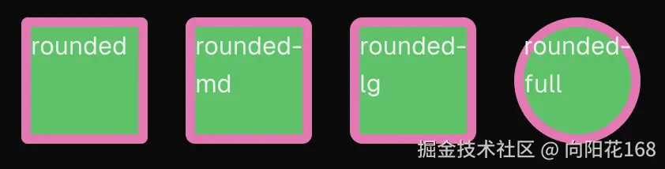