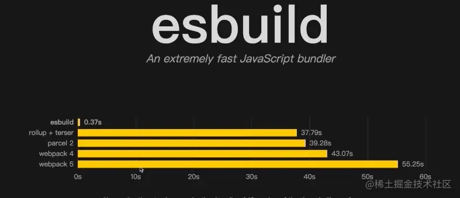

# vite 介绍

`vite` 是一个基于浏览器原生 `ES-Module` 的前端构建工具。官网描述为 `下一代前端开发与构建工具`。

* 参考博客：https://blog.csdn.net/lph159/category\_12790771.html

## 一 基本介绍

### 1.1 下一代

有下一代的概念，我们就先了解下什么是上一代工具。

* `es6` 出现之前我们的代码规范都是使用的社区规范，例如 `node` 使用的 `commonjs` 规范，还有服务客户端的 `AMD`、`CMD` 规范。

* `es6` 出现后，代码模块化有了语言规范，即 `ES-Module` 规范 所以既然有了官方的规范标准，我们就可以考虑抛弃社区规范，统一使用官方准则。

### 1.2 特点

* 快速的冷启动（使用了 `esbuild` 编译）

* 即时的模块热更新

* 真正的按需编译（利用原生能力，不能打包重新构建）

* 社区成本低（兼容 `rollup` 插件）

> 原理：利用 `ES6` 的 `import` 会发送请求去加载文件的特性，服务端对这些请求进行拦截，做一些预编译（浏览器不能识别 `.vue` 文件等），省去 webpack 冗长的打包时间。

### 1.3 Esbuild

类似 `webpack` 的前端构建工具，但是是使用 `go` 语言编写的，多线程并行执行



### 1.4 工具对比

前端目前常用的构建工具 `webpack`，包括我们使用的常见脚手架也都是基于它的。接下来对这两个工具做个大概对比：

* `webpack` 可以实现开发、构建、打包；`vite` 只是应用于开发、构建、阶段，打包依赖于 `rollup` 工具。

* `vite` 原理

  * 声明 `script` 标签类型要为 `module`

  * 浏览器发起一个 `get` 请求找到该文件

  * 如果文件中还有 `import` 的包，会继续发起请求

  * `vite` 的功能就是拦截浏览器发起的请求，在服务端对文件进行处理，在返回给浏览器，整个过程没有打包编译，所以速度快很多

* `vite` 解析实现过程如下:

  * 开发服务器使用 `http` + `connect` 构建服务

  * 通过多种中间件处理请求资源；也会遍历 `html` 节点，将元素的 `src` 属性添加上 `base` 前缀，将内联脚本转换为网络请求

  * 会通过 `es-module-lexer` 这个库分析出所有 `import` 语句

  * `vite` 会在请求后添加 `query` 参数的方式，用来标识当前请求的处理逻辑

* `webpack` 打包过程

  * 识别入口文件

  * 通过逐层模块依赖进行识别（对 `require`、`import` 进行分析获取依赖）

  * 针对不同的文件类型使用 `loader` 处理

  * 转换、编译、输出最终代码

* `webpack` 打包原理

  * 逐级递归识别依赖，构建依赖图谱

  * 将代码转为 `AST` 语法树

  * 在 `AST` 阶段处理代码

  * 把 `AST` 构建的语法树转为浏览器可识别的代码，输出

> 最后输出的文件可知，`webpack` 自己实现了 `require` 函数，进行文件依赖导入；赖加载的文件使用 `jsonp` 方式实现

### 1.5 `webpack` 缺点及 `vite` 改进

* `webpack` 冷启动慢，因为需要对所有文件都进行编译；`vite` 使用浏览器原生 `ESM` 能力，只在当前屏幕使用的文件才会处理，不用都编译。


* `webpack` 中使用 `nodejs` 编写的打包器构建；`vite` 使用 `esbuild（go）` 构建依赖，比 `javascript` 编写的工具快

* `webpack` 编辑文件后将重新热替换文件（模块）本身，热更新效率随着项目体积增大变慢；`vite` 中，`HMR` 是在原生 `ESM` 上执行的，无论应用体积大小，都能更精准的更新模块本身。同时也利用了强缓存和协商缓存避免不需要的请求。

* `webpack` 已经更新到的第五代，`loader` 和 `plugin` 丰富，生态优于 `vite`。但是 `vite` 发展势头正猛，相信社区发展也只是时间问题

* `vite` 的打包目前还依赖于 `rollup`

* `vite` 针对 `vue`，`react`， `svelte` 都有提供基础模板

## 二 配置文件

* 详细参考：https://vitejs.cn/vite5-cn/config/

* Vite 的配置文件 vite.config.js 是 Vite 项目中的核心配置文件。

* 通过这个文件，你可以对项目的开发服务器、插件系统、打包配置等进行自定义。

* Vite 的配置文件使用 CommonJS 格式导出一个配置对象，或者使用 ES 模块的 export default 导出。

```javascript
// vite.config.js
import { defineConfig } from 'vite';

export default defineConfig({
  // 配置选项
});

```

### 2.1 配置文件结构

Vite 的配置文件包含多个配置项，常见的配置项包括 `root`、`base`、`server`、`build` 和 `plugins`。接下来我们将逐一介绍每个配置项的作用及其常见用法。

#### 2.1.1 root

root 配置项用于指定项目的根目录，默认情况下 Vite 会将当前工作目录作为项目的根目录。如果你的项目目录结构较为复杂，可以通过 root 配置项来显式指定项目根目录。

```javascript
export default defineConfig({
  root: './src', // 将根目录设置为 src 文件夹
});

```

#### 2.1.2 base&#x20;

base 配置项用于指定在开发或生产环境中，应用的公共基础路径。默认值为 '/'，你可以根据项目的部署需求进行调整。

```javascript
export default defineConfig({
  base: '/my-app/', // 应用将被部署到 /my-app/ 子路径
});
```

#### 2.1.3 server

server 配置项用于自定义 Vite 开发服务器的行为，它包含多个子配置项来控制服务器的端口、代理设置等。

> 端口

port 用于指定开发服务器的端口，默认端口是 3000。你可以根据需要修改为其他端口。

```javascript
export default defineConfig({
  server: {
    port: 8080, // 修改开发服务器端口为 8080
  },
});

```

> 代理

如果你的项目需要与后端 API 进行通信，可以通过 `proxy` 配置项为开发服务器配置代理，以避免跨域问题。

```javascript
export default defineConfig({
  server: {
    proxy: {
      '/api': {
        target: 'http://localhost:5000', // 代理到后端 API 服务
        changeOrigin: true,
        rewrite: (path) => path.replace(/^\/api/, ''), // 去除 /api 前缀
      },
    },
  },
});

```

#### 2.1.4 build&#x20;

build 配置项用于自定义项目的打包行为，Vite 的生产环境构建基于 Rollup，因此很多 Rollup 的配置选项也可以在 build 中使用。

> 打包路径

通过 `outDir` 配置项，你可以指定生产环境打包文件的输出目录，默认输出到 `dist` 目录。

```javascript
export default defineConfig({
  build: {
    outDir: 'build', // 将打包后的文件输出到 build 目录
  },
});
```

> 代码压缩

Vite 默认会对生产环境的代码进行压缩，你可以通过 `minify` 配置项来选择压缩方式或关闭压缩。支持的压缩选项包括 `terser` 和 `esbuild`。

```javascript
export default defineConfig({
  build: {
    minify: 'terser', // 使用 terser 进行压缩
  },
});

```

#### 2.1.5 plugins&#x20;

Vite 具有强大的插件系统，允许你在开发和构建过程中扩展其功能。Vite 插件可以通过 `plugins` 配置项进行配置，插件可以是自定义插件或官方/社区提供的插件。

> 使用插件

&#x20;Vite 配置文件中使用官方提供的 Vue 插件。

```javascript
import { fileURLToPath, URL } from 'node:url'

import { defineConfig } from 'vite'
import vue from '@vitejs/plugin-vue'
import vueDevTools from 'vite-plugin-vue-devtools'
import VueSetupExtend from 'vite-plugin-vue-setup-extend'
// https://vite.dev/config/
export default defineConfig({
  plugins: [
    vue(),
    vueDevTools(),
    VueSetupExtend()
  ],
  resolve: {
    alias: {
      '@': fileURLToPath(new URL('./src', import.meta.url))
    },
  },
})

```

> 自定义插件

你也可以创建自定义插件，通过 `resolveId`、`load`、`transform` 等钩子来控制模块的解析、加载和转换过程。

```javascript
export default defineConfig({
  plugins: [
    {
      name: 'my-plugin',
      transform(code, id) {
        if (id.endsWith('.js')) {
          return code.replace('__VERSION__', '"1.0.0"');
        }
      },
    },
  ],
});

```

#### 2.1.6 配置案例

```javascript
import { defineConfig } from 'vite';
import vue from '@vitejs/plugin-vue';

export default defineConfig({
  root: './src', // 指定项目根目录
  base: '/app/', // 公共基础路径
  plugins: [vue()], // 使用 Vue 插件
  server: {
    port: 8080, // 指定开发服务器端口
    proxy: {
      '/api': {
        target: 'http://localhost:3000',
        changeOrigin: true,
      },
    },
  },
  build: {
    outDir: '../dist', // 打包输出目录
    minify: 'esbuild', // 使用 esbuild 进行压缩
  },
});

```

### 2.2 Vite 配置的最佳实践

#### 2.2.1 区分开发与生产环境

在实际项目中，开发环境和生产环境的配置通常是不同的。你可以通过 `mode` 或环境变量来区分不同的环境配置。

```javascript
export default defineConfig(({ mode }) => {
  if (mode === 'development') {
    return {
      server: {
        port: 3000,
      },
    };
  } else {
    return {
      build: {
        minify: 'terser',
      },
    };
  }
});

```

#### 2.2.2 使用 `.env` 文件配置环境变量

Vite 支持通过 .env 文件配置环境变量，不同环境下可以使用不同的 .env 文件来定义变量。例如，使用 .env.production 为生产环境定义变量。

```javascript
VITE_API_URL=https://api.example.com
```

### 2.3 配置环境变量

#### 2.3.1 文件命名规则

* Vite 默认会根据项目根目录下的 .env 文件来加载环境变量。以下是几种常见的环境变量文件：

* .env：应用在所有环境中都通用的环境变量。

* .env.development：仅在开发环境中使用的环境变量。

* .env.production：仅在生产环境中使用的环境变量。

* Vite 会根据当前运行的模式（mode）自动加载对应的 .env 文件。

* 例如，在开发模式下会优先加载 .env.development，在生产模式下则加载 .env.production。

#### 2.3.2 文件格式

在 `.env` 文件中，每个环境变量以 `KEY=VALUE` 的形式定义：

```javascript
VITE_APP_TITLE=我的Vite应用
VITE_API_URL=https://api.example.com
```

在这个例子中，定义了两个环境变量：`VITE_APP_TITLE` 表示应用的标题，`VITE_API_URL` 表示 API 的基础 URL。

#### 2.3.3 环境变量的作用范围

Vite 的环境变量可以作用于：

* **客户端代码**：自定义的环境变量（必须以 `VITE_` 开头）可以在客户端代码中通过 `import.meta.env` 进行访问。

* **构建时行为**：某些环境变量（如 `VITE_APP_TITLE`）可以在构建时影响应用的行为，例如动态设置应用的标题。

#### 2.3.4 常用的 Vite 环境变量

* import.meta.env.MODE： 表示当前的构建模式，通常为 `development` 或 `production`。可以根据这个变量来判断应用当前运行在哪种模式下，并做相应的处理。

* import.meta.env.BASE\_URL：表示项目的基础路径。通常用于配置静态资源的加载路径，尤其是在将应用部署到子路径时非常有用。

* import.meta.env.PROD 和 import.meta.env.DEV：分别表示当前是否处于生产模式或开发模式，返回布尔值。可以使用这两个变量来简化代码中的环境判断。

#### 2.3.5 案例 vue3封装统一的axios请求

```javascript
import axios from "axios";

// 实例
const createInstance = (baseURL:string)=>{
    return axios.create({
        baseURL:baseURL,
        timeout: 1000,
        headers: {'X-Custom-Header': 'yma16'}
    })
};

// @ts-ignore
const http:any=createInstance('');


// 添加请求拦截器
http.interceptors.request.use(function (config:any) {
    // 在发送请求之前做些什么
    return config;
}, function (error:any) {
    // 对请求错误做些什么
    return Promise.reject(error);
});

// 添加响应拦截器
http.interceptors.response.use(function (response:any) {
    // 2xx 范围内的状态码都会触发该函数。
    // 对响应数据做点什么
    return response;
}, function (error:any) {
    // 超出 2xx 范围的状态码都会触发该函数。
    // 对响应错误做点什么
    return Promise.reject(error);
});

export {http};


```